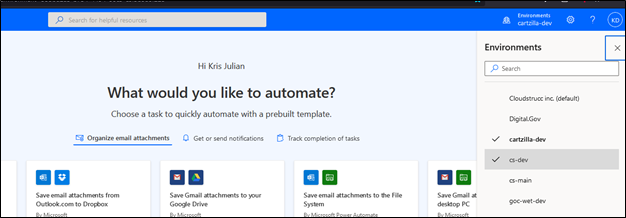
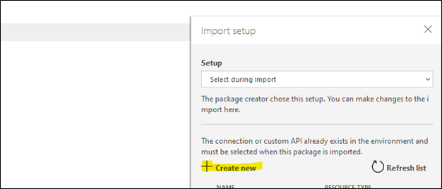
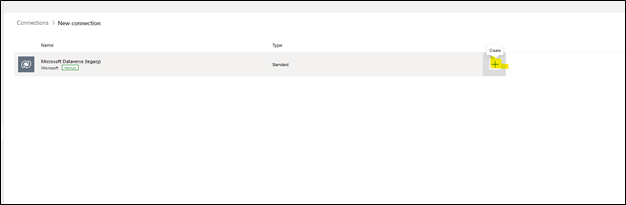

# QuickBooks Custom Connectors

---

# Part A – Importing Custom QuickBooks connector
1.	Navigate to Power Automate - https://powerautomate.microsoft.com/

2.	Sign in by clicking the ‘Sign in’ button on the top right of the screen:

  

3.	Once on the PowerAutomate website, navigate to the environment for which you want to import the QuickBooks Integration flows:

  

4.	Once in your environment under the data section, click custom connectors:

 

5.	On the custom connector page, click the new customer connector button and select ‘import an OpenAPI file’:

 

6.	Give your connector a name and under the import field, navigate to where your custom connector file is located on your system (ending in .json), then click continue.

 

7.	Once on this screen, click the Security step:

 
 
8.	On the Security section, you are required to fill out the client id and client secret. These are obtained from the QuickBooks develop website: 

https://developer.intuit.com/app/developer/homepage

  

a)	Once on the QuickBooks develop or site, login and navigate to the dashboard page, and click ‘create an app’. Choose QuickBooks online and Payments, give your app a name, and select the ‘com.intuit.quickbooks.accounting’ as scope.
 
 

 

b)	 Click on the app name, and once on the page navigate to the keys and credentials section under Development Settings
 

  
  
 

c)	Make note (copy) of the client ID and client secret in a notepad

d)	Under the Redirect URIs section of the page click add URI and copy and the paste the following address- https://global.consent.azure-apim.net/redirect then click save.

 

9.	Once completing the QuickBooks developer configuration, navigate back to the Power Automate security step and fill in the client ID and client secret that was copied onto a notepad in step 8c. For the Refresh URL field enter the following address: https://oauth.platform.intuit.com/oauth2/v1/tokens/bearer

 
 
10.	 Finally, click create connector and wait for it to be saved. Then navigate to the test tab and click on new connection. You will be prompted to sign into your QuickBooks account at this stage and grant permission.

 

# Part B – Importing a Flow

1.	Navigate to the My flows section on Power Automate then click the import button:

 

2.	Click the upload button and navigate to the Power Automate file you want to import (ending in .zip)

 
 

3.	On the import page, you will see the following: 

  

There will have to a connection made for each resource. To create the connection, click ‘select during import for each resource.

For the QuickBooks Connector and QuickBooks Connection resource type, you should see an entry (created from the previous steps in Part A).

For the Microsoft Dataverse (legacy) and Microsoft Dataverse Connections, you will have to create these manually. To do so, click the ‘create new’ button on the Import setup sidebar

  

Then on the connections page, search for Microsoft Dataverse (legacy) the click the plus button:

  
  
You will then be promoted to sign in.
Repeat the same step for the Microsoft Dateverse connector.

4.	Finally, navigate back to the import page and refresh the list if the connections still does not show. Once there is a connection click on user email.

 
 

5.	Finally, once all connections have been established, you should see no red indicators on any of the resources. Then click the import button.

  

Once the flow has been imported, navigate back to the My flows section, and you should now see the flow

 
 