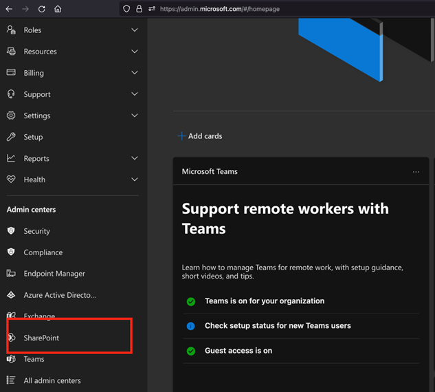
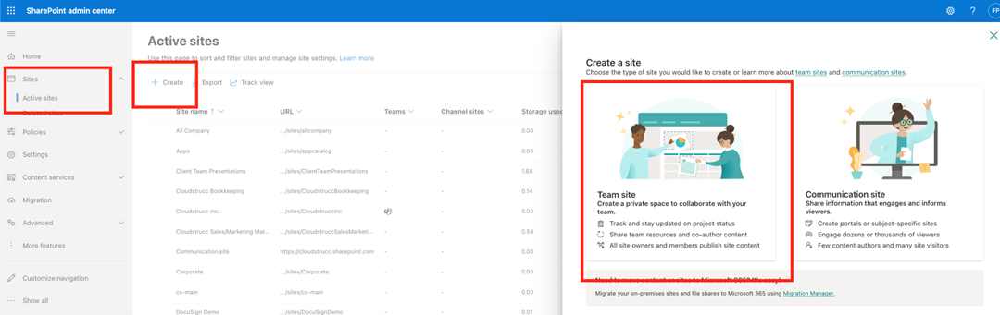
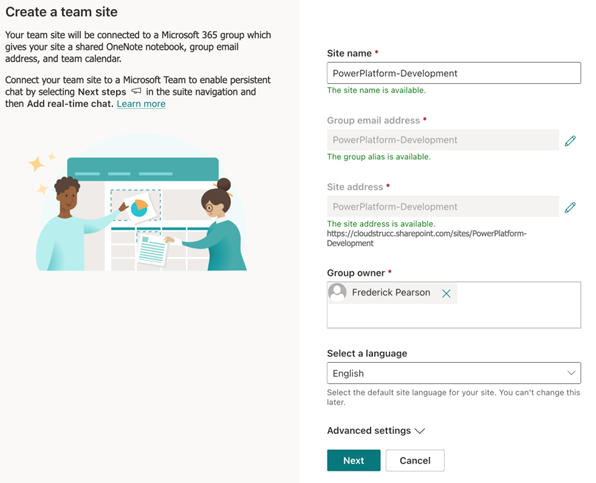
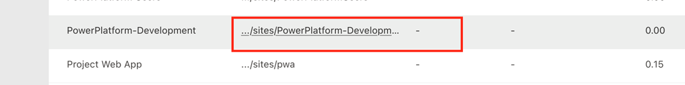

# Crating a SharePoint Site to host Subsites that will integrate with Dataverse environments

Navigate to the SharePoint Online Admin Centre and create a new Site. Ensure to set ownership rights to the PowerPlatform Service Administrator (not the Application layer / Dataverse environment administrator). This will allow the PowerPlatform Service Administrators to create additional subsites in the future for new Dataverse environments without intervention (optional).  Go to https://admin.microsoft.com and ensure that all admin centers are rendred (click “show all” on the left menu) and press “SharePoint”. 

In the SharePoint admin centre, select Sites and Active Sites, then press “Create” and “Team Site”.

Enter the required details for the Team Site and ensure to set additional site owners, press next and finish (assigned site  owners can add members to the site in the future). **Note the site can take up to 1 hour to fully provision.**

Once the site is created provide the Site URL to the PowerPlatform administrator (owner set for the PowerPlatform-Development site) – you can click on the link in the Site list

