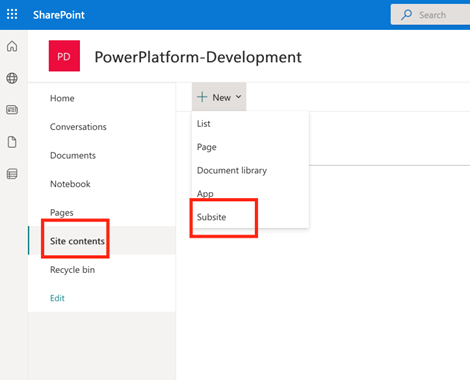
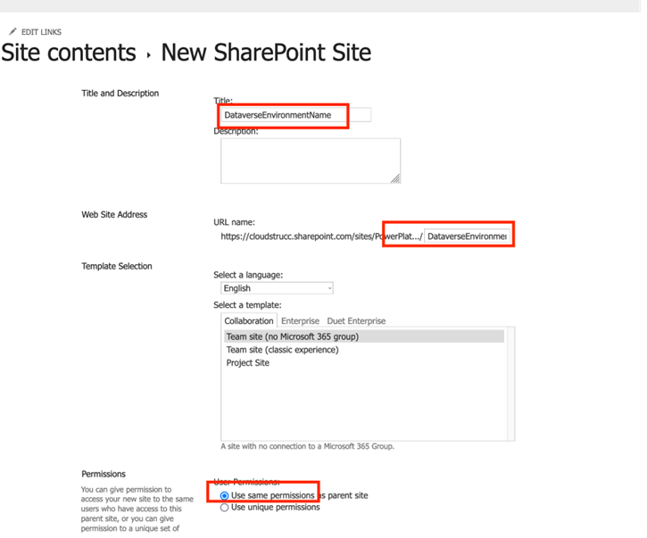
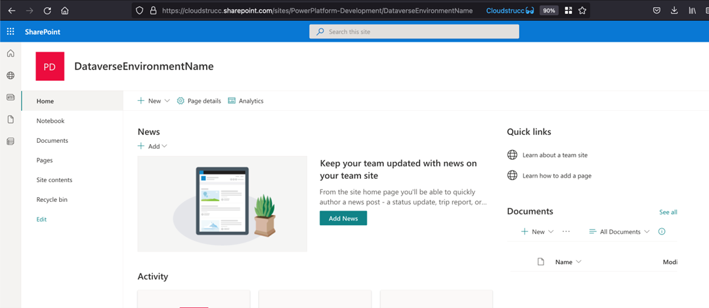

# Creating Subsites

Once a site has been created, you or another Site owner will need to create a subsite(s) per Dataverse environment. To create a subsite, navigate to the Site Contents menu, press New and select Subsite.

Enter the site name which should match the name of the Dataverse environment (suggested convention) and the site address. Ensure to leave the “use same permissions as parent site” radio button selected.  Press Create. This process can take up to 30 minutes.

Once created provide the new Subsite’s URL to the Dataverse application administrator to set up the integration with the Dataverse environment

