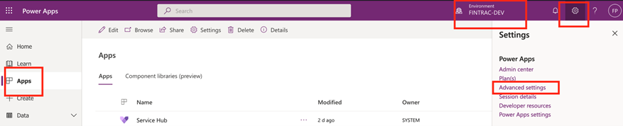
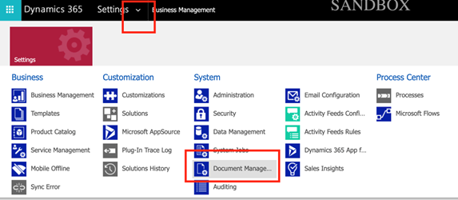
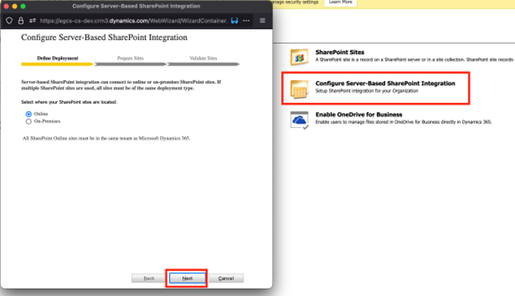
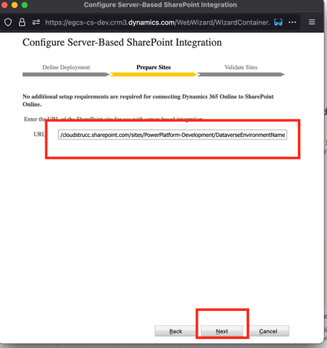
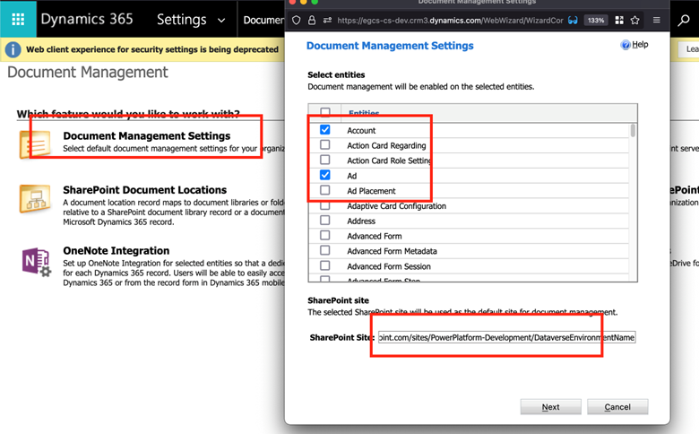
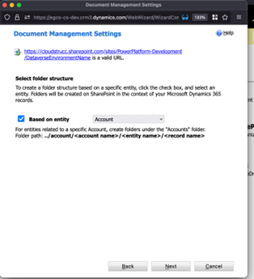
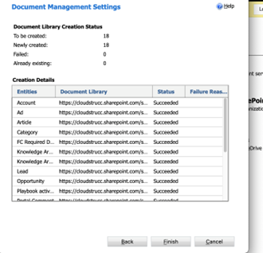
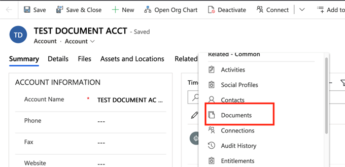
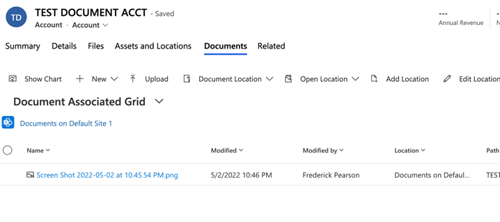
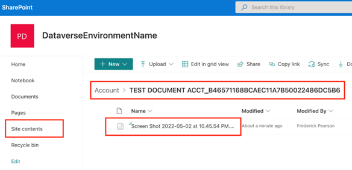

# Steps to configure SharePoint Integration

Navigate to https://make.powerapps.com and select the environment where SharePoint integration will be configured. Once selected, click on the Gear icon and “Advanced Settings”

In the advanced settings navigate to document management.

In the Document Management Settings, click on “Configure Server-Based SharePoint Integration” and in the modal press next, enter the SharePoint Subsite URL, press next again

In the Validate Sites step, press finish, once validated. If you receive an error it is likely due to permission issues.

Next, click on “Document Management Settings” and select the tables whose records allow document attachments to be stored in SharePoint, paste in the Subsite and press next.

Select “based on entity”. This will ensure that each configured table will have a dedicated folder and within these folders, a folder for each record will be created that houses the attachments associated to the record.

Press “Finish” once completed

Now that the SharePoint Subsite is integration with this environment, you can test by navigating to any record from a table you’ve configured and you will notice a new relationship entitled “Documents”. 

You can test uploading a document and verifying that the document is found in the SharePoint Subsite 

