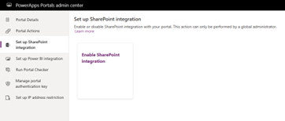
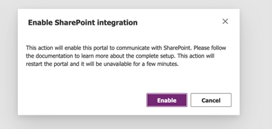
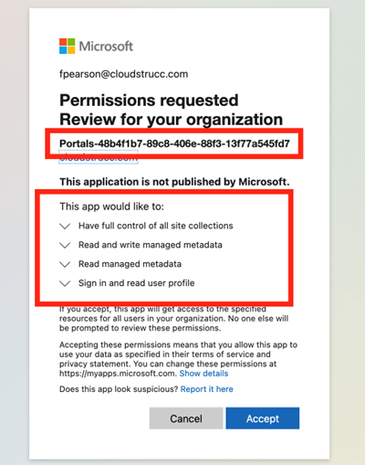
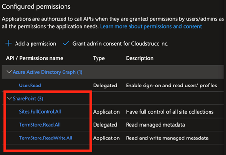
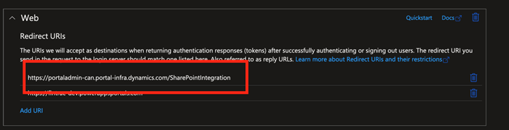

# Steps to configure the SharePoint Integration for PowerApps Portals

In the PowerApps Portals admin centre, navigate to “Set up SharePoint Integration” and click on “Enable SharePoint Integration”

Select “Enable” in the confirmation window. This will enable the portal to communicate with SharePoint. While the SharePoint integration is being enabled, the portal restarts and will be unavailable for a few minutes. A message appears when SharePoint integration is enabled.

You will be prompted to authenticate the request and attest an amendment performed to the Portals App Registration record. 

Once accepted the process will update the **<u>PowerApps Portal App registration record</u>** in the background by adding the following API Permissions. You can view these changes by navigating to “App Registrations” in the Azure Portal and searching for the app registration highlighted above. You can then navigate to the App Registration’s API Permissions menu blade to view the changes.

The update will also include an additional “redirect URI” which is part of the OAUTH 2.0 specifications for authorization. This same redirect URI is registered in the SharePoint Site Configuration for OAUTH 2.0 API integration.

**This registration record has no owners beyond the Portal provisioner identity and is only leveraged for machine-to-machine flows between Portals, Dynamics 365, and SharePoint Online (for environments whose portals require integration with SharePoint Online).*