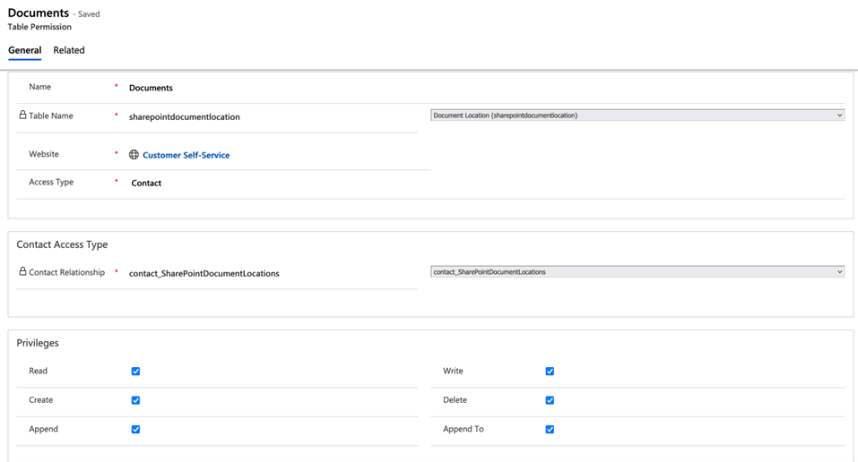
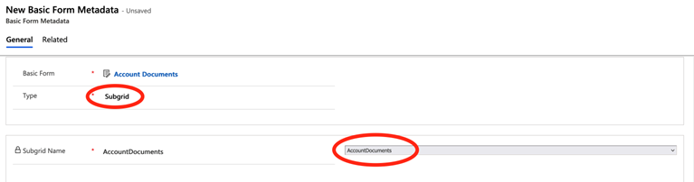
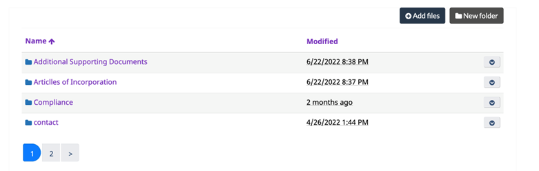

# Example integration of SharePoint upload feature in Portals

To expose an upload documents control in the Portal that points to the SharePoint document library associated to a record, the first step is to add a basic form metadata attribute to a form you are exposing to the portal. The configuration is detailed below.

## Step 1: Create a table permission

In this example, we are allowing only users who are primary contacts of an Account (Organization) to upload documents related to the organization. But as long as a table permission is created for the Document Location Table (Entity) the baseline security to allow the upload is configured. However it is recommended to scope the document management feature at the contact (user level) or organization level (e.g. for portals where you have multiple users belonging to the same organization and submitting documents on behalf of the entire organization rather than for their own application).

This example demonstrates allowing uploads only by the user and associated to their user account only

## Step 2: Basic Form Metadata

To render the document gird on a page or form, you must add a basic form metadata attribute of type subgrid. This subgrid must exist on the CRM form (and tab) that is being exposed to the portal

When creating the metadata record, select “Subgrid” and PowerApps will allow you to select the subgrid to render next to the subgrid name field. This subgrid must existing on the CRM form and must point to the “Document Location” table.

Once configured, the table should look like this (depending on your styling). 

