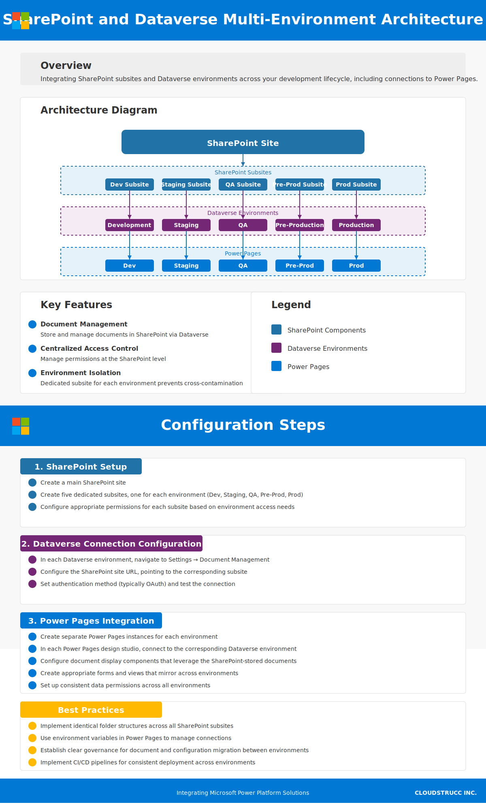

# Overview

This document outlines how a SharePoint site with subsites can integrate with multiple Dataverse environments across your development lifecycle (Dev, Staging, QA, Pre-Prod, and Prod), including connections to Power Pages for each environment.

## Architecture Diagram

:::mermaid
flowchart LR
SP[SharePoint Site] --> SP_Sub1[Dev Subsite]
SP[SharePoint Site] --> SP_Sub2[Staging Subsite]
SP[SharePoint Site] --> SP_Sub3[QA Subsite]
SP[SharePoint Site] --> SP_Sub4[Pre-Prod Subsite]
SP[SharePoint Site] --> SP_Sub5[Prod Subsite]
SP_Sub1 --> DEV[Development Environment]
SP_Sub2 --> STAGING[Staging Environment]
SP_Sub3 --> QA[QA Environment]
SP_Sub4 --> PREPROD[Pre-Production Environment]
SP_Sub5 --> PROD[Production Environment]
DEV --- PP_DEV[Power Pages - Dev]
STAGING --- PP_STAGING[Power Pages - Staging]
QA --- PP_QA[Power Pages - QA]
PREPROD --- PP_PREPROD[Power Pages - Pre-Prod]
PROD --- PP_PROD[Power Pages - Prod]
classDef sharepoint fill:#2072a7,color:white;
classDef dataverse fill:#742774,color:white;
classDef powerpages fill:#0078d4,color:white;
class SP,SP_Sub1,SP_Sub2,SP_Sub3,SP_Sub4,SP_Sub5 sharepoint;
class DEV,STAGING,QA,PREPROD,PROD dataverse;
class PP_DEV,PP_STAGING,PP_QA,PP_PREPROD,PP_PROD powerpages;
:::

## Key Features

- **Document Management**: Store and manage documents in SharePoint while linking them to Dataverse records
- **Centralized Access Control**: Manage permissions at the SharePoint level
- **Environment Isolation**: Dedicated subsite for each environment prevents cross-contamination
- **Complete Development Pipeline**: Full integration across all environments with corresponding Power Pages
- **Consistent User Experience**: Similar setup across all environments simplifies testing and deployment

## Configuration Steps

### 1. SharePoint Setup

1. Create a main SharePoint site
2. Create five dedicated subsites, one for each environment:
   - Dev Subsite
   - Staging Subsite
   - QA Subsite
   - Pre-Prod Subsite
   - Prod Subsite
3. Configure appropriate permissions for each subsite based on environment access needs

### 2. Dataverse Connection Configuration

1. In each Dataverse environment, navigate to **Settings → Document Management**
2. Select **Document Management Settings**
3. Choose **SharePoint** as the document storage location
4. Configure the SharePoint site URL, pointing to the corresponding subsite:
   - Dev environment → Dev Subsite
   - Staging environment → Staging Subsite
   - QA environment → QA Subsite
   - Pre-Production environment → Pre-Prod Subsite
   - Production environment → Prod Subsite
5. Set authentication method (typically OAuth)
6. Test the connection

### 3. Power Pages Integration

1. Create separate Power Pages instances for each environment
2. In each Power Pages design studio, connect to the corresponding Dataverse environment
3. Configure consistent data permissions across all environments
4. Set up document display components that leverage the SharePoint-stored documents
5. Create appropriate forms and views that mirror across environments

## Best Practices

- Implement identical folder structures across all SharePoint subsites
- Use environment variables in Power Pages to manage connections
- Establish clear governance for document and configuration migration between environments
- Implement CI/CD pipelines for consistent deployment across environments
- Schedule regular synchronization checks to ensure integration health

For detailed implementation guidance, refer to the Microsoft Power Platform documentation.
