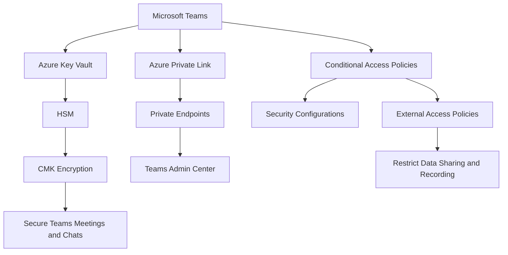
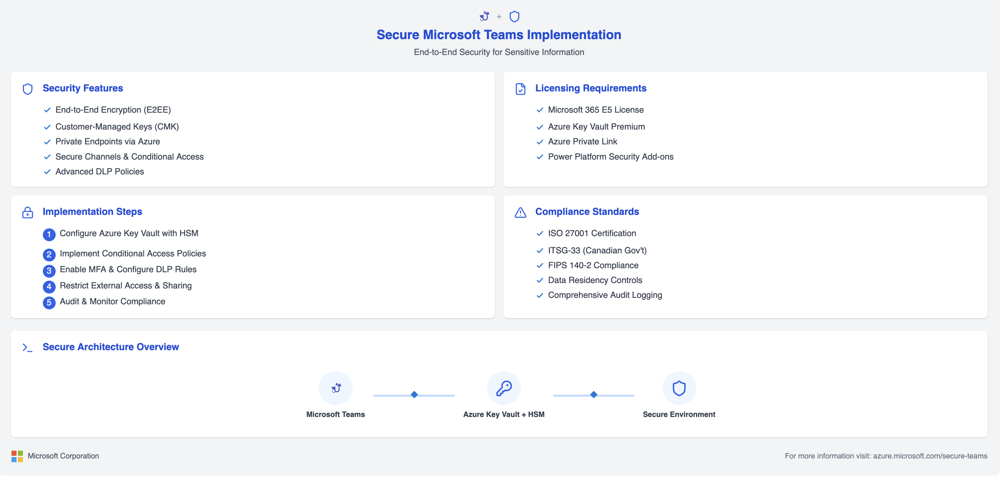

# 🔐 Secure Microsoft Teams Implementation for Sensitive Information

Organizations seeking to standardize their collaboration platforms around Microsoft Teams, while maintaining the highest levels of security for sensitive information, can implement a variety of Microsoft and Azure features to ensure end-to-end encryption and full control over their data. Below is a comprehensive guide outlining the technical steps, tools, licensing requirements, and security standards for achieving this in Microsoft Teams.

---

## 🛡️ **1. Microsoft Teams Security Overview**

Microsoft Teams, by default, uses end-to-end encryption for meetings and chats, but organizations can take additional measures to further enhance security, especially when dealing with sensitive or classified data. This includes utilizing customer-managed keys (CMK) with hardware security modules (HSM), configuring secure communication channels, integrating with Azure Key Vault, and more.

### **Key Security Features:**

1. **🔒 End-to-End Encryption for Teams Meetings** Microsoft Teams supports end-to-end encryption (E2EE) for meetings, where encryption keys are controlled by the organization, ensuring that data remains secure from unauthorized access.
2. **🔑 Customer-Managed Keys (CMK)** Organizations can configure Microsoft Teams to use CMKs, ensuring the encryption keys are controlled by the organization, not Microsoft. This is achieved through integration with Azure Key Vault and HSM.
3. **🔌 Private Endpoints for Teams** To ensure that all communication happens over secure, private channels, organizations can configure private endpoints for Microsoft Teams traffic using Azure Private Link. This prevents data from traversing the public internet and ensures that all traffic remains within the private network.
4. **💬 Secure Channels in Teams** Organizations can configure specific secure channels within Teams to restrict sensitive communications to only authorized users. These secure channels can have additional security measures, such as multi-factor authentication (MFA) or conditional access policies.
5. **⚡ Power Platform Integration**
   For organizations using Power Platform, integrations with Teams can be set up in a secure manner by leveraging secure app registration, data loss prevention (DLP) policies, and ensuring all integrations pass through secure, compliant APIs.

---

## 💼 **2. Licensing Requirements**

To achieve the desired level of security, organizations may need to upgrade their existing Microsoft 365 Business Premium licenses. Below are the licensing tiers and add-ons required to enable the necessary security features:

* **📊 Microsoft 365 Business Premium** Provides access to basic security features, but it may require additional add-ons for CMK, HSM integration, and private endpoints.
* **📈 Microsoft 365 E5 License** This tier includes advanced security features such as Information Protection, Advanced Threat Protection (ATP), and compliance management. This license is necessary for configuring advanced encryption, auditing, and monitoring capabilities.
* **🗃️ Azure Key Vault** Organizations can store and manage encryption keys in Azure Key Vault. The **Standard** tier of Azure Key Vault is sufficient for most scenarios, but organizations requiring HSM support will need the **Premium** tier.
* **🔗 Azure Private Link**
  To configure private endpoints for Teams, an Azure subscription is required. Pricing varies depending on the region and the data traffic volume.

---

## 🗝️ **3. Azure Key Vault and HSM Integration**

**Azure Key Vault** enables organizations to securely store and manage encryption keys, secrets, and certificates. By integrating with **Hardware Security Modules (HSM)**, organizations can achieve the highest level of security, ensuring that the encryption keys are physically protected and not exposed to unauthorized parties.

### **Steps for Key Vault and HSM Integration:**

1. **📝 Create a Key Vault** In the Azure portal, navigate to "Key Vaults" and create a new Key Vault. Ensure that HSM-backed keys are enabled during the setup.
2. **🔄 Integrate Key Vault with Teams** Configure Microsoft Teams to use CMK stored in Azure Key Vault. This can be done by navigating to the Teams admin center and selecting the encryption settings, where the Key Vault keys will be used.
3. **💻 Use HSM for Key Storage**
   Organizations can store the keys in HSM-backed Key Vaults to enhance security. This requires the **Premium tier** of Azure Key Vault.

### **Pricing Considerations for Azure Key Vault and HSM:**

* **Azure Key Vault Standard**: $0.03 per 10,000 operations
* **Azure Key Vault Premium (with HSM)**: $1.00 per month per key plus operations fees
* **Azure Private Link**: Pricing based on data volume and region.

---

## 🔐 **4. Configuring Secure Channels in Teams**

Organizations can create and enforce secure communication channels within Microsoft Teams by applying additional security controls. For example, teams can enforce **Conditional Access Policies** to restrict access to sensitive channels based on device compliance and user identity.

### **Steps to Configure Secure Channels:**

1. **🚪 Conditional Access** Implement Conditional Access policies to ensure that only compliant devices can access sensitive Teams channels.
2. **🔢 Multi-Factor Authentication (MFA)** Enable MFA for all users accessing Teams, especially when dealing with sensitive information. This ensures that unauthorized access is prevented even if a password is compromised.
3. **🛑 DLP Policies in Teams**
   Organizations can configure Data Loss Prevention (DLP) policies to ensure that sensitive data is not shared outside of secure channels. For example, if a user tries to share an unencrypted document in a chat, the system will block it.

---

## 🔌 **5. Integrating with Power Platform for Secure Solutions**

For organizations using Microsoft Power Platform, integrations with Teams can be configured securely by enforcing DLP policies and using secure API connections. Power Platform apps can be embedded within Teams, but to maintain compliance and security, organizations should leverage **Microsoft Dataverse** and **Power Apps** security features.

### **Steps for Power Platform Integration:**

1. **📱 Power Apps in Teams** Embed Power Apps within Teams, but ensure that data access is controlled and that no sensitive information is exposed without proper encryption.
2. **🔍 DLP and Security Policies**
   Define DLP policies for Power Apps to ensure that sensitive data stored in Dataverse cannot be exposed via Teams or other Power Platform tools.

---

## 🚫 **6. Preventing External Users from Storing Data**

To ensure that external users who join Teams meetings cannot store unencrypted data on their devices or tenants, organizations can configure **External Access** and **Guest Access** policies in Teams. These settings can prevent external users from recording meetings or saving sensitive data locally.

### **Steps to Restrict External User Data Access:**

1. **🎥 Disable Meeting Recording for Guests** Configure Teams meeting policies to restrict guests from recording meetings. This ensures that no unauthorized meeting content is stored outside of the organization's control.
2. **📁 Restrict Data Sharing for External Users**
   Implement strict policies around sharing files or notes within meetings. Ensure that sensitive data cannot be downloaded or stored by external participants without encryption.

---

## 📜 **7. Security Standards and Compliance**

Organizations dealing with sensitive information, especially in the context of federal government contracts, must adhere to security standards such as **ISO 27001**, **ITSG-33** (IT Security Guidance for the Government of Canada), and **FIPS 140-2** (Federal Information Processing Standards). These standards provide guidance on how to securely manage information, implement encryption, and meet compliance requirements.

### **Key Security Standards:**

1. **📊 ISO 27001** Defines the requirements for an Information Security Management System (ISMS) to protect data and prevent unauthorized access.
2. **🛡️ ITSG-33** Provides specific guidance for IT security in Canadian government systems, including data protection and encryption.
3. **🔐 FIPS 140-2**
   Requires the use of cryptographic modules that are certified for use in federal systems.

---

## 📊 **8. Technical Diagram (Mermaid JS)**

Here is a simplified architecture diagram of the secure Microsoft Teams configuration:

---

## 🖼️ **9. Secure Microsoft Teams Implementation Infographic**

---

## 🏁 **Conclusion**

By leveraging the features of Microsoft Teams, Azure Key Vault, HSM, and conditional access policies, organizations can ensure that their video conferencing, chats, and other collaborative tools meet stringent security standards. Implementing these configurations will help organizations adhere to the necessary compliance regulations, ensuring that sensitive data is fully protected, even when interacting with external stakeholders.
