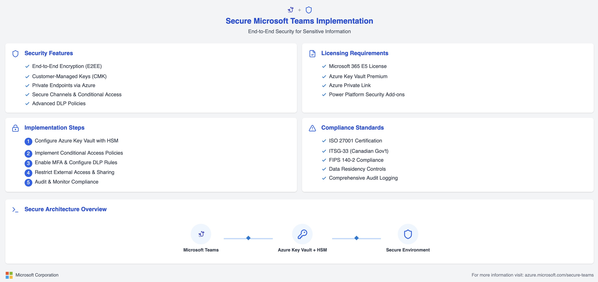
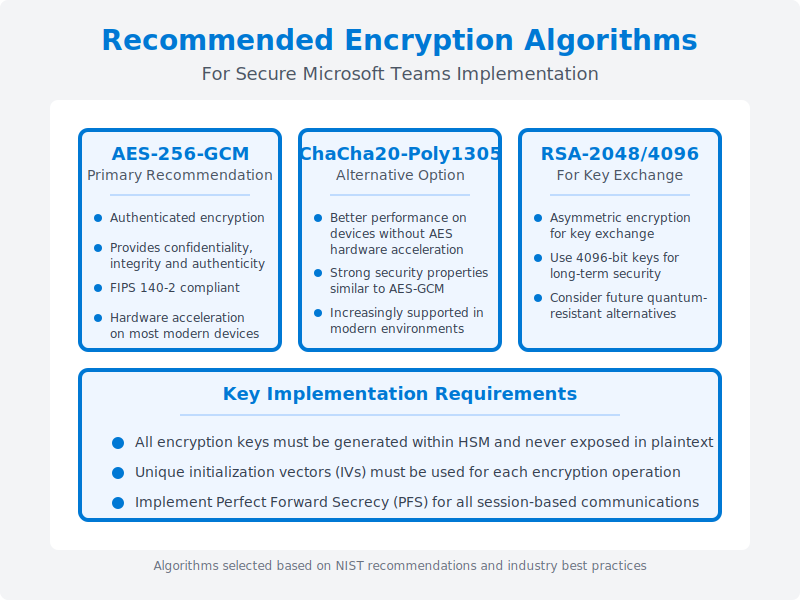
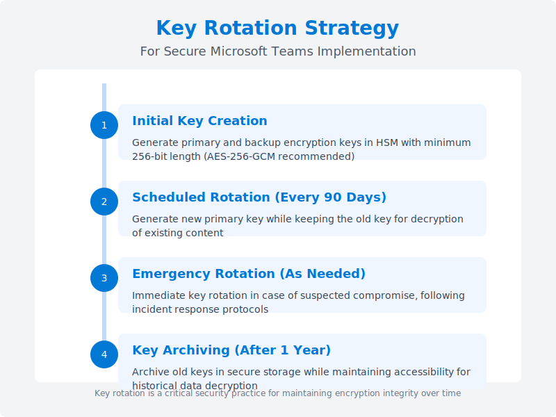
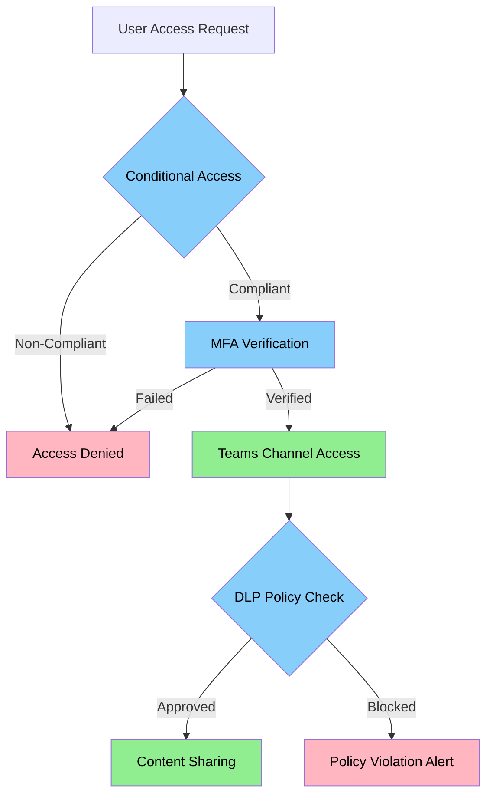
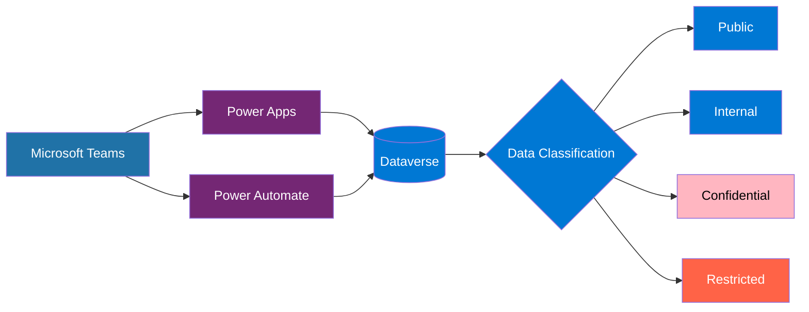
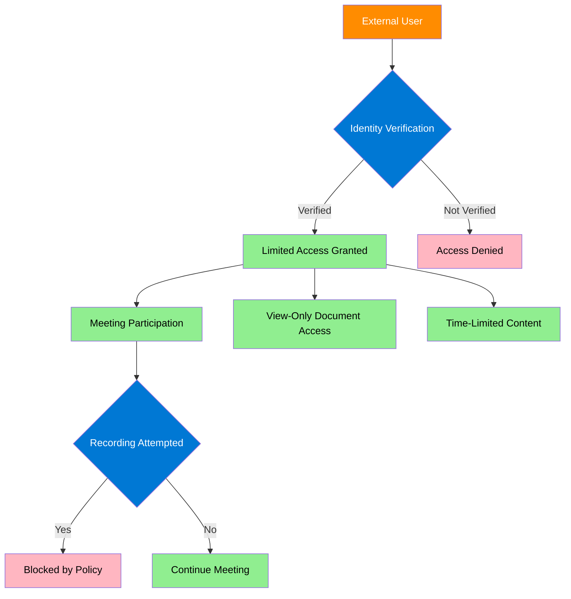
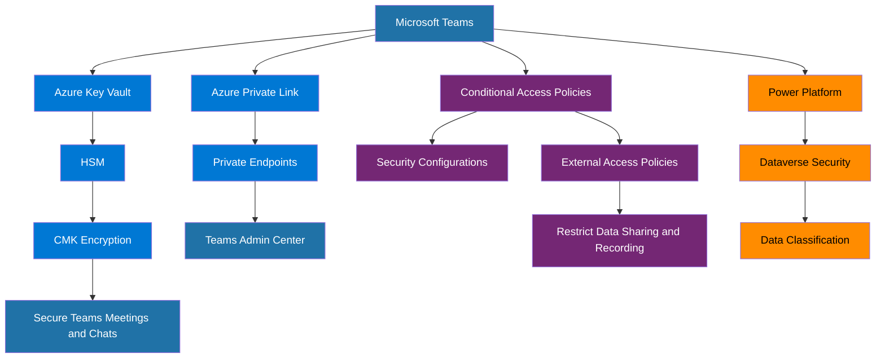

# 🔐 Secure Microsoft Teams Implementation for Sensitive Information

## Overview

This comprehensive guide is designed for organizations seeking to implement Microsoft Teams with the highest level of security for sensitive and classified information. As digital collaboration becomes increasingly central to business operations, protecting sensitive communications, data, and intellectual property is paramount. This document outlines the technical architecture, security features, encryption standards, and implementation steps required to deploy Microsoft Teams in high-security environments, such as those handling government, financial, healthcare, or confidential corporate data.

By following this guide, security architects and IT administrators can configure Microsoft Teams to meet stringent security standards, including end-to-end encryption, hardware-backed key security, secure network communications, and compliance with international security regulations. This implementation ensures that even in high-risk scenarios or when collaborating with external parties, sensitive information remains protected according to industry best practices and regulatory requirements.

## 🛡️ **1. Microsoft Teams Security Architecture**

Microsoft Teams can be configured to provide enterprise-grade security through a layered approach that combines encryption, access controls, and secure infrastructure. This configuration is particularly crucial for organizations handling sensitive information that requires protection beyond standard deployment.

### **Key Security Features:**

1. **🔒 End-to-End Encryption for Teams Meetings**Microsoft Teams supports end-to-end encryption (E2EE) for meetings, ensuring that meeting content is encrypted on the sender's device and only decrypted on the recipient's device. This prevents any intermediary, including Microsoft, from accessing the unencrypted content of sensitive meetings.
2. **🔑 Customer-Managed Keys (CMK)**Organizations can configure Microsoft Teams to use CMKs, ensuring full control over encryption keys. This is achieved through integration with Azure Key Vault and Hardware Security Modules (HSM), providing a critical security layer for organizations with strict data sovereignty requirements.
3. **🔌 Private Endpoints for Teams**To secure network communications, Teams traffic can be routed through Azure Private Link, establishing private endpoints that prevent data from traversing the public internet. This configuration keeps all Teams traffic within the organization's virtual network, significantly reducing the attack surface.
4. **💬 Secure Channels in Teams**Organizations can establish dedicated channels with enhanced security measures for sensitive communications. These secure channels can be protected with additional authentication requirements, conditional access policies, and specialized data loss prevention rules.
5. **⚡ Power Platform Integration**
   For organizations using Power Platform applications with Teams, secure integration can be established by implementing proper authentication, authorization, and data protection controls across the integration points.

### **HSM and Key Vault: Core Security Components**

HSM and Azure Key Vault form the foundation of secure key management for Microsoft Teams, both are defined below:

- **Hardware Security Module (HSM)** is a specialized physical device that securely manages, processes, and stores cryptographic keys within a tamper-resistant environment. For Teams implementations requiring the highest security, FIPS 140-2 Level 3 or 4 compliant HSMs must be utilized.
- **Azure Key Vault** provides a cloud service interface for managing keys, secrets, and certificates. The Premium tier of Azure Key Vault offers HSM-backed protection for keys, ensuring that cryptographic operations occur within the secure boundary of certified HSMs.

Together, these components ensure that encryption keys remain protected throughout their lifecycle and are never exposed in plaintext outside the secure HSM boundary.

## 💼 **2. Licensing and Infrastructure Requirements**

Implementing a secure Microsoft Teams environment requires specific licensing tiers and infrastructure components to enable the advanced security features:

**📊 Microsoft 365 E5 License** The E5 tier includes the necessary security features such as Microsoft Information Protection, Advanced Threat Protection, and compliance management capabilities. This license level is required for organizations implementing the highest security standards for Teams.
**📈 Azure Key Vault Premium** Azure Key Vault Premium tier is required for HSM-protected keys. The Premium tier provides FIPS 140-2 Level 2 validated HSMs for key generation and storage, ensuring that cryptographic keys are protected by dedicated hardware.
**🗃️ Azure Private Link** For private network connectivity, Azure Private Link enables private endpoints for Teams traffic. This service is billed based on data usage and the number of private endpoints.
**🔗 Power Platform Security Add-ons**
  If integrating with Power Platform components, additional security add-ons may be required to maintain consistent security controls across the integration points.

## 🗝️ **3. Encryption Algorithms and Key Management**

### **Recommended Encryption Algorithms**

For secure Microsoft Teams implementations, the following encryption algorithms are recommended:

1. **AES-256-GCM** (Primary Recommendation)

   - Authenticated encryption providing confidentiality, integrity, and authenticity
   - FIPS 140-2 compliant for government and regulated environments
   - Hardware acceleration available on most modern devices
2. **ChaCha20-Poly1305** (Alternative Option)

   - Better performance on devices without AES hardware acceleration
   - Strong security properties comparable to AES-GCM
   - Increasingly supported in modern environments
3. **RSA-2048/4096** (For Key Exchange)

   - Asymmetric encryption used for secure key exchange
   - 4096-bit keys recommended for long-term security
   - Consider future quantum-resistant alternatives for forward planning

### **Key Rotation Strategy**

A comprehensive key rotation strategy is essential for maintaining long-term security:

1. **Initial Key Creation**

   - Generate primary and backup encryption keys in HSM with minimum 256-bit length
   - Document key identifiers and access controls
   - Configure key usage auditing and monitoring
2. **Scheduled Rotation (Every 90 Days)**

   - Generate new primary key while retaining the old key for decryption
   - Update Teams configuration to use new key for encryption
   - Monitor rotation process for any issues or service disruptions
3. **Emergency Rotation (As Needed)**

   - Immediate key rotation following suspected compromise
   - Follow incident response procedures
   - Document the circumstances requiring emergency rotation
4. **Key Archiving (After 1 Year)**

   - Archive old keys in secure storage
   - Maintain accessibility for historical data decryption
   - Properly document archived keys and their usage periods

## 🔐 **4. Configuring Secure Channels in Teams**

Organizations can create and enforce secure communication channels within Microsoft Teams by applying additional security controls. These secure channels provide an extra layer of protection for sensitive communications.

### **Steps to Configure Secure Channels:**

1. **🚪 Conditional Access** Implement Conditional Access policies to ensure that only compliant devices can access sensitive Teams channels. This can include:

   - Device compliance requirements (encryption, patch level, antivirus)
   - Network location restrictions (corporate network only)
   - Risk-based access controls (blocking suspicious sign-in attempts)
2. **🔢 Multi-Factor Authentication (MFA)** Enforce MFA for all users accessing Teams, especially when dealing with sensitive information:

   - Configure strong MFA methods (hardware tokens preferred)
   - Require MFA for all external network access
   - Implement step-up authentication for sensitive operations
3. **🛑 DLP Policies in Teams** Configure Data Loss Prevention (DLP) policies to protect sensitive information:

   - Prevent sharing of classified documents to unauthorized users
   - Block transmission of sensitive data patterns (SSNs, credit cards, etc.)
   - Configure automated incident reporting for policy violations

### **Architecture for Secure Teams Channels**

## 🔌 **5. Integrating with Power Platform for Secure Solutions**

For organizations using Microsoft Power Platform, integrations with Teams can be configured securely by enforcing proper data governance and security controls.

### **Steps for Power Platform Integration:**

1. **📱 Power Apps in Teams** Embed Power Apps within Teams, but ensure proper data access controls:

   - Use Azure AD-based authentication for all app connections
   - Implement row-level security in Dataverse
   - Encrypt sensitive data fields
   - Use secure connection strings and managed identities
2. **🔍 DLP and Security Policies** Define DLP policies for Power Apps to ensure data security:

   - Create environment-specific data policies
   - Restrict connector usage based on data sensitivity
   - Monitor and audit data access patterns
   - Implement business data classification schema

### **Power Platform Security Architecture**

## 🚫 **6. Preventing External Users from Storing Data**

To ensure that external users who join Teams meetings cannot store unencrypted data on their devices or tenants, organizations must configure robust external access controls.

### **Steps to Restrict External User Data Access:**

1. **🎥 Disable Meeting Recording for Guests** Configure Teams meeting policies to restrict guests from recording:

   - Disable local recording capability for guests
   - Prevent automated transcription for external participants
   - Configure watermarking for sensitive screen sharing
2. **📁 Restrict Data Sharing for External Users** Implement strict policies around sharing files with external participants:

   - Configure Information Rights Management (IRM) protections
   - Set document expiration for externally shared files
   - Disable download permissions for sensitive documents
   - Track document access through audit logs

### **External Access Security Model**

## 📜 **7. Security Standards and Compliance**

Organizations dealing with sensitive information must adhere to relevant security standards and compliance frameworks.

### **Key Security Standards:**

1. **📊 ISO 27001** Defines the requirements for an Information Security Management System (ISMS):

   - Risk assessment methodology
   - Security control implementation
   - Continuous improvement process
   - Regular security audits and reviews
2. **🛡️ ITSG-33** IT Security Guidance for the Government of Canada:

   - Defines security controls specific to Canadian government systems
   - Provides implementation guidance for protected data
   - Outlines security assessment methodologies
   - Requires specific cryptographic controls
3. **🔐 FIPS 140-2** Federal Information Processing Standard for cryptographic modules:

   - Specifies four increasing security levels
   - Requires validated cryptographic modules
   - Prescribes specific key management procedures
   - Mandates specific operational environments
4. **🔍 Data Residency Requirements** Ensure data sovereignty and compliance with local regulations:

   - Geographic restrictions on data storage
   - Legal jurisdiction considerations
   - Data transfer limitations
   - Local regulatory requirements

## 📊 **8. Technical Architecture Diagram**

The following diagram illustrates the comprehensive security architecture for Microsoft Teams implementation with secure components:

## 🏁 **Conclusion**

Implementing Microsoft Teams with enhanced security measures is essential for organizations handling sensitive information. By leveraging the features outlined in this guide, including HSM-backed encryption, private network endpoints, robust access controls, and proper key management practices, organizations can ensure that their collaboration platform meets the highest security standards.

The configuration described enables secure communication even when handling classified or regulated information, while still providing the collaboration benefits that Microsoft Teams offers. By following this architecture and implementation guidance, security teams can confidently deploy Microsoft Teams in high-security environments while maintaining compliance with relevant regulations and security standards.

For implementation assistance or further security consulting, contact your Microsoft representative or a certified Microsoft security partner.

## 📚 **References**

1. Microsoft. (2025). "End-to-End Encryption for Microsoft Teams." *Microsoft Documentation*. Retrieved from https://docs.microsoft.com/en-us/microsoftteams/teams-security-guide

2. Microsoft Azure. (2025). "Azure Key Vault Security Features." *Azure Documentation*. Retrieved from https://docs.microsoft.com/en-us/azure/key-vault/general/security-features

3. National Institute of Standards and Technology. (2022). "FIPS 140-2: Security Requirements for Cryptographic Modules." *NIST Computer Security Resource Center*. Retrieved from https://csrc.nist.gov/publications/fips/fips140-2/fips1402.pdf

4. Microsoft. (2025). "Microsoft Teams Private Endpoints Configuration." *Microsoft 365 Documentation*. Retrieved from https://docs.microsoft.com/en-us/microsoft-365/security/office-365-security/configure-private-endpoints

5. Canadian Centre for Cyber Security. (2024). "ITSG-33: IT Security Risk Management." Retrieved from https://cyber.gc.ca/en/guidance/it-security-risk-management-itsg-33

6. Microsoft. (2025). "Conditional Access for Microsoft Teams." *Microsoft Documentation*. Retrieved from https://docs.microsoft.com/en-us/microsoftteams/security/conditional-access-policies

7. International Organization for Standardization. (2023). "ISO/IEC 27001:2022 - Information Security Management Systems." Retrieved from https://www.iso.org/standard/27001

8. Microsoft. (2025). "Data Loss Prevention in Microsoft Teams." *Microsoft 365 Documentation*. Retrieved from https://docs.microsoft.com/en-us/microsoft-365/compliance/dlp-microsoft-teams

9. United States National Security Agency. (2023). "Commercial National Security Algorithm Suite 2.0." Retrieved from https://media.defense.gov/2022/Sep/07/2003071834/-1/-1/0/CSA_CNSA_2.0_ALGORITHMS_.PDF

10. Microsoft. (2025). "Security Baseline for Microsoft Teams." *Microsoft Security Guidance*. Retrieved from https://docs.microsoft.com/en-us/windows/security/threat-protection/security-compliance-toolkit-10

11. Microsoft. (2025). "Power Platform Security and Microsoft Teams Integration Guide." *Power Platform Documentation*. Retrieved from https://docs.microsoft.com/en-us/power-platform/admin/security-teams-integration

12. National Institute of Standards and Technology. (2024). "Special Publication 800-38D: Recommendation for Block Cipher Modes of Operation: Galois/Counter Mode (GCM)." *NIST Computer Security Division*. Retrieved from https://csrc.nist.gov/publications/sp800-38d