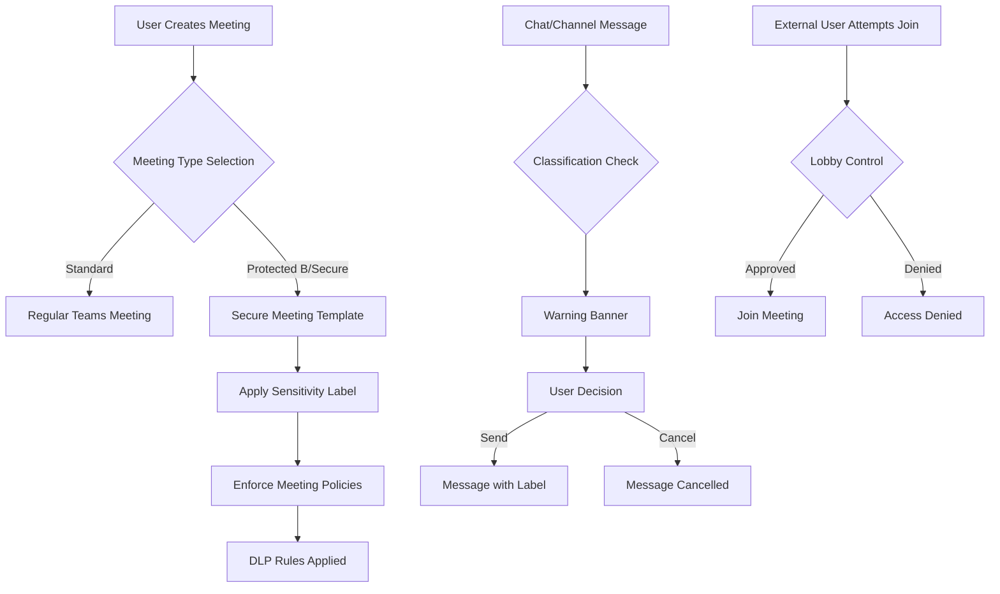

# Microsoft Teams Advanced Security Implementation Build Book
## For Elections Canada - Centre of Excellence

**Version:** 1.0  
**Date:** November 12, 2025  
**Classification:** Protected B

---

## Table of Contents
1. [Executive Summary](#executive-summary)
2. [Prerequisites](#prerequisites)
3. [Architecture Overview](#architecture-overview)
4. [Implementation Phases](#implementation-phases)
5. [Phase 1: Sensitivity Labels Configuration](#phase-1-sensitivity-labels-configuration)
6. [Phase 2: Meeting Templates Setup](#phase-2-meeting-templates-setup)
7. [Phase 3: Information Barriers and DLP](#phase-3-information-barriers-and-dlp)
8. [Phase 4: Teams Policy Configuration](#phase-4-teams-policy-configuration)
9. [Testing and Validation](#testing-and-validation)
10. [Rollout Strategy](#rollout-strategy)
11. [Monitoring and Compliance](#monitoring-and-compliance)

---

## Executive Summary

This build book provides step-by-step instructions for implementing advanced security features in Microsoft Teams, including:
- Differentiated meeting types (Protected B/Secure vs Standard)
- Meeting invite forwarding restrictions
- External participant controls
- Classification labels with user warnings
- Integration with existing CMK implementation

**Estimated Implementation Time:** 4-6 weeks  
**Required Licenses:** Microsoft 365 E5 or E3 + E5 Compliance

---

## Prerequisites

### Technical Requirements
- [x] Customer Managed Keys (CMK) already implemented
- [ ] Microsoft 365 E5 or E3 + E5 Compliance licenses
- [ ] Azure Information Protection P2 licenses
- [ ] Global Administrator or Compliance Administrator access
- [ ] Microsoft Purview compliance portal access
- [ ] PowerShell modules installed:
  ```powershell
  Install-Module -Name ExchangeOnlineManagement
  Install-Module -Name MicrosoftTeams
  Install-Module -Name AIPService
  Install-Module -Name Microsoft.Graph
  ```

### Organizational Requirements
- [ ] Security classification framework approved
- [ ] Data governance policies defined
- [ ] Change management process in place
- [ ] User training materials prepared

---

## Architecture Overview



---

## Implementation Phases

### Phase Overview
1. **Phase 1:** Sensitivity Labels Configuration (Week 1-2)
2. **Phase 2:** Meeting Templates Setup (Week 2-3)
3. **Phase 3:** Information Barriers and DLP (Week 3-4)
4. **Phase 4:** Teams Policy Configuration (Week 4-5)
5. **Testing & Validation:** (Week 5-6)

---

## Phase 1: Sensitivity Labels Configuration

### Step 1.1: Create Sensitivity Labels

1. Navigate to Microsoft Purview compliance portal
2. Go to **Information protection** > **Labels**
3. Create new labels:

#### Label 1: Protected B
```json
{
  "Name": "Protected B",
  "DisplayName": "Protected B - Medium Sensitivity",
  "Description": "Information that could cause serious injury if compromised",
  "Tooltip": "Use for sensitive government information requiring enhanced protection",
  "Color": "#FFA500",
  "Priority": 2
}
```

#### Label 2: Secure Meeting
```json
{
  "Name": "Secure Meeting",
  "DisplayName": "Secure Meeting - High Security",
  "Description": "Meetings with restricted access and forwarding controls",
  "Tooltip": "Use for confidential discussions requiring maximum security",
  "Color": "#FF0000",
  "Priority": 3
}
```

#### Label 3: Standard
```json
{
  "Name": "Standard",
  "DisplayName": "Standard - General Use",
  "Description": "Regular business information",
  "Tooltip": "Use for general business communications",
  "Color": "#008000",
  "Priority": 1
}
```

### Step 1.2: Configure Label Settings

For each label, configure:

#### Protected B Settings:
```powershell
# Connect to Security & Compliance
Connect-IPPSSession

# Configure Protected B label
Set-Label -Identity "Protected B" `
  -EncryptionEnabled $true `
  -EncryptionProtectionType "Template" `
  -EncryptionDoNotForward $true `
  -EncryptionPromptUser $true `
  -ContentExpirationDate "90" `
  -AccessControlEnabled $true
```

#### Secure Meeting Settings:
```powershell
Set-Label -Identity "Secure Meeting" `
  -EncryptionEnabled $true `
  -EncryptionProtectionType "DoNotForward" `
  -EncryptionRightsDefinitions @{
    "AuthenticatedUsers" = "View,Reply,ReplyAll"
  } `
  -SiteAndGroupProtectionEnabled $true `
  -SiteAndGroupProtectionPrivacy "Private" `
  -SiteAndGroupProtectionAllowEmailFromGuestUsers $false `
  -SiteAndGroupProtectionAllowGuestAccess $false
```

### Step 1.3: Enable Labels for Teams

```powershell
# Enable sensitivity labels for Teams
Set-SPOTenant -EnableMIPLabels $true

# Wait for propagation (can take up to 24 hours)
# Verify with:
Get-SPOTenant | Select EnableMIPLabels
```

---

## Phase 2: Meeting Templates Setup

### Step 2.1: Create Meeting Templates via Graph API

```powershell
# Connect to Microsoft Graph
Connect-MgGraph -Scopes "OnlineMeetings.ReadWrite.All", "Application.ReadWrite.All"

# Create Secure Meeting Template
$secureMeetingTemplate = @{
    displayName = "Secure Meeting - Protected B"
    description = "Template for high-security meetings with restricted access"
    joinWebUrl = $null
    lobbyBypassSettings = @{
        scope = "organizer"
        isDialInBypassEnabled = $false
    }
    allowedPresenters = "roleIsPresenter"
    isEntryExitAnnounced = $true
    allowMeetingChat = "limited"
    allowTeamworkReactions = $false
    allowAttendeeToEnableMic = $false
    allowAttendeeToEnableCamera = $false
    recordAutomatically = $true
    watermarkProtection = @{
        isEnabledForContentSharing = $true
        isEnabledForVideo = $true
    }
}

# Note: Meeting templates are currently in preview
# Use Teams Admin Center for production implementation
```

### Step 2.2: Configure Meeting Options

1. In Teams Admin Center, navigate to **Meetings** > **Meeting policies**
2. Create new meeting policy:

```powershell
New-CsTeamsMeetingPolicy -Identity "SecureMeetingPolicy" `
  -AllowAnonymousUsersToJoinMeeting $false `
  -AllowAnonymousUsersToStartMeeting $false `
  -AllowExternalParticipantGiveRequestControl $false `
  -AllowMeetNow $false `
  -AllowOutlookAddIn $true `
  -AllowParticipantGiveRequestControl $false `
  -AllowSharedNotes $false `
  -AllowTranscription $true `
  -AutoAdmittedUsers "EveryoneInCompanyExcludingGuests" `
  -DesignatedPresenterRoleMode "OrganizerOnlyUserOverride" `
  -EnrollUserOverride "Disabled" `
  -PreferredMeetingProviderForIslandsMode "TeamsAndSfb" `
  -AllowCloudRecording $true `
  -AllowRecordingStorageOutsideRegion $false `
  -WhoCanRegister "EveryoneInCompany" `
  -AllowMeetingRegistration $true
```

### Step 2.3: Create Meeting Template Assignment Logic

```powershell
# Create a custom Teams app for meeting type selection
# This requires Teams app development

$appManifest = @'
{
  "$schema": "https://developer.microsoft.com/json-schemas/teams/v1.14/MicrosoftTeams.schema.json",
  "manifestVersion": "1.14",
  "version": "1.0.0",
  "id": "secure-meeting-selector",
  "packageName": "com.electionscanada.securemeeting",
  "developer": {
    "name": "Elections Canada COE",
    "websiteUrl": "https://elections.ca",
    "privacyUrl": "https://elections.ca/privacy",
    "termsOfUseUrl": "https://elections.ca/terms"
  },
  "name": {
    "short": "Secure Meeting Selector",
    "full": "Elections Canada Secure Meeting Type Selector"
  },
  "description": {
    "short": "Select meeting security level",
    "full": "Choose between Standard or Protected B secure meetings"
  },
  "icons": {
    "outline": "outline.png",
    "color": "color.png"
  },
  "accentColor": "#FF0000",
  "composeExtensions": [
    {
      "botId": "YOUR-BOT-ID",
      "commands": [
        {
          "id": "selectMeetingType",
          "title": "Select Meeting Type",
          "description": "Choose security level for your meeting",
          "initialRun": true,
          "parameters": [
            {
              "name": "meetingType",
              "title": "Meeting Type",
              "description": "Select Standard or Secure Meeting",
              "inputType": "choiceset",
              "choices": [
                {
                  "title": "Standard Meeting",
                  "value": "standard"
                },
                {
                  "title": "Protected B - Secure Meeting",
                  "value": "secure"
                }
              ]
            }
          ]
        }
      ]
    }
  ]
}
'@
```

---

## Phase 3: Information Barriers and DLP

### Step 3.1: Configure Information Barriers

```powershell
# Connect to Security & Compliance PowerShell
Connect-IPPSSession

# Create segments for different security levels
New-OrganizationSegment -Name "StandardUsers" `
  -UserGroupFilter "Department -eq 'Standard'"

New-OrganizationSegment -Name "ProtectedBUsers" `
  -UserGroupFilter "Department -eq 'ProtectedB' -or Title -contains 'Security'"

# Create Information Barrier Policies
New-InformationBarrierPolicy -Name "ProtectedB-Restriction" `
  -AssignedSegment "ProtectedBUsers" `
  -SegmentsBlocked "ExternalUsers" `
  -State Active
```

### Step 3.2: Create DLP Policies

```powershell
# Create DLP policy for Teams
$dlpPolicy = New-DlpCompliancePolicy -Name "Teams Protected B DLP" `
  -ExchangeLocation All `
  -SharePointLocation All `
  -TeamsLocation All `
  -OneDriveLocation All `
  -Mode Enable

# Create DLP rule for Protected B content
New-DlpComplianceRule -Name "Block External Sharing of Protected B" `
  -Policy $dlpPolicy.Identity `
  -ContentContainsSensitiveInformation @{
    Name = "Protected B"
    minCount = 1
  } `
  -BlockAccess $true `
  -BlockAccessScope "PerUser" `
  -NotifyUser "LastModifier" `
  -NotifyUserType "NotSet" `
  -NotifyPolicyTipCustomText "This content is classified as Protected B and cannot be shared externally"
```

### Step 3.3: Configure Meeting Invite Restrictions

```powershell
# Create transport rule to prevent forwarding of secure meeting invites
New-TransportRule -Name "Block Secure Meeting Forward" `
  -HeaderContainsMessageHeader "X-MS-Exchange-Organization-Sensitivity" `
  -HeaderContainsWords "Secure Meeting" `
  -RejectMessageReasonText "Secure meeting invitations cannot be forwarded" `
  -Mode Enforce

# Additional rule for calendar items
New-TransportRule -Name "Restrict Protected B Calendar Forward" `
  -MessageTypeMatches "Calendaring" `
  -HasSenderOverride $false `
  -HeaderContainsMessageHeader "X-MS-Exchange-MessageSensitivity" `
  -HeaderContainsWords "Protected B" `
  -SetHeaderName "X-MS-Exchange-Organization-DoNotForward" `
  -SetHeaderValue "True"
```

---

## Phase 4: Teams Policy Configuration

### Step 4.1: Configure Messaging Policies with Warnings

```powershell
# Create messaging policy with classification requirements
New-CsTeamsMessagingPolicy -Identity "SecureMessagingPolicy" `
  -AllowUserEditMessages $true `
  -AllowUserDeleteMessages $true `
  -AllowOwnerDeleteMessages $true `
  -AllowUserChat $true `
  -AllowRemoveUser $true `
  -AllowGiphy $false `
  -GiphyRatingType "Strict" `
  -AllowMemes $false `
  -AllowImmersiveReader $true `
  -AllowStickers $false `
  -AllowUrlPreviews $true `
  -AllowUserTranslation $true `
  -ReadReceiptsEnabledType "UserPreference" `
  -AllowPriorityMessages $true `
  -ChannelsInChatListEnabledType "DisabledUserOverride" `
  -AudioMessageEnabledType "ChatsAndChannels" `
  -AllowSecurityEndUserReporting $true
```

### Step 4.2: Implement Custom Warning Banners

Create a custom Teams app for warning banners:

```javascript
// messageExtension.js
class SecurityWarningExtension {
    async onMessageSending(context, message) {
        const sensitivity = await this.checkMessageSensitivity(message);
        
        if (sensitivity === 'ProtectedB' || sensitivity === 'Secure') {
            const warning = {
                type: 'warning',
                title: `⚠️ ${sensitivity} Classification`,
                text: `You are about to send a ${sensitivity} message. Please ensure:
                      • Recipients have appropriate clearance
                      • Content is properly classified
                      • No unauthorized information is included`,
                actions: [
                    {
                        type: 'Action.Submit',
                        title: 'Send Message',
                        data: { action: 'send', confirmed: true }
                    },
                    {
                        type: 'Action.Submit',
                        title: 'Cancel',
                        data: { action: 'cancel' }
                    }
                ]
            };
            
            return await this.showWarningCard(context, warning);
        }
        
        return { allow: true };
    }
    
    async checkMessageSensitivity(message) {
        // Check for sensitivity markers in message
        if (message.text.includes('[Protected B]') || 
            message.attachments?.some(a => a.contentType.includes('protectedb'))) {
            return 'ProtectedB';
        }
        
        // Check channel/chat sensitivity
        const channelSensitivity = await this.getChannelSensitivity(message.channelId);
        return channelSensitivity || 'Standard';
    }
}
```

### Step 4.3: Configure Lobby Settings for External Users

```powershell
# Update Teams meeting configuration
Set-CsTeamsMeetingConfiguration -Identity Global `
  -ClientAppSharingPort 50040 `
  -ClientAppSharingPortRange 20 `
  -DisableAnonymousJoin $false `
  -EnableQoS $false `
  -ClientAudioPort 50000 `
  -ClientAudioPortRange 20 `
  -ClientVideoPort 50020 `
  -ClientVideoPortRange 20 `
  -ClientMediaPortRangeEnabled $true `
  -LogoURL "https://elections.ca/logo.png" `
  -LegalURL "https://elections.ca/legal" `
  -HelpURL "https://elections.ca/teams-help" `
  -CustomFooterText "Elections Canada - Protected Meeting"
```

---

## Testing and Validation

### Test Scenarios

#### Scenario 1: Protected B Meeting Creation
1. User creates new meeting
2. Selects "Protected B - Secure Meeting"
3. Verify:
   - [ ] Sensitivity label applied
   - [ ] External users in lobby
   - [ ] Forwarding disabled
   - [ ] Recording watermark visible

#### Scenario 2: Message Classification Warning
1. User types message in Protected B channel
2. Attempts to send
3. Verify:
   - [ ] Warning banner appears
   - [ ] User must confirm
   - [ ] Message shows classification

#### Scenario 3: External User Access
1. External user receives meeting invite
2. Attempts to join
3. Verify:
   - [ ] User placed in lobby
   - [ ] Organizer receives notification
   - [ ] Can admit/deny from lobby

### Validation Scripts

#### Comprehensive Policy Validation
```powershell
# Master validation function for both users and groups
function Test-TeamsSecurityCompliance {
    param(
        [Parameter(Mandatory=$true)]
        [ValidateSet("User", "Group")]
        [string]$Type,
        
        [Parameter(Mandatory=$true)]
        [string]$Identity
    )
    
    $results = @()
    $timestamp = Get-Date -Format "yyyy-MM-dd HH:mm:ss"
    
    Write-Host "`n===== Teams Security Compliance Report =====" -ForegroundColor Cyan
    Write-Host "Type: $Type | Identity: $Identity | Time: $timestamp" -ForegroundColor Cyan
    Write-Host "===========================================" -ForegroundColor Cyan
    
    if ($Type -eq "User") {
        # User validation
        $user = Get-CsOnlineUser -Identity $Identity
        $results += [PSCustomObject]@{
            Category = "User Details"
            Item = "Display Name"
            Value = $user.DisplayName
            Status = "Info"
        }
        
        # Check all policies
        $policies = @{
            "Meeting Policy" = $user.TeamsMeetingPolicy
            "Messaging Policy" = $user.TeamsMessagingPolicy
            "App Setup Policy" = $user.TeamsAppSetupPolicy
            "Calling Policy" = $user.TeamsCallingPolicy
            "External Access" = $user.ExternalAccessPolicy
        }
        
        foreach ($policy in $policies.GetEnumerator()) {
            $results += [PSCustomObject]@{
                Category = "Policy Assignment"
                Item = $policy.Key
                Value = $policy.Value
                Status = if ($policy.Value -match "Secure") { "Secure" } else { "Standard" }
            }
        }
        
    } else {
        # Group validation
        $group = Get-MgGroup -GroupId $Identity
        $members = Get-MgGroupMember -GroupId $Identity
        
        $results += [PSCustomObject]@{
            Category = "Group Details"
            Item = "Display Name"
            Value = $group.DisplayName
            Status = "Info"
        }
        
        $results += [PSCustomObject]@{
            Category = "Group Details"
            Item = "Member Count"
            Value = $members.Count
            Status = "Info"
        }
        
        # Check group policy assignments
        $groupPolicies = Get-CsGroupPolicyAssignment -GroupId $Identity
        foreach ($gp in $groupPolicies) {
            $results += [PSCustomObject]@{
                Category = "Group Policy"
                Item = $gp.PolicyType
                Value = "$($gp.PolicyName) (Rank: $($gp.Rank))"
                Status = "Assigned"
            }
        }
    }
    
    # Display results with color coding
    $results | Format-Table -AutoSize | Out-String | Write-Host
    
    # Export to CSV for reporting
    $exportPath = "C:\TeamsSecurityReports\Validation_${Type}_$(Get-Date -Format 'yyyyMMdd_HHmmss').csv"
    $results | Export-Csv -Path $exportPath -NoTypeInformation
    Write-Host "Report exported to: $exportPath" -ForegroundColor Green
}

# Batch validation function
function Test-BatchSecurityCompliance {
    param(
        [string[]]$UserList,
        [string[]]$GroupList
    )
    
    $allResults = @()
    
    foreach ($user in $UserList) {
        Write-Host "`nProcessing User: $user" -ForegroundColor Yellow
        Test-TeamsSecurityCompliance -Type "User" -Identity $user
    }
    
    foreach ($group in $GroupList) {
        Write-Host "`nProcessing Group: $group" -ForegroundColor Yellow
        Test-TeamsSecurityCompliance -Type "Group" -Identity $group
    }
}
```

### Monitoring Dashboard for Pilot Deployments

```powershell
# Real-time monitoring script for pilot users/groups
function Start-PilotMonitoring {
    param(
        [string[]]$PilotUsers,
        [string]$PilotGroupId,
        [int]$RefreshIntervalMinutes = 30
    )
    
    while ($true) {
        Clear-Host
        $timestamp = Get-Date
        
        Write-Host "Teams Security Pilot Monitoring Dashboard" -ForegroundColor Cyan
        Write-Host "Last Update: $timestamp" -ForegroundColor Gray
        Write-Host "=" * 50 -ForegroundColor Cyan
        
        # Monitor pilot users
        if ($PilotUsers.Count -gt 0) {
            Write-Host "`nPILOT USERS STATUS:" -ForegroundColor Yellow
            
            foreach ($user in $PilotUsers) {
                $userInfo = Get-CsOnlineUser -Identity $user -ErrorAction SilentlyContinue
                if ($userInfo) {
                    $meetingPolicy = if ($userInfo.TeamsMeetingPolicy -match "Secure") { "🔒 Secure" } else { "📋 Standard" }
                    $status = if ($userInfo.TeamsEnabled) { "✓ Active" } else { "✗ Inactive" }
                    
                    Write-Host "  $user : $status | Policy: $meetingPolicy"
                    
                    # Check recent activity
                    $recentMeetings = Get-CsOnlineMeetingEvent -Identity $user -StartDate (Get-Date).AddDays(-1) -ErrorAction SilentlyContinue
                    if ($recentMeetings) {
                        Write-Host "    Recent meetings: $($recentMeetings.Count) in last 24h" -ForegroundColor Gray
                    }
                }
            }
        }
        
        # Monitor pilot group
        if ($PilotGroupId) {
            Write-Host "`nPILOT GROUP STATUS:" -ForegroundColor Yellow
            $group = Get-MgGroup -GroupId $PilotGroupId
            $members = Get-MgGroupMember -GroupId $PilotGroupId
            
            Write-Host "  Group: $($group.DisplayName)"
            Write-Host "  Members: $($members.Count)"
            
            # Check policy compliance
            $compliantCount = 0
            foreach ($member in $members) {
                $memberUser = Get-CsOnlineUser -Identity (Get-MgUser -UserId $member.Id).UserPrincipalName -ErrorAction SilentlyContinue
                if ($memberUser.TeamsMeetingPolicy -match "Secure") {
                    $compliantCount++
                }
            }
            
            $complianceRate = [math]::Round(($compliantCount / $members.Count) * 100, 2)
            Write-Host "  Security Policy Compliance: $complianceRate% ($compliantCount/$($members.Count))" -ForegroundColor Green
        }
        
        # Check for security incidents
        Write-Host "`nSECURITY ALERTS (Last 24h):" -ForegroundColor Yellow
        $alerts = Get-ProtectionAlert -StartDate (Get-Date).AddDays(-1) | 
                  Where-Object {$_.Name -like "*Teams*" -or $_.Name -like "*Protected*"}
        
        if ($alerts) {
            $alerts | ForEach-Object {
                Write-Host "  ⚠️  $($_.Name) - $($_.Severity) - $($_.Status)" -ForegroundColor Red
            }
        } else {
            Write-Host "  ✓ No security alerts" -ForegroundColor Green
        }
        
        # DLP incident check
        $dlpIncidents = Get-DlpIncident -StartDate (Get-Date).AddDays(-1) -ErrorAction SilentlyContinue
        $teamsIncidents = $dlpIncidents | Where-Object {$_.Workload -eq "Teams"}
        
        if ($teamsIncidents) {
            Write-Host "`nDLP INCIDENTS:" -ForegroundColor Yellow
            Write-Host "  Teams incidents: $($teamsIncidents.Count)" -ForegroundColor Red
        }
        
        Write-Host "`nNext refresh in $RefreshIntervalMinutes minutes..." -ForegroundColor Gray
        Start-Sleep -Seconds ($RefreshIntervalMinutes * 60)
    }
}

# Usage examples:
# Start-PilotMonitoring -PilotUsers @("user1@elections.ca", "user2@elections.ca") -PilotGroupId "group-id" -RefreshIntervalMinutes 15
```

### Automated Compliance Reporting

```powershell
# Generate compliance report for single user or group
function New-SecurityComplianceReport {
    param(
        [Parameter(Mandatory=$true)]
        [ValidateSet("User", "Group", "Both")]
        [string]$Scope,
        
        [string]$UserPrincipalName,
        [string]$GroupId,
        [string]$OutputPath = "C:\TeamsSecurityReports"
    )
    
    # Create output directory
    if (!(Test-Path $OutputPath)) {
        New-Item -ItemType Directory -Path $OutputPath -Force | Out-Null
    }
    
    $reportData = @()
    $reportDate = Get-Date
    
    # HTML report header
    $htmlReport = @"
<!DOCTYPE html>
<html>
<head>
    <title>Teams Security Compliance Report</title>
    <style>
        body { font-family: Arial, sans-serif; margin: 20px; }
        h1 { color: #0078D4; }
        h2 { color: #106EBE; margin-top: 30px; }
        table { border-collapse: collapse; width: 100%; margin-top: 10px; }
        th { background-color: #0078D4; color: white; padding: 10px; text-align: left; }
        td { border: 1px solid #ddd; padding: 8px; }
        tr:nth-child(even) { background-color: #f2f2f2; }
        .pass { color: green; font-weight: bold; }
        .fail { color: red; font-weight: bold; }
        .info { color: blue; }
        .summary { background-color: #E6F2FF; padding: 15px; margin: 20px 0; border-radius: 5px; }
    </style>
</head>
<body>
    <h1>Elections Canada - Teams Security Compliance Report</h1>
    <div class="summary">
        <p><strong>Report Date:</strong> $reportDate</p>
        <p><strong>Scope:</strong> $Scope</p>
    </div>
"@
    
    if ($Scope -eq "User" -or $Scope -eq "Both") {
        if ($UserPrincipalName) {
            $htmlReport += "<h2>User Security Analysis: $UserPrincipalName</h2>"
            
            # Gather user data
            $user = Get-CsOnlineUser -Identity $UserPrincipalName
            $userPolicies = @{
                "Meeting Policy" = $user.TeamsMeetingPolicy
                "Messaging Policy" = $user.TeamsMessagingPolicy
                "App Setup Policy" = $user.TeamsAppSetupPolicy
                "External Access" = $user.ExternalAccessPolicy
            }
            
            $htmlReport += "<table>"
            $htmlReport += "<tr><th>Policy Type</th><th>Assigned Policy</th><th>Security Level</th></tr>"
            
            foreach ($policy in $userPolicies.GetEnumerator()) {
                $secLevel = if ($policy.Value -match "Secure") { 
                    "<span class='pass'>High Security</span>" 
                } else { 
                    "<span class='info'>Standard</span>" 
                }
                $htmlReport += "<tr><td>$($policy.Key)</td><td>$($policy.Value)</td><td>$secLevel</td></tr>"
            }
            $htmlReport += "</table>"
            
            # Check label assignments
            $htmlReport += "<h3>Sensitivity Labels</h3>"
            $labelPolicies = Get-LabelPolicy | Where-Object { $_.Users -contains $UserPrincipalName }
            
            if ($labelPolicies) {
                $htmlReport += "<p class='pass'>✓ User has access to sensitivity labels</p>"
                $htmlReport += "<ul>"
                foreach ($label in $labelPolicies[0].Labels) {
                    $htmlReport += "<li>$label</li>"
                }
                $htmlReport += "</ul>"
            } else {
                $htmlReport += "<p class='fail'>✗ No sensitivity labels assigned</p>"
            }
        }
    }
    
    if ($Scope -eq "Group" -or $Scope -eq "Both") {
        if ($GroupId) {
            $group = Get-MgGroup -GroupId $GroupId
            $htmlReport += "<h2>Group Security Analysis: $($group.DisplayName)</h2>"
            
            $members = Get-MgGroupMember -GroupId $GroupId
            $htmlReport += "<p><strong>Total Members:</strong> $($members.Count)</p>"
            
            # Policy assignments
            $groupPolicies = Get-CsGroupPolicyAssignment -GroupId $GroupId
            $htmlReport += "<h3>Group Policy Assignments</h3>"
            $htmlReport += "<table>"
            $htmlReport += "<tr><th>Policy Type</th><th>Policy Name</th><th>Priority Rank</th></tr>"
            
            foreach ($gp in $groupPolicies) {
                $htmlReport += "<tr><td>$($gp.PolicyType)</td><td>$($gp.PolicyName)</td><td>$($gp.Rank)</td></tr>"
            }
            $htmlReport += "</table>"
            
            # Member compliance check
            $htmlReport += "<h3>Member Compliance Summary</h3>"
            $compliantMembers = 0
            
            foreach ($member in $members) {
                $memberUser = Get-CsOnlineUser -Identity (Get-MgUser -UserId $member.Id).UserPrincipalName -ErrorAction SilentlyContinue
                if ($memberUser.TeamsMeetingPolicy -match "Secure") {
                    $compliantMembers++
                }
            }
            
            $complianceRate = [math]::Round(($compliantMembers / $members.Count) * 100, 2)
            $complianceClass = if ($complianceRate -ge 90) { "pass" } elseif ($complianceRate -ge 70) { "info" } else { "fail" }
            
            $htmlReport += "<p>Security Policy Compliance Rate: <span class='$complianceClass'>$complianceRate%</span></p>"
            $htmlReport += "<p>Compliant Members: $compliantMembers / $($members.Count)</p>"
        }
    }
    
    # Add recommendations
    $htmlReport += @"
    <h2>Recommendations</h2>
    <ul>
        <li>Review non-compliant users and apply appropriate security policies</li>
        <li>Schedule regular training for new security features</li>
        <li>Monitor DLP incidents and adjust policies as needed</li>
        <li>Perform quarterly compliance audits</li>
    </ul>
    </body>
</html>
"@
    
    # Save report
    $reportFile = "$OutputPath\SecurityCompliance_$(Get-Date -Format 'yyyyMMdd_HHmmss').html"
    $htmlReport | Out-File -FilePath $reportFile -Encoding UTF8
    
    Write-Host "`nCompliance report generated: $reportFile" -ForegroundColor Green
    
    # Open report in default browser
    Start-Process $reportFile
}

# Usage examples:
# Single user report:
# New-SecurityComplianceReport -Scope "User" -UserPrincipalName "user@elections.ca"

# Group report:
# New-SecurityComplianceReport -Scope "Group" -GroupId "group-id"

# Combined report:
# New-SecurityComplianceReport -Scope "Both" -UserPrincipalName "user@elections.ca" -GroupId "group-id"
```

---

## Testing with Single User and Group

### Option 1: Apply to Single User

#### Step 1: Create Test User Account
```powershell
# Create a test user for security policy testing
$PasswordProfile = @{
    Password = "TempP@ssw0rd123!"
    ForceChangePasswordNextSignIn = $true
}

$testUser = New-MgUser -DisplayName "Teams Security Test User" `
    -MailNickname "teams.security.test" `
    -UserPrincipalName "teams.security.test@elections.ca" `
    -PasswordProfile $PasswordProfile `
    -AccountEnabled $true `
    -UsageLocation "CA"

# Assign licenses
$licenses = @{
    SkuId = "your-E5-sku-id"
}
Set-MgUserLicense -UserId $testUser.Id -AddLicenses $licenses -RemoveLicenses @()
```

#### Step 2: Assign Policies to Single User
```powershell
# Assign meeting policy
Grant-CsTeamsMeetingPolicy -Identity "teams.security.test@elections.ca" `
    -PolicyName "SecureMeetingPolicy"

# Assign messaging policy  
Grant-CsTeamsMessagingPolicy -Identity "teams.security.test@elections.ca" `
    -PolicyName "SecureMessagingPolicy"

# Assign sensitivity label policy (via Security & Compliance)
$labelPolicy = New-LabelPolicy -Name "SingleUserTestPolicy" `
    -Labels @("EC-ProtectedB", "EC-SecureMeeting", "EC-Standard") `
    -Comment "Test policy for single user"

Set-LabelPolicy -Identity "SingleUserTestPolicy" `
    -AddUsers "teams.security.test@elections.ca"

# Verify assignments
Get-CsOnlineUser -Identity "teams.security.test@elections.ca" | 
    Select-Object DisplayName, TeamsMeetingPolicy, TeamsMessagingPolicy
```

#### Step 3: Apply DLP Policy to Single User
```powershell
# Create user-specific DLP policy
$userDlpPolicy = New-DlpCompliancePolicy `
    -Name "ProtectedB-SingleUser-Test" `
    -Comment "Test DLP for single user" `
    -ExchangeLocation "teams.security.test@elections.ca" `
    -SharePointLocation $null `
    -TeamsLocation "teams.security.test@elections.ca" `
    -OneDriveLocation "teams.security.test@elections.ca" `
    -Mode "TestWithNotifications"

# Add DLP rule
New-DlpComplianceRule -Name "Block Protected B External Share - Test User" `
    -Policy $userDlpPolicy.Identity `
    -ContentContainsSensitiveInformation @{Name="EC-ProtectedB"; minCount=1} `
    -BlockAccess $true `
    -NotifyUser "LastModifier,Owner" `
    -NotifyPolicyTipCustomText "Protected B content detected - External sharing blocked"
```

### Option 2: Apply to Security Group

#### Step 1: Create Security Group
```powershell
# Create security group for pilot testing
$pilotGroup = New-MgGroup -DisplayName "Teams Security Pilot Group" `
    -MailNickname "teams-security-pilot" `
    -Description "Pilot group for Teams security features testing" `
    -MailEnabled $false `
    -SecurityEnabled $true `
    -GroupTypes @()

# Add members to group
$members = @(
    "user1@elections.ca",
    "user2@elections.ca",
    "user3@elections.ca"
)

foreach ($member in $members) {
    $user = Get-MgUser -Filter "userPrincipalName eq '$member'"
    New-MgGroupMember -GroupId $pilotGroup.Id -DirectoryObjectId $user.Id
}

# Verify group membership
Get-MgGroupMember -GroupId $pilotGroup.Id | Select-Object Id, DisplayName
```

#### Step 2: Assign Policies to Group
```powershell
# Assign meeting policy to group
Grant-CsTeamsMeetingPolicy -Group $pilotGroup.Id `
    -PolicyName "SecureMeetingPolicy" `
    -Rank 1

# Assign messaging policy to group
Grant-CsTeamsMessagingPolicy -Group $pilotGroup.Id `
    -PolicyName "SecureMessagingPolicy" `
    -Rank 1

# Create and assign label policy to group
$groupLabelPolicy = New-LabelPolicy -Name "PilotGroupLabelPolicy" `
    -Labels @("EC-ProtectedB", "EC-SecureMeeting", "EC-Standard") `
    -Comment "Label policy for pilot security group"

Set-LabelPolicy -Identity "PilotGroupLabelPolicy" `
    -AddGroups $pilotGroup.Id

# Verify policy assignments
Get-CsGroupPolicyAssignment -GroupId $pilotGroup.Id
```

#### Step 3: Apply DLP and Transport Rules to Group
```powershell
# Create group-based DLP policy
$groupDlpPolicy = New-DlpCompliancePolicy `
    -Name "ProtectedB-PilotGroup" `
    -Comment "DLP policy for pilot group testing" `
    -ExchangeLocation "teams-security-pilot@elections.ca" `
    -SharePointLocationException $null `
    -TeamsLocation "All" `
    -Mode "TestWithNotifications"

# Configure DLP to apply only to group members
$dlpRule = New-DlpComplianceRule `
    -Name "ProtectedB External Sharing - Pilot Group" `
    -Policy $groupDlpPolicy.Identity `
    -ContentContainsSensitiveInformation @{Name="EC-ProtectedB"; minCount=1} `
    -SentToMemberOf @("teams-security-pilot@elections.ca") `
    -BlockAccess $true `
    -NotifyUser "LastModifier" `
    -GenerateIncidentReport "SiteAdmin" `
    -IncidentReportContent "Title,DocumentAuthor,DocumentLastModifier,MatchedItem,RulesMatched"

# Create group-specific transport rule
New-TransportRule -Name "SecureMeeting-Forward-Block-PilotGroup" `
    -Comments "Blocks meeting forward for pilot group only" `
    -HeaderContainsMessageHeader "X-MS-Exchange-Organization-Sensitivity" `
    -HeaderContainsWords "Secure Meeting" `
    -FromMemberOf "teams-security-pilot@elections.ca" `
    -RejectMessageReasonText "Pilot Group: Secure meetings cannot be forwarded" `
    -Mode "Test"
```

### Advanced Group Configuration

#### Dynamic Group Assignment (Azure AD P1/P2)
```powershell
# Create dynamic group based on attributes
$dynamicGroup = New-MgGroup -DisplayName "Teams Security Dynamic Pilot" `
    -Description "Auto-assigns users with specific attributes" `
    -MailEnabled $false `
    -SecurityEnabled $true `
    -MailNickname "teams-security-dynamic" `
    -GroupTypes @("DynamicMembership") `
    -MembershipRule '(user.department -eq "IT") or (user.jobTitle -contains "Security")' `
    -MembershipRuleProcessingState "On"

# The group will automatically include users matching the criteria
# Policies assigned to this group will auto-apply to new matching users
```

#### Staged Rollout with Multiple Groups
```powershell
# Create tiered security groups for phased deployment
$tierGroups = @(
    @{
        Name = "Teams-Security-Tier1-Critical"
        Description = "Executives and security personnel"
        MeetingPolicy = "SecureMeetingPolicy"
        Priority = 1
    },
    @{
        Name = "Teams-Security-Tier2-Sensitive"  
        Description = "Finance and HR departments"
        MeetingPolicy = "SecureMeetingPolicy"
        Priority = 2
    },
    @{
        Name = "Teams-Security-Tier3-Standard"
        Description = "General staff"
        MeetingPolicy = "StandardMeetingPolicy"
        Priority = 3
    }
)

foreach ($tier in $tierGroups) {
    # Create group
    $group = New-MgGroup -DisplayName $tier.Name `
        -Description $tier.Description `
        -MailEnabled $false `
        -SecurityEnabled $true `
        -MailNickname $tier.Name.ToLower().Replace("-","")
    
    # Assign policies with priority
    Grant-CsTeamsMeetingPolicy -Group $group.Id `
        -PolicyName $tier.MeetingPolicy `
        -Rank $tier.Priority
}
```

### Validation and Testing Scripts

#### Single User Validation
```powershell
function Test-SingleUserSecurity {
    param(
        [Parameter(Mandatory=$true)]
        [string]$UserPrincipalName
    )
    
    Write-Host "`nValidating security configuration for: $UserPrincipalName" -ForegroundColor Cyan
    Write-Host "================================================" -ForegroundColor Cyan
    
    # Check Teams policies
    $user = Get-CsOnlineUser -Identity $UserPrincipalName
    
    $results = @{
        "Display Name" = $user.DisplayName
        "Meeting Policy" = $user.TeamsMeetingPolicy
        "Messaging Policy" = $user.TeamsMessagingPolicy
        "Teams Enabled" = $user.TeamsEnabled
        "External Access" = $user.ExternalAccessPolicy
    }
    
    # Check label policy
    $labelPolicies = Get-LabelPolicy | Where-Object { 
        $_.Users -contains $UserPrincipalName -or 
        $_.Groups -contains (Get-MgUser -UserId $UserPrincipalName).Department
    }
    
    if ($labelPolicies) {
        $results["Label Policy"] = $labelPolicies[0].Name
        $results["Available Labels"] = ($labelPolicies[0].Labels -join ", ")
    } else {
        $results["Label Policy"] = "None assigned"
    }
    
    # Display results
    $results.GetEnumerator() | ForEach-Object {
        $status = if ($_.Value -and $_.Value -ne "None assigned") { "✓" } else { "✗" }
        Write-Host "$status $($_.Key): $($_.Value)"
    }
    
    # Test meeting creation
    Write-Host "`nTesting meeting creation capabilities..." -ForegroundColor Yellow
    try {
        $testMeeting = New-CsOnlineMeeting -Identity $UserPrincipalName
        Write-Host "✓ Can create meetings" -ForegroundColor Green
        Write-Host "  Meeting URL: $($testMeeting.JoinWebUrl)"
        Remove-CsOnlineMeeting -Identity $testMeeting.MeetingId -Confirm:$false
    } catch {
        Write-Host "✗ Cannot create meetings: $_" -ForegroundColor Red
    }
}

# Run test
Test-SingleUserSecurity -UserPrincipalName "teams.security.test@elections.ca"
```

#### Group Validation
```powershell
function Test-GroupSecurity {
    param(
        [Parameter(Mandatory=$true)]
        [string]$GroupId
    )
    
    Write-Host "`nValidating security configuration for group: $GroupId" -ForegroundColor Cyan
    Write-Host "================================================" -ForegroundColor Cyan
    
    # Get group details
    $group = Get-MgGroup -GroupId $GroupId
    Write-Host "Group Name: $($group.DisplayName)"
    Write-Host "Members: $((Get-MgGroupMember -GroupId $GroupId).Count)"
    
    # Check policy assignments
    $assignments = Get-CsGroupPolicyAssignment -GroupId $GroupId
    
    if ($assignments) {
        Write-Host "`nPolicy Assignments:" -ForegroundColor Green
        $assignments | ForEach-Object {
            Write-Host "  ✓ $($_.PolicyType): $($_.PolicyName) (Rank: $($_.Rank))"
        }
    } else {
        Write-Host "`n✗ No policies assigned to group" -ForegroundColor Red
    }
    
    # Check effective policies for group members
    Write-Host "`nSample Member Validation:" -ForegroundColor Yellow
    $sampleMember = Get-MgGroupMember -GroupId $GroupId -Top 1
    if ($sampleMember) {
        $memberUpn = (Get-MgUser -UserId $sampleMember.Id).UserPrincipalName
        $memberPolicies = Get-CsOnlineUser -Identity $memberUpn | 
            Select-Object TeamsMeetingPolicy, TeamsMessagingPolicy
        
        Write-Host "  Member: $memberUpn"
        Write-Host "  Effective Meeting Policy: $($memberPolicies.TeamsMeetingPolicy)"
        Write-Host "  Effective Messaging Policy: $($memberPolicies.TeamsMessagingPolicy)"
    }
    
    # Test DLP policy
    Write-Host "`nDLP Policy Check:" -ForegroundColor Yellow
    $dlpPolicies = Get-DlpCompliancePolicy | Where-Object { 
        $_.TeamsLocation -match $group.DisplayName -or 
        $_.TeamsLocation -eq "All" 
    }
    
    if ($dlpPolicies) {
        $dlpPolicies | ForEach-Object {
            Write-Host "  ✓ DLP Policy: $($_.Name)"
        }
    } else {
        Write-Host "  ✗ No DLP policies found" -ForegroundColor Red
    }
}

# Run test
Test-GroupSecurity -GroupId "your-pilot-group-id"
```

## Rollout Strategy

### Phase 1: Pilot Group (Week 1)
- Deploy to IT team and security champions
- 10-20 users maximum
- Daily monitoring and feedback

### Phase 2: Department Rollout (Week 2-3)
- Expand to single department
- 50-100 users
- Weekly training sessions
- Issue tracking and resolution

### Phase 3: Organization-Wide (Week 4)
- Full deployment
- Mandatory training completion
- Help desk prepared
- Executive communications

### Communication Plan

#### Email Template - Initial Announcement
```
Subject: New Security Features Coming to Microsoft Teams

Dear Team,

As part of our ongoing commitment to information security, we're introducing new features in Microsoft Teams:

• Secure Meeting Options - Choose between Standard and Protected B meetings
• Message Classification - Automatic warnings for sensitive content
• Enhanced External Access Controls - Better management of guest participants

Training sessions begin [DATE]. Please register at [LINK].

Questions? Contact: teams-security@elections.ca
```

---

## Monitoring and Compliance

### Dashboard Creation

```powershell
# Create monitoring script
$monitoringScript = @'
# Teams Security Monitoring Dashboard
# Run daily at 8:00 AM

# Connect to services
Connect-ExchangeOnline
Connect-MicrosoftTeams
Connect-IPPSSession

# Collect metrics
$date = Get-Date
$metrics = @{
    Date = $date
    SecureMeetings = (Get-CsOnlineMeetingEvent -StartDate $date.AddDays(-1) | 
                      Where-Object {$_.MeetingPolicy -eq "SecureMeetingPolicy"}).Count
    ProtectedBMessages = (Get-ProtectionAlert -StartDate $date.AddDays(-1) |
                         Where-Object {$_.Name -like "*Protected B*"}).Count
    ExternalAccessAttempts = (Get-CsOnlineUser -Filter {LastLogonTime -gt $date.AddDays(-1)} |
                             Where-Object {$_.UserType -eq "Guest"}).Count
    DLPIncidents = (Get-DlpIncident -StartDate $date.AddDays(-1)).Count
}

# Export to CSV
$metrics | Export-Csv -Path "C:\Monitoring\TeamsSecurityMetrics_$($date.ToString('yyyyMMdd')).csv" -NoTypeInformation

# Send summary email
$body = @"
Teams Security Daily Report - $date

Secure Meetings Created: $($metrics.SecureMeetings)
Protected B Messages: $($metrics.ProtectedBMessages)
External Access Attempts: $($metrics.ExternalAccessAttempts)
DLP Incidents: $($metrics.DLPIncidents)

Full report: \\fileserver\monitoring\TeamsSecurityMetrics_$($date.ToString('yyyyMMdd')).csv
"@

Send-MailMessage -To "security-team@elections.ca" `
                 -From "teams-monitoring@elections.ca" `
                 -Subject "Teams Security Daily Report" `
                 -Body $body `
                 -SmtpServer "smtp.elections.ca"
'@

# Save and schedule script
$monitoringScript | Out-File "C:\Scripts\TeamsSecurityMonitoring.ps1"
```

### Compliance Reports

Configure automatic compliance reports:

1. In Compliance Center > Reports > Dashboard
2. Create custom report for:
   - Sensitivity label usage
   - DLP policy matches
   - Meeting security compliance
   - External sharing attempts

### Key Performance Indicators (KPIs)

| Metric | Target | Measurement |
|--------|--------|-------------|
| Secure Meeting Adoption | >80% for sensitive topics | Weekly |
| Label Application Rate | >95% accuracy | Daily |
| DLP False Positives | <5% | Weekly |
| External Access Denials | Track trend | Daily |
| User Training Completion | 100% | One-time |

---

## Troubleshooting Guide

### Common Issues and Resolutions

#### Issue 1: Sensitivity Labels Not Appearing
```powershell
# Check label publication
Get-LabelPolicy | FL Name, Labels, ExchangeLocation

# Force sync
Start-RetentionLabelSync
```

#### Issue 2: Meeting Policy Not Applied
```powershell
# Check user policy assignment
Get-CsOnlineUser -Identity user@elections.ca | Select TeamsMeetingPolicy

# Re-apply policy
Grant-CsTeamsMeetingPolicy -Identity user@elections.ca -PolicyName "SecureMeetingPolicy"
```

#### Issue 3: External Users Bypass Lobby
```powershell
# Verify meeting configuration
Get-CsTeamsMeetingConfiguration | Select DisableAnonymousJoin, AutoAdmittedUsers

# Check specific meeting settings
Get-CsOnlineMeetingConfiguration -Identity meetingID
```

---

## Appendices

### Appendix A: PowerShell Script Collection

All scripts available at: `\\fileshare\COE\Teams-Security\Scripts\`

### Appendix B: Training Materials

- User Guide: `Teams-Security-User-Guide.pdf`
- Admin Guide: `Teams-Security-Admin-Guide.pdf`
- Video Tutorials: `\\fileshare\COE\Teams-Security\Training\`

### Appendix C: References

- [Microsoft Teams Security Documentation](https://docs.microsoft.com/teams/security)
- [Sensitivity Labels in Teams](https://docs.microsoft.com/microsoft-365/compliance/sensitivity-labels-teams)
- [Information Barriers](https://docs.microsoft.com/microsoft-365/compliance/information-barriers)
- [DLP for Teams](https://docs.microsoft.com/microsoft-365/compliance/dlp-microsoft-teams)

---

## Document Control

| Version | Date | Author | Changes |
|---------|------|--------|---------|
| 1.0 | Nov 12, 2025 | Fred - COE Team | Initial release |

**Next Review Date:** February 12, 2026  
**Owner:** Elections Canada Centre of Excellence  
**Classification:** Protected B