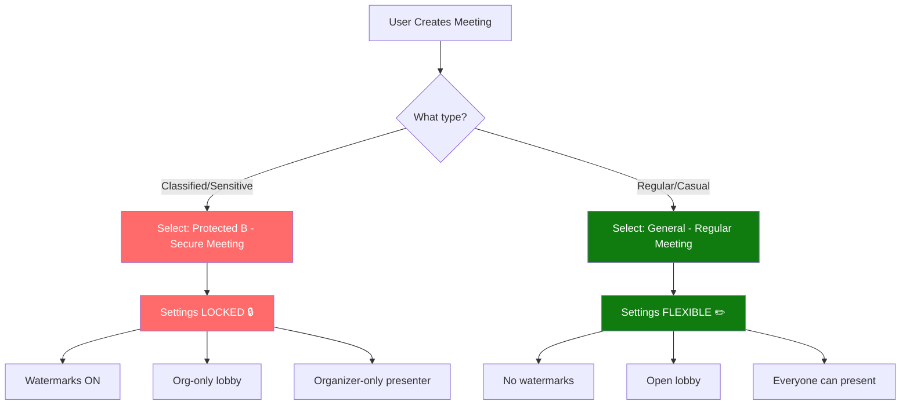
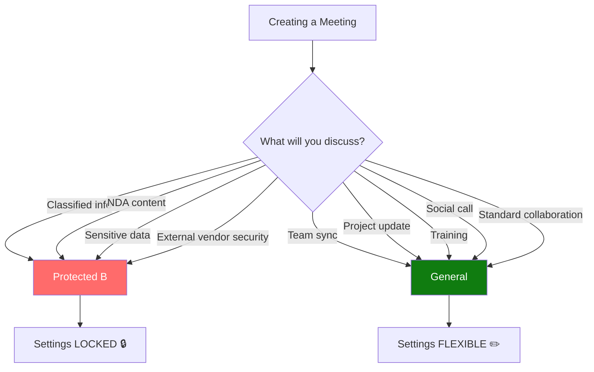

# Two-Label Approach: Secure + Regular Meetings
## Leonardo Company Implementation Guide

---

## PREREQUISITE: Delete Your Old Label First

**If you already created a label and need to delete it:**

### Error You're Seeing:
```
Microsoft.Exchange.Management.UnifiedPolicy.LabelIsPublishedException
The sensitivity label 'Protected B - Secure Meeting' is published by label 
policies and cannot be deleted. The following label policies have published 
this sensitivity label: Protected B - Teams
```

### Solution: Delete the Policy First, Then the Label

**Method 1: PowerShell (Fastest)**

```powershell
#Requires -Version 5.1
# Quick Delete Script for Published Label

Write-Host "Deleting published sensitivity label..." -ForegroundColor Cyan

# Connect
Connect-IPPSSession

# Step 1: Find and delete the policy
Write-Host "`nStep 1: Finding policies..." -ForegroundColor Yellow
$policies = Get-LabelPolicy | Where-Object {
    $_.Name -like "*Protected B*" -or 
    $_.Name -like "*Teams*" -or
    $_.Labels -match "Protected B"
}

foreach ($policy in $policies) {
    Write-Host "  Deleting policy: $($policy.Name)" -ForegroundColor Yellow
    Remove-LabelPolicy -Identity $policy.Name -Confirm:$false
    Write-Host "  ✓ Deleted" -ForegroundColor Green
}

# Step 2: Wait for propagation
Write-Host "`nStep 2: Waiting 60 seconds for propagation..." -ForegroundColor Yellow
Start-Sleep -Seconds 60

# Step 3: Delete the label
Write-Host "`nStep 3: Deleting label..." -ForegroundColor Yellow
$label = Get-Label | Where-Object {$_.DisplayName -eq "Protected B - Secure Meeting"}

if ($label) {
    Remove-Label -Identity $label.Guid -Confirm:$false
    Write-Host "✓ Label deleted!" -ForegroundColor Green
} else {
    Write-Host "✗ Label not found" -ForegroundColor Red
}

Disconnect-ExchangeOnline

Write-Host "`n✅ Complete! You can now create new labels.`n" -ForegroundColor Green
```

**Method 2: Manual Steps (UI)**

1. **Go to:** https://compliance.microsoft.com
2. **Navigate:** Information Protection → **Label policies** (not Labels!)
3. **Find:** Policy named "Protected B - Teams" or similar
4. **Select it** (checkbox)
5. **Click:** Delete policy (trash icon)
6. **Confirm:** Yes, delete
7. **Wait:** 2-5 minutes
8. **Navigate:** Information Protection → **Labels**
9. **Find:** "Protected B - Secure Meeting"
10. **Select it** (checkbox)
11. **Click:** Delete label
12. **Confirm:** Yes, delete

**Method 3: PowerShell Commands (Step-by-step)**

```powershell
# Connect
Connect-IPPSSession

# List all policies to find yours
Get-LabelPolicy | Select-Object Name, Labels | Format-Table -AutoSize

# Delete the policy (replace with your policy name)
Remove-LabelPolicy -Identity "Protected B - Teams" -Confirm:$false

# Wait for deletion to propagate
Start-Sleep -Seconds 120

# Delete the label
Remove-Label -Identity "Protected B - Secure Meeting" -Confirm:$false

# Verify deletion
Get-Label | Where-Object {$_.DisplayName -like "*Protected B*"}
# Should return nothing

Disconnect-ExchangeOnline
```

**Common Issues:**

**Issue:** "Policy still shows after deletion"
- **Solution:** Wait 5-10 minutes, deletion takes time to propagate

**Issue:** "Can't find the policy name"
```powershell
# Find all policies that include your label
Connect-IPPSSession

$label = Get-Label | Where-Object {$_.DisplayName -eq "Protected B - Secure Meeting"}
$policies = Get-LabelPolicy | Where-Object {$_.Labels -contains $label.Guid}

$policies | Select-Object Name, ExchangeLocation | Format-Table -AutoSize

Disconnect-ExchangeOnline
```

**Issue:** "Multiple policies have this label"
- **Solution:** Delete ALL policies that reference the label, one by one

**Issue:** "Label still won't delete after removing policy"
- **Solution:** Wait 30 minutes for full propagation, then try again

---

## The Strategy

Create **TWO sensitivity labels**:

1. **Protected B - Secure Meeting** (Locked settings)
2. **General - Regular Meeting** (Flexible settings)

Users choose which label based on meeting content.

---

## Architecture



---

## Implementation Steps

### Step 1: Create SECURE Label

**In Purview Compliance Portal:**

1. **Go to:** https://compliance.microsoft.com
2. **Navigate:** Information Protection → Labels
3. **Click:** + Create a label

**Configuration:**

```yaml
NAME & DESCRIPTION:
  Name: Protected B - Secure Meeting
  Display name: Protected B - Secure Meeting
  Description for users: |
    Use for classified, sensitive, or NDA-covered content.
    Security settings are locked and cannot be changed.
  Description for admins: |
    Enforces watermarks, restricted lobby, organizer-only presenting.
    Users cannot override these settings.

SCOPE:
  ✅ Meetings
  ⬜ Items
  ⬜ Groups & sites
  ⬜ Schematized data assets

MEETING PROTECTION SETTINGS:
  ✅ Apply watermark to camera video
  ✅ Apply watermark to shared content
  ✅ Apply end-to-end encryption
  
  LOBBY CONTROL:
    ✅ Control who can bypass the lobby
       → Set to: "People in my organization"
    ✅ Prevent people dialing in by phone from bypassing the lobby
  
  PRESENTER CONTROL:
    ✅ Control who can present
       → Set to: "Only organizers and co-organizers"
  
  CONTENT PROTECTION:
    ✅ Prevent copying content to clipboard
    ✅ Prevent content digitalization
  
  RECORDING CONTROL:
    ✅ Control who can record
       → Set to: "Organizers and co-organizers"

AUTO-LABELING (Optional):
  Configure conditions:
    - Meeting title contains: "Classified", "Confidential", "Protected B", "NDA"
    - Meeting has external attendees AND organizer is in "LCE M365 Security" group

LABEL COLOR:
  Choose: Red (indicates restricted/secure)
```

4. **Click:** Next → Create label
5. **Publish label** (create policy)

---

### Step 2: Create REGULAR Label

**Same location, different settings:**

1. **Click:** + Create a label

**Configuration:**

```yaml
NAME & DESCRIPTION:
  Name: General - Regular Meeting
  Display name: General - Regular Meeting
  Description for users: |
    Use for team syncs, project collaboration, and standard calls.
    You can customize meeting options as needed.
  Description for admins: |
    Allows flexible meeting settings. No watermarks. Users can 
    customize lobby, presenters, and other options.

SCOPE:
  ✅ Meetings
  ⬜ Items
  ⬜ Groups & sites
  ⬜ Schematized data assets

MEETING PROTECTION SETTINGS:
  ⬜ Apply watermark to camera video (DISABLED)
  ⬜ Apply watermark to shared content (DISABLED)
  ⬜ Apply end-to-end encryption (DISABLED)
  
  LOBBY CONTROL:
    ⬜ Control who can bypass the lobby (NOT CONTROLLED)
       → User can set in meeting options
    ⬜ Prevent phone dial-in bypass (NOT CONTROLLED)
  
  PRESENTER CONTROL:
    ⬜ Control who can present (NOT CONTROLLED)
       → User can set in meeting options
  
  CONTENT PROTECTION:
    ⬜ Prevent copying (NOT CONTROLLED)
    ⬜ Prevent digitalization (NOT CONTROLLED)
  
  RECORDING CONTROL:
    ⬜ Control who can record (NOT CONTROLLED)
       → User decides

AUTO-LABELING:
  No auto-labeling (user must select manually)

LABEL COLOR:
  Choose: Green (indicates flexible/open)
```

2. **Click:** Next → Create label
3. **Publish label** (add to same policy as secure label)

---

### Step 3: Publish Both Labels

**Create or update label policy:**

1. **Information Protection** → **Label policies**
2. **+ Publish labels** (or edit existing)

**Configuration:**

```yaml
POLICY NAME:
  LCE Meeting Labels

LABELS TO PUBLISH:
  ✅ Protected B - Secure Meeting
  ✅ General - Regular Meeting

PUBLISH TO:
  Users and groups:
    → LCE M365 Security group
    → Or: All users (if you want everyone to have access)

POLICY SETTINGS:
  Default label for meetings: <None> or "General - Regular Meeting"
  
  Require users to apply a label: NO
    (Let users choose - don't force it)
  
  Provide help link: https://your-intranet/teams-meeting-guide
  
  Display this tooltip to users:
    "Choose Protected B for classified/sensitive content, or 
     General for regular collaboration."

MANDATORY LABELING:
  ⬜ Don't check this (allow users to choose)
     Users should pick the right label for their meeting
```

3. **Submit**
4. **Wait 24-48 hours** for propagation

---

### Step 4: Set Meeting Policies to Match Labels

Update your PowerShell policies to align with the labels:

```powershell
Connect-MicrosoftTeams

# Update SECURE policy to match Secure label defaults
Set-CsTeamsMeetingPolicy -Identity "Leonardo-Secure-Meeting-Group" `
    -AutoAdmittedUsers "EveryoneInCompanyExcludingGuests" `
    -AllowWatermarkForCameraVideo $true `
    -AllowWatermarkForScreenSharing $true `
    -DesignatedPresenterRoleMode "OrganizerOnlyUserOverride" `
    -AllowPSTNUsersToBypassLobby $false `
    -AllowAnonymousUsersToJoinMeeting $false `
    -Description "Secure defaults - align with Protected B label"

# Update REGULAR policy to match Regular label defaults  
Set-CsTeamsMeetingPolicy -Identity "Leonardo-Regular-Meeting-Group" `
    -AutoAdmittedUsers "EveryoneInCompany" `
    -AllowWatermarkForCameraVideo $false `
    -AllowWatermarkForScreenSharing $false `
    -DesignatedPresenterRoleMode "EveryoneUserOverride" `
    -AllowPSTNUsersToBypassLobby $true `
    -AllowAnonymousUsersToJoinMeeting $true `
    -Description "Regular defaults - align with General label"

Disconnect-MicrosoftTeams
```

---

### Step 5: User Configuration

**Option A: No Default (User Always Chooses)**

Leave default policy as "Leonardo-Regular-Meeting-Group" but NO default label.

**Result:**
- User creates meeting → No label pre-selected
- User must choose: Protected B or General
- Ensures conscious decision for each meeting

**Option B: Regular by Default (Opt-in to Secure)**

Make Regular label the default, users opt-in to secure when needed.

```powershell
Connect-IPPSSession

$regularLabel = Get-Label | Where-Object {$_.DisplayName -eq "General - Regular Meeting"}

Set-LabelPolicy -Identity "LCE Meeting Labels" `
    -DefaultLabelId $regularLabel.Guid

Disconnect-ExchangeOnline
```

**Result:**
- User creates meeting → "General - Regular Meeting" pre-selected
- User can change to "Protected B" if needed
- Most meetings = Regular by default

**Option C: Secure by Default (Opt-out to Regular)** ⭐ RECOMMENDED

Make Secure label the default, users opt-out for casual meetings.

```powershell
Connect-IPPSSession

$secureLabel = Get-Label | Where-Object {$_.DisplayName -eq "Protected B - Secure Meeting"}

Set-LabelPolicy -Identity "LCE Meeting Labels" `
    -DefaultLabelId $secureLabel.Guid

Disconnect-ExchangeOnline
```

**Result:**
- User creates meeting → "Protected B - Secure Meeting" pre-selected
- User can change to "General" for casual meetings
- Secure by default = Better compliance ✅

---

## User Experience

### Creating a Secure Meeting:

```
1. Teams Calendar → New meeting
2. Title: "Q1 Strategy Discussion"
3. Sensitivity dropdown shows:
   • Protected B - Secure Meeting ← Selected by default (if Option C)
   • General - Regular Meeting

4. Keep "Protected B" selected
5. Click "Meeting options"
6. See 🔒 lock icons on:
   - Who can bypass lobby (locked to "Org only")
   - Who can present (locked to "Organizer only")
   - Watermarks (not visible, always on)

7. During meeting:
   ✅ Watermarks on all video
   ✅ Watermarks on all screen shares
   ✅ External users cannot join
   ✅ Only organizer can present
```

### Creating a Regular Meeting:

```
1. Teams Calendar → New meeting
2. Title: "Team Sync"
3. Sensitivity dropdown shows:
   • Protected B - Secure Meeting
   • General - Regular Meeting ← Change to this

4. Select "General - Regular Meeting"
5. Click "Meeting options"
6. All settings are FLEXIBLE ✏️:
   - Change who can bypass lobby (user choice)
   - Change who can present (user choice)
   - No watermarks

7. During meeting:
   ✅ No watermarks
   ✅ External users can join (if allowed)
   ✅ Anyone can be promoted to presenter
   ✅ Flexible collaboration
```

---

## Comparison Table

| Feature | Protected B Label | General Label |
|---------|------------------|---------------|
| **Watermarks** | 🔒 ON (Locked) | ✏️ OFF (User choice) |
| **Lobby** | 🔒 Org only (Locked) | ✏️ User choice |
| **Anonymous Join** | 🔒 Blocked (Locked) | ✏️ User choice |
| **Phone Bypass Lobby** | 🔒 NO (Locked) | ✏️ User choice |
| **Who Can Present** | 🔒 Organizer only (Locked) | ✏️ User choice |
| **Recording Control** | 🔒 Organizer only (Locked) | ✏️ User choice |
| **Give Control** | 🔒 Disabled (Locked) | ✏️ Enabled |
| **Clipboard Copy** | 🔒 Blocked (Locked) | ✏️ Allowed |
| **End-to-End Encryption** | 🔒 ON (Locked) | ✏️ OFF |
| **Visual Indicator** | 🔒 Lock icons | ✏️ Standard UI |
| **User Override** | ❌ Cannot change | ✅ Full control |
| **Use Case** | Classified, NDA, Sensitive | Team syncs, Collaboration |

---

## User Training Guide

**Email template to send to users:**

```
Subject: New Meeting Labels - Choose Based on Content Type

Hi Team,

We've implemented two meeting labels to help you create the right type 
of meeting based on your content:

🔴 PROTECTED B - SECURE MEETING
   Use for: Classified info, NDA content, sensitive discussions
   
   What it does:
   • Watermarks on video and screen shares (automatic)
   • Lobby restricted to organization only (cannot change)
   • Only you can present (cannot change)
   • External users blocked
   • Recording controlled by organizer
   
   Settings are LOCKED 🔒 - you'll see lock icons in meeting options.

🟢 GENERAL - REGULAR MEETING
   Use for: Team syncs, project calls, casual collaboration
   
   What it does:
   • No watermarks
   • You control lobby settings
   • You control who can present
   • External users can join (if you allow)
   • Flexible meeting options
   
   Settings are FLEXIBLE ✏️ - you can customize as needed.

HOW TO USE:

When creating a meeting:
1. Look for "Sensitivity" button (near meeting title)
2. Click it and choose the right label
3. Protected B = Locked & secure
4. General = Flexible & open

BY DEFAULT:
Your meetings will be "Protected B" by default. If you're having a 
casual call, change to "General" label.

QUESTIONS?
Contact: George Zarif (george.zarif@leonardocompany.ca)
Training: [Schedule if needed]
```

---

## PowerShell Script: Create Both Labels

Save this as `05-Create-Two-Labels.ps1`:

```powershell
#Requires -Version 5.1

<#
.SYNOPSIS
    Create Secure and Regular Meeting Labels

.DESCRIPTION
    Creates two sensitivity labels:
    1. Protected B - Secure Meeting (locked settings)
    2. General - Regular Meeting (flexible settings)

.NOTES
    Author: George Zarif
    This must be run AFTER deleting the old label
#>

Write-Host ""
Write-Host "========================================" -ForegroundColor Cyan
Write-Host "Create Two Meeting Labels" -ForegroundColor Cyan
Write-Host "========================================" -ForegroundColor Cyan
Write-Host ""

# Connect
Connect-IPPSSession

# ========================================
# CREATE SECURE LABEL
# ========================================

Write-Host "Creating SECURE label..." -ForegroundColor Cyan

$secureConfig = @{
    DisplayName = "Protected B - Secure Meeting"
    Name = "ProtectedB-SecureMeeting"
    Comment = "For classified/sensitive meetings - locked settings"
    Tooltip = "Use for classified, NDA, or sensitive content. Settings are locked for compliance."
    ContentType = @("Meeting")
}

try {
    $secureLabel = New-Label @secureConfig `
        -AdvancedSettings @{
            # Meeting protection
            MeetingWatermarkEnabled = "True"
            MeetingWatermarkCameraEnabled = "True"
            MeetingWatermarkSharedContentEnabled = "True"
            
            # Lobby control
            MeetingLobbyBypassScope = "Organization"
            MeetingAllowPSTNUsersToBypassLobby = "False"
            
            # Presenter control  
            MeetingPresenterRole = "OrganizerOnly"
            
            # Content protection
            MeetingAllowClipboard = "False"
            
            # Encryption
            MeetingEncryptionEnabled = "True"
        }
    
    Write-Host "✓ Secure label created" -ForegroundColor Green
    
} catch {
    Write-Host "✗ Error: $($_.Exception.Message)" -ForegroundColor Red
}

# ========================================
# CREATE REGULAR LABEL
# ========================================

Write-Host ""
Write-Host "Creating REGULAR label..." -ForegroundColor Cyan

$regularConfig = @{
    DisplayName = "General - Regular Meeting"
    Name = "General-RegularMeeting"
    Comment = "For standard meetings - flexible settings"
    Tooltip = "Use for team syncs, project calls, and regular collaboration. You can customize settings."
    ContentType = @("Meeting")
}

try {
    $regularLabel = New-Label @regularConfig `
        -AdvancedSettings @{
            # No restrictions - all settings flexible
            MeetingWatermarkEnabled = "False"
            MeetingLobbyBypassScope = "Everyone"
            MeetingAllowPSTNUsersToBypassLobby = "True"
            MeetingPresenterRole = "Everyone"
            MeetingAllowClipboard = "True"
            MeetingEncryptionEnabled = "False"
        }
    
    Write-Host "✓ Regular label created" -ForegroundColor Green
    
} catch {
    Write-Host "✗ Error: $($_.Exception.Message)" -ForegroundColor Red
}

# ========================================
# CREATE POLICY TO PUBLISH BOTH
# ========================================

Write-Host ""
Write-Host "Creating label policy..." -ForegroundColor Cyan

try {
    New-LabelPolicy -Name "LCE Meeting Labels" `
        -Comment "Two-label approach: Secure and Regular meetings" `
        -Labels @($secureLabel.Guid, $regularLabel.Guid) `
        -ExchangeLocation "LCE M365 Security" `
        -DefaultLabelId $secureLabel.Guid `
        -AdvancedSettings @{
            EnableMandatoryInTeams = "False"
            OutlookDefaultLabel = $secureLabel.Guid
        }
    
    Write-Host "✓ Policy created and published" -ForegroundColor Green
    
} catch {
    Write-Host "✗ Error: $($_.Exception.Message)" -ForegroundColor Red
}

# ========================================
# SUMMARY
# ========================================

Write-Host ""
Write-Host "========================================" -ForegroundColor Cyan
Write-Host "COMPLETE" -ForegroundColor Cyan
Write-Host "========================================" -ForegroundColor Cyan
Write-Host ""
Write-Host "✅ Protected B - Secure Meeting (locked)" -ForegroundColor Green
Write-Host "✅ General - Regular Meeting (flexible)" -ForegroundColor Green
Write-Host ""
Write-Host "Wait 24-48 hours for labels to propagate" -ForegroundColor Yellow
Write-Host ""

Disconnect-ExchangeOnline
```

---

## Decision Tree for Users



---

## Audit & Compliance

**Monitor label usage:**

```powershell
Connect-IPPSSession

# Find meetings with Protected B label
Search-UnifiedAuditLog -StartDate (Get-Date).AddDays(-30) `
    -EndDate (Get-Date) `
    -RecordType MeetingInvite `
    -FreeText "Protected B"

# Find meetings with General label
Search-UnifiedAuditLog -StartDate (Get-Date).AddDays(-30) `
    -EndDate (Get-Date) `
    -RecordType MeetingInvite `
    -FreeText "General"

# Find meetings with NO label (potential compliance issue)
Search-UnifiedAuditLog -StartDate (Get-Date).AddDays(-30) `
    -EndDate (Get-Date) `
    -RecordType MeetingInvite `
    -Operations "MeetingCreated" | 
    Where-Object {$_.AuditData -notmatch "SensitivityLabel"}

Disconnect-ExchangeOnline
```

---

## Summary

**With two labels you get:**

✅ **Secure option** - Locked settings for compliance  
✅ **Regular option** - Flexible settings for collaboration  
✅ **User choice** - Users pick based on content  
✅ **Clear guidance** - Label names indicate use case  
✅ **Full audit trail** - Track what type of meetings are created  
✅ **Compliance ready** - Secure by default, opt-out to regular  

**This is the BEST approach** because:
- Users have both options
- Secure meetings are truly locked
- Regular meetings stay flexible
- No templates needed (labels work immediately)
- Clear visual indicators (🔒 vs ✏️)

---

**Next Step: Create both labels following the guide above!**
