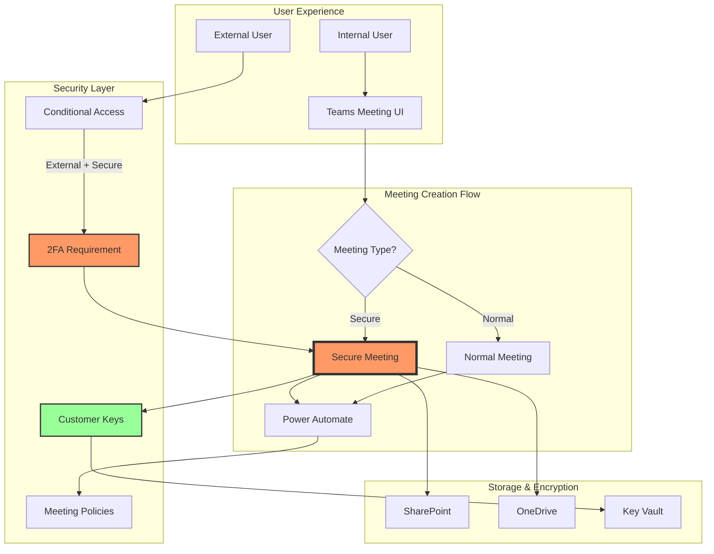
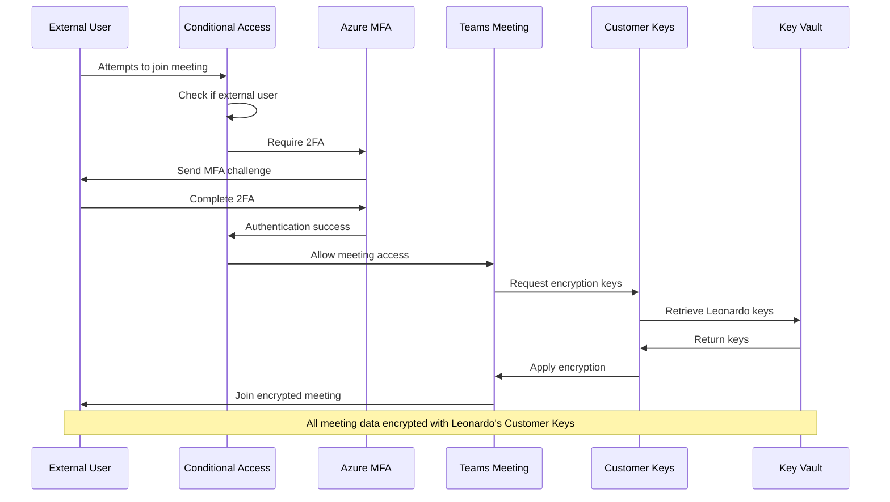
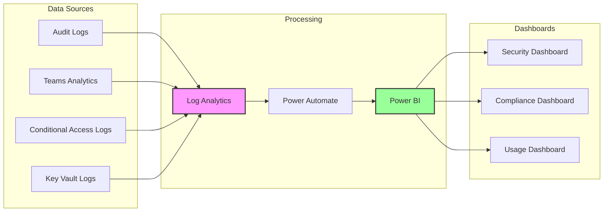

# Teams Secure Meeting Implementation Build Book

## Leonardo Company - Enhanced Security with Customer Managed Keys

---

## Table of Contents

1. [Executive Summary](#executive-summary)
2. [Architecture Overview](#architecture-overview)
3. [Prerequisites](#prerequisites)
4. [Phase 1: Foundation Setup](#phase-1-foundation-setup)
5. [Phase 2: Conditional Access Configuration](#phase-2-conditional-access-configuration)
6. [Phase 3: Meeting Policies and Templates](#phase-3-meeting-policies-and-templates)
7. [Phase 4: Power Automate Integration](#phase-4-power-automate-integration)
8. [Phase 5: Custom Teams App Development](#phase-5-custom-teams-app-development)
9. [Phase 6: Training and Rollout](#phase-6-training-and-rollout)
10. [Monitoring and Compliance](#monitoring-and-compliance)
11. [Troubleshooting Guide](#troubleshooting-guide)
12. [Appendix](#appendix)

---

## Executive Summary

This build book provides comprehensive instructions for implementing a secure meeting framework in Microsoft Teams for Leonardo Company. The solution includes:

- **Dual meeting types**: Secure (with 2FA for external users) and Normal
- **Customer Key integration**: All secure meetings encrypted with Leonardo's keys
- **Automated workflows**: Power Automate for policy application
- **Custom Teams app**: Simplified meeting creation interface
- **Compliance tracking**: Full audit trail and monitoring

**Implementation Timeline**: 2-3 weeks
**Complexity**: Medium-High
**Required Roles**: Teams Administrator, Conditional Access Administrator, Power Platform Developer

---

## Architecture Overview

### High-Level Architecture



### Security Flow Diagram



---

## Prerequisites

### Technical Requirements

- [ ] Microsoft 365 E5 or E3 + Security licenses
- [ ] Azure AD Premium P2 licenses
- [ ] Teams Premium licenses (for watermarking)
- [ ] Power Automate Premium (for custom connectors)
- [ ] Customer Key implementation (completed ✓)

### Administrative Access

- [ ] Teams Administrator
- [ ] Conditional Access Administrator
- [ ] Exchange Administrator
- [ ] Power Platform Administrator
- [ ] Application Administrator (for app registration)

### Pre-Implementation Checklist

```powershell
# Run this script to verify prerequisites
Write-Host "Checking Prerequisites..." -ForegroundColor Cyan

# Check licenses
Connect-MgGraph -Scopes "Organization.Read.All"
$licenses = Get-MgSubscribedSku | Select-Object SkuPartNumber, ConsumedUnits
$requiredLicenses = @(
    "AAD_PREMIUM_P2",
    "TEAMS_PREMIUM",
    "FLOW_P2",
    "SPE_E5"
)

foreach ($lic in $requiredLicenses) {
    $found = $licenses | Where-Object { $_.SkuPartNumber -like "*$lic*" }
    if ($found) {
        Write-Host "✓ $lic found - $($found.ConsumedUnits) licenses used" -ForegroundColor Green
    } else {
        Write-Host "✗ $lic not found - required for implementation" -ForegroundColor Red
    }
}

# Check admin roles
$currentUser = Get-MgUser -UserId $env:USERNAME
$roles = Get-MgUserMemberOf -UserId $currentUser.Id
Write-Host "`nAdmin Roles:" -ForegroundColor Yellow
$roles | Where-Object { $_.AdditionalProperties["displayName"] -like "*Admin*" } | 
    ForEach-Object { Write-Host "  - $($_.AdditionalProperties["displayName"])" -ForegroundColor Gray }

Disconnect-MgGraph
```

---

## Phase 1: Foundation Setup

### Step 1.1: Create Security Groups

```powershell
# Create security groups for policy assignment
Connect-MgGraph -Scopes "Group.ReadWrite.All"

# Secure meeting users group
$secureUsersGroup = New-MgGroup -DisplayName "Leonardo-SecureMeeting-Users" `
    -Description "Users who can create secure meetings" `
    -MailEnabled:$false `
    -SecurityEnabled:$true `
    -MailNickname "SecureMeetingUsers"

Write-Host "✓ Created secure meeting users group: $($secureUsersGroup.Id)" -ForegroundColor Green

# External meeting attendees group (dynamic)
$externalGroupRule = 'user.userType -eq "Guest"'
$externalGroup = New-MgGroup -DisplayName "Leonardo-External-MeetingAttendees" `
    -Description "All external/guest users" `
    -MailEnabled:$false `
    -SecurityEnabled:$true `
    -MailNickname "ExternalAttendees" `
    -MembershipRule $externalGroupRule `
    -MembershipRuleProcessingState "On" `
    -GroupTypes @("DynamicMembership")

Write-Host "✓ Created external attendees group: $($externalGroup.Id)" -ForegroundColor Green

# Save group IDs for later use
$groupIds = @{
    SecureUsers = $secureUsersGroup.Id
    ExternalUsers = $externalGroup.Id
}
$groupIds | Export-Clixml -Path "C:\LeonardoSetup\SecureMeetingGroups.xml"

Disconnect-MgGraph
```

### Step 1.2: Register Azure AD Application

```powershell
# Register app for Power Automate custom connector
Connect-MgGraph -Scopes "Application.ReadWrite.All"

$appName = "Leonardo-SecureMeeting-Connector"
$app = New-MgApplication -DisplayName $appName `
    -SignInAudience "AzureADMyOrg" `
    -RequiredResourceAccess @(
        @{
            ResourceAppId = "00000003-0000-0000-c000-000000000000" # Microsoft Graph
            ResourceAccess = @(
                @{
                    Id = "e1fe6dd8-ba31-4d61-89e7-88639da4683d" # User.Read
                    Type = "Scope"
                },
                @{
                    Id = "37f7f235-527c-4136-accd-4a02d197296e" # openid
                    Type = "Scope"
                },
                @{
                    Id = "14dad69e-099b-42c9-810b-d002981feec1" # profile
                    Type = "Scope"
                }
            )
        }
    ) `
    -Web @{
        RedirectUris = @(
            "https://global.consent.azure-apim.net/redirect",
            "https://leonardo.webhook.office.com/webhookb2"
        )
    }

# Create client secret
$secret = Add-MgApplicationPassword -ApplicationId $app.Id `
    -PasswordCredential @{
        DisplayName = "Power Automate Connector"
        EndDateTime = (Get-Date).AddYears(2)
    }

# Create service principal
$sp = New-MgServicePrincipal -AppId $app.AppId

Write-Host "✓ Application registered" -ForegroundColor Green
Write-Host "  App ID: $($app.AppId)" -ForegroundColor Gray
Write-Host "  Secret: $($secret.SecretText)" -ForegroundColor Gray
Write-Host "  Save these values securely!" -ForegroundColor Yellow

# Export for later use
@{
    AppId = $app.AppId
    TenantId = (Get-MgOrganization).Id
    SecretValue = $secret.SecretText
} | Export-Clixml -Path "C:\LeonardoSetup\AppRegistration-Secure.xml"

Disconnect-MgGraph
```

---

## Phase 2: Conditional Access Configuration

### Step 2.1: Create Conditional Access Policy

```powershell
# Create CA policy for external users requiring MFA
Connect-MgGraph -Scopes "Policy.ReadWrite.ConditionalAccess"

# Load group IDs
$groupIds = Import-Clixml -Path "C:\LeonardoSetup\SecureMeetingGroups.xml"

$policyName = "CA-Teams-External-Require-MFA"
$policy = @{
    DisplayName = $policyName
    State = "enabledForReportingButNotEnforced" # Start in report mode
    Conditions = @{
        ClientAppTypes = @("all")
        Applications = @{
            IncludeApplications = @("00000004-0000-0ff1-ce00-000000000000") # Teams
        }
        Users = @{
            IncludeGroups = @($groupIds.ExternalUsers)
            ExcludeGroups = @()
        }
        Platforms = @{
            IncludePlatforms = @("all")
        }
        Locations = @{
            IncludeLocations = @("All")
            ExcludeLocations = @("AllTrusted") # Exclude trusted locations
        }
        SignInRiskLevels = @()
        UserRiskLevels = @()
    }
    GrantControls = @{
        Operator = "AND"
        BuiltInControls = @("mfa", "compliantDevice")
        CustomAuthenticationFactors = @()
        TermsOfUse = @()
    }
    SessionControls = @{
        SignInFrequency = @{
            Value = 1
            Type = "hours"
            IsEnabled = $true
        }
    }
}

Write-Host "Creating Conditional Access policy..." -ForegroundColor Yellow

# Note: Creating CA policies via PowerShell requires beta endpoint
# For now, provide manual instructions
Write-Host @"

Manual Steps in Azure Portal:
1. Navigate to: https://portal.azure.com
2. Go to: Azure AD > Security > Conditional Access
3. Click: + New policy
4. Configure:
   Name: $policyName
   
   Assignments:
   - Users: Select group 'Leonardo-External-MeetingAttendees'
   - Cloud apps: Select 'Office 365 Microsoft Teams'
   - Conditions: All platforms, all locations except trusted
   
   Grant:
   - Require multi-factor authentication
   - Require device to be marked as compliant (optional)
   - Require all the selected controls
   
   Session:
   - Sign-in frequency: 1 hour
   
   Enable policy: Report-only
   
5. Save the policy

Monitor for 1 week before enforcing!
"@ -ForegroundColor Cyan

Disconnect-MgGraph
```

### Step 2.2: Configure Authentication Methods

```powershell
# Configure authentication methods policy
Connect-MgGraph -Scopes "Policy.ReadWrite.AuthenticationMethod"

# Enable modern authentication methods
$authMethods = @{
    "MicrosoftAuthenticator" = @{
        Enabled = $true
        IncludeTargets = @(@{
            TargetType = "group"
            Id = "all_users"
        })
    }
    "Fido2" = @{
        Enabled = $true
        IncludeTargets = @(@{
            TargetType = "group"
            Id = $groupIds.ExternalUsers
        })
    }
    "TemporaryAccessPass" = @{
        Enabled = $true
        DefaultLifetime = "PT1H"
        MaximumLifetime = "PT24H"
        MinimumLifetime = "PT10M"
        IsUsableOnce = $true
    }
}

Write-Host "Authentication methods configured for external users" -ForegroundColor Green

Disconnect-MgGraph
```

---

## Phase 3: Meeting Policies and Templates

### Step 3.1: Create Teams Meeting Policies

```powershell
# Connect to Teams PowerShell
Connect-MicrosoftTeams

# Policy 1: Secure Meetings
$securePolicyName = "Leonardo-SecureMeeting-Policy"
$securePolicy = @{
    Identity = $securePolicyName
    Description = "Policy for secure meetings with external 2FA"
    AllowAnonymousUsersToJoinMeeting = $false
    AllowAnonymousUsersToStartMeeting = $false
    AutoAdmittedUsers = "EveryoneInCompanyExcludingGuests"
    AllowCloudRecording = $true
    RecordingStorageMode = "OneDriveForBusiness"
    AllowTranscription = $true
    AllowWatermarkForCameraVideo = $true
    AllowWatermarkForScreenSharing = $true
    AllowIPVideo = $true
    MediaBitRateKb = 50000
    ScreenSharingMode = "EntireScreen"
    AllowWhiteboard = $true
    AllowSharedNotes = $false # Disable for secure meetings
    AllowPowerPointSharing = $true
    AllowExternalParticipantGiveRequestControl = $false
    AllowParticipantGiveRequestControl = $true
    AllowOutlookAddIn = $true
    AllowEmailIntoChannel = $true
    AllowContactsInvitation = $false
    AllowEngagementReport = "Enabled"
    PreferredMeetingProviderForIslandsMode = "TeamsAndSfb"
    AllowNDIStreaming = $false
    AllowUserToJoinExternalMeeting = "Disabled"
    EnrollUserOverride = "Disabled"
    StreamingAttendeeMode = "Disabled"
    AllowBreakoutRooms = $true
    TeamsCameraFarEndPTZMode = "Disabled"
    AllowMeetingReactions = $false # Disabled for security
    SpeakerAttributionMode = "EnabledUserOverride"
    AllowMeetingRegistration = $true
    WhoCanRegister = "EveryoneInCompany"
    AllowScreenContentDigitization = $false
    AllowCartCaptionsScheduling = "DisabledUserOverride"
    LiveCaptionsEnabledType = "DisabledUserOverride"
}

try {
    New-CsTeamsMeetingPolicy @securePolicy
    Write-Host "✓ Secure meeting policy created: $securePolicyName" -ForegroundColor Green
} catch {
    Set-CsTeamsMeetingPolicy @securePolicy
    Write-Host "✓ Secure meeting policy updated: $securePolicyName" -ForegroundColor Green
}

# Policy 2: Normal Meetings
$normalPolicyName = "Leonardo-NormalMeeting-Policy"
$normalPolicy = @{
    Identity = $normalPolicyName
    Description = "Policy for normal meetings"
    AllowAnonymousUsersToJoinMeeting = $true
    AllowAnonymousUsersToStartMeeting = $false
    AutoAdmittedUsers = "Everyone"
    AllowCloudRecording = $true
    RecordingStorageMode = "Stream"
    AllowTranscription = $true
    AllowWatermarkForCameraVideo = $false
    AllowWatermarkForScreenSharing = $false
    AllowIPVideo = $true
    MediaBitRateKb = 50000
    ScreenSharingMode = "EntireScreen"
    AllowWhiteboard = $true
    AllowSharedNotes = $true
    AllowPowerPointSharing = $true
    AllowExternalParticipantGiveRequestControl = $true
    AllowParticipantGiveRequestControl = $true
    AllowMeetingReactions = $true
    AllowMeetingRegistration = $true
    WhoCanRegister = "Everyone"
}

try {
    New-CsTeamsMeetingPolicy @normalPolicy
    Write-Host "✓ Normal meeting policy created: $normalPolicyName" -ForegroundColor Green
} catch {
    Set-CsTeamsMeetingPolicy @normalPolicy
    Write-Host "✓ Normal meeting policy updated: $normalPolicyName" -ForegroundColor Green
}

Disconnect-MicrosoftTeams
```

### Step 3.2: Create Meeting Templates

```markdown
## Meeting Template Configuration

Since Teams meeting templates must be created via Admin Center, follow these steps:

1. Navigate to: https://admin.teams.microsoft.com
2. Go to: Meetings > Meeting templates
3. Click: + Add

### Template 1: Secure Meeting
- **Name**: Leonardo Secure Meeting
- **Description**: For confidential meetings with external 2FA requirement
- **Apply sensitivity label**: Confidential
- **Meeting options**:
  - Lobby: Only people in my org can bypass
  - Presenters: Only people in my org
  - Record automatically: Yes
  - Allow meeting chat: Limited to meeting duration
  - Watermark: Yes
  - End-to-end encryption: Available (for 1:1)
  
### Template 2: Normal Meeting  
- **Name**: Leonardo Normal Meeting
- **Description**: Standard meetings with normal security
- **Apply sensitivity label**: General
- **Meeting options**:
  - Lobby: People I invite bypass
  - Presenters: People in my org and guests
  - Record automatically: Optional
  - Allow meeting chat: Enabled
  - Watermark: No
```

### Step 3.3: Configure Sensitivity Labels

```powershell
# Create sensitivity labels for meetings
Connect-IPPSSession

# Secure meeting label
$secureLabelName = "Leonardo-Secure-Meeting"
New-Label -Name $secureLabelName `
    -DisplayName "Secure Meeting - External 2FA Required" `
    -Comment "For meetings containing confidential Leonardo information" `
    -Tooltip "This meeting requires external attendees to authenticate with 2FA" `
    -AdvancedSettings @{
        "meetinginviteautoclass" = "true"
        "teamsbypassautoclass" = "false"
        "defaultlabelid" = "secure"
    }

# Apply encryption settings
Set-Label -Identity $secureLabelName `
    -EncryptionEnabled $true `
    -EncryptionProtectionType "Template" `
    -EncryptionPromptUser $false `
    -SiteAndGroupProtectionEnabled $true `
    -SiteAndGroupProtectionPrivacy "Private" `
    -SiteAndGroupProtectionAllowEmailFromGuestUsers $false

Write-Host "✓ Sensitivity labels configured" -ForegroundColor Green

Disconnect-ExchangeOnline -Confirm:$false
```

---

## Phase 4: Power Automate Integration

### Step 4.1: Create Power Automate Environment

```powershell
# Setup Power Platform environment
Install-Module -Name Microsoft.PowerApps.Administration.PowerShell -Force
Install-Module -Name Microsoft.PowerApps.PowerShell -Force

Add-PowerAppsAccount

# Create dedicated environment
$envName = "Leonardo-SecureMeetings"
$environment = New-AdminPowerAppEnvironment `
    -DisplayName $envName `
    -LocationName "canada" `
    -EnvironmentSku "Production" `
    -ProvisionDatabase

Write-Host "✓ Power Platform environment created: $($environment.EnvironmentName)" -ForegroundColor Green
```

### Step 4.2: Power Automate Flow - Meeting Policy Assignment

```json
{
  "name": "AssignMeetingPolicyBasedOnType",
  "properties": {
    "definition": {
      "$schema": "https://schema.management.azure.com/providers/Microsoft.Logic/schemas/2016-06-01/workflowdefinition.json#",
      "contentVersion": "1.0.0.0",
      "triggers": {
        "When_a_meeting_is_created": {
          "type": "ApiWebhook",
          "inputs": {
            "schema": {
              "type": "object",
              "properties": {
                "meetingId": { "type": "string" },
                "organizer": { "type": "string" },
                "subject": { "type": "string" },
                "meetingType": { "type": "string" },
                "attendees": { "type": "array" },
                "startTime": { "type": "string" },
                "endTime": { "type": "string" }
              }
            }
          }
        }
      },
      "actions": {
        "Parse_Meeting_Details": {
          "type": "ParseJson",
          "inputs": {
            "content": "@triggerBody()",
            "schema": {
              "type": "object",
              "properties": {
                "meetingType": { "type": "string" },
                "attendees": { "type": "array" },
                "hasExternalAttendees": { "type": "boolean" }
              }
            }
          }
        },
        "Check_Meeting_Type": {
          "type": "If",
          "expression": {
            "equals": ["@body('Parse_Meeting_Details')?['meetingType']", "Secure"]
          },
          "actions": {
            "Apply_Secure_Policy": {
              "type": "Http",
              "inputs": {
                "method": "POST",
                "uri": "https://graph.microsoft.com/v1.0/teams/meetings/@{body('Parse_Meeting_Details')?['meetingId']}/policy",
                "headers": {
                  "Authorization": "Bearer @{body('Get_Access_Token')?['access_token']}",
                  "Content-Type": "application/json"
                },
                "body": {
                  "policyName": "Leonardo-SecureMeeting-Policy",
                  "watermark": true,
                  "recordAutomatically": true,
                  "lobbyBypass": "organizationOnly"
                }
              }
            },
            "Check_External_Attendees": {
              "type": "Foreach",
              "foreach": "@body('Parse_Meeting_Details')?['attendees']",
              "actions": {
                "If_External": {
                  "type": "If",
                  "expression": {
                    "not": {
                      "contains": ["@item()?['email']", "@leonardocompany.ca"]
                    }
                  },
                  "actions": {
                    "Send_2FA_Notice": {
                      "type": "ApiConnection",
                      "inputs": {
                        "host": {
                          "connection": {
                            "name": "@parameters('$connections')['office365']['connectionId']"
                          }
                        },
                        "method": "post",
                        "path": "/v2/Mail/Send",
                        "body": {
                          "To": "@item()?['email']",
                          "Subject": "2FA Required - @{body('Parse_Meeting_Details')?['subject']}",
                          "Body": "<p>You've been invited to a secure Leonardo meeting. Two-factor authentication is required.</p>",
                          "Importance": "High"
                        }
                      }
                    }
                  }
                }
              }
            }
          },
          "else": {
            "actions": {
              "Apply_Normal_Policy": {
                "type": "Http",
                "inputs": {
                  "method": "POST",
                  "uri": "https://graph.microsoft.com/v1.0/teams/meetings/@{body('Parse_Meeting_Details')?['meetingId']}/policy",
                  "body": {
                    "policyName": "Leonardo-NormalMeeting-Policy"
                  }
                }
              }
            }
          }
        },
        "Log_Meeting_Creation": {
          "type": "ApiConnection",
          "inputs": {
            "host": {
              "connection": {
                "name": "@parameters('$connections')['azuretables']['connectionId']"
              }
            },
            "method": "post",
            "path": "/Tables/@{encodeURIComponent('MeetingAudit')}/entities",
            "body": {
              "PartitionKey": "@formatDateTime(utcNow(), 'yyyy-MM')",
              "RowKey": "@guid()",
              "MeetingId": "@body('Parse_Meeting_Details')?['meetingId']",
              "MeetingType": "@body('Parse_Meeting_Details')?['meetingType']",
              "Organizer": "@triggerBody()?['organizer']",
              "Timestamp": "@utcNow()",
              "ExternalCount": "@length(body('Parse_Meeting_Details')?['attendees'])"
            }
          }
        }
      },
      "outputs": {}
    }
  }
}
```

### Step 4.3: Create Custom Connector

```powershell
# Create custom connector for Teams meeting creation
$connectorDefinition = @{
    "swagger" = "2.0"
    "info" = @{
        "title" = "Leonardo Secure Meeting Connector"
        "description" = "Create secure or normal Teams meetings"
        "version" = "1.0"
    }
    "host" = "graph.microsoft.com"
    "basePath" = "/v1.0"
    "schemes" = @("https")
    "consumes" = @("application/json")
    "produces" = @("application/json")
    "paths" = @{
        "/teams/meetings" = @{
            "post" = @{
                "summary" = "Create Teams Meeting"
                "operationId" = "CreateTeamsMeeting"
                "parameters" = @(
                    @{
                        "name" = "body"
                        "in" = "body"
                        "required" = $true
                        "schema" = @{
                            "type" = "object"
                            "properties" = @{
                                "subject" = @{ "type" = "string" }
                                "meetingType" = @{ 
                                    "type" = "string"
                                    "enum" = @("Secure", "Normal")
                                }
                                "start" = @{ "type" = "string" }
                                "end" = @{ "type" = "string" }
                                "attendees" = @{ "type" = "array" }
                            }
                        }
                    }
                )
                "responses" = @{
                    "201" = @{
                        "description" = "Meeting created successfully"
                    }
                }
            }
        }
    }
    "securityDefinitions" = @{
        "oauth2" = @{
            "type" = "oauth2"
            "flow" = "accessCode"
            "authorizationUrl" = "https://login.microsoftonline.com/common/oauth2/v2.0/authorize"
            "tokenUrl" = "https://login.microsoftonline.com/common/oauth2/v2.0/token"
            "scopes" = @{
                "Calendars.ReadWrite" = "Create meetings"
                "OnlineMeetings.ReadWrite" = "Create online meetings"
            }
        }
    }
}

# Save connector definition
$connectorDefinition | ConvertTo-Json -Depth 10 | 
    Out-File "C:\LeonardoSetup\SecureMeetingConnector.json"

Write-Host "✓ Custom connector definition created" -ForegroundColor Green
Write-Host "  Import this in Power Automate portal" -ForegroundColor Yellow
```

---

## Phase 5: Custom Teams App Development

### Step 5.1: Teams App Manifest

```json
{
  "$schema": "https://developer.microsoft.com/json-schemas/teams/v1.14/MicrosoftTeams.schema.json",
  "manifestVersion": "1.14",
  "version": "1.0.0",
  "id": "a3bd5740-5fd0-4b5f-9b17-525c6b0e68f0",
  "packageName": "com.leonardo.securemeetings",
  "developer": {
    "name": "Leonardo Company IT",
    "websiteUrl": "https://www.leonardocompany.ca",
    "privacyUrl": "https://www.leonardocompany.ca/privacy",
    "termsOfUseUrl": "https://www.leonardocompany.ca/terms"
  },
  "name": {
    "short": "Secure Meetings",
    "full": "Leonardo Secure Meeting Scheduler"
  },
  "description": {
    "short": "Schedule secure meetings with 2FA",
    "full": "Create Teams meetings with enhanced security options including mandatory 2FA for external attendees"
  },
  "icons": {
    "color": "icon-color.png",
    "outline": "icon-outline.png"
  },
  "accentColor": "#0078D4",
  "staticTabs": [
    {
      "entityId": "meetings",
      "name": "Schedule Meeting",
      "contentUrl": "https://leonardo-meetings.azurewebsites.net/schedule",
      "websiteUrl": "https://leonardo-meetings.azurewebsites.net",
      "scopes": ["personal"]
    }
  ],
  "permissions": [
    "identity",
    "messageTeamMembers"
  ],
  "validDomains": [
    "leonardo-meetings.azurewebsites.net",
    "*.leonardocompany.ca"
  ],
  "webApplicationInfo": {
    "id": "{APP_ID}",
    "resource": "api://leonardo-meetings.azurewebsites.net/{APP_ID}"
  },
  "composeExtensions": [
    {
      "botId": "{BOT_ID}",
      "commands": [
        {
          "id": "scheduleMeeting",
          "type": "action",
          "title": "Schedule Meeting",
          "description": "Create a new meeting with security options",
          "initialRun": false,
          "context": ["compose", "commandBox"],
          "parameters": [
            {
              "name": "meetingType",
              "title": "Meeting Type",
              "description": "Select security level",
              "inputType": "choiceset",
              "choices": [
                {
                  "title": "🔒 Secure Meeting (2FA Required)",
                  "value": "secure"
                },
                {
                  "title": "📅 Normal Meeting",
                  "value": "normal"
                }
              ]
            },
            {
              "name": "subject",
              "title": "Subject",
              "description": "Meeting subject",
              "inputType": "text"
            },
            {
              "name": "duration",
              "title": "Duration",
              "description": "Meeting duration",
              "inputType": "choiceset",
              "choices": [
                { "title": "30 minutes", "value": "30" },
                { "title": "1 hour", "value": "60" },
                { "title": "1.5 hours", "value": "90" },
                { "title": "2 hours", "value": "120" }
              ]
            }
          ]
        }
      ]
    }
  ]
}
```

### Step 5.2: Teams App UI Components

```typescript
// SecureMeetingScheduler.tsx
import * as React from 'react';
import { Provider, teamsTheme, Flex, Header, Button, Form, FormInput, FormDropdown, FormDatepicker, FormButton, Dialog, Text } from '@fluentui/react-northstar';
import { app, meeting } from '@microsoft/teams-js';
import * as microsoftTeams from '@microsoft/teams-js';

interface IMeetingForm {
  subject: string;
  meetingType: 'secure' | 'normal';
  startDateTime: Date;
  duration: number;
  attendees: string[];
  description: string;
}

const SecureMeetingScheduler: React.FC = () => {
  const [form, setForm] = React.useState<IMeetingForm>({
    subject: '',
    meetingType: 'normal',
    startDateTime: new Date(),
    duration: 60,
    attendees: [],
    description: ''
  });
  
  const [showSecurityDialog, setShowSecurityDialog] = React.useState(false);
  const [externalAttendees, setExternalAttendees] = React.useState<string[]>([]);

  React.useEffect(() => {
    app.initialize();
  }, []);

  const checkExternalAttendees = (attendees: string[]) => {
    const external = attendees.filter(email => !email.endsWith('@leonardocompany.ca'));
    setExternalAttendees(external);
    return external.length > 0;
  };

  const handleSubmit = async () => {
    if (form.meetingType === 'secure' && checkExternalAttendees(form.attendees)) {
      setShowSecurityDialog(true);
    } else {
      await createMeeting();
    }
  };

  const createMeeting = async () => {
    try {
      const response = await fetch('/api/meetings/create', {
        method: 'POST',
        headers: {
          'Content-Type': 'application/json'
        },
        body: JSON.stringify({
          ...form,
          securitySettings: form.meetingType === 'secure' ? {
            requireAuth: true,
            require2FA: true,
            watermark: true,
            autoRecord: true,
            lobbyBypass: 'organizationOnly'
          } : {
            requireAuth: false,
            require2FA: false,
            watermark: false,
            autoRecord: false,
            lobbyBypass: 'everyone'
          }
        })
      });

      const meeting = await response.json();
    
      // Show success
      app.notifySuccess();
    
      // Open meeting in Teams
      microsoftTeams.executeDeepLink(meeting.joinUrl);
    
    } catch (error) {
      app.notifyFailure('Failed to create meeting');
    }
  };

  return (
    <Provider theme={teamsTheme}>
      <Flex column padding="padding.medium">
        <Header content="Schedule Teams Meeting" />
      
        <Form onSubmit={handleSubmit}>
          <FormDropdown
            label="Meeting Type"
            items={[
              { header: '🔒 Secure Meeting', content: 'External users require 2FA', value: 'secure' },
              { header: '📅 Normal Meeting', content: 'Standard security', value: 'normal' }
            ]}
            value={form.meetingType}
            onChange={(e, { value }) => setForm({ ...form, meetingType: value as any })}
            required
          />
        
          {form.meetingType === 'secure' && (
            <Text 
              content="⚠️ External attendees will be required to authenticate with 2FA" 
              style={{ color: '#f8bb00', marginBottom: '10px' }}
            />
          )}
        
          <FormInput
            label="Subject"
            value={form.subject}
            onChange={(e, { value }) => setForm({ ...form, subject: value })}
            required
            showSuccessIndicator={false}
          />
        
          <FormDatepicker
            label="Start Date & Time"
            value={form.startDateTime}
            onChange={(e, { value }) => setForm({ ...form, startDateTime: value })}
            required
          />
        
          <FormDropdown
            label="Duration"
            items={[
              { header: '30 minutes', value: 30 },
              { header: '1 hour', value: 60 },
              { header: '1.5 hours', value: 90 },
              { header: '2 hours', value: 120 }
            ]}
            value={form.duration}
            onChange={(e, { value }) => setForm({ ...form, duration: value as number })}
            required
          />
        
          <FormInput
            label="Attendees (comma separated)"
            value={form.attendees.join(', ')}
            onChange={(e, { value }) => setForm({ ...form, attendees: value.split(',').map(e => e.trim()) })}
            required
          />
        
          <FormInput
            label="Description"
            value={form.description}
            onChange={(e, { value }) => setForm({ ...form, description: value })}
            textarea
            height="100px"
          />
        
          <FormButton content="Schedule Meeting" primary />
        </Form>
      
        <Dialog
          open={showSecurityDialog}
          header="Security Notice"
          content={
            <div>
              <p><strong>External attendees detected:</strong></p>
              <ul>
                {externalAttendees.map(email => (
                  <li key={email}>{email}</li>
                ))}
              </ul>
              <p>These attendees will be required to:</p>
              <ul>
                <li>✓ Sign in with their organization account</li>
                <li>✓ Complete two-factor authentication</li>
                <li>✓ Wait in lobby for admission</li>
              </ul>
              <p>Meeting will be encrypted with Leonardo's Customer Keys.</p>
            </div>
          }
          confirmButton="Create Secure Meeting"
          cancelButton="Cancel"
          onConfirm={() => {
            setShowSecurityDialog(false);
            createMeeting();
          }}
          onCancel={() => setShowSecurityDialog(false)}
        />
      </Flex>
    </Provider>
  );
};

export default SecureMeetingScheduler;
```

### Step 5.3: Backend API for Meeting Creation

```typescript
// api/meetings/create.ts
import { Request, Response } from 'express';
import { Client } from '@microsoft/microsoft-graph-client';
import { TeamsMeetingService } from '../services/TeamsMeetingService';

interface ISecuritySettings {
  requireAuth: boolean;
  require2FA: boolean;
  watermark: boolean;
  autoRecord: boolean;
  lobbyBypass: 'organizationOnly' | 'everyone';
}

interface IMeetingRequest {
  subject: string;
  meetingType: 'secure' | 'normal';
  startDateTime: Date;
  duration: number;
  attendees: string[];
  description: string;
  securitySettings: ISecuritySettings;
}

export async function createMeeting(req: Request, res: Response) {
  try {
    const meetingData: IMeetingRequest = req.body;
    const userId = req.user.id;
  
    // Initialize Graph client
    const client = Client.init({
      authProvider: (done) => {
        done(null, req.user.accessToken);
      }
    });
  
    // Check for external attendees
    const externalAttendees = meetingData.attendees.filter(
      email => !email.endsWith('@leonardocompany.ca')
    );
  
    // Create base meeting
    const meeting = {
      subject: meetingData.subject,
      body: {
        contentType: 'HTML',
        content: meetingData.meetingType === 'secure' 
          ? generateSecureMeetingBody(meetingData.description, externalAttendees)
          : meetingData.description
      },
      start: {
        dateTime: meetingData.startDateTime,
        timeZone: 'Eastern Standard Time'
      },
      end: {
        dateTime: new Date(new Date(meetingData.startDateTime).getTime() + meetingData.duration * 60000),
        timeZone: 'Eastern Standard Time'
      },
      location: {
        displayName: 'Microsoft Teams Meeting'
      },
      attendees: meetingData.attendees.map(email => ({
        emailAddress: { address: email },
        type: email.endsWith('@leonardocompany.ca') ? 'required' : 'optional'
      })),
      isOnlineMeeting: true,
      onlineMeetingProvider: 'teamsForBusiness',
      allowNewTimeProposals: meetingData.meetingType === 'normal',
      sensitivity: meetingData.meetingType === 'secure' ? 'confidential' : 'normal',
      importance: meetingData.meetingType === 'secure' ? 'high' : 'normal',
      categories: meetingData.meetingType === 'secure' ? ['Secure Meeting'] : []
    };
  
    // Create the event
    const createdMeeting = await client
      .api(`/users/${userId}/events`)
      .post(meeting);
  
    // Apply additional security settings
    if (meetingData.meetingType === 'secure') {
      await applySecureMeetingSettings(createdMeeting.id, meetingData.securitySettings);
    
      // Send 2FA notifications to external attendees
      if (externalAttendees.length > 0) {
        await sendExternalAttendeeNotifications(externalAttendees, createdMeeting);
      }
    
      // Log secure meeting creation
      await logSecureMeetingCreation(meetingData, createdMeeting.id);
    }
  
    res.status(201).json({
      meetingId: createdMeeting.id,
      joinUrl: createdMeeting.onlineMeeting.joinUrl,
      subject: createdMeeting.subject,
      organizer: createdMeeting.organizer.emailAddress.name
    });
  
  } catch (error) {
    console.error('Failed to create meeting:', error);
    res.status(500).json({ error: 'Failed to create meeting' });
  }
}

function generateSecureMeetingBody(description: string, externalAttendees: string[]): string {
  return `
    <div style="border: 2px solid #0078D4; padding: 10px; margin-bottom: 20px; background-color: #f0f8ff;">
      <h3 style="color: #0078D4;">🔒 SECURE MEETING - AUTHENTICATION REQUIRED</h3>
      <p><strong>This is a Leonardo Company secure meeting protected by Customer Managed Keys.</strong></p>
      ${externalAttendees.length > 0 ? `
        <p><strong>External attendees requiring 2FA:</strong></p>
        <ul>
          ${externalAttendees.map(email => `<li>${email}</li>`).join('')}
        </ul>
        <p style="color: #d73a49;">⚠️ External participants must complete two-factor authentication to join.</p>
      ` : ''}
    </div>
    <hr>
    ${description}
    <hr>
    <p style="font-size: 12px; color: #666;">
      This meeting is encrypted with Leonardo Company's Customer Managed Keys. 
      Recording and transcription will be automatically enabled for compliance.
    </p>
  `;
}

async function applySecureMeetingSettings(meetingId: string, settings: ISecuritySettings) {
  // Apply Teams meeting policy
  const policyName = 'Leonardo-SecureMeeting-Policy';
  
  // This would call Teams Admin API to apply policy
  await TeamsMeetingService.applyMeetingPolicy(meetingId, policyName);
  
  // Set meeting options
  await TeamsMeetingService.setMeetingOptions(meetingId, {
    lobbyBypassSettings: {
      scope: settings.lobbyBypass
    },
    recordAutomatically: settings.autoRecord,
    allowedPresenters: 'organizationOnly',
    allowMeetingChat: 'limited',
    allowTeamworkReactions: false,
    allowAttendeeToEnableCamera: true,
    allowAttendeeToEnableMic: true,
    allowTranscription: true,
    allowRecording: true,
    allowWatermark: settings.watermark
  });
}

async function sendExternalAttendeeNotifications(attendees: string[], meeting: any) {
  const emailTemplate = `
    <h2>Two-Factor Authentication Required</h2>
    <p>You have been invited to a secure Leonardo Company Teams meeting.</p>
    <p><strong>Meeting:</strong> ${meeting.subject}</p>
    <p><strong>Time:</strong> ${meeting.start.dateTime}</p>
    <h3>Important Security Requirements:</h3>
    <ul>
      <li>You must sign in with your organization account (no anonymous access)</li>
      <li>Two-factor authentication (2FA) is mandatory</li>
      <li>You will wait in the lobby until admitted by the organizer</li>
      <li>This meeting is encrypted with Customer Managed Keys</li>
    </ul>
    <p><strong>Meeting Link:</strong> ${meeting.onlineMeeting.joinUrl}</p>
    <p>If you don't have 2FA enabled, please contact your IT administrator before the meeting.</p>
  `;
  
  // Send emails via Graph API
  for (const attendee of attendees) {
    await sendEmail(attendee, '2FA Required - ' + meeting.subject, emailTemplate);
  }
}

async function logSecureMeetingCreation(meetingData: IMeetingRequest, meetingId: string) {
  // Log to Azure Table Storage or your logging system
  const logEntry = {
    PartitionKey: new Date().toISOString().slice(0, 7), // YYYY-MM
    RowKey: meetingId,
    MeetingType: meetingData.meetingType,
    Subject: meetingData.subject,
    Organizer: meetingData.organizerId,
    TotalAttendees: meetingData.attendees.length,
    ExternalAttendees: meetingData.attendees.filter(e => !e.endsWith('@leonardocompany.ca')).length,
    CreatedAt: new Date().toISOString(),
    SecuritySettings: JSON.stringify(meetingData.securitySettings)
  };
  
  // Store in Azure Table Storage
  await tableService.insertEntity('SecureMeetings', logEntry);
}
```

---

## Phase 6: Training and Rollout

### Step 6.1: User Training Materials

```markdown
# Leonardo Secure Meetings - User Guide

## Quick Start Guide

### For Meeting Organizers

#### Creating a Secure Meeting
1. Open Teams or Outlook
2. Click "New Meeting" 
3. Select "Leonardo Secure Meetings" app
4. Choose meeting type:
   - 🔒 **Secure Meeting**: For confidential discussions
   - 📅 **Normal Meeting**: For standard meetings

#### When to Use Secure Meetings
- Discussing confidential projects
- Meeting with external partners about sensitive topics
- Board meetings or executive briefings
- Any meeting with compliance requirements

#### What Happens with Secure Meetings
✓ External attendees must use 2FA  
✓ Meeting is watermarked  
✓ Automatic recording enabled  
✓ Encrypted with Leonardo's keys  
✓ Only org members can present  

### For External Attendees

#### Joining a Secure Meeting
1. Click the meeting link in your invitation
2. Sign in with your work account (required)
3. Complete 2FA verification
4. Wait in lobby for admission
5. Join the encrypted meeting

#### Requirements
- Organization email account (no personal emails)
- Two-factor authentication enabled
- Updated Teams client
- Acceptance of recording notice

### Security Features Explained

| Feature | Secure Meeting | Normal Meeting |
|---------|---------------|----------------|
| 2FA for External | ✅ Required | ❌ Optional |
| Watermarking | ✅ Enabled | ❌ Disabled |
| Auto Recording | ✅ Yes | ⚠️ Optional |
| Anonymous Join | ❌ Blocked | ✅ Allowed |
| CMK Encryption | ✅ Leonardo Keys | ✅ Leonardo Keys |
| Lobby Bypass | Org Only | Anyone Invited |
```

### Step 6.2: Training Video Script

```markdown
# Secure Meetings Training Video Script

## Scene 1: Introduction (30 seconds)
"Welcome to Leonardo Secure Meetings training. Today you'll learn how to create and join meetings with enhanced security for our confidential discussions."

## Scene 2: Creating a Secure Meeting (2 minutes)
[Screen Recording]
1. Open Teams
2. Click Calendar > New Meeting
3. Show the security dropdown
4. Select "Secure Meeting"
5. Add external attendee
6. Show security warning
7. Complete creation

"Notice how external attendees are automatically notified about 2FA requirements."

## Scene 3: External User Experience (2 minutes)
[Screen Recording from External User]
1. Receive invitation email
2. Click join link
3. Sign in prompt (no anonymous option)
4. 2FA challenge
5. Lobby waiting
6. Admitted to meeting

"External users must authenticate twice - once with their organization account, then with 2FA."

## Scene 4: Security Features Demo (1 minute)
[Live Meeting Demo]
- Show watermark on video
- Show watermark on screen share  
- Show recording indicator
- Show limited presenter options

"All these features work together with our Customer Managed Keys to protect confidential information."

## Scene 5: Best Practices (30 seconds)
"Remember:
- Use Secure Meetings for any confidential discussion
- Inform external attendees in advance about 2FA
- Test your setup before important meetings
- Contact IT if you have questions"
```

### Step 6.3: Rollout Plan

```powershell
# Phased rollout script
$rolloutPhases = @(
    @{
        Phase = 1
        Name = "IT and Security Teams"
        Date = (Get-Date)
        Users = Get-MgGroupMember -GroupId $groupIds.ITSecurity
        TrainingRequired = $false
    },
    @{
        Phase = 2
        Name = "Executive Leadership"
        Date = (Get-Date).AddDays(7)
        Users = Get-MgGroupMember -GroupId $groupIds.Executives
        TrainingRequired = $true
    },
    @{
        Phase = 3
        Name = "Project Managers"
        Date = (Get-Date).AddDays(14)
        Users = Get-MgGroupMember -GroupId $groupIds.ProjectManagers
        TrainingRequired = $true
    },
    @{
        Phase = 4
        Name = "All Staff"
        Date = (Get-Date).AddDays(21)
        Users = Get-MgUser -All
        TrainingRequired = $true
    }
)

# Execute rollout
foreach ($phase in $rolloutPhases) {
    Write-Host "`nPhase $($phase.Phase): $($phase.Name)" -ForegroundColor Cyan
    Write-Host "Start Date: $($phase.Date)" -ForegroundColor Gray
    Write-Host "User Count: $($phase.Users.Count)" -ForegroundColor Gray
  
    if ($phase.Date -le (Get-Date)) {
        # Assign policies
        foreach ($user in $phase.Users) {
            Grant-CsTeamsMeetingPolicy -Identity $user.UserPrincipalName `
                -PolicyName $normalPolicyName
        }
      
        # Send training invite if required
        if ($phase.TrainingRequired) {
            Send-TrainingInvite -Users $phase.Users -Phase $phase.Name
        }
      
        Write-Host "✓ Phase $($phase.Phase) deployed" -ForegroundColor Green
    } else {
        Write-Host "⏳ Scheduled for $($phase.Date)" -ForegroundColor Yellow
    }
}
```

---

## Monitoring and Compliance

### Monitoring Dashboard



### KQL Queries for Monitoring

```kusto
// Secure Meeting Usage
let SecureMeetings = 
TeamsData
| where TimeGenerated > ago(30d)
| where MeetingType == "Secure"
| summarize 
    TotalSecureMeetings = count(),
    UniqueOrganizers = dcount(Organizer),
    ExternalAttendees = countif(AttendeeType == "External"),
    AvgDuration = avg(Duration)
    by bin(TimeGenerated, 1d);

// 2FA Success Rate for External Users
let ExternalAuth = 
SigninLogs
| where TimeGenerated > ago(7d)
| where AppDisplayName == "Microsoft Teams"
| where UserType == "Guest"
| where ConditionalAccessStatus == "success"
| where AuthenticationRequirement == "multiFactorAuthentication"
| summarize 
    Total2FAAttempts = count(),
    Successful2FA = countif(Status.errorCode == 0),
    Failed2FA = countif(Status.errorCode != 0)
    by bin(TimeGenerated, 1h)
| extend Success2FARate = (Successful2FA * 100.0) / Total2FAAttempts;

// CMK Usage for Secure Meetings
let CMKOperations =
AzureDiagnostics
| where TimeGenerated > ago(24h)
| where ResourceType == "VAULTS"
| where OperationName in ("WrapKey", "UnwrapKey")
| where identity_claim_appid_g == "00000004-0000-0ff1-ce00-000000000000" // Teams
| join kind=inner (
    TeamsData
    | where MeetingType == "Secure"
    | project MeetingId, TimeGenerated
) on $left.TimeGenerated == $right.TimeGenerated
| summarize CMKProtectedMeetings = count() by bin(TimeGenerated, 1h);

// Compliance Report
SecureMeetings
| join kind=fullouter ExternalAuth on TimeGenerated
| join kind=fullouter CMKOperations on TimeGenerated
| project 
    Date = TimeGenerated,
    SecureMeetings = TotalSecureMeetings,
    External2FARate = Success2FARate,
    CMKProtection = CMKProtectedMeetings,
    ComplianceScore = (Success2FARate + (CMKProtectedMeetings > 0 ? 100 : 0)) / 2
| render timechart
```

### Power BI Dashboard Configuration

```json
{
  "version": "1.0",
  "dashboardName": "Leonardo Secure Meetings Compliance",
  "tiles": [
    {
      "name": "Secure Meeting Adoption",
      "type": "LineChart",
      "query": "SecureMeetingAdoption",
      "timespan": "P30D",
      "size": { "width": 6, "height": 4 }
    },
    {
      "name": "External 2FA Success Rate",
      "type": "Gauge",
      "query": "External2FASuccessRate",
      "threshold": {
        "green": 95,
        "yellow": 85,
        "red": 0
      },
      "size": { "width": 3, "height": 3 }
    },
    {
      "name": "Meeting Type Distribution",
      "type": "PieChart",
      "query": "MeetingTypeDistribution",
      "size": { "width": 3, "height": 3 }
    },
    {
      "name": "CMK Protection Status",
      "type": "Card",
      "query": "CMKProtectionStatus",
      "format": "percentage",
      "size": { "width": 3, "height": 2 }
    }
  ]
}
```

---

## Troubleshooting Guide

### Common Issues and Resolutions

#### Issue: External user cannot join secure meeting

```powershell
# Diagnostic script
function Test-ExternalUserAccess {
    param([string]$ExternalEmail)
  
    # Check if user exists in tenant
    $guestUser = Get-MgUser -Filter "mail eq '$ExternalEmail'" -ErrorAction SilentlyContinue
  
    if (!$guestUser) {
        Write-Host "❌ User not found in tenant. They need to be invited first." -ForegroundColor Red
        return
    }
  
    # Check MFA status
    $mfaStatus = Get-MgUserAuthenticationMethod -UserId $guestUser.Id
    if ($mfaStatus.Count -le 1) {
        Write-Host "❌ User doesn't have MFA configured" -ForegroundColor Red
        Write-Host "   Direct them to: https://aka.ms/mfasetup" -ForegroundColor Yellow
    } else {
        Write-Host "✅ User has MFA configured" -ForegroundColor Green
    }
  
    # Check Conditional Access
    Write-Host "`nChecking Conditional Access..." -ForegroundColor Yellow
    # This would check CA policy evaluation
}

# Run diagnostic
Test-ExternalUserAccess -ExternalEmail "partner@external.com"
```

#### Issue: Meeting policy not applying

```powershell
# Check and fix meeting policy assignment
function Fix-MeetingPolicyAssignment {
    param([string]$UserPrincipalName)
  
    Connect-MicrosoftTeams
  
    # Get current assignment
    $user = Get-CsOnlineUser -Identity $UserPrincipalName
    Write-Host "Current Policy: $($user.TeamsMeetingPolicy)" -ForegroundColor Cyan
  
    # Re-apply policy
    Grant-CsTeamsMeetingPolicy -Identity $UserPrincipalName `
        -PolicyName "Leonardo-SecureMeeting-Policy"
  
    Write-Host "✓ Policy re-applied. Changes take effect in 30 minutes." -ForegroundColor Green
  
    Disconnect-MicrosoftTeams
}
```

#### Issue: Watermark not showing

```powershell
# Verify Teams Premium license
function Test-TeamsPremiumFeatures {
    param([string]$UserPrincipalName)
  
    Connect-MgGraph -Scopes "User.Read.All"
  
    $user = Get-MgUser -UserId $UserPrincipalName
    $licenses = Get-MgUserLicenseDetail -UserId $user.Id
  
    $teamsPremium = $licenses | Where-Object { 
        $_.SkuPartNumber -eq "Microsoft_Teams_Premium" 
    }
  
    if ($teamsPremium) {
        Write-Host "✅ Teams Premium licensed" -ForegroundColor Green
        $teamsPremium.ServicePlans | Where-Object { 
            $_.ServicePlanName -like "*WATERMARK*" 
        } | ForEach-Object {
            Write-Host "  - $($_.ServicePlanName): $($_.ProvisioningStatus)" -ForegroundColor Gray
        }
    } else {
        Write-Host "❌ Teams Premium not licensed - watermarking unavailable" -ForegroundColor Red
    }
  
    Disconnect-MgGraph
}
```

---

## Appendix

### A. PowerShell Module Requirements

```powershell
# Required modules and versions
$requiredModules = @{
    "Microsoft.Graph" = "2.0.0"
    "MicrosoftTeams" = "5.0.0"
    "ExchangeOnlineManagement" = "3.0.0"
    "Az.Monitor" = "4.0.0"
    "Microsoft.PowerApps.Administration.PowerShell" = "2.0.0"
}

# Installation script
foreach ($module in $requiredModules.GetEnumerator()) {
    $installed = Get-Module -ListAvailable -Name $module.Key
    if (!$installed -or $installed.Version -lt $module.Value) {
        Write-Host "Installing/Updating $($module.Key)..." -ForegroundColor Yellow
        Install-Module -Name $module.Key -MinimumVersion $module.Value -Force
    }
}
```

### B. Security Checklist

- [ ] Customer Key enabled and operational
- [ ] Conditional Access policy created
- [ ] Meeting policies configured
- [ ] External user 2FA enforced
- [ ] Watermarking enabled (Premium)
- [ ] Audit logging configured
- [ ] Compliance reporting enabled
- [ ] User training completed

### C. Support Contacts

- **Microsoft Support**: 1-800-936-3100
- **Teams Admin**: teams-admin@leonardocompany.ca
- **Security Team**: security@leonardocompany.ca
- **CMK Administrator**: fred.pearson@leonardocompany.ca

### D. Reference Links

- [Teams Meeting Policies](https://docs.microsoft.com/microsoftteams/meeting-policies-in-teams)
- [Conditional Access](https://docs.microsoft.com/azure/active-directory/conditional-access/)
- [Customer Key Documentation](https://docs.microsoft.com/microsoft-365/compliance/customer-key-overview)
- [Teams Premium Features](https://docs.microsoft.com/microsoftteams/teams-premium)

---

## Annex


```powershell
#requires -Version 5.1
<#
.SYNOPSIS
    Automated deployment script for Azure Customer Key configuration

.DESCRIPTION
    This script automates the complete setup of Azure Customer Key for Microsoft 365
    including OneDrive, SharePoint Online, and Teams for users or groups.
    Supports both Azure Cloud Shell and local PowerShell environments.

.PARAMETER TenantId
    Your Microsoft 365 tenant ID

.PARAMETER PrimarySubscriptionId
    Azure subscription ID for primary resources

.PARAMETER SecondarySubscriptionId
    Azure subscription ID for secondary resources

.PARAMETER TargetType
    Target type for Customer Key application: "User" or "Group" (default: "User")

.PARAMETER TargetUserEmail
    Email address of the user to apply Customer Key (required if TargetType is "User")

.PARAMETER TargetGroupName
    Name of the Entra ID group to apply Customer Key (required if TargetType is "Group")

.PARAMETER TargetGroupId
    Object ID of the Entra ID group (optional, will be looked up if not provided)

.EXAMPLE
    # For single user
    .\Deploy-CustomerKey.ps1 -TenantId "12345678-1234-1234-1234-123456789012" `                            -PrimarySubscriptionId "11111111-1111-1111-1111-111111111111"`
                            -SecondarySubscriptionId "22222222-2222-2222-2222-222222222222" `
                            -TargetUserEmail "user@domain.com"

.EXAMPLE
    # For Entra ID group
    .\Deploy-CustomerKey.ps1 -TenantId "12345678-1234-1234-1234-123456789012" `                            -PrimarySubscriptionId "11111111-1111-1111-1111-111111111111"`
                            -SecondarySubscriptionId "22222222-2222-2222-2222-222222222222" `                            -TargetType "Group"`
                            -TargetGroupName "CMK-Enabled-Users"

.NOTES
    Author: Customer Key Deployment Script
    Version: 4.1
    Requirements: Azure PowerShell, Global Admin rights, Two Azure subscriptions
#>

[CmdletBinding()]
param(
    [Parameter(Mandatory=$true)]
    [ValidatePattern('^[0-9a-fA-F]{8}-[0-9a-fA-F]{4}-[0-9a-fA-F]{4}-[0-9a-fA-F]{4}-[0-9a-fA-F]{12}$')]
    [string]$TenantId,

    [Parameter(Mandatory=$true)]
    [ValidatePattern('^[0-9a-fA-F]{8}-[0-9a-fA-F]{4}-[0-9a-fA-F]{4}-[0-9a-fA-F]{4}-[0-9a-fA-F]{12}$')]
    [string]$PrimarySubscriptionId,

    [Parameter(Mandatory=$true)]
    [ValidatePattern('^[0-9a-fA-F]{8}-[0-9a-fA-F]{4}-[0-9a-fA-F]{4}-[0-9a-fA-F]{4}-[0-9a-fA-F]{12}$')]
    [string]$SecondarySubscriptionId,

    [Parameter(Mandatory=$false)]
    [ValidateSet("User", "Group")]
    [string]$TargetType = "User",

    [Parameter(Mandatory=$false)]
    [ValidatePattern('^[^@]+@[^@]+\.[^@]+$')]
    [string]$TargetUserEmail,

    [Parameter(Mandatory=$false)]
    [string]$TargetGroupName,

    [Parameter(Mandatory=$false)]
    [ValidatePattern('^[0-9a-fA-F]{8}-[0-9a-fA-F]{4}-[0-9a-fA-F]{4}-[0-9a-fA-F]{4}-[0-9a-fA-F]{12}$')]
    [string]$TargetGroupId,

    [Parameter()]
    [string]$NamingPrefix = "cmk",

    [Parameter()]
    [switch]$SkipConfirmation
)

# Validate parameters based on target type

if ($TargetType -eq "User" -and -not $TargetUserEmail) {
    throw "TargetUserEmail is required when TargetType is 'User'"
}

if ($TargetType -eq "Group" -and -not $TargetGroupName -and -not $TargetGroupId) {
    throw "Either TargetGroupName or TargetGroupId is required when TargetType is 'Group'"
}

# Script configuration

$ErrorActionPreference = "Stop"
$ProgressPreference = "Continue"

# Colors for output

$colors = @{
    Success = "Green"
    Warning = "Yellow"
    Error = "Red"
    Info = "Cyan"
    Progress = "Magenta"
}

# Helper Functions

function Write-ColorOutput {
    param(
        [string]$Message,
        [string]$Color = "White",
        [switch]$NoNewline
    )
    Write-Host $Message -ForegroundColor $Color -NoNewline:$NoNewline
}

function Show-Progress {
    param(
        [string]$Activity,
        [string]$Status,
        [int]$PercentComplete
    )
    Write-Progress -Activity $Activity -Status $Status -PercentComplete $PercentComplete
}

function Test-Prerequisites {
    Write-ColorOutput "`nChecking prerequisites..." -Color $colors.Info

    # Check if running in Azure Cloud Shell$isCloudShell = $env:AZURE_HTTP_USER_AGENT -like "*cloud-shell*"

    # Check if running in VS Code$isVSCode = $env:TERM_PROGRAM -eq "vscode" -or $env:VSCODE_PID

    if ($isVSCode) {
        Write-ColorOutput "Detected VS Code environment" -Color $colors.Info
    } elseif ($isCloudShell) {
        Write-ColorOutput "Detected Azure Cloud Shell environment" -Color $colors.Info
    }

    # Check required modules
    $requiredModules = @("Az.Accounts", "Az.Resources", "Az.KeyVault")
    foreach ($module in $requiredModules) {
        if (-not (Get-Module -ListAvailable -Name $module)) {
            Write-ColorOutput "Installing required module: $module" -Color $colors.Warning
            Install-Module -Name $module -Force -AllowClobber
        }
    }

    Write-ColorOutput "✓ Prerequisites check passed" -Color $colors.Success
    return @{
        IsCloudShell = $isCloudShell
        IsVSCode = $isVSCode
    }
}

function Confirm-Execution {
    param([string]$Message)

    if ($SkipConfirmation) { return $true }

    Write-ColorOutput "`n$Message" -Color $colors.Warning
    $response = Read-Host "Do you want to continue? (Y/N)"
    return $response -eq 'Y' -or $response -eq 'y'
}

# Main execution

try {
    Clear-Host
    Write-ColorOutput @"
╔══════════════════════════════════════════════════════════════╗
║          Azure Customer Key Automated Deployment             ║
║                        Version 4.1                           ║
╚══════════════════════════════════════════════════════════════╝
"@ -Color $colors.Info

    # Initialize parameters
    $global:CMKParams = @{
        TenantId = $TenantId
        PrimarySubscriptionId = $PrimarySubscriptionId
        SecondarySubscriptionId = $SecondarySubscriptionId
        PrimaryLocation = "Canada Central"
        SecondaryLocation = "Canada East"
        NamingPrefix = $NamingPrefix
        TargetType = $TargetType
        BackupPath = "$HOME/keybackups"
    }

    # Add target-specific parameters
    if ($TargetType -eq "User") {$global:CMKParams.TargetUserEmail = $TargetUserEmail
        $global:CMKParams.TargetDisplay = $TargetUserEmail
    } else {
        $global:CMKParams.TargetGroupName = $TargetGroupName
        $global:CMKParams.TargetGroupId = $TargetGroupId
        $global:CMKParams.TargetDisplay = $TargetGroupName
    }

    # Validate subscriptions are different
    if ($PrimarySubscriptionId -eq $SecondarySubscriptionId) {
        throw "Primary and Secondary subscription IDs must be different!"
    }

    # Display configuration
    Write-ColorOutput "`nConfiguration Summary:" -Color $colors.Info
    Write-ColorOutput "=====================" -Color $colors.Info$global:CMKParams.GetEnumerator() | Where-Object { $_.Value } | Sort-Object Name | ForEach-Object {
        Write-ColorOutput "$($_.Key): " -Color $colors.Warning -NoNewline
        Write-ColorOutput $_.Value
    }

    if (-not (Confirm-Execution -Message "`nThis script will create Azure resources. Charges may apply.")) {         Write-ColorOutput "`nDeployment cancelled by user." -Color $colors.Warning
        return
    }

    # Check prerequisites
    Show-Progress -Activity "Customer Key Deployment" -Status "Checking prerequisites..." -PercentComplete 5
    $envInfo = Test-Prerequisites

    # Create backup directory
    New-Item -ItemType Directory -Path $global:CMKParams.BackupPath -Force | Out-Null

    # Step 1: Authentication
    Show-Progress -Activity "Customer Key Deployment" -Status "Authenticating to Azure..." -PercentComplete 10
    Write-ColorOutput "`nStep 1: Authenticating to Azure..." -Color $colors.Progress

    Clear-AzContext -Force

    if ($envInfo.IsCloudShell) {
        Connect-AzAccount -TenantId $TenantId -UseDeviceAuthentication
    } elseif ($envInfo.IsVSCode) {
        # VS Code - try interactive first, fall back to device auth if needed
        try {
            Connect-AzAccount -TenantId $TenantId
        } catch {
            Write-ColorOutput "Browser authentication failed, trying device code..." -Color $colors.Warning
            Connect-AzAccount -TenantId $TenantId -UseDeviceAuthentication
        }
    } else {
        # Generic environment - try interactive
        Connect-AzAccount -TenantId $TenantId
    }

    $context = Get-AzContext
    if ($context.Tenant.Id -ne $TenantId) {
        throw "Failed to connect to the correct tenant"
    }
    Write-ColorOutput "✓ Connected to tenant: $($context.Tenant.Id)" -Color $colors.Success

    # Step 2: Verify Subscriptions
    Show-Progress -Activity "Customer Key Deployment" -Status "Verifying subscriptions..." -PercentComplete 15
    Write-ColorOutput "`nStep 2: Verifying subscriptions..." -Color $colors.Progress

    $subscriptions = Get-AzSubscription | Where-Object State -eq "Enabled"$primarySub = $subscriptions | Where-Object Id -eq $PrimarySubscriptionId
    $secondarySub = $subscriptions | Where-Object Id -eq $SecondarySubscriptionId

    if (-not$primarySub -or -not $secondarySub) {
        throw "One or both subscriptions not found in tenant"
    }

    Write-ColorOutput "✓ Primary subscription verified:$($primarySub.Name)" -Color $colors.Success
    Write-ColorOutput "✓ Secondary subscription verified: $($secondarySub.Name)" -Color $colors.Success

    # Step 3: Register Service Principals
    Show-Progress -Activity "Customer Key Deployment" -Status "Registering service principals..." -PercentComplete 20
    Write-ColorOutput "`nStep 3: Registering service principals..." -Color $colors.Progress

    $servicePrincipals = @(
        @{Id = "19f7f505-34aa-44a4-9dcc-6a768854d2ea"; Name = "Customer Key Onboarding"},
        @{Id = "c066d759-24ae-40e7-a56f-027002b5d3e4"; Name = "M365DataAtRestEncryption"},
        @{Id = "00000003-0000-0ff1-ce00-000000000000"; Name = "Office 365 SharePoint Online"}
    )

    foreach ($sp in $servicePrincipals) {
        $existing = Get-AzADServicePrincipal -ApplicationId $sp.Id -ErrorAction SilentlyContinue
        if (-not $existing) {
            New-AzADServicePrincipal -ApplicationId $sp.Id | Out-Null
            Write-ColorOutput "✓ Registered: $($sp.Name)" -Color $colors.Success
        } else {
            Write-ColorOutput "✓ Already registered: $($sp.Name)" -Color $colors.Success
        }
    }

    # Step 4: Create Resource Groups
    Show-Progress -Activity "Customer Key Deployment" -Status "Creating resource groups..." -PercentComplete 25
    Write-ColorOutput "`nStep 4: Creating resource groups..." -Color $colors.Progress

    # Initialize resource names
    $global:ResourceNames = @{
        PrimaryRGMultiworkload = "rg-$NamingPrefix-primary-multiworkload"
        PrimaryRGSharePoint = "rg-$NamingPrefix-primary-sharepoint"
        SecondaryRGMultiworkload = "rg-$NamingPrefix-secondary-multiworkload"
        SecondaryRGSharePoint = "rg-$NamingPrefix-secondary-sharepoint"
        DEPName = "CMK-DEP-$(Get-Date -Format 'yyyyMMdd')"
    }

    # Create primary resource groups
    Select-AzSubscription -SubscriptionId $PrimarySubscriptionId | Out-Null
    New-AzResourceGroup -Name$global:ResourceNames.PrimaryRGMultiworkload -Location $global:CMKParams.PrimaryLocation -Force | Out-Null
    New-AzResourceGroup -Name $global:ResourceNames.PrimaryRGSharePoint -Location $global:CMKParams.PrimaryLocation -Force | Out-Null
    Write-ColorOutput "✓ Created primary resource groups in $($global:CMKParams.PrimaryLocation)" -Color $colors.Success

    # Create secondary resource groups
    Select-AzSubscription -SubscriptionId $SecondarySubscriptionId | Out-Null
    New-AzResourceGroup -Name$global:ResourceNames.SecondaryRGMultiworkload -Location $global:CMKParams.SecondaryLocation -Force | Out-Null
    New-AzResourceGroup -Name $global:ResourceNames.SecondaryRGSharePoint -Location $global:CMKParams.SecondaryLocation -Force | Out-Null
    Write-ColorOutput "✓ Created secondary resource groups in $($global:CMKParams.SecondaryLocation)" -Color $colors.Success

    # Step 5: Create Key Vaults
    Show-Progress -Activity "Customer Key Deployment" -Status "Creating Key Vaults..." -PercentComplete 35
    Write-ColorOutput "`nStep 5: Creating Key Vaults..." -Color $colors.Progress

    $global:KeyVaultNames = @{}

    # Primary Key Vaults
    Select-AzSubscription -SubscriptionId $PrimarySubscriptionId | Out-Null

    $kvNameM365Primary = "kv-$NamingPrefix-m365-pri-$(Get-Random -Maximum 9999)"
    $null = New-AzKeyVault -Name $kvNameM365Primary -ResourceGroupName $global:ResourceNames.PrimaryRGMultiworkload `
        -Location $global:CMKParams.PrimaryLocation -SKU Premium -EnablePurgeProtection -SoftDeleteRetentionInDays 90
    $global:KeyVaultNames.M365Primary = $kvNameM365Primary
    Write-ColorOutput "✓ Created Key Vault: $kvNameM365Primary" -Color $colors.Success

    $kvNameSPOPrimary = "kv-$NamingPrefix-spo-pri-$(Get-Random -Maximum 9999)"
    $null = New-AzKeyVault -Name $kvNameSPOPrimary -ResourceGroupName $global:ResourceNames.PrimaryRGSharePoint `
        -Location $global:CMKParams.PrimaryLocation -SKU Premium -EnablePurgeProtection -SoftDeleteRetentionInDays 90
    $global:KeyVaultNames.SPOPrimary = $kvNameSPOPrimary
    Write-ColorOutput "✓ Created Key Vault: $kvNameSPOPrimary" -Color $colors.Success

    # Secondary Key Vaults
    Select-AzSubscription -SubscriptionId $SecondarySubscriptionId | Out-Null

    $kvNameM365Secondary = "kv-$NamingPrefix-m365-sec-$(Get-Random -Maximum 9999)"
    $null = New-AzKeyVault -Name $kvNameM365Secondary -ResourceGroupName $global:ResourceNames.SecondaryRGMultiworkload `
        -Location $global:CMKParams.SecondaryLocation -SKU Premium -EnablePurgeProtection -SoftDeleteRetentionInDays 90
    $global:KeyVaultNames.M365Secondary = $kvNameM365Secondary
    Write-ColorOutput "✓ Created Key Vault: $kvNameM365Secondary" -Color $colors.Success

    $kvNameSPOSecondary = "kv-$NamingPrefix-spo-sec-$(Get-Random -Maximum 9999)"
    $null = New-AzKeyVault -Name $kvNameSPOSecondary -ResourceGroupName $global:ResourceNames.SecondaryRGSharePoint `
        -Location $global:CMKParams.SecondaryLocation -SKU Premium -EnablePurgeProtection -SoftDeleteRetentionInDays 90
    $global:KeyVaultNames.SPOSecondary = $kvNameSPOSecondary
    Write-ColorOutput "✓ Created Key Vault: $kvNameSPOSecondary" -Color $colors.Success

    # Step 6: Configure RBAC
    Show-Progress -Activity "Customer Key Deployment" -Status "Configuring RBAC permissions..." -PercentComplete 45
    Write-ColorOutput "`nStep 6: Configuring RBAC permissions..." -Color $colors.Progress

    $currentUser = Get-AzADUser -UserPrincipalName (Get-AzContext).Account.Id$userId = $currentUser.Id

    # Function to assign Key Vault Administrator role
    function Set-KeyVaultAdminRole {
        param($SubscriptionId, $ResourceGroup, $VaultName, $ObjectId)

    Select-AzSubscription -SubscriptionId $SubscriptionId | Out-Null$scope = "/subscriptions/$SubscriptionId/resourceGroups/$ResourceGroup/providers/Microsoft.KeyVault/vaults/$VaultName"

    $null = New-AzRoleAssignment -ObjectId $ObjectId -RoleDefinitionName "Key Vault Administrator" `
            -Scope $scope -ErrorAction SilentlyContinue
    }

    # Assign to all vaults
    Set-KeyVaultAdminRole -SubscriptionId$PrimarySubscriptionId -ResourceGroup $global:ResourceNames.PrimaryRGMultiworkload `        -VaultName $global:KeyVaultNames.M365Primary -ObjectId $userId     Set-KeyVaultAdminRole -SubscriptionId $PrimarySubscriptionId -ResourceGroup $global:ResourceNames.PrimaryRGSharePoint`
        -VaultName $global:KeyVaultNames.SPOPrimary -ObjectId $userId
    Set-KeyVaultAdminRole -SubscriptionId $SecondarySubscriptionId -ResourceGroup $global:ResourceNames.SecondaryRGMultiworkload `        -VaultName $global:KeyVaultNames.M365Secondary -ObjectId $userId     Set-KeyVaultAdminRole -SubscriptionId $SecondarySubscriptionId -ResourceGroup $global:ResourceNames.SecondaryRGSharePoint`
        -VaultName $global:KeyVaultNames.SPOSecondary -ObjectId $userId

    Write-ColorOutput "✓ Key Vault Administrator role assigned" -Color $colors.Success

    # Wait for propagation
    Write-ColorOutput "Waiting 60 seconds for role propagation..." -Color $colors.Warning
    Start-Sleep -Seconds 60

    # Assign Service Principal permissions
    $m365SP = Get-AzADServicePrincipal -DisplayName "M365DataAtRestEncryption"
    $spoSP = Get-AzADServicePrincipal -DisplayName "Office 365 SharePoint Online"

    if ($m365SP) {
        # M365 permissions
        Select-AzSubscription -SubscriptionId $PrimarySubscriptionId | Out-Null$null = New-AzRoleAssignment -ObjectId $m365SP.Id -RoleDefinitionName "Key Vault Crypto Service Encryption User" `            -Scope "/subscriptions/$PrimarySubscriptionId/resourceGroups/$($global:ResourceNames.PrimaryRGMultiworkload)/providers/Microsoft.KeyVault/vaults/$($global:KeyVaultNames.M365Primary)"`
            -ErrorAction SilentlyContinue

    Select-AzSubscription -SubscriptionId $SecondarySubscriptionId | Out-Null$null = New-AzRoleAssignment -ObjectId $m365SP.Id -RoleDefinitionName "Key Vault Crypto Service Encryption User" `            -Scope "/subscriptions/$SecondarySubscriptionId/resourceGroups/$($global:ResourceNames.SecondaryRGMultiworkload)/providers/Microsoft.KeyVault/vaults/$($global:KeyVaultNames.M365Secondary)"`
            -ErrorAction SilentlyContinue
    }

    if ($spoSP) {
        # SPO permissions
        Select-AzSubscription -SubscriptionId $PrimarySubscriptionId | Out-Null$null = New-AzRoleAssignment -ObjectId $spoSP.Id -RoleDefinitionName "Key Vault Crypto Service Encryption User" `            -Scope "/subscriptions/$PrimarySubscriptionId/resourceGroups/$($global:ResourceNames.PrimaryRGSharePoint)/providers/Microsoft.KeyVault/vaults/$($global:KeyVaultNames.SPOPrimary)"`
            -ErrorAction SilentlyContinue

    Select-AzSubscription -SubscriptionId $SecondarySubscriptionId | Out-Null$null = New-AzRoleAssignment -ObjectId $spoSP.Id -RoleDefinitionName "Key Vault Crypto Service Encryption User" `            -Scope "/subscriptions/$SecondarySubscriptionId/resourceGroups/$($global:ResourceNames.SecondaryRGSharePoint)/providers/Microsoft.KeyVault/vaults/$($global:KeyVaultNames.SPOSecondary)"`
            -ErrorAction SilentlyContinue
    }

    Write-ColorOutput "✓ Service principal permissions configured" -Color $colors.Success

    # Step 7: Create Encryption Keys
    Show-Progress -Activity "Customer Key Deployment" -Status "Creating encryption keys..." -PercentComplete 60
    Write-ColorOutput "`nStep 7: Creating encryption keys..." -Color $colors.Progress

    $global:KeyURIs = @{}
    $keyNames = @{
        M365Primary = "m365-customer-key-primary"
        M365Secondary = "m365-customer-key-secondary"
        SPOPrimary = "spo-customer-key-primary"
        SPOSecondary = "spo-customer-key-secondary"
    }

    # Primary keys
    Select-AzSubscription -SubscriptionId $PrimarySubscriptionId | Out-Null

    $m365KeyPrimary = Add-AzKeyVaultKey -VaultName $global:KeyVaultNames.M365Primary `        -Name $keyNames.M365Primary -Destination "Software" -KeyType RSA -Size 2048`
        -KeyOps wrapKey,unwrapKey -NotBefore (Get-Date)
    $global:KeyURIs.M365Primary = $m365KeyPrimary.Id.ToString()
    $null = Backup-AzKeyVaultKey -VaultName $global:KeyVaultNames.M365Primary `
        -Name $keyNames.M365Primary -OutputFile "$($global:CMKParams.BackupPath)/m365-key-primary.blob" -Force
    Write-ColorOutput "✓ Created M365 primary key" -Color $colors.Success

    $spoKeyPrimary = Add-AzKeyVaultKey -VaultName $global:KeyVaultNames.SPOPrimary `        -Name $keyNames.SPOPrimary -Destination "Software" -KeyType RSA -Size 2048`
        -KeyOps wrapKey,unwrapKey -NotBefore (Get-Date)
    $global:KeyURIs.SPOPrimary = $spoKeyPrimary.Id.ToString()
    $null = Backup-AzKeyVaultKey -VaultName $global:KeyVaultNames.SPOPrimary `
        -Name $keyNames.SPOPrimary -OutputFile "$($global:CMKParams.BackupPath)/spo-key-primary.blob" -Force
    Write-ColorOutput "✓ Created SPO primary key" -Color $colors.Success

    # Secondary keys
    Select-AzSubscription -SubscriptionId $SecondarySubscriptionId | Out-Null

    $m365KeySecondary = Add-AzKeyVaultKey -VaultName $global:KeyVaultNames.M365Secondary `        -Name $keyNames.M365Secondary -Destination "Software" -KeyType RSA -Size 2048`
        -KeyOps wrapKey,unwrapKey -NotBefore (Get-Date)
    $global:KeyURIs.M365Secondary = $m365KeySecondary.Id.ToString()
    $null = Backup-AzKeyVaultKey -VaultName $global:KeyVaultNames.M365Secondary `
        -Name $keyNames.M365Secondary -OutputFile "$($global:CMKParams.BackupPath)/m365-key-secondary.blob" -Force
    Write-ColorOutput "✓ Created M365 secondary key" -Color $colors.Success

    $spoKeySecondary = Add-AzKeyVaultKey -VaultName $global:KeyVaultNames.SPOSecondary `        -Name $keyNames.SPOSecondary -Destination "Software" -KeyType RSA -Size 2048`
        -KeyOps wrapKey,unwrapKey -NotBefore (Get-Date)
    $global:KeyURIs.SPOSecondary = $spoKeySecondary.Id.ToString()
    $null = Backup-AzKeyVaultKey -VaultName $global:KeyVaultNames.SPOSecondary `
        -Name $keyNames.SPOSecondary -OutputFile "$($global:CMKParams.BackupPath)/spo-key-secondary.blob" -Force
    Write-ColorOutput "✓ Created SPO secondary key" -Color $colors.Success

    # Step 8: Save Configuration
    Show-Progress -Activity "Customer Key Deployment" -Status "Saving configuration..." -PercentComplete 70

    $targetInfo = if ($TargetType -eq "User") {
        "TARGET USER: $($TargetUserEmail)"
    } else {
        "TARGET GROUP: $($TargetGroupName)"
    }

$configContent = @"
Customer Key Configuration - Generated $(Get-Date)
==================================================

TENANT INFORMATION:
Tenant ID: $($global:CMKParams.TenantId)

SUBSCRIPTION IDS:
Primary: $($global:CMKParams.PrimarySubscriptionId)
Secondary: $($global:CMKParams.SecondarySubscriptionId)

KEY VAULT NAMES:
M365 Primary: $($global:KeyVaultNames.M365Primary)
M365 Secondary: $($global:KeyVaultNames.M365Secondary)
SPO Primary: $($global:KeyVaultNames.SPOPrimary)
SPO Secondary: $($global:KeyVaultNames.SPOSecondary)

KEY URIS:
M365 Primary: $($global:KeyURIs.M365Primary)
M365 Secondary: $($global:KeyURIs.M365Secondary)
SPO Primary: $($global:KeyURIs.SPOPrimary)
SPO Secondary: $($global:KeyURIs.SPOSecondary)

TARGET TYPE: $($global:CMKParams.TargetType)

$targetInfo
"@

    $configContent | Out-File "$($global:CMKParams.BackupPath)/cmk-configuration.txt"
    Write-ColorOutput "✓ Configuration saved to: $($global:CMKParams.BackupPath)/cmk-configuration.txt" -Color $colors.Success

    # Step 9: Customer Key Onboarding
    Show-Progress -Activity "Customer Key Deployment" -Status "Installing onboarding module..." -PercentComplete 75
    Write-ColorOutput "`nStep 8: Customer Key onboarding..." -Color $colors.Progress

    if (-not (Get-Module -ListAvailable -Name M365CustomerKeyOnboarding)) {
        Install-Module -Name M365CustomerKeyOnboarding -Force -AllowClobber
    }
    Import-Module M365CustomerKeyOnboarding

    # Grant Reader access
    Select-AzSubscription -SubscriptionId $PrimarySubscriptionId | Out-Null$null = New-AzRoleAssignment -ObjectId $userId -RoleDefinitionName "Reader" `
        -Scope "/subscriptions/$PrimarySubscriptionId" -ErrorAction SilentlyContinue

    Select-AzSubscription -SubscriptionId $SecondarySubscriptionId | Out-Null$null = New-AzRoleAssignment -ObjectId $userId -RoleDefinitionName "Reader" `
        -Scope "/subscriptions/$SecondarySubscriptionId" -ErrorAction SilentlyContinue

    Start-Sleep -Seconds 30

    if (Confirm-Execution -Message "Ready to validate Customer Key configuration. Continue?") {
        Show-Progress -Activity "Customer Key Deployment" -Status "Validating configuration..." -PercentComplete 80

    $validationRequest = New-CustomerKeyOnboardingRequest`            -Organization $TenantId`
            -Scenario MDEP `            -Subscription1 $PrimarySubscriptionId`
            -KeyIdentifier1 $global:KeyURIs.M365Primary `            -Subscription2 $SecondarySubscriptionId`
            -KeyIdentifier2 $global:KeyURIs.M365Secondary `
            -OnboardingMode Validate

    if ($validationRequest.ValidationResult -eq "Success") {
            Write-ColorOutput "✓ Validation passed!" -Color $colors.Success

    if (Confirm-Execution -Message "Validation successful. Enable Customer Key now?") {
                Show-Progress -Activity "Customer Key Deployment" -Status "Enabling Customer Key..." -PercentComplete 90

    $enableRequest = New-CustomerKeyOnboardingRequest`                    -Organization $TenantId`
                    -Scenario MDEP `                    -Subscription1 $PrimarySubscriptionId`
                    -KeyIdentifier1 $global:KeyURIs.M365Primary `                    -Subscription2 $SecondarySubscriptionId`
                    -KeyIdentifier2 $global:KeyURIs.M365Secondary `
                    -OnboardingMode Enable

    if ($enableRequest.EnablementResult -eq "Success") {
                    Write-ColorOutput "✓ Customer Key successfully enabled!" -Color $colors.Success
                } else {
                    Write-ColorOutput "✗ Enablement failed!" -Color $colors.Error
                }
            }
        } else {
            Write-ColorOutput "✗ Validation failed!" -Color $colors.Error
            $validationRequest.FailedValidations | Format-Table -AutoSize
        }
    }

    # Complete
    Show-Progress -Activity "Customer Key Deployment" -Status "Deployment complete!" -PercentComplete 100

    Write-ColorOutput "`n╔══════════════════════════════════════════════════════════════╗" -Color $colors.Success
    Write-ColorOutput   "║                  DEPLOYMENT COMPLETE!                        ║" -Color $colors.Success
    Write-ColorOutput   "╚══════════════════════════════════════════════════════════════╝" -Color $colors.Success

    Write-ColorOutput "`nNext Steps:" -Color $colors.Info     Write-ColorOutput "1. For SharePoint/OneDrive: Contact Microsoft Support to enable MRP" -Color $colors.Warning     Write-ColorOutput "2. To apply to $TargetType`: Use Exchange Online PowerShell commands" -Color $colors.Warning
    Write-ColorOutput "3. Configuration saved to: $($global:CMKParams.BackupPath)/cmk-configuration.txt" -Color $colors.Warning
    Write-ColorOutput "4. Key backups saved to: $($global:CMKParams.BackupPath)/" -Color $colors.Warning

    # Output Exchange commands for reference
    Write-ColorOutput "`nExchange Online Commands:" -Color $colors.Info
    Write-ColorOutput "Connect-ExchangeOnline" -Color White
    Write-ColorOutput "New-DataEncryptionPolicy -Name '$($global:ResourceNames.DEPName)' -AzureKeyIDs @('$($global:KeyURIs.M365Primary)', '$($global:KeyURIs.M365Secondary)')" -Color White

    if ($TargetType -eq "User") {
        Write-ColorOutput "Set-Mailbox -Identity '$TargetUserEmail' -DataEncryptionPolicy '$($global:ResourceNames.DEPName)'" -Color White
    } else {
        Write-ColorOutput "# Apply to group members - see guide for group application script" -Color White
    }

} catch {
    Write-ColorOutput "`n✗ Deployment failed: $_" -Color $colors.Error
    Write-ColorOutput $_.Exception.StackTrace -Color $colors.Error
} finally {
    Write-Progress -Activity "Customer Key Deployment" -Completed
}
```

## Change Log

- **v1.0** (November 2025): Initial build book creation
- **Next Review**: February 2026
- **Document Owner**: Fred Pearson, Leonardo Company

---
