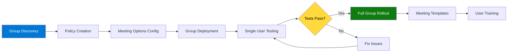
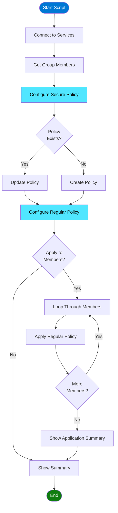
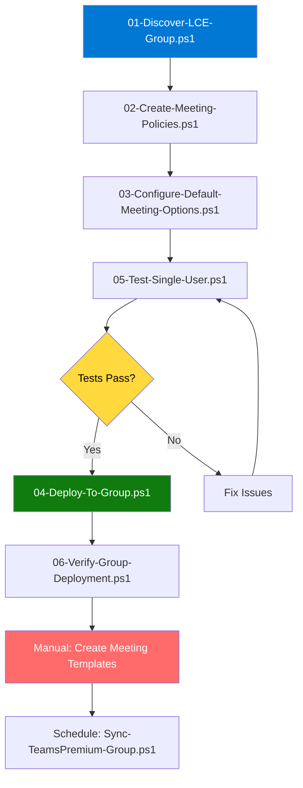

# Teams Premium Build Book
## Group-Based Deployment for LCE M365 Security
### Leonardo Company - Centre of Excellence

---

**Document Control**

| Field | Value |
|-------|-------|
| **Version** | 4.0 - Group Deployment |
| **Last Updated** | November 2025 |
| **Owner** | George Zarif |
| **Email** | george.zarif@leonardocompany.ca |
| **Target Group** | LCE M365 Security |
| **Classification** | Internal Use Only |

---

## Table of Contents

1. [Overview](#1-overview)
2. [Prerequisites](#2-prerequisites)
3. [Phase 1: Group Discovery](#3-phase-1-group-discovery)
4. [Phase 2: Policy Creation](#4-phase-2-policy-creation)
5. [Phase 3: Default Meeting Options](#5-phase-3-default-meeting-options)
6. [Phase 4: Group Deployment](#6-phase-4-group-deployment)
7. [Phase 5: Testing & Verification](#7-phase-5-testing--verification)
8. [Phase 6: Meeting Templates](#8-phase-6-meeting-templates)
9. [Ongoing Management](#9-ongoing-management)
10. [Troubleshooting](#10-troubleshooting)

---

## 1. Overview

### 1.1 Purpose

This build book provides step-by-step instructions for deploying Microsoft Teams Premium with Customer Managed Keys (CMK) to the **LCE M365 Security** group at Leonardo Company.

### 1.2 Deployment Strategy



### 1.3 Key Features

**For Secure Meetings:**
- ✅ Watermarks on camera and screen sharing
- ✅ Lobby restricted to organization members only
- ✅ Phone dial-in users must wait in lobby
- ✅ Only organizer can control presenters
- ✅ External users cannot request control
- ✅ CMK encryption on all content

**For Regular Meetings:**
- ✅ Open lobby (organization + guests)
- ✅ Phone dial-in users can bypass lobby
- ✅ Everyone can be a presenter
- ✅ External users can request control
- ✅ CMK encryption on all content

---

## 2. Prerequisites

### 2.1 Required Licenses

**For Each Group Member:**
- ✅ Microsoft 365 E5 (or E3 + Teams Premium add-on)
- ✅ Teams Premium license
- ✅ Azure Active Directory Premium P1

**Verify License Availability:**

```powershell
# Check available Teams Premium licenses
Connect-MgGraph -Scopes "Organization.Read.All"

$sku = Get-MgSubscribedSku | Where-Object {$_.SkuPartNumber -eq "Microsoft_Teams_Premium"}

Write-Host "Teams Premium Licenses:" -ForegroundColor Cyan
Write-Host "  Total: $($sku.PrepaidUnits.Enabled)" -ForegroundColor White
Write-Host "  Assigned: $($sku.ConsumedUnits)" -ForegroundColor White
Write-Host "  Available: $($sku.PrepaidUnits.Enabled - $sku.ConsumedUnits)" -ForegroundColor Green

Disconnect-MgGraph
```

### 2.2 Required Permissions

**Administrator Account Needs:**
- ✅ Teams Administrator
- ✅ Global Administrator (for policy creation)
- ✅ Groups Administrator (for group management)
- ✅ License Administrator (to assign licenses)

**Verify Your Permissions:**

```powershell
Connect-MgGraph -Scopes "RoleManagement.Read.Directory"

$userId = (Get-MgContext).Account
$user = Get-MgUser -UserId $userId

$roleAssignments = Get-MgRoleManagementDirectoryRoleAssignment -Filter "principalId eq '$($user.Id)'"

Write-Host "Your assigned roles:" -ForegroundColor Cyan
foreach ($assignment in $roleAssignments) {
    $role = Get-MgRoleManagementDirectoryRoleDefinition -UnifiedRoleDefinitionId $assignment.RoleDefinitionId
    Write-Host "  - $($role.DisplayName)" -ForegroundColor Green
}

Disconnect-MgGraph
```

### 2.3 Required PowerShell Modules

```powershell
# Install required modules (run as Administrator)
Install-Module Microsoft.Graph -Force
Install-Module MicrosoftTeams -Force

# Update to latest versions
Update-Module Microsoft.Graph -Force
Update-Module MicrosoftTeams -Force

# Verify versions
Get-Module Microsoft.Graph -ListAvailable | Select-Object Name, Version
Get-Module MicrosoftTeams -ListAvailable | Select-Object Name, Version
```

### 2.4 Network Requirements

- ✅ Access to Microsoft 365 admin portals
- ✅ Access to Teams Admin Center
- ✅ PowerShell remoting enabled
- ✅ TLS 1.2 enabled

---

## 3. Phase 1: Group Discovery

### 3.1 Find the Target Group

**Script:** `01-Discover-LCE-Group.ps1`

```powershell
# ========================================
# Discover LCE M365 Security Group
# Author: George Zarif
# Purpose: Identify group and members for Teams Premium deployment
# ========================================

Write-Host "`n╔══════════════════════════════════════════════════════════════════╗" -ForegroundColor Cyan
Write-Host "║  PHASE 1: GROUP DISCOVERY                                       ║" -ForegroundColor Cyan
Write-Host "╚══════════════════════════════════════════════════════════════════╝" -ForegroundColor Cyan

# Connect
Write-Host "`nConnecting to Microsoft Graph..." -ForegroundColor Yellow
Connect-MgGraph -Scopes "Group.Read.All", "User.Read.All", "Directory.Read.All"

# Search for group
$groupName = "LCE M365 Security"
Write-Host "`nSearching for group: $groupName" -ForegroundColor Cyan

$group = Get-MgGroup -Filter "displayName eq '$groupName'"

if (!$group) {
    Write-Host "✗ Group not found!" -ForegroundColor Red
    Write-Host "`nSearching for similar names..." -ForegroundColor Yellow
    
    $similarGroups = Get-MgGroup -Filter "startswith(displayName, 'LCE')" -All
    
    if ($similarGroups) {
        Write-Host "`nFound similar groups:" -ForegroundColor Cyan
        $similarGroups | Select-Object DisplayName, Id, Mail | Format-Table -AutoSize
    }
    
    Disconnect-MgGraph
    exit 1
}

Write-Host "✓ Found group!" -ForegroundColor Green
Write-Host "  Display Name: $($group.DisplayName)" -ForegroundColor White
Write-Host "  Group ID: $($group.Id)" -ForegroundColor Gray
Write-Host "  Mail: $($group.Mail)" -ForegroundColor Gray
Write-Host "  Description: $($group.Description)" -ForegroundColor Gray

# Get members
Write-Host "`nRetrieving group members..." -ForegroundColor Cyan
$members = Get-MgGroupMember -GroupId $group.Id -All

Write-Host "✓ Found $($members.Count) member(s)" -ForegroundColor Green

# Get detailed member info
$memberDetails = @()

foreach ($member in $members) {
    Write-Host "  Processing: $($member.Id)" -ForegroundColor Gray
    
    $user = Get-MgUser -UserId $member.Id -Property Id,DisplayName,UserPrincipalName,Mail,JobTitle,Department,OfficeLocation
    
    $memberDetails += [PSCustomObject]@{
        DisplayName = $user.DisplayName
        Email = $user.UserPrincipalName
        JobTitle = $user.JobTitle
        Department = $user.Department
        Office = $user.OfficeLocation
        UserId = $user.Id
    }
}

# Display members
Write-Host "`n╔══════════════════════════════════════════════════════════════════╗" -ForegroundColor Cyan
Write-Host "║  GROUP MEMBERS                                                  ║" -ForegroundColor Cyan
Write-Host "╚══════════════════════════════════════════════════════════════════╝" -ForegroundColor Cyan
Write-Host ""

$memberDetails | Format-Table -AutoSize

# Export for records
$exportPath = "C:\LeonardoReports"
New-Item -Path $exportPath -ItemType Directory -Force -ErrorAction SilentlyContinue | Out-Null

$reportFile = "$exportPath\LCE-M365-Security-Members-$(Get-Date -Format 'yyyy-MM-dd').csv"
$memberDetails | Export-Csv -Path $reportFile -NoTypeInformation

Write-Host "✓ Member list exported to: $reportFile" -ForegroundColor Green

# Summary
Write-Host "`n╔══════════════════════════════════════════════════════════════════╗" -ForegroundColor Cyan
Write-Host "║  DISCOVERY SUMMARY                                              ║" -ForegroundColor Cyan
Write-Host "╚══════════════════════════════════════════════════════════════════╝" -ForegroundColor Cyan
Write-Host ""
Write-Host "Group Name: $($group.DisplayName)" -ForegroundColor Yellow
Write-Host "Total Members: $($members.Count)" -ForegroundColor White
Write-Host "Report Location: $reportFile" -ForegroundColor Gray

Disconnect-MgGraph

Write-Host "`n✅ Phase 1 Complete - Group Discovered`n" -ForegroundColor Green
```

**Expected Output:**

```
╔══════════════════════════════════════════════════════════════════╗
║  PHASE 1: GROUP DISCOVERY                                       ║
╚══════════════════════════════════════════════════════════════════╝

Connecting to Microsoft Graph...

Searching for group: LCE M365 Security
✓ Found group!
  Display Name: LCE M365 Security
  Group ID: xxxxxxxx-xxxx-xxxx-xxxx-xxxxxxxxxxxx
  Mail: lcem365security@leonardocompany.ca
  Description: Centre of Excellence team

Retrieving group members...
✓ Found 5 member(s)

╔══════════════════════════════════════════════════════════════════╗
║  GROUP MEMBERS                                                  ║
╚══════════════════════════════════════════════════════════════════╝

DisplayName    Email                              JobTitle                    Department
-----------    -----                              --------                    ----------
George Zarif   george.zarif@leonardocompany.ca   Administrator               IT
John Doe       john.doe@leonardocompany.ca       Security Analyst            Security
Jane Smith     jane.smith@leonardocompany.ca     Platform Engineer           IT

✓ Member list exported to: C:\LeonardoReports\LCE-M365-Security-Members-2025-11-17.csv

╔══════════════════════════════════════════════════════════════════╗
║  DISCOVERY SUMMARY                                              ║
╚══════════════════════════════════════════════════════════════════╝

Group Name: LCE M365 Security
Total Members: 5
Report Location: C:\LeonardoReports\LCE-M365-Security-Members-2025-11-17.csv

✅ Phase 1 Complete - Group Discovered
```

---

## 4. Phase 2: Policy Creation

### 4.1 Create Meeting Policies

**Script:** `02-Create-Meeting-Policies.ps1`

```powershell
# ========================================
# Create Teams Premium Meeting Policies
# Author: George Zarif
# Creates: Leonardo-Secure-Meeting-Group & Leonardo-Regular-Meeting-Group
# ========================================

Write-Host "`n╔══════════════════════════════════════════════════════════════════╗" -ForegroundColor Cyan
Write-Host "║  PHASE 2: POLICY CREATION                                       ║" -ForegroundColor Cyan
Write-Host "╚══════════════════════════════════════════════════════════════════╝" -ForegroundColor Cyan

# Connect
Write-Host "`nConnecting to Microsoft Teams..." -ForegroundColor Yellow
Connect-MicrosoftTeams

$securePolicyName = "Leonardo-Secure-Meeting-Group"
$regularPolicyName = "Leonardo-Regular-Meeting-Group"

# ========================================
# STEP 1: Create Secure Policy
# ========================================

Write-Host "`n[1/2] Creating SECURE meeting policy..." -ForegroundColor Cyan

# Remove if exists (for clean slate)
try {
    Remove-CsTeamsMeetingPolicy -Identity $securePolicyName -Confirm:$false -ErrorAction SilentlyContinue
    Write-Host "  Removed existing policy" -ForegroundColor Gray
    Start-Sleep -Seconds 3
} catch {}

# Create new policy
try {
    New-CsTeamsMeetingPolicy -Identity $securePolicyName `
        -Description "Secure meetings for LCE M365 Security group - watermarks enabled" `
        -AllowCloudRecording $true `
        -AllowRecordingStorageOutsideRegion $false `
        -AllowTranscription $true `
        -LiveCaptionsEnabledType "DisabledUserOverride" `
        -AllowMeetingCoach $true `
        -AutoAdmittedUsers "EveryoneInCompanyExcludingGuests" `
        -AllowPSTNUsersToBypassLobby $false `
        -AllowAnonymousUsersToJoinMeeting $false `
        -AllowAnonymousUsersToStartMeeting $false `
        -ScreenSharingMode "EntireScreen" `
        -AllowParticipantGiveRequestControl $true `
        -AllowExternalParticipantGiveRequestControl $false `
        -WhoCanRegister "EveryoneInCompany" `
        -AllowMeetingRegistration $true `
        -AllowMeetingReactions $true `
        -AllowPrivateMeetingScheduling $true `
        -AllowWhiteboard $true `
        -AllowSharedNotes $true `
        -AllowPowerPointSharing $true
    
    Write-Host "  ✓ Basic secure policy created" -ForegroundColor Green
    
    # Add watermarks (separate step for compatibility)
    Start-Sleep -Seconds 2
    Set-CsTeamsMeetingPolicy -Identity $securePolicyName `
        -AllowWatermarkForCameraVideo $true `
        -AllowWatermarkForScreenSharing $true
    
    Write-Host "  ✓ Watermarks enabled" -ForegroundColor Green
    
} catch {
    Write-Host "  ✗ Error: $($_.Exception.Message)" -ForegroundColor Red
    Disconnect-MicrosoftTeams
    exit 1
}

# ========================================
# STEP 2: Create Regular Policy
# ========================================

Write-Host "`n[2/2] Creating REGULAR meeting policy..." -ForegroundColor Cyan

# Remove if exists
try {
    Remove-CsTeamsMeetingPolicy -Identity $regularPolicyName -Confirm:$false -ErrorAction SilentlyContinue
    Write-Host "  Removed existing policy" -ForegroundColor Gray
    Start-Sleep -Seconds 3
} catch {}

# Create new policy
try {
    New-CsTeamsMeetingPolicy -Identity $regularPolicyName `
        -Description "Regular meetings for LCE M365 Security group - no watermarks" `
        -AllowCloudRecording $true `
        -AllowRecordingStorageOutsideRegion $false `
        -AllowTranscription $true `
        -LiveCaptionsEnabledType "DisabledUserOverride" `
        -AllowMeetingCoach $true `
        -AutoAdmittedUsers "Everyone" `
        -AllowPSTNUsersToBypassLobby $true `
        -AllowAnonymousUsersToJoinMeeting $true `
        -AllowAnonymousUsersToStartMeeting $false `
        -ScreenSharingMode "EntireScreen" `
        -AllowParticipantGiveRequestControl $true `
        -AllowExternalParticipantGiveRequestControl $true `
        -WhoCanRegister "Everyone" `
        -AllowMeetingRegistration $true `
        -AllowMeetingReactions $true `
        -AllowPrivateMeetingScheduling $true `
        -AllowWhiteboard $true `
        -AllowSharedNotes $true `
        -AllowPowerPointSharing $true
    
    Write-Host "  ✓ Regular policy created" -ForegroundColor Green
    
    # Ensure watermarks are off
    Start-Sleep -Seconds 2
    Set-CsTeamsMeetingPolicy -Identity $regularPolicyName `
        -AllowWatermarkForCameraVideo $false `
        -AllowWatermarkForScreenSharing $false
    
    Write-Host "  ✓ Watermarks disabled" -ForegroundColor Green
    
} catch {
    Write-Host "  ✗ Error: $($_.Exception.Message)" -ForegroundColor Red
    Disconnect-MicrosoftTeams
    exit 1
}

# ========================================
# VERIFICATION
# ========================================

Write-Host "`n╔══════════════════════════════════════════════════════════════════╗" -ForegroundColor Cyan
Write-Host "║  POLICY VERIFICATION                                            ║" -ForegroundColor Cyan
Write-Host "╚══════════════════════════════════════════════════════════════════╝" -ForegroundColor Cyan

$securePolicy = Get-CsTeamsMeetingPolicy -Identity $securePolicyName
$regularPolicy = Get-CsTeamsMeetingPolicy -Identity $regularPolicyName

Write-Host "`nSECURE POLICY ($securePolicyName):" -ForegroundColor Yellow
Write-Host "  Camera Watermark: $($securePolicy.AllowWatermarkForCameraVideo)" -ForegroundColor $(if($securePolicy.AllowWatermarkForCameraVideo -eq $true){"Green"}else{"Red"})
Write-Host "  Screen Watermark: $($securePolicy.AllowWatermarkForScreenSharing)" -ForegroundColor $(if($securePolicy.AllowWatermarkForScreenSharing -eq $true){"Green"}else{"Red"})
Write-Host "  Lobby: $($securePolicy.AutoAdmittedUsers)" -ForegroundColor White
Write-Host "  Anonymous Join: $($securePolicy.AllowAnonymousUsersToJoinMeeting)" -ForegroundColor White

Write-Host "`nREGULAR POLICY ($regularPolicyName):" -ForegroundColor Yellow
Write-Host "  Camera Watermark: $($regularPolicy.AllowWatermarkForCameraVideo)" -ForegroundColor $(if($regularPolicy.AllowWatermarkForCameraVideo -eq $false){"Green"}else{"Red"})
Write-Host "  Screen Watermark: $($regularPolicy.AllowWatermarkForScreenSharing)" -ForegroundColor $(if($regularPolicy.AllowWatermarkForScreenSharing -eq $false){"Green"}else{"Red"})
Write-Host "  Lobby: $($regularPolicy.AutoAdmittedUsers)" -ForegroundColor White
Write-Host "  Anonymous Join: $($regularPolicy.AllowAnonymousUsersToJoinMeeting)" -ForegroundColor White

# Export policies for documentation
$exportPath = "C:\LeonardoReports"
$securePolicy | ConvertTo-Json -Depth 10 | Out-File "$exportPath\Policy-Secure-$(Get-Date -Format 'yyyy-MM-dd').json"
$regularPolicy | ConvertTo-Json -Depth 10 | Out-File "$exportPath\Policy-Regular-$(Get-Date -Format 'yyyy-MM-dd').json"

Write-Host "`n✓ Policies exported to: $exportPath" -ForegroundColor Gray

Disconnect-MicrosoftTeams

Write-Host "`n✅ Phase 2 Complete - Policies Created`n" -ForegroundColor Green
```

---

## 5. Phase 3: Default Meeting Options

### 5.1 Configure Meeting Options Script

**Script:** `03-Configure-Default-Meeting-Options.ps1`

This script sets the default meeting options (lobby behavior, presenters, recording, etc.) for both policies. This ensures that when users create meetings with these templates, the meeting options are pre-configured correctly.

```powershell
#Requires -Version 5.1

<#
.SYNOPSIS
    Configure Default Meeting Options for LCE M365 Security Group

.DESCRIPTION
    Sets default meeting policies with proper lobby and security settings.
    Configures both Secure and Regular policies with appropriate defaults.

.PARAMETER ApplyToAllGroupMembers
    Apply policies to all group members immediately after configuration

.EXAMPLE
    .\03-Configure-Default-Meeting-Options.ps1
    
    Configures both policies without applying to users

.EXAMPLE
    .\03-Configure-Default-Meeting-Options.ps1 -ApplyToAllGroupMembers
    
    Configures policies AND applies Regular policy to all group members

.NOTES
    Author: George Zarif
    Version: 1.0
    Last Updated: November 2025
#>

param(
    [switch]$ApplyToAllGroupMembers
)

Write-Host ""
Write-Host "========================================" -ForegroundColor Cyan
Write-Host "Configure Default Meeting Options" -ForegroundColor Cyan
Write-Host "LCE M365 Security Group" -ForegroundColor Cyan
Write-Host "========================================" -ForegroundColor Cyan
Write-Host ""

# Connect to services
Write-Host "Connecting to Microsoft Teams..." -ForegroundColor Yellow
Connect-MicrosoftTeams

Write-Host "Connecting to Microsoft Graph..." -ForegroundColor Yellow
Connect-MgGraph -Scopes "Group.Read.All","User.Read.All"

# Get group members
Write-Host ""
Write-Host "Getting LCE M365 Security group members..." -ForegroundColor Yellow
$group = Get-MgGroup -Filter "displayName eq 'LCE M365 Security'"
$members = Get-MgGroupMember -GroupId $group.Id -All
Write-Host "Found $($members.Count) members" -ForegroundColor Green

# ========================================
# Configure Secure Policy
# ========================================

Write-Host ""
Write-Host "Configuring Leonardo-Secure-Meeting-Group policy..." -ForegroundColor Cyan

$secureParams = @{
    Identity = "Leonardo-Secure-Meeting-Group"
    AutoAdmittedUsers = "EveryoneInCompanyExcludingGuests"
    AllowPSTNUsersToBypassLobby = $false
    AllowAnonymousUsersToJoinMeeting = $false
    AllowAnonymousUsersToStartMeeting = $false
    AllowWatermarkForCameraVideo = $true
    AllowWatermarkForScreenSharing = $true
    AllowMeetingCoach = $false
    DesignatedPresenterRoleMode = "OrganizerOnlyUserOverride"
    AllowParticipantGiveRequestControl = $false
    AllowExternalParticipantGiveRequestControl = $false
    AllowRecording = $true
    AllowTranscription = $true
    AllowCloudRecording = $true
    RecordingStorageMode = "Stream"
    AllowBreakoutRooms = $true
    AllowMeetingReactions = $true
    MeetingChatEnabledType = "Enabled"
    Description = "Secure meeting settings with watermarks and strict access controls"
}

try {
    $existing = Get-CsTeamsMeetingPolicy -Identity "Leonardo-Secure-Meeting-Group" -ErrorAction SilentlyContinue
    if ($existing) {
        Set-CsTeamsMeetingPolicy @secureParams
        Write-Host "  Updated Secure policy" -ForegroundColor Green
    }
    else {
        New-CsTeamsMeetingPolicy @secureParams
        Write-Host "  Created Secure policy" -ForegroundColor Green
    }
}
catch {
    Write-Host "  Error: $($_.Exception.Message)" -ForegroundColor Red
}

# ========================================
# Configure Regular Policy
# ========================================

Write-Host ""
Write-Host "Configuring Leonardo-Regular-Meeting-Group policy..." -ForegroundColor Cyan

$regularParams = @{
    Identity = "Leonardo-Regular-Meeting-Group"
    AutoAdmittedUsers = "EveryoneInCompany"
    AllowPSTNUsersToBypassLobby = $true
    AllowAnonymousUsersToJoinMeeting = $true
    AllowAnonymousUsersToStartMeeting = $false
    AllowWatermarkForCameraVideo = $false
    AllowWatermarkForScreenSharing = $false
    AllowMeetingCoach = $true
    DesignatedPresenterRoleMode = "EveryoneUserOverride"
    AllowParticipantGiveRequestControl = $true
    AllowExternalParticipantGiveRequestControl = $true
    AllowRecording = $true
    AllowTranscription = $true
    AllowCloudRecording = $true
    RecordingStorageMode = "Stream"
    AllowBreakoutRooms = $true
    AllowMeetingReactions = $true
    MeetingChatEnabledType = "Enabled"
    Description = "Regular meeting settings for standard collaboration"
}

try {
    $existing = Get-CsTeamsMeetingPolicy -Identity "Leonardo-Regular-Meeting-Group" -ErrorAction SilentlyContinue
    if ($existing) {
        Set-CsTeamsMeetingPolicy @regularParams
        Write-Host "  Updated Regular policy" -ForegroundColor Green
    }
    else {
        New-CsTeamsMeetingPolicy @regularParams
        Write-Host "  Created Regular policy" -ForegroundColor Green
    }
}
catch {
    Write-Host "  Error: $($_.Exception.Message)" -ForegroundColor Red
}

# ========================================
# Apply to members if requested
# ========================================

if ($ApplyToAllGroupMembers) {
    Write-Host ""
    Write-Host "========================================" -ForegroundColor Cyan
    Write-Host "Applying Policies to Group Members" -ForegroundColor Cyan
    Write-Host "========================================" -ForegroundColor Cyan
    
    $success = 0
    $failed = 0
    
    foreach ($member in $members) {
        $user = Get-MgUser -UserId $member.Id -Property DisplayName,UserPrincipalName
        Write-Host ""
        Write-Host "Processing: $($user.DisplayName)" -ForegroundColor Gray
        
        try {
            Grant-CsTeamsMeetingPolicy -Identity $user.UserPrincipalName -PolicyName "Leonardo-Regular-Meeting-Group"
            Write-Host "  Success" -ForegroundColor Green
            $success++
            Start-Sleep -Seconds 2
        }
        catch {
            Write-Host "  Failed: $($_.Exception.Message)" -ForegroundColor Red
            $failed++
        }
    }
    
    Write-Host ""
    Write-Host "========================================" -ForegroundColor Cyan
    Write-Host "Summary" -ForegroundColor Cyan
    Write-Host "========================================" -ForegroundColor Cyan
    Write-Host "Total: $($members.Count)" -ForegroundColor White
    Write-Host "Success: $success" -ForegroundColor Green
    Write-Host "Failed: $failed" -ForegroundColor $(if($failed -gt 0){'Red'}else{'Green'})
}

# ========================================
# Show configuration summary
# ========================================

Write-Host ""
Write-Host "========================================" -ForegroundColor Cyan
Write-Host "Configuration Summary" -ForegroundColor Cyan
Write-Host "========================================" -ForegroundColor Cyan
Write-Host ""
Write-Host "SECURE POLICY:" -ForegroundColor Yellow
Write-Host "  Lobby: Org users only" -ForegroundColor White
Write-Host "  Anonymous: Blocked" -ForegroundColor White
Write-Host "  Phone dial-in: Must wait in lobby" -ForegroundColor White
Write-Host "  Watermarks: Enabled (camera + screen)" -ForegroundColor Green
Write-Host "  Presenters: Organizer controls" -ForegroundColor White
Write-Host "  Recording: Enabled (Stream storage)" -ForegroundColor White
Write-Host "  Transcription: Enabled" -ForegroundColor White
Write-Host ""
Write-Host "REGULAR POLICY:" -ForegroundColor Yellow
Write-Host "  Lobby: Org + guests" -ForegroundColor White
Write-Host "  Anonymous: Allowed to join" -ForegroundColor White
Write-Host "  Phone dial-in: Can bypass lobby" -ForegroundColor White
Write-Host "  Watermarks: Disabled" -ForegroundColor Gray
Write-Host "  Presenters: Everyone can present" -ForegroundColor White
Write-Host "  Recording: Enabled (Stream storage)" -ForegroundColor White
Write-Host "  Meeting Coach: Enabled" -ForegroundColor White

Write-Host ""
Write-Host "IMPORTANT:" -ForegroundColor Yellow
Write-Host "  - Settings apply to NEW meetings only" -ForegroundColor White
Write-Host "  - Changes take up to 24 hours to propagate" -ForegroundColor White
Write-Host "  - Users must sign out/in to Teams" -ForegroundColor White

# Cleanup
Write-Host ""
Disconnect-MicrosoftTeams
Disconnect-MgGraph

Write-Host ""
Write-Host "Complete!" -ForegroundColor Green
Write-Host ""
```

### 5.2 What This Script Does



### 5.3 Usage Examples

**Example 1: Configure Policies Only (No User Assignment)**

```powershell
# Just configure the policies, don't apply to users yet
.\03-Configure-Default-Meeting-Options.ps1
```

**Example 2: Configure AND Apply to All Group Members**

```powershell
# Configure policies AND apply Regular policy to all members
.\03-Configure-Default-Meeting-Options.ps1 -ApplyToAllGroupMembers
```

### 5.4 Expected Output

```
========================================
Configure Default Meeting Options
LCE M365 Security Group
========================================

Connecting to Microsoft Teams...
Connecting to Microsoft Graph...

Getting LCE M365 Security group members...
Found 5 members

Configuring Leonardo-Secure-Meeting-Group policy...
  Updated Secure policy

Configuring Leonardo-Regular-Meeting-Group policy...
  Updated Regular policy

========================================
Configuration Summary
========================================

SECURE POLICY:
  Lobby: Org users only
  Anonymous: Blocked
  Phone dial-in: Must wait in lobby
  Watermarks: Enabled (camera + screen)
  Presenters: Organizer controls
  Recording: Enabled (Stream storage)
  Transcription: Enabled

REGULAR POLICY:
  Lobby: Org + guests
  Anonymous: Allowed to join
  Phone dial-in: Can bypass lobby
  Watermarks: Disabled
  Presenters: Everyone can present
  Recording: Enabled (Stream storage)
  Meeting Coach: Enabled

IMPORTANT:
  - Settings apply to NEW meetings only
  - Changes take up to 24 hours to propagate
  - Users must sign out/in to Teams

Complete!
```

---

## 6. Phase 4: Group Deployment

### 6.1 Deploy to Entire Group

**Script:** `04-Deploy-To-Group.ps1`

```powershell
# ========================================
# Deploy Teams Premium Policies to LCE M365 Security Group
# Author: George Zarif
# Purpose: Apply Regular policy as default to all group members
# ========================================

Write-Host "`n╔══════════════════════════════════════════════════════════════════╗" -ForegroundColor Cyan
Write-Host "║  PHASE 4: GROUP DEPLOYMENT                                      ║" -ForegroundColor Cyan
Write-Host "╚══════════════════════════════════════════════════════════════════╝" -ForegroundColor Cyan

# Connect
Write-Host "`nConnecting to services..." -ForegroundColor Yellow
Connect-MicrosoftTeams
Connect-MgGraph -Scopes "Group.Read.All", "User.Read.All"

# Get group
$groupName = "LCE M365 Security"
$defaultPolicyName = "Leonardo-Regular-Meeting-Group"

Write-Host "`nRetrieving group: $groupName" -ForegroundColor Cyan
$group = Get-MgGroup -Filter "displayName eq '$groupName'"

if (!$group) {
    Write-Host "✗ Group not found!" -ForegroundColor Red
    Disconnect-MicrosoftTeams
    Disconnect-MgGraph
    exit 1
}

Write-Host "✓ Found group: $($group.DisplayName)" -ForegroundColor Green

# Get members
Write-Host "`nRetrieving group members..." -ForegroundColor Cyan
$members = Get-MgGroupMember -GroupId $group.Id -All
Write-Host "✓ Found $($members.Count) member(s)" -ForegroundColor Green

# Get user details
$users = @()
foreach ($member in $members) {
    $user = Get-MgUser -UserId $member.Id -Property Id,DisplayName,UserPrincipalName
    $users += $user
}

# Display members
Write-Host "`nMembers to configure:" -ForegroundColor Cyan
$users | Select-Object DisplayName, UserPrincipalName | Format-Table -AutoSize

# Confirmation
Write-Host "`nReady to apply policy: $defaultPolicyName" -ForegroundColor Yellow
Write-Host "This will be applied to $($users.Count) user(s)" -ForegroundColor Yellow
Write-Host ""
$confirm = Read-Host "Continue? (Y/N)"

if ($confirm -ne "Y" -and $confirm -ne "y") {
    Write-Host "Deployment cancelled by user" -ForegroundColor Yellow
    Disconnect-MicrosoftTeams
    Disconnect-MgGraph
    exit 0
}

# Apply policies
Write-Host "`n╔══════════════════════════════════════════════════════════════════╗" -ForegroundColor Cyan
Write-Host "║  APPLYING POLICIES                                              ║" -ForegroundColor Cyan
Write-Host "╚══════════════════════════════════════════════════════════════════╝" -ForegroundColor Cyan

$results = @()
$successCount = 0
$failCount = 0

foreach ($user in $users) {
    Write-Host "`nProcessing: $($user.DisplayName)" -ForegroundColor Cyan
    Write-Host "  Email: $($user.UserPrincipalName)" -ForegroundColor Gray
    
    try {
        # Apply Regular policy as default
        Grant-CsTeamsMeetingPolicy -Identity $user.UserPrincipalName -PolicyName $defaultPolicyName
        Write-Host "  ✓ Policy applied successfully" -ForegroundColor Green
        
        $successCount++
        $results += [PSCustomObject]@{
            User = $user.DisplayName
            Email = $user.UserPrincipalName
            Status = "Success"
            Policy = $defaultPolicyName
            Timestamp = Get-Date -Format "yyyy-MM-dd HH:mm:ss"
        }
        
        # Delay to avoid throttling
        Start-Sleep -Seconds 2
        
    } catch {
        Write-Host "  ✗ Error: $($_.Exception.Message)" -ForegroundColor Red
        
        $failCount++
        $results += [PSCustomObject]@{
            User = $user.DisplayName
            Email = $user.UserPrincipalName
            Status = "Failed"
            Policy = "N/A"
            Error = $_.Exception.Message
            Timestamp = Get-Date -Format "yyyy-MM-dd HH:mm:ss"
        }
    }
}

# Summary
Write-Host "`n╔══════════════════════════════════════════════════════════════════╗" -ForegroundColor Cyan
Write-Host "║  DEPLOYMENT SUMMARY                                             ║" -ForegroundColor Cyan
Write-Host "╚══════════════════════════════════════════════════════════════════╝" -ForegroundColor Cyan
Write-Host ""
Write-Host "Group: $groupName" -ForegroundColor Yellow
Write-Host "Policy Applied: $defaultPolicyName" -ForegroundColor Yellow
Write-Host ""
Write-Host "Total Members: $($users.Count)" -ForegroundColor White
Write-Host "Successfully Configured: $successCount" -ForegroundColor Green
Write-Host "Failed: $failCount" -ForegroundColor $(if($failCount -gt 0){"Red"}else{"Green"})

# Detailed results
if ($results.Count -gt 0) {
    Write-Host "`nDetailed Results:" -ForegroundColor Cyan
    $results | Format-Table -AutoSize
}

# Export results
$exportPath = "C:\LeonardoReports"
New-Item -Path $exportPath -ItemType Directory -Force -ErrorAction SilentlyContinue | Out-Null

$reportFile = "$exportPath\TeamsPremium-Deployment-$(Get-Date -Format 'yyyy-MM-dd-HHmm').csv"
$results | Export-Csv -Path $reportFile -NoTypeInformation

Write-Host "`n✓ Report saved to: $reportFile" -ForegroundColor Gray

# Next steps
Write-Host "`n╔══════════════════════════════════════════════════════════════════╗" -ForegroundColor Cyan
Write-Host "║  NEXT STEPS                                                     ║" -ForegroundColor Cyan
Write-Host "╚══════════════════════════════════════════════════════════════════╝" -ForegroundColor Cyan
Write-Host ""
Write-Host "1. Policies may take up to 24 hours to fully propagate" -ForegroundColor Yellow
Write-Host "2. Ask users to sign out and back in to Teams" -ForegroundColor Yellow
Write-Host "3. Run Phase 5 testing script to verify" -ForegroundColor Yellow
Write-Host "4. Create meeting templates in Teams Admin Center" -ForegroundColor Yellow

Disconnect-MicrosoftTeams
Disconnect-MgGraph

Write-Host "`n✅ Phase 4 Complete - Group Deployment Finished`n" -ForegroundColor Green
```

---

## 7. Phase 5: Testing & Verification

### 7.1 Single User Testing Script

Before rolling out to the entire group, test with a single user to ensure everything works correctly.

**Script:** `05-Test-Single-User.ps1`

```powershell
# ========================================
# Test Teams Premium Deployment - Single User
# Author: George Zarif
# Purpose: Verify configuration on a test user before full deployment
# ========================================

param(
    [Parameter(Mandatory=$true)]
    [string]$TestUserEmail
)

Write-Host "`n╔══════════════════════════════════════════════════════════════════╗" -ForegroundColor Cyan
Write-Host "║  PHASE 5: SINGLE USER TESTING                                   ║" -ForegroundColor Cyan
Write-Host "╚══════════════════════════════════════════════════════════════════╝" -ForegroundColor Cyan

# Connect
Write-Host "`nConnecting to services..." -ForegroundColor Yellow
Connect-MicrosoftTeams
Connect-MgGraph -Scopes "User.Read.All"

# Get user
Write-Host "`nRetrieving test user: $TestUserEmail" -ForegroundColor Cyan
$user = Get-MgUser -Filter "userPrincipalName eq '$TestUserEmail'"

if (!$user) {
    Write-Host "✗ User not found!" -ForegroundColor Red
    Disconnect-MicrosoftTeams
    Disconnect-MgGraph
    exit 1
}

Write-Host "✓ Found user: $($user.DisplayName)" -ForegroundColor Green

# Test checklist
$testResults = @{
    UserFound = $true
    HasTeamsPremium = $false
    HasPolicyAssigned = $false
    PolicyName = ""
    WatermarksEnabled = $false
    ReadyForTesting = $false
}

# ========================================
# TEST 1: License Check
# ========================================

Write-Host "`n[1/5] Checking Teams Premium license..." -ForegroundColor Cyan

$licenses = Get-MgUserLicenseDetail -UserId $user.Id

$hasTeamsPremium = $licenses | Where-Object {$_.SkuPartNumber -eq "Microsoft_Teams_Premium"}

if ($hasTeamsPremium) {
    Write-Host "  ✓ Teams Premium license assigned" -ForegroundColor Green
    $testResults.HasTeamsPremium = $true
} else {
    Write-Host "  ✗ NO Teams Premium license" -ForegroundColor Red
    Write-Host "  Action: Assign Teams Premium license to this user" -ForegroundColor Yellow
}

# ========================================
# TEST 2: Policy Assignment
# ========================================

Write-Host "`n[2/5] Checking policy assignment..." -ForegroundColor Cyan

try {
    $policyAssignment = Get-CsUserPolicyAssignment -Identity $user.UserPrincipalName -PolicyType TeamsMeetingPolicy
    
    if ($policyAssignment.PolicyName -like "Leonardo-*") {
        Write-Host "  ✓ Leonardo policy assigned: $($policyAssignment.PolicyName)" -ForegroundColor Green
        $testResults.HasPolicyAssigned = $true
        $testResults.PolicyName = $policyAssignment.PolicyName
    } else {
        Write-Host "  ⚠️  Policy assigned but not Leonardo: $($policyAssignment.PolicyName)" -ForegroundColor Yellow
        $testResults.PolicyName = $policyAssignment.PolicyName
    }
} catch {
    Write-Host "  ✗ NO policy assigned" -ForegroundColor Red
    Write-Host "  Action: Run deployment script for this user" -ForegroundColor Yellow
}

# ========================================
# TEST 3: Policy Settings Verification
# ========================================

Write-Host "`n[3/5] Verifying policy settings..." -ForegroundColor Cyan

if ($testResults.PolicyName -like "Leonardo-*") {
    $policy = Get-CsTeamsMeetingPolicy -Identity $testResults.PolicyName
    
    Write-Host "  Policy Details:" -ForegroundColor Gray
    Write-Host "    Lobby: $($policy.AutoAdmittedUsers)" -ForegroundColor White
    Write-Host "    Anonymous Join: $($policy.AllowAnonymousUsersToJoinMeeting)" -ForegroundColor White
    Write-Host "    Camera Watermark: $($policy.AllowWatermarkForCameraVideo)" -ForegroundColor White
    Write-Host "    Screen Watermark: $($policy.AllowWatermarkForScreenSharing)" -ForegroundColor White
    
    if ($testResults.PolicyName -eq "Leonardo-Secure-Meeting-Group") {
        if ($policy.AllowWatermarkForCameraVideo -eq $true -and $policy.AllowWatermarkForScreenSharing -eq $true) {
            Write-Host "  ✓ Secure policy watermarks enabled correctly" -ForegroundColor Green
            $testResults.WatermarksEnabled = $true
        } else {
            Write-Host "  ✗ Secure policy watermarks NOT enabled" -ForegroundColor Red
        }
    }
    
} else {
    Write-Host "  ⊘ Cannot verify - no Leonardo policy assigned" -ForegroundColor Gray
}

# ========================================
# TEST 4: Group Membership
# ========================================

Write-Host "`n[4/5] Checking group membership..." -ForegroundColor Cyan

$groupName = "LCE M365 Security"
$group = Get-MgGroup -Filter "displayName eq '$groupName'"
$isMember = Get-MgGroupMember -GroupId $group.Id -All | Where-Object {$_.Id -eq $user.Id}

if ($isMember) {
    Write-Host "  ✓ User is member of $groupName" -ForegroundColor Green
} else {
    Write-Host "  ✗ User is NOT a member of $groupName" -ForegroundColor Red
    Write-Host "  Action: Add user to group if needed" -ForegroundColor Yellow
}

# ========================================
# TEST 5: Manual Test Instructions
# ========================================

Write-Host "`n[5/5] Manual testing required..." -ForegroundColor Cyan
Write-Host ""
Write-Host "  Have the test user ($($user.DisplayName)) do the following:" -ForegroundColor Yellow
Write-Host ""
Write-Host "  1. Sign out of Teams" -ForegroundColor White
Write-Host "  2. Sign back in to Teams" -ForegroundColor White
Write-Host "  3. Wait 5 minutes for policy refresh" -ForegroundColor White
Write-Host "  4. Create a NEW test meeting:" -ForegroundColor White
Write-Host "     - Calendar → New meeting" -ForegroundColor Gray
Write-Host "     - Check if templates appear in dropdown" -ForegroundColor Gray
Write-Host "     - Select appropriate template" -ForegroundColor Gray
Write-Host "  5. Start the meeting and verify:" -ForegroundColor White
Write-Host "     - Watermarks appear (if Secure)" -ForegroundColor Gray
Write-Host "     - Lobby settings work correctly" -ForegroundColor Gray
Write-Host "     - Recording and transcription available" -ForegroundColor Gray

# ========================================
# SUMMARY
# ========================================

Write-Host "`n╔══════════════════════════════════════════════════════════════════╗" -ForegroundColor Cyan
Write-Host "║  TEST SUMMARY                                                   ║" -ForegroundColor Cyan
Write-Host "╚══════════════════════════════════════════════════════════════════╝" -ForegroundColor Cyan
Write-Host ""
Write-Host "Test User: $($user.DisplayName) ($($user.UserPrincipalName))" -ForegroundColor Yellow
Write-Host ""
Write-Host "✓ User Found: $($testResults.UserFound)" -ForegroundColor $(if($testResults.UserFound){"Green"}else{"Red"})
Write-Host "✓ Teams Premium License: $($testResults.HasTeamsPremium)" -ForegroundColor $(if($testResults.HasTeamsPremium){"Green"}else{"Red"})
Write-Host "✓ Policy Assigned: $($testResults.HasPolicyAssigned)" -ForegroundColor $(if($testResults.HasPolicyAssigned){"Green"}else{"Red"})
if ($testResults.PolicyName) {
    Write-Host "  Policy: $($testResults.PolicyName)" -ForegroundColor Gray
}

# Determine if ready
if ($testResults.HasTeamsPremium -and $testResults.HasPolicyAssigned) {
    Write-Host "`n✅ User is configured and ready for testing!" -ForegroundColor Green
    Write-Host "   Proceed with manual testing steps above" -ForegroundColor Yellow
} else {
    Write-Host "`n⚠️  User needs additional configuration:" -ForegroundColor Yellow
    if (!$testResults.HasTeamsPremium) {
        Write-Host "   - Assign Teams Premium license" -ForegroundColor White
    }
    if (!$testResults.HasPolicyAssigned) {
        Write-Host "   - Apply meeting policy" -ForegroundColor White
    }
}

Disconnect-MicrosoftTeams
Disconnect-MgGraph

Write-Host "`n✅ Phase 5 Testing Complete`n" -ForegroundColor Green
```

**Usage:**

```powershell
# Test with a specific user
.\05-Test-Single-User.ps1 -TestUserEmail "george.zarif@leonardocompany.ca"
```

### 7.2 Full Group Verification

**Script:** `06-Verify-Group-Deployment.ps1`

```powershell
# ========================================
# Verify Teams Premium Group Deployment
# Author: George Zarif
# Purpose: Check all group members for proper configuration
# ========================================

Write-Host "`n╔══════════════════════════════════════════════════════════════════╗" -ForegroundColor Cyan
Write-Host "║  GROUP DEPLOYMENT VERIFICATION                                  ║" -ForegroundColor Cyan
Write-Host "╚══════════════════════════════════════════════════════════════════╝" -ForegroundColor Cyan

# Connect
Write-Host "`nConnecting to services..." -ForegroundColor Yellow
Connect-MicrosoftTeams
Connect-MgGraph -Scopes "Group.Read.All", "User.Read.All"

# Get group
$groupName = "LCE M365 Security"
$group = Get-MgGroup -Filter "displayName eq '$groupName'"
$members = Get-MgGroupMember -GroupId $group.Id -All

Write-Host "`nVerifying $($members.Count) group members..." -ForegroundColor Cyan

$verificationReport = @()

foreach ($member in $members) {
    $user = Get-MgUser -UserId $member.Id -Property Id,DisplayName,UserPrincipalName
    
    Write-Host "`nChecking: $($user.DisplayName)" -ForegroundColor Gray
    
    # Check license
    $licenses = Get-MgUserLicenseDetail -UserId $user.Id
    $hasTeamsPremium = $licenses | Where-Object {$_.SkuPartNumber -eq "Microsoft_Teams_Premium"}
    
    # Check policy
    $policyAssigned = $null
    try {
        $policyAssignment = Get-CsUserPolicyAssignment -Identity $user.UserPrincipalName -PolicyType TeamsMeetingPolicy
        $policyAssigned = $policyAssignment.PolicyName
    } catch {
        $policyAssigned = "None"
    }
    
    # Determine status
    $status = "Not Ready"
    if ($hasTeamsPremium -and $policyAssigned -like "Leonardo-*") {
        $status = "✅ Ready"
        Write-Host "  ✓ Ready" -ForegroundColor Green
    } elseif (!$hasTeamsPremium) {
        $status = "⚠️  No License"
        Write-Host "  ⚠️  Missing Teams Premium license" -ForegroundColor Yellow
    } elseif ($policyAssigned -eq "None") {
        $status = "⚠️  No Policy"
        Write-Host "  ⚠️  No policy assigned" -ForegroundColor Yellow
    } else {
        $status = "⚠️  Wrong Policy"
        Write-Host "  ⚠️  Wrong policy: $policyAssigned" -ForegroundColor Yellow
    }
    
    $verificationReport += [PSCustomObject]@{
        User = $user.DisplayName
        Email = $user.UserPrincipalName
        HasTeamsPremium = if($hasTeamsPremium){"Yes"}else{"No"}
        PolicyAssigned = $policyAssigned
        Status = $status
    }
}

# Summary
Write-Host "`n╔══════════════════════════════════════════════════════════════════╗" -ForegroundColor Cyan
Write-Host "║  VERIFICATION SUMMARY                                           ║" -ForegroundColor Cyan
Write-Host "╚══════════════════════════════════════════════════════════════════╝" -ForegroundColor Cyan
Write-Host ""

$verificationReport | Format-Table -AutoSize

$ready = ($verificationReport | Where-Object {$_.Status -eq "✅ Ready"}).Count
$notReady = ($verificationReport | Where-Object {$_.Status -ne "✅ Ready"}).Count

Write-Host "`nTotal Members: $($verificationReport.Count)" -ForegroundColor White
Write-Host "Ready: $ready" -ForegroundColor Green
Write-Host "Not Ready: $notReady" -ForegroundColor $(if($notReady -gt 0){"Yellow"}else{"Green"})

if ($notReady -gt 0) {
    Write-Host "`n⚠️  Some users need attention:" -ForegroundColor Yellow
    $verificationReport | Where-Object {$_.Status -ne "✅ Ready"} | Format-Table -AutoSize
}

# Export
$exportPath = "C:\LeonardoReports"
$reportFile = "$exportPath\Verification-$(Get-Date -Format 'yyyy-MM-dd-HHmm').csv"
$verificationReport | Export-Csv -Path $reportFile -NoTypeInformation

Write-Host "`n✓ Verification report saved: $reportFile" -ForegroundColor Gray

Disconnect-MicrosoftTeams
Disconnect-MgGraph

Write-Host "`n✅ Verification Complete`n" -ForegroundColor Green
```

---

## 8. Phase 6: Meeting Templates

### 8.1 Create Templates in Teams Admin Center

**Important:** PowerShell cannot create meeting templates yet. You must create them manually in the Teams Admin Center.

**Navigation:**
1. Go to: https://admin.teams.microsoft.com
2. Meetings → Meeting templates
3. Click "+ Add"

### 8.2 Template 1: Leonardo - Secure Meeting

```
Name: Leonardo - Secure Meeting
Description: For classified, NDA, or sensitive content. Includes watermarks and strict security.
Template type: Custom

SECURITY SETTINGS:
  ✅ Watermark everyone's video
  ✅ Watermark shared content
  ❌ Allow copying content to clipboard
  ❌ Allow content digitalization

LOBBY SETTINGS:
  Who can bypass the lobby: People in my organization
  People dialing in can bypass the lobby: OFF
  Announce when people dialing in join or leave: ON

ENGAGEMENT SETTINGS:
  Who can present: Only organizers and co-organizers
  Allow mic for attendees: ON
  Allow camera for attendees: ON
  Allow meeting chat: Enabled
  Allow reactions: ON
  
RECORDING & TRANSCRIPTION:
  Automatically record: Organizer can choose
  Who can record: Organizers and co-organizers
  Transcription: Automatically transcribe
```

### 8.3 Template 2: Leonardo - Regular Meeting

```
Name: Leonardo - Regular Meeting
Description: For team syncs, casual calls, and external collaboration.
Template type: Custom

SECURITY SETTINGS:
  ❌ Watermark everyone's video
  ❌ Watermark shared content
  ✅ Allow copying content to clipboard
  ✅ Allow content digitalization

LOBBY SETTINGS:
  Who can bypass the lobby: Everyone
  People dialing in can bypass the lobby: ON
  Announce when people dialing in join or leave: OFF

ENGAGEMENT SETTINGS:
  Who can present: Everyone
  Allow mic for attendees: ON
  Allow camera for attendees: ON
  Allow meeting chat: Enabled
  Allow reactions: ON
  
RECORDING & TRANSCRIPTION:
  Automatically record: Organizer can choose
  Who can record: Organizers, co-organizers, and presenters
  Transcription: Automatically transcribe
```

---

## 9. Ongoing Management

### 9.1 Automatic Group Sync Script

**Script:** `Sync-TeamsPremium-Group.ps1`

```powershell
# ========================================
# Sync Teams Premium Policies with Group
# Author: George Zarif
# Purpose: Automatically apply policies to new group members
# Schedule: Run daily via Task Scheduler
# ========================================

param(
    [switch]$WhatIf,
    [switch]$Force
)

Write-Host "`n╔══════════════════════════════════════════════════════════════════╗" -ForegroundColor Cyan
Write-Host "║  TEAMS PREMIUM GROUP SYNC                                       ║" -ForegroundColor Cyan
Write-Host "╚══════════════════════════════════════════════════════════════════╝" -ForegroundColor Cyan

if ($WhatIf) {
    Write-Host "`n⚠️  RUNNING IN TEST MODE - No changes will be made" -ForegroundColor Yellow
}

# Connect
Connect-MicrosoftTeams
Connect-MgGraph -Scopes "Group.Read.All", "User.Read.All"

$groupName = "LCE M365 Security"
$defaultPolicy = "Leonardo-Regular-Meeting-Group"

# Get group
$group = Get-MgGroup -Filter "displayName eq '$groupName'"
$members = Get-MgGroupMember -GroupId $group.Id -All

Write-Host "`n✓ Found $($members.Count) members in group" -ForegroundColor Green

# Check each member
$needsUpdate = @()

foreach ($member in $members) {
    $user = Get-MgUser -UserId $member.Id -Property Id,DisplayName,UserPrincipalName
    
    try {
        $currentPolicy = Get-CsUserPolicyAssignment -Identity $user.UserPrincipalName -PolicyType TeamsMeetingPolicy
        
        if ($currentPolicy.PolicyName -ne $defaultPolicy -or $Force) {
            $needsUpdate += [PSCustomObject]@{
                User = $user.DisplayName
                Email = $user.UserPrincipalName
                CurrentPolicy = $currentPolicy.PolicyName
                NewPolicy = $defaultPolicy
            }
        }
    } catch {
        $needsUpdate += [PSCustomObject]@{
            User = $user.DisplayName
            Email = $user.UserPrincipalName
            CurrentPolicy = "None"
            NewPolicy = $defaultPolicy
        }
    }
}

if ($needsUpdate.Count -eq 0) {
    Write-Host "✓ All members have correct policy" -ForegroundColor Green
    Disconnect-MicrosoftTeams
    Disconnect-MgGraph
    exit 0
}

Write-Host "`n⚠️  Found $($needsUpdate.Count) user(s) needing update:" -ForegroundColor Yellow
$needsUpdate | Format-Table -AutoSize

if ($WhatIf) {
    Write-Host "`n(Test mode - no changes made)" -ForegroundColor Yellow
    Disconnect-MicrosoftTeams
    Disconnect-MgGraph
    exit 0
}

# Apply updates
foreach ($item in $needsUpdate) {
    Write-Host "`nUpdating: $($item.User)" -ForegroundColor Cyan
    
    try {
        Grant-CsTeamsMeetingPolicy -Identity $item.Email -PolicyName $defaultPolicy
        Write-Host "  ✓ Success" -ForegroundColor Green
    } catch {
        Write-Host "  ✗ Error: $($_.Exception.Message)" -ForegroundColor Red
    }
    
    Start-Sleep -Seconds 2
}

Write-Host "`n✅ Sync complete`n" -ForegroundColor Green

Disconnect-MicrosoftTeams
Disconnect-MgGraph
```

### 9.2 Schedule Daily Sync

**Create Scheduled Task:**

```powershell
# Run this to create a scheduled task
$scriptPath = "C:\Scripts\Sync-TeamsPremium-Group.ps1"

$action = New-ScheduledTaskAction -Execute "PowerShell.exe" -Argument "-ExecutionPolicy Bypass -File $scriptPath"
$trigger = New-ScheduledTaskTrigger -Daily -At 2am
$principal = New-ScheduledTaskPrincipal -UserId "SYSTEM" -RunLevel Highest
$settings = New-ScheduledTaskSettingsSet -AllowStartIfOnBatteries -DontStopIfGoingOnBatteries

Register-ScheduledTask -TaskName "Teams Premium - LCE Group Sync" -Action $action -Trigger $trigger -Principal $principal -Settings $settings -Description "Automatically applies Teams Premium policies to new group members"

Write-Host "✓ Scheduled task created" -ForegroundColor Green
```

---

## 10. Troubleshooting

### 10.1 Common Issues

**Issue 1: Policies not appearing for users**

```powershell
# Solution: Force policy refresh
Grant-CsTeamsMeetingPolicy -Identity user@email.com -PolicyName $null
Start-Sleep -Seconds 30
Grant-CsTeamsMeetingPolicy -Identity user@email.com -PolicyName "Leonardo-Regular-Meeting-Group"

# User must sign out/in to Teams
```

**Issue 2: Watermarks not working**

```powershell
# Verify policy settings
$policy = Get-CsTeamsMeetingPolicy -Identity "Leonardo-Secure-Meeting-Group"
$policy | Select-Object AllowWatermarkForCameraVideo, AllowWatermarkForScreenSharing

# Should both be True
# If not, reapply:
Set-CsTeamsMeetingPolicy -Identity "Leonardo-Secure-Meeting-Group" -AllowWatermarkForCameraVideo $true -AllowWatermarkForScreenSharing $true
```

**Issue 3: Templates not visible**

- Templates are created in Teams Admin Center (manual process)
- May take 24 hours to appear for users
- Users must use Teams Calendar (not Outlook) to see templates clearly
- Ensure users have signed out/in after template creation

---

## Appendix A: Quick Reference Commands

### Add User to Group

```powershell
Connect-MgGraph -Scopes "GroupMember.ReadWrite.All"
$group = Get-MgGroup -Filter "displayName eq 'LCE M365 Security'"
$user = Get-MgUser -Filter "userPrincipalName eq 'newuser@leonardocompany.ca'"
New-MgGroupMember -GroupId $group.Id -DirectoryObjectId $user.Id
Disconnect-MgGraph

# Then run sync script
.\Sync-TeamsPremium-Group.ps1
```

### Remove User from Group

```powershell
Connect-MgGraph -Scopes "GroupMember.ReadWrite.All"
$group = Get-MgGroup -Filter "displayName eq 'LCE M365 Security'"
$user = Get-MgUser -Filter "userPrincipalName eq 'user@leonardocompany.ca'"
Remove-MgGroupMemberByRef -GroupId $group.Id -DirectoryObjectId $user.Id
Disconnect-MgGraph

# Then remove their policy
Connect-MicrosoftTeams
Grant-CsTeamsMeetingPolicy -Identity user@leonardocompany.ca -PolicyName $null
Disconnect-MicrosoftTeams
```

### Check User's Current Policy

```powershell
Connect-MicrosoftTeams
Get-CsUserPolicyAssignment -Identity user@email.com -PolicyType TeamsMeetingPolicy
Disconnect-MicrosoftTeams
```

---

## Appendix B: Script Execution Order



---

## Appendix C: Contact Information

**Primary Administrator:**
- Name: George Zarif
- Email: george.zarif@leonardocompany.ca
- Phone: [PHONE]

**Microsoft Support:**
- Premier Support: 1-800-936-3100
- Online: https://admin.microsoft.com/support

---

**END OF BUILD BOOK**

*Version: 4.0 - Group Deployment*  
*Last Updated: November 2025*  
*Next Review: February 2026*
