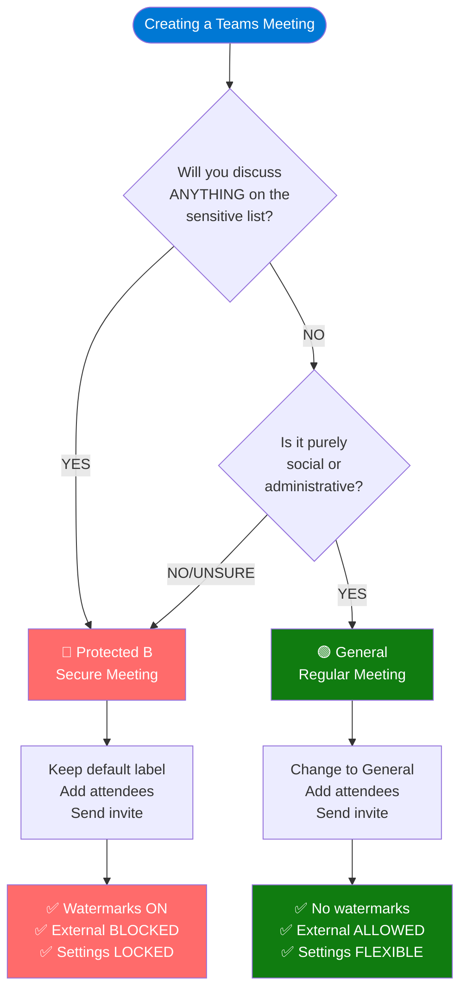

# Label Selection Decision Tree
## Visual Guide for Choosing the Right Meeting Label

---

## Main Decision Flow



---

## Sensitive Content Checklist

Use Protected B if meeting will include ANY of these:

```
┌─────────────────────────────────────────────┐
│  SENSITIVE CONTENT INDICATORS               │
├─────────────────────────────────────────────┤
│                                             │
│  GOVERNMENT/CONTRACTS:                      │
│  ✓ Contract details or pricing             │
│  ✓ Deliverables or timelines               │
│  ✓ Government requirements                  │
│  ✓ Proposal discussions                     │
│  ✓ Any DoD/Government rep attending        │
│                                             │
│  TECHNICAL:                                 │
│  ✓ Engineering designs                      │
│  ✓ Technical specifications                 │
│  ✓ R&D discussions                          │
│  ✓ Manufacturing processes                  │
│  ✓ Product development                      │
│                                             │
│  BUSINESS:                                  │
│  ✓ Financial information                    │
│  ✓ Strategic planning                       │
│  ✓ M&A discussions                          │
│  ✓ Customer confidential data               │
│  ✓ Competitive intelligence                 │
│                                             │
│  LEGAL/COMPLIANCE:                          │
│  ✓ NDA-covered topics                       │
│  ✓ ITAR/EAR controlled info                │
│  ✓ Legal matters                            │
│  ✓ Audit discussions                        │
│  ✓ Incident investigations                  │
│                                             │
│  PERSONNEL:                                 │
│  ✓ HR matters                               │
│  ✓ Performance reviews                      │
│  ✓ Compensation discussions                 │
│  ✓ Disciplinary actions                     │
│  ✓ Personal information                     │
│                                             │
└─────────────────────────────────────────────┘

ANY of these = 🔴 Protected B - Secure Meeting
```

---

## Participant-Based Decision

```
┌─────────────────────────────────────────────┐
│  WHO'S ATTENDING?                           │
├─────────────────────────────────────────────┤
│                                             │
│  🔴 ALWAYS Protected B if:                 │
│    • Government representatives             │
│    • Auditors or inspectors                │
│    • Customer (sensitive projects)          │
│    • External legal counsel                 │
│    • Anyone with NDA                        │
│                                             │
│  🟢 Can use General if:                    │
│    • Only internal team (non-sensitive)    │
│    • Social gathering                       │
│    • Public webinar attendees              │
│    • Training participants                  │
│                                             │
│  ⚠️  When Unsure:                          │
│    → Use Protected B                        │
│    → Better safe than sorry!               │
│                                             │
└─────────────────────────────────────────────┘
```

---

## Content Type Decision Matrix

| Meeting Type | Protected B | General |
|--------------|-------------|---------|
| **Contract Review** | ✅ ALWAYS | ❌ NEVER |
| **Engineering Design** | ✅ ALWAYS | ❌ NEVER |
| **Financial Planning** | ✅ ALWAYS | ❌ NEVER |
| **Team Standup (sensitive project)** | ✅ YES | ❌ NO |
| **Team Standup (general tasks)** | ⚠️ Can use General | ✅ OK |
| **Training (classified)** | ✅ YES | ❌ NO |
| **Training (general skills)** | ⚠️ Can use General | ✅ OK |
| **Customer Demo (marketing)** | ⚠️ Can use General | ✅ OK |
| **Customer Demo (technical)** | ✅ YES | ❌ NO |
| **Social Gathering** | ❌ NO | ✅ ALWAYS |
| **Birthday Party** | ❌ NO | ✅ ALWAYS |
| **HR Discussion** | ✅ ALWAYS | ❌ NEVER |

---

## Example Scenarios

### Scenario 1: Weekly Team Standup

```
Question 1: Will you discuss project status?
  → YES

Question 2: Is the project classified/sensitive?
  → NO (routine internal tasks)

Question 3: Will you mention customer names?
  → NO

Question 4: Any proprietary technology?
  → NO

RESULT: 🟢 General - Regular Meeting
```

### Scenario 2: Quarterly Contract Review

```
Question 1: Will you discuss contract details?
  → YES ← STOP HERE!

RESULT: 🔴 Protected B - Secure Meeting
(No need to ask more questions - contracts = always secure)
```

### Scenario 3: Engineering Team Discussion

```
Question 1: Will you discuss technical designs?
  → YES ← STOP HERE!

RESULT: 🔴 Protected B - Secure Meeting
(Technical designs = proprietary = always secure)
```

### Scenario 4: Coffee Chat

```
Question 1: Is this a social gathering?
  → YES

Question 2: Any work discussion?
  → NO (just casual chat)

RESULT: 🟢 General - Regular Meeting
```

### Scenario 5: Customer Call (Unknown Content)

```
Question 1: Do you know what will be discussed?
  → NO / UNSURE

RESULT: 🔴 Protected B - Secure Meeting
(When unsure = default to secure)
```

---

## "When in Doubt" Flowchart

```
┌──────────────────────────────────────┐
│  Unsure which label to use?          │
└──────────────────────────────────────┘
                ↓
┌──────────────────────────────────────┐
│  Ask yourself:                       │
│  "Would I be comfortable if this     │
│   meeting was recorded by a          │
│   competitor?"                        │
└──────────────────────────────────────┘
                ↓
        ┌───────┴────────┐
        │                │
       YES               NO
        │                │
        ↓                ↓
    🟢 General      🔴 Protected B
```

---

## Common Mistakes to Avoid

```
❌ WRONG THINKING:

"It's just a quick call"
  → Quick ≠ Not Sensitive
  → Check content, not duration

"Everyone knows each other"
  → Familiarity ≠ Not Sensitive
  → Check content, not participants

"We're all internal"
  → Internal ≠ Not Sensitive
  → Internal discussions can be sensitive too

"It's just an update"
  → Update about WHAT?
  → Check the subject matter

"External partner is trusted"
  → Trusted ≠ Authorized
  → Use proper channels for sensitive info


✅ CORRECT THINKING:

"What will we discuss?"
  → Content determines label

"Is this covered by NDA/contract?"
  → Yes = Protected B

"Would I want this recorded?"
  → No = Protected B

"When unsure..."
  → Protected B (secure by default)
```

---

## Quick Reference: Keywords that Trigger Protected B

If meeting title or agenda contains these words, use Protected B:

```
AUTOMATIC TRIGGERS:
• "Contract"      • "Classified"    • "Confidential"
• "Proprietary"   • "NDA"           • "Restricted"
• "DoD"           • "Government"    • "Federal"
• "ITAR"          • "EAR"           • "Export"
• "Technical"     • "Engineering"   • "Design"
• "Financial"     • "Budget"        • "Pricing"
• "Customer"      • "Proposal"      • "RFP"
• "HR"            • "Personnel"     • "Compensation"
• "Legal"         • "Compliance"    • "Audit"
• "Strategic"     • "M&A"           • "Acquisition"
```

If you see ANY of these keywords = 🔴 Protected B

---

## Visual Summary

```
┌─────────────────────────────────────────────────────────┐
│                                                         │
│  🔴 PROTECTED B - SECURE MEETING                       │
│  ═══════════════════════════════════════                │
│                                                         │
│  DEFAULT SELECTION ← You have to change it!            │
│                                                         │
│  Watermarks:  ON 🔒                                    │
│  External:    BLOCKED 🔒                               │
│  Presenters:  ORGANIZER ONLY 🔒                        │
│  Recording:   CONTROLLED 🔒                            │
│                                                         │
│  Use for: Anything sensitive, classified, NDA-covered  │
│           When in doubt!                                │
│                                                         │
└─────────────────────────────────────────────────────────┘

┌─────────────────────────────────────────────────────────┐
│                                                         │
│  🟢 GENERAL - REGULAR MEETING                          │
│  ═══════════════════════════════════════                │
│                                                         │
│  MANUAL SELECTION ← You must actively choose this      │
│                                                         │
│  Watermarks:  OFF                                       │
│  External:    ALLOWED ✏️                               │
│  Presenters:  EVERYONE ✏️                              │
│  Recording:   FLEXIBLE ✏️                              │
│                                                         │
│  Use for: Social, casual, admin, public, training      │
│           ONLY when content is NOT sensitive           │
│                                                         │
└─────────────────────────────────────────────────────────┘
```

---

## The Golden Rules

```
RULE 1: When in doubt → Protected B
RULE 2: Contracts → Always Protected B  
RULE 3: Government → Always Protected B
RULE 4: Technical → Always Protected B
RULE 5: NDA topics → Always Protected B
RULE 6: Social only → General is OK
RULE 7: Default is secure → Good thing!
RULE 8: Can't change mid-meeting → Choose carefully!
RULE 9: External can't join Protected B → By design!
RULE 10: Security is everyone's job → Use labels correctly!
```

---

**Remember: Protected B is the DEFAULT for a reason!**

**It's easier to downgrade to General (if appropriate) than to upgrade mid-meeting.**

**When you start creating a meeting, Protected B is already selected.**

**Ask yourself: "Do I have a good reason to change this to General?"**

**If the answer is NO or UNSURE → Keep Protected B!**

---

**Leonardo Company - Centre of Excellence**
**Classification: Internal Use Only**
**Version 1.0 - November 2025**
