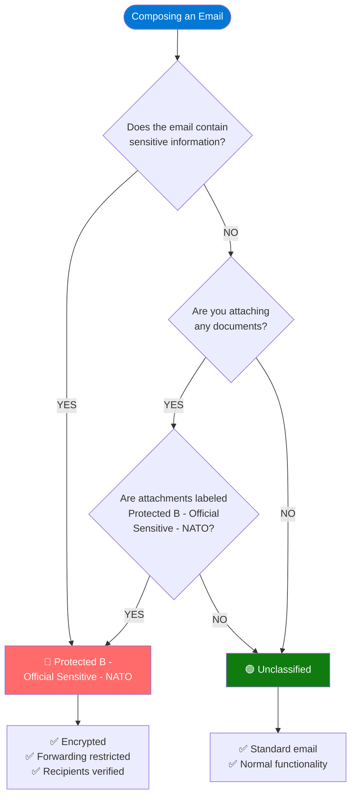
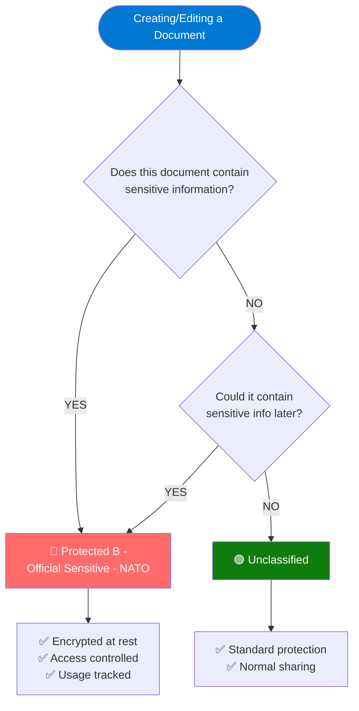
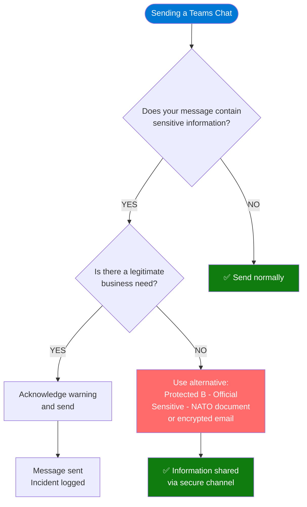

# Microsoft 365 Sensitivity Label Decision Tree
## Visual Guide for Choosing the Right Labels Across All Applications

---

## Scope of This Guide

This guide covers mandatory sensitivity labeling across:

| Application | Labels Available | Options |
|-------------|-----------------|---------|
| **Teams Meetings** | Protected B - Official Sensitive - NATO - Secure Meeting / General - Regular Meeting | Protected B - Official Sensitive - NATO |
| **Outlook Email** | Protected B - Official Sensitive - NATO / Unclassified | Protected B - Official Sensitive - NATO OR Unclassified |
| **Word Documents** | Protected B - Official Sensitive - NATO / Unclassified | Protected B - Official Sensitive - NATO OR Unclassified |
| **Excel Spreadsheets** | Protected B - Official Sensitive - NATO / Unclassified | Protected B - Official Sensitive - NATO OR Unclassified |
| **PowerPoint Presentations** | Protected B - Official Sensitive - NATO / Unclassified | Protected B - Official Sensitive - NATO OR Unclassified |
| **Teams Chat** | DLP Monitoring (44 sensitive info types) | Always active |
| **SharePoint Sites** | Protected B - Official Sensitive - NATO / Unclassified | Site-level |

---

## PART 1: TEAMS MEETINGS

### Meeting Decision Flow

```mermaid
flowchart TD
    Start([Creating a Teams Meeting]) --> Q1{Will you discuss<br/>ANYTHING on the<br/>sensitive list?}
    
    Q1 -->|YES| Secure[🔴 Protected B -<br/>Official Sensitive - NATO<br/>Secure Meeting]
    Q1 -->|NO| Q2{Is it purely<br/>social or<br/>administrative?}
    
    Q2 -->|YES| Regular[🟢 General<br/>Regular Meeting]
    Q2 -->|NO/UNSURE| Secure
    
    Secure --> Action1[Keep default label<br/>Add attendees<br/>Send invite]
    Regular --> Action2[Change to General<br/>Add attendees<br/>Send invite]
    
    Action1 --> Result1[✅ Watermarks ON<br/>✅ External RESTRICTED<br/>✅ Settings LOCKED]
    Action2 --> Result2[✅ No watermarks<br/>✅ External ALLOWED<br/>✅ Settings FLEXIBLE]
    
    style Start fill:#0078d4,color:#fff
    style Secure fill:#ff6b6b,color:#fff
    style Regular fill:#107c10,color:#fff
    style Result1 fill:#ff6b6b,color:#fff
    style Result2 fill:#107c10,color:#fff
```


### Meeting Label Comparison
```
╔════════════════════════════════════════════════════════════════════════════════╗
║  🔴 PROTECTED B - OFFICIAL SENSITIVE - NATO - SECURE MEETING                   ║
╠════════════════════════════════════════════════════════════════════════════════╣
║                                                                                ║
║  DEFAULT SELECTION ← Automatically selected                                    ║
║                                                                                ║
║  Watermarks:   ON 🔒                                                           ║
║  External:     LIMITED FUNCTIONALITY 🔒                                        ║
║                (can view, cannot record/screenshot)                            ║
║  Presenters:   ORGANIZER ONLY 🔒                                               ║
║  Recording:    CONTROLLED 🔒                                                   ║
║  Encryption:   END-TO-END 🔒                                                   ║
║                                                                                ║
║  Use for: Anything sensitive, classified, NDA-covered                          ║
║           When in doubt!                                                       ║
║                                                                                ║
╚════════════════════════════════════════════════════════════════════════════════╝

╔════════════════════════════════════════════════════════════════════════════════╗
║  🟢 GENERAL - REGULAR MEETING                                                  ║
╠════════════════════════════════════════════════════════════════════════════════╣
║                                                                                ║
║  MANUAL SELECTION ← You must actively choose this                              ║
║                                                                                ║
║  Watermarks:   OFF                                                             ║
║  External:     FULL FUNCTIONALITY ✏️                                           ║
║  Presenters:   EVERYONE ✏️                                                     ║
║  Recording:    FLEXIBLE ✏️                                                     ║
║  Encryption:   STANDARD                                                        ║
║                                                                                ║
║  Use for: Social, casual, admin, public, training                              ║
║           ONLY when content is NOT sensitive                                   ║
║                                                                                ║
╚════════════════════════════════════════════════════════════════════════════════╝
```

---

## PART 2: EMAIL (OUTLOOK)

### Email Decision Flow


### Label Inheritance Rule
```
╔════════════════════════════════════════════════════════════════════════════════╗
║  ⚠️  IMPORTANT: LABEL INHERITANCE                                              ║
╠════════════════════════════════════════════════════════════════════════════════╣
║                                                                                ║
║  When you attach a labeled document to an email:                               ║
║                                                                                ║
║  📎 Protected B - Official Sensitive - NATO Document                           ║
║       ↓                                                                        ║
║  📧 Email AUTOMATICALLY becomes Protected B - Official Sensitive - NATO        ║
║                                                                                ║
║  This ensures sensitive documents are always                                   ║
║  transmitted with appropriate protection.                                      ║
║                                                                                ║
║  EXAMPLES:                                                                     ║
║  ──────────────────────────────────────────────────────────────────────────    ║
║  • Attach Protected B - Official Sensitive - NATO Word doc                     ║
║    → Email = Protected B - Official Sensitive - NATO                           ║
║  • Attach Protected B - Official Sensitive - NATO Excel                        ║
║    → Email = Protected B - Official Sensitive - NATO                           ║
║  • Attach Protected B - Official Sensitive - NATO PPT                          ║
║    → Email = Protected B - Official Sensitive - NATO                           ║
║  • Attach Unclassified doc → You choose email label                            ║
║                                                                                ║
╚════════════════════════════════════════════════════════════════════════════════╝
```

### Email Label Comparison

| Feature | Protected B - Official Sensitive - NATO | Unclassified |
|---------|----------------------------------------|--------------|
| **Encryption** | ✅ Yes | ❌ No |
| **Forward restrictions** | ✅ Yes | ❌ No |
| **Copy/paste restrictions** | ✅ Yes | ❌ No |
| **Recipient verification** | ✅ Yes | ❌ No |
| **External recipients** | ⚠️ Limited | ✅ Allowed |
| **Audit trail** | ✅ Full | ✅ Standard |

### How to Apply Email Labels
```
╔════════════════════════════════════════════════════════════════════════════════╗
║  OUTLOOK - APPLYING SENSITIVITY LABELS                                         ║
╠════════════════════════════════════════════════════════════════════════════════╣
║                                                                                ║
║  1. Click "New Email" or "Reply"                                               ║
║                                                                                ║
║  2. In the ribbon, click "Sensitivity"                                         ║
║     ┌────────────────────────────┐                                             ║
║     │ 🏷️ Sensitivity ▼          │                                             ║
║     └────────────────────────────┘                                             ║
║                                                                                ║
║  3. Select the appropriate label:                                              ║
║     • Protected B - Official Sensitive - NATO (for sensitive content)          ║
║     • Unclassified (for general content)                                       ║
║                                                                                ║
║  4. Compose your email and send                                                ║
║                                                                                ║
║  ⚠️  You Protected B - Official Sensitive - NATO OR Unclassified a label before sending!                                   ║
║                                                                                ║
╚════════════════════════════════════════════════════════════════════════════════╝
```

---

## PART 3: DOCUMENTS (WORD, EXCEL, POWERPOINT)

### Document Decision Flow


### Document Label Comparison

| Feature | Protected B - Official Sensitive - NATO | Unclassified |
|---------|----------------------------------------|--------------|
| **Encryption** | ✅ Yes | ❌ No |
| **Watermarks** | ✅ Visual marking | ❌ No |
| **Headers/Footers** | ✅ Classification shown | ❌ No |
| **Copy restrictions** | ✅ Yes | ❌ No |
| **Print restrictions** | ⚠️ Tracked | ❌ No |
| **External sharing** | ⚠️ Restricted | ✅ Allowed |
| **Audit trail** | ✅ Full | ✅ Standard |

### How to Apply Document Labels
```
╔════════════════════════════════════════════════════════════════════════════════╗
║  WORD/EXCEL/POWERPOINT - APPLYING LABELS                                       ║
╠════════════════════════════════════════════════════════════════════════════════╣
║                                                                                ║
║  1. Open or create your document                                               ║
║                                                                                ║
║  2. In the ribbon (Home tab), click "Sensitivity"                              ║
║     ┌────────────────────────────┐                                             ║
║     │ 🏷️ Sensitivity ▼          │                                             ║
║     └────────────────────────────┘                                             ║
║                                                                                ║
║  3. Select the appropriate label:                                              ║
║     • Protected B - Official Sensitive - NATO (for sensitive content)          ║
║     • Unclassified (for general content)                                       ║
║                                                                                ║
║  4. Save your document                                                         ║
║                                                                                ║
║  ⚠️  You Protected B - Official Sensitive - NATO OR Unclassified a label before saving!                                    ║
║                                                                                ║
║  💡 TIP: Label early! Apply the label when you                                 ║
║     create the document, not just before sharing.                              ║
║                                                                                ║
╚════════════════════════════════════════════════════════════════════════════════╝
```

### Document Type Quick Reference

| Document Type | Likely Label | Reasoning |
|---------------|--------------|-----------|
| **Contract Draft** | Protected B - Official Sensitive - NATO | Legal/commercial sensitivity |
| **Technical Specification** | Protected B - Official Sensitive - NATO | Proprietary information |
| **Financial Report** | Protected B - Official Sensitive - NATO | Business confidential |
| **Customer Proposal** | Protected B - Official Sensitive - NATO | Commercial sensitivity |
| **Meeting Notes (sensitive)** | Protected B - Official Sensitive - NATO | May contain sensitive details |
| **Meeting Notes (general)** | Unclassified | No sensitive content |
| **Training Materials (general)** | Unclassified | Non-sensitive |
| **Public Presentation** | Unclassified | Intended for public |
| **Internal Newsletter** | Unclassified | General information |
| **HR Documents** | Protected B - Official Sensitive - NATO | Personal information |

---

## PART 4: TEAMS CHAT (DLP MONITORING)

### What Gets Monitored

Teams chat is automatically monitored for **44 sensitive information types**. You don't select a label for chat—the system monitors in real-time.
```
╔════════════════════════════════════════════════════════════════════════════════╗
║  🔍 TEAMS CHAT - DLP MONITORING (ALWAYS ACTIVE)                                ║
╠════════════════════════════════════════════════════════════════════════════════╣
║                                                                                ║
║  The following information types trigger warnings:                             ║
║                                                                                ║
║  🇨🇦 CANADA                                                                    ║
║  • Bank Account Number                                                         ║
║  • Driver's License Number                                                     ║
║  • Health Service Number                                                       ║
║  • Passport Number                                                             ║
║  • Personal Health Identification Number (PHIN)                                ║
║  • Physical Addresses                                                          ║
║  • Social Insurance Number (SIN)                                               ║
║                                                                                ║
║  🇺🇸 UNITED STATES                                                             ║
║  • U.S. / U.K. Passport Number                                                 ║
║  • Bank Account Number                                                         ║
║  • Driver's License Number                                                     ║
║  • Individual Taxpayer ID (ITIN)                                               ║
║  • Physical Addresses                                                          ║
║  • Social Security Number (SSN)                                                ║
║                                                                                ║
║  🇬🇧 UNITED KINGDOM                                                            ║
║  • Driver's License Number                                                     ║
║  • Electoral Roll Number                                                       ║
║  • National Health Service Number                                              ║
║  • National Insurance Number (NINO)                                            ║
║  • Physical Addresses                                                          ║
║  • Unique Taxpayer Reference Number                                            ║
║                                                                                ║
║  🇪🇺 EUROPEAN UNION                                                            ║
║  • Debit Card Number                                                           ║
║  • Driver's License Number                                                     ║
║  • National Identification Number                                              ║
║  • Passport Number                                                             ║
║  • Social Security Number or Equivalent ID                                     ║
║  • Tax Identification Number (TIN)                                             ║
║                                                                                ║
║  🇮🇹 ITALY                                                                     ║
║  • Driver's License Number                                                     ║
║  • Fiscal Code                                                                 ║
║  • Passport Number                                                             ║
║  • Physical Addresses                                                          ║
║  • Value Added Tax Number                                                      ║
║                                                                                ║
║  🇫🇮 FINLAND                                                                   ║
║  • European Health Insurance Number                                            ║
║                                                                                ║
║  💳 FINANCIAL                                                                  ║
║  • Credit Card Number                                                          ║
║  • SWIFT Code                                                                  ║
║                                                                                ║
║  🔐 CREDENTIALS & TECHNICAL                                                    ║
║  • Azure Storage Account Key                                                   ║
║  • Azure Storage Account Key (Generic)                                         ║
║  • General Password                                                            ║
║  • GitHub Personal Access Token                                                ║
║  • Google API Key                                                              ║
║  • IP Address (v4 and v6)                                                      ║
║  • Microsoft Entra Client Secret                                               ║
║  • User Login Credentials                                                      ║
║  • X.509 Certificate Private Key                                               ║
║                                                                                ║
╚════════════════════════════════════════════════════════════════════════════════╝
```

### What Happens When DLP Triggers
```
╔════════════════════════════════════════════════════════════════════════════════╗
║  ⚠️  DLP POLICY TIP - WHAT YOU'LL SEE                                          ║
╠════════════════════════════════════════════════════════════════════════════════╣
║                                                                                ║
║  When you type sensitive information in Teams chat:                            ║
║                                                                                ║
║  ┌──────────────────────────────────────────────────────────────────────────┐  ║
║  │  ⚠️ This message may contain sensitive information.                      │  ║
║  │  Use secure channels for PII or credentials.                             │  ║
║  │                                                                          │  ║
║  │  [Acknowledge and Send]  [Cancel]                                        │  ║
║  └──────────────────────────────────────────────────────────────────────────┘  ║
║                                                                                ║
║  YOUR OPTIONS:                                                                 ║
║  ──────────────────────────────────────────────────────────────────────────    ║
║  1. ACKNOWLEDGE AND SEND                                                       ║
║     → Message sends with acknowledgment logged                                 ║
║     → Use only if legitimate business need                                     ║
║                                                                                ║
║  2. CANCEL                                                                     ║
║     → Edit or delete the sensitive content                                     ║
║     → Consider using a labeled document instead                                ║
║                                                                                ║
║  BEST PRACTICE:                                                                ║
║  → Put sensitive info in a Protected B - Official Sensitive - NATO document    ║
║  → Share via email                                               ║
║  → Chat is for quick communications, not PII                                   ║
║                                                                                ║
╚════════════════════════════════════════════════════════════════════════════════╝
```

### Teams Chat Decision Flow


---

## PART 5: SHAREPOINT SITES

### Site-Level Labels
```
╔════════════════════════════════════════════════════════════════════════════════╗
║  📁 SHAREPOINT SITE LABELS                                                     ║
╠════════════════════════════════════════════════════════════════════════════════╣
║                                                                                ║
║  Site-level labels are applied by administrators.                              ║
║  They control:                                                                 ║
║                                                                                ║
║  • External sharing settings                                                   ║
║  • Guest access permissions                                                    ║
║  • Privacy settings (public/private)                                           ║
║  • Default document label (optional)                                           ║
║                                                                                ║
║  PROTECTED B - OFFICIAL SENSITIVE - NATO SITES:                                ║
║  ──────────────────────────────────────────────────────────────────────────    ║
║  • External sharing: Restricted                                                ║
║  • Guest access: Controlled                                                    ║
║  • All documents inherit site protection                                       ║
║                                                                                ║
║  ⚠️  You still need to label individual documents!                             ║
║  Site labels protect the container, document labels                            ║
║  protect the content.                                                          ║
║                                                                                ║
╚════════════════════════════════════════════════════════════════════════════════╝
```

---

## PART 6: CUSTOMER MANAGED KEYS (CMK)

### What's Protected
```
╔════════════════════════════════════════════════════════════════════════════════╗
║  🔐 ENHANCED ENCRYPTION - CUSTOMER MANAGED KEYS                                ║
╠════════════════════════════════════════════════════════════════════════════════╣
║                                                                                ║
║  All Microsoft 365 data is now encrypted with                                  ║
║  Leonardo Company-controlled encryption keys.                                  ║
║                                                                                ║
║  SERVICE                          STATUS                                       ║
║  ──────────────────────────────────────────────────────────────────────────    ║
║  Teams Chat & Meetings            ✅ Leonardo keys                             ║
║  Teams Voicemail                  ✅ Leonardo keys                             ║
║  Exchange Email & Calendar        ✅ Leonardo keys                             ║
║  SharePoint Online                ✅ Leonardo keys                             ║
║  OneDrive for Business            ✅ Leonardo keys                             ║
║                                                                                ║
║  WHY THIS MATTERS:                                                             ║
║  ──────────────────────────────────────────────────────────────────────────    ║
║  • Data sovereignty: Keys stored in Canada                                     ║
║  • Control: Leonardo can revoke access if needed                               ║
║  • Compliance: Meets Protected B - Official Sensitive - NATO requirements      ║
║  • Transparency: Full audit trail of key usage                                 ║
║                                                                                ║
║  ℹ️  No action required from you - this is automatic!                          ║
║                                                                                ║
╚════════════════════════════════════════════════════════════════════════════════╝
```

---

## UNIVERSAL SENSITIVE CONTENT CHECKLIST

Use **Protected B - Official Sensitive - NATO** across ALL applications if content includes ANY of these:
```
╔════════════════════════════════════════════════════════════════════════════════╗
║  SENSITIVE CONTENT INDICATORS (ALL APPLICATIONS)                               ║
╠════════════════════════════════════════════════════════════════════════════════╣
║                                                                                ║
║  GOVERNMENT/CONTRACTS:                                                         ║
║  ✓ Contract details or pricing                                                 ║
║  ✓ Deliverables or timelines                                                   ║
║  ✓ Government requirements                                                     ║
║  ✓ Proposal discussions                                                        ║
║  ✓ Any DoD/Government content                                                  ║
║                                                                                ║
║  TECHNICAL:                                                                    ║
║  ✓ Engineering designs                                                         ║
║  ✓ Technical specifications                                                    ║
║  ✓ R&D information                                                             ║
║  ✓ Manufacturing processes                                                     ║
║  ✓ Product development                                                         ║
║                                                                                ║
║  BUSINESS:                                                                     ║
║  ✓ Financial information                                                       ║
║  ✓ Strategic planning                                                          ║
║  ✓ M&A discussions                                                             ║
║  ✓ Customer confidential data                                                  ║
║  ✓ Competitive intelligence                                                    ║
║                                                                                ║
║  LEGAL/COMPLIANCE:                                                             ║
║  ✓ NDA-covered topics                                                          ║
║  ✓ ITAR/EAR controlled info                                                    ║
║  ✓ Legal matters                                                               ║
║  ✓ Audit discussions                                                           ║
║  ✓ Incident investigations                                                     ║
║                                                                                ║
║  PERSONNEL:                                                                    ║
║  ✓ HR matters                                                                  ║
║  ✓ Performance reviews                                                         ║
║  ✓ Compensation discussions                                                    ║
║  ✓ Disciplinary actions                                                        ║
║  ✓ Personal information (PII)                                                  ║
║                                                                                ║
║  PERSONAL IDENTIFIERS:                                                         ║
║  ✓ Social Insurance Numbers                                                    ║
║  ✓ Passport numbers                                                            ║
║  ✓ Driver's license numbers                                                    ║
║  ✓ Health information                                                          ║
║  ✓ Financial account numbers                                                   ║
║  ✓ Credentials/passwords                                                       ║
║                                                                                ║
╚════════════════════════════════════════════════════════════════════════════════╝

ANY of these = 🔴 Protected B - Official Sensitive - NATO (meetings, email, documents)
```

---

## QUICK REFERENCE: KEYWORDS THAT TRIGGER PROTECTED B

If title, subject, or content contains these words, use Protected B - Official Sensitive - NATO:
```
╔════════════════════════════════════════════════════════════════════════════════╗
║  AUTOMATIC TRIGGERS (ALL APPLICATIONS):                                        ║
╠════════════════════════════════════════════════════════════════════════════════╣
║                                                                                ║
║  • "Contract"      • "Classified"    • "Confidential"                          ║
║  • "Proprietary"   • "NDA"           • "Restricted"                            ║
║  • "DoD"           • "Government"    • "Federal"                               ║
║  • "ITAR"          • "EAR"           • "Export"                                ║
║  • "Technical"     • "Engineering"   • "Design"                                ║
║  • "Financial"     • "Budget"        • "Pricing"                               ║
║  • "Customer"      • "Proposal"      • "RFP"                                   ║
║  • "HR"            • "Personnel"     • "Compensation"                          ║
║  • "Legal"         • "Compliance"    • "Audit"                                 ║
║  • "Strategic"     • "M&A"           • "Acquisition"                           ║
║  • "SIN"           • "SSN"           • "Passport"                              ║
║  • "Secret"        • "Internal Only" • "Do Not Forward"                        ║
║  • "NATO"          • "PROTECTED"     • "Official"                              ║
║                                                                                ║
╚════════════════════════════════════════════════════════════════════════════════╝

If you see ANY of these keywords = 🔴 Protected B - Official Sensitive - NATO
```

---

## APPLICATION QUICK REFERENCE MATRIX

| Scenario | Teams Meeting | Email | Document | Teams Chat |
|----------|---------------|-------|----------|------------|
| **Contract discussion** | Protected B - Secure | Protected B | Protected B | ⚠️ Use document |
| **Technical specs** | Protected B - Secure | Protected B | Protected B | ⚠️ Use document |
| **Sharing a SIN** | N/A | Protected B | Protected B | ⚠️ Warning appears |
| **Team standup (general)** | General | Unclassified | N/A | ✅ OK |
| **Birthday party** | General | Unclassified | N/A | ✅ OK |
| **Customer proposal** | Protected B - Secure | Protected B | Protected B | ⚠️ Use document |
| **Public announcement** | General | Unclassified | Unclassified | ✅ OK |
| **HR discussion** | Protected B - Secure | Protected B | Protected B | ⚠️ Use document |

*Note: "Protected B" in this table refers to "Protected B - Official Sensitive - NATO"*

---

## COMMON MISTAKES TO AVOID
```
╔════════════════════════════════════════════════════════════════════════════════╗
║  ❌ WRONG THINKING:                                                            ║
╠════════════════════════════════════════════════════════════════════════════════╣
║                                                                                ║
║  "It's just internal"                                                          ║
║    → Internal ≠ Not Sensitive                                                  ║
║    → Check content, not audience                                               ║
║                                                                                ║
║  "It's just a quick chat"                                                      ║
║    → DLP monitors ALL chats                                                    ║
║    → Use documents for sensitive info                                          ║
║                                                                                ║
║  "I'll label it later"                                                         ║
║    → Label FIRST, before saving                                                ║
║    → Prevents accidental sharing                                               ║
║                                                                                ║
║  "The attachment is labeled, so the email is fine"                             ║
║    → Actually TRUE! Email inherits label                                       ║
║    → But verify before sending                                                 ║
║                                                                                ║
║  "It's just a draft"                                                           ║
║    → Drafts can be shared accidentally                                         ║
║    → Label from creation                                                       ║
║                                                                                ║
╚════════════════════════════════════════════════════════════════════════════════╝

╔════════════════════════════════════════════════════════════════════════════════╗
║  ✅ CORRECT THINKING:                                                          ║
╠════════════════════════════════════════════════════════════════════════════════╣
║                                                                                ║
║  "What's the content?"                                                         ║
║    → Content determines label (always)                                         ║
║                                                                                ║
║  "Is this covered by NDA/contract?"                                            ║
║    → Yes = Protected B - Official Sensitive - NATO (everywhere)                ║
║                                                                                ║
║  "Would I put this on a billboard?"                                            ║
║    → No = Protected B - Official Sensitive - NATO                              ║
║                                                                                ║
║  "When unsure..."                                                              ║
║    → Protected B - Official Sensitive - NATO (all applications)                ║
║                                                                                ║
║  "Sensitive data in chat?"                                                     ║
║    → Use Protected B - Official Sensitive - NATO document instead              ║
║                                                                                ║
╚════════════════════════════════════════════════════════════════════════════════╝
```

---

## THE GOLDEN RULES
```
╔════════════════════════════════════════════════════════════════════════════════╗
║  THE 10 GOLDEN RULES                                                           ║
╠════════════════════════════════════════════════════════════════════════════════╣
║                                                                                ║
║  RULE 1:  When in doubt → Protected B - Official Sensitive - NATO              ║
║  RULE 2:  Contracts → Always Protected B - Official Sensitive - NATO           ║
║  RULE 3:  Government content → Always Protected B - Official Sensitive - NATO  ║
║  RULE 4:  Technical info → Always Protected B - Official Sensitive - NATO      ║
║  RULE 5:  NDA topics → Always Protected B - Official Sensitive - NATO          ║
║  RULE 6:  PII/credentials → Never in chat, use documents                       ║
║  RULE 7:  Social/casual only → General/Unclassified is OK                      ║
║  RULE 8:  Label early → Apply when creating, not sharing                       ║
║  RULE 9:  Attachments inherit → Protected B doc = Protected B email            ║
║  RULE 10: Security is everyone's job → Label correctly!                        ║
║                                                                                ║
╚════════════════════════════════════════════════════════════════════════════════╝
```

---

## WORKFLOW SUMMARY
```
╔════════════════════════════════════════════════════════════════════════════════╗
║  📋 DAILY WORKFLOW CHECKLIST                                                   ║
╠════════════════════════════════════════════════════════════════════════════════╣
║                                                                                ║
║  CREATING A MEETING:                                                           ║
║  □ Protected B - Official Sensitive - NATO auto-selected (keep unless social)  ║
║  □ Change to General ONLY if truly non-sensitive                               ║
║                                                                                ║
║  SENDING AN EMAIL:                                                             ║
║  □ Click Sensitivity in ribbon                                                 ║
║  □ Select Protected B - Official Sensitive - NATO or Unclassified              ║
║  □ Check attachments (they affect email label)                                 ║
║  □ Must label before sending                                                   ║
║                                                                                ║
║  CREATING A DOCUMENT:                                                          ║
║  □ Click Sensitivity in ribbon FIRST                                           ║
║  □ Select Protected B - Official Sensitive - NATO or Unclassified              ║
║  □ Must label before saving                                                    ║
║                                                                                ║
║  USING TEAMS CHAT:                                                             ║
║  □ Don't share PII or credentials                                              ║
║  □ If warning appears, consider alternatives                                   ║
║  □ Use Protected B - Official Sensitive - NATO documents for sensitive info    ║
║                                                                                ║
╚════════════════════════════════════════════════════════════════════════════════╝
```

---

## SUPPORT & RESOURCES
```
╔════════════════════════════════════════════════════════════════════════════════╗
║  📞 NEED HELP?                                                                 ║
╠════════════════════════════════════════════════════════════════════════════════╣
║                                                                                ║
║  EMAIL:    itsupport@leonardocompany.ca                                        ║
║  TEAMS:    "IT Support" channel                                                ║
║  CONTACT:  Fred Pearson                                                        ║
║            fred.pearson@leonardocompany.ca                                     ║
║                                                                                ║
║  QUICK ANSWERS:                                                                ║
║  ──────────────────────────────────────────────────────────────────────────    ║
║  • Can't find Sensitivity button? → Check ribbon                               ║
║  • Label won't apply? → Try saving first                                       ║
║  • External can't join meeting? → By design (Protected B)                      ║
║  • DLP warning in chat? → Use document instead                                 ║
║  • Unsure which label? → Choose Protected B - Official Sensitive - NATO        ║
║                                                                                ║
╚════════════════════════════════════════════════════════════════════════════════╝
```

---

**Remember: Protected B - Official Sensitive - NATO is the SAFE choice!**

**When unsure → Protected B - Official Sensitive - NATO (meetings, email, documents)**

**Sensitive data in chat → Use a Protected B - Official Sensitive - NATO document instead**

**Label early, label correctly, stay secure!**

---

**Leonardo Company**  
**Classification: Internal Use Only**  
**Version 2.0 - December 2025**