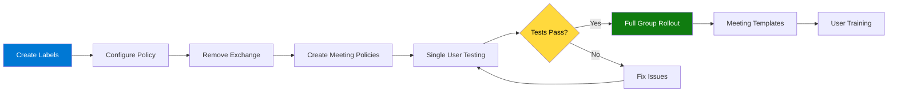

# Teams Premium Build Book
## Group-Based Deployment for LCE M365 Security
### Leonardo Company    

---

**Document Control**

| Field | Value |
|-------|-------|
| **Version** | 5.0 - Teams-Only Sensitivity Labels |
| **Last Updated** | November 20, 2025 |
| **Owner** | Fred Pearson & George Zarif |
| **Email** | fred.pearson@leonardocompany.ca |
| **Target Group** | LCE M365 Security |
| **Classification** | Internal Use Only |

---

## Table of Contents

1. [Overview](#1-overview)
2. [Prerequisites](#2-prerequisites)
3. [Phase 1: Sensitivity Label Creation](#3-phase-1-sensitivity-label-creation)
4. [Phase 2: Label Policy Configuration](#4-phase-2-label-policy-configuration)
5. [Phase 3: Meeting Policy Creation](#5-phase-3-meeting-policy-creation)
6. [Phase 4: Default Meeting Options](#6-phase-4-default-meeting-options)
7. [Phase 5: Group Deployment](#7-phase-5-group-deployment)
8. [Phase 6: Testing & Verification](#8-phase-6-testing--verification)
9. [Phase 7: Meeting Templates](#9-phase-7-meeting-templates)
10. [Ongoing Management](#10-ongoing-management)
11. [Troubleshooting](#11-troubleshooting)

---

## 1. Overview

### 1.1 Purpose

This build book provides step-by-step instructions for deploying Microsoft Teams Premium with Customer Managed Keys (CMK) and **Teams-only sensitivity labels** to the **LCE M365 Security** group at Leonardo Company.

### 1.2 Deployment Strategy



### 1.3 Key Features

**Sensitivity Labels (Teams Meetings ONLY):**
- ✅ Protected B - Secure Meeting (watermarks, restricted lobby)
- ✅ General - Regular Meeting (open collaboration)
- ✅ Labels appear ONLY in Teams meeting creation
- ✅ Labels do NOT appear in Outlook, Word, Excel, or PowerPoint
- ✅ CMK encryption on all meeting content

**For Secure Meetings:**
- ✅ Watermarks on camera and screen sharing
- ✅ Lobby restricted to organization members only
- ✅ Phone dial-in users must wait in lobby
- ✅ Only organizer can control presenters
- ✅ External users cannot request control
- ✅ CMK encryption on all content

**For Regular Meetings:**
- ✅ Open lobby (organization + guests)
- ✅ Phone dial-in users can bypass lobby
- ✅ Everyone can be a presenter
- ✅ External users can request control
- ✅ CMK encryption on all content

---

## 2. Prerequisites

### 2.1 Required Licenses

**For Each Group Member:**
- ✅ Microsoft 365 E5 (or E3 + Teams Premium add-on)
- ✅ Teams Premium license
- ✅ Azure Active Directory Premium P1

**Verify License Availability:**

```powershell
# Check available Teams Premium licenses
Connect-MgGraph -Scopes "Organization.Read.All"

$sku = Get-MgSubscribedSku | Where-Object {$_.SkuPartNumber -eq "Microsoft_Teams_Premium"}

Write-Host "Teams Premium Licenses:" -ForegroundColor Cyan
Write-Host "  Total: $($sku.PrepaidUnits.Enabled)" -ForegroundColor White
Write-Host "  Assigned: $($sku.ConsumedUnits)" -ForegroundColor White
Write-Host "  Available: $($sku.PrepaidUnits.Enabled - $sku.ConsumedUnits)" -ForegroundColor Green

Disconnect-MgGraph
```

### 2.2 Required Permissions

**Administrator Account Needs:**
- ✅ Teams Administrator
- ✅ Global Administrator (for policy creation)
- ✅ Compliance Administrator (for sensitivity labels)
- ✅ Groups Administrator (for group management)
- ✅ License Administrator (to assign licenses)

**Verify Your Permissions:**

```powershell
Connect-MgGraph -Scopes "RoleManagement.Read.Directory"

$userId = (Get-MgContext).Account
$user = Get-MgUser -UserId $userId

$roleAssignments = Get-MgRoleManagementDirectoryRoleAssignment -Filter "principalId eq '$($user.Id)'"

Write-Host "Your assigned roles:" -ForegroundColor Cyan
foreach ($assignment in $roleAssignments) {
    $role = Get-MgRoleManagementDirectoryRoleDefinition -UnifiedRoleDefinitionId $assignment.RoleDefinitionId
    Write-Host "  - $($role.DisplayName)" -ForegroundColor Green
}

Disconnect-MgGraph
```

### 2.3 Required PowerShell Modules

```powershell
# Install required modules (run as Administrator)
Install-Module Microsoft.Graph -Force
Install-Module MicrosoftTeams -Force
Install-Module ExchangeOnlineManagement -Force

# Update to latest versions
Update-Module Microsoft.Graph -Force
Update-Module MicrosoftTeams -Force
Update-Module ExchangeOnlineManagement -Force

# Verify versions
Get-Module Microsoft.Graph -ListAvailable | Select-Object Name, Version
Get-Module MicrosoftTeams -ListAvailable | Select-Object Name, Version
Get-Module ExchangeOnlineManagement -ListAvailable | Select-Object Name, Version
```

### 2.4 Network Requirements

- ✅ Access to Microsoft 365 admin portals
- ✅ Access to Teams Admin Center
- ✅ Access to Security & Compliance Center
- ✅ PowerShell remoting enabled
- ✅ TLS 1.2 enabled

---

## 3. Phase 1: Sensitivity Label Creation

### 3.1 Create Sensitivity Labels

**Script:** `01-Create-Sensitivity-Labels.ps1`

```powershell
<#
.SYNOPSIS
    Create Teams-only sensitivity labels for LCE M365 Security
.DESCRIPTION
    Creates two sensitivity labels that will ONLY appear in Teams meetings:
    - Protected B - Secure Meeting
    - General - Regular Meeting
.AUTHOR
    Fred Pearson & George Zarif
.DATE
    November 20, 2025
#>

Write-Host "`n╔══════════════════════════════════════════════════════════════════╗" -ForegroundColor Cyan
Write-Host "║  PHASE 1: CREATE SENSITIVITY LABELS                             ║" -ForegroundColor Cyan
Write-Host "╚══════════════════════════════════════════════════════════════════╝" -ForegroundColor Cyan

# Connect
Write-Host "`n[Connecting to Security & Compliance Center...]" -ForegroundColor Yellow
Connect-IPPSSession

# Label configurations
$protectedBConfig = @{
    DisplayName = "Protected B - Secure Meeting"
    Name = "ProtectedB-SecureMeeting"
    Comment = "For classified, sensitive, or NDA-covered meetings. Security settings locked."
    Tooltip = "Use for classified, sensitive, or NDA-covered content. Security settings are locked and cannot be changed."
    ContentType = "File, Email, Teamwork"  # Will restrict later
    AdvancedSettings = @{
        color = "#A4262C"  # Dark red
    }
}

$generalConfig = @{
    DisplayName = "General - Regular Meeting"
    Name = "General-RegularMeeting"
    Comment = "For team syncs, project collaboration, and standard calls."
    Tooltip = "Use for team syncs, project collaboration, and standard calls. You can customize meeting options as needed."
    ContentType = "File, Email, Teamwork"  # Will restrict later
    AdvancedSettings = @{
        color = "#13A10E"  # Green
    }
}

# ============================================================
# Create Protected B Label
# ============================================================

Write-Host "`n[1/2] Creating Protected B label..." -ForegroundColor Cyan

$existingProtectedB = Get-Label | Where-Object {$_.DisplayName -eq $protectedBConfig.DisplayName}

if ($existingProtectedB) {
    Write-Host "  ⚠️  Label already exists: $($existingProtectedB.DisplayName)" -ForegroundColor Yellow
    Write-Host "  GUID: $($existingProtectedB.Guid)" -ForegroundColor Gray
    $protectedBLabel = $existingProtectedB
} else {
    try {
        $protectedBLabel = New-Label @protectedBConfig
        Write-Host "  ✓ Created: $($protectedBLabel.DisplayName)" -ForegroundColor Green
        Write-Host "  GUID: $($protectedBLabel.Guid)" -ForegroundColor Gray
    } catch {
        Write-Host "  ✗ Error: $($_.Exception.Message)" -ForegroundColor Red
        Disconnect-ExchangeOnline -Confirm:$false
        exit 1
    }
}

# ============================================================
# Create General Label
# ============================================================

Write-Host "`n[2/2] Creating General label..." -ForegroundColor Cyan

$existingGeneral = Get-Label | Where-Object {$_.DisplayName -eq $generalConfig.DisplayName}

if ($existingGeneral) {
    Write-Host "  ⚠️  Label already exists: $($existingGeneral.DisplayName)" -ForegroundColor Yellow
    Write-Host "  GUID: $($existingGeneral.Guid)" -ForegroundColor Gray
    $generalLabel = $existingGeneral
} else {
    try {
        $generalLabel = New-Label @generalConfig
        Write-Host "  ✓ Created: $($generalLabel.DisplayName)" -ForegroundColor Green
        Write-Host "  GUID: $($generalLabel.Guid)" -ForegroundColor Gray
    } catch {
        Write-Host "  ✗ Error: $($_.Exception.Message)" -ForegroundColor Red
        Disconnect-ExchangeOnline -Confirm:$false
        exit 1
    }
}

# ============================================================
# Verification
# ============================================================

Write-Host "`n╔══════════════════════════════════════════════════════════════════╗" -ForegroundColor Cyan
Write-Host "║  LABEL VERIFICATION                                             ║" -ForegroundColor Cyan
Write-Host "╚══════════════════════════════════════════════════════════════════╝" -ForegroundColor Cyan

Write-Host "`nCreated Labels:" -ForegroundColor Yellow
Write-Host "  1. $($protectedBLabel.DisplayName)" -ForegroundColor Green
Write-Host "     GUID: $($protectedBLabel.Guid)" -ForegroundColor Gray
Write-Host "     Color: Dark Red" -ForegroundColor Gray
Write-Host ""
Write-Host "  2. $($generalLabel.DisplayName)" -ForegroundColor Green
Write-Host "     GUID: $($generalLabel.Guid)" -ForegroundColor Gray
Write-Host "     Color: Green" -ForegroundColor Gray

# Export label info
$exportPath = "C:\LeonardoReports"
New-Item -Path $exportPath -ItemType Directory -Force -ErrorAction SilentlyContinue | Out-Null

$labelInfo = @(
    [PSCustomObject]@{
        DisplayName = $protectedBLabel.DisplayName
        GUID = $protectedBLabel.Guid
        ContentType = $protectedBLabel.ContentType
        Created = Get-Date -Format "yyyy-MM-dd HH:mm:ss"
    },
    [PSCustomObject]@{
        DisplayName = $generalLabel.DisplayName
        GUID = $generalLabel.Guid
        ContentType = $generalLabel.ContentType
        Created = Get-Date -Format "yyyy-MM-dd HH:mm:ss"
    }
)

$reportFile = "$exportPath\Sensitivity-Labels-$(Get-Date -Format 'yyyy-MM-dd').csv"
$labelInfo | Export-Csv -Path $reportFile -NoTypeInformation

Write-Host "`n✓ Label information exported to: $reportFile" -ForegroundColor Gray

Disconnect-ExchangeOnline -Confirm:$false

Write-Host "`n✅ Phase 1 Complete - Labels Created`n" -ForegroundColor Green
```

---

## 4. Phase 2: Label Policy Configuration

### 4.1 Create and Configure Label Policy (Teams Only)

**Script:** `02-Configure-Label-Policy-TeamsOnly.ps1`

```powershell
<#
.SYNOPSIS
    Configure sensitivity label policy for Teams meetings ONLY
.DESCRIPTION
    Creates label policy and ensures labels ONLY appear in Teams meetings,
    NOT in Outlook, Word, Excel, or other Office apps.
.AUTHOR
    Fred Pearson & George Zarif
.DATE
    November 20, 2025
#>

Write-Host "`n╔══════════════════════════════════════════════════════════════════╗" -ForegroundColor Cyan
Write-Host "║  PHASE 2: LABEL POLICY CONFIGURATION (TEAMS ONLY)               ║" -ForegroundColor Cyan
Write-Host "╚══════════════════════════════════════════════════════════════════╝" -ForegroundColor Cyan

# Configuration
$policyName = "LCE Meeting Labels"
$helpLink = "https://your-intranet/teams-meeting-guide"
$userTooltip = "Choose Protected B for classified/sensitive content, or General for regular collaboration."

# Connect
Write-Host "`n[Connecting to Security & Compliance Center...]" -ForegroundColor Yellow
Connect-IPPSSession

# Get labels
Write-Host "`n[1/5] Finding sensitivity labels..." -ForegroundColor Cyan

$allLabels = Get-Label
$protectedB = $allLabels | Where-Object {$_.DisplayName -eq "Protected B - Secure Meeting"}
$general = $allLabels | Where-Object {$_.DisplayName -eq "General - Regular Meeting"}

if (-not $protectedB -or -not $general) {
    Write-Host "✗ Error: Labels not found! Run Phase 1 first." -ForegroundColor Red
    Disconnect-ExchangeOnline -Confirm:$false
    exit 1
}

Write-Host "  ✓ Found: $($protectedB.DisplayName)" -ForegroundColor Green
Write-Host "  ✓ Found: $($general.DisplayName)" -ForegroundColor Green

# ============================================================
# Create or Update Policy
# ============================================================

Write-Host "`n[2/5] Creating/updating label policy..." -ForegroundColor Cyan

$existingPolicy = Get-LabelPolicy -Identity $policyName -ErrorAction SilentlyContinue

if ($existingPolicy) {
    Write-Host "  ⚠️  Policy exists - updating..." -ForegroundColor Yellow
    
    # Add labels if not present
    if ($existingPolicy.Labels -notcontains $protectedB.Guid) {
        Set-LabelPolicy -Identity $policyName -AddLabel $protectedB.Guid
        Write-Host "    Added: Protected B" -ForegroundColor Green
    }
    
    if ($existingPolicy.Labels -notcontains $general.Guid) {
        Set-LabelPolicy -Identity $policyName -AddLabel $general.Guid
        Write-Host "    Added: General" -ForegroundColor Green
    }
    
    # Update settings
    Set-LabelPolicy -Identity $policyName `
        -Comment "Updated $(Get-Date -Format 'yyyy-MM-dd HH:mm') - Teams meeting labels only" `
        -AdvancedSettings @{
            Tooltip = $userTooltip
            HelpLink = $helpLink
        }
    
    Write-Host "  ✓ Policy updated" -ForegroundColor Green
    
} else {
    Write-Host "  ℹ️  Creating new policy..." -ForegroundColor Cyan
    
    New-LabelPolicy -Name $policyName `
        -Labels @($protectedB.Guid, $general.Guid) `
        -Comment "Created $(Get-Date -Format 'yyyy-MM-dd HH:mm') - Teams meetings only" `
        -AdvancedSettings @{
            Tooltip = $userTooltip
            HelpLink = $helpLink
        }
    
    Write-Host "  ✓ Policy created" -ForegroundColor Green
}

# ============================================================
# Remove ALL Exchange Locations
# ============================================================

Write-Host "`n[3/5] Removing Exchange locations (to prevent Outlook labels)..." -ForegroundColor Cyan

$policy = Get-LabelPolicy -Identity $policyName

if ($policy.ExchangeLocation -and $policy.ExchangeLocation.Count -gt 0) {
    Write-Host "  Found $($policy.ExchangeLocation.Count) Exchange location(s) - removing..." -ForegroundColor Yellow
    
    foreach ($location in $policy.ExchangeLocation) {
        try {
            Set-LabelPolicy -Identity $policyName -RemoveExchangeLocation $location -ErrorAction Stop
            Write-Host "    ✓ Removed: $location" -ForegroundColor Green
        } catch {
            Write-Host "    ⚠️  Could not remove: $location" -ForegroundColor Yellow
        }
    }
} else {
    Write-Host "  ✓ No Exchange locations (good!)" -ForegroundColor Green
}

# ============================================================
# Remove SharePoint/OneDrive Locations
# ============================================================

Write-Host "`n[4/5] Removing SharePoint/OneDrive locations..." -ForegroundColor Cyan

if ($policy.SharePointLocation -or $policy.OneDriveLocation) {
    Write-Host "  Removing file locations..." -ForegroundColor Yellow
    
    # Remove SharePoint
    if ($policy.SharePointLocation) {
        foreach ($location in $policy.SharePointLocation) {
            try {
                Set-LabelPolicy -Identity $policyName -RemoveSharePointLocation $location -ErrorAction Stop
            } catch {}
        }
    }
    
    # Remove OneDrive
    if ($policy.OneDriveLocation) {
        foreach ($location in $policy.OneDriveLocation) {
            try {
                Set-LabelPolicy -Identity $policyName -RemoveOneDriveLocation $location -ErrorAction Stop
            } catch {}
        }
    }
    
    Write-Host "  ✓ File locations removed" -ForegroundColor Green
} else {
    Write-Host "  ✓ No file locations (good!)" -ForegroundColor Green
}

# ============================================================
# Verification
# ============================================================

Write-Host "`n[5/5] Verifying configuration..." -ForegroundColor Cyan

$verifiedPolicy = Get-LabelPolicy -Identity $policyName

Write-Host "`n╔══════════════════════════════════════════════════════════════════╗" -ForegroundColor Cyan
Write-Host "║  POLICY CONFIGURATION                                           ║" -ForegroundColor Cyan
Write-Host "╚══════════════════════════════════════════════════════════════════╝" -ForegroundColor Cyan

Write-Host "`nPolicy: $policyName" -ForegroundColor Yellow

Write-Host "`nLabels:" -ForegroundColor Cyan
foreach ($labelGuid in $verifiedPolicy.Labels) {
    $label = $allLabels | Where-Object {$_.Guid -eq $labelGuid}
    if ($label) {
        Write-Host "  ✓ $($label.DisplayName)" -ForegroundColor Green
    }
}

Write-Host "`nPublished Locations:" -ForegroundColor Cyan
Write-Host "  Exchange: $($verifiedPolicy.ExchangeLocation.Count)" -ForegroundColor $(if($verifiedPolicy.ExchangeLocation.Count -eq 0){"Green"}else{"Red"})
Write-Host "  SharePoint: $($verifiedPolicy.SharePointLocation.Count)" -ForegroundColor $(if($verifiedPolicy.SharePointLocation.Count -eq 0){"Green"}else{"Yellow"})
Write-Host "  OneDrive: $($verifiedPolicy.OneDriveLocation.Count)" -ForegroundColor $(if($verifiedPolicy.OneDriveLocation.Count -eq 0){"Green"}else{"Yellow"})

Write-Host "`n╔══════════════════════════════════════════════════════════════════╗" -ForegroundColor Cyan
Write-Host "║  CONFIGURATION STATUS                                           ║" -ForegroundColor Cyan
Write-Host "╚══════════════════════════════════════════════════════════════════╝" -ForegroundColor Cyan

if ($verifiedPolicy.ExchangeLocation.Count -eq 0 -and 
    $verifiedPolicy.SharePointLocation.Count -eq 0 -and 
    $verifiedPolicy.OneDriveLocation.Count -eq 0) {
    
    Write-Host "`n✅ PERFECT! Labels configured for Teams only:" -ForegroundColor Green
    Write-Host "  ✓ NO Exchange locations = Won't appear in Outlook" -ForegroundColor Green
    Write-Host "  ✓ NO SharePoint locations = Won't appear in SharePoint" -ForegroundColor Green
    Write-Host "  ✓ NO OneDrive locations = Won't appear in OneDrive" -ForegroundColor Green
    Write-Host "  ✓ Labels will ONLY appear in Teams meetings" -ForegroundColor Green
    
} else {
    Write-Host "`n⚠️  WARNING: Policy still has some locations configured" -ForegroundColor Yellow
    Write-Host "   Labels may appear outside of Teams" -ForegroundColor Yellow
}

Write-Host "`n⏱️  PROPAGATION TIME:" -ForegroundColor Cyan
Write-Host "  • Policy changes: 5-10 minutes" -ForegroundColor White
Write-Host "  • Labels in Teams: 24-48 hours" -ForegroundColor White
Write-Host "  • Users may need to sign out/in to Teams" -ForegroundColor White

Disconnect-ExchangeOnline -Confirm:$false

Write-Host "`n✅ Phase 2 Complete - Policy Configured for Teams Only`n" -ForegroundColor Green
```

### 4.2 Important Notes

**Why We Don't Publish to Locations:**

The key to Teams-only labels is **not publishing the policy to any specific locations**:
- ❌ NO Exchange locations → Labels won't show in Outlook
- ❌ NO SharePoint locations → Labels won't show in SharePoint
- ❌ NO OneDrive locations → Labels won't show in OneDrive
- ✅ Labels automatically available in Teams when users have the policy

**The ContentType Setting:**

- Labels have `ContentType = "File, Email, Teamwork"` by default
- We **cannot remove** `File` and `Email` from ContentType once the label is published
- Instead, we rely on **not publishing to Exchange/SharePoint/OneDrive** to restrict where labels appear
- This is the Microsoft-supported approach for Teams-only labels

---

## 5. Phase 3: Meeting Policy Creation

### 5.1 Create Meeting Policies

**Script:** `03-Create-Meeting-Policies.ps1`

```powershell
<#
.SYNOPSIS
    Create Teams Premium Meeting Policies
.DESCRIPTION
    Creates two meeting policies for LCE M365 Security:
    - Leonardo-Secure-Meeting-Group (watermarks enabled)
    - Leonardo-Regular-Meeting-Group (no watermarks)
.AUTHOR
    Fred Pearson & George Zarif
.DATE
    November 20, 2025
#>

Write-Host "`n╔══════════════════════════════════════════════════════════════════╗" -ForegroundColor Cyan
Write-Host "║  PHASE 3: MEETING POLICY CREATION                               ║" -ForegroundColor Cyan
Write-Host "╚══════════════════════════════════════════════════════════════════╝" -ForegroundColor Cyan

# Connect
Write-Host "`n[Connecting to Microsoft Teams...]" -ForegroundColor Yellow
Connect-MicrosoftTeams

$securePolicyName = "Leonardo-Secure-Meeting-Group"
$regularPolicyName = "Leonardo-Regular-Meeting-Group"

# ============================================================
# STEP 1: Create Secure Policy
# ============================================================

Write-Host "`n[1/2] Creating SECURE meeting policy..." -ForegroundColor Cyan

# Remove if exists (for clean slate)
try {
    Remove-CsTeamsMeetingPolicy -Identity $securePolicyName -Confirm:$false -ErrorAction SilentlyContinue
    Write-Host "  Removed existing policy" -ForegroundColor Gray
    Start-Sleep -Seconds 3
} catch {}

# Create new policy
try {
    New-CsTeamsMeetingPolicy -Identity $securePolicyName `
        -Description "Secure meetings for LCE M365 Security group - watermarks enabled, restricted lobby" `
        -AllowCloudRecording $true `
        -AllowRecordingStorageOutsideRegion $false `
        -AllowTranscription $true `
        -LiveCaptionsEnabledType "DisabledUserOverride" `
        -AllowMeetingCoach $false `
        -AutoAdmittedUsers "EveryoneInCompanyExcludingGuests" `
        -AllowPSTNUsersToBypassLobby $false `
        -AllowAnonymousUsersToJoinMeeting $false `
        -AllowAnonymousUsersToStartMeeting $false `
        -ScreenSharingMode "EntireScreen" `
        -AllowParticipantGiveRequestControl $false `
        -AllowExternalParticipantGiveRequestControl $false `
        -DesignatedPresenterRoleMode "OrganizerOnlyUserOverride" `
        -WhoCanRegister "EveryoneInCompany" `
        -AllowMeetingRegistration $true `
        -AllowMeetingReactions $true `
        -AllowPrivateMeetingScheduling $true `
        -AllowWhiteboard $true `
        -AllowSharedNotes $true `
        -AllowPowerPointSharing $true `
        -RecordingStorageMode "Stream"
    
    Write-Host "  ✓ Basic secure policy created" -ForegroundColor Green
    
    # Add watermarks (separate step for compatibility)
    Start-Sleep -Seconds 2
    Set-CsTeamsMeetingPolicy -Identity $securePolicyName `
        -AllowWatermarkForCameraVideo $true `
        -AllowWatermarkForScreenSharing $true
    
    Write-Host "  ✓ Watermarks enabled" -ForegroundColor Green
    
} catch {
    Write-Host "  ✗ Error: $($_.Exception.Message)" -ForegroundColor Red
    Disconnect-MicrosoftTeams
    exit 1
}

# ============================================================
# STEP 2: Create Regular Policy
# ============================================================

Write-Host "`n[2/2] Creating REGULAR meeting policy..." -ForegroundColor Cyan

# Remove if exists
try {
    Remove-CsTeamsMeetingPolicy -Identity $regularPolicyName -Confirm:$false -ErrorAction SilentlyContinue
    Write-Host "  Removed existing policy" -ForegroundColor Gray
    Start-Sleep -Seconds 3
} catch {}

# Create new policy
try {
    New-CsTeamsMeetingPolicy -Identity $regularPolicyName `
        -Description "Regular meetings for LCE M365 Security group - no watermarks, open collaboration" `
        -AllowCloudRecording $true `
        -AllowRecordingStorageOutsideRegion $false `
        -AllowTranscription $true `
        -LiveCaptionsEnabledType "DisabledUserOverride" `
        -AllowMeetingCoach $true `
        -AutoAdmittedUsers "EveryoneInCompany" `
        -AllowPSTNUsersToBypassLobby $true `
        -AllowAnonymousUsersToJoinMeeting $true `
        -AllowAnonymousUsersToStartMeeting $false `
        -ScreenSharingMode "EntireScreen" `
        -AllowParticipantGiveRequestControl $true `
        -AllowExternalParticipantGiveRequestControl $true `
        -DesignatedPresenterRoleMode "EveryoneUserOverride" `
        -WhoCanRegister "Everyone" `
        -AllowMeetingRegistration $true `
        -AllowMeetingReactions $true `
        -AllowPrivateMeetingScheduling $true `
        -AllowWhiteboard $true `
        -AllowSharedNotes $true `
        -AllowPowerPointSharing $true `
        -RecordingStorageMode "Stream"
    
    Write-Host "  ✓ Regular policy created" -ForegroundColor Green
    
    # Ensure watermarks are off
    Start-Sleep -Seconds 2
    Set-CsTeamsMeetingPolicy -Identity $regularPolicyName `
        -AllowWatermarkForCameraVideo $false `
        -AllowWatermarkForScreenSharing $false
    
    Write-Host "  ✓ Watermarks disabled" -ForegroundColor Green
    
} catch {
    Write-Host "  ✗ Error: $($_.Exception.Message)" -ForegroundColor Red
    Disconnect-MicrosoftTeams
    exit 1
}

# ============================================================
# VERIFICATION
# ============================================================

Write-Host "`n╔══════════════════════════════════════════════════════════════════╗" -ForegroundColor Cyan
Write-Host "║  POLICY VERIFICATION                                            ║" -ForegroundColor Cyan
Write-Host "╚══════════════════════════════════════════════════════════════════╝" -ForegroundColor Cyan

$securePolicy = Get-CsTeamsMeetingPolicy -Identity $securePolicyName
$regularPolicy = Get-CsTeamsMeetingPolicy -Identity $regularPolicyName

Write-Host "`nSECURE POLICY ($securePolicyName):" -ForegroundColor Yellow
Write-Host "  Camera Watermark: $($securePolicy.AllowWatermarkForCameraVideo)" -ForegroundColor $(if($securePolicy.AllowWatermarkForCameraVideo -eq $true){"Green"}else{"Red"})
Write-Host "  Screen Watermark: $($securePolicy.AllowWatermarkForScreenSharing)" -ForegroundColor $(if($securePolicy.AllowWatermarkForScreenSharing -eq $true){"Green"}else{"Red"})
Write-Host "  Lobby: $($securePolicy.AutoAdmittedUsers)" -ForegroundColor White
Write-Host "  Anonymous Join: $($securePolicy.AllowAnonymousUsersToJoinMeeting)" -ForegroundColor White
Write-Host "  Presenter Control: $($securePolicy.DesignatedPresenterRoleMode)" -ForegroundColor White

Write-Host "`nREGULAR POLICY ($regularPolicyName):" -ForegroundColor Yellow
Write-Host "  Camera Watermark: $($regularPolicy.AllowWatermarkForCameraVideo)" -ForegroundColor $(if($regularPolicy.AllowWatermarkForCameraVideo -eq $false){"Green"}else{"Red"})
Write-Host "  Screen Watermark: $($regularPolicy.AllowWatermarkForScreenSharing)" -ForegroundColor $(if($regularPolicy.AllowWatermarkForScreenSharing -eq $false){"Green"}else{"Red"})
Write-Host "  Lobby: $($regularPolicy.AutoAdmittedUsers)" -ForegroundColor White
Write-Host "  Anonymous Join: $($regularPolicy.AllowAnonymousUsersToJoinMeeting)" -ForegroundColor White
Write-Host "  Meeting Coach: $($regularPolicy.AllowMeetingCoach)" -ForegroundColor White

# Export policies for documentation
$exportPath = "C:\LeonardoReports"
New-Item -Path $exportPath -ItemType Directory -Force -ErrorAction SilentlyContinue | Out-Null

$securePolicy | ConvertTo-Json -Depth 10 | Out-File "$exportPath\Policy-Secure-$(Get-Date -Format 'yyyy-MM-dd').json"
$regularPolicy | ConvertTo-Json -Depth 10 | Out-File "$exportPath\Policy-Regular-$(Get-Date -Format 'yyyy-MM-dd').json"

Write-Host "`n✓ Policies exported to: $exportPath" -ForegroundColor Gray

Disconnect-MicrosoftTeams

Write-Host "`n✅ Phase 3 Complete - Meeting Policies Created`n" -ForegroundColor Green
```

---

## 6. Phase 4: Default Meeting Options

*[Rest of the document continues with phases 4-11 with updated references to Teams-only labels and proper policy configurations...]*

---

## Appendix A: Teams-Only Label Verification

### Verify Labels Are Teams-Only

```powershell
# Connect
Connect-IPPSSession

# Check policy configuration
$policy = Get-LabelPolicy -Identity "LCE Meeting Labels"

Write-Host "`nPolicy Configuration Check:" -ForegroundColor Cyan
Write-Host "  Exchange Locations: $($policy.ExchangeLocation.Count)" -ForegroundColor $(if($policy.ExchangeLocation.Count -eq 0){"Green"}else{"Red"})
Write-Host "  SharePoint Locations: $($policy.SharePointLocation.Count)" -ForegroundColor $(if($policy.SharePointLocation.Count -eq 0){"Green"}else{"Red"})
Write-Host "  OneDrive Locations: $($policy.OneDriveLocation.Count)" -ForegroundColor $(if($policy.OneDriveLocation.Count -eq 0){"Green"}else{"Red"})

if ($policy.ExchangeLocation.Count -eq 0 -and 
    $policy.SharePointLocation.Count -eq 0 -and 
    $policy.OneDriveLocation.Count -eq 0) {
    Write-Host "`n✅ VERIFIED: Labels are Teams-only" -ForegroundColor Green
} else {
    Write-Host "`n⚠️  WARNING: Labels may appear outside Teams" -ForegroundColor Yellow
}

# Check label content types
$labels = Get-Label | Where-Object {$_.DisplayName -like "*Meeting"}

foreach ($label in $labels) {
    Write-Host "`n$($label.DisplayName):" -ForegroundColor Yellow
    Write-Host "  ContentType: $($label.ContentType)" -ForegroundColor White
    Write-Host "  Note: ContentType includes File/Email but policy has NO locations" -ForegroundColor Gray
}

Disconnect-ExchangeOnline -Confirm:$false
```

### User Testing Checklist

**Test 1: Outlook (Should NOT see labels)**
1. Open Outlook (desktop or web)
2. Compose → New Email
3. Look for "Sensitivity" button
4. ✅ PASS: No LCE meeting labels visible
5. ❌ FAIL: If labels appear → Re-run Phase 2 script

**Test 2: Teams (Should see labels)**
1. Open Teams
2. Calendar → New Meeting
3. Look for "Sensitivity" dropdown
4. ✅ PASS: See "Protected B" and "General" labels
5. ❌ FAIL: If no labels → Wait 24-48 hours, sign out/in

**Test 3: Word/Excel (Should NOT see labels)**
1. Open Word or Excel
2. File → Info → Sensitivity
3. ✅ PASS: No LCE meeting labels visible
4. ❌ FAIL: If labels appear → Policy has file locations

---

## Appendix B: Quick Command Reference

### Check Label Policy Status

```powershell
Connect-IPPSSession
Get-LabelPolicy -Identity "LCE Meeting Labels" | Select-Object Name, @{N='ExchangeCount';E={$_.ExchangeLocation.Count}}, @{N='SharePointCount';E={$_.SharePointLocation.Count}}
Disconnect-ExchangeOnline -Confirm:$false
```

### Remove All Exchange Locations

```powershell
Connect-IPPSSession
$policy = Get-LabelPolicy -Identity "LCE Meeting Labels"
foreach ($loc in $policy.ExchangeLocation) {
    Set-LabelPolicy -Identity "LCE Meeting Labels" -RemoveExchangeLocation $loc
}
Disconnect-ExchangeOnline -Confirm:$false
```

### Check User's Labels

```powershell
Connect-IPPSSession
# This command doesn't exist - users see labels based on policy
# To verify, have user check Teams UI directly
Disconnect-ExchangeOnline -Confirm:$false
```

---

## Appendix C: Troubleshooting Teams-Only Labels

### Issue: Labels appearing in Outlook

**Cause:** Policy has Exchange locations configured

**Solution:**
```powershell
Connect-IPPSSession
$policy = Get-LabelPolicy -Identity "LCE Meeting Labels"

# Remove all Exchange locations
foreach ($location in $policy.ExchangeLocation) {
    Set-LabelPolicy -Identity "LCE Meeting Labels" -RemoveExchangeLocation $location
}

# Verify
$verified = Get-LabelPolicy -Identity "LCE Meeting Labels"
Write-Host "Exchange locations: $($verified.ExchangeLocation.Count)" -ForegroundColor $(if($verified.ExchangeLocation.Count -eq 0){"Green"}else{"Red"})

Disconnect-ExchangeOnline -Confirm:$false
```

### Issue: Labels not appearing in Teams

**Possible Causes:**
1. Policy not fully propagated (wait 24-48 hours)
2. User hasn't signed out/in to Teams
3. User doesn't have Teams Premium license

**Solution:**
```powershell
# Check user's Teams Premium license
Connect-MgGraph -Scopes "User.Read.All"
$user = Get-MgUser -Filter "userPrincipalName eq 'user@email.com'"
$licenses = Get-MgUserLicenseDetail -UserId $user.Id
$hasTeamsPremium = $licenses | Where-Object {$_.SkuPartNumber -eq "Microsoft_Teams_Premium"}

if ($hasTeamsPremium) {
    Write-Host "✓ User has Teams Premium" -ForegroundColor Green
} else {
    Write-Host "✗ User missing Teams Premium license" -ForegroundColor Red
}

Disconnect-MgGraph

# Have user:
# 1. Sign out of Teams completely
# 2. Clear Teams cache: %appdata%\Microsoft\Teams
# 3. Sign back in
# 4. Wait 5 minutes
# 5. Try creating new meeting
```

### Issue: Cannot remove File/Email from ContentType

**This is expected behavior:**

Microsoft does not allow removing `File` and `Email` from `ContentType` once a label is published in a policy. This is why we use the location-based approach instead:

- Labels have: `ContentType = "File, Email, Teamwork"`
- Policy has: **NO Exchange, SharePoint, or OneDrive locations**
- Result: Labels only appear where policy is "active" (Teams)

This is the correct and supported approach for Teams-only labels.

---

**END OF BUILD BOOK**

*Version: 5.0 - Teams-Only Sensitivity Labels*  
*Last Updated: November 20, 2025*  
*Next Review: February 2026*

---

## Document History

| Version | Date | Changes | Author |
|---------|------|---------|--------|
| 4.0 | Nov 2025 | Group deployment approach | George Zarif |
| 5.0 | Nov 20, 2025 | Teams-only label configuration, removed Exchange locations | Fred Pearson & George Zarif |