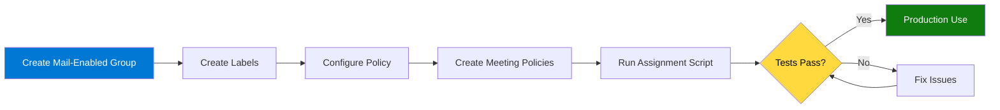

# Teams Premium Build Book
## Group-Based Deployment for LCE M365 Security
### Leonardo Company    

---

**Document Control**

| Field | Value |
|-------|-------|
| **Version** | 6.0 - Mail-Enabled Security Group Deployment |
| **Last Updated** | November 20, 2025 |
| **Owner** | Fred Pearson & George Zarif |
| **Email** | fred.pearson@leonardocompany.ca |
| **Target Group** | LCE M365 Security (lcem365security@leonardocompany.ca) |
| **Classification** | Internal Use Only |

---

## Table of Contents

1. [Overview](#1-overview)
2. [Prerequisites](#2-prerequisites)
3. [Phase 1: Group Setup](#3-phase-1-group-setup)
4. [Phase 2: Sensitivity Label Creation](#4-phase-2-sensitivity-label-creation)
5. [Phase 3: Label Policy Configuration](#5-phase-3-label-policy-configuration)
6. [Phase 4: Meeting Policy Creation](#6-phase-4-meeting-policy-creation)
7. [Phase 5: Automated Group Policy Assignment](#7-phase-5-automated-group-policy-assignment)
8. [Phase 6: Testing & Verification](#8-phase-6-testing--verification)
9. [Ongoing Management](#9-ongoing-management)
10. [Troubleshooting](#10-troubleshooting)

---

## 1. Overview

### 1.1 Purpose

This build book provides step-by-step instructions for deploying Microsoft Teams Premium with **Teams-only sensitivity labels** to the **LCE M365 Security** mail-enabled security group at Leonardo Company.

### 1.2 Deployment Strategy


### 1.3 Key Features

**Mail-Enabled Security Group:**
- ✅ Group email: `lcem365security@leonardocompany.ca`
- ✅ Used for automated monitoring reports
- ✅ Used for policy assignment
- ✅ Easy to manage - add members once, policies apply automatically

**Sensitivity Labels (Teams Meetings ONLY):**
- ✅ Protected B - Secure Meeting (watermarks, restricted lobby)
- ✅ General - Regular Meeting (open collaboration)
- ✅ Labels appear ONLY in Teams meeting creation
- ✅ Labels do NOT appear in Outlook, Word, Excel, or PowerPoint

**For Secure Meetings:**
- ✅ Watermarks on camera and screen sharing
- ✅ Lobby restricted to organization members only
- ✅ Phone dial-in users must wait in lobby
- ✅ Only organizer can control presenters
- ✅ External users cannot request control

**For Regular Meetings:**
- ✅ Open lobby (organization + guests)
- ✅ Phone dial-in users can bypass lobby
- ✅ Everyone can be a presenter
- ✅ External users can request control

---

## 2. Prerequisites

### 2.1 Required Licenses

**For Each Group Member:**
- ✅ Microsoft 365 E5 (or E3 + Teams Premium add-on)
- ✅ Teams Premium license
- ✅ Azure Active Directory Premium P1

### 2.2 Required Permissions

**Administrator Account Needs:**
- ✅ Global Administrator
- ✅ Teams Administrator
- ✅ Compliance Administrator
- ✅ Exchange Administrator

### 2.3 Required PowerShell Modules
```powershell
# Install required modules
Install-Module Microsoft.Graph -Force -Scope CurrentUser
Install-Module MicrosoftTeams -Force -Scope CurrentUser
Install-Module ExchangeOnlineManagement -Force -Scope CurrentUser
Install-Module PnP.PowerShell -Force -Scope CurrentUser
```

---

## 3. Phase 1: Group Setup

### 3.1 Create Mail-Enabled Security Group

**Purpose:** Create a mail-enabled security group that serves both email distribution AND policy assignment.

**Via Exchange Admin Center (GUI - RECOMMENDED):**

1. Go to https://admin.exchange.microsoft.com
2. Navigate to **Recipients** → **Groups**
3. Click **Add a group**
4. Select **Mail-enabled security**
5. Fill in:
   - **Name:** LCE M365 Security
   - **Email:** lcem365security@leonardocompany.ca
   - **Description:** Security team for M365 monitoring, alerts, and Teams Premium policies
6. Add members:
   - fred.pearson@leonardocompany.ca
   - george.zarif@leonardocompany.ca
   - chris.helm@leonardocompany.ca
   - adrian.darjan@leonardocompany.ca
7. Click **Create**

**Via PowerShell:**
```powershell
# Connect to Exchange Online
Connect-ExchangeOnline

# Create mail-enabled security group
New-DistributionGroup `
    -Name "LCE M365 Security" `
    -Alias "LCEM365Security" `
    -Type "Security" `
    -PrimarySmtpAddress "lcem365security@leonardocompany.ca" `
    -MemberJoinRestriction "Closed" `
    -MemberDepartRestriction "Closed"

# Add members
Add-DistributionGroupMember -Identity "lcem365security@leonardocompany.ca" -Member "fred.pearson@leonardocompany.ca"
Add-DistributionGroupMember -Identity "lcem365security@leonardocompany.ca" -Member "george.zarif@leonardocompany.ca"
Add-DistributionGroupMember -Identity "lcem365security@leonardocompany.ca" -Member "chris.helm@leonardocompany.ca"
Add-DistributionGroupMember -Identity "lcem365security@leonardocompany.ca" -Member "adrian.darjan@leonardocompany.ca"

# Set owner
Set-DistributionGroup -Identity "lcem365security@leonardocompany.ca" -ManagedBy "fred.pearson@leonardocompany.ca"

# Verify
Get-DistributionGroupMember -Identity "lcem365security@leonardocompany.ca" | Select-Object Name, PrimarySmtpAddress

Disconnect-ExchangeOnline -Confirm:$false
```

### 3.2 Test Email Distribution

Send a test email to `lcem365security@leonardocompany.ca` to verify all members receive it.

---

## 4. Phase 2: Sensitivity Label Creation

### 4.1 Create Sensitivity Labels

**Script:** `01-Create-Sensitivity-Labels.ps1`
```powershell
<#
.SYNOPSIS
    Create Teams-only sensitivity labels for LCE M365 Security
.DESCRIPTION
    Creates two sensitivity labels that will ONLY appear in Teams meetings:
    - Protected B - Secure Meeting
    - General - Regular Meeting
.AUTHOR
    Fred Pearson & George Zarif
.DATE
    November 20, 2025
#>

Write-Host "`n╔══════════════════════════════════════════════════════════════════╗" -ForegroundColor Cyan
Write-Host "║  PHASE 2: CREATE SENSITIVITY LABELS                             ║" -ForegroundColor Cyan
Write-Host "╚══════════════════════════════════════════════════════════════════╝" -ForegroundColor Cyan

# Connect
Write-Host "`n[Connecting to Security & Compliance Center...]" -ForegroundColor Yellow
Connect-IPPSSession

# Label configurations
$protectedBConfig = @{
    DisplayName = "Protected B - Secure Meeting"
    Name = "ProtectedB-SecureMeeting"
    Comment = "For classified, sensitive, or NDA-covered meetings. Security settings locked."
    Tooltip = "Use for classified, sensitive, or NDA-covered content. Security settings are locked and cannot be changed."
    ContentType = "File, Email, Teamwork"
    AdvancedSettings = @{
        color = "#A4262C"  # Dark red
    }
}

$generalConfig = @{
    DisplayName = "General - Regular Meeting"
    Name = "General-RegularMeeting"
    Comment = "For team syncs, project collaboration, and standard calls."
    Tooltip = "Use for team syncs, project collaboration, and standard calls. You can customize meeting options as needed."
    ContentType = "File, Email, Teamwork"
    AdvancedSettings = @{
        color = "#13A10E"  # Green
    }
}

# Create Protected B Label
Write-Host "`n[1/2] Creating Protected B label..." -ForegroundColor Cyan

$existingProtectedB = Get-Label | Where-Object {$_.DisplayName -eq $protectedBConfig.DisplayName}

if ($existingProtectedB) {
    Write-Host "  ⚠️  Label already exists: $($existingProtectedB.DisplayName)" -ForegroundColor Yellow
    $protectedBLabel = $existingProtectedB
} else {
    $protectedBLabel = New-Label @protectedBConfig
    Write-Host "  ✓ Created: $($protectedBLabel.DisplayName)" -ForegroundColor Green
}

Write-Host "  GUID: $($protectedBLabel.Guid)" -ForegroundColor Gray

# Create General Label
Write-Host "`n[2/2] Creating General label..." -ForegroundColor Cyan

$existingGeneral = Get-Label | Where-Object {$_.DisplayName -eq $generalConfig.DisplayName}

if ($existingGeneral) {
    Write-Host "  ⚠️  Label already exists: $($existingGeneral.DisplayName)" -ForegroundColor Yellow
    $generalLabel = $existingGeneral
} else {
    $generalLabel = New-Label @generalConfig
    Write-Host "  ✓ Created: $($generalLabel.DisplayName)" -ForegroundColor Green
}

Write-Host "  GUID: $($generalLabel.Guid)" -ForegroundColor Gray

# Export label info
$exportPath = "C:\LeonardoReports"
New-Item -Path $exportPath -ItemType Directory -Force -ErrorAction SilentlyContinue | Out-Null

$labelInfo = @(
    [PSCustomObject]@{
        DisplayName = $protectedBLabel.DisplayName
        GUID = $protectedBLabel.Guid
        Created = Get-Date -Format "yyyy-MM-dd HH:mm:ss"
    },
    [PSCustomObject]@{
        DisplayName = $generalLabel.DisplayName
        GUID = $generalLabel.Guid
        Created = Get-Date -Format "yyyy-MM-dd HH:mm:ss"
    }
)

$labelInfo | Export-Csv "$exportPath\Sensitivity-Labels-$(Get-Date -Format 'yyyy-MM-dd').csv" -NoTypeInformation

Write-Host "`n✓ Label information exported to: $exportPath" -ForegroundColor Gray

Disconnect-ExchangeOnline -Confirm:$false

Write-Host "`n✅ Phase 2 Complete - Labels Created`n" -ForegroundColor Green
```

---

## 5. Phase 3: Label Policy Configuration

### 5.1 Configure Label Policy (Teams Only)

**Script:** `02-Configure-Label-Policy-TeamsOnly.ps1`
```powershell
<#
.SYNOPSIS
    Configure sensitivity label policy for Teams meetings ONLY
.DESCRIPTION
    Creates label policy and ensures labels ONLY appear in Teams meetings,
    NOT in Outlook, Word, Excel, or other Office apps.
.AUTHOR
    Fred Pearson & George Zarif
.DATE
    November 20, 2025
#>

Write-Host "`n╔══════════════════════════════════════════════════════════════════╗" -ForegroundColor Cyan
Write-Host "║  PHASE 3: LABEL POLICY CONFIGURATION (TEAMS ONLY)               ║" -ForegroundColor Cyan
Write-Host "╚══════════════════════════════════════════════════════════════════╝" -ForegroundColor Cyan

$policyName = "LCE Meeting Labels"

# Connect
Write-Host "`n[Connecting to Security & Compliance Center...]" -ForegroundColor Yellow
Connect-IPPSSession

# Get labels
Write-Host "`n[1/4] Finding sensitivity labels..." -ForegroundColor Cyan

$allLabels = Get-Label
$protectedB = $allLabels | Where-Object {$_.DisplayName -eq "Protected B - Secure Meeting"}
$general = $allLabels | Where-Object {$_.DisplayName -eq "General - Regular Meeting"}

if (-not $protectedB -or -not $general) {
    Write-Host "✗ Error: Labels not found! Run Phase 2 first." -ForegroundColor Red
    Disconnect-ExchangeOnline -Confirm:$false
    exit 1
}

Write-Host "  ✓ Found: $($protectedB.DisplayName)" -ForegroundColor Green
Write-Host "  ✓ Found: $($general.DisplayName)" -ForegroundColor Green

# Create or Update Policy
Write-Host "`n[2/4] Creating/updating label policy..." -ForegroundColor Cyan

$existingPolicy = Get-LabelPolicy -Identity $policyName -ErrorAction SilentlyContinue

if ($existingPolicy) {
    Write-Host "  ⚠️  Policy exists - updating..." -ForegroundColor Yellow
    
    if ($existingPolicy.Labels -notcontains $protectedB.Guid) {
        Set-LabelPolicy -Identity $policyName -AddLabel $protectedB.Guid
    }
    
    if ($existingPolicy.Labels -notcontains $general.Guid) {
        Set-LabelPolicy -Identity $policyName -AddLabel $general.Guid
    }
    
    Write-Host "  ✓ Policy updated" -ForegroundColor Green
    
} else {
    New-LabelPolicy -Name $policyName `
        -Labels @($protectedB.Guid, $general.Guid) `
        -Comment "Teams meetings only - $(Get-Date -Format 'yyyy-MM-dd HH:mm')"
    
    Write-Host "  ✓ Policy created" -ForegroundColor Green
}

# Remove ALL Exchange/SharePoint/OneDrive Locations
Write-Host "`n[3/4] Removing all locations (ensures Teams-only)..." -ForegroundColor Cyan

$policy = Get-LabelPolicy -Identity $policyName

# Remove Exchange
if ($policy.ExchangeLocation) {
    foreach ($location in $policy.ExchangeLocation) {
        Set-LabelPolicy -Identity $policyName -RemoveExchangeLocation $location -ErrorAction SilentlyContinue
    }
}

# Remove SharePoint
if ($policy.SharePointLocation) {
    foreach ($location in $policy.SharePointLocation) {
        Set-LabelPolicy -Identity $policyName -RemoveSharePointLocation $location -ErrorAction SilentlyContinue
    }
}

# Remove OneDrive
if ($policy.OneDriveLocation) {
    foreach ($location in $policy.OneDriveLocation) {
        Set-LabelPolicy -Identity $policyName -RemoveOneDriveLocation $location -ErrorAction SilentlyContinue
    }
}

Write-Host "  ✓ All locations removed" -ForegroundColor Green

# Verification
Write-Host "`n[4/4] Verifying configuration..." -ForegroundColor Cyan

$verifiedPolicy = Get-LabelPolicy -Identity $policyName

Write-Host "`nPublished Locations:" -ForegroundColor Cyan
Write-Host "  Exchange: $($verifiedPolicy.ExchangeLocation.Count)" -ForegroundColor $(if($verifiedPolicy.ExchangeLocation.Count -eq 0){"Green"}else{"Red"})
Write-Host "  SharePoint: $($verifiedPolicy.SharePointLocation.Count)" -ForegroundColor $(if($verifiedPolicy.SharePointLocation.Count -eq 0){"Green"}else{"Red"})
Write-Host "  OneDrive: $($verifiedPolicy.OneDriveLocation.Count)" -ForegroundColor $(if($verifiedPolicy.OneDriveLocation.Count -eq 0){"Green"}else{"Red"})

if ($verifiedPolicy.ExchangeLocation.Count -eq 0 -and 
    $verifiedPolicy.SharePointLocation.Count -eq 0 -and 
    $verifiedPolicy.OneDriveLocation.Count -eq 0) {
    
    Write-Host "`n✅ PERFECT! Labels configured for Teams only" -ForegroundColor Green
} else {
    Write-Host "`n⚠️  WARNING: Policy still has some locations" -ForegroundColor Yellow
}

Disconnect-ExchangeOnline -Confirm:$false

Write-Host "`n✅ Phase 3 Complete - Policy Configured for Teams Only`n" -ForegroundColor Green
```

---

## 6. Phase 4: Meeting Policy Creation

### 6.1 Create Meeting Policies

**Script:** `03-Create-Meeting-Policies.ps1`
```powershell
<#
.SYNOPSIS
    Create Teams Premium Meeting Policies
.DESCRIPTION
    Creates two meeting policies:
    - Leonardo-Secure-Meeting-Group (watermarks enabled)
    - Leonardo-Regular-Meeting-Group (no watermarks)
.AUTHOR
    Fred Pearson & George Zarif
.DATE
    November 20, 2025
#>

Write-Host "`n╔══════════════════════════════════════════════════════════════════╗" -ForegroundColor Cyan
Write-Host "║  PHASE 4: MEETING POLICY CREATION                               ║" -ForegroundColor Cyan
Write-Host "╚══════════════════════════════════════════════════════════════════╝" -ForegroundColor Cyan

# Connect
Write-Host "`n[Connecting to Microsoft Teams...]" -ForegroundColor Yellow
Connect-MicrosoftTeams

$securePolicyName = "Leonardo-Secure-Meeting-Group"
$regularPolicyName = "Leonardo-Regular-Meeting-Group"

# Create Secure Policy
Write-Host "`n[1/2] Creating SECURE meeting policy..." -ForegroundColor Cyan

try {
    Remove-CsTeamsMeetingPolicy -Identity $securePolicyName -Confirm:$false -ErrorAction SilentlyContinue
    Start-Sleep -Seconds 3
} catch {}

New-CsTeamsMeetingPolicy -Identity $securePolicyName `
    -Description "Secure meetings - watermarks enabled, restricted lobby" `
    -AllowCloudRecording $true `
    -AllowRecordingStorageOutsideRegion $false `
    -AllowTranscription $true `
    -LiveCaptionsEnabledType "DisabledUserOverride" `
    -AllowMeetingCoach $false `
    -AutoAdmittedUsers "EveryoneInCompanyExcludingGuests" `
    -AllowPSTNUsersToBypassLobby $false `
    -AllowAnonymousUsersToJoinMeeting $false `
    -AllowAnonymousUsersToStartMeeting $false `
    -ScreenSharingMode "EntireScreen" `
    -AllowParticipantGiveRequestControl $false `
    -AllowExternalParticipantGiveRequestControl $false `
    -DesignatedPresenterRoleMode "OrganizerOnlyUserOverride" `
    -RecordingStorageMode "Stream"

Start-Sleep -Seconds 2
Set-CsTeamsMeetingPolicy -Identity $securePolicyName `
    -AllowWatermarkForCameraVideo $true `
    -AllowWatermarkForScreenSharing $true

Write-Host "  ✓ Secure policy created with watermarks" -ForegroundColor Green

# Create Regular Policy
Write-Host "`n[2/2] Creating REGULAR meeting policy..." -ForegroundColor Cyan

try {
    Remove-CsTeamsMeetingPolicy -Identity $regularPolicyName -Confirm:$false -ErrorAction SilentlyContinue
    Start-Sleep -Seconds 3
} catch {}

New-CsTeamsMeetingPolicy -Identity $regularPolicyName `
    -Description "Regular meetings - no watermarks, open collaboration" `
    -AllowCloudRecording $true `
    -AllowRecordingStorageOutsideRegion $false `
    -AllowTranscription $true `
    -LiveCaptionsEnabledType "DisabledUserOverride" `
    -AllowMeetingCoach $true `
    -AutoAdmittedUsers "EveryoneInCompany" `
    -AllowPSTNUsersToBypassLobby $true `
    -AllowAnonymousUsersToJoinMeeting $true `
    -AllowAnonymousUsersToStartMeeting $false `
    -ScreenSharingMode "EntireScreen" `
    -AllowParticipantGiveRequestControl $true `
    -AllowExternalParticipantGiveRequestControl $true `
    -DesignatedPresenterRoleMode "EveryoneUserOverride" `
    -RecordingStorageMode "Stream"

Start-Sleep -Seconds 2
Set-CsTeamsMeetingPolicy -Identity $regularPolicyName `
    -AllowWatermarkForCameraVideo $false `
    -AllowWatermarkForScreenSharing $false

Write-Host "  ✓ Regular policy created without watermarks" -ForegroundColor Green

# Verification
$securePolicy = Get-CsTeamsMeetingPolicy -Identity $securePolicyName
$regularPolicy = Get-CsTeamsMeetingPolicy -Identity $regularPolicyName

Write-Host "`n╔══════════════════════════════════════════════════════════════════╗" -ForegroundColor Cyan
Write-Host "║  POLICY VERIFICATION                                            ║" -ForegroundColor Cyan
Write-Host "╚══════════════════════════════════════════════════════════════════╝" -ForegroundColor Cyan

Write-Host "`nSECURE POLICY:" -ForegroundColor Yellow
Write-Host "  Camera Watermark: $($securePolicy.AllowWatermarkForCameraVideo)" -ForegroundColor Green
Write-Host "  Screen Watermark: $($securePolicy.AllowWatermarkForScreenSharing)" -ForegroundColor Green

Write-Host "`nREGULAR POLICY:" -ForegroundColor Yellow
Write-Host "  Camera Watermark: $($regularPolicy.AllowWatermarkForCameraVideo)" -ForegroundColor Green
Write-Host "  Screen Watermark: $($regularPolicy.AllowWatermarkForScreenSharing)" -ForegroundColor Green

Disconnect-MicrosoftTeams

Write-Host "`n✅ Phase 4 Complete - Meeting Policies Created`n" -ForegroundColor Green
```

---

## 7. Phase 5: Automated Group Policy Assignment

### 7.1 Assign Policies to Group Members

**Script:** `04-Assign-Group-Policies.ps1`

**Purpose:** Run this script whenever you add new members to the group. It automatically:
- Gets all current members from the mail-enabled security group
- Assigns sensitivity label policy (Teams-only)
- Assigns meeting policies
- Verifies licenses
- Generates detailed reports

[Use the complete script I provided earlier in the conversation]

**Save as:** `04-Assign-Group-Policies.ps1`

**Run whenever:**
- New members are added to `lcem365security@leonardocompany.ca`
- You need to verify current assignments
- You need a compliance report

---

## 8. Phase 6: Testing & Verification

### 8.1 Test Checklist

**Test 1: Email Distribution**
1. Send email to `lcem365security@leonardocompany.ca`
2. ✅ All 4 members receive it

**Test 2: Outlook (Should NOT see labels)**
1. Open Outlook → Compose → New Email
2. Look for "Sensitivity" button
3. ✅ PASS: No "Protected B" or "General" labels visible
4. ❌ FAIL: If labels appear → Re-run Phase 3 script

**Test 3: Teams (Should see labels)**
1. Open Teams → Calendar → New Meeting
2. Look for "Sensitivity" dropdown
3. ✅ PASS: See "Protected B - Secure Meeting" and "General - Regular Meeting"
4. ❌ FAIL: If no labels → Wait 24-48 hours, sign out/in to Teams

**Test 4: Teams Watermarks**
1. Create meeting with "Protected B - Secure Meeting" label
2. Join meeting
3. Turn on camera and share screen
4. ✅ PASS: See email watermark on video and screen share
5. ❌ FAIL: No watermarks → Check meeting policy assignment

---

## 9. Ongoing Management

### 9.1 Adding New Members

**Process:**
1. Add member to mail-enabled security group:
```powershell
   Add-DistributionGroupMember -Identity "lcem365security@leonardocompany.ca" -Member "newuser@leonardocompany.ca"
```

2. Run assignment script:
```powershell
   .\04-Assign-Group-Policies.ps1
```

3. Review generated report in `C:\LeonardoReports`

### 9.2 Switching User Between Policies

**To Regular Policy (no watermarks):**
```powershell
Connect-MicrosoftTeams
Grant-CsTeamsMeetingPolicy -Identity "user@leonardocompany.ca" -PolicyName "Leonardo-Regular-Meeting-Group"
Disconnect-MicrosoftTeams
```

**Back to Secure Policy:**
```powershell
Connect-MicrosoftTeams
Grant-CsTeamsMeetingPolicy -Identity "user@leonardocompany.ca" -PolicyName "Leonardo-Secure-Meeting-Group"
Disconnect-MicrosoftTeams
```

### 9.3 Automated Monitoring

Use the group email for automated reports:
```powershell
# Example: Daily CMK compliance report
Send-MailMessage `
    -To "lcem365security@leonardocompany.ca" `
    -From "monitoring@leonardocompany.ca" `
    -Subject "Daily Teams Premium Compliance - $(Get-Date -Format 'yyyy-MM-dd')" `
    -Body $reportHtml `
    -BodyAsHtml `
    -SmtpServer "smtp.office365.com" `
    -Port 587 `
    -UseSsl
```

---

## 10. Troubleshooting

### 10.1 Labels Not Appearing in Teams

**Symptoms:** Labels don't show up in Teams meeting creation

**Solutions:**
1. Wait 24-48 hours for propagation
2. Have user sign out/in to Teams
3. Clear Teams cache: `%appdata%\Microsoft\Teams`
4. Verify user has Teams Premium license
5. Check policy has NO Exchange/SharePoint/OneDrive locations

### 10.2 Labels Appearing in Outlook

**Symptoms:** Labels show up in Outlook sensitivity menu

**Solution:**
```powershell
Connect-IPPSSession
$policy = Get-LabelPolicy -Identity "LCE Meeting Labels"
foreach ($location in $policy.ExchangeLocation) {
    Set-LabelPolicy -Identity "LCE Meeting Labels" -RemoveExchangeLocation $location
}
Disconnect-ExchangeOnline -Confirm:$false
```

### 10.3 Watermarks Not Working

**Symptoms:** Watermarks don't appear in meetings

**Check:**
1. Verify policy assignment:
```powershell
   Connect-MicrosoftTeams
   Get-CsOnlineUser -Identity "user@email.com" | Select-Object TeamsMeetingPolicy
```

2. Verify policy has watermarks enabled:
```powershell
   Get-CsTeamsMeetingPolicy -Identity "Leonardo-Secure-Meeting-Group" | Select-Object AllowWatermarkForCameraVideo, AllowWatermarkForScreenSharing
```

3. Re-assign policy if needed

### 10.4 Group Member Not Receiving Policies

**Solution:**
Re-run the assignment script:
```powershell
.\04-Assign-Group-Policies.ps1
```

Review the generated report for specific errors.

---

## Appendix A: Quick Reference Commands

### Check Group Members
```powershell
Connect-ExchangeOnline
Get-DistributionGroupMember -Identity "lcem365security@leonardocompany.ca"
Disconnect-ExchangeOnline -Confirm:$false
```

### Check Label Policy Status
```powershell
Connect-IPPSSession
Get-LabelPolicy -Identity "LCE Meeting Labels" | Select Name, @{N='Locations';E={$_.ExchangeLocation.Count}}
Disconnect-ExchangeOnline -Confirm:$false
```

### Check User's Meeting Policy
```powershell
Connect-MicrosoftTeams
Get-CsOnlineUser -Identity "user@email.com" | Select TeamsMeetingPolicy
Disconnect-MicrosoftTeams
```

### Check User's License
```powershell
Connect-MgGraph -Scopes "User.Read.All"
$user = Get-MgUser -Filter "userPrincipalName eq 'user@email.com'"
Get-MgUserLicenseDetail -UserId $user.Id | Where {$_.SkuPartNumber -eq "Microsoft_Teams_Premium"}
Disconnect-MgGraph
```

---

## Appendix B: File Locations

**Scripts:**
- `01-Create-Sensitivity-Labels.ps1`
- `02-Configure-Label-Policy-TeamsOnly.ps1`
- `03-Create-Meeting-Policies.ps1`
- `04-Assign-Group-Policies.ps1`

**Reports:**
- `C:\LeonardoReports\LCE-M365-Security-Policy-Assignment-[timestamp].txt`
- `C:\LeonardoReports\LCE-LabelPolicy-[timestamp].csv`
- `C:\LeonardoReports\LCE-MeetingPolicy-[timestamp].csv`
- `C:\LeonardoReports\LCE-Licenses-[timestamp].csv`

---

**END OF BUILD BOOK**

*Version: 6.0 - Mail-Enabled Security Group Deployment*  
*Last Updated: November 20, 2025*  
*Next Review: February 2026*

---

## Document History

| Version | Date | Changes | Author |
|---------|------|---------|--------|
| 5.0 | Nov 20, 2025 | Teams-only label configuration | Fred Pearson & George Zarif |
| 6.0 | Nov 20, 2025 | Mail-enabled security group approach, automated assignment script, streamlined phases | Fred Pearson & George Zarif |