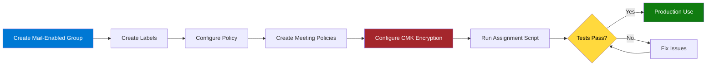
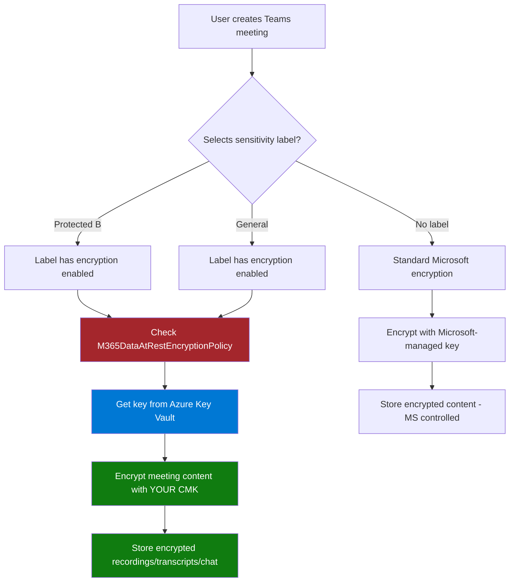

# Teams Premium Build Book
## Group-Based Deployment for LCE M365 Security
### Leonardo Company    

---

**Document Control**

| Field | Value |
|-------|-------|
| **Version** | 7.0 - CMK Encryption Integration |
| **Last Updated** | November 20, 2025 |
| **Owner** | Fred Pearson & George Zarif |
| **Email** | fred.pearson@leonardocompany.ca |
| **Target Group** | LCE M365 Security (lcem365security@leonardocompany.ca) |
| **Classification** | Internal Use Only |

---

## Table of Contents

1. [Overview](#1-overview)
2. [Prerequisites](#2-prerequisites)
3. [Phase 1: Group Setup](#3-phase-1-group-setup)
4. [Phase 2: Sensitivity Label Creation](#4-phase-2-sensitivity-label-creation)
5. [Phase 3: Label Policy Configuration](#5-phase-3-label-policy-configuration)
6. [Phase 4: Meeting Policy Creation](#6-phase-4-meeting-policy-creation)
7. [Phase 5: CMK Configuration & Encryption](#7-phase-5-cmk-configuration--encryption)
8. [Phase 6: Automated Group Policy Assignment](#8-phase-6-automated-group-policy-assignment)
9. [Phase 7: Testing & Verification](#9-phase-7-testing--verification)
10. [Ongoing Management](#10-ongoing-management)
11. [Troubleshooting](#11-troubleshooting)

---

## 1. Overview

### 1.1 Purpose

This build book provides step-by-step instructions for deploying Microsoft Teams Premium with **Customer Managed Keys (CMK)** and **Teams-only sensitivity labels** to the **LCE M365 Security** mail-enabled security group at Leonardo Company.

### 1.2 Deployment Strategy



### 1.3 Key Features

**Mail-Enabled Security Group:**
- ✅ Group email: `lcem365security@leonardocompany.ca`
- ✅ Used for automated monitoring reports
- ✅ Used for policy assignment
- ✅ Easy to manage - add members once, policies apply automatically

**Sensitivity Labels (Teams Meetings ONLY):**
- ✅ Protected B - Secure Meeting (watermarks, restricted lobby, CMK encryption)
- ✅ General - Regular Meeting (open collaboration, CMK encryption)
- ✅ Labels appear ONLY in Teams meeting creation
- ✅ Labels do NOT appear in Outlook, Word, Excel, or PowerPoint

**Customer Managed Keys (CMK):**
- ✅ Meeting recordings encrypted with YOUR key
- ✅ Meeting transcripts encrypted with YOUR key
- ✅ Meeting chat encrypted with YOUR key
- ✅ Shared files encrypted with YOUR key
- ✅ YOU control encryption keys in Azure Key Vault
- ✅ You can revoke access at any time

**For Secure Meetings:**
- ✅ Watermarks on camera and screen sharing
- ✅ Lobby restricted to organization members only
- ✅ Phone dial-in users must wait in lobby
- ✅ Only organizer can control presenters
- ✅ External users cannot request control
- ✅ CMK encryption applied automatically

**For Regular Meetings:**
- ✅ Open lobby (organization + guests)
- ✅ Phone dial-in users can bypass lobby
- ✅ Everyone can be a presenter
- ✅ External users can request control
- ✅ CMK encryption applied automatically

---

## 2. Prerequisites

### 2.1 Required Licenses

**For Each Group Member:**
- ✅ Microsoft 365 E5 (or E3 + Teams Premium add-on)
- ✅ Teams Premium license
- ✅ Azure Active Directory Premium P1

### 2.2 Required Permissions

**Administrator Account Needs:**
- ✅ Global Administrator
- ✅ Teams Administrator
- ✅ Compliance Administrator
- ✅ Exchange Administrator
- ✅ Azure Key Vault Administrator (for CMK setup)

### 2.3 Azure Key Vault Prerequisites (for CMK)

**Before Phase 5, you must have:**
- ✅ Azure subscription
- ✅ Azure Key Vault created
- ✅ CMK generated in Key Vault
- ✅ Permissions granted to Microsoft 365 service principals
- ✅ M365 Data-at-Rest Encryption Policy created
- ⏱️ CMK provisioning completed (can take 24-72 hours)

**Reference:** https://docs.microsoft.com/en-us/purview/customer-key-overview

### 2.4 Required PowerShell Modules

```powershell
# Install required modules
Install-Module Microsoft.Graph -Force -Scope CurrentUser
Install-Module MicrosoftTeams -Force -Scope CurrentUser
Install-Module ExchangeOnlineManagement -Force -Scope CurrentUser
Install-Module PnP.PowerShell -Force -Scope CurrentUser
```

---

## 3. Phase 1: Group Setup

### 3.1 Create Mail-Enabled Security Group

**Purpose:** Create a mail-enabled security group that serves both email distribution AND policy assignment.

**Via Exchange Admin Center (GUI - RECOMMENDED):**

1. Go to https://admin.exchange.microsoft.com
2. Navigate to **Recipients** → **Groups**
3. Click **Add a group**
4. Select **Mail-enabled security**
5. Fill in:
   - **Name:** LCE M365 Security
   - **Email:** lcem365security@leonardocompany.ca
   - **Description:** Security team for M365 monitoring, alerts, and Teams Premium policies
6. Add members:
   - fred.pearson@leonardocompany.ca
   - george.zarif@leonardocompany.ca
   - chris.helm@leonardocompany.ca
   - adrian.darjan@leonardocompany.ca
7. Click **Create**

**Via PowerShell:**

```powershell
# Connect to Exchange Online
Connect-ExchangeOnline

# Create mail-enabled security group
New-DistributionGroup `
    -Name "LCE M365 Security" `
    -Alias "LCEM365Security" `
    -Type "Security" `
    -PrimarySmtpAddress "lcem365security@leonardocompany.ca" `
    -MemberJoinRestriction "Closed" `
    -MemberDepartRestriction "Closed"

# Add members
Add-DistributionGroupMember -Identity "lcem365security@leonardocompany.ca" -Member "fred.pearson@leonardocompany.ca"
Add-DistributionGroupMember -Identity "lcem365security@leonardocompany.ca" -Member "george.zarif@leonardocompany.ca"
Add-DistributionGroupMember -Identity "lcem365security@leonardocompany.ca" -Member "chris.helm@leonardocompany.ca"
Add-DistributionGroupMember -Identity "lcem365security@leonardocompany.ca" -Member "adrian.darjan@leonardocompany.ca"

# Set owner
Set-DistributionGroup -Identity "lcem365security@leonardocompany.ca" -ManagedBy "fred.pearson@leonardocompany.ca"

# Verify
Get-DistributionGroupMember -Identity "lcem365security@leonardocompany.ca" | Select-Object Name, PrimarySmtpAddress

Disconnect-ExchangeOnline -Confirm:$false
```

### 3.2 Test Email Distribution

Send a test email to `lcem365security@leonardocompany.ca` to verify all members receive it.

---

## 4. Phase 2: Sensitivity Label Creation

### 4.1 Create Sensitivity Labels

**Script:** `01-Create-Sensitivity-Labels.ps1`

```powershell
<#
.SYNOPSIS
    Create Teams-only sensitivity labels for LCE M365 Security
.DESCRIPTION
    Creates two sensitivity labels that will ONLY appear in Teams meetings:
    - Protected B - Secure Meeting
    - General - Regular Meeting
.AUTHOR
    Fred Pearson & George Zarif
.DATE
    November 20, 2025
#>

Write-Host "`n╔══════════════════════════════════════════════════════════════════╗" -ForegroundColor Cyan
Write-Host "║  PHASE 2: CREATE SENSITIVITY LABELS                             ║" -ForegroundColor Cyan
Write-Host "╚══════════════════════════════════════════════════════════════════╝" -ForegroundColor Cyan

# Connect
Write-Host "`n[Connecting to Security & Compliance Center...]" -ForegroundColor Yellow
Connect-IPPSSession

# Label configurations
$protectedBConfig = @{
    DisplayName = "Protected B - Secure Meeting"
    Name = "ProtectedB-SecureMeeting"
    Comment = "For classified, sensitive, or NDA-covered meetings. Security settings locked."
    Tooltip = "Use for classified, sensitive, or NDA-covered content. Security settings are locked and cannot be changed."
    ContentType = "File, Email, Teamwork"
    AdvancedSettings = @{
        color = "#A4262C"  # Dark red
    }
}

$generalConfig = @{
    DisplayName = "General - Regular Meeting"
    Name = "General-RegularMeeting"
    Comment = "For team syncs, project collaboration, and standard calls."
    Tooltip = "Use for team syncs, project collaboration, and standard calls. You can customize meeting options as needed."
    ContentType = "File, Email, Teamwork"
    AdvancedSettings = @{
        color = "#13A10E"  # Green
    }
}

# Create Protected B Label
Write-Host "`n[1/2] Creating Protected B label..." -ForegroundColor Cyan

$existingProtectedB = Get-Label | Where-Object {$_.DisplayName -eq $protectedBConfig.DisplayName}

if ($existingProtectedB) {
    Write-Host "  ⚠️  Label already exists: $($existingProtectedB.DisplayName)" -ForegroundColor Yellow
    $protectedBLabel = $existingProtectedB
} else {
    $protectedBLabel = New-Label @protectedBConfig
    Write-Host "  ✓ Created: $($protectedBLabel.DisplayName)" -ForegroundColor Green
}

Write-Host "  GUID: $($protectedBLabel.Guid)" -ForegroundColor Gray

# Create General Label
Write-Host "`n[2/2] Creating General label..." -ForegroundColor Cyan

$existingGeneral = Get-Label | Where-Object {$_.DisplayName -eq $generalConfig.DisplayName}

if ($existingGeneral) {
    Write-Host "  ⚠️  Label already exists: $($existingGeneral.DisplayName)" -ForegroundColor Yellow
    $generalLabel = $existingGeneral
} else {
    $generalLabel = New-Label @generalConfig
    Write-Host "  ✓ Created: $($generalLabel.DisplayName)" -ForegroundColor Green
}

Write-Host "  GUID: $($generalLabel.Guid)" -ForegroundColor Gray

# Export label info
$exportPath = "C:\LeonardoReports"
New-Item -Path $exportPath -ItemType Directory -Force -ErrorAction SilentlyContinue | Out-Null

$labelInfo = @(
    [PSCustomObject]@{
        DisplayName = $protectedBLabel.DisplayName
        GUID = $protectedBLabel.Guid
        Created = Get-Date -Format "yyyy-MM-dd HH:mm:ss"
    },
    [PSCustomObject]@{
        DisplayName = $generalLabel.DisplayName
        GUID = $generalLabel.Guid
        Created = Get-Date -Format "yyyy-MM-dd HH:mm:ss"
    }
)

$labelInfo | Export-Csv "$exportPath\Sensitivity-Labels-$(Get-Date -Format 'yyyy-MM-dd').csv" -NoTypeInformation

Write-Host "`n✓ Label information exported to: $exportPath" -ForegroundColor Gray

Disconnect-ExchangeOnline -Confirm:$false

Write-Host "`n✅ Phase 2 Complete - Labels Created`n" -ForegroundColor Green
```

---

## 5. Phase 3: Label Policy Configuration

### 5.1 Configure Label Policy (Teams Only)

**Script:** `02-Configure-Label-Policy-TeamsOnly.ps1`

```powershell
<#
.SYNOPSIS
    Configure sensitivity label policy for Teams meetings ONLY
.DESCRIPTION
    Creates label policy and ensures labels ONLY appear in Teams meetings,
    NOT in Outlook, Word, Excel, or other Office apps.
.AUTHOR
    Fred Pearson & George Zarif
.DATE
    November 20, 2025
#>

Write-Host "`n╔══════════════════════════════════════════════════════════════════╗" -ForegroundColor Cyan
Write-Host "║  PHASE 3: LABEL POLICY CONFIGURATION (TEAMS ONLY)               ║" -ForegroundColor Cyan
Write-Host "╚══════════════════════════════════════════════════════════════════╝" -ForegroundColor Cyan

$policyName = "LCE Meeting Labels"

# Connect
Write-Host "`n[Connecting to Security & Compliance Center...]" -ForegroundColor Yellow
Connect-IPPSSession

# Get labels
Write-Host "`n[1/4] Finding sensitivity labels..." -ForegroundColor Cyan

$allLabels = Get-Label
$protectedB = $allLabels | Where-Object {$_.DisplayName -eq "Protected B - Secure Meeting"}
$general = $allLabels | Where-Object {$_.DisplayName -eq "General - Regular Meeting"}

if (-not $protectedB -or -not $general) {
    Write-Host "✗ Error: Labels not found! Run Phase 2 first." -ForegroundColor Red
    Disconnect-ExchangeOnline -Confirm:$false
    exit 1
}

Write-Host "  ✓ Found: $($protectedB.DisplayName)" -ForegroundColor Green
Write-Host "  ✓ Found: $($general.DisplayName)" -ForegroundColor Green

# Create or Update Policy
Write-Host "`n[2/4] Creating/updating label policy..." -ForegroundColor Cyan

$existingPolicy = Get-LabelPolicy -Identity $policyName -ErrorAction SilentlyContinue

if ($existingPolicy) {
    Write-Host "  ⚠️  Policy exists - updating..." -ForegroundColor Yellow
    
    if ($existingPolicy.Labels -notcontains $protectedB.Guid) {
        Set-LabelPolicy -Identity $policyName -AddLabel $protectedB.Guid
    }
    
    if ($existingPolicy.Labels -notcontains $general.Guid) {
        Set-LabelPolicy -Identity $policyName -AddLabel $general.Guid
    }
    
    Write-Host "  ✓ Policy updated" -ForegroundColor Green
    
} else {
    New-LabelPolicy -Name $policyName `
        -Labels @($protectedB.Guid, $general.Guid) `
        -Comment "Teams meetings only - $(Get-Date -Format 'yyyy-MM-dd HH:mm')"
    
    Write-Host "  ✓ Policy created" -ForegroundColor Green
}

# Remove ALL Exchange/SharePoint/OneDrive Locations
Write-Host "`n[3/4] Removing all locations (ensures Teams-only)..." -ForegroundColor Cyan

$policy = Get-LabelPolicy -Identity $policyName

# Remove Exchange
if ($policy.ExchangeLocation) {
    foreach ($location in $policy.ExchangeLocation) {
        Set-LabelPolicy -Identity $policyName -RemoveExchangeLocation $location -ErrorAction SilentlyContinue
    }
}

# Remove SharePoint
if ($policy.SharePointLocation) {
    foreach ($location in $policy.SharePointLocation) {
        Set-LabelPolicy -Identity $policyName -RemoveSharePointLocation $location -ErrorAction SilentlyContinue
    }
}

# Remove OneDrive
if ($policy.OneDriveLocation) {
    foreach ($location in $policy.OneDriveLocation) {
        Set-LabelPolicy -Identity $policyName -RemoveOneDriveLocation $location -ErrorAction SilentlyContinue
    }
}

Write-Host "  ✓ All locations removed" -ForegroundColor Green

# Verification
Write-Host "`n[4/4] Verifying configuration..." -ForegroundColor Cyan

$verifiedPolicy = Get-LabelPolicy -Identity $policyName

Write-Host "`nPublished Locations:" -ForegroundColor Cyan
Write-Host "  Exchange: $($verifiedPolicy.ExchangeLocation.Count)" -ForegroundColor $(if($verifiedPolicy.ExchangeLocation.Count -eq 0){"Green"}else{"Red"})
Write-Host "  SharePoint: $($verifiedPolicy.SharePointLocation.Count)" -ForegroundColor $(if($verifiedPolicy.SharePointLocation.Count -eq 0){"Green"}else{"Red"})
Write-Host "  OneDrive: $($verifiedPolicy.OneDriveLocation.Count)" -ForegroundColor $(if($verifiedPolicy.OneDriveLocation.Count -eq 0){"Green"}else{"Red"})

if ($verifiedPolicy.ExchangeLocation.Count -eq 0 -and 
    $verifiedPolicy.SharePointLocation.Count -eq 0 -and 
    $verifiedPolicy.OneDriveLocation.Count -eq 0) {
    
    Write-Host "`n✅ PERFECT! Labels configured for Teams only" -ForegroundColor Green
} else {
    Write-Host "`n⚠️  WARNING: Policy still has some locations" -ForegroundColor Yellow
}

Disconnect-ExchangeOnline -Confirm:$false

Write-Host "`n✅ Phase 3 Complete - Policy Configured for Teams Only`n" -ForegroundColor Green
```

---

## 6. Phase 4: Meeting Policy Creation

### 6.1 Create Meeting Policies

**Script:** `03-Create-Meeting-Policies.ps1`

```powershell
<#
.SYNOPSIS
    Create Teams Premium Meeting Policies
.DESCRIPTION
    Creates two meeting policies:
    - Leonardo-Secure-Meeting-Group (watermarks enabled)
    - Leonardo-Regular-Meeting-Group (no watermarks)
.AUTHOR
    Fred Pearson & George Zarif
.DATE
    November 20, 2025
#>

Write-Host "`n╔══════════════════════════════════════════════════════════════════╗" -ForegroundColor Cyan
Write-Host "║  PHASE 4: MEETING POLICY CREATION                               ║" -ForegroundColor Cyan
Write-Host "╚══════════════════════════════════════════════════════════════════╝" -ForegroundColor Cyan

# Connect
Write-Host "`n[Connecting to Microsoft Teams...]" -ForegroundColor Yellow
Connect-MicrosoftTeams

$securePolicyName = "Leonardo-Secure-Meeting-Group"
$regularPolicyName = "Leonardo-Regular-Meeting-Group"

# Create Secure Policy
Write-Host "`n[1/2] Creating SECURE meeting policy..." -ForegroundColor Cyan

try {
    Remove-CsTeamsMeetingPolicy -Identity $securePolicyName -Confirm:$false -ErrorAction SilentlyContinue
    Start-Sleep -Seconds 3
} catch {}

New-CsTeamsMeetingPolicy -Identity $securePolicyName `
    -Description "Secure meetings - watermarks enabled, restricted lobby" `
    -AllowCloudRecording $true `
    -AllowRecordingStorageOutsideRegion $false `
    -AllowTranscription $true `
    -LiveCaptionsEnabledType "DisabledUserOverride" `
    -AllowMeetingCoach $false `
    -AutoAdmittedUsers "EveryoneInCompanyExcludingGuests" `
    -AllowPSTNUsersToBypassLobby $false `
    -AllowAnonymousUsersToJoinMeeting $false `
    -AllowAnonymousUsersToStartMeeting $false `
    -ScreenSharingMode "EntireScreen" `
    -AllowParticipantGiveRequestControl $false `
    -AllowExternalParticipantGiveRequestControl $false `
    -DesignatedPresenterRoleMode "OrganizerOnlyUserOverride" `
    -RecordingStorageMode "Stream"

Start-Sleep -Seconds 2
Set-CsTeamsMeetingPolicy -Identity $securePolicyName `
    -AllowWatermarkForCameraVideo $true `
    -AllowWatermarkForScreenSharing $true

Write-Host "  ✓ Secure policy created with watermarks" -ForegroundColor Green

# Create Regular Policy
Write-Host "`n[2/2] Creating REGULAR meeting policy..." -ForegroundColor Cyan

try {
    Remove-CsTeamsMeetingPolicy -Identity $regularPolicyName -Confirm:$false -ErrorAction SilentlyContinue
    Start-Sleep -Seconds 3
} catch {}

New-CsTeamsMeetingPolicy -Identity $regularPolicyName `
    -Description "Regular meetings - no watermarks, open collaboration" `
    -AllowCloudRecording $true `
    -AllowRecordingStorageOutsideRegion $false `
    -AllowTranscription $true `
    -LiveCaptionsEnabledType "DisabledUserOverride" `
    -AllowMeetingCoach $true `
    -AutoAdmittedUsers "EveryoneInCompany" `
    -AllowPSTNUsersToBypassLobby $true `
    -AllowAnonymousUsersToJoinMeeting $true `
    -AllowAnonymousUsersToStartMeeting $false `
    -ScreenSharingMode "EntireScreen" `
    -AllowParticipantGiveRequestControl $true `
    -AllowExternalParticipantGiveRequestControl $true `
    -DesignatedPresenterRoleMode "EveryoneUserOverride" `
    -RecordingStorageMode "Stream"

Start-Sleep -Seconds 2
Set-CsTeamsMeetingPolicy -Identity $regularPolicyName `
    -AllowWatermarkForCameraVideo $false `
    -AllowWatermarkForScreenSharing $false

Write-Host "  ✓ Regular policy created without watermarks" -ForegroundColor Green

# Verification
$securePolicy = Get-CsTeamsMeetingPolicy -Identity $securePolicyName
$regularPolicy = Get-CsTeamsMeetingPolicy -Identity $regularPolicyName

Write-Host "`n╔══════════════════════════════════════════════════════════════════╗" -ForegroundColor Cyan
Write-Host "║  POLICY VERIFICATION                                            ║" -ForegroundColor Cyan
Write-Host "╚══════════════════════════════════════════════════════════════════╝" -ForegroundColor Cyan

Write-Host "`nSECURE POLICY:" -ForegroundColor Yellow
Write-Host "  Camera Watermark: $($securePolicy.AllowWatermarkForCameraVideo)" -ForegroundColor Green
Write-Host "  Screen Watermark: $($securePolicy.AllowWatermarkForScreenSharing)" -ForegroundColor Green

Write-Host "`nREGULAR POLICY:" -ForegroundColor Yellow
Write-Host "  Camera Watermark: $($regularPolicy.AllowWatermarkForCameraVideo)" -ForegroundColor Green
Write-Host "  Screen Watermark: $($regularPolicy.AllowWatermarkForScreenSharing)" -ForegroundColor Green

Disconnect-MicrosoftTeams

Write-Host "`n✅ Phase 4 Complete - Meeting Policies Created`n" -ForegroundColor Green
```

---

## 7. Phase 5: CMK Configuration & Encryption

### 7.1 Overview

Customer Managed Keys (CMK) ensures that your Teams meeting content is encrypted using keys that YOU control in Azure Key Vault, not Microsoft-managed keys. This phase links your sensitivity labels to CMK encryption.

**What gets encrypted with CMK:**
- ✅ Teams meeting recordings
- ✅ Teams meeting transcripts
- ✅ Teams meeting chat messages
- ✅ Shared files during meetings
- ✅ Meeting metadata

**Prerequisites:**
- Azure Key Vault provisioned with CMK
- CMK policy created and active
- Key Vault permissions granted to Microsoft 365 service principals
- Sensitivity labels created (Phase 2)

---

### 7.2 Check Current CMK Status

**Script:** `04-Check-CMK-Status.ps1`

```powershell
<#
.SYNOPSIS
    Check CMK and label encryption status
.DESCRIPTION
    Verifies CMK policy is active and checks if labels have encryption enabled
.AUTHOR
    Fred Pearson & George Zarif
.DATE
    November 20, 2025
#>

Write-Host "`n╔══════════════════════════════════════════════════════════════════╗" -ForegroundColor Cyan
Write-Host "║  PHASE 5A: CHECK CMK STATUS                                     ║" -ForegroundColor Cyan
Write-Host "╚══════════════════════════════════════════════════════════════════╝" -ForegroundColor Cyan

# Connect
Write-Host "`n[Connecting to Security & Compliance Center...]" -ForegroundColor Yellow
Connect-IPPSSession

# ============================================================
# CHECK CMK POLICY
# ============================================================

Write-Host "`n[1/3] Checking CMK policy status..." -ForegroundColor Cyan

try {
    $cmkPolicy = Get-M365DataAtRestEncryptionPolicy -ErrorAction Stop
    
    if ($cmkPolicy) {
        Write-Host "  ✓ CMK Policy Found: $($cmkPolicy.Name)" -ForegroundColor Green
        Write-Host "    Status: $($cmkPolicy.Status)" -ForegroundColor $(if($cmkPolicy.Status -eq "Active"){"Green"}else{"Yellow"})
        Write-Host "    Workload: $($cmkPolicy.Workload)" -ForegroundColor White
        
        if ($cmkPolicy.AzureKeyVaultUri) {
            Write-Host "    Key Vault: $($cmkPolicy.AzureKeyVaultUri)" -ForegroundColor White
        }
        
        $hasCMK = $true
    } else {
        Write-Host "  ⚠️  No CMK policy found" -ForegroundColor Yellow
        $hasCMK = $false
    }
    
} catch {
    Write-Host "  ⚠️  CMK policy not configured" -ForegroundColor Yellow
    Write-Host "    Error: $($_.Exception.Message)" -ForegroundColor Gray
    $hasCMK = $false
}

# ============================================================
# CHECK LABELS
# ============================================================

Write-Host "`n[2/3] Checking sensitivity labels..." -ForegroundColor Cyan

$allLabels = Get-Label
$protectedB = $allLabels | Where-Object {$_.DisplayName -eq "Protected B - Secure Meeting"}
$general = $allLabels | Where-Object {$_.DisplayName -eq "General - Regular Meeting"}

if (-not $protectedB -or -not $general) {
    Write-Host "  ✗ Labels not found! Run Phase 2 first." -ForegroundColor Red
    Disconnect-ExchangeOnline -Confirm:$false
    exit 1
}

Write-Host "  ✓ Found labels" -ForegroundColor Green

# ============================================================
# CHECK LABEL ENCRYPTION
# ============================================================

Write-Host "`n[3/3] Checking label encryption configuration..." -ForegroundColor Cyan

$labelStatus = @()

# Check Protected B
$protectedBEncrypted = $protectedB.EncryptionEnabled
Write-Host "`nProtected B - Secure Meeting:" -ForegroundColor Yellow
Write-Host "  GUID: $($protectedB.Guid)" -ForegroundColor Gray
Write-Host "  Encryption Enabled: $protectedBEncrypted" -ForegroundColor $(if($protectedBEncrypted){"Green"}else{"Red"})

if ($protectedBEncrypted) {
    Write-Host "  Protection Type: $($protectedB.EncryptionProtectionType)" -ForegroundColor White
    Write-Host "  ✅ CMK will be applied to meetings" -ForegroundColor Green
} else {
    Write-Host "  ⚠️  Encryption NOT enabled - CMK will NOT be applied" -ForegroundColor Yellow
}

$labelStatus += [PSCustomObject]@{
    Label = "Protected B - Secure Meeting"
    GUID = $protectedB.Guid
    EncryptionEnabled = $protectedBEncrypted
    Status = if($protectedBEncrypted){"Configured"}else{"Not Configured"}
}

# Check General
$generalEncrypted = $general.EncryptionEnabled
Write-Host "`nGeneral - Regular Meeting:" -ForegroundColor Yellow
Write-Host "  GUID: $($general.Guid)" -ForegroundColor Gray
Write-Host "  Encryption Enabled: $generalEncrypted" -ForegroundColor $(if($generalEncrypted){"Green"}else{"Red"})

if ($generalEncrypted) {
    Write-Host "  Protection Type: $($general.EncryptionProtectionType)" -ForegroundColor White
    Write-Host "  ✅ CMK will be applied to meetings" -ForegroundColor Green
} else {
    Write-Host "  ⚠️  Encryption NOT enabled - CMK will NOT be applied" -ForegroundColor Yellow
}

$labelStatus += [PSCustomObject]@{
    Label = "General - Regular Meeting"
    GUID = $general.Guid
    EncryptionEnabled = $generalEncrypted
    Status = if($generalEncrypted){"Configured"}else{"Not Configured"}
}

# ============================================================
# SUMMARY & RECOMMENDATIONS
# ============================================================

Write-Host "`n╔══════════════════════════════════════════════════════════════════╗" -ForegroundColor Cyan
Write-Host "║  CMK STATUS SUMMARY                                             ║" -ForegroundColor Cyan
Write-Host "╚══════════════════════════════════════════════════════════════════╝" -ForegroundColor Cyan

Write-Host "`nCMK Policy:" -ForegroundColor Cyan
if ($hasCMK) {
    Write-Host "  ✅ CMK policy is configured and active" -ForegroundColor Green
} else {
    Write-Host "  ❌ CMK policy NOT found or not active" -ForegroundColor Red
    Write-Host "     You must provision CMK in Azure Key Vault first" -ForegroundColor Yellow
    Write-Host "     See: https://docs.microsoft.com/en-us/purview/customer-key-overview" -ForegroundColor Yellow
}

Write-Host "`nLabel Encryption:" -ForegroundColor Cyan
$encryptedCount = ($labelStatus | Where-Object {$_.EncryptionEnabled -eq $true}).Count
$totalCount = $labelStatus.Count

Write-Host "  Configured: $encryptedCount / $totalCount" -ForegroundColor $(if($encryptedCount -eq $totalCount){"Green"}else{"Yellow"})

foreach ($status in $labelStatus) {
    $icon = if($status.EncryptionEnabled){"✅"}else{"❌"}
    $color = if($status.EncryptionEnabled){"Green"}else{"Red"}
    Write-Host "    $icon $($status.Label): $($status.Status)" -ForegroundColor $color
}

# ============================================================
# NEXT STEPS
# ============================================================

Write-Host "`n╔══════════════════════════════════════════════════════════════════╗" -ForegroundColor Yellow
Write-Host "║  NEXT STEPS                                                     ║" -ForegroundColor Yellow
Write-Host "╚══════════════════════════════════════════════════════════════════╝" -ForegroundColor Yellow

if (-not $hasCMK) {
    Write-Host "`n⚠️  CMK NOT CONFIGURED" -ForegroundColor Red
    Write-Host "`nYou must complete these steps FIRST:" -ForegroundColor Yellow
    Write-Host "  1. Create Azure Key Vault" -ForegroundColor White
    Write-Host "  2. Generate CMK in Key Vault" -ForegroundColor White
    Write-Host "  3. Grant permissions to Microsoft 365 service principals" -ForegroundColor White
    Write-Host "  4. Create and assign M365 Data-at-Rest Encryption Policy" -ForegroundColor White
    Write-Host "  5. Wait for CMK provisioning (can take 24-72 hours)" -ForegroundColor White
    Write-Host "`nThen run this script again to verify." -ForegroundColor White
} elseif ($encryptedCount -lt $totalCount) {
    Write-Host "`n⚠️  LABELS NEED ENCRYPTION CONFIGURATION" -ForegroundColor Yellow
    Write-Host "`nRun the next script to enable encryption:" -ForegroundColor White
    Write-Host "  .\05-Configure-Label-Encryption.ps1" -ForegroundColor Cyan
} else {
    Write-Host "`n✅ ALL CONFIGURED!" -ForegroundColor Green
    Write-Host "`nYour labels are configured to use CMK." -ForegroundColor White
    Write-Host "Meetings created with these labels will be encrypted with YOUR key." -ForegroundColor White
}

# Export report
$exportPath = "C:\LeonardoReports"
New-Item -Path $exportPath -ItemType Directory -Force -ErrorAction SilentlyContinue | Out-Null

$reportFile = "$exportPath\CMK-Status-$(Get-Date -Format 'yyyy-MM-dd-HHmm').csv"
$labelStatus | Export-Csv $reportFile -NoTypeInformation

Write-Host "`n📄 Report saved: $reportFile" -ForegroundColor Gray

Disconnect-ExchangeOnline -Confirm:$false

Write-Host "`n✅ Phase 5a Complete - CMK Status Check`n" -ForegroundColor Green
```

---

### 7.3 Configure Label Encryption with CMK

**Script:** `05-Configure-Label-Encryption.ps1`

**⚠️ IMPORTANT:** Only run this script if:
1. CMK policy is active (verified in Phase 5a)
2. Labels do NOT have encryption enabled yet

```powershell
<#
.SYNOPSIS
    Configure CMK encryption for Teams sensitivity labels
.DESCRIPTION
    Links sensitivity labels to Customer Managed Key encryption policy.
    Only run this if:
    1. CMK policy is active
    2. Labels do NOT have encryption enabled yet
.AUTHOR
    Fred Pearson & George Zarif
.DATE
    November 20, 2025
#>

Write-Host "`n╔══════════════════════════════════════════════════════════════════╗" -ForegroundColor Cyan
Write-Host "║  PHASE 5B: CONFIGURE LABEL ENCRYPTION WITH CMK                  ║" -ForegroundColor Cyan
Write-Host "╚══════════════════════════════════════════════════════════════════╝" -ForegroundColor Cyan

# Connect
Write-Host "`n[Connecting to Security & Compliance Center...]" -ForegroundColor Yellow
Connect-IPPSSession

# ============================================================
# PRE-FLIGHT CHECKS
# ============================================================

Write-Host "`n[1/5] Running pre-flight checks..." -ForegroundColor Cyan

# Check CMK policy
Write-Host "  • Checking CMK policy..." -NoNewline
$cmkPolicy = Get-M365DataAtRestEncryptionPolicy -ErrorAction SilentlyContinue

if (-not $cmkPolicy) {
    Write-Host " ✗" -ForegroundColor Red
    Write-Host "`n❌ CANNOT CONTINUE: No CMK policy found!" -ForegroundColor Red
    Write-Host "`nYou must provision CMK in Azure Key Vault first:" -ForegroundColor Yellow
    Write-Host "  1. Create Azure Key Vault" -ForegroundColor White
    Write-Host "  2. Generate CMK" -ForegroundColor White
    Write-Host "  3. Grant Microsoft 365 permissions" -ForegroundColor White
    Write-Host "  4. Create M365DataAtRestEncryptionPolicy" -ForegroundColor White
    Write-Host "`nSee: https://docs.microsoft.com/en-us/purview/customer-key-overview" -ForegroundColor Cyan
    Disconnect-ExchangeOnline -Confirm:$false
    exit 1
}

if ($cmkPolicy.Status -ne "Active") {
    Write-Host " ⚠️" -ForegroundColor Yellow
    Write-Host "`n⚠️  WARNING: CMK policy status is '$($cmkPolicy.Status)' not 'Active'" -ForegroundColor Yellow
    Write-Host "   CMK may still be provisioning (can take 24-72 hours)" -ForegroundColor Yellow
    
    $continue = Read-Host "`nContinue anyway? (y/n)"
    if ($continue -ne "y") {
        Write-Host "`nExiting. Run this script when CMK status is 'Active'." -ForegroundColor Yellow
        Disconnect-ExchangeOnline -Confirm:$false
        exit 0
    }
}

Write-Host " ✓" -ForegroundColor Green
Write-Host "    Policy: $($cmkPolicy.Name)" -ForegroundColor Gray
Write-Host "    Status: $($cmkPolicy.Status)" -ForegroundColor Gray

# Check labels exist
Write-Host "  • Checking labels..." -NoNewline
$allLabels = Get-Label
$protectedB = $allLabels | Where-Object {$_.DisplayName -eq "Protected B - Secure Meeting"}
$general = $allLabels | Where-Object {$_.DisplayName -eq "General - Regular Meeting"}

if (-not $protectedB -or -not $general) {
    Write-Host " ✗" -ForegroundColor Red
    Write-Host "`n❌ CANNOT CONTINUE: Labels not found!" -ForegroundColor Red
    Write-Host "   Run Phase 2 first to create labels." -ForegroundColor Yellow
    Disconnect-ExchangeOnline -Confirm:$false
    exit 1
}

Write-Host " ✓" -ForegroundColor Green

# Check if encryption already enabled
Write-Host "  • Checking current encryption status..." -NoNewline

if ($protectedB.EncryptionEnabled -and $general.EncryptionEnabled) {
    Write-Host " ⚠️" -ForegroundColor Yellow
    Write-Host "`n⚠️  WARNING: Encryption is already enabled on both labels!" -ForegroundColor Yellow
    Write-Host "`nCurrent configuration:" -ForegroundColor Cyan
    Write-Host "  Protected B - Encryption: $($protectedB.EncryptionEnabled)" -ForegroundColor White
    Write-Host "  General - Encryption: $($general.EncryptionEnabled)" -ForegroundColor White
    
    $continue = Read-Host "`nRe-configure encryption anyway? This will overwrite existing settings. (y/n)"
    if ($continue -ne "y") {
        Write-Host "`nExiting without changes." -ForegroundColor Yellow
        Disconnect-ExchangeOnline -Confirm:$false
        exit 0
    }
}

Write-Host " ✓" -ForegroundColor Green

# ============================================================
# CONFIGURE ENCRYPTION - PROTECTED B
# ============================================================

Write-Host "`n[2/5] Configuring encryption for Protected B label..." -ForegroundColor Cyan

try {
    # Configure encryption with restrictive permissions
    Set-Label -Identity $protectedB.Guid `
        -EncryptionEnabled $true `
        -EncryptionProtectionType "Template" `
        -EncryptionRightsDefinitions "lcem365security@leonardocompany.ca:VIEW,VIEWRIGHTSDATA,DOCEDIT,EDIT,PRINT,EXTRACT,REPLY,REPLYALL,FORWARD,OBJMODEL" `
        -EncryptionContentExpiredOnDateInDaysOrNever "Never"
    
    Write-Host "  ✓ Encryption enabled" -ForegroundColor Green
    Write-Host "    Protection: Template-based (CMK)" -ForegroundColor Gray
    Write-Host "    Access: LCE M365 Security group" -ForegroundColor Gray
    
} catch {
    Write-Host "  ✗ Failed: $($_.Exception.Message)" -ForegroundColor Red
    Disconnect-ExchangeOnline -Confirm:$false
    exit 1
}

# ============================================================
# CONFIGURE ENCRYPTION - GENERAL
# ============================================================

Write-Host "`n[3/5] Configuring encryption for General label..." -ForegroundColor Cyan

try {
    # Configure encryption with broader permissions
    Set-Label -Identity $general.Guid `
        -EncryptionEnabled $true `
        -EncryptionProtectionType "Template" `
        -EncryptionRightsDefinitions "AuthenticatedUsers:VIEW,VIEWRIGHTSDATA,DOCEDIT,EDIT,PRINT,EXTRACT,REPLY,REPLYALL,FORWARD,OBJMODEL" `
        -EncryptionContentExpiredOnDateInDaysOrNever "Never"
    
    Write-Host "  ✓ Encryption enabled" -ForegroundColor Green
    Write-Host "    Protection: Template-based (CMK)" -ForegroundColor Gray
    Write-Host "    Access: All authenticated users" -ForegroundColor Gray
    
} catch {
    Write-Host "  ✗ Failed: $($_.Exception.Message)" -ForegroundColor Red
    Disconnect-ExchangeOnline -Confirm:$false
    exit 1
}

# ============================================================
# VERIFICATION
# ============================================================

Write-Host "`n[4/5] Verifying encryption configuration..." -ForegroundColor Cyan

Start-Sleep -Seconds 3

$verifyProtectedB = Get-Label -Identity $protectedB.Guid
$verifyGeneral = Get-Label -Identity $general.Guid

$results = @()

# Verify Protected B
Write-Host "`nProtected B - Secure Meeting:" -ForegroundColor Yellow
Write-Host "  Encryption Enabled: $($verifyProtectedB.EncryptionEnabled)" -ForegroundColor $(if($verifyProtectedB.EncryptionEnabled){"Green"}else{"Red"})
Write-Host "  Protection Type: $($verifyProtectedB.EncryptionProtectionType)" -ForegroundColor White
Write-Host "  CMK Applied: $(if($verifyProtectedB.EncryptionEnabled){'YES'}else{'NO'})" -ForegroundColor $(if($verifyProtectedB.EncryptionEnabled){"Green"}else{"Red"})

$results += [PSCustomObject]@{
    Label = "Protected B - Secure Meeting"
    GUID = $verifyProtectedB.Guid
    EncryptionEnabled = $verifyProtectedB.EncryptionEnabled
    ProtectionType = $verifyProtectedB.EncryptionProtectionType
    CMKApplied = $verifyProtectedB.EncryptionEnabled
    Timestamp = Get-Date -Format "yyyy-MM-dd HH:mm:ss"
}

# Verify General
Write-Host "`nGeneral - Regular Meeting:" -ForegroundColor Yellow
Write-Host "  Encryption Enabled: $($verifyGeneral.EncryptionEnabled)" -ForegroundColor $(if($verifyGeneral.EncryptionEnabled){"Green"}else{"Red"})
Write-Host "  Protection Type: $($verifyGeneral.EncryptionProtectionType)" -ForegroundColor White
Write-Host "  CMK Applied: $(if($verifyGeneral.EncryptionEnabled){'YES'}else{'NO'})" -ForegroundColor $(if($verifyGeneral.EncryptionEnabled){"Green"}else{"Red"})

$results += [PSCustomObject]@{
    Label = "General - Regular Meeting"
    GUID = $verifyGeneral.Guid
    EncryptionEnabled = $verifyGeneral.EncryptionEnabled
    ProtectionType = $verifyGeneral.EncryptionProtectionType
    CMKApplied = $verifyGeneral.EncryptionEnabled
    Timestamp = Get-Date -Format "yyyy-MM-dd HH:mm:ss"
}

# ============================================================
# GENERATE REPORT
# ============================================================

Write-Host "`n[5/5] Generating configuration report..." -ForegroundColor Cyan

$exportPath = "C:\LeonardoReports"
New-Item -Path $exportPath -ItemType Directory -Force -ErrorAction SilentlyContinue | Out-Null

$reportFile = "$exportPath\CMK-Encryption-Config-$(Get-Date -Format 'yyyy-MM-dd-HHmm').txt"

$report = @"
╔══════════════════════════════════════════════════════════════════╗
║  CMK ENCRYPTION CONFIGURATION REPORT                            ║
╚══════════════════════════════════════════════════════════════════╝

Generated: $(Get-Date -Format 'yyyy-MM-dd HH:mm:ss')

━━━━━━━━━━━━━━━━━━━━━━━━━━━━━━━━━━━━━━━━━━━━━━━━━━━━━━━━━━━━━━━━
CMK POLICY INFORMATION
━━━━━━━━━━━━━━━━━━━━━━━━━━━━━━━━━━━━━━━━━━━━━━━━━━━━━━━━━━━━━━━━

Policy Name: $($cmkPolicy.Name)
Status: $($cmkPolicy.Status)
Workload: $($cmkPolicy.Workload)
Key Vault: $($cmkPolicy.AzureKeyVaultUri)

━━━━━━━━━━━━━━━━━━━━━━━━━━━━━━━━━━━━━━━━━━━━━━━━━━━━━━━━━━━━━━━━
LABEL ENCRYPTION CONFIGURATION
━━━━━━━━━━━━━━━━━━━━━━━━━━━━━━━━━━━━━━━━━━━━━━━━━━━━━━━━━━━━━━━━

Protected B - Secure Meeting
  GUID: $($verifyProtectedB.Guid)
  Encryption Enabled: $($verifyProtectedB.EncryptionEnabled)
  Protection Type: $($verifyProtectedB.EncryptionProtectionType)
  CMK Applied: $(if($verifyProtectedB.EncryptionEnabled){'YES - Meetings will use YOUR encryption key'}else{'NO'})
  Access Rights: LCE M365 Security group members

General - Regular Meeting
  GUID: $($verifyGeneral.Guid)
  Encryption Enabled: $($verifyGeneral.EncryptionEnabled)
  Protection Type: $($verifyGeneral.EncryptionProtectionType)
  CMK Applied: $(if($verifyGeneral.EncryptionEnabled){'YES - Meetings will use YOUR encryption key'}else{'NO'})
  Access Rights: All authenticated users

━━━━━━━━━━━━━━━━━━━━━━━━━━━━━━━━━━━━━━━━━━━━━━━━━━━━━━━━━━━━━━━━
WHAT THIS MEANS
━━━━━━━━━━━━━━━━━━━━━━━━━━━━━━━━━━━━━━━━━━━━━━━━━━━━━━━━━━━━━━━━

✅ When users create Teams meetings with these labels:
   • Meeting recordings are encrypted with YOUR CMK
   • Meeting transcripts are encrypted with YOUR CMK
   • Meeting chat is encrypted with YOUR CMK
   • Shared files are encrypted with YOUR CMK

✅ Encryption keys are managed in YOUR Azure Key Vault:
   • You control key access
   • You control key rotation
   • You can revoke access at any time

✅ Microsoft CANNOT access meeting content without your key

━━━━━━━━━━━━━━━━━━━━━━━━━━━━━━━━━━━━━━━━━━━━━━━━━━━━━━━━━━━━━━━━
NEXT STEPS
━━━━━━━━━━━━━━━━━━━━━━━━━━━━━━━━━━━━━━━━━━━━━━━━━━━━━━━━━━━━━━━━

1. Proceed to Phase 6: Automated Group Policy Assignment
2. Run the assignment script to apply policies to group members
3. Test encryption in Phase 7

━━━━━━━━━━━━━━━━━━━━━━━━━━━━━━━━━━━━━━━━━━━━━━━━━━━━━━━━━━━━━━━━
END OF REPORT
━━━━━━━━━━━━━━━━━━━━━━━━━━━━━━━━━━━━━━━━━━━━━━━━━━━━━━━━━━━━━━━━
"@

$report | Out-File $reportFile -Encoding UTF8
$results | Export-Csv "$exportPath\CMK-Encryption-Config-$(Get-Date -Format 'yyyy-MM-dd-HHmm').csv" -NoTypeInformation

Write-Host "  ✓ Report saved: $reportFile" -ForegroundColor Green

# ============================================================
# SUMMARY
# ============================================================

Write-Host "`n╔══════════════════════════════════════════════════════════════════╗" -ForegroundColor Green
Write-Host "║  CONFIGURATION COMPLETE                                         ║" -ForegroundColor Green
Write-Host "╚══════════════════════════════════════════════════════════════════╝" -ForegroundColor Green

$bothConfigured = $verifyProtectedB.EncryptionEnabled -and $verifyGeneral.EncryptionEnabled

if ($bothConfigured) {
    Write-Host "`n✅ SUCCESS! Both labels are now configured with CMK encryption" -ForegroundColor Green
    Write-Host "`nWhat happens now:" -ForegroundColor Cyan
    Write-Host "  • Users create meetings with your sensitivity labels" -ForegroundColor White
    Write-Host "  • Teams automatically encrypts content with YOUR key" -ForegroundColor White
    Write-Host "  • Meeting recordings/transcripts use YOUR Azure Key Vault" -ForegroundColor White
    Write-Host "  • You maintain full control over encryption keys" -ForegroundColor White
} else {
    Write-Host "`n⚠️  WARNING: Not all labels configured successfully" -ForegroundColor Yellow
    Write-Host "   Review errors above and retry" -ForegroundColor Yellow
}

Disconnect-ExchangeOnline -Confirm:$false

Write-Host "`n✅ Phase 5b Complete - Label Encryption Configured`n" -ForegroundColor Green
```

---

### 7.4 Important Notes

**About Encryption Configuration:**

1. **One-time setup**: You only run `05-Configure-Label-Encryption.ps1` once when first setting up CMK
2. **CMK must be active first**: Don't run encryption configuration until CMK policy status is "Active"
3. **Cannot be easily reversed**: Once encryption is enabled on labels, it's difficult to remove
4. **Applies automatically**: Once configured, all meetings with these labels use CMK

**Encryption Rights Explained:**

- **Protected B**: Only `lcem365security@leonardocompany.ca` members can access encrypted content
- **General**: All authenticated users in your organization can access encrypted content
- **Both**: Use YOUR Azure Key Vault key for encryption (not Microsoft's)

---

### 7.5 Quick Reference

**Check if encryption is enabled:**
```powershell
Connect-IPPSSession
Get-Label | Where {$_.DisplayName -like "*Meeting"} | Select DisplayName, EncryptionEnabled
Disconnect-ExchangeOnline -Confirm:$false
```

**Check CMK policy status:**
```powershell
Connect-IPPSSession
Get-M365DataAtRestEncryptionPolicy | Select Name, Status, Workload
Disconnect-ExchangeOnline -Confirm:$false
```

**View label encryption details:**
```powershell
Connect-IPPSSession
$label = Get-Label | Where {$_.DisplayName -eq "Protected B - Secure Meeting"}
$label | Select DisplayName, EncryptionEnabled, EncryptionProtectionType
Disconnect-ExchangeOnline -Confirm:$false
```

---

## 8. Phase 6: Automated Group Policy Assignment

### 8.1 Assign Policies to Group Members

**Script:** `06-Assign-Group-Policies.ps1`

**Purpose:** Run this script whenever you add new members to the group. It automatically:
- Gets all current members from the mail-enabled security group
- Assigns sensitivity label policy (Teams-only)
- Assigns meeting policies
- Verifies licenses
- Generates detailed reports

[Use the complete `04-Assign-Group-Policies.ps1` script provided earlier - just rename it to `06-Assign-Group-Policies.ps1`]

**Save as:** `06-Assign-Group-Policies.ps1`

**Run whenever:**
- New members are added to `lcem365security@leonardocompany.ca`
- You need to verify current assignments
- You need a compliance report

---

## 9. Phase 7: Testing & Verification

### 9.1 Test Checklist

**Test 1: Email Distribution**
1. Send email to `lcem365security@leonardocompany.ca`
2. ✅ All 4 members receive it

**Test 2: Outlook (Should NOT see labels)**
1. Open Outlook → Compose → New Email
2. Look for "Sensitivity" button
3. ✅ PASS: No "Protected B" or "General" labels visible
4. ❌ FAIL: If labels appear → Re-run Phase 3 script

**Test 3: Teams (Should see labels)**
1. Open Teams → Calendar → New Meeting
2. Look for "Sensitivity" dropdown
3. ✅ PASS: See "Protected B - Secure Meeting" and "General - Regular Meeting"
4. ❌ FAIL: If no labels → Wait 24-48 hours, sign out/in to Teams

**Test 4: Teams Watermarks**
1. Create meeting with "Protected B - Secure Meeting" label
2. Join meeting
3. Turn on camera and share screen
4. ✅ PASS: See email watermark on video and screen share
5. ❌ FAIL: No watermarks → Check meeting policy assignment

**Test 5: CMK Encryption**
1. Create and record a Teams meeting with "Protected B" label
2. Check recording in Stream/SharePoint
3. Look for encryption indicators in properties
4. ✅ PASS: Recording shows "Customer Managed Key" encryption
5. ❌ FAIL: Standard encryption only → Re-run Phase 5

---

## 10. Ongoing Management

### 10.1 Adding New Members

**Process:**
1. Add member to mail-enabled security group:
```powershell
   Add-DistributionGroupMember -Identity "lcem365security@leonardocompany.ca" -Member "newuser@leonardocompany.ca"
```

2. Run assignment script:
```powershell
   .\06-Assign-Group-Policies.ps1
```

3. Review generated report in `C:\LeonardoReports`

### 10.2 Switching User Between Policies

**To Regular Policy (no watermarks):**
```powershell
Connect-MicrosoftTeams
Grant-CsTeamsMeetingPolicy -Identity "user@leonardocompany.ca" -PolicyName "Leonardo-Regular-Meeting-Group"
Disconnect-MicrosoftTeams
```

**Back to Secure Policy:**
```powershell
Connect-MicrosoftTeams
Grant-CsTeamsMeetingPolicy -Identity "user@leonardocompany.ca" -PolicyName "Leonardo-Secure-Meeting-Group"
Disconnect-MicrosoftTeams
```

### 10.3 Automated Monitoring

Use the group email for automated reports:

```powershell
# Example: Daily CMK compliance report
Send-MailMessage `
    -To "lcem365security@leonardocompany.ca" `
    -From "monitoring@leonardocompany.ca" `
    -Subject "Daily Teams Premium CMK Compliance - $(Get-Date -Format 'yyyy-MM-dd')" `
    -Body $reportHtml `
    -BodyAsHtml `
    -SmtpServer "smtp.office365.com" `
    -Port 587 `
    -UseSsl
```

### 10.4 CMK Key Rotation

**When to rotate CMK:**
- Annually (recommended)
- When a team member leaves
- Security incident
- Compliance requirement

**How to rotate:**
1. Generate new key in Azure Key Vault
2. Update M365DataAtRestEncryptionPolicy
3. Allow 24-48 hours for propagation
4. Verify with Phase 5a check script

---

## 11. Troubleshooting

### 11.1 Labels Not Appearing in Teams

**Symptoms:** Labels don't show up in Teams meeting creation

**Solutions:**
1. Wait 24-48 hours for propagation
2. Have user sign out/in to Teams
3. Clear Teams cache: `%appdata%\Microsoft\Teams`
4. Verify user has Teams Premium license
5. Check policy has NO Exchange/SharePoint/OneDrive locations

### 11.2 Labels Appearing in Outlook

**Symptoms:** Labels show up in Outlook sensitivity menu

**Solution:**
```powershell
Connect-IPPSSession
$policy = Get-LabelPolicy -Identity "LCE Meeting Labels"
foreach ($location in $policy.ExchangeLocation) {
    Set-LabelPolicy -Identity "LCE Meeting Labels" -RemoveExchangeLocation $location
}
Disconnect-ExchangeOnline -Confirm:$false
```

### 11.3 Watermarks Not Working

**Symptoms:** Watermarks don't appear in meetings

**Check:**
1. Verify policy assignment:
```powershell
   Connect-MicrosoftTeams
   Get-CsOnlineUser -Identity "user@email.com" | Select-Object TeamsMeetingPolicy
```

2. Verify policy has watermarks enabled:
```powershell
   Get-CsTeamsMeetingPolicy -Identity "Leonardo-Secure-Meeting-Group" | Select-Object AllowWatermarkForCameraVideo, AllowWatermarkForScreenSharing
```

3. Re-assign policy if needed

### 11.4 CMK Not Applied to Meetings

**Symptoms:** Meetings show standard encryption instead of CMK

**Check:**
1. Verify CMK policy status:
```powershell
   Connect-IPPSSession
   Get-M365DataAtRestEncryptionPolicy | Select Status
```

2. Verify label encryption enabled:
```powershell
   Get-Label | Where {$_.DisplayName -like "*Meeting"} | Select DisplayName, EncryptionEnabled
```

3. Re-run Phase 5b if encryption not enabled

### 11.5 Group Member Not Receiving Policies

**Solution:**
Re-run the assignment script:
```powershell
.\06-Assign-Group-Policies.ps1
```

Review the generated report for specific errors.

---

## Appendix A: Quick Reference Commands

### Check Group Members
```powershell
Connect-ExchangeOnline
Get-DistributionGroupMember -Identity "lcem365security@leonardocompany.ca"
Disconnect-ExchangeOnline -Confirm:$false
```

### Check Label Policy Status
```powershell
Connect-IPPSSession
Get-LabelPolicy -Identity "LCE Meeting Labels" | Select Name, @{N='Locations';E={$_.ExchangeLocation.Count}}
Disconnect-ExchangeOnline -Confirm:$false
```

### Check User's Meeting Policy
```powershell
Connect-MicrosoftTeams
Get-CsOnlineUser -Identity "user@email.com" | Select TeamsMeetingPolicy
Disconnect-MicrosoftTeams
```

### Check User's License
```powershell
Connect-MgGraph -Scopes "User.Read.All"
$user = Get-MgUser -Filter "userPrincipalName eq 'user@email.com'"
Get-MgUserLicenseDetail -UserId $user.Id | Where {$_.SkuPartNumber -eq "Microsoft_Teams_Premium"}
Disconnect-MgGraph
```

### Check CMK Status
```powershell
Connect-IPPSSession
Get-M365DataAtRestEncryptionPolicy | Select Name, Status, AzureKeyVaultUri
Get-Label | Where {$_.DisplayName -like "*Meeting"} | Select DisplayName, EncryptionEnabled
Disconnect-ExchangeOnline -Confirm:$false
```

---

## Appendix B: File Locations

**Scripts:**
- `01-Create-Sensitivity-Labels.ps1`
- `02-Configure-Label-Policy-TeamsOnly.ps1`
- `03-Create-Meeting-Policies.ps1`
- `04-Check-CMK-Status.ps1`
- `05-Configure-Label-Encryption.ps1`
- `06-Assign-Group-Policies.ps1`

**Reports:**
- `C:\LeonardoReports\CMK-Status-[timestamp].csv`
- `C:\LeonardoReports\CMK-Encryption-Config-[timestamp].txt`
- `C:\LeonardoReports\LCE-M365-Security-Policy-Assignment-[timestamp].txt`
- `C:\LeonardoReports\LCE-LabelPolicy-[timestamp].csv`
- `C:\LeonardoReports\LCE-MeetingPolicy-[timestamp].csv`
- `C:\LeonardoReports\LCE-Licenses-[timestamp].csv`

---

## Appendix C: CMK Architecture



---

## Appendix E: Aggressive outlook sensitiviy button removal (outlook, SP, Onedrive)

```powershell
<#
.SYNOPSIS
    EMERGENCY: Remove sensitivity labels from Outlook
.DESCRIPTION
    This script aggressively removes all Exchange, SharePoint, and OneDrive
    locations from the LCE Meeting Labels policy to ensure labels ONLY
    appear in Teams, NOT in Outlook or other Office apps.
.AUTHOR
    Fred Pearson & George Zarif
.DATE
    November 20, 2025
.NOTES
    Run this if labels are appearing in Outlook when they shouldn't be
#>

Write-Host "`n╔══════════════════════════════════════════════════════════════════╗" -ForegroundColor Red
Write-Host "║  EMERGENCY: REMOVE LABELS FROM OUTLOOK                           ║" -ForegroundColor Red
Write-Host "╚══════════════════════════════════════════════════════════════════╝" -ForegroundColor Red

Write-Host "`n⚠️  This script will remove ALL location assignments from your label policy" -ForegroundColor Yellow
Write-Host "   This ensures labels appear ONLY in Teams, not Outlook/Word/Excel" -ForegroundColor Yellow

$confirm = Read-Host "`nContinue? (Y/N)"
if ($confirm -ne "Y" -and $confirm -ne "y") {
    Write-Host "`nCancelled by user" -ForegroundColor Yellow
    exit 0
}

# ============================================================
# Connect
# ============================================================

Write-Host "`n[Connecting to Security & Compliance Center...]" -ForegroundColor Cyan
Connect-IPPSSession

$policyName = "LCE Meeting Labels"

# ============================================================
# Step 1: Check Current Configuration
# ============================================================

Write-Host "`n[1/4] Checking current policy configuration..." -ForegroundColor Cyan

$policy = Get-LabelPolicy -Identity $policyName -ErrorAction SilentlyContinue

if (-not $policy) {
    Write-Host "  ✗ Policy '$policyName' not found!" -ForegroundColor Red
    Write-Host "`nAvailable policies:" -ForegroundColor Yellow
    Get-LabelPolicy | Select-Object Name | Format-Table
    Disconnect-ExchangeOnline -Confirm:$false
    exit 1
}

Write-Host "  ✓ Found policy: $policyName" -ForegroundColor Green

Write-Host "`nCurrent locations:" -ForegroundColor Yellow
Write-Host "  Exchange: $($policy.ExchangeLocation.Count)" -ForegroundColor $(if($policy.ExchangeLocation.Count -eq 0){"Green"}else{"Red"})
Write-Host "  SharePoint: $($policy.SharePointLocation.Count)" -ForegroundColor $(if($policy.SharePointLocation.Count -eq 0){"Green"}else{"Red"})
Write-Host "  OneDrive: $($policy.OneDriveLocation.Count)" -ForegroundColor $(if($policy.OneDriveLocation.Count -eq 0){"Green"}else{"Red"})

$totalLocations = 0
if ($policy.ExchangeLocation) { $totalLocations += $policy.ExchangeLocation.Count }
if ($policy.SharePointLocation) { $totalLocations += $policy.SharePointLocation.Count }
if ($policy.OneDriveLocation) { $totalLocations += $policy.OneDriveLocation.Count }

if ($totalLocations -eq 0) {
    Write-Host "`n✓ Policy already has NO locations configured" -ForegroundColor Green
    Write-Host "  Labels should NOT appear in Outlook/Word/Excel" -ForegroundColor Green
    Write-Host "`n⚠️  If labels are still appearing, this is likely a cache issue:" -ForegroundColor Yellow
    Write-Host "     1. Close Outlook completely" -ForegroundColor White
    Write-Host "     2. Wait 24 hours for propagation" -ForegroundColor White
    Write-Host "     3. Restart Outlook" -ForegroundColor White
    Write-Host "     4. Labels should disappear" -ForegroundColor White
    Disconnect-ExchangeOnline -Confirm:$false
    exit 0
}

Write-Host "`n⚠️  Found $totalLocations location(s) - proceeding with removal..." -ForegroundColor Yellow

# ============================================================
# Step 2: Remove Exchange Locations
# ============================================================

Write-Host "`n[2/4] Removing Exchange locations..." -ForegroundColor Cyan

if ($policy.ExchangeLocation -and $policy.ExchangeLocation.Count -gt 0) {
    Write-Host "  Found $($policy.ExchangeLocation.Count) Exchange location(s)" -ForegroundColor Yellow
    
    # Create array copy to avoid enumeration issues
    $exchangeLocations = @($policy.ExchangeLocation)
    
    foreach ($location in $exchangeLocations) {
        Write-Host "    Removing: $location" -NoNewline
        
        try {
            Set-LabelPolicy -Identity $policyName `
                -RemoveExchangeLocation $location `
                -ErrorAction Stop
            
            Write-Host " ✓" -ForegroundColor Green
            Start-Sleep -Milliseconds 500
            
        } catch {
            Write-Host " ✗" -ForegroundColor Red
            Write-Host "      Error: $($_.Exception.Message)" -ForegroundColor Red
        }
    }
} else {
    Write-Host "  ✓ No Exchange locations (already clean)" -ForegroundColor Green
}

# ============================================================
# Step 3: Remove SharePoint Locations
# ============================================================

Write-Host "`n[3/4] Removing SharePoint locations..." -ForegroundColor Cyan

# Refresh policy object
$policy = Get-LabelPolicy -Identity $policyName

if ($policy.SharePointLocation -and $policy.SharePointLocation.Count -gt 0) {
    Write-Host "  Found $($policy.SharePointLocation.Count) SharePoint location(s)" -ForegroundColor Yellow
    
    $sharepointLocations = @($policy.SharePointLocation)
    
    foreach ($location in $sharepointLocations) {
        Write-Host "    Removing: $location" -NoNewline
        
        try {
            Set-LabelPolicy -Identity $policyName `
                -RemoveSharePointLocation $location `
                -ErrorAction Stop
            
            Write-Host " ✓" -ForegroundColor Green
            Start-Sleep -Milliseconds 500
            
        } catch {
            Write-Host " ✗" -ForegroundColor Red
            Write-Host "      Error: $($_.Exception.Message)" -ForegroundColor Red
        }
    }
} else {
    Write-Host "  ✓ No SharePoint locations (already clean)" -ForegroundColor Green
}

# ============================================================
# Step 4: Remove OneDrive Locations
# ============================================================

Write-Host "`n[4/4] Removing OneDrive locations..." -ForegroundColor Cyan

# Refresh policy object
$policy = Get-LabelPolicy -Identity $policyName

if ($policy.OneDriveLocation -and $policy.OneDriveLocation.Count -gt 0) {
    Write-Host "  Found $($policy.OneDriveLocation.Count) OneDrive location(s)" -ForegroundColor Yellow
    
    $onedriveLocations = @($policy.OneDriveLocation)
    
    foreach ($location in $onedriveLocations) {
        Write-Host "    Removing: $location" -NoNewline
        
        try {
            Set-LabelPolicy -Identity $policyName `
                -RemoveOneDriveLocation $location `
                -ErrorAction Stop
            
            Write-Host " ✓" -ForegroundColor Green
            Start-Sleep -Milliseconds 500
            
        } catch {
            Write-Host " ✗" -ForegroundColor Red
            Write-Host "      Error: $($_.Exception.Message)" -ForegroundColor Red
        }
    }
} else {
    Write-Host "  ✓ No OneDrive locations (already clean)" -ForegroundColor Green
}

# ============================================================
# Final Verification
# ============================================================

Write-Host "`n╔══════════════════════════════════════════════════════════════════╗" -ForegroundColor Cyan
Write-Host "║  FINAL VERIFICATION                                             ║" -ForegroundColor Cyan
Write-Host "╚══════════════════════════════════════════════════════════════════╝" -ForegroundColor Cyan

Start-Sleep -Seconds 2
$verifiedPolicy = Get-LabelPolicy -Identity $policyName

Write-Host "`nFinal configuration:" -ForegroundColor Yellow
Write-Host "  Exchange Locations: $($verifiedPolicy.ExchangeLocation.Count)" -ForegroundColor $(if($verifiedPolicy.ExchangeLocation.Count -eq 0){"Green"}else{"Red"})
Write-Host "  SharePoint Locations: $($verifiedPolicy.SharePointLocation.Count)" -ForegroundColor $(if($verifiedPolicy.SharePointLocation.Count -eq 0){"Green"}else{"Red"})
Write-Host "  OneDrive Locations: $($verifiedPolicy.OneDriveLocation.Count)" -ForegroundColor $(if($verifiedPolicy.OneDriveLocation.Count -eq 0){"Green"}else{"Red"})

$finalTotal = 0
if ($verifiedPolicy.ExchangeLocation) { $finalTotal += $verifiedPolicy.ExchangeLocation.Count }
if ($verifiedPolicy.SharePointLocation) { $finalTotal += $verifiedPolicy.SharePointLocation.Count }
if ($verifiedPolicy.OneDriveLocation) { $finalTotal += $verifiedPolicy.OneDriveLocation.Count }

Write-Host "`nTotal locations: $finalTotal" -ForegroundColor $(if($finalTotal -eq 0){"Green"}else{"Red"})

# ============================================================
# Status & Next Steps
# ============================================================

Write-Host "`n╔══════════════════════════════════════════════════════════════════╗" -ForegroundColor Cyan
Write-Host "║  STATUS & NEXT STEPS                                            ║" -ForegroundColor Cyan
Write-Host "╚══════════════════════════════════════════════════════════════════╝" -ForegroundColor Cyan

if ($finalTotal -eq 0) {
    Write-Host "`n✅ SUCCESS! All locations removed" -ForegroundColor Green
    Write-Host "`nWhat this means:" -ForegroundColor Cyan
    Write-Host "  ✓ Labels will NOT appear in Outlook" -ForegroundColor Green
    Write-Host "  ✓ Labels will NOT appear in Word/Excel/PowerPoint" -ForegroundColor Green
    Write-Host "  ✓ Labels will ONLY appear in Teams meetings" -ForegroundColor Green
    
    Write-Host "`n⏱️  PROPAGATION TIMELINE:" -ForegroundColor Yellow
    Write-Host "  • Policy changes take 5-10 minutes to update" -ForegroundColor White
    Write-Host "  • Client cache takes 24 hours to clear" -ForegroundColor White
    Write-Host "  • Full propagation: 24-48 hours" -ForegroundColor White
    
    Write-Host "`n📋 WHAT TO DO NOW:" -ForegroundColor Yellow
    Write-Host "  1. Close Outlook completely (all windows)" -ForegroundColor White
    Write-Host "  2. Wait 24 hours for full propagation" -ForegroundColor White
    Write-Host "  3. Restart your computer (clears cache)" -ForegroundColor White
    Write-Host "  4. Open Outlook → Compose Email" -ForegroundColor White
    Write-Host "  5. Check Sensitivity button - labels should be GONE" -ForegroundColor White
    
    Write-Host "`n📋 TEST IN TEAMS:" -ForegroundColor Yellow
    Write-Host "  1. Open Teams → Calendar → New Meeting" -ForegroundColor White
    Write-Host "  2. Look for Sensitivity dropdown" -ForegroundColor White
    Write-Host "  3. Labels SHOULD appear here" -ForegroundColor White
    
    Write-Host "`n⚠️  IF LABELS STILL APPEAR IN OUTLOOK AFTER 24 HOURS:" -ForegroundColor Yellow
    Write-Host "     This usually means another policy is publishing them" -ForegroundColor White
    Write-Host "     Run this command to check:" -ForegroundColor White
    Write-Host "     Get-LabelPolicy | Where-Object {`$_.Labels -contains '<label-guid>'}" -ForegroundColor Gray
    
} else {
    Write-Host "`n⚠️  WARNING: Could not remove all locations" -ForegroundColor Red
    Write-Host "`nRemaining locations:" -ForegroundColor Yellow
    
    if ($verifiedPolicy.ExchangeLocation) {
        Write-Host "`n  Exchange ($($verifiedPolicy.ExchangeLocation.Count)):" -ForegroundColor Red
        $verifiedPolicy.ExchangeLocation | ForEach-Object { Write-Host "    • $_" -ForegroundColor White }
    }
    
    if ($verifiedPolicy.SharePointLocation) {
        Write-Host "`n  SharePoint ($($verifiedPolicy.SharePointLocation.Count)):" -ForegroundColor Red
        $verifiedPolicy.SharePointLocation | ForEach-Object { Write-Host "    • $_" -ForegroundColor White }
    }
    
    if ($verifiedPolicy.OneDriveLocation) {
        Write-Host "`n  OneDrive ($($verifiedPolicy.OneDriveLocation.Count)):" -ForegroundColor Red
        $verifiedPolicy.OneDriveLocation | ForEach-Object { Write-Host "    • $_" -ForegroundColor White }
    }
    
    Write-Host "`n⚠️  ACTION REQUIRED:" -ForegroundColor Yellow
    Write-Host "     Manually remove remaining locations via:" -ForegroundColor White
    Write-Host "     https://compliance.microsoft.com → Information protection → Label policies" -ForegroundColor Gray
}

# ============================================================
# Check for Other Policies Publishing These Labels
# ============================================================

Write-Host "`n[BONUS CHECK] Looking for other policies that might publish these labels..." -ForegroundColor Cyan

$allLabels = Get-Label | Where-Object {$_.DisplayName -like "*Meeting"}
$allPolicies = Get-LabelPolicy

$otherPolicies = @()

foreach ($label in $allLabels) {
    foreach ($pol in $allPolicies) {
        if ($pol.Name -ne $policyName -and $pol.Labels -contains $label.Guid) {
            $otherPolicies += [PSCustomObject]@{
                PolicyName = $pol.Name
                LabelName = $label.DisplayName
                ExchangeCount = if($pol.ExchangeLocation){$pol.ExchangeLocation.Count}else{0}
                SharePointCount = if($pol.SharePointLocation){$pol.SharePointLocation.Count}else{0}
            }
        }
    }
}

if ($otherPolicies.Count -gt 0) {
    Write-Host "`n⚠️  ALERT: Found OTHER policies publishing your labels!" -ForegroundColor Red
    Write-Host "   These policies may also be causing labels to appear in Outlook:" -ForegroundColor Yellow
    
    $otherPolicies | Format-Table -AutoSize
    
    Write-Host "`n   You may need to remove locations from these policies too." -ForegroundColor Yellow
} else {
    Write-Host "  ✓ No other policies found publishing these labels" -ForegroundColor Green
}

# ============================================================
# Generate Report
# ============================================================

$exportPath = "C:\LeonardoReports"
New-Item -Path $exportPath -ItemType Directory -Force -ErrorAction SilentlyContinue | Out-Null

$reportFile = "$exportPath\Remove-Outlook-Labels-Report-$(Get-Date -Format 'yyyy-MM-dd-HHmm').txt"

$report = @"
╔══════════════════════════════════════════════════════════════════╗
║  REMOVE LABELS FROM OUTLOOK - REPORT                            ║
╚══════════════════════════════════════════════════════════════════╝

Executed: $(Get-Date -Format 'yyyy-MM-dd HH:mm:ss')
Policy: $policyName

BEFORE:
  Exchange Locations: $($policy.ExchangeLocation.Count)
  SharePoint Locations: $($policy.SharePointLocation.Count)
  OneDrive Locations: $($policy.OneDriveLocation.Count)
  Total: $totalLocations

AFTER:
  Exchange Locations: $($verifiedPolicy.ExchangeLocation.Count)
  SharePoint Locations: $($verifiedPolicy.SharePointLocation.Count)
  OneDrive Locations: $($verifiedPolicy.OneDriveLocation.Count)
  Total: $finalTotal

STATUS: $(if($finalTotal -eq 0){'SUCCESS - All locations removed'}else{'INCOMPLETE - Some locations remain'})

OTHER POLICIES FOUND: $($otherPolicies.Count)

NEXT STEPS:
1. Wait 24 hours for propagation
2. Restart Outlook
3. Verify labels do NOT appear in Outlook
4. Verify labels DO appear in Teams

Generated by: $env:USERNAME
Computer: $env:COMPUTERNAME
"@

$report | Out-File $reportFile -Encoding UTF8

Write-Host "`n📄 Report saved: $reportFile" -ForegroundColor Gray

Disconnect-ExchangeOnline -Confirm:$false

Write-Host "`n✅ Script complete`n" -ForegroundColor Green
```


**END OF BUILD BOOK**

*Version: 7.0 - CMK Encryption Integration*  
*Last Updated: November 20, 2025*  
*Next Review: February 2026*

---

## Document History

| Version | Date | Changes | Author |
|---------|------|---------|--------|
| 5.0 | Nov 20, 2025 | Teams-only label configuration | Fred Pearson & George Zarif |
| 6.0 | Nov 20, 2025 | Mail-enabled security group approach, automated assignment script | Fred Pearson & George Zarif |
| 7.0 | Nov 20, 2025 | Integrated CMK configuration and encryption, added Phase 5, renumbered subsequent phases | Fred Pearson & George Zarif |