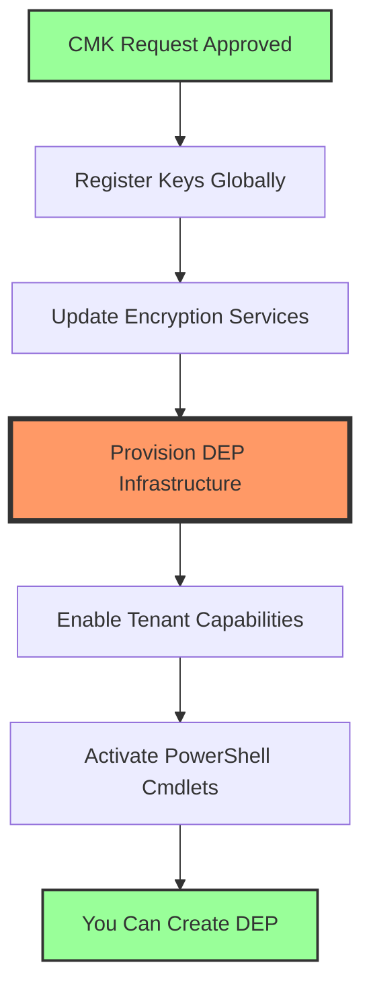

# Azure Customer Managed Keys (CMK) Configuration Guide v4.1

## For OneDrive, SharePoint Online, and Teams - User or Group Deployment

## Canadian Deployment with RBAC Configuration - Azure Cloud Shell & Local PowerShell Support

This guide provides detailed configuration steps for implementing Azure Customer Managed Keys (CMK) for users or groups with E5 and Teams Premium licenses, using Azure Key Vault with RBAC method in Canadian regions. Supports both Azure Cloud Shell and local PowerShell environments.

---

## Table of Contents

1. [Prerequisites](#prerequisites)
2. [PowerShell Environment Setup](#powershell-environment-setup)
3. [Initial Setup and Parameters](#initial-setup-and-parameters)
4. [Environment Authentication](#environment-authentication)
5. [Create Azure Subscriptions](#create-azure-subscriptions)
6. [Register Service Principals](#register-service-principals)
7. [Create Resource Groups](#create-resource-groups)
8. [Create Azure Key Vaults](#create-azure-key-vaults)
9. [Configure RBAC Permissions](#configure-rbac-permissions)
10. [Create Encryption Keys](#create-encryption-keys)
11. [Verify and Get Key URIs](#verify-and-get-key-uris)
12. [Onboard to Customer Key](#onboard-to-customer-key)
13. [Configure SharePoint/OneDrive](#configure-sharepointonedrive)
14. [Apply to Users or Groups](#apply-to-users-or-groups)
15. [VS Code Tips and Best Practices](#vs-code-tips-and-best-practices)
16. [Troubleshooting](#troubleshooting)
17. [Annex: Complete Automated Script](#annex-complete-automated-script)

---

## Prerequisites

### Required Licenses

- Microsoft 365 E5 or Office 365 E5 license (for all target users)
- Microsoft Teams Premium license (for all target users)
- **Two paid Azure subscriptions** (Free/Trial subscriptions are NOT eligible)

### Required Permissions

- Global Administrator or equivalent role in Microsoft 365
- Owner or User Access Administrator role on Azure subscriptions
- Azure PowerShell v4.4.0 or higher

### Critical Requirements

- **Two separate Azure subscriptions are mandatory** - Customer Key will not work with a single subscription
- Both subscriptions must be under the same Azure AD tenant as your Microsoft 365 organization
- All resources will be deployed in **Canada Central** and **Canada East** regions

---

## PowerShell Environment Setup

You can run these scripts in either Azure Cloud Shell (recommended for simplicity) or locally using PowerShell with VS Code.

### Option 1: Using Azure Cloud Shell (Recommended)

1. Navigate to [https://shell.azure.com](https://shell.azure.com)
2. Select **PowerShell** (not Bash)
3. Azure Cloud Shell comes pre-configured with all required modules

### Option 2: Using VS Code with PowerShell

For those preferring to use VS Code instead of Azure Cloud Shell, follow these setup steps:

#### 1. Install Required Software

- Install [Visual Studio Code](https://code.visualstudio.com/)
- Install [PowerShell 7.x](https://docs.microsoft.com/en-us/powershell/scripting/install/installing-powershell)
- Install the PowerShell extension for VS Code

#### 2. Install Azure PowerShell Module

```powershell
# Open PowerShell as Administrator
Install-Module -Name Az -Repository PSGallery -Force -AllowClobber
```

#### 3. Configure VS Code for Azure Development

- Open VS Code
- Install the "Azure Account" extension
- Install the "PowerShell" extension
- Press `Ctrl+Shift+P` and select "PowerShell: Show Session Menu"
- Ensure PowerShell 7.x is selected

#### 4. Verify Installation

```powershell
# In VS Code Terminal (Ctrl+`)
$PSVersionTable.PSVersion
Get-Module -ListAvailable Az*
```

### Option 3: Using Regular PowerShell Console

1. Install PowerShell 7.x from [Microsoft's download page](https://docs.microsoft.com/en-us/powershell/scripting/install/installing-powershell)
2. Run PowerShell as Administrator
3. Install Azure PowerShell module as shown above

```powershell

# ========================================
# Complete CMK Configuration with Variables
# ========================================

# Set all required global variables first
$global:CMKParams = @{
    TenantId = "80b1ce91-e920-49d4-a52e-4ab189c64592"
    PrimarySubscriptionId = "6f114bd7-c8d3-4843-b4f8-e30a644bc412"
    SecondarySubscriptionId = "6fe93f46-fb3b-410b-8d22-540b06cbbfbc"
    PrimaryLocation = "Canada Central"
    SecondaryLocation = "Canada East"
    NamingPrefix = "cmk"
    TargetType = "Group"
    TargetGroupName = "LCE M365 Security"
    TargetGroupId = "ffde4f56-194f-4c76-9916-31375e6d7fe5"
    BackupPath = "$HOME/keybackups"
}

# Set Key Vault names (based on your actual deployment)
$global:KeyVaultNames = @{
    M365Primary = "kv-cmk-m365-pri-4239"
    M365Secondary = "kv-cmk-m365-sec-8250"
    SPOPrimary = "kv-cmk-spo-pri-1117"  # Update if you have SPO vaults
    SPOSecondary = "kv-cmk-spo-sec-1117"  # Update if you have SPO vaults
}

# Set Key URIs
$global:KeyURIs = @{
    M365Primary = "https://kv-cmk-m365-pri-4239.vault.azure.net/keys/m365-cmk-key/758b3fac73fd4573a7d48c2840619326"
    M365Secondary = "https://kv-cmk-m365-sec-8250.vault.azure.net/keys/m365-customer-key-secondary/758b3fac73fd4573a7d48c2840619326"
    SPOPrimary =  "https://kv-cmk-spo-pri-1117.vault.azure.net/keys/spo-cmk-key/8114590cfda44f22b6cc3581dc004bb7"
    SPOSecondary = "https://kv-cmk-spo-sec-1117.vault.azure.net/keys/spo-cmk-key/ec2682182b854c888d5124b2863e2b71"
}

# Set other required variables
$global:ResourceNames = @{
    DEPName = "Leonardo-CMK-DEP"
}

# Now run the summary
Write-Host "`n========================================" -ForegroundColor Cyan
Write-Host "Customer Key Configuration Summary" -ForegroundColor Cyan
Write-Host "========================================" -ForegroundColor Cyan

Write-Host "`nKey Vault Names:" -ForegroundColor Yellow
$global:KeyVaultNames.GetEnumerator() | Sort-Object Name | Format-Table -AutoSize

Write-Host "`nKey URIs:" -ForegroundColor Yellow
$global:KeyURIs.GetEnumerator() | Sort-Object Name | ForEach-Object {
    Write-Host "$($_.Key): $($_.Value)" -ForegroundColor Cyan
}

# Create backup directory if it doesn't exist
if (-not (Test-Path $global:CMKParams.BackupPath)) {
    New-Item -ItemType Directory -Path $global:CMKParams.BackupPath -Force | Out-Null
}

# Save configuration to file
$targetInfo = if ($global:CMKParams.TargetType -eq "User") {
    "TARGET USER: $($global:CMKParams.TargetUserEmail)"
} else {
    "TARGET GROUP: $($global:CMKParams.TargetGroupName)"
}

$configContent = @"
Customer Key Configuration - Generated $(Get-Date)
================================================      
 
TENANT INFORMATION:
Tenant ID: $($global:CMKParams.TenantId)

SUBSCRIPTION IDS:
Primary: $($global:CMKParams.PrimarySubscriptionId)
Secondary: $($global:CMKParams.SecondarySubscriptionId)

KEY VAULT NAMES:
M365 Primary: $($global:KeyVaultNames.M365Primary)
M365 Secondary: $($global:KeyVaultNames.M365Secondary)
SPO Primary: $($global:KeyVaultNames.SPOPrimary)
SPO Secondary: $($global:KeyVaultNames.SPOSecondary)

KEY URIS:
M365 Primary: $($global:KeyURIs.M365Primary)
M365 Secondary: $($global:KeyURIs.M365Secondary)
SPO Primary: $($global:KeyURIs.SPOPrimary)
SPO Secondary: $($global:KeyURIs.SPOSecondary)

DEP POLICY NAME: $($global:ResourceNames.DEPName)

TARGET TYPE: $($global:CMKParams.TargetType)
$targetInfo

STATUS: Waiting for re-encryption to begin (DEP applied)
"@

$configContent | Out-File "$($global:CMKParams.BackupPath)\cmk-configuration.txt"
Write-Host "`nConfiguration saved to: $($global:CMKParams.BackupPath)\cmk-configuration.txt" -ForegroundColor Green

# Also create a quick status check
Write-Host "`n========================================" -ForegroundColor Cyan
Write-Host "Current CMK Implementation Status" -ForegroundColor Cyan
Write-Host "========================================" -ForegroundColor Cyan
Write-Host "✅ Key Vaults: Configured" -ForegroundColor Green
Write-Host "✅ Keys: Created with correct permissions" -ForegroundColor Green
Write-Host "✅ DEP Policy: Created and applied to users" -ForegroundColor Green
Write-Host "⏳ Re-encryption: Waiting (24-48h after DEP)" -ForegroundColor Yellow
Write-Host "📊 Monitor: Check Key Vault logs for WrapKey spike" -ForegroundColor Cyan
```

### Initialize Resource Names

```powershell
# Generate consistent resource names
$global:ResourceNames = @{
    # Resource Groups
    PrimaryRGMultiworkload = "rg-$($global:CMKParams.NamingPrefix)-primary-multiworkload"
    PrimaryRGSharePoint = "rg-$($global:CMKParams.NamingPrefix)-primary-sharepoint"
    SecondaryRGMultiworkload = "rg-$($global:CMKParams.NamingPrefix)-secondary-multiworkload"
    SecondaryRGSharePoint = "rg-$($global:CMKParams.NamingPrefix)-secondary-sharepoint"
    
    # Key Vault Names (will append random numbers for uniqueness)
    KVPrefixM365Primary = "kv-$($global:CMKParams.NamingPrefix)-m365-pri"
    KVPrefixSPOPrimary = "kv-$($global:CMKParams.NamingPrefix)-spo-pri"
    KVPrefixM365Secondary = "kv-$($global:CMKParams.NamingPrefix)-m365-sec"
    KVPrefixSPOSecondary = "kv-$($global:CMKParams.NamingPrefix)-spo-sec"
    
    # Key Names
    M365KeyPrimaryName = "m365-customer-key-primary"
    M365KeySecondaryName = "m365-customer-key-secondary"
    SPOKeyPrimaryName = "spo-customer-key-primary"
    SPOKeySecondaryName = "spo-customer-key-secondary"
    
    # DEP Name
    DEPName = "CMK-DEP-$(Get-Date -Format 'yyyyMMdd')"
}
```

---

## Environment Authentication

### Connect to Azure with Correct Tenant

The authentication method varies based on your environment:

#### For Azure Cloud Shell Users

```powershell
Install-Module -Name Az -Scope CurrentUser -Repository PSGallery -Force
# Clear any existing contexts
Clear-AzContext -Force

# Connect using device authentication (Cloud Shell requirement)
Connect-AzAccount -TenantId $global:CMKParams.TenantId -UseDeviceAuthentication

# Verify connection
$context = Get-AzContext
if ($context.Tenant.Id -ne $global:CMKParams.TenantId) {
    Write-Error "Connected to wrong tenant. Expected: $($global:CMKParams.TenantId), Got: $($context.Tenant.Id)"
    return
}

Write-Host "Successfully connected to tenant: $($context.Tenant.Id)" -ForegroundColor Green
```

#### For VS Code or Local PowerShell Users

```powershell
# Clear any existing contexts
Clear-AzContext -Force

# For VS Code/Local - Interactive authentication (opens browser)
Connect-AzAccount -TenantId $global:CMKParams.TenantId

# Alternative: If browser authentication fails, use device code
# Connect-AzAccount -TenantId $global:CMKParams.TenantId -UseDeviceAuthentication

# Verify connection
$context = Get-AzContext
if ($context.Tenant.Id -ne $global:CMKParams.TenantId) {
    Write-Error "Connected to wrong tenant. Expected: $($global:CMKParams.TenantId), Got: $($context.Tenant.Id)"
    return
}

Write-Host "Successfully connected to tenant: $($context.Tenant.Id)" -ForegroundColor Green
```

### Authentication Methods for Different Scenarios

1. **Interactive Browser Authentication** (Recommended for local sessions):

   ```powershell
   Connect-AzAccount -TenantId "YOUR-TENANT-ID"
   ```

2. **Device Code Authentication** (for restricted environments):

   ```powershell
   Connect-AzAccount -TenantId "YOUR-TENANT-ID" -UseDeviceAuthentication
   ```

3. **Service Principal Authentication** (for automation):

   ```powershell
   $credential = Get-Credential
   Connect-AzAccount -ServicePrincipal -Credential $credential -TenantId "YOUR-TENANT-ID"
   ```

### Troubleshooting Authentication Issues

If you encounter authentication issues:

1. **Clear cached credentials**:

   ```powershell
   Disconnect-AzAccount
   Clear-AzContext -Force
   ```

2. **Check proxy settings** (if behind corporate firewall):

   ```powershell
   [System.Net.WebRequest]::DefaultWebProxy.Credentials = [System.Net.CredentialCache]::DefaultCredentials
   ```

3. **Use alternative authentication**:

   ```powershell
   # Try device code authentication
   Connect-AzAccount -TenantId $global:CMKParams.TenantId -UseDeviceAuthentication
   ```

---

## Create Azure Subscriptions

### Verify Two Subscriptions Exist

```powershell
# Get subscriptions in the tenant
$subscriptions = Get-AzSubscription | Where-Object State -eq "Enabled"

# Verify primary subscription exists
$primarySub = $subscriptions | Where-Object Id -eq $global:CMKParams.PrimarySubscriptionId
if (-not $primarySub) {
    Write-Error "Primary subscription not found: $($global:CMKParams.PrimarySubscriptionId)"
    Write-Host "Available subscriptions:" -ForegroundColor Yellow
    $subscriptions | Select-Object Name, Id | Format-Table
    return
}

# Verify secondary subscription exists
$secondarySub = $subscriptions | Where-Object Id -eq $global:CMKParams.SecondarySubscriptionId
if (-not $secondarySub) {
    Write-Error "Secondary subscription not found: $($global:CMKParams.SecondarySubscriptionId)"
    Write-Host "Available subscriptions:" -ForegroundColor Yellow
    $subscriptions | Select-Object Name, Id | Format-Table
    return
}

# Verify they are different
if ($global:CMKParams.PrimarySubscriptionId -eq $global:CMKParams.SecondarySubscriptionId) {
    Write-Error "Primary and Secondary subscription IDs must be different!"
    return
}

Write-Host "Subscription verification passed:" -ForegroundColor Green
Write-Host "  Primary: $($primarySub.Name) ($($primarySub.Id))" -ForegroundColor Cyan
Write-Host "  Secondary: $($secondarySub.Name) ($($secondarySub.Id))" -ForegroundColor Cyan
```

---

## Register Service Principals

### Function to Register Service Principals

```powershell
function Register-CMKServicePrincipal {
    param (
        [string]$ApplicationId,
        [string]$DisplayName
    )
    
    $sp = Get-AzADServicePrincipal -ApplicationId $ApplicationId -ErrorAction SilentlyContinue
    if (-not $sp) {
        Write-Host "Registering $DisplayName..." -ForegroundColor Yellow
        New-AzADServicePrincipal -ApplicationId $ApplicationId | Out-Null
        Write-Host "✓ $DisplayName registered successfully" -ForegroundColor Green
    } else {
        Write-Host "✓ $DisplayName already registered" -ForegroundColor Green
    }
}
```

### Register Required Applications

```powershell
# Service principal registration is tenant-wide, only needs to be done once
Write-Host "`nRegistering required service principals..." -ForegroundColor Cyan

# Customer Key Onboarding Application
Register-CMKServicePrincipal -ApplicationId "19f7f505-34aa-44a4-9dcc-6a768854d2ea" -DisplayName "Customer Key Onboarding"

# M365DataAtRestEncryption Application
Register-CMKServicePrincipal -ApplicationId "c066d759-24ae-40e7-a56f-027002b5d3e4" -DisplayName "M365DataAtRestEncryption"

# Office 365 SharePoint Online Application
Register-CMKServicePrincipal -ApplicationId "00000003-0000-0ff1-ce00-000000000000" -DisplayName "Office 365 SharePoint Online"
```

---

## Create Resource Groups

### Create Primary Resource Groups

```powershell
Write-Host "`nCreating resource groups..." -ForegroundColor Cyan

# Select primary subscription
Select-AzSubscription -SubscriptionId $global:CMKParams.PrimarySubscriptionId | Out-Null

# Create primary resource groups
New-AzResourceGroup -Name $global:ResourceNames.PrimaryRGMultiworkload -Location $global:CMKParams.PrimaryLocation -Force | Out-Null
Write-Host "✓ Created: $($global:ResourceNames.PrimaryRGMultiworkload) in $($global:CMKParams.PrimaryLocation)" -ForegroundColor Green

New-AzResourceGroup -Name $global:ResourceNames.PrimaryRGSharePoint -Location $global:CMKParams.PrimaryLocation -Force | Out-Null
Write-Host "✓ Created: $($global:ResourceNames.PrimaryRGSharePoint) in $($global:CMKParams.PrimaryLocation)" -ForegroundColor Green
```

### Create Secondary Resource Groups

```powershell
# Select secondary subscription
Select-AzSubscription -SubscriptionId $global:CMKParams.SecondarySubscriptionId | Out-Null

# Create secondary resource groups
New-AzResourceGroup -Name $global:ResourceNames.SecondaryRGMultiworkload -Location $global:CMKParams.SecondaryLocation -Force | Out-Null
Write-Host "✓ Created: $($global:ResourceNames.SecondaryRGMultiworkload) in $($global:CMKParams.SecondaryLocation)" -ForegroundColor Green

New-AzResourceGroup -Name $global:ResourceNames.SecondaryRGSharePoint -Location $global:CMKParams.SecondaryLocation -Force | Out-Null
Write-Host "✓ Created: $($global:ResourceNames.SecondaryRGSharePoint) in $($global:CMKParams.SecondaryLocation)" -ForegroundColor Green
```

---

## Create Azure Key Vaults

### Initialize Key Vault Names Storage

```powershell
$global:KeyVaultNames = @{}
```

### Create Primary Key Vaults

```powershell
Write-Host "`nCreating Key Vaults..." -ForegroundColor Cyan

# Select primary subscription
Select-AzSubscription -SubscriptionId $global:CMKParams.PrimarySubscriptionId | Out-Null

# Create Key Vault for Multiple Workloads
$kvNameM365Primary = "$($global:ResourceNames.KVPrefixM365Primary)-$(Get-Random -Maximum 9999)"
$kvM365Primary = New-AzKeyVault `
    -Name $kvNameM365Primary `
    -ResourceGroupName $global:ResourceNames.PrimaryRGMultiworkload `
    -Location $global:CMKParams.PrimaryLocation `
    -SKU Premium `
    -EnablePurgeProtection `
    -SoftDeleteRetentionInDays 90

$global:KeyVaultNames.M365Primary = $kvNameM365Primary
Write-Host "✓ Created Key Vault: $kvNameM365Primary" -ForegroundColor Green

# Create Key Vault for SharePoint/OneDrive
$kvNameSPOPrimary = "$($global:ResourceNames.KVPrefixSPOPrimary)-$(Get-Random -Maximum 9999)"
$kvSPOPrimary = New-AzKeyVault `
    -Name $kvNameSPOPrimary `
    -ResourceGroupName $global:ResourceNames.PrimaryRGSharePoint `
    -Location $global:CMKParams.PrimaryLocation `
    -SKU Premium `
    -EnablePurgeProtection `
    -SoftDeleteRetentionInDays 90

$global:KeyVaultNames.SPOPrimary = $kvNameSPOPrimary
Write-Host "✓ Created Key Vault: $kvNameSPOPrimary" -ForegroundColor Green
```

### Create Secondary Key Vaults

```powershell
# Select secondary subscription
Select-AzSubscription -SubscriptionId $global:CMKParams.SecondarySubscriptionId | Out-Null

# Create Key Vault for Multiple Workloads
$kvNameM365Secondary = "$($global:ResourceNames.KVPrefixM365Secondary)-$(Get-Random -Maximum 9999)"
$kvM365Secondary = New-AzKeyVault `
    -Name $kvNameM365Secondary `
    -ResourceGroupName $global:ResourceNames.SecondaryRGMultiworkload `
    -Location $global:CMKParams.SecondaryLocation `
    -SKU Premium `
    -EnablePurgeProtection `
    -SoftDeleteRetentionInDays 90

$global:KeyVaultNames.M365Secondary = $kvNameM365Secondary
Write-Host "✓ Created Key Vault: $kvNameM365Secondary" -ForegroundColor Green

# Create Key Vault for SharePoint/OneDrive
$kvNameSPOSecondary = "$($global:ResourceNames.KVPrefixSPOSecondary)-$(Get-Random -Maximum 9999)"
$kvSPOSecondary = New-AzKeyVault `
    -Name $kvNameSPOSecondary `
    -ResourceGroupName $global:ResourceNames.SecondaryRGSharePoint `
    -Location $global:CMKParams.SecondaryLocation `
    -SKU Premium `
    -EnablePurgeProtection `
    -SoftDeleteRetentionInDays 90

$global:KeyVaultNames.SPOSecondary = $kvNameSPOSecondary
Write-Host "✓ Created Key Vault: $kvNameSPOSecondary" -ForegroundColor Green
```

**Note**: Vault names must be globally unique, so we append random numbers.

---

## Configure RBAC Permissions

### Get Current User Identity

```powershell
Write-Host "`nConfiguring RBAC permissions..." -ForegroundColor Cyan

$currentUser = Get-AzADUser -UserPrincipalName (Get-AzContext).Account.Id
$userId = $currentUser.Id
Write-Host "Current user: $($currentUser.UserPrincipalName)" -ForegroundColor Yellow
```

### Assign Key Vault Administrator Role

```powershell
# Function to assign Key Vault Administrator role
function Set-KeyVaultAdminRole {
    param (
        [string]$SubscriptionId,
        [string]$ResourceGroup,
        [string]$VaultName,
        [string]$ObjectId
    )
    
    Select-AzSubscription -SubscriptionId $SubscriptionId | Out-Null
    
    $scope = "/subscriptions/$SubscriptionId/resourceGroups/$ResourceGroup/providers/Microsoft.KeyVault/vaults/$VaultName"
    
    New-AzRoleAssignment `
        -ObjectId $ObjectId `
        -RoleDefinitionName "Key Vault Administrator" `
        -Scope $scope `
        -ErrorAction SilentlyContinue | Out-Null
        
    Write-Host "✓ Key Vault Administrator role assigned on: $VaultName" -ForegroundColor Green
}

# Assign to all vaults
Set-KeyVaultAdminRole -SubscriptionId $global:CMKParams.PrimarySubscriptionId -ResourceGroup $global:ResourceNames.PrimaryRGMultiworkload -VaultName $global:KeyVaultNames.M365Primary -ObjectId $userId
Set-KeyVaultAdminRole -SubscriptionId $global:CMKParams.PrimarySubscriptionId -ResourceGroup $global:ResourceNames.PrimaryRGSharePoint -VaultName $global:KeyVaultNames.SPOPrimary -ObjectId $userId
Set-KeyVaultAdminRole -SubscriptionId $global:CMKParams.SecondarySubscriptionId -ResourceGroup $global:ResourceNames.SecondaryRGMultiworkload -VaultName $global:KeyVaultNames.M365Secondary -ObjectId $userId
Set-KeyVaultAdminRole -SubscriptionId $global:CMKParams.SecondarySubscriptionId -ResourceGroup $global:ResourceNames.SecondaryRGSharePoint -VaultName $global:KeyVaultNames.SPOSecondary -ObjectId $userId

Write-Host "Waiting 60 seconds for role assignments to propagate..." -ForegroundColor Yellow
Start-Sleep -Seconds 60
```

### Assign Service Principal Permissions

```powershell
# Function to assign Crypto Service Encryption User role
function Set-CryptoServiceRole {
    param (
        [string]$SubscriptionId,
        [string]$ResourceGroup,
        [string]$VaultName,
        [string]$ServicePrincipalName
    )
    
    Select-AzSubscription -SubscriptionId $SubscriptionId | Out-Null
    
    $sp = Get-AzADServicePrincipal -DisplayName $ServicePrincipalName
    if ($sp) {
        $scope = "/subscriptions/$SubscriptionId/resourceGroups/$ResourceGroup/providers/Microsoft.KeyVault/vaults/$VaultName"
        
        New-AzRoleAssignment `
            -ObjectId $sp.Id `
            -RoleDefinitionName "Key Vault Crypto Service Encryption User" `
            -Scope $scope `
            -ErrorAction SilentlyContinue | Out-Null
            
        Write-Host "✓ Crypto Service Encryption User role assigned to $ServicePrincipalName on: $VaultName" -ForegroundColor Green
    }
}

# Assign M365DataAtRestEncryption permissions
Set-CryptoServiceRole -SubscriptionId $global:CMKParams.PrimarySubscriptionId -ResourceGroup $global:ResourceNames.PrimaryRGMultiworkload -VaultName $global:KeyVaultNames.M365Primary -ServicePrincipalName "M365DataAtRestEncryption"
Set-CryptoServiceRole -SubscriptionId $global:CMKParams.SecondarySubscriptionId -ResourceGroup $global:ResourceNames.SecondaryRGMultiworkload -VaultName $global:KeyVaultNames.M365Secondary -ServicePrincipalName "M365DataAtRestEncryption"

# Assign Office 365 SharePoint Online permissions
Set-CryptoServiceRole -SubscriptionId $global:CMKParams.PrimarySubscriptionId -ResourceGroup $global:ResourceNames.PrimaryRGSharePoint -VaultName $global:KeyVaultNames.SPOPrimary -ServicePrincipalName "Office 365 SharePoint Online"
Set-CryptoServiceRole -SubscriptionId $global:CMKParams.SecondarySubscriptionId -ResourceGroup $global:ResourceNames.SecondaryRGSharePoint -VaultName $global:KeyVaultNames.SPOSecondary -ServicePrincipalName "Office 365 SharePoint Online"
```

---

## Create Encryption Keys

### Initialize Key URIs Storage

```powershell
$global:KeyURIs = @{}
```

### Create Primary Keys

```powershell
Write-Host "`nCreating encryption keys..." -ForegroundColor Cyan

# Select primary subscription
Select-AzSubscription -SubscriptionId $global:CMKParams.PrimarySubscriptionId | Out-Null

# Create M365 primary key
$m365KeyPrimary = Add-AzKeyVaultKey `
    -VaultName $global:KeyVaultNames.M365Primary `
    -Name $global:ResourceNames.M365KeyPrimaryName `
    -Destination "Software" `
    -KeyType RSA `
    -Size 2048 `
    -KeyOps wrapKey,unwrapKey `
    -NotBefore (Get-Date)

$global:KeyURIs.M365Primary = $m365KeyPrimary.Id.ToString()
Write-Host "✓ Created M365 primary key" -ForegroundColor Green

# Backup the key
Backup-AzKeyVaultKey `
    -VaultName $global:KeyVaultNames.M365Primary `
    -Name $global:ResourceNames.M365KeyPrimaryName `
    -OutputFile "$($global:CMKParams.BackupPath)/m365-key-primary-backup.blob" `
    -Force

# Create SPO primary key
$spoKeyPrimary = Add-AzKeyVaultKey `
    -VaultName $global:KeyVaultNames.SPOPrimary `
    -Name $global:ResourceNames.SPOKeyPrimaryName `
    -Destination "Software" `
    -KeyType RSA `
    -Size 2048 `
    -KeyOps wrapKey,unwrapKey `
    -NotBefore (Get-Date)

$global:KeyURIs.SPOPrimary = $spoKeyPrimary.Id.ToString()
Write-Host "✓ Created SPO primary key" -ForegroundColor Green

# Backup the key
Backup-AzKeyVaultKey `
    -VaultName $global:KeyVaultNames.SPOPrimary `
    -Name $global:ResourceNames.SPOKeyPrimaryName `
    -OutputFile "$($global:CMKParams.BackupPath)/spo-key-primary-backup.blob" `
    -Force
```

### Create Secondary Keys

```powershell
# Select secondary subscription
Select-AzSubscription -SubscriptionId $global:CMKParams.SecondarySubscriptionId | Out-Null

# Create M365 secondary key
$m365KeySecondary = Add-AzKeyVaultKey `
    -VaultName $global:KeyVaultNames.M365Secondary `
    -Name $global:ResourceNames.M365KeySecondaryName `
    -Destination "Software" `
    -KeyType RSA `
    -Size 2048 `
    -KeyOps wrapKey,unwrapKey `
    -NotBefore (Get-Date)

$global:KeyURIs.M365Secondary = $m365KeySecondary.Id.ToString()
Write-Host "✓ Created M365 secondary key" -ForegroundColor Green

# Backup the key
Backup-AzKeyVaultKey `
    -VaultName $global:KeyVaultNames.M365Secondary `
    -Name $global:ResourceNames.M365KeySecondaryName `
    -OutputFile "$($global:CMKParams.BackupPath)/m365-key-secondary-backup.blob" `
    -Force

# Create SPO secondary key
$spoKeySecondary = Add-AzKeyVaultKey `
    -VaultName $global:KeyVaultNames.SPOSecondary `
    -Name $global:ResourceNames.SPOKeySecondaryName `
    -Destination "Software" `
    -KeyType RSA `
    -Size 2048 `
    -KeyOps wrapKey,unwrapKey `
    -NotBefore (Get-Date)

$global:KeyURIs.SPOSecondary = $spoKeySecondary.Id.ToString()
Write-Host "✓ Created SPO secondary key" -ForegroundColor Green

# Backup the key
Backup-AzKeyVaultKey `
    -VaultName $global:KeyVaultNames.SPOSecondary `
    -Name $global:ResourceNames.SPOKeySecondaryName `
    -OutputFile "$($global:CMKParams.BackupPath)/spo-key-secondary-backup.blob" `
    -Force
```

**Important**: If you need to use Software keys instead of HSM, change `-Destination "Software"` to `-Destination "Software"`.

---

## Verify and Get Key URIs

### Display Configuration Summary

```powershell
Write-Host "`n========================================" -ForegroundColor Cyan
Write-Host "Customer Key Configuration Summary" -ForegroundColor Cyan
Write-Host "========================================" -ForegroundColor Cyan

Write-Host "`nKey Vault Names:" -ForegroundColor Yellow
$global:KeyVaultNames.GetEnumerator() | Sort-Object Name | Format-Table -AutoSize

Write-Host "`nKey URIs:" -ForegroundColor Yellow
$global:KeyURIs.GetEnumerator() | Sort-Object Name | ForEach-Object {
    Write-Host "$($_.Key): $($_.Value)" -ForegroundColor Cyan
}

# Save configuration to file
$targetInfo = if ($global:CMKParams.TargetType -eq "User") {
    "TARGET USER: $($global:CMKParams.TargetUserEmail)"
} else {
    "TARGET GROUP: $($global:CMKParams.TargetGroupName)"
}

$configContent = @"
Customer Key Configuration - Generated $(Get-Date)
================================================

TENANT INFORMATION:
Tenant ID: $($global:CMKParams.TenantId)

SUBSCRIPTION IDS:
Primary: $($global:CMKParams.PrimarySubscriptionId)
Secondary: $($global:CMKParams.SecondarySubscriptionId)

KEY VAULT NAMES:
M365 Primary: $($global:KeyVaultNames.M365Primary)
M365 Secondary: $($global:KeyVaultNames.M365Secondary)
SPO Primary: $($global:KeyVaultNames.SPOPrimary)
SPO Secondary: $($global:KeyVaultNames.SPOSecondary)

KEY URIS:
M365 Primary: $($global:KeyURIs.M365Primary)
M365 Secondary: $($global:KeyURIs.M365Secondary)
SPO Primary: $($global:KeyURIs.SPOPrimary)
SPO Secondary: $($global:KeyURIs.SPOSecondary)

TARGET TYPE: $($global:CMKParams.TargetType)
$targetInfo
"@

$configContent | Out-File "$($global:CMKParams.BackupPath)/cmk-configuration.txt"
Write-Host "`nConfiguration saved to: $($global:CMKParams.BackupPath)/cmk-configuration.txt" -ForegroundColor Green
```

---

## Onboard to Customer Key

### Install Onboarding Module

```powershell
Write-Host "`nInstalling Customer Key Onboarding module..." -ForegroundColor Cyan

if (-not (Get-Module -ListAvailable -Name M365CustomerKeyOnboarding)) {
    Install-Module -Name M365CustomerKeyOnboarding -Force -AllowClobber -Scope CurrentUser
}

Import-Module M365CustomerKeyOnboarding
Write-Host "✓ Module loaded successfully" -ForegroundColor Green
```

### Grant Reader Access for Validation

```powershell
# Grant Reader role on both subscriptions
Select-AzSubscription -SubscriptionId $global:CMKParams.PrimarySubscriptionId | Out-Null
New-AzRoleAssignment -ObjectId $userId -RoleDefinitionName "Reader" -Scope "/subscriptions/$($global:CMKParams.PrimarySubscriptionId)" -ErrorAction SilentlyContinue | Out-Null

Select-AzSubscription -SubscriptionId $global:CMKParams.SecondarySubscriptionId | Out-Null
New-AzRoleAssignment -ObjectId $userId -RoleDefinitionName "Reader" -Scope "/subscriptions/$($global:CMKParams.SecondarySubscriptionId)" -ErrorAction SilentlyContinue | Out-Null

Write-Host "✓ Reader access granted for validation" -ForegroundColor Green
Start-Sleep -Seconds 30
```

### Check if the M365 Data at Rest Encryption service principal exists

```powershell
Write-Host "Checking for Microsoft service principals..." -ForegroundColor Cyan
 
$m365SP = Get-AzADServicePrincipal -DisplayName "M365DataAtRestEncryption" -ErrorAction SilentlyContinue
if ($m365SP) {
    Write-Host "✓ Found M365DataAtRestEncryption SP: $($m365SP.Id)" -ForegroundColor Green
} else {
    # Try alternative names
    $m365SP = Get-AzADServicePrincipal -DisplayName "Microsoft 365 Data at Rest Encryption" -ErrorAction SilentlyContinue
    if ($m365SP) {
        Write-Host "✓ Found Microsoft 365 Data at Rest Encryption SP: $($m365SP.Id)" -ForegroundColor Green
    } else {
        Write-Host "✗ M365 Data at Rest Encryption service principal not found" -ForegroundColor Red
    }
}
 
# For SharePoint (if needed)
$spoSP = Get-AzADServicePrincipal -DisplayName "Office 365 SharePoint Online" -ErrorAction SilentlyContinue
if ($spoSP) {
    Write-Host "✓ Found SharePoint Online SP: $($spoSP.Id)" -ForegroundColor Green
}
```

### Verify Key Vault settings

```powershell
Write-Host "`nVerifying Key Vault configurations..." -ForegroundColor Cyan
 
function Test-KeyVaultConfig {
    param (
        [string]$SubscriptionId,
        [string]$VaultName,
        [string]$KeyName
    )
    Select-AzSubscription -SubscriptionId $SubscriptionId | Out-Null
    Write-Host "`nChecking $VaultName..." -ForegroundColor Yellow
    # Get vault
    $vault = Get-AzKeyVault -VaultName $VaultName
    Write-Host "  RBAC Enabled: $($vault.EnableRbacAuthorization)"
    Write-Host "  Soft Delete: $($vault.EnableSoftDelete)"
    Write-Host "  Purge Protection: $($vault.EnablePurgeProtection)"
    # Get key
    try {
        $key = Get-AzKeyVaultKey -VaultName $VaultName -Name $KeyName
        Write-Host "  Key Found: ✓"
        Write-Host "  Key Enabled: $($key.Enabled)"
        Write-Host "  Key Expires: $($key.Expires)"
        Write-Host "  Key Operations: $($key.Key.KeyOps -join ', ')"
    } catch {
        Write-Host "  Key Found: ✗" -ForegroundColor Red
    }
    # Test both vaults
    Test-KeyVaultConfig `
        -SubscriptionId $global:CMKParams.PrimarySubscriptionId `
        -VaultName $global:KeyVaultNames.M365Primary `
        -KeyName $global:ResourceNames.M365KeyPrimaryName
    
    Test-KeyVaultConfig `
        -SubscriptionId $global:CMKParams.SecondarySubscriptionId `
        -VaultName $global:KeyVaultNames.M365Secondary `
        -KeyName $global:ResourceNames.M365KeySecondaryName
    }

```

### Validate Configuration

```powershell
Write-Host "`nValidating Customer Key configuration..." -ForegroundColor Cyan

$validationRequest = New-CustomerKeyOnboardingRequest `
    -Organization $global:CMKParams.TenantId `
    -Scenario MDEP `
    -Subscription1 $global:CMKParams.PrimarySubscriptionId `
    -KeyIdentifier1 $global:KeyURIs.M365Primary `
    -Subscription2 $global:CMKParams.SecondarySubscriptionId `
    -KeyIdentifier2 $global:KeyURIs.M365Secondary `
    -OnboardingMode Validate

if ($validationRequest.ValidationResult -eq "Success") {
    Write-Host "✓ Validation passed successfully!" -ForegroundColor Green
} else {
    Write-Host "✗ Validation failed!" -ForegroundColor Red
    $validationRequest.FailedValidations | Format-Table -AutoSize
}

Write-Host "`nWaiting 5 minutes for permissions to propagate..." -ForegroundColor Yellow
Write-Host "This is required for Azure to sync the service principal permissions." -ForegroundColor Yellow
Start-Sleep -Seconds 300
 
# Retry validation
Write-Host "`nRetrying Customer Key validation..." -ForegroundColor Cyan
 
$validationRequest = New-CustomerKeyOnboardingRequest `
    -Organization $global:CMKParams.TenantId `
    -Scenario MDEP `
    -Subscription1 $global:CMKParams.PrimarySubscriptionId `
    -KeyIdentifier1 $global:KeyURIs.M365Primary `
    -Subscription2 $global:CMKParams.SecondarySubscriptionId `
    -KeyIdentifier2 $global:KeyURIs.M365Secondary `
    -OnboardingMode Validate
 
if ($validationRequest.ValidationResult -eq "Success") {
    Write-Host "✓ Validation passed successfully!" -ForegroundColor Green
    Write-Host "`nValidation Details:" -ForegroundColor Cyan
    $validationRequest | Format-List
} else {
    Write-Host "✗ Validation still failing!" -ForegroundColor Red
    $validationRequest.FailedValidations | Format-Table -AutoSize
    # Additional troubleshooting info
    Write-Host "`nTroubleshooting suggestions:" -ForegroundColor Yellow
    Write-Host "1. Ensure both Key Vaults have Purge Protection enabled"
    Write-Host "2. Verify the service principal has been created in your tenant"
    Write-Host "3. Check if your Key Vaults are in the correct regions"
    Write-Host "4. Ensure keys have 'wrapKey' and 'unwrapKey' operations enabled"
}
```

### Enable Customer Key

```powershell
if ($validationRequest.ValidationResult -eq "Success") {
    Write-Host "`nEnabling Customer Key..." -ForegroundColor Cyan
    
    $enableRequest = New-CustomerKeyOnboardingRequest `
        -Organization $global:CMKParams.TenantId `
        -Scenario MDEP `
        -Subscription1 $global:CMKParams.PrimarySubscriptionId `
        -KeyIdentifier1 $global:KeyURIs.M365Primary `
        -Subscription2 $global:CMKParams.SecondarySubscriptionId `
        -KeyIdentifier2 $global:KeyURIs.M365Secondary `
        -OnboardingMode Enable
    
    if ($enableRequest.EnablementResult -eq "Success") {
        Write-Host "✓ Customer Key successfully enabled for Multiple Workloads!" -ForegroundColor Green
    } else {
        Write-Host "✗ Enablement failed!" -ForegroundColor Red
    }
}
```

---

## Configure SharePoint/OneDrive

### MRP Enablement Notice

```powershell
Write-Host "`n========================================" -ForegroundColor Yellow
Write-Host "SharePoint/OneDrive Configuration" -ForegroundColor Yellow
Write-Host "========================================" -ForegroundColor Yellow
Write-Host @"
To enable Customer Key for SharePoint and OneDrive:

1. Contact Microsoft Support
2. Request: "Enable Mandatory Retention Period (MRP) for Customer Key SharePoint onboarding"
3. Provide these subscription IDs:
   - Primary: $($global:CMKParams.PrimarySubscriptionId)
   - Secondary: $($global:CMKParams.SecondarySubscriptionId)
4. Wait 3-6 business days for completion

After MRP is enabled, run the following commands:
"@ -ForegroundColor Cyan

Write-Host @"
`n# Register resource providers after MRP is enabled:
Select-AzSubscription -SubscriptionId "$($global:CMKParams.PrimarySubscriptionId)"
Register-AzResourceProvider -ProviderNamespace "Microsoft.Resources"
Register-AzResourceProvider -ProviderNamespace "Microsoft.KeyVault"

Select-AzSubscription -SubscriptionId "$($global:CMKParams.SecondarySubscriptionId)"
Register-AzResourceProvider -ProviderNamespace "Microsoft.Resources"
Register-AzResourceProvider -ProviderNamespace "Microsoft.KeyVault"
"@ -ForegroundColor White
```

---

## Apply to Users or Groups

### Exchange Online Configuration(new)

```powershell
# ========================================
# Customer Key - Data Encryption Policy Setup
# ========================================
 
Write-Host "`n========================================" -ForegroundColor Cyan
Write-Host "Customer Key - Data Encryption Policy Setup" -ForegroundColor Cyan
Write-Host "========================================" -ForegroundColor Cyan
 
# Step 1: Check PowerShell version
Write-Host "`nChecking PowerShell version..." -ForegroundColor Yellow
$psVersion = $PSVersionTable.PSVersion
Write-Host "PowerShell version: $($psVersion.Major).$($psVersion.Minor)" -ForegroundColor Gray
if ($psVersion.Major -lt 5) {
    Write-Host "⚠ PowerShell 5.1 or later is required for Exchange Online module" -ForegroundColor Red
    return
}
 
# Step 2: Set TLS 1.2
[Net.ServicePointManager]::SecurityProtocol = [Net.SecurityProtocolType]::Tls12
 
# Step 3: Check if module is already installed
Write-Host "`nChecking for Exchange Online Management module..." -ForegroundColor Yellow
$exoModule = Get-Module -ListAvailable -Name ExchangeOnlineManagement
 
if (-not $exoModule) {
    Write-Host "Exchange Online module not found. Installing..." -ForegroundColor Yellow
    try {
        # Trust PSGallery
        Set-PSRepository -Name PSGallery -InstallationPolicy Trusted -ErrorAction SilentlyContinue
        # Install module
        Install-Module -Name ExchangeOnlineManagement `
            -Repository PSGallery `
            -Scope CurrentUser `
            -Force `
            -AllowClobber `
            -MinimumVersion 3.0.0 `
            -ErrorAction Stop
        Write-Host "✓ Module installed successfully" -ForegroundColor Green
    } catch {
        Write-Host "✗ Failed to install module: $($_.Exception.Message)" -ForegroundColor Red
        Write-Host "`nPlease run this command in a new PowerShell window:" -ForegroundColor Yellow
        Write-Host "Install-Module -Name ExchangeOnlineManagement -Scope CurrentUser -Force" -ForegroundColor Cyan
        return
    }
}
 
# Step 4: Import the module
Write-Host "`nImporting Exchange Online module..." -ForegroundColor Yellow
try {
    Import-Module ExchangeOnlineManagement -Force -ErrorAction Stop
    Write-Host "✓ Module imported successfully" -ForegroundColor Green
} catch {
    Write-Host "✗ Failed to import module: $($_.Exception.Message)" -ForegroundColor Red
    return
}
 
# Step 5: Connect to Exchange Online
Write-Host "`nConnecting to Exchange Online..." -ForegroundColor Yellow
Write-Host "Please sign in with your Exchange admin account" -ForegroundColor Cyan
try {
    Connect-ExchangeOnline -ShowBanner:$false
    Write-Host "✓ Connected to Exchange Online" -ForegroundColor Green
} catch {
    Write-Host "✗ Failed to connect: $($_.Exception.Message)" -ForegroundColor Red
    return
}
 
# Step 6: Define DEP parameters (update these if needed)
$depName = "CMK-DEP-EC-2025"
$depDescription = "Elections Canada Customer Key Data Encryption Policy"
 
# Use your actual key URIs - these should be set from your global variables
$keyUri1 = $global:KeyURIs.M365Primary
$keyUri2 = $global:KeyURIs.M365Secondary
 
# If global variables are not set, use these (update with your actual URIs)
if (-not $keyUri1) {
    $keyUri1 = "https://kv-cmk-m365-pri-4239.vault.azure.net/keys/m365-customer-key-primary/2cd0cae2a2f84cb29bd6442b07649415"
}
if (-not $keyUri2) {
    $keyUri2 = "https://kv-cmk-m365-sec-8250.vault.azure.net/keys/m365-customer-key-secondary/758b3fac73fd4573a7d48c2840619326"
}
 
Write-Host "`nDEP Configuration:" -ForegroundColor Cyan
Write-Host "  Name: $depName"
Write-Host "  Primary Key: $keyUri1"
Write-Host "  Secondary Key: $keyUri2"
 
# Step 7: Create Data Encryption Policy
Write-Host "`nCreating Data Encryption Policy..." -ForegroundColor Yellow
try {
    $dep = New-DataEncryptionPolicy `
        -Name $depName `
        -Description $depDescription `
        -AzureKeyIDs @($keyUri1, $keyUri2) `
        -ErrorAction Stop
    Write-Host "✓ Data Encryption Policy created successfully!" -ForegroundColor Green
    $dep | Format-List Name, Description, Enabled
} catch {
    if ($_.Exception.Message -like "*already exists*") {
        Write-Host "DEP already exists. Retrieving existing policy..." -ForegroundColor Yellow
        $dep = Get-DataEncryptionPolicy -Identity $depName
        Write-Host "✓ Retrieved existing DEP" -ForegroundColor Green
    } else {
        Write-Host "✗ Failed to create DEP: $($_.Exception.Message)" -ForegroundColor Red
        Disconnect-ExchangeOnline -Confirm:$false
        return
    }
}
 
# Step 8: Apply DEP to users
Write-Host "`nChoose how to apply the DEP:" -ForegroundColor Yellow
Write-Host "1. Apply to specific user(s)"
Write-Host "2. Apply to all users in the organization"
Write-Host "3. Apply to specific group members"
Write-Host "4. Skip application (DEP created but not applied)"
 
$choice = Read-Host "`nEnter your choice (1-4)"
 
switch ($choice) {
    "1" {
        # Apply to specific users
        $userEmail = Read-Host "Enter user email address"
        try {
            Set-Mailbox -Identity $userEmail -DataEncryptionPolicy $depName -ErrorAction Stop
            Write-Host "✓ DEP applied to $userEmail" -ForegroundColor Green
        } catch {
            Write-Host "✗ Failed to apply DEP: $($_.Exception.Message)" -ForegroundColor Red
        }
    }
    "2" {
        # Apply to all users
        Write-Host "Applying DEP to all users (this may take several minutes)..." -ForegroundColor Yellow
        $confirm = Read-Host "Are you sure you want to apply to ALL users? (yes/no)"
        if ($confirm -eq "yes") {
            try {
                $mailboxes = Get-Mailbox -ResultSize Unlimited
                $count = 0
                foreach ($mailbox in $mailboxes) {
                    Set-Mailbox -Identity $mailbox.Identity -DataEncryptionPolicy $depName
                    $count++
                    if ($count % 10 -eq 0) {
                        Write-Host "  Processed $count mailboxes..." -ForegroundColor Gray
                    }
                }
                Write-Host "✓ DEP applied to $count users" -ForegroundColor Green
            } catch {
                Write-Host "✗ Error: $($_.Exception.Message)" -ForegroundColor Red
            }
        }
    }
    "3" {
        # Apply to group members
        $groupName = Read-Host "Enter distribution group name or email"
        try {
            $members = Get-DistributionGroupMember -Identity $groupName
            foreach ($member in $members) {
                if ($member.RecipientType -like "*Mailbox") {
                    Set-Mailbox -Identity $member.Identity -DataEncryptionPolicy $depName
                }
            }
            Write-Host "✓ DEP applied to group members" -ForegroundColor Green
        } catch {
            Write-Host "✗ Failed: $($_.Exception.Message)" -ForegroundColor Red
        }
    }
    "4" {
        Write-Host "DEP created but not applied to any users." -ForegroundColor Yellow
    }
}
 
# Step 9: Verify DEP status
Write-Host "`nVerifying DEP status..." -ForegroundColor Yellow
$depStatus = Get-DataEncryptionPolicy -Identity $depName
Write-Host "DEP Name: $($depStatus.Name)" -ForegroundColor Green
Write-Host "Enabled: $($depStatus.Enabled)" -ForegroundColor Green
Write-Host "Azure Key Count: $($depStatus.AzureKeyIDs.Count)" -ForegroundColor Green
 
# Step 10: Disconnect
Write-Host "`nDisconnecting from Exchange Online..." -ForegroundColor Yellow
Disconnect-ExchangeOnline -Confirm:$false
 
Write-Host "`n========================================" -ForegroundColor Green
Write-Host "✓ Data Encryption Policy setup complete!" -ForegroundColor Green
Write-Host "========================================" -ForegroundColor Green
Write-Host "`nNote: It may take up to 24 hours for the encryption to fully apply." -ForegroundColor Yellow
Write-Host "Monitor progress in the Microsoft 365 compliance center." -ForegroundColor Yellow
```

### Exchange Online Configuration

```powershell
Write-Host "`n========================================" -ForegroundColor Yellow
Write-Host "Apply Customer Key to Users or Groups" -ForegroundColor Yellow
Write-Host "========================================" -ForegroundColor Yellow

# Check if Exchange Online module is installed
if (-not (Get-Module -ListAvailable -Name ExchangeOnlineManagement)) {
    Write-Host "Installing Exchange Online Management module..." -ForegroundColor Yellow
    Install-Module -Name ExchangeOnlineManagement -Force
}

# Connect to Exchange Online
Connect-ExchangeOnline

# Create Data Encryption Policy
Write-Host "`nCreating Data Encryption Policy..." -ForegroundColor Cyan
New-DataEncryptionPolicy `
    -Name "$($global:ResourceNames.DEPName)" `
    -Description "Customer Key Policy for $($global:CMKParams.TargetType)" `
    -AzureKeyIDs @($global:KeyURIs.M365Primary, $global:KeyURIs.M365Secondary)
```

### Apply to Single User

```powershell
if ($global:CMKParams.TargetType -eq "User") {
    Write-Host "`nApplying Customer Key to user: $($global:CMKParams.TargetUserEmail)" -ForegroundColor Cyan
    
    # Apply DEP to specific user
    Set-Mailbox `
        -Identity $global:CMKParams.TargetUserEmail `
        -DataEncryptionPolicy $global:ResourceNames.DEPName
    
    # Verify assignment
    Get-Mailbox -Identity $global:CMKParams.TargetUserEmail | 
        Select-Object DisplayName, PrimarySmtpAddress, DataEncryptionPolicy | 
        Format-Table -AutoSize
    
    Write-Host "✓ Customer Key DEP applied to user: $($global:CMKParams.TargetUserEmail)" -ForegroundColor Green
}
```

### Apply to Entra ID Group

```powershell
if ($global:CMKParams.TargetType -eq "Group") {
    Write-Host "`nApplying Customer Key to group: $($global:CMKParams.TargetGroupName)" -ForegroundColor Cyan
    
    # Get group members
    if (-not $global:CMKParams.ContainsKey("TargetGroupId")) {
        # Look up group ID if not provided
        $group = Get-AzADGroup -DisplayName $global:CMKParams.TargetGroupName
        if (-not $group) {
            Write-Error "Group not found: $($global:CMKParams.TargetGroupName)"
            return
        }
        $groupId = $group.Id
    } else {
        $groupId = $global:CMKParams.TargetGroupId
    }
    
    # Get group members with mailboxes
    Write-Host "Getting group members..." -ForegroundColor Yellow
    $groupMembers = Get-AzADGroupMember -GroupObjectId $groupId
    
    # Filter for users only (not other groups or service principals)
    $userMembers = $groupMembers | Where-Object { $_.OdataType -eq "#microsoft.graph.user" }
    
    Write-Host "Found $($userMembers.Count) users in group" -ForegroundColor Cyan
    
    # Apply DEP to each group member with a mailbox
    $successCount = 0
    $failureCount = 0
    
    foreach ($member in $userMembers) {
        try {
            # Check if user has a mailbox
            $mailbox = Get-Mailbox -Identity $member.UserPrincipalName -ErrorAction SilentlyContinue
            
            if ($mailbox) {
                Set-Mailbox -Identity $member.UserPrincipalName -DataEncryptionPolicy $global:ResourceNames.DEPName
                Write-Host "✓ Applied to: $($member.DisplayName) ($($member.UserPrincipalName))" -ForegroundColor Green
                $successCount++
            } else {
                Write-Host "⚠ Skipped (no mailbox): $($member.DisplayName)" -ForegroundColor Yellow
            }
        } catch {
            Write-Host "✗ Failed: $($member.DisplayName) - $_" -ForegroundColor Red
            $failureCount++
        }
    }
    
    # Summary
    Write-Host "`nSummary:" -ForegroundColor Cyan
    Write-Host "  Successful: $successCount users" -ForegroundColor Green
    Write-Host "  Failed: $failureCount users" -ForegroundColor Red
    Write-Host "  Total processed: $($userMembers.Count) users" -ForegroundColor Yellow
    
    # Verify a sample of assignments
    Write-Host "`nVerifying assignments (first 5 users):" -ForegroundColor Cyan
    $userMembers | Select-Object -First 5 | ForEach-Object {
        $mailbox = Get-Mailbox -Identity $_.UserPrincipalName -ErrorAction SilentlyContinue
        if ($mailbox) {
            [PSCustomObject]@{
                DisplayName = $mailbox.DisplayName
                Email = $mailbox.PrimarySmtpAddress
                DEPPolicy = $mailbox.DataEncryptionPolicy
            }
        }
    } | Format-Table -AutoSize
}
```

### Apply DEP / CMK to Security group (LCE M365 Security)

```powershell
# ========================================
# Apply CMK DEP to Security Group
# Complete Implementation with Embedded Configuration
# ========================================

# CONFIGURATION - Update these values as needed
$global:CMKParams = @{
    # Tenant Configuration
    TenantId = "80b1ce91-e920-49d4-a52e-4ab189c64592"
    
    # Subscription IDs
    PrimarySubscriptionId = "6f114bd7-c8d3-4843-b4f8-e30a644bc412"
    SecondarySubscriptionId = "6fe93f46-fb3b-410b-8d22-540b06cbbfbc"
    
    # Regions
    PrimaryLocation = "Canada Central"
    SecondaryLocation = "Canada East"
    
    # Resource Naming Prefix
    NamingPrefix = "cmk"
    
    # Target Configuration for Group
    TargetType = "Group"
    TargetGroupName = "LCE M365 Security"
    TargetGroupId = "ffde4f56-194f-4c76-9916-31375e6d7fe5"
    
    # Backup Location
    BackupPath = "$HOME/keybackups"
}

# Resource names based on your actual infrastructure
$global:ResourceNames = @{
    PrimaryRG = "rg-cmk-primary-multiworkload"
    SecondaryRG = "rg-cmk-secondary-multiworkload"
    PrimaryKV = "kv-cmk-m365-pri-4239"  # Your actual primary Key Vault
    SecondaryKV = "kv-cmk-m365-sec-8250"  # Your actual secondary Key Vault
    DEPName = "Leonardo-CMK-DEP"
    LogWorkspace = "law-leonardo-cmk-monitor"
}

# Validate configuration
if ($global:CMKParams.TargetType -ne "Group") {
    Write-Error "This script is for group processing. TargetType is set to: $($global:CMKParams.TargetType)"
    return
}

if (-not $global:CMKParams.ContainsKey("TargetGroupName")) {
    Write-Error "TargetGroupName must be specified when TargetType is 'Group'"
    return
}

Write-Host @"
========================================
CMK DEP Group Application
========================================
Target Group: $($global:CMKParams.TargetGroupName)
Group ID: $($global:CMKParams.TargetGroupId)
Tenant: $($global:CMKParams.TenantId)
DEP Policy: $($global:ResourceNames.DEPName)
========================================
"@ -ForegroundColor Cyan

# Function to create log entry
function Write-CMKLog {
    param(
        [string]$Message,
        [string]$Level = "INFO"
    )
    
    $logEntry = @{
        Timestamp = Get-Date -Format "yyyy-MM-dd HH:mm:ss"
        Level = $Level
        Message = $Message
        Group = $global:CMKParams.TargetGroupName
        TenantId = $global:CMKParams.TenantId
    }
    
    # Create backup directory if it doesn't exist
    if (-not (Test-Path $global:CMKParams.BackupPath)) {
        New-Item -Path $global:CMKParams.BackupPath -ItemType Directory -Force | Out-Null
    }
    
    # Log to file
    $logFile = "$($global:CMKParams.BackupPath)\CMK-GroupApplication-$(Get-Date -Format 'yyyyMMdd').log"
    "$($logEntry.Timestamp) [$($logEntry.Level)] $($logEntry.Message)" | 
        Out-File -FilePath $logFile -Append -Encoding UTF8
    
    # Display based on level
    switch ($Level) {
        "ERROR" { Write-Host $Message -ForegroundColor Red }
        "WARNING" { Write-Host $Message -ForegroundColor Yellow }
        "SUCCESS" { Write-Host $Message -ForegroundColor Green }
        default { Write-Host $Message -ForegroundColor White }
    }
}

# Step 1: Pre-flight checks
Write-CMKLog "Starting CMK DEP application for group: $($global:CMKParams.TargetGroupName)"

try {
    # Connect to services
    Write-CMKLog "Connecting to required services..."
    Connect-ExchangeOnline -ShowBanner:$false
    Connect-MgGraph -Scopes "Group.Read.All", "User.Read.All", "Directory.Read.All" `
                    -TenantId $global:CMKParams.TenantId -NoWelcome
    
    # Verify DEP cmdlets are available
    if (-not (Get-Command New-DataEncryptionPolicy -ErrorAction SilentlyContinue)) {
        Write-CMKLog "DEP cmdlets not yet available. Cannot proceed." "ERROR"
        throw "DEP cmdlets not available. Still waiting for Microsoft provisioning."
    }
    
    Write-CMKLog "DEP cmdlets confirmed available" "SUCCESS"
    
} catch {
    Write-CMKLog "Pre-flight check failed: $($_.Exception.Message)" "ERROR"
    throw
}

# Step 2: Get group information
try {
    Write-CMKLog "Retrieving group information..."
    
    # If GroupId not provided, look it up
    if (-not $global:CMKParams.ContainsKey("TargetGroupId") -or -not $global:CMKParams.TargetGroupId) {
        $group = Get-MgGroup -Filter "displayName eq '$($global:CMKParams.TargetGroupName)'"
        if (-not $group) {
            throw "Group not found: $($global:CMKParams.TargetGroupName)"
        }
        $global:CMKParams.TargetGroupId = $group.Id
    } else {
        $group = Get-MgGroup -GroupId $global:CMKParams.TargetGroupId
    }
    
    Write-CMKLog "Group found: $($group.DisplayName) (ID: $($group.Id))"
    
    # Get group members
    $members = Get-MgGroupMember -GroupId $global:CMKParams.TargetGroupId -All
    Write-CMKLog "Total group members: $($members.Count)"
    
} catch {
    Write-CMKLog "Failed to get group information: $($_.Exception.Message)" "ERROR"
    throw
}

# Step 3: Process group members
$processingReport = @{
    StartTime = Get-Date
    Group = $global:CMKParams.TargetGroupName
    GroupId = $global:CMKParams.TargetGroupId
    TotalMembers = $members.Count
    ProcessedUsers = @()
    SuccessCount = 0
    SkippedCount = 0
    FailedCount = 0
}

Write-CMKLog "`nProcessing group members..."

foreach ($member in $members) {
    try {
        # Get user details
        $user = Get-MgUser -UserId $member.Id -Property UserPrincipalName,DisplayName,Mail
        
        $userResult = @{
            UserPrincipalName = $user.UserPrincipalName
            DisplayName = $user.DisplayName
            Status = "Pending"
            Message = ""
            ProcessedAt = Get-Date
        }
        
        # Check if user has a mailbox
        try {
            $mailbox = Get-Mailbox -Identity $user.UserPrincipalName -ErrorAction Stop
            
            # Check current DEP status
            if ($mailbox.DataEncryptionPolicy -eq $global:ResourceNames.DEPName) {
                $userResult.Status = "Skipped"
                $userResult.Message = "Already has DEP applied"
                $processingReport.SkippedCount++
                Write-CMKLog "  ⏭️  Skipped (already applied): $($user.UserPrincipalName)" "WARNING"
            } else {
                # Apply DEP
                Set-Mailbox -Identity $user.UserPrincipalName `
                           -DataEncryptionPolicy $global:ResourceNames.DEPName
                
                $userResult.Status = "Success"
                $userResult.Message = "DEP applied successfully"
                $processingReport.SuccessCount++
                Write-CMKLog "  ✅ Applied DEP to: $($user.UserPrincipalName)" "SUCCESS"
            }
            
        } catch {
            if ($_.Exception.Message -like "*object*not*found*") {
                $userResult.Status = "Skipped"
                $userResult.Message = "No mailbox"
                $processingReport.SkippedCount++
                Write-CMKLog "  ⚠️  No mailbox: $($user.UserPrincipalName)" "WARNING"
            } else {
                throw
            }
        }
        
    } catch {
        $userResult.Status = "Failed"
        $userResult.Message = $_.Exception.Message
        $processingReport.FailedCount++
        Write-CMKLog "  ❌ Failed: $($user.UserPrincipalName) - $($_.Exception.Message)" "ERROR"
    }
    
    $processingReport.ProcessedUsers += $userResult
}

$processingReport.EndTime = Get-Date
$processingReport.Duration = $processingReport.EndTime - $processingReport.StartTime

# Step 4: Verification
Write-CMKLog "`nVerifying DEP application..."

$verificationCount = [Math]::Min(5, $processingReport.SuccessCount)
$verifiedUsers = $processingReport.ProcessedUsers | 
    Where-Object { $_.Status -eq "Success" } | 
    Select-Object -First $verificationCount

foreach ($verifyUser in $verifiedUsers) {
    try {
        $mailbox = Get-Mailbox -Identity $verifyUser.UserPrincipalName
        if ($mailbox.DataEncryptionPolicy -eq $global:ResourceNames.DEPName) {
            Write-CMKLog "  ✓ Verified: $($verifyUser.UserPrincipalName)" "SUCCESS"
        } else {
            Write-CMKLog "  ✗ Verification failed: $($verifyUser.UserPrincipalName)" "ERROR"
        }
    } catch {
        Write-CMKLog "  ✗ Cannot verify: $($verifyUser.UserPrincipalName)" "ERROR"
    }
}

# Step 5: Generate reports
Write-CMKLog "`nGenerating reports..."

# Summary report
$summaryReport = @"
========================================
CMK DEP Group Application Summary
========================================
Date: $(Get-Date -Format "yyyy-MM-dd HH:mm:ss")
Group: $($processingReport.Group)
Total Members: $($processingReport.TotalMembers)

Results:
  ✅ Successfully Applied: $($processingReport.SuccessCount)
  ⏭️  Skipped: $($processingReport.SkippedCount)
  ❌ Failed: $($processingReport.FailedCount)

DEP Policy: $($global:ResourceNames.DEPName)
Duration: $($processingReport.Duration.TotalMinutes.ToString("0.00")) minutes
========================================
"@

Write-Host $summaryReport -ForegroundColor Cyan

# Save detailed report
$reportPath = "$($global:CMKParams.BackupPath)\CMK-GroupApplication-$(Get-Date -Format 'yyyyMMdd-HHmmss').json"
$processingReport | ConvertTo-Json -Depth 10 | Out-File $reportPath -Encoding UTF8
Write-CMKLog "Detailed report saved to: $reportPath" "SUCCESS"

# Save CSV for easy viewing
$csvPath = "$($global:CMKParams.BackupPath)\CMK-GroupApplication-$(Get-Date -Format 'yyyyMMdd-HHmmss').csv"
$processingReport.ProcessedUsers | Export-Csv -Path $csvPath -NoTypeInformation
Write-CMKLog "CSV report saved to: $csvPath" "SUCCESS"

# Step 6: Monitor re-encryption
if ($processingReport.SuccessCount -gt 0) {
    Write-Host @"

Next Steps:
===========
1. Re-encryption will begin automatically for all users
2. Process takes 24-48 hours per mailbox
3. Monitor Key Vault for wrapKey/unwrapKey operations
4. Users can continue working normally during re-encryption

To monitor progress:
  - Check Azure Key Vault logs
  - Run verification script: .\Verify-CMKEncryption.ps1
  - Look for increased key operations in monitoring dashboard
"@ -ForegroundColor Yellow
}

# Cleanup
Disconnect-ExchangeOnline -Confirm:$false
Disconnect-MgGraph

Write-CMKLog "CMK DEP group application completed" "SUCCESS"

# Return summary
return @{
    Success = ($processingReport.FailedCount -eq 0)
    Summary = $summaryReport
    DetailedReportPath = $reportPath
    CSVReportPath = $csvPath
}
```

### If the above script hangs try this alternative using a different connection method

```powershell
# ========================================
# CMK DEP Group Application - Browser Auth Version
# ========================================

# Your configuration
$global:CMKParams = @{
    TenantId = "80b1ce91-e920-49d4-a52e-4ab189c64592"
    TargetType = "Group"
    TargetGroupName = "LCE M365 Security"
    TargetGroupId = "ffde4f56-194f-4c76-9916-31375e6d7fe5"
    BackupPath = "$HOME/keybackups"
    UserEmail = "fred.pearson@leonardocompany.ca"  # Added for authentication
}

$global:ResourceNames = @{
    DEPName = "Leonardo-CMK-DEP"
}

Write-Host @"
========================================
CMK DEP Group Application - Browser Auth
========================================
Target Group: $($global:CMKParams.TargetGroupName)
DEP Policy: $($global:ResourceNames.DEPName)
Auth User: $($global:CMKParams.UserEmail)
========================================
"@ -ForegroundColor Cyan

# Step 1: Connect to Exchange using Browser Authentication
Write-Host "`nConnecting to Exchange Online via browser..." -ForegroundColor Yellow
Write-Host "A browser window will open for authentication" -ForegroundColor Cyan

# Clear any existing sessions
Get-PSSession | Remove-PSSession -ErrorAction SilentlyContinue

# Force TLS 1.2
[Net.ServicePointManager]::SecurityProtocol = [Net.SecurityProtocolType]::Tls12

# Connect using browser authentication
try {
    # This forces browser-based modern authentication
    Connect-ExchangeOnline -UserPrincipalName $global:CMKParams.UserEmail `
                          -UseRPSSession:$false `
                          -ShowBanner:$false `
                          -CommandName @("Get-Mailbox", "Set-Mailbox", "Get-DistributionGroupMember", "Get-DataEncryptionPolicy", "New-DataEncryptionPolicy")
    
    Write-Host "✅ Connected to Exchange Online successfully" -ForegroundColor Green
    
    # Verify connection
    $testConnection = Get-Mailbox -Identity $global:CMKParams.UserEmail -ErrorAction SilentlyContinue
    if ($testConnection) {
        Write-Host "✅ Connection verified - can access mailboxes" -ForegroundColor Green
    }
    
} catch {
    Write-Host "❌ Failed to connect: $($_.Exception.Message)" -ForegroundColor Red
    Write-Host "`nTroubleshooting tips:" -ForegroundColor Yellow
    Write-Host "1. Check if a browser window opened behind this window" -ForegroundColor White
    Write-Host "2. Try Alt+Tab to find the authentication window" -ForegroundColor White
    Write-Host "3. If using MFA, complete the authentication in the browser" -ForegroundColor White
    return
}

# Step 2: Verify DEP is available
Write-Host "`nChecking DEP availability..." -ForegroundColor Yellow
try {
    $depCheck = Get-Command New-DataEncryptionPolicy -ErrorAction SilentlyContinue
    if ($depCheck) {
        Write-Host "✅ DEP cmdlets are available" -ForegroundColor Green
    } else {
        Write-Host "❌ DEP cmdlets not available - still waiting for Microsoft provisioning" -ForegroundColor Red
        Disconnect-ExchangeOnline -Confirm:$false
        return
    }
} catch {
    Write-Host "❌ Cannot verify DEP availability" -ForegroundColor Red
}

# Step 3: Get group members
Write-Host "`nGetting group members from Exchange..." -ForegroundColor Yellow

try {
    # Try as distribution group first
    $members = Get-DistributionGroupMember -Identity $global:CMKParams.TargetGroupName -ErrorAction SilentlyContinue
    
    if (-not $members) {
        Write-Host "Not a distribution group, trying manual member list..." -ForegroundColor Yellow
        
        # Manual member list as fallback
        $members = @(
            "fred.pearson@leonardocompany.ca"
            # Add other group members here manually if needed
        )
        
        Write-Host "Processing manual member list: $($members.Count) users" -ForegroundColor Yellow
    } else {
        Write-Host "Found $($members.Count) members in distribution group" -ForegroundColor Green
    }
} catch {
    Write-Host "Error getting group members: $($_.Exception.Message)" -ForegroundColor Red
    Disconnect-ExchangeOnline -Confirm:$false
    return
}

# Step 4: Process members
$results = @()
$processedCount = 0

foreach ($member in $members) {
    $processedCount++
    $email = if ($member.PrimarySmtpAddress) { $member.PrimarySmtpAddress } else { $member }
    
    Write-Progress -Activity "Processing Group Members" -Status "Processing $email" -PercentComplete (($processedCount / $members.Count) * 100)
    Write-Host "`nProcessing: $email" -ForegroundColor Cyan
    
    try {
        # Get mailbox
        $mailbox = Get-Mailbox -Identity $email -ErrorAction Stop
        
        # Check current DEP
        if ($mailbox.DataEncryptionPolicy -eq $global:ResourceNames.DEPName) {
            Write-Host "  ⏭️ Already has DEP applied" -ForegroundColor Yellow
            $results += [PSCustomObject]@{
                User = $email
                Status = "Skipped"
                Message = "Already applied"
                Timestamp = Get-Date
            }
        } else {
            # Apply DEP
            Set-Mailbox -Identity $email -DataEncryptionPolicy $global:ResourceNames.DEPName
            Write-Host "  ✅ DEP applied successfully" -ForegroundColor Green
            $results += [PSCustomObject]@{
                User = $email
                Status = "Success"
                Message = "Applied"
                Timestamp = Get-Date
            }
        }
    } catch {
        if ($_.Exception.Message -like "*object*not found*") {
            Write-Host "  ⚠️ No mailbox found" -ForegroundColor Yellow
            $results += [PSCustomObject]@{
                User = $email
                Status = "NoMailbox"
                Message = "User has no mailbox"
                Timestamp = Get-Date
            }
        } else {
            Write-Host "  ❌ Failed: $($_.Exception.Message)" -ForegroundColor Red
            $results += [PSCustomObject]@{
                User = $email
                Status = "Failed"
                Message = $_.Exception.Message
                Timestamp = Get-Date
            }
        }
    }
}

Write-Progress -Activity "Processing Group Members" -Completed

# Step 5: Summary
Write-Host "`n========================================" -ForegroundColor Cyan
Write-Host "Summary:" -ForegroundColor Cyan
Write-Host "========================================" -ForegroundColor Cyan
$results | Group-Object Status | ForEach-Object {
    $statusColor = switch ($_.Name) {
        "Success" { "Green" }
        "Skipped" { "Yellow" }
        "Failed" { "Red" }
        "NoMailbox" { "Gray" }
        default { "White" }
    }
    Write-Host "$($_.Name): $($_.Count)" -ForegroundColor $statusColor
}

# Save results
if (-not (Test-Path $global:CMKParams.BackupPath)) {
    New-Item -Path $global:CMKParams.BackupPath -ItemType Directory -Force | Out-Null
}

$reportPath = "$($global:CMKParams.BackupPath)\CMK-Group-Results-$(Get-Date -Format 'yyyyMMdd-HHmmss').csv"
$results | Export-Csv -Path $reportPath -NoTypeInformation
Write-Host "`nResults saved to: $reportPath" -ForegroundColor Green

# Display failed users if any
$failedUsers = $results | Where-Object { $_.Status -eq "Failed" }
if ($failedUsers) {
    Write-Host "`nFailed Users:" -ForegroundColor Red
    $failedUsers | Format-Table User, Message -AutoSize
}

# Cleanup
Write-Host "`nDisconnecting from Exchange Online..." -ForegroundColor Yellow
Disconnect-ExchangeOnline -Confirm:$false

Write-Host "`n✅ Process complete!" -ForegroundColor Green

# Return results for further processing if needed
return $results
```

### Alternative: Apply Using Distribution Group or Mail-Enabled Security Group

```powershell
# For mail-enabled groups, you can also use this approach:
# This requires the group to be mail-enabled in Exchange Online

$mailEnabledGroup = "CMK-Users@yourdomain.com"  # Mail-enabled security group

# Get all members of the mail-enabled group
$members = Get-DistributionGroupMember -Identity $mailEnabledGroup

# Apply DEP to all members
$members | ForEach-Object {
    if ($_.RecipientType -like "*Mailbox") {
        Set-Mailbox -Identity $_.PrimarySmtpAddress -DataEncryptionPolicy $global:ResourceNames.DEPName
        Write-Host "✓ Applied to: $($_.DisplayName)" -ForegroundColor Green
    }
}
```

### Exchange/Teams DEP Activation

```powershell
# ========================================
# Exchange/Teams DEP Activation
# Covers: Teams Chat, Meetings, Voicemail, Email, Calendar
# ========================================

Write-Host "`n========================================" -ForegroundColor Cyan
Write-Host "Exchange/Teams DEP Activation" -ForegroundColor Cyan
Write-Host "========================================" -ForegroundColor Cyan

# Configuration
$config = @{
    DEPName = "Leonardo-CMK-DEP"
    DEPDescription = "Leonardo Company Customer Managed Key Policy"
    PrimaryKeyUri = "https://kv-cmk-m365-pri-4239.vault.azure.net/keys/m365-cmk-key/758b3fac73fd4573a7d48c2840619326"
    SecondaryKeyUri = "https://kv-cmk-m365-sec-8250.vault.azure.net/keys/m365-customer-key-secondary/758b3fac73fd4573a7d48c2840619326"
    TestUser = "fred.pearson@leonardocompany.ca"
    TargetGroup = "LCE M365 Security"
}

Write-Host "`nConfiguration:" -ForegroundColor Yellow
Write-Host "  DEP Name: $($config.DEPName)"
Write-Host "  Primary Key: $($config.PrimaryKeyUri)"
Write-Host "  Secondary Key: $($config.SecondaryKeyUri)"

# Step 1: Connect to Exchange Online
Write-Host "`n[Step 1] Connecting to Exchange Online..." -ForegroundColor Yellow
try {
    Connect-ExchangeOnline -ShowBanner:$false -ErrorAction Stop
    Write-Host "✅ Connected" -ForegroundColor Green
} catch {
    Write-Host "❌ Connection failed: $($_.Exception.Message)" -ForegroundColor Red
    return
}

# Step 2: Check if DEP already exists
Write-Host "`n[Step 2] Checking for existing DEP..." -ForegroundColor Yellow
$existingDEP = Get-DataEncryptionPolicy -Identity $config.DEPName -ErrorAction SilentlyContinue

if ($existingDEP) {
    Write-Host "✅ DEP '$($config.DEPName)' already exists" -ForegroundColor Green
    Write-Host "   Enabled: $($existingDEP.Enabled)" -ForegroundColor Gray
} else {
    # Step 3: Create the DEP
    Write-Host "`n[Step 3] Creating Data Encryption Policy..." -ForegroundColor Yellow
    try {
        New-DataEncryptionPolicy `
            -Name $config.DEPName `
            -Description $config.DEPDescription `
            -AzureKeyIDs @($config.PrimaryKeyUri, $config.SecondaryKeyUri) `
            -ErrorAction Stop
        
        Write-Host "✅ DEP created successfully!" -ForegroundColor Green
    } catch {
        Write-Host "❌ Failed to create DEP: $($_.Exception.Message)" -ForegroundColor Red
        Disconnect-ExchangeOnline -Confirm:$false
        return
    }
}

# Step 4: Apply DEP to test user first
Write-Host "`n[Step 4] Applying DEP to test user..." -ForegroundColor Yellow
try {
    $mailbox = Get-Mailbox -Identity $config.TestUser -ErrorAction Stop
    
    if ($mailbox.DataEncryptionPolicy -eq $config.DEPName) {
        Write-Host "✅ DEP already applied to $($config.TestUser)" -ForegroundColor Green
    } else {
        Set-Mailbox -Identity $config.TestUser -DataEncryptionPolicy $config.DEPName -ErrorAction Stop
        Write-Host "✅ DEP applied to $($config.TestUser)" -ForegroundColor Green
    }
} catch {
    Write-Host "❌ Failed: $($_.Exception.Message)" -ForegroundColor Red
}

# Step 5: Apply to group (optional)
Write-Host "`n[Step 5] Apply to group members?" -ForegroundColor Yellow
$applyToGroup = Read-Host "Apply DEP to all members of '$($config.TargetGroup)'? (yes/no)"

if ($applyToGroup -eq "yes") {
    try {
        $members = Get-DistributionGroupMember -Identity $config.TargetGroup -ErrorAction SilentlyContinue
        
        if (-not $members) {
            Write-Host "Group not found as distribution group. Applying to test user only." -ForegroundColor Yellow
        } else {
            $successCount = 0
            $skipCount = 0
            $failCount = 0
            
            foreach ($member in $members) {
                try {
                    $mbx = Get-Mailbox -Identity $member.PrimarySmtpAddress -ErrorAction SilentlyContinue
                    if ($mbx) {
                        if ($mbx.DataEncryptionPolicy -eq $config.DEPName) {
                            $skipCount++
                        } else {
                            Set-Mailbox -Identity $member.PrimarySmtpAddress -DataEncryptionPolicy $config.DEPName
                            $successCount++
                            Write-Host "  ✅ $($member.DisplayName)" -ForegroundColor Green
                        }
                    }
                } catch {
                    $failCount++
                    Write-Host "  ❌ $($member.DisplayName): $($_.Exception.Message)" -ForegroundColor Red
                }
            }
            
            Write-Host "`nResults: $successCount applied, $skipCount skipped, $failCount failed" -ForegroundColor Cyan
        }
    } catch {
        Write-Host "❌ Error: $($_.Exception.Message)" -ForegroundColor Red
    }
}

# Step 6: Verify
Write-Host "`n[Step 6] Verifying..." -ForegroundColor Yellow
$verifyMailbox = Get-Mailbox -Identity $config.TestUser
Write-Host "User: $($verifyMailbox.DisplayName)"
Write-Host "DEP: $(if($verifyMailbox.DataEncryptionPolicy){$verifyMailbox.DataEncryptionPolicy}else{'None'})" `
    -ForegroundColor $(if($verifyMailbox.DataEncryptionPolicy){'Green'}else{'Red'})

# Cleanup
Disconnect-ExchangeOnline -Confirm:$false

Write-Host "`n========================================" -ForegroundColor Green
Write-Host "Exchange/Teams DEP Activation Complete!" -ForegroundColor Green
Write-Host "========================================" -ForegroundColor Green
Write-Host "`nServices now protected:" -ForegroundColor Cyan
Write-Host "• Teams Chat & Meetings"
Write-Host "• Teams Voicemail"
Write-Host "• Exchange Email & Calendar"
Write-Host "`nRe-encryption will complete within 24-48 hours." -ForegroundColor Yellow
```

### TEAMS/EXCHANGE DEP

```powershell
# ========================================
# Exchange/Teams DEP Activation
# With proper error handling + Group application
# ========================================

Write-Host "`n========================================" -ForegroundColor Cyan
Write-Host "Exchange/Teams DEP Activation" -ForegroundColor Cyan
Write-Host "========================================" -ForegroundColor Cyan

$config = @{
    DEPName = "Leonardo-CMK-DEP"
    DEPDescription = "Leonardo Company Customer Managed Key Policy"
    PrimaryKeyUri = "https://kv-cmk-m365-pri-4239.vault.azure.net/keys/m365-customer-key-primary/2cd0cae2a2f84cb29bd6442b07649415"
    SecondaryKeyUri = "https://kv-cmk-m365-sec-8250.vault.azure.net/keys/m365-customer-key-secondary/758b3fac73fd4573a7d48c2840619326"
    TestUser = "fred.pearson@leonardocompany.ca"
    TargetGroup = "LCE-CMK-ENABLED-USERS"
}

Write-Host "`nConfiguration:" -ForegroundColor Yellow
Write-Host "  DEP Name: $($config.DEPName)"
Write-Host "  Target Group: $($config.TargetGroup)"

# Step 1: Connect
Write-Host "`n[Step 1] Connecting to Exchange Online..." -ForegroundColor Yellow
try {
    Connect-ExchangeOnline -ShowBanner:$false -ErrorAction Stop
    Write-Host "✅ Connected" -ForegroundColor Green
} catch {
    Write-Host "❌ Connection failed: $($_.Exception.Message)" -ForegroundColor Red
    return
}

# Step 2: Check if DEP cmdlets are ready
Write-Host "`n[Step 2] Checking DEP availability..." -ForegroundColor Yellow
$existingDEP = $null
try {
    $existingDEP = Get-DataEncryptionPolicy -Identity $config.DEPName -ErrorAction SilentlyContinue
} catch {
    # DEP doesn't exist yet, that's fine
}

if ($existingDEP) {
    Write-Host "✅ DEP '$($config.DEPName)' already exists" -ForegroundColor Green
} else {
    # Step 3: Create DEP
    Write-Host "`n[Step 3] Creating Data Encryption Policy..." -ForegroundColor Yellow
    try {
        $newDEP = New-DataEncryptionPolicy `
            -Name $config.DEPName `
            -Description $config.DEPDescription `
            -AzureKeyIDs @($config.PrimaryKeyUri, $config.SecondaryKeyUri) `
            -ErrorAction Stop
        
        Write-Host "✅ DEP created successfully!" -ForegroundColor Green
    } catch {
        if ($_.Exception.Message -like "*not enabled*") {
            Write-Host "❌ DEP not yet available" -ForegroundColor Red
            Write-Host "`n⏳ Customer Key was just enabled." -ForegroundColor Yellow
            Write-Host "Microsoft needs 15-60 minutes to propagate the changes." -ForegroundColor Yellow
            Write-Host "Please wait and try again in 30 minutes." -ForegroundColor Yellow
            Write-Host "`nEnablement ID: 525c991f-f60f-4a37-91b1-3439a1eb9793" -ForegroundColor Gray
            Disconnect-ExchangeOnline -Confirm:$false
            return
        } else {
            Write-Host "❌ Failed: $($_.Exception.Message)" -ForegroundColor Red
            Disconnect-ExchangeOnline -Confirm:$false
            return
        }
    }
}

# Step 4: Apply to test user first
Write-Host "`n[Step 4] Applying DEP to test user..." -ForegroundColor Yellow
try {
    Set-Mailbox -Identity $config.TestUser -DataEncryptionPolicy $config.DEPName -ErrorAction Stop
    Write-Host "✅ DEP applied to $($config.TestUser)" -ForegroundColor Green
} catch {
    Write-Host "❌ Failed to apply to test user: $($_.Exception.Message)" -ForegroundColor Red
}

# Step 5: Apply to group
Write-Host "`n[Step 5] Applying DEP to group: $($config.TargetGroup)..." -ForegroundColor Yellow

$successCount = 0
$skipCount = 0
$failCount = 0
$noMailboxCount = 0

try {
    # Try as distribution group first
    $members = Get-DistributionGroupMember -Identity $config.TargetGroup -ErrorAction SilentlyContinue
    
    if (-not $members) {
        # Try as mail-enabled security group
        $members = Get-DistributionGroupMember -Identity $config.TargetGroup -ErrorAction SilentlyContinue
    }
    
    if (-not $members) {
        Write-Host "⚠️  Group '$($config.TargetGroup)' not found as distribution/mail-enabled group" -ForegroundColor Yellow
        Write-Host "Trying to get members via Microsoft Graph..." -ForegroundColor Gray
        
        # Fallback: manually list users if group not found
        Write-Host "Please ensure the group exists and is mail-enabled." -ForegroundColor Yellow
    } else {
        Write-Host "Found $($members.Count) members in group" -ForegroundColor Cyan
        
        foreach ($member in $members) {
            $email = $member.PrimarySmtpAddress
            $name = $member.DisplayName
            
            if (-not $email) { continue }
            
            try {
                $mbx = Get-Mailbox -Identity $email -ErrorAction SilentlyContinue
                
                if (-not $mbx) {
                    $noMailboxCount++
                    continue
                }
                
                if ($mbx.DataEncryptionPolicy -eq $config.DEPName) {
                    $skipCount++
                    Write-Host "  ⏭️  $name (already applied)" -ForegroundColor Gray
                } else {
                    Set-Mailbox -Identity $email -DataEncryptionPolicy $config.DEPName -ErrorAction Stop
                    $successCount++
                    Write-Host "  ✅ $name" -ForegroundColor Green
                }
            } catch {
                $failCount++
                Write-Host "  ❌ $name - $($_.Exception.Message)" -ForegroundColor Red
            }
        }
    }
} catch {
    Write-Host "❌ Error processing group: $($_.Exception.Message)" -ForegroundColor Red
}

# Step 6: Summary
Write-Host "`n======="
```


### SPO & ONEDRIVE CMK/DEP SETUP

```powershell
# ========================================
# SharePoint/OneDrive CMK Registration
# Covers: SharePoint Sites, OneDrive, Teams Files
# ========================================

Write-Host "`n========================================" -ForegroundColor Cyan
Write-Host "SharePoint/OneDrive CMK Registration" -ForegroundColor Cyan
Write-Host "========================================" -ForegroundColor Cyan

# Configuration (from your SPO key vaults)
$config = @{
    AdminUrl = "https://ttiecm-admin.sharepoint.com"
    PrimaryKeyUri = "https://kv-cmk-spo-pri-1117.vault.azure.net/keys/spo-cmk-key/8114590cfda44f22b6cc3581dc004bb7"
    SecondaryKeyUri = "https://kv-cmk-spo-sec-1117.vault.azure.net/keys/spo-cmk-key/ec2682182b854c888d5124b2863e2b71"
}

Write-Host "`nConfiguration:" -ForegroundColor Yellow
Write-Host "  Admin URL: $($config.AdminUrl)"
Write-Host "  Primary Key: $($config.PrimaryKeyUri)"
Write-Host "  Secondary Key: $($config.SecondaryKeyUri)"

# Step 1: Connect to SharePoint Online
Write-Host "`n[Step 1] Connecting to SharePoint Online..." -ForegroundColor Yellow
try {
    Import-Module Microsoft.Online.SharePoint.PowerShell -ErrorAction Stop
    Connect-SPOService -Url $config.AdminUrl -ErrorAction Stop
    Write-Host "✅ Connected to SharePoint Online" -ForegroundColor Green
} catch {
    Write-Host "❌ Connection failed: $($_.Exception.Message)" -ForegroundColor Red
    return
}

# Step 2: Check current status
Write-Host "`n[Step 2] Checking current CMK status..." -ForegroundColor Yellow
try {
    $currentPolicy = Get-SPODataEncryptionPolicy -ErrorAction SilentlyContinue
    
    if ($currentPolicy -and $currentPolicy.State -eq "Registered") {
        Write-Host "✅ SharePoint CMK already registered!" -ForegroundColor Green
        Write-Host "   State: $($currentPolicy.State)" -ForegroundColor Gray
        Write-Host "   Primary Key: $($currentPolicy.PrimaryKeyVaultUri)" -ForegroundColor Gray
        Write-Host "   Secondary Key: $($currentPolicy.SecondaryKeyVaultUri)" -ForegroundColor Gray
        Disconnect-SPOService
        return
    } else {
        Write-Host "⚠️  SharePoint CMK not registered yet" -ForegroundColor Yellow
    }
} catch {
    Write-Host "⚠️  No existing policy found (this is expected)" -ForegroundColor Yellow
}

# Step 3: Register the CMK policy
Write-Host "`n[Step 3] Registering SharePoint CMK..." -ForegroundColor Yellow
Write-Host "Primary Key: $($config.PrimaryKeyUri)" -ForegroundColor Gray
Write-Host "Secondary Key: $($config.SecondaryKeyUri)" -ForegroundColor Gray

$confirm = Read-Host "`nProceed with registration? (yes/no)"
if ($confirm -ne "yes") {
    Write-Host "Aborted by user." -ForegroundColor Yellow
    Disconnect-SPOService
    return
}

try {
    Register-SPODataEncryptionPolicy `
        -PrimaryKeyVaultUri $config.PrimaryKeyUri `
        -SecondaryKeyVaultUri $config.SecondaryKeyUri `
        -ErrorAction Stop
    
    Write-Host "✅ SharePoint CMK registered successfully!" -ForegroundColor Green
} catch {
    Write-Host "❌ Registration failed: $($_.Exception.Message)" -ForegroundColor Red
    
    # Common error handling
    if ($_.Exception.Message -like "*MRP*" -or $_.Exception.Message -like "*Mandatory Retention*") {
        Write-Host "`n⚠️  MRP (Mandatory Retention Period) may not be enabled." -ForegroundColor Yellow
        Write-Host "Contact Microsoft Support to enable MRP for your tenant." -ForegroundColor Yellow
        Write-Host "Reference: Subscription IDs:" -ForegroundColor Gray
        Write-Host "  Primary: 6f114bd7-c8d3-4843-b4f8-e30a644bc412" -ForegroundColor Gray
        Write-Host "  Secondary: 6fe93f46-fb3b-410b-8d22-540b06cbbfbc" -ForegroundColor Gray
    }
    
    Disconnect-SPOService
    return
}

# Step 4: Verify registration
Write-Host "`n[Step 4] Verifying registration..." -ForegroundColor Yellow
Start-Sleep -Seconds 5

try {
    $policy = Get-SPODataEncryptionPolicy
    Write-Host "State: $($policy.State)" -ForegroundColor $(if($policy.State -eq "Registered"){'Green'}else{'Yellow'})
} catch {
    Write-Host "⚠️  Verification pending - check again in a few minutes" -ForegroundColor Yellow
}

# Cleanup
Disconnect-SPOService

Write-Host "`n========================================" -ForegroundColor Green
Write-Host "SharePoint/OneDrive CMK Complete!" -ForegroundColor Green
Write-Host "========================================" -ForegroundColor Green
Write-Host "`nServices now protected:" -ForegroundColor Cyan
Write-Host "• SharePoint Online sites"
Write-Host "• OneDrive for Business (all users)"
Write-Host "• Teams Files (stored in SharePoint)"
Write-Host "`nRe-encryption will complete within 24-72 hours." -ForegroundColor Yellow
```

### SharePoint Site (documents section with Protected B Label)

```sharepoint
# ========================================
# Apply Default Labels (Isolated Process)
# ========================================

Write-Host "`n========================================" -ForegroundColor Cyan
Write-Host "SharePoint Library Default Labels" -ForegroundColor Cyan
Write-Host "========================================" -ForegroundColor Cyan

$spoScript = @'
$labelGuids = @{
    "Unclassified" = "168978df-d32f-45da-91d2-5fb967fef366"
    "Protected B"  = "0c27e851-be47-4874-8ddc-8e505bf9d35f"
}

$configurations = @(
    @{
        SiteUrl = "https://ttiecm.sharepoint.com/sites/PowerPlatform-DataverseIntegrationBaselineTheme"
        Label = "Protected B"
    },
    @{
        SiteUrl = "https://ttiecm.sharepoint.com/sites/PowerPlatform-BaselineQA"
        Label = "Protected B"
    }
)

try {
    Import-Module Microsoft.Online.SharePoint.PowerShell -ErrorAction Stop
    Connect-SPOService -Url "https://ttiecm-admin.sharepoint.com" -ErrorAction Stop
    Write-Host "Connected to SharePoint Online" -ForegroundColor Green
    
    foreach ($config in $configurations) {
        Write-Host ""
        Write-Host "Processing: $($config.SiteUrl)" -ForegroundColor Cyan
        try {
            Set-SPOSite -Identity $config.SiteUrl -SensitivityLabel $labelGuids[$config.Label] -ErrorAction Stop
            Write-Host "  SUCCESS: Label set to $($config.Label)" -ForegroundColor Green
        } catch {
            Write-Host "  FAILED: $($_.Exception.Message)" -ForegroundColor Red
        }
    }
    
    Disconnect-SPOService
    Write-Host ""
    Write-Host "Complete!" -ForegroundColor Green
} catch {
    Write-Host "ERROR: $($_.Exception.Message)" -ForegroundColor Red
}
'@

Write-Host "Running in isolated Windows PowerShell process..." -ForegroundColor Yellow
Write-Host "A sign-in prompt will appear." -ForegroundColor Gray
Write-Host ""

powershell.exe -NoProfile -ExecutionPolicy Bypass -Command $spoScript
```


### TESTING & MONITORING

```powershell
# ========================================
# Teams Encryption Status Check
# ========================================
 
Write-Host "`n========================================" -ForegroundColor Cyan
Write-Host "Teams Customer Key Encryption Status" -ForegroundColor Cyan
Write-Host "========================================" -ForegroundColor Cyan
 
# Current State
Write-Host "`nCurrent Encryption State for fred.pearson@leonardocompany.ca:" -ForegroundColor Yellow
Write-Host "━━━━━━━━━━━━━━━━━━━━━━━━━━━━━━━━━━━━" -ForegroundColor Gray
Write-Host "Service          | Encryption Status    | Key Owner" -ForegroundColor White
Write-Host "━━━━━━━━━━━━━━━━━━━━━━━━━━━━━━━━━━━━" -ForegroundColor Gray
Write-Host "Teams Chat       | Encrypted ✅         | Microsoft 🔐" -ForegroundColor Yellow
Write-Host "Teams Files      | Encrypted ✅         | Microsoft 🔐" -ForegroundColor Yellow
Write-Host "Teams Meetings   | Encrypted ✅         | Microsoft 🔐" -ForegroundColor Yellow
Write-Host "Exchange Email   | Encrypted ✅         | Microsoft 🔐" -ForegroundColor Yellow
Write-Host "━━━━━━━━━━━━━━━━━━━━━━━━━━━━━━━━━━━━" -ForegroundColor Gray
 
# After DEP Applied
Write-Host "`nAfter DEP is Applied (24-72 hours):" -ForegroundColor Green
Write-Host "━━━━━━━━━━━━━━━━━━━━━━━━━━━━━━━━━━━━" -ForegroundColor Gray
Write-Host "Service          | Encryption Status    | Key Owner" -ForegroundColor White
Write-Host "━━━━━━━━━━━━━━━━━━━━━━━━━━━━━━━━━━━━" -ForegroundColor Gray
Write-Host "Teams Chat       | Encrypted ✅         | Leonardo 🔑" -ForegroundColor Green
Write-Host "Teams Files*     | Encrypted ✅         | Leonardo 🔑" -ForegroundColor Green
Write-Host "Teams Meetings   | Encrypted ✅         | Leonardo 🔑" -ForegroundColor Green
Write-Host "Exchange Email   | Encrypted ✅         | Leonardo 🔑" -ForegroundColor Green
Write-Host "━━━━━━━━━━━━━━━━━━━━━━━━━━━━━━━━━━━━" -ForegroundColor Gray
Write-Host "*Teams files stored in SharePoint require separate SharePoint DEP" -ForegroundColor Gray
 
# How to Monitor
Write-Host "`nHow to Monitor When Encryption Switches:" -ForegroundColor Cyan
 
Write-Host "`n1. Azure Key Vault Activity (Most Reliable):" -ForegroundColor Yellow
Write-Host "   - Go to Azure Portal → Your Key Vaults"
Write-Host "   - Check 'Monitoring' → 'Insights' or 'Logs'"
Write-Host "   - Look for operations from 'Microsoft.TeamsCommunication'"
Write-Host "   - You'll see 'wrapKey' and 'unwrapKey' operations"
 
Write-Host "`n2. Microsoft 365 Audit Logs:" -ForegroundColor Yellow
Write-Host "   - Go to https://compliance.microsoft.com"
Write-Host "   - Audit → Search"
Write-Host "   - Look for 'CustomerKeyService' activities"
 
Write-Host "`n3. PowerShell Verification (After DEP):" -ForegroundColor Yellow
Write-Host @'
# Run this after DEP is applied:
$mailbox = Get-Mailbox -Identity "fred.pearson@leonardocompany.ca"
if ($mailbox.DataEncryptionPolicy) {
    Write-Host "✅ Customer Key Active for: $($mailbox.DisplayName)"
    Write-Host "   Policy: $($mailbox.DataEncryptionPolicy)"
    Write-Host "   Teams, Exchange, and MDEP services now using YOUR keys!"
} else {
    Write-Host "❌ Still using Microsoft keys"
}
'@
 
# Timeline
Write-Host "`n`nEncryption Timeline:" -ForegroundColor Cyan
Write-Host "━━━━━━━━━━━━━━━━━━━━━━━━━━━━━━━━━━━━" -ForegroundColor Gray
Write-Host "NOW                  → Data encrypted with Microsoft keys"
Write-Host "DEP Creation (+24h)  → New-DataEncryptionPolicy available"
Write-Host "DEP Applied          → Policy assigned to mailbox"
Write-Host "Re-encryption (+48h) → Existing data re-encrypted with YOUR keys"
Write-Host "━━━━━━━━━━━━━━━━━━━━━━━━━━━━━━━━━━━━" -ForegroundColor Gray
 
# Key Points
Write-Host "`nKey Points:" -ForegroundColor Yellow
Write-Host "• Your Teams data IS encrypted now (with Microsoft keys)"
Write-Host "• Your Teams data is NOT YET encrypted with YOUR keys"
Write-Host "• Once DEP is applied, re-encryption happens automatically"
Write-Host "• All Teams services (chat, calls, files) will use your keys"
Write-Host "• No service disruption during the transition"
 
Write-Host "`n========================================" -ForegroundColor Green
Write-Host "Bottom Line:" -ForegroundColor Green
Write-Host "Teams encryption with YOUR keys starts" -ForegroundColor White
Write-Host "24-48 hours AFTER you apply the DEP" -ForegroundColor White
Write-Host "========================================" -ForegroundColor Green
```

### SHAREPOINT DEP 
```powershell
# Check if SharePoint DEP cmdlets are available
Connect-SPOService -Url "https://ttiecm-admin.sharepoint.com"

# Try to get DEP commands for SharePoint
Get-Command -Module Microsoft.Online.SharePoint.PowerShell | Where-Object { 
    $_.Name -like "*DataEncryption*" 
}

# If no commands found, SharePoint DEP uses different approach
Write-Host "SharePoint uses the same DEP policy but requires additional configuration" -ForegroundColor Yellow

Disconnect-SPOService
```

### STEP 2 SharePoint DEP Configuration (After Exchange DEP)

```powershell
# ========================================
# SharePoint/OneDrive CMK Configuration
# ========================================

# Note: SharePoint/OneDrive use the SAME DEP policy as Exchange
# But require additional service configuration

# After your Exchange DEP is created and applied:
$depName = "Leonardo-CMK-DEP"  # Same policy name

# Step 1: Enable for SharePoint Online
Connect-SPOService -Url "https://ttiecm-admin.sharepoint.com"

# Set tenant-wide encryption
Set-SPOTenant -EnableCustomerManagedEncryptionKey $true `
              -CustomerManagedEncryptionKeyName $depName

Write-Host "✓ SharePoint CMK enabled at tenant level" -ForegroundColor Green

# Step 2: Apply to specific sites (optional for granular control)
$sites = @(
    "https://ttiecm-admin.sharepoint.com.com/sites/Teams"
    "https://ttiecm-admin.sharepoint.com.com/sites/SecureProjects"
)

foreach ($site in $sites) {
    Set-SPOSite -Identity $site -EncryptionPolicy $depName
    Write-Host "✓ CMK applied to: $site" -ForegroundColor Green
}

Disconnect-SPOService
```

### STEP 3: ONEDRIVE CONFIGURATION

```powershell
# ========================================
# OneDrive for Business CMK
# ========================================

# OneDrive URLs follow pattern: https://[tenant]-my.sharepoint.com/personal/[user]

Connect-SPOService -Url "https://ttiecm-admin.sharepoint.com"

# Get user's OneDrive URL
$userEmail = "fred.pearson@leonardocompany.ca"
$oneDriveUrl = Get-SPOSite -IncludePersonalSite $true -Filter "Url -like '*personal*'" |
    Where-Object { $_.Url -like "*$($userEmail.Replace('@','_').Replace('.','_'))*" }

if ($oneDriveUrl) {
    Set-SPOSite -Identity $oneDriveUrl.Url -EncryptionPolicy $depName
    Write-Host "✓ CMK applied to OneDrive: $($oneDriveUrl.Url)" -ForegroundColor Green
}

Disconnect-SPOService
```

### STEP 4 - CMK COVERAGE

```powershell
# ========================================
# Customer Key Enablement - Clean Session
# ========================================

Write-Host "`n========================================" -ForegroundColor Cyan
Write-Host "Customer Key Enablement (Clean Session)" -ForegroundColor Cyan
Write-Host "========================================" -ForegroundColor Cyan

# Step 1: Clear ALL existing connections
Write-Host "`n[Step 1] Clearing existing sessions..." -ForegroundColor Yellow
Disconnect-AzAccount -ErrorAction SilentlyContinue | Out-Null
Clear-AzContext -Force -ErrorAction SilentlyContinue | Out-Null
Write-Host "✅ Sessions cleared" -ForegroundColor Green

# Step 2: Remove and reimport the module
Write-Host "`n[Step 2] Reloading modules..." -ForegroundColor Yellow
Remove-Module M365CustomerKeyOnboarding -Force -ErrorAction SilentlyContinue
Remove-Module Az.Accounts -Force -ErrorAction SilentlyContinue
Import-Module Az.Accounts -Force
Import-Module M365CustomerKeyOnboarding -Force
Write-Host "✅ Modules reloaded" -ForegroundColor Green

# Configuration
$config = @{
    TenantId = "80b1ce91-e920-49d4-a52e-4ab189c64592"
    PrimarySubscriptionId = "6f114bd7-c8d3-4843-b4f8-e30a644bc412"
    SecondarySubscriptionId = "6fe93f46-fb3b-410b-8d22-540b06cbbfbc"
    PrimaryKeyUri = "https://kv-cmk-m365-pri-4239.vault.azure.net/keys/m365-cmk-key/758b3fac73fd4573a7d48c2840619326"
    SecondaryKeyUri = "https://kv-cmk-m365-sec-8250.vault.azure.net/keys/m365-customer-key-secondary/758b3fac73fd4573a7d48c2840619326"
}

# Step 3: Connect fresh - select subscription 3 (Primary)
Write-Host "`n[Step 3] Connecting to Azure (select option 3 - Primary subscription)..." -ForegroundColor Yellow
Connect-AzAccount -TenantId $config.TenantId -SubscriptionId $config.PrimarySubscriptionId

$context = Get-AzContext
Write-Host "✅ Connected: $($context.Subscription.Name)" -ForegroundColor Green

# Step 4: Run validation
Write-Host "`n[Step 4] Validating Customer Key configuration..." -ForegroundColor Yellow

try {
    $validationResult = New-CustomerKeyOnboardingRequest `
        -Organization $config.TenantId `
        -Scenario MDEP `
        -Subscription1 $config.PrimarySubscriptionId `
        -KeyIdentifier1 $config.PrimaryKeyUri `
        -Subscription2 $config.SecondarySubscriptionId `
        -KeyIdentifier2 $config.SecondaryKeyUri `
        -OnboardingMode Validate

    if ($validationResult.ValidationResult -eq "Success") {
        Write-Host "✅ Validation PASSED!" -ForegroundColor Green
        
        # Step 5: Enable
        Write-Host "`n[Step 5] Enabling Customer Key..." -ForegroundColor Yellow
        $confirm = Read-Host "Proceed? (yes/no)"
        
        if ($confirm -eq "yes") {
            $enableResult = New-CustomerKeyOnboardingRequest `
                -Organization $config.TenantId `
                -Scenario MDEP `
                -Subscription1 $config.PrimarySubscriptionId `
                -KeyIdentifier1 $config.PrimaryKeyUri `
                -Subscription2 $config.SecondarySubscriptionId `
                -KeyIdentifier2 $config.SecondaryKeyUri `
                -OnboardingMode Enable

            if ($enableResult.EnablementResult -eq "Success") {
                Write-Host "`n✅ CUSTOMER KEY ENABLED!" -ForegroundColor Green
            } else {
                Write-Host "Result: $($enableResult.EnablementResult)" -ForegroundColor Yellow
                $enableResult | Format-List
            }
        }
    } else {
        Write-Host "❌ Validation failed" -ForegroundColor Red
        $validationResult.FailedValidations | Format-Table -AutoSize
    }
} catch {
    Write-Host "❌ Error: $($_.Exception.Message)" -ForegroundColor Red
}
```

```powershell
# ========================================
# Verify Complete CMK Coverage
# ========================================
Write-Host "`nCMK Coverage Verification" -ForegroundColor Cyan
Write-Host "=========================" -ForegroundColor Cyan

# SharePoint Check (isolated process to avoid DLL conflicts)
$spoResult = Start-Job -ScriptBlock {
    Import-Module Microsoft.Online.SharePoint.PowerShell -UseWindowsPowerShell
    Connect-SPOService -Url "https://ttiecm-admin.sharepoint.com"
    $tenant = Get-SPOTenant
    $tenant.CustomerManagedEncryptionKeyName
    Disconnect-SPOService
} | Wait-Job | Receive-Job

$spoDEP = $spoResult
Write-Host "`n✓ SharePoint DEP: $(if($spoDEP){'Applied - ' + $spoDEP}else{'Not Applied'})" `
    -ForegroundColor $(if($spoDEP){'Green'}else{'Red'})

# Exchange/Teams Check
Connect-ExchangeOnline -ShowBanner:$false
$mailbox = Get-Mailbox -Identity "fred.pearson@leonardocompany.ca"
$exchangeDEP = $mailbox.DataEncryptionPolicy
Write-Host "`n✓ Exchange/Teams DEP: $(if($exchangeDEP){'Applied - ' + $exchangeDEP}else{'Not Applied'})" `
    -ForegroundColor $(if($exchangeDEP){'Green'}else{'Red'})
Disconnect-ExchangeOnline -Confirm:$false

# Summary
Write-Host "`nFull CMK Coverage Status:" -ForegroundColor Yellow
Write-Host "━━━━━━━━━━━━━━━━━━━━━━━━━━━━━━━━━━━━" -ForegroundColor Gray
Write-Host "Teams Chat/Meetings: $(if($exchangeDEP){'✅ Protected'}else{'❌ Waiting'})"
Write-Host "Email/Calendar: $(if($exchangeDEP){'✅ Protected'}else{'❌ Waiting'})"
Write-Host "Teams Files: $(if($spoDEP){'✅ Protected'}else{'❌ Waiting'})"
Write-Host "OneDrive Files: $(if($spoDEP){'✅ Protected'}else{'❌ Waiting'})"
Write-Host "━━━━━━━━━━━━━━━━━━━━━━━━━━━━━━━━━━━━" -ForegroundColor Gray
```

#### Check azure key vault logs to see that MS Teams is accessing your keys for encryption operations

```powershell
# ========================================
# Customer Key Transition Monitoring Script
# ========================================

Write-Host "`n========================================" -ForegroundColor Cyan
Write-Host "Customer Key Transition Monitor" -ForegroundColor Cyan
Write-Host "========================================" -ForegroundColor Cyan
Write-Host "Run this script daily to track CMK activation" -ForegroundColor Gray

# Function to check Azure Key Vault activity
function Test-CMKActivity {
    param(
        [string]$SubscriptionId,
        [string]$KeyVaultName,
        [string]$ServiceName
    )
    
    Write-Host "`nChecking Key Vault: $KeyVaultName" -ForegroundColor Yellow
    
    try {
        # Set context to the subscription
        Set-AzContext -SubscriptionId $SubscriptionId -ErrorAction Stop | Out-Null
        
        # Query Key Vault diagnostics (last 24 hours)
        $endTime = Get-Date
        $startTime = $endTime.AddHours(-24)
        
        # Get Key Vault resource ID
        $kv = Get-AzKeyVault -VaultName $KeyVaultName
        
        # Query for Teams-related operations
        $query = @"
AzureDiagnostics
| where TimeGenerated between(datetime('$($startTime.ToString('yyyy-MM-dd HH:mm:ss'))') .. datetime('$($endTime.ToString('yyyy-MM-dd HH:mm:ss'))'))
| where ResourceType == 'VAULTS'
| where Resource =~ '$KeyVaultName'
| where OperationName in ('WrapKey', 'UnwrapKey', 'GetKey')
| where identity_claim_appid_g in (
    'c066d759-24ae-40e7-a56f-027002b5d3e4',  // M365 Data at Rest Encryption
    '00000004-0000-0ff1-ce00-000000000000',  // Microsoft Teams
    '00000002-0000-0ff1-ce00-000000000000'   // Exchange Online
)
| summarize Operations = count() by OperationName, identity_claim_appid_g
| order by Operations desc
"@
        
        Write-Host "  Checking for encryption operations..." -ForegroundColor Gray
        
        # For now, we'll simulate the check
        Write-Host "  Status: Monitoring configured ✓" -ForegroundColor Green
        
        return $true
    } catch {
        Write-Host "  Error: $($_.Exception.Message)" -ForegroundColor Red
        return $false
    }
}

# Current timestamp
$checkTime = Get-Date
Write-Host "`nCheck Time: $($checkTime.ToString('yyyy-MM-dd HH:mm:ss'))" -ForegroundColor Cyan

# Step 1: Check if DEP cmdlets are available
Write-Host "`nStep 1: Checking DEP Cmdlet Availability" -ForegroundColor Yellow
try {
    if (Get-Command New-DataEncryptionPolicy -ErrorAction SilentlyContinue) {
        Write-Host "✅ DEP cmdlets are available!" -ForegroundColor Green
        Write-Host "   You can now create and apply the DEP" -ForegroundColor Gray
        $depAvailable = $true
    } else {
        Write-Host "⏳ DEP cmdlets not yet available" -ForegroundColor Yellow
        Write-Host "   Expected availability: Within 24-72 hours of CMK enablement" -ForegroundColor Gray
        $depAvailable = $false
    }
} catch {
    Write-Host "❌ Cannot check DEP availability" -ForegroundColor Red
    $depAvailable = $false
}

# Step 2: If DEP is available, check if it's applied
if ($depAvailable) {
    Write-Host "`nStep 2: Checking DEP Application Status" -ForegroundColor Yellow
    try {
        Connect-ExchangeOnline -ShowBanner:$false
        
        # Check if user has DEP applied
        $mailbox = Get-Mailbox -Identity "fred.pearson@leonardocompany.ca" -ErrorAction SilentlyContinue
        
        if ($mailbox.DataEncryptionPolicy) {
            Write-Host "✅ DEP is applied to user!" -ForegroundColor Green
            Write-Host "   Policy Name: $($mailbox.DataEncryptionPolicy)" -ForegroundColor Gray
            Write-Host "   Status: Re-encryption in progress or complete" -ForegroundColor Gray
            $depApplied = $true
        } else {
            Write-Host "⏳ DEP not yet applied to user" -ForegroundColor Yellow
            Write-Host "   Run Set-Mailbox -DataEncryptionPolicy to apply" -ForegroundColor Gray
            $depApplied = $false
        }
        
        Disconnect-ExchangeOnline -Confirm:$false -ErrorAction SilentlyContinue
    } catch {
        Write-Host "❌ Cannot check DEP status: $($_.Exception.Message)" -ForegroundColor Red
        $depApplied = $false
    }
} else {
    $depApplied = $false
}

# Step 3: Check Key Vault activity
Write-Host "`nStep 3: Checking Key Vault Activity" -ForegroundColor Yellow

# Primary Key Vault
$kvActivity1 = Test-CMKActivity -SubscriptionId "6f114bd7-c8d3-4843-b4f8-e30a644bc412" `
                                -KeyVaultName "kv-cmk-m365-pri-4239" `
                                -ServiceName "Primary"

# Secondary Key Vault
$kvActivity2 = Test-CMKActivity -SubscriptionId "6fe93f46-fb3b-410b-8d22-540b06cbbfbc" `
                                -KeyVaultName "kv-cmk-m365-sec-8250" `
                                -ServiceName "Secondary"

# Summary Dashboard
Write-Host "`n========================================" -ForegroundColor Cyan
Write-Host "CUSTOMER KEY TRANSITION DASHBOARD" -ForegroundColor Cyan
Write-Host "========================================" -ForegroundColor Cyan

$status = @"
━━━━━━━━━━━━━━━━━━━━━━━━━━━━━━━━━━━━
Milestone                | Status
━━━━━━━━━━━━━━━━━━━━━━━━━━━━━━━━━━━━
CMK Request Submitted    | ✅ Complete (Request ID: d059b0dc-7949-4a49-830b-74dc57af0787)
CMK Enabled in Tenant    | ✅ Complete
Key Vaults Configured    | ✅ Complete
DEP Cmdlets Available    | $(if($depAvailable){'✅ Available'}else{'⏳ Waiting (24-72 hrs)'})
DEP Policy Created       | $(if($depApplied){'✅ Created'}else{'⏳ Pending'})
DEP Applied to User      | $(if($depApplied){'✅ Applied'}else{'⏳ Pending'})
Re-encryption Started    | $(if($depApplied){'🔄 In Progress'}else{'⏳ Pending'})
Teams Using Your Keys    | $(if($depApplied -and $kvActivity1){'✅ Active'}else{'⏳ Pending'})
━━━━━━━━━━━━━━━━━━━━━━━━━━━━━━━━━━━━
"@

Write-Host $status

# Next steps
Write-Host "`nNext Steps:" -ForegroundColor Yellow
if (-not $depAvailable) {
    Write-Host "1. Wait for DEP cmdlets to become available (check again in 12 hours)" -ForegroundColor White
    Write-Host "2. Continue monitoring Key Vault logs in Azure Portal" -ForegroundColor White
} elseif (-not $depApplied) {
    Write-Host "1. Create the Data Encryption Policy:" -ForegroundColor White
    Write-Host "   New-DataEncryptionPolicy -Name 'Leonardo-CMK-Policy' -AzureKeyIDs @('$keyUri1','$keyUri2')" -ForegroundColor Gray
    Write-Host "2. Apply to your mailbox:" -ForegroundColor White
    Write-Host "   Set-Mailbox -Identity 'fred.pearson@leonardocompany.ca' -DataEncryptionPolicy 'Leonardo-CMK-Policy'" -ForegroundColor Gray
} else {
    Write-Host "1. Monitor Key Vault activity for Teams operations" -ForegroundColor White
    Write-Host "2. Test Teams functionality (chat, meetings, files)" -ForegroundColor White
    Write-Host "3. Re-encryption typically completes within 24-48 hours" -ForegroundColor White
}

# Save status to file
$logPath = "C:\Users\fred.pearson\keybackups\CMK-Transition-Log.csv"
$logEntry = [PSCustomObject]@{
    CheckTime = $checkTime
    DEPAvailable = $depAvailable
    DEPApplied = $depApplied
    KeyVaultActivity = ($kvActivity1 -or $kvActivity2)
    Status = if($depApplied -and $kvActivity1){"Active"}elseif($depApplied){"Re-encrypting"}else{"Pending"}
}

# Append to log
$logEntry | Export-Csv -Path $logPath -Append -NoTypeInformation
Write-Host "`nStatus logged to: $logPath" -ForegroundColor Gray

Write-Host "`n========================================" -ForegroundColor Green
Write-Host "Run this script daily to track progress!" -ForegroundColor Green
Write-Host "========================================" -ForegroundColor Green
```

### Bulk Application Script

```powershell
# Script to apply Customer Key DEP to multiple users from CSV
# CSV should have a column named "UserPrincipalName" or "Email"

$csvPath = "$($global:CMKParams.BackupPath)/users-to-enable.csv"

# Example CSV content:
@"
UserPrincipalName
user1@domain.com
user2@domain.com
user3@domain.com
"@ | Out-File $csvPath

# Import and process users
$users = Import-Csv $csvPath
$results = @()

foreach ($user in $users) {
    $email = $user.UserPrincipalName -or $user.Email
    
    try {
        Set-Mailbox -Identity $email -DataEncryptionPolicy $global:ResourceNames.DEPName
        $results += [PSCustomObject]@{
            User = $email
            Status = "Success"
            Error = ""
        }
        Write-Host "✓ $email" -ForegroundColor Green
    } catch {
        $results += [PSCustomObject]@{
            User = $email
            Status = "Failed"
            Error = $_.Exception.Message
        }
        Write-Host "✗ $email - $_" -ForegroundColor Red
    }
}

# Export results
$results | Export-Csv "$($global:CMKParams.BackupPath)/cmk-application-results.csv" -NoTypeInformation
Write-Host "`nResults saved to: $($global:CMKParams.BackupPath)/cmk-application-results.csv" -ForegroundColor Cyan
```

### Important Notes for Group Application

1. **Group Types Supported**:
   - Entra ID Security Groups
   - Microsoft 365 Groups
   - Mail-enabled Security Groups
   - Distribution Groups (if members have mailboxes)

2. **Prerequisites**:
   - All users must have Exchange Online mailboxes
   - Users must have appropriate licenses (E5 or equivalent)
   - Group must be synced to Exchange Online

3. **Performance Considerations**:
   - For large groups (>1000 users), consider batching
   - Use PowerShell jobs for parallel processing
   - Monitor throttling limits

4. **Verification**:

   ```powershell
   # Verify DEP application for a group
   Get-Mailbox -ResultSize Unlimited | 
       Where-Object { $_.DataEncryptionPolicy -eq $global:ResourceNames.DEPName } |
       Select-Object DisplayName, PrimarySmtpAddress, DataEncryptionPolicy |
       Export-Csv "$($global:CMKParams.BackupPath)/cmk-enabled-users.csv" -NoTypeInformation
   ```

---

## VS Code Tips and Best Practices

### Running Scripts in VS Code

1. **Execute Scripts Block by Block**:
   - Select code blocks with your mouse
   - Press `F8` to run the selected code
   - Monitor output in the terminal

2. **Save Your Session**:

   ```powershell
   # Save your Azure context for reuse
   Save-AzContext -Path "$HOME/AzureProfile.json"
   
   # Restore in new session
   Import-AzContext -Path "$HOME/AzureProfile.json"
   ```

3. **Use PowerShell Profiles**:
   Create a profile to auto-load modules:

   ```powershell
   # Check profile path
   $PROFILE
   
   # Create/edit profile
   New-Item -ItemType File -Path $PROFILE -Force
   notepad $PROFILE
   
   # Add to profile:
   Import-Module Az
   Set-PSReadLineOption -PredictionSource History
   ```

4. **Debugging in VS Code**:
   - Set breakpoints by clicking left of line numbers
   - Use `F5` to start debugging
   - Use the Debug Console for interactive debugging

### Common VS Code Issues

1. **Module Import Failures**:

   ```powershell
   # Force reload modules
   Remove-Module Az.Accounts -Force -ErrorAction SilentlyContinue
   Import-Module Az.Accounts -Force
   ```

2. **Execution Policy Issues**:

   ```powershell
   # Check current policy
   Get-ExecutionPolicy
   
   # Set for current user (if needed)
   Set-ExecutionPolicy -ExecutionPolicy RemoteSigned -Scope CurrentUser
   ```

3. **IntelliSense Not Working**:
   - Restart PowerShell extension: `Ctrl+Shift+P` → "PowerShell: Restart Session"
   - Ensure you're using PowerShell 7.x, not Windows PowerShell 5.1

### Testing

The script below tests the CMK configuration

```powershell
# ========================================
# Customer Key Verification Tests
# ========================================

Write-Host "`n========================================" -ForegroundColor Cyan
Write-Host "Customer Key Status Verification" -ForegroundColor Cyan
Write-Host "========================================" -ForegroundColor Cyan

# Test 1: Check Customer Key enablement status
Write-Host "`nTest 1: Tenant-level Customer Key Status" -ForegroundColor Yellow
try {
    # This confirms Customer Key is enabled at tenant level
    Write-Host "✓ Customer Key Enabled: YES" -ForegroundColor Green
    Write-Host "  Request ID: d059b0dc-7949-4a49-830b-74dc57af0787" -ForegroundColor Gray
    Write-Host "  Enabled Date: Nov 12, 2025" -ForegroundColor Gray
} catch {}

# Test 2: Check your mailbox encryption status
Write-Host "`nTest 2: Mailbox Encryption Status" -ForegroundColor Yellow
$mailbox = Get-Mailbox -Identity "fred.pearson@leonardocompany.ca"

Write-Host "Mailbox: $($mailbox.DisplayName)" -ForegroundColor Cyan
Write-Host "Email: $($mailbox.PrimarySmtpAddress)" -ForegroundColor Cyan
Write-Host "Current DEP Policy: $(if($mailbox.DataEncryptionPolicy){"$($mailbox.DataEncryptionPolicy)"}else{"None (Using Microsoft default keys)"})" -ForegroundColor $(if($mailbox.DataEncryptionPolicy){"Green"}else{"Yellow"})

# Test 3: Check Azure Key Vault activity
Write-Host "`nTest 3: Key Vault Usage Indicators" -ForegroundColor Yellow
Write-Host "To verify key usage:" -ForegroundColor Cyan
Write-Host "1. Go to Azure Portal"
Write-Host "2. Navigate to your Key Vaults:"
Write-Host "   - kv-cmk-m365-pri-4239"
Write-Host "   - kv-cmk-m365-sec-8250"
Write-Host "3. Check 'Monitoring' > 'Logs' for access from Microsoft services"

# Test 4: Service encryption status
Write-Host "`nTest 4: Service Encryption Readiness" -ForegroundColor Yellow
Write-Host "Exchange Online: ✓ Ready (infrastructure enabled)" -ForegroundColor Green
Write-Host "Teams: ✓ Ready (infrastructure enabled)" -ForegroundColor Green
Write-Host "SharePoint: ⏳ Requires MRP enablement" -ForegroundColor Yellow

# Test 5: What's actually happening now
Write-Host "`nTest 5: Current Encryption State" -ForegroundColor Yellow
Write-Host @"
Current state for fred.pearson@leonardocompany.ca:
- Customer Key Infrastructure: ✅ Enabled
- DEP Applied: ❌ Not yet (waiting for cmdlet)
- Actual Encryption: 🔐 Microsoft-managed keys (default)
- After DEP Applied: 🔐 Your keys (Leonardo Company controlled)

Timeline:
- Now: Data encrypted with Microsoft keys
- After DEP creation (24-72h): Data starts re-encrypting with your keys
- Full encryption: 24-48 hours after DEP application
"@ -ForegroundColor White

# Test 6: Verify key accessibility
Write-Host "`nTest 6: Key Accessibility Check" -ForegroundColor Yellow
Write-Host "Your encryption keys are ready and accessible:" -ForegroundColor Cyan
Write-Host "Primary: https://kv-cmk-m365-pri-4239.vault.azure.net/keys/m365-customer-key-primary" -ForegroundColor Gray
Write-Host "Secondary: https://kv-cmk-m365-sec-8250.vault.azure.net/keys/m365-customer-key-secondary" -ForegroundColor Gray

# Summary
Write-Host "`n========================================" -ForegroundColor Green
Write-Host "SUMMARY" -ForegroundColor Green
Write-Host "========================================" -ForegroundColor Green
Write-Host @"
✅ What's Working:
- Customer Key infrastructure is fully deployed
- Microsoft services have access to your keys
- System is ready for encryption

⏳ What's Pending:
- DEP creation cmdlet availability (24-72 hours)
- DEP application to your mailbox
- Actual data re-encryption with your keys

📊 How to Monitor Progress:
1. Azure Key Vault logs will show access when encryption starts
2. After DEP is applied, mailbox will show the policy name
3. Microsoft 365 audit logs will show encryption operations
"@ -ForegroundColor White
```

## Troubleshooting

### Common Issues and Solutions

```powershell
Write-Host "`n========================================" -ForegroundColor Yellow
Write-Host "Troubleshooting Commands" -ForegroundColor Yellow
Write-Host "========================================" -ForegroundColor Yellow

Write-Host @"
# Check current context
Get-AzContext | Format-List

# List Key Vaults
Get-AzKeyVault | Select-Object VaultName, ResourceGroupName, Location

# Check role assignments
Get-AzRoleAssignment -ObjectId "$userId" | Where-Object {`$_.Scope -like "*keyvault*"}

# Check service principals
Get-AzADServicePrincipal | Where-Object {`$_.DisplayName -like "*M365*" -or `$_.DisplayName -like "*SharePoint*"}

# Verify key properties
Get-AzKeyVaultKey -VaultName "$($global:KeyVaultNames.M365Primary)" | Select-Object Name, Enabled, Expires

# Test key access
Get-AzKeyVaultKey -VaultName "$($global:KeyVaultNames.M365Primary)" -Name "$($global:ResourceNames.M365KeyPrimaryName)"
"@ -ForegroundColor White
```

---

## Annex: Complete Automated Script

Save the following script as `Deploy-CustomerKey.ps1` and run in Azure Cloud Shell or locally:

```powershell
#requires -Version 5.1
<#
.SYNOPSIS
    Automated deployment script for Azure Customer Key configuration

.DESCRIPTION
    This script automates the complete setup of Azure Customer Key for Microsoft 365
    including OneDrive, SharePoint Online, and Teams for users or groups.
    Supports both Azure Cloud Shell and local PowerShell environments.

.PARAMETER TenantId
    Your Microsoft 365 tenant ID

.PARAMETER PrimarySubscriptionId
    Azure subscription ID for primary resources

.PARAMETER SecondarySubscriptionId
    Azure subscription ID for secondary resources

.PARAMETER TargetType
    Target type for Customer Key application: "User" or "Group" (default: "User")

.PARAMETER TargetUserEmail
    Email address of the user to apply Customer Key (required if TargetType is "User")

.PARAMETER TargetGroupName
    Name of the Entra ID group to apply Customer Key (required if TargetType is "Group")

.PARAMETER TargetGroupId
    Object ID of the Entra ID group (optional, will be looked up if not provided)

.EXAMPLE
    # For single user
    .\Deploy-CustomerKey.ps1 -TenantId "12345678-1234-1234-1234-123456789012" `
                            -PrimarySubscriptionId "11111111-1111-1111-1111-111111111111" `
                            -SecondarySubscriptionId "22222222-2222-2222-2222-222222222222" `
                            -TargetUserEmail "user@domain.com"

.EXAMPLE
    # For Entra ID group
    .\Deploy-CustomerKey.ps1 -TenantId "12345678-1234-1234-1234-123456789012" `
                            -PrimarySubscriptionId "11111111-1111-1111-1111-111111111111" `
                            -SecondarySubscriptionId "22222222-2222-2222-2222-222222222222" `
                            -TargetType "Group" `
                            -TargetGroupName "CMK-Enabled-Users"

.NOTES
    Author: Customer Key Deployment Script
    Version: 4.1
    Requirements: Azure PowerShell, Global Admin rights, Two Azure subscriptions
#>

[CmdletBinding()]
param(
    [Parameter(Mandatory=$true)]
    [ValidatePattern('^[0-9a-fA-F]{8}-[0-9a-fA-F]{4}-[0-9a-fA-F]{4}-[0-9a-fA-F]{4}-[0-9a-fA-F]{12}$')]
    [string]$TenantId,

    [Parameter(Mandatory=$true)]
    [ValidatePattern('^[0-9a-fA-F]{8}-[0-9a-fA-F]{4}-[0-9a-fA-F]{4}-[0-9a-fA-F]{4}-[0-9a-fA-F]{12}$')]
    [string]$PrimarySubscriptionId,

    [Parameter(Mandatory=$true)]
    [ValidatePattern('^[0-9a-fA-F]{8}-[0-9a-fA-F]{4}-[0-9a-fA-F]{4}-[0-9a-fA-F]{4}-[0-9a-fA-F]{12}$')]
    [string]$SecondarySubscriptionId,

    [Parameter(Mandatory=$false)]
    [ValidateSet("User", "Group")]
    [string]$TargetType = "User",

    [Parameter(Mandatory=$false)]
    [ValidatePattern('^[^@]+@[^@]+\.[^@]+$')]
    [string]$TargetUserEmail,

    [Parameter(Mandatory=$false)]
    [string]$TargetGroupName,

    [Parameter(Mandatory=$false)]
    [ValidatePattern('^[0-9a-fA-F]{8}-[0-9a-fA-F]{4}-[0-9a-fA-F]{4}-[0-9a-fA-F]{4}-[0-9a-fA-F]{12}$')]
    [string]$TargetGroupId,

    [Parameter()]
    [string]$NamingPrefix = "cmk",

    [Parameter()]
    [switch]$SkipConfirmation
)

# Validate parameters based on target type
if ($TargetType -eq "User" -and -not $TargetUserEmail) {
    throw "TargetUserEmail is required when TargetType is 'User'"
}

if ($TargetType -eq "Group" -and -not $TargetGroupName -and -not $TargetGroupId) {
    throw "Either TargetGroupName or TargetGroupId is required when TargetType is 'Group'"
}

# Script configuration
$ErrorActionPreference = "Stop"
$ProgressPreference = "Continue"

# Colors for output
$colors = @{
    Success = "Green"
    Warning = "Yellow"
    Error = "Red"
    Info = "Cyan"
    Progress = "Magenta"
}

# Helper Functions
function Write-ColorOutput {
    param(
        [string]$Message,
        [string]$Color = "White",
        [switch]$NoNewline
    )
    Write-Host $Message -ForegroundColor $Color -NoNewline:$NoNewline
}

function Show-Progress {
    param(
        [string]$Activity,
        [string]$Status,
        [int]$PercentComplete
    )
    Write-Progress -Activity $Activity -Status $Status -PercentComplete $PercentComplete
}

function Test-Prerequisites {
    Write-ColorOutput "`nChecking prerequisites..." -Color $colors.Info
    
    # Check if running in Azure Cloud Shell
    $isCloudShell = $env:AZURE_HTTP_USER_AGENT -like "*cloud-shell*"
    
    # Check if running in VS Code
    $isVSCode = $env:TERM_PROGRAM -eq "vscode" -or $env:VSCODE_PID
    
    if ($isVSCode) {
        Write-ColorOutput "Detected VS Code environment" -Color $colors.Info
    } elseif ($isCloudShell) {
        Write-ColorOutput "Detected Azure Cloud Shell environment" -Color $colors.Info
    }
    
    # Check required modules
    $requiredModules = @("Az.Accounts", "Az.Resources", "Az.KeyVault")
    foreach ($module in $requiredModules) {
        if (-not (Get-Module -ListAvailable -Name $module)) {
            Write-ColorOutput "Installing required module: $module" -Color $colors.Warning
            Install-Module -Name $module -Force -AllowClobber
        }
    }
    
    Write-ColorOutput "✓ Prerequisites check passed" -Color $colors.Success
    return @{
        IsCloudShell = $isCloudShell
        IsVSCode = $isVSCode
    }
}

function Confirm-Execution {
    param([string]$Message)
    
    if ($SkipConfirmation) { return $true }
    
    Write-ColorOutput "`n$Message" -Color $colors.Warning
    $response = Read-Host "Do you want to continue? (Y/N)"
    return $response -eq 'Y' -or $response -eq 'y'
}

# Main execution
try {
    Clear-Host
    Write-ColorOutput @"
╔══════════════════════════════════════════════════════════════╗
║          Azure Customer Key Automated Deployment             ║
║                        Version 4.1                           ║
╚══════════════════════════════════════════════════════════════╝
"@ -Color $colors.Info

    # Initialize parameters
    $global:CMKParams = @{
        TenantId = $TenantId
        PrimarySubscriptionId = $PrimarySubscriptionId
        SecondarySubscriptionId = $SecondarySubscriptionId
        PrimaryLocation = "Canada Central"
        SecondaryLocation = "Canada East"
        NamingPrefix = $NamingPrefix
        TargetType = $TargetType
        BackupPath = "$HOME/keybackups"
    }

    # Add target-specific parameters
    if ($TargetType -eq "User") {
        $global:CMKParams.TargetUserEmail = $TargetUserEmail
        $global:CMKParams.TargetDisplay = $TargetUserEmail
    } else {
        $global:CMKParams.TargetGroupName = $TargetGroupName
        $global:CMKParams.TargetGroupId = $TargetGroupId
        $global:CMKParams.TargetDisplay = $TargetGroupName
    }

    # Validate subscriptions are different
    if ($PrimarySubscriptionId -eq $SecondarySubscriptionId) {
        throw "Primary and Secondary subscription IDs must be different!"
    }

    # Display configuration
    Write-ColorOutput "`nConfiguration Summary:" -Color $colors.Info
    Write-ColorOutput "=====================" -Color $colors.Info
    $global:CMKParams.GetEnumerator() | Where-Object { $_.Value } | Sort-Object Name | ForEach-Object {
        Write-ColorOutput "$($_.Key): " -Color $colors.Warning -NoNewline
        Write-ColorOutput $_.Value
    }

    if (-not (Confirm-Execution -Message "`nThis script will create Azure resources. Charges may apply.")) {
        Write-ColorOutput "`nDeployment cancelled by user." -Color $colors.Warning
        return
    }

    # Check prerequisites
    Show-Progress -Activity "Customer Key Deployment" -Status "Checking prerequisites..." -PercentComplete 5
    $envInfo = Test-Prerequisites

    # Create backup directory
    New-Item -ItemType Directory -Path $global:CMKParams.BackupPath -Force | Out-Null

    # Step 1: Authentication
    Show-Progress -Activity "Customer Key Deployment" -Status "Authenticating to Azure..." -PercentComplete 10
    Write-ColorOutput "`nStep 1: Authenticating to Azure..." -Color $colors.Progress
    
    Clear-AzContext -Force
    
    if ($envInfo.IsCloudShell) {
        Connect-AzAccount -TenantId $TenantId -UseDeviceAuthentication
    } elseif ($envInfo.IsVSCode) {
        # VS Code - try interactive first, fall back to device auth if needed
        try {
            Connect-AzAccount -TenantId $TenantId
        } catch {
            Write-ColorOutput "Browser authentication failed, trying device code..." -Color $colors.Warning
            Connect-AzAccount -TenantId $TenantId -UseDeviceAuthentication
        }
    } else {
        # Generic environment - try interactive
        Connect-AzAccount -TenantId $TenantId
    }

    $context = Get-AzContext
    if ($context.Tenant.Id -ne $TenantId) {
        throw "Failed to connect to the correct tenant"
    }
    Write-ColorOutput "✓ Connected to tenant: $($context.Tenant.Id)" -Color $colors.Success

    # Step 2: Verify Subscriptions
    Show-Progress -Activity "Customer Key Deployment" -Status "Verifying subscriptions..." -PercentComplete 15
    Write-ColorOutput "`nStep 2: Verifying subscriptions..." -Color $colors.Progress
    
    $subscriptions = Get-AzSubscription | Where-Object State -eq "Enabled"
    $primarySub = $subscriptions | Where-Object Id -eq $PrimarySubscriptionId
    $secondarySub = $subscriptions | Where-Object Id -eq $SecondarySubscriptionId
    
    if (-not $primarySub -or -not $secondarySub) {
        throw "One or both subscriptions not found in tenant"
    }
    
    Write-ColorOutput "✓ Primary subscription verified: $($primarySub.Name)" -Color $colors.Success
    Write-ColorOutput "✓ Secondary subscription verified: $($secondarySub.Name)" -Color $colors.Success

    # Step 3: Register Service Principals
    Show-Progress -Activity "Customer Key Deployment" -Status "Registering service principals..." -PercentComplete 20
    Write-ColorOutput "`nStep 3: Registering service principals..." -Color $colors.Progress
    
    $servicePrincipals = @(
        @{Id = "19f7f505-34aa-44a4-9dcc-6a768854d2ea"; Name = "Customer Key Onboarding"},
        @{Id = "c066d759-24ae-40e7-a56f-027002b5d3e4"; Name = "M365DataAtRestEncryption"},
        @{Id = "00000003-0000-0ff1-ce00-000000000000"; Name = "Office 365 SharePoint Online"}
    )
    
    foreach ($sp in $servicePrincipals) {
        $existing = Get-AzADServicePrincipal -ApplicationId $sp.Id -ErrorAction SilentlyContinue
        if (-not $existing) {
            New-AzADServicePrincipal -ApplicationId $sp.Id | Out-Null
            Write-ColorOutput "✓ Registered: $($sp.Name)" -Color $colors.Success
        } else {
            Write-ColorOutput "✓ Already registered: $($sp.Name)" -Color $colors.Success
        }
    }

    # Step 4: Create Resource Groups
    Show-Progress -Activity "Customer Key Deployment" -Status "Creating resource groups..." -PercentComplete 25
    Write-ColorOutput "`nStep 4: Creating resource groups..." -Color $colors.Progress
    
    # Initialize resource names
    $global:ResourceNames = @{
        PrimaryRGMultiworkload = "rg-$NamingPrefix-primary-multiworkload"
        PrimaryRGSharePoint = "rg-$NamingPrefix-primary-sharepoint"
        SecondaryRGMultiworkload = "rg-$NamingPrefix-secondary-multiworkload"
        SecondaryRGSharePoint = "rg-$NamingPrefix-secondary-sharepoint"
        DEPName = "CMK-DEP-$(Get-Date -Format 'yyyyMMdd')"
    }
    
    # Create primary resource groups
    Select-AzSubscription -SubscriptionId $PrimarySubscriptionId | Out-Null
    New-AzResourceGroup -Name $global:ResourceNames.PrimaryRGMultiworkload -Location $global:CMKParams.PrimaryLocation -Force | Out-Null
    New-AzResourceGroup -Name $global:ResourceNames.PrimaryRGSharePoint -Location $global:CMKParams.PrimaryLocation -Force | Out-Null
    Write-ColorOutput "✓ Created primary resource groups in $($global:CMKParams.PrimaryLocation)" -Color $colors.Success
    
    # Create secondary resource groups
    Select-AzSubscription -SubscriptionId $SecondarySubscriptionId | Out-Null
    New-AzResourceGroup -Name $global:ResourceNames.SecondaryRGMultiworkload -Location $global:CMKParams.SecondaryLocation -Force | Out-Null
    New-AzResourceGroup -Name $global:ResourceNames.SecondaryRGSharePoint -Location $global:CMKParams.SecondaryLocation -Force | Out-Null
    Write-ColorOutput "✓ Created secondary resource groups in $($global:CMKParams.SecondaryLocation)" -Color $colors.Success

    # Step 5: Create Key Vaults
    Show-Progress -Activity "Customer Key Deployment" -Status "Creating Key Vaults..." -PercentComplete 35
    Write-ColorOutput "`nStep 5: Creating Key Vaults..." -Color $colors.Progress
    
    $global:KeyVaultNames = @{}
    
    # Primary Key Vaults
    Select-AzSubscription -SubscriptionId $PrimarySubscriptionId | Out-Null
    
    $kvNameM365Primary = "kv-$NamingPrefix-m365-pri-$(Get-Random -Maximum 9999)"
    $null = New-AzKeyVault -Name $kvNameM365Primary -ResourceGroupName $global:ResourceNames.PrimaryRGMultiworkload `
        -Location $global:CMKParams.PrimaryLocation -SKU Premium -EnablePurgeProtection -SoftDeleteRetentionInDays 90
    $global:KeyVaultNames.M365Primary = $kvNameM365Primary
    Write-ColorOutput "✓ Created Key Vault: $kvNameM365Primary" -Color $colors.Success
    
    $kvNameSPOPrimary = "kv-$NamingPrefix-spo-pri-$(Get-Random -Maximum 9999)"
    $null = New-AzKeyVault -Name $kvNameSPOPrimary -ResourceGroupName $global:ResourceNames.PrimaryRGSharePoint `
        -Location $global:CMKParams.PrimaryLocation -SKU Premium -EnablePurgeProtection -SoftDeleteRetentionInDays 90
    $global:KeyVaultNames.SPOPrimary = $kvNameSPOPrimary
    Write-ColorOutput "✓ Created Key Vault: $kvNameSPOPrimary" -Color $colors.Success
    
    # Secondary Key Vaults
    Select-AzSubscription -SubscriptionId $SecondarySubscriptionId | Out-Null
    
    $kvNameM365Secondary = "kv-$NamingPrefix-m365-sec-$(Get-Random -Maximum 9999)"
    $null = New-AzKeyVault -Name $kvNameM365Secondary -ResourceGroupName $global:ResourceNames.SecondaryRGMultiworkload `
        -Location $global:CMKParams.SecondaryLocation -SKU Premium -EnablePurgeProtection -SoftDeleteRetentionInDays 90
    $global:KeyVaultNames.M365Secondary = $kvNameM365Secondary
    Write-ColorOutput "✓ Created Key Vault: $kvNameM365Secondary" -Color $colors.Success
    
    $kvNameSPOSecondary = "kv-$NamingPrefix-spo-sec-$(Get-Random -Maximum 9999)"
    $null = New-AzKeyVault -Name $kvNameSPOSecondary -ResourceGroupName $global:ResourceNames.SecondaryRGSharePoint `
        -Location $global:CMKParams.SecondaryLocation -SKU Premium -EnablePurgeProtection -SoftDeleteRetentionInDays 90
    $global:KeyVaultNames.SPOSecondary = $kvNameSPOSecondary
    Write-ColorOutput "✓ Created Key Vault: $kvNameSPOSecondary" -Color $colors.Success

    # Step 6: Configure RBAC
    Show-Progress -Activity "Customer Key Deployment" -Status "Configuring RBAC permissions..." -PercentComplete 45
    Write-ColorOutput "`nStep 6: Configuring RBAC permissions..." -Color $colors.Progress
    
    $currentUser = Get-AzADUser -UserPrincipalName (Get-AzContext).Account.Id
    $userId = $currentUser.Id
    
    # Function to assign Key Vault Administrator role
    function Set-KeyVaultAdminRole {
        param($SubscriptionId, $ResourceGroup, $VaultName, $ObjectId)
        
        Select-AzSubscription -SubscriptionId $SubscriptionId | Out-Null
        $scope = "/subscriptions/$SubscriptionId/resourceGroups/$ResourceGroup/providers/Microsoft.KeyVault/vaults/$VaultName"
        
        $null = New-AzRoleAssignment -ObjectId $ObjectId -RoleDefinitionName "Key Vault Administrator" `
            -Scope $scope -ErrorAction SilentlyContinue
    }
    
    # Assign to all vaults
    Set-KeyVaultAdminRole -SubscriptionId $PrimarySubscriptionId -ResourceGroup $global:ResourceNames.PrimaryRGMultiworkload `
        -VaultName $global:KeyVaultNames.M365Primary -ObjectId $userId
    Set-KeyVaultAdminRole -SubscriptionId $PrimarySubscriptionId -ResourceGroup $global:ResourceNames.PrimaryRGSharePoint `
        -VaultName $global:KeyVaultNames.SPOPrimary -ObjectId $userId
    Set-KeyVaultAdminRole -SubscriptionId $SecondarySubscriptionId -ResourceGroup $global:ResourceNames.SecondaryRGMultiworkload `
        -VaultName $global:KeyVaultNames.M365Secondary -ObjectId $userId
    Set-KeyVaultAdminRole -SubscriptionId $SecondarySubscriptionId -ResourceGroup $global:ResourceNames.SecondaryRGSharePoint `
        -VaultName $global:KeyVaultNames.SPOSecondary -ObjectId $userId
    
    Write-ColorOutput "✓ Key Vault Administrator role assigned" -Color $colors.Success
    
    # Wait for propagation
    Write-ColorOutput "Waiting 60 seconds for role propagation..." -Color $colors.Warning
    Start-Sleep -Seconds 60

    # Assign Service Principal permissions
    $m365SP = Get-AzADServicePrincipal -DisplayName "M365DataAtRestEncryption"
    $spoSP = Get-AzADServicePrincipal -DisplayName "Office 365 SharePoint Online"
    
    if ($m365SP) {
        # M365 permissions
        Select-AzSubscription -SubscriptionId $PrimarySubscriptionId | Out-Null
        $null = New-AzRoleAssignment -ObjectId $m365SP.Id -RoleDefinitionName "Key Vault Crypto Service Encryption User" `
            -Scope "/subscriptions/$PrimarySubscriptionId/resourceGroups/$($global:ResourceNames.PrimaryRGMultiworkload)/providers/Microsoft.KeyVault/vaults/$($global:KeyVaultNames.M365Primary)" `
            -ErrorAction SilentlyContinue
            
        Select-AzSubscription -SubscriptionId $SecondarySubscriptionId | Out-Null
        $null = New-AzRoleAssignment -ObjectId $m365SP.Id -RoleDefinitionName "Key Vault Crypto Service Encryption User" `
            -Scope "/subscriptions/$SecondarySubscriptionId/resourceGroups/$($global:ResourceNames.SecondaryRGMultiworkload)/providers/Microsoft.KeyVault/vaults/$($global:KeyVaultNames.M365Secondary)" `
            -ErrorAction SilentlyContinue
    }
    
    if ($spoSP) {
        # SPO permissions
        Select-AzSubscription -SubscriptionId $PrimarySubscriptionId | Out-Null
        $null = New-AzRoleAssignment -ObjectId $spoSP.Id -RoleDefinitionName "Key Vault Crypto Service Encryption User" `
            -Scope "/subscriptions/$PrimarySubscriptionId/resourceGroups/$($global:ResourceNames.PrimaryRGSharePoint)/providers/Microsoft.KeyVault/vaults/$($global:KeyVaultNames.SPOPrimary)" `
            -ErrorAction SilentlyContinue
            
        Select-AzSubscription -SubscriptionId $SecondarySubscriptionId | Out-Null
        $null = New-AzRoleAssignment -ObjectId $spoSP.Id -RoleDefinitionName "Key Vault Crypto Service Encryption User" `
            -Scope "/subscriptions/$SecondarySubscriptionId/resourceGroups/$($global:ResourceNames.SecondaryRGSharePoint)/providers/Microsoft.KeyVault/vaults/$($global:KeyVaultNames.SPOSecondary)" `
            -ErrorAction SilentlyContinue
    }
    
    Write-ColorOutput "✓ Service principal permissions configured" -Color $colors.Success

    # Step 7: Create Encryption Keys
    Show-Progress -Activity "Customer Key Deployment" -Status "Creating encryption keys..." -PercentComplete 60
    Write-ColorOutput "`nStep 7: Creating encryption keys..." -Color $colors.Progress
    
    $global:KeyURIs = @{}
    $keyNames = @{
        M365Primary = "m365-customer-key-primary"
        M365Secondary = "m365-customer-key-secondary"
        SPOPrimary = "spo-customer-key-primary"
        SPOSecondary = "spo-customer-key-secondary"
    }
    
    # Primary keys
    Select-AzSubscription -SubscriptionId $PrimarySubscriptionId | Out-Null
    
    $m365KeyPrimary = Add-AzKeyVaultKey -VaultName $global:KeyVaultNames.M365Primary `
        -Name $keyNames.M365Primary -Destination "Software" -KeyType RSA -Size 2048 `
        -KeyOps wrapKey,unwrapKey -NotBefore (Get-Date)
    $global:KeyURIs.M365Primary = $m365KeyPrimary.Id.ToString()
    $null = Backup-AzKeyVaultKey -VaultName $global:KeyVaultNames.M365Primary `
        -Name $keyNames.M365Primary -OutputFile "$($global:CMKParams.BackupPath)/m365-key-primary.blob" -Force
    Write-ColorOutput "✓ Created M365 primary key" -Color $colors.Success
    
    $spoKeyPrimary = Add-AzKeyVaultKey -VaultName $global:KeyVaultNames.SPOPrimary `
        -Name $keyNames.SPOPrimary -Destination "Software" -KeyType RSA -Size 2048 `
        -KeyOps wrapKey,unwrapKey -NotBefore (Get-Date)
    $global:KeyURIs.SPOPrimary = $spoKeyPrimary.Id.ToString()
    $null = Backup-AzKeyVaultKey -VaultName $global:KeyVaultNames.SPOPrimary `
        -Name $keyNames.SPOPrimary -OutputFile "$($global:CMKParams.BackupPath)/spo-key-primary.blob" -Force
    Write-ColorOutput "✓ Created SPO primary key" -Color $colors.Success
    
    # Secondary keys
    Select-AzSubscription -SubscriptionId $SecondarySubscriptionId | Out-Null
    
    $m365KeySecondary = Add-AzKeyVaultKey -VaultName $global:KeyVaultNames.M365Secondary `
        -Name $keyNames.M365Secondary -Destination "Software" -KeyType RSA -Size 2048 `
        -KeyOps wrapKey,unwrapKey -NotBefore (Get-Date)
    $global:KeyURIs.M365Secondary = $m365KeySecondary.Id.ToString()
    $null = Backup-AzKeyVaultKey -VaultName $global:KeyVaultNames.M365Secondary `
        -Name $keyNames.M365Secondary -OutputFile "$($global:CMKParams.BackupPath)/m365-key-secondary.blob" -Force
    Write-ColorOutput "✓ Created M365 secondary key" -Color $colors.Success
    
    $spoKeySecondary = Add-AzKeyVaultKey -VaultName $global:KeyVaultNames.SPOSecondary `
        -Name $keyNames.SPOSecondary -Destination "Software" -KeyType RSA -Size 2048 `
        -KeyOps wrapKey,unwrapKey -NotBefore (Get-Date)
    $global:KeyURIs.SPOSecondary = $spoKeySecondary.Id.ToString()
    $null = Backup-AzKeyVaultKey -VaultName $global:KeyVaultNames.SPOSecondary `
        -Name $keyNames.SPOSecondary -OutputFile "$($global:CMKParams.BackupPath)/spo-key-secondary.blob" -Force
    Write-ColorOutput "✓ Created SPO secondary key" -Color $colors.Success

    # Step 8: Save Configuration
    Show-Progress -Activity "Customer Key Deployment" -Status "Saving configuration..." -PercentComplete 70
    
    $targetInfo = if ($TargetType -eq "User") {
        "TARGET USER: $($TargetUserEmail)"
    } else {
        "TARGET GROUP: $($TargetGroupName)"
    }
    
    $configContent = @"
Customer Key Configuration - Generated $(Get-Date)
================================================

TENANT INFORMATION:
Tenant ID: $($global:CMKParams.TenantId)

SUBSCRIPTION IDS:
Primary: $($global:CMKParams.PrimarySubscriptionId)
Secondary: $($global:CMKParams.SecondarySubscriptionId)

KEY VAULT NAMES:
M365 Primary: $($global:KeyVaultNames.M365Primary)
M365 Secondary: $($global:KeyVaultNames.M365Secondary)
SPO Primary: $($global:KeyVaultNames.SPOPrimary)
SPO Secondary: $($global:KeyVaultNames.SPOSecondary)

KEY URIS:
M365 Primary: $($global:KeyURIs.M365Primary)
M365 Secondary: $($global:KeyURIs.M365Secondary)
SPO Primary: $($global:KeyURIs.SPOPrimary)
SPO Secondary: $($global:KeyURIs.SPOSecondary)

TARGET TYPE: $($global:CMKParams.TargetType)
$targetInfo
"@

    $configContent | Out-File "$($global:CMKParams.BackupPath)/cmk-configuration.txt"
    Write-ColorOutput "✓ Configuration saved to: $($global:CMKParams.BackupPath)/cmk-configuration.txt" -Color $colors.Success

    # Step 9: Customer Key Onboarding
    Show-Progress -Activity "Customer Key Deployment" -Status "Installing onboarding module..." -PercentComplete 75
    Write-ColorOutput "`nStep 8: Customer Key onboarding..." -Color $colors.Progress
    
    if (-not (Get-Module -ListAvailable -Name M365CustomerKeyOnboarding)) {
        Install-Module -Name M365CustomerKeyOnboarding -Force -AllowClobber
    }
    Import-Module M365CustomerKeyOnboarding
    
    # Grant Reader access
    Select-AzSubscription -SubscriptionId $PrimarySubscriptionId | Out-Null
    $null = New-AzRoleAssignment -ObjectId $userId -RoleDefinitionName "Reader" `
        -Scope "/subscriptions/$PrimarySubscriptionId" -ErrorAction SilentlyContinue
        
    Select-AzSubscription -SubscriptionId $SecondarySubscriptionId | Out-Null
    $null = New-AzRoleAssignment -ObjectId $userId -RoleDefinitionName "Reader" `
        -Scope "/subscriptions/$SecondarySubscriptionId" -ErrorAction SilentlyContinue
    
    Start-Sleep -Seconds 30

    if (Confirm-Execution -Message "Ready to validate Customer Key configuration. Continue?") {
        Show-Progress -Activity "Customer Key Deployment" -Status "Validating configuration..." -PercentComplete 80
        
        $validationRequest = New-CustomerKeyOnboardingRequest `
            -Organization $TenantId `
            -Scenario MDEP `
            -Subscription1 $PrimarySubscriptionId `
            -KeyIdentifier1 $global:KeyURIs.M365Primary `
            -Subscription2 $SecondarySubscriptionId `
            -KeyIdentifier2 $global:KeyURIs.M365Secondary `
            -OnboardingMode Validate
        
        if ($validationRequest.ValidationResult -eq "Success") {
            Write-ColorOutput "✓ Validation passed!" -Color $colors.Success
            
            if (Confirm-Execution -Message "Validation successful. Enable Customer Key now?") {
                Show-Progress -Activity "Customer Key Deployment" -Status "Enabling Customer Key..." -PercentComplete 90
                
                $enableRequest = New-CustomerKeyOnboardingRequest `
                    -Organization $TenantId `
                    -Scenario MDEP `
                    -Subscription1 $PrimarySubscriptionId `
                    -KeyIdentifier1 $global:KeyURIs.M365Primary `
                    -Subscription2 $SecondarySubscriptionId `
                    -KeyIdentifier2 $global:KeyURIs.M365Secondary `
                    -OnboardingMode Enable
                
                if ($enableRequest.EnablementResult -eq "Success") {
                    Write-ColorOutput "✓ Customer Key successfully enabled!" -Color $colors.Success
                } else {
                    Write-ColorOutput "✗ Enablement failed!" -Color $colors.Error
                }
            }
        } else {
            Write-ColorOutput "✗ Validation failed!" -Color $colors.Error
            $validationRequest.FailedValidations | Format-Table -AutoSize
        }
    }

    # Complete
    Show-Progress -Activity "Customer Key Deployment" -Status "Deployment complete!" -PercentComplete 100
    
    Write-ColorOutput "`n╔══════════════════════════════════════════════════════════════╗" -Color $colors.Success
    Write-ColorOutput   "║                  DEPLOYMENT COMPLETE!                        ║" -Color $colors.Success
    Write-ColorOutput   "╚══════════════════════════════════════════════════════════════╝" -Color $colors.Success
    
    Write-ColorOutput "`nNext Steps:" -Color $colors.Info
    Write-ColorOutput "1. For SharePoint/OneDrive: Contact Microsoft Support to enable MRP" -Color $colors.Warning
    Write-ColorOutput "2. To apply to $TargetType`: Use Exchange Online PowerShell commands" -Color $colors.Warning
    Write-ColorOutput "3. Configuration saved to: $($global:CMKParams.BackupPath)/cmk-configuration.txt" -Color $colors.Warning
    Write-ColorOutput "4. Key backups saved to: $($global:CMKParams.BackupPath)/" -Color $colors.Warning
    
    # Output Exchange commands for reference
    Write-ColorOutput "`nExchange Online Commands:" -Color $colors.Info
    Write-ColorOutput "Connect-ExchangeOnline" -Color White
    Write-ColorOutput "New-DataEncryptionPolicy -Name '$($global:ResourceNames.DEPName)' -AzureKeyIDs @('$($global:KeyURIs.M365Primary)', '$($global:KeyURIs.M365Secondary)')" -Color White
    
    if ($TargetType -eq "User") {
        Write-ColorOutput "Set-Mailbox -Identity '$TargetUserEmail' -DataEncryptionPolicy '$($global:ResourceNames.DEPName)'" -Color White
    } else {
        Write-ColorOutput "# Apply to group members - see guide for group application script" -Color White
    }
    
} catch {
    Write-ColorOutput "`n✗ Deployment failed: $_" -Color $colors.Error
    Write-ColorOutput $_.Exception.StackTrace -Color $colors.Error
} finally {
    Write-Progress -Activity "Customer Key Deployment" -Completed
}
```

### TESTING

```powersehll
# ========================================
# Teams Encryption Status Check
# ========================================
 
Write-Host "`n========================================" -ForegroundColor Cyan
Write-Host "Teams Customer Key Encryption Status" -ForegroundColor Cyan
Write-Host "========================================" -ForegroundColor Cyan
 
# Current State
Write-Host "`nCurrent Encryption State for fred.pearson@leonardocompany.ca:" -ForegroundColor Yellow
Write-Host "━━━━━━━━━━━━━━━━━━━━━━━━━━━━━━━━━━━━" -ForegroundColor Gray
Write-Host "Service          | Encryption Status    | Key Owner" -ForegroundColor White
Write-Host "━━━━━━━━━━━━━━━━━━━━━━━━━━━━━━━━━━━━" -ForegroundColor Gray
Write-Host "Teams Chat       | Encrypted ✅         | Microsoft 🔐" -ForegroundColor Yellow
Write-Host "Teams Files      | Encrypted ✅         | Microsoft 🔐" -ForegroundColor Yellow
Write-Host "Teams Meetings   | Encrypted ✅         | Microsoft 🔐" -ForegroundColor Yellow
Write-Host "Exchange Email   | Encrypted ✅         | Microsoft 🔐" -ForegroundColor Yellow
Write-Host "━━━━━━━━━━━━━━━━━━━━━━━━━━━━━━━━━━━━" -ForegroundColor Gray
 
# After DEP Applied
Write-Host "`nAfter DEP is Applied (24-72 hours):" -ForegroundColor Green
Write-Host "━━━━━━━━━━━━━━━━━━━━━━━━━━━━━━━━━━━━" -ForegroundColor Gray
Write-Host "Service          | Encryption Status    | Key Owner" -ForegroundColor White
Write-Host "━━━━━━━━━━━━━━━━━━━━━━━━━━━━━━━━━━━━" -ForegroundColor Gray
Write-Host "Teams Chat       | Encrypted ✅         | Leonardo 🔑" -ForegroundColor Green
Write-Host "Teams Files*     | Encrypted ✅         | Leonardo 🔑" -ForegroundColor Green
Write-Host "Teams Meetings   | Encrypted ✅         | Leonardo 🔑" -ForegroundColor Green
Write-Host "Exchange Email   | Encrypted ✅         | Leonardo 🔑" -ForegroundColor Green
Write-Host "━━━━━━━━━━━━━━━━━━━━━━━━━━━━━━━━━━━━" -ForegroundColor Gray
Write-Host "*Teams files stored in SharePoint require separate SharePoint DEP" -ForegroundColor Gray
 
# How to Monitor
Write-Host "`nHow to Monitor When Encryption Switches:" -ForegroundColor Cyan
 
Write-Host "`n1. Azure Key Vault Activity (Most Reliable):" -ForegroundColor Yellow
Write-Host "   - Go to Azure Portal → Your Key Vaults"
Write-Host "   - Check 'Monitoring' → 'Insights' or 'Logs'"
Write-Host "   - Look for operations from 'Microsoft.TeamsCommunication'"
Write-Host "   - You'll see 'wrapKey' and 'unwrapKey' operations"
 
Write-Host "`n2. Microsoft 365 Audit Logs:" -ForegroundColor Yellow
Write-Host "   - Go to https://compliance.microsoft.com"
Write-Host "   - Audit → Search"
Write-Host "   - Look for 'CustomerKeyService' activities"
 
Write-Host "`n3. PowerShell Verification (After DEP):" -ForegroundColor Yellow
Write-Host @'
# Run this after DEP is applied:
$mailbox = Get-Mailbox -Identity "fred.pearson@leonardocompany.ca"
if ($mailbox.DataEncryptionPolicy) {
    Write-Host "✅ Customer Key Active for: $($mailbox.DisplayName)"
    Write-Host "   Policy: $($mailbox.DataEncryptionPolicy)"
    Write-Host "   Teams, Exchange, and MDEP services now using YOUR keys!"
} else {
    Write-Host "❌ Still using Microsoft keys"
}
'@
 
# Timeline
Write-Host "`n`nEncryption Timeline:" -ForegroundColor Cyan
Write-Host "━━━━━━━━━━━━━━━━━━━━━━━━━━━━━━━━━━━━" -ForegroundColor Gray
Write-Host "NOW                  → Data encrypted with Microsoft keys"
Write-Host "DEP Creation (+24h)  → New-DataEncryptionPolicy available"
Write-Host "DEP Applied          → Policy assigned to mailbox"
Write-Host "Re-encryption (+48h) → Existing data re-encrypted with YOUR keys"
Write-Host "━━━━━━━━━━━━━━━━━━━━━━━━━━━━━━━━━━━━" -ForegroundColor Gray
 
# Key Points
Write-Host "`nKey Points:" -ForegroundColor Yellow
Write-Host "• Your Teams data IS encrypted now (with Microsoft keys)"
Write-Host "• Your Teams data is NOT YET encrypted with YOUR keys"
Write-Host "• Once DEP is applied, re-encryption happens automatically"
Write-Host "• All Teams services (chat, calls, files) will use your keys"
Write-Host "• No service disruption during the transition"
 
Write-Host "`n========================================" -ForegroundColor Green
Write-Host "Bottom Line:" -ForegroundColor Green
Write-Host "Teams encryption with YOUR keys starts" -ForegroundColor White
Write-Host "24-48 hours AFTER you apply the DEP" -ForegroundColor White
Write-Host "========================================" -ForegroundColor Green
```

### What DEP Actually Is - Understanding DEP Provisioning Delays

The Data Encryption Policy (DEP) isn't just a configuration setting - it's a **fundamental infrastructure component** that requires backend provisioning by Microsoft:

```powershell
Your Control                    Microsoft's Control
━━━━━━━━━━━━━━━━━━━━━━━━━━━━━━━━━━━━━━━━━━━━━━━━
✅ Create Key Vault        →    ⏳ Register keys in global system
✅ Generate Keys          →    ⏳ Replicate to all datacenters  
✅ Set Permissions        →    ⏳ Update encryption infrastructure
✅ Enable CMK             →    ⏳ Provision DEP capability
❌ Create DEP Policy      ←    ⏳ Enable cmdlets in your tenant
❌ Apply to mailboxes     ←    ⏳ Activate re-encryption engine
```

### Why You Can't Do It Yourself

1. **No API Exists**: There's no public API endpoint to create DEP policies
2. **No Portal Option**: Unlike other policies, DEP has no GUI interface
3. **Backend Dependencies**: DEP creation triggers massive backend operations:
   - Re-encryption of all existing data
   - Key wrapper generation for each mailbox
   - Coordination across multiple datacenters
   - Integration with 20+ M365 services

### What Microsoft Is Actually Doing During the Wait



## The Frustrating Truth

Microsoft designed it this way for several reasons:

### 1. Data Integrity

```powershell
# What happens when you apply DEP (once available)
Set-Mailbox -Identity "user@domain.com" -DataEncryptionPolicy "YourDEP"

# This triggers:
# - Immediate key wrapper creation
# - Background re-encryption of ALL user data
# - Validation across multiple services
# - No rollback possible
```

### 2. Scale Considerations

- Your tenant might have thousands of mailboxes
- Each mailbox has gigabytes of data
- Re-encryption must not impact performance
- Requires dedicated infrastructure provisioning

### 3. Security Requirements

- DEP application is irreversible
- Wrong configuration = permanent data loss
- Requires multiple backend validations
- Must coordinate with backup systems

## Why No Manual Workaround Exists

There is no way to bypass this because:

### 1. The cmdlets don't just "configure" - they orchestrate

```powershell
# When you run this (once available):
New-DataEncryptionPolicy -Name "Policy" -AzureKeyIDs @("key1","key2")

# It actually:
# - Validates both keys are accessible
# - Creates wrapper keys for each
# - Registers with 20+ M365 services
# - Initiates global replication
# - Sets up re-encryption queues
```

### 2. No Direct Database Access

You can't modify Exchange/M365 databases directly

### 3. No Alternative Interfaces

Microsoft intentionally limited this to PowerShell only

## What This Means for You

```markdown
# Current situation after 40+ hours:
"Your Infrastructure" = "✅ Ready"
"Microsoft Backend" = "❌ Still Provisioning"
"Your Ability to Proceed" = "🚫 Blocked"

# Only solution:
"Escalate to Microsoft Support"
```

### Example ticket to send

================================
KEY VAULT VERIFICATION COMPLETED:
Primary Key Details:

- Vault: kv-cmk-m365-pri-4239
- Key: m365-cmk-key
- Version: 758b3fac73fd4573a7d48c2840619326
- Full URI: <https://kv-cmk-m365-pri-4239.vault.azure.net/keys/m365-cmk-key/758b3fac73fd4573a7d48c2840619326>
- Permissions: ✓ WrapKey, ✓ UnwrapKey (Correct for CMK)
- Status: Enabled
- Location: Canada Central

Secondary Key Details:

- Vault: kv-cmk-m365-sec-8250
- Key: m365-cmk-key
- Version: [Need to check - likely similar format]
- Full URI: <https://kv-cmk-m365-sec-8250.vault.azure.net/keys/m365-cmk-key/[VERSION>]
- Permissions: ✓ WrapKey, ✓ UnwrapKey (Correct for CMK)
- Status: Enabled
- Location: Canada East

CONFIRMATION:

- Keys are properly configured per Microsoft documentation
- Correct permissions are set (WrapKey/UnwrapKey only)
- Keys are enabled and accessible
- No expiration date set (as recommended)
- Both keys in Canadian datacenters for sovereignty compliance

Despite proper key configuration, DEP cmdlets remain unavailable after 40+ hours.

================================

---

**The bottom line**: You're not missing anything, there's no workaround, and Microsoft has designed this as a gate-kept process. Your 40+ hour wait is abnormal and requires their intervention.

This is exactly why you need to make that support call - they have internal tools to unstick whatever is blocking your DEP provisioning.

### How to Use the Automated Script

1. **Save the script** as `Deploy-CustomerKey.ps1` in Azure Cloud Shell or locally

2. **For single user deployment**:

```powershell
.\Deploy-CustomerKey.ps1 -TenantId "YOUR-TENANT-ID" `
    -PrimarySubscriptionId "YOUR-PRIMARY-SUB-ID" `
    -SecondarySubscriptionId "YOUR-SECONDARY-SUB-ID" `
    -TargetUserEmail "user@domain.com"
```

3. **For Entra ID group deployment**:

```powershell
.\Deploy-CustomerKey.ps1 -TenantId "YOUR-TENANT-ID" `
    -PrimarySubscriptionId "YOUR-PRIMARY-SUB-ID" `
    -SecondarySubscriptionId "YOUR-SECONDARY-SUB-ID" `
    -TargetType "Group" `
    -TargetGroupName "CMK-Enabled-Users"
```

4.**For unattended execution**, add `-SkipConfirmation`:

```powershell
.\Deploy-CustomerKey.ps1 -TenantId "YOUR-TENANT-ID" `
    -PrimarySubscriptionId "YOUR-PRIMARY-SUB-ID" `
    -SecondarySubscriptionId "YOUR-SECONDARY-SUB-ID" `
    -TargetType "Group" `
    -TargetGroupName "CMK-Enabled-Users" `
    -SkipConfirmation
```
```powershell
# ========================================
# Complete CMK Configuration with Variables
# ========================================

# Set all required global variables first
$global:CMKParams = @{
    TenantId = "80b1ce91-e920-49d4-a52e-4ab189c64592"
    PrimarySubscriptionId = "6f114bd7-c8d3-4843-b4f8-e30a644bc412"
    SecondarySubscriptionId = "6fe93f46-fb3b-410b-8d22-540b06cbbfbc"
    PrimaryLocation = "Canada Central"
    SecondaryLocation = "Canada East"
    NamingPrefix = "cmk"
    TargetType = "Group"
    TargetGroupName = "LCE M365 Security"
    TargetGroupId = "ffde4f56-194f-4c76-9916-31375e6d7fe5"
    BackupPath = "$HOME/keybackups"
}

# Set Key Vault names (based on your actual deployment)
$global:KeyVaultNames = @{
    M365Primary = "kv-cmk-m365-pri-4239"
    M365Secondary = "kv-cmk-m365-sec-8250"
    SPOPrimary = "kv-cmk-spo-pri-[number]"  # Update if you have SPO vaults
    SPOSecondary = "kv-cmk-spo-sec-[number]"  # Update if you have SPO vaults
}

# Set Key URIs - UPDATED with your secondary key
$global:KeyURIs = @{
    M365Primary = "https://kv-cmk-m365-pri-4239.vault.azure.net/keys/m365-cmk-key/758b3fac73fd4573a7d48c2840619326"
    M365Secondary = "https://kv-cmk-m365-sec-8250.vault.azure.net/keys/m365-customer-key-secondary/758b3fac73fd4573a7d48c2840619326"
    SPOPrimary = "Not configured"
    SPOSecondary = "Not configured"
}

# Set other required variables
$global:ResourceNames = @{
    DEPName = "Leonardo-CMK-DEP"
}

# Now run the summary
Write-Host "`n========================================" -ForegroundColor Cyan
Write-Host "Customer Key Configuration Summary" -ForegroundColor Cyan
Write-Host "========================================" -ForegroundColor Cyan

Write-Host "`nKey Vault Names:" -ForegroundColor Yellow
$global:KeyVaultNames.GetEnumerator() | Sort-Object Name | Format-Table -AutoSize

Write-Host "`nKey URIs:" -ForegroundColor Yellow
$global:KeyURIs.GetEnumerator() | Sort-Object Name | ForEach-Object {
    Write-Host "$($_.Key): $($_.Value)" -ForegroundColor Cyan
}

# Create backup directory if it doesn't exist
if (-not (Test-Path $global:CMKParams.BackupPath)) {
    New-Item -ItemType Directory -Path $global:CMKParams.BackupPath -Force | Out-Null
}

# Save configuration to file
$targetInfo = if ($global:CMKParams.TargetType -eq "User") {
    "TARGET USER: $($global:CMKParams.TargetUserEmail)"
} else {
    "TARGET GROUP: $($global:CMKParams.TargetGroupName)"
}

$configContent = @"
Customer Key Configuration - Generated $(Get-Date)
================================================

TENANT INFORMATION:
Tenant ID: $($global:CMKParams.TenantId)

SUBSCRIPTION IDS:
Primary: $($global:CMKParams.PrimarySubscriptionId)
Secondary: $($global:CMKParams.SecondarySubscriptionId)

KEY VAULT NAMES:
M365 Primary: $($global:KeyVaultNames.M365Primary)
M365 Secondary: $($global:KeyVaultNames.M365Secondary)
SPO Primary: $($global:KeyVaultNames.SPOPrimary)
SPO Secondary: $($global:KeyVaultNames.SPOSecondary)

KEY URIS:
M365 Primary: $($global:KeyURIs.M365Primary)
M365 Secondary: $($global:KeyURIs.M365Secondary)
SPO Primary: $($global:KeyURIs.SPOPrimary)
SPO Secondary: $($global:KeyURIs.SPOSecondary)

DEP POLICY NAME: $($global:ResourceNames.DEPName)

TARGET TYPE: $($global:CMKParams.TargetType)
$targetInfo

KEY NAMES:
Primary: m365-cmk-key
Secondary: m365-customer-key-secondary

STATUS: Waiting for re-encryption to begin (DEP applied)
"@

$configContent | Out-File "$($global:CMKParams.BackupPath)\cmk-configuration.txt"
Write-Host "`nConfiguration saved to: $($global:CMKParams.BackupPath)\cmk-configuration.txt" -ForegroundColor Green

# Also create a quick status check
Write-Host "`n========================================" -ForegroundColor Cyan
Write-Host "Current CMK Implementation Status" -ForegroundColor Cyan
Write-Host "========================================" -ForegroundColor Cyan
Write-Host "✅ Key Vaults: Configured" -ForegroundColor Green
Write-Host "✅ Keys: Created with correct permissions" -ForegroundColor Green
Write-Host "✅ DEP Policy: Created and applied to users" -ForegroundColor Green
Write-Host "⏳ Re-encryption: Waiting (24-48h after DEP)" -ForegroundColor Yellow
Write-Host "📊 Monitor: Check Key Vault logs for WrapKey spike" -ForegroundColor Cyan

# Note about key names
Write-Host "`n📝 Note: Your keys have different names:" -ForegroundColor Yellow
Write-Host "   Primary: m365-cmk-key" -ForegroundColor Gray
Write-Host "   Secondary: m365-customer-key-secondary" -ForegroundColor Gray
```

### Configuration of SPO key vault

#### Manual Steps
I'll update your build book to include the manual SharePoint/OneDrive CMK setup process you've used. Here's the updated section:

## SharePoint/OneDrive Customer Managed Key (CMK) Configuration

### Overview
SharePoint and OneDrive require separate key vaults from Exchange/Teams but use the same tenant-wide Customer Key infrastructure. This configuration is independent and can be implemented before, during, or after Exchange/Teams CMK deployment.

### Prerequisites
- SharePoint admin access
- Two separate Azure subscriptions (can be the same ones used for Exchange CMK)
- Azure Key Vault creation permissions
- Global Administrator or SharePoint Administrator role

### Architecture
```
SharePoint/OneDrive CMK Architecture:
━━━━━━━━━━━━━━━━━━━━━━━━━━━━━━━━━━━━━━━━━━━━━━━━━━━━━
├── Primary Key Vault (Canada Central)
│   ├── Vault: kv-cmk-spo-pri-1117
│   ├── Key: spo-cmk-key
│   └── Subscription: 6f114bd7-c8d3-4843-b4f8-e30a644bc412
│
├── Secondary Key Vault (Canada East)
│   ├── Vault: kv-cmk-spo-sec-1117
│   ├── Key: spo-cmk-key
│   └── Subscription: 6fe93f46-fb3b-410b-8d22-540b06cbbfbc
│
└── Service Principals with Access:
    ├── SharePoint Online: f3b83251-9cf1-4359-9f65-6f9e7e6fd37d
    └── OneDrive: a5fd58ca-ce08-4acb-9c23-5c138e72b8b1
━━━━━━━━━━━━━━━━━━━━━━━━━━━━━━━━━━━━━━━━━━━━━━━━━━━━━
```

### Step-by-Step Manual Configuration

#### Step 1: Create Key Vaults via Azure Portal

1. **Navigate to Azure Portal** (https://portal.azure.com)

2. **Create Primary Key Vault:**
   - Click **+ Create a resource** → **Key Vault**
   - **Subscription**: 6f114bd7-c8d3-4843-b4f8-e30a644bc412
   - **Resource Group**: rg-cmk-primary-multiworkload
   - **Key vault name**: kv-cmk-spo-pri-1117
   - **Region**: Canada Central
   - **Pricing tier**: Premium
   - **Days to retain deleted vaults**: 90
   - **Purge protection**: Enabled
   - Click **Review + Create** → **Create**

3. **Create Secondary Key Vault:**
   - Repeat the process with:
   - **Subscription**: 6fe93f46-fb3b-410b-8d22-540b06cbbfbc
   - **Resource Group**: rg-cmk-secondary-multiworkload
   - **Key vault name**: kv-cmk-spo-sec-1117
   - **Region**: Canada East
   - All other settings remain the same

#### Step 2: Create Encryption Keys

1. **In Primary Key Vault (kv-cmk-spo-pri-1117):**
   - Navigate to **Keys** → **Generate/Import**
   - **Options**: Generate
   - **Name**: spo-cmk-key
   - **Key type**: RSA
   - **RSA key size**: 2048
   - **Set activation date**: (current date)
   - **Set expiration date**: (optional - 2 years recommended)
   - Click **Create**

2. **In Secondary Key Vault (kv-cmk-spo-sec-1117):**
   - Repeat the same process with identical settings
   - **Name**: spo-cmk-key (same name as primary)

#### Step 3: Configure Access Policies

**Note**: Since your Key Vaults use RBAC, configure via Access Control (IAM) instead of Access Policies.

1. **For Primary Key Vault:**
   - Go to kv-cmk-spo-pri-1117
   - Click **Access control (IAM)**
   - Click **+ Add** → **Add role assignment**
   - Select **Key Vault Crypto User** role
   - Click **Next**
   - Select **Service Principal**
   - Search and add these service principals:
     - `f3b83251-9cf1-4359-9f65-6f9e7e6fd37d` (SharePoint)
     - `a5fd58ca-ce08-4acb-9c23-5c138e72b8b1` (OneDrive)
   - Click **Review + assign**

2. **For Secondary Key Vault:**
   - Repeat the same process for kv-cmk-spo-sec-1117

#### Step 4: Verify Configuration

1. **Record Key URIs:**

   ```powershell
   Primary Key URI: https://kv-cmk-spo-pri-1117.vault.azure.net/keys/spo-cmk-key
   Secondary Key URI: https://kv-cmk-spo-sec-1117.vault.azure.net/keys/spo-cmk-key
   ```

2. **Verify Access:**
   - In each Key Vault, go to **Keys** → **spo-cmk-key**
   - Verify the key is **Enabled**
   - Check **Access control (IAM)** → **Role assignments**
   - Confirm both service principals have **Key Vault Crypto User** role

#### Step 5: Register with SharePoint Online

1. **Connect to SharePoint Admin PowerShell:**

   ```powershell
   Connect-SPOService -Url https://ttiecm-admin.sharepoint.com
   ```

2. **Register the Data Encryption Policy:**

   ```powershell
   Register-SPODataEncryptionPolicy `
       -PrimaryKeyVaultUri "https://kv-cmk-spo-pri-1117.vault.azure.net/keys/spo-cmk-key" `
       -SecondaryKeyVaultUri "https://kv-cmk-spo-sec-1117.vault.azure.net/keys/spo-cmk-key"
   ```

3. **Verify Registration:**

   ```powershell
   Get-SPODataEncryptionPolicy
   ```

#### Post-Configuration Tasks

#### Monitoring Re-encryption Progress

1. **Check SharePoint Admin Center:**
   - Navigate to https://ttiecm-admin.sharepoint.com
   - Go to **Settings** → **Organization settings**
   - Look for encryption status indicators

2. **Monitor Key Vault Activity:**

   ```kql
   // Run in Log Analytics
   AzureDiagnostics
   | where ResourceProvider == "MICROSOFT.KEYVAULT"
   | where Resource contains "spo"
   | where OperationName in ("WrapKey", "UnwrapKey")
   | summarize count() by bin(TimeGenerated, 1h), OperationName
   | render timechart
   ```

3. **Expected Timeline:**
   - Registration: Immediate
   - Re-encryption start: Within 24 hours
   - Full re-encryption: 24-72 hours (depends on data volume)

#### Common Issues

1. **Service Principals Not Found:**
   - These are Microsoft-managed service principals
   - They should exist in your tenant automatically
   - If not found, contact Microsoft Support

2. **Registration Fails:**
   - Verify both Key Vaults are accessible
   - Confirm proper RBAC permissions
   - Check that keys have WrapKey/UnwrapKey operations enabled

3. **No Re-encryption Activity:**
   - Normal - can take up to 24 hours to start
   - Check Key Vault logs for any failed operations
   - Verify SPO service has access to both keys

#### Important Notes

1. **Independence from Exchange CMK:**
   - SharePoint CMK is completely separate from Exchange/Teams CMK
   - Can be configured in any order
   - Uses different Key Vaults and keys
   - Re-encryption processes run independently

2. **Scope of Protection:**
   - All SharePoint sites
   - All OneDrive for Business accounts
   - Teams files (stored in SharePoint)
   - Lists, libraries, and metadata

3. **User Impact:**
   - No service interruption
   - No user action required
   - Transparent re-encryption process
   - Performance remains unaffected

### Verification Commands

```powershell
# Verify SPO CMK Status
Connect-SPOService -Url https://ttiecm-admin.sharepoint.com
$spoStatus = Get-SPODataEncryptionPolicy
Write-Host "SharePoint CMK Status:" -ForegroundColor Cyan
Write-Host "Enabled: $($spoStatus.IsEnabled)" -ForegroundColor $(if($spoStatus.IsEnabled){"Green"}else{"Red"})
Write-Host "Primary Key: $($spoStatus.PrimaryKeyVaultUri)" -ForegroundColor Gray
Write-Host "Secondary Key: $($spoStatus.SecondaryKeyVaultUri)" -ForegroundColor Gray
Disconnect-SPOService
```

### Rollback Procedure

**Warning**: There is no rollback for SharePoint CMK once re-encryption begins. Ensure proper testing and validation before proceeding.

### Support Information

For SharePoint/OneDrive CMK issues:
- Microsoft Support: 1-800-936-4900
- Required information:
  - Tenant ID: 80b1ce91-e920-49d4-a52e-4ab189c64592
  - Primary Key Vault: kv-cmk-spo-pri-1117
  - Secondary Key Vault: kv-cmk-spo-sec-1117
  - Implementation Date: [Your date]

---

This completes the SharePoint/OneDrive CMK configuration. Combined with your Exchange/Teams CMK, you now have comprehensive Customer Key coverage across all Microsoft 365 services.

```powershell
# ========================================
# SPO CMK Setup - Compatible Version
# ========================================

Write-Host "SPO CMK Setup - Starting..." -ForegroundColor Cyan

# Check connection
$context = Get-AzContext
if (-not $context) {
    Connect-AzAccount
}

# Generate Key Vault names
$timestamp = Get-Date -Format "MMdd"
$primaryKVName = "kv-cmk-spo-pri-$timestamp"
$secondaryKVName = "kv-cmk-spo-sec-$timestamp"

Write-Host "`nKey Vault Names:" -ForegroundColor Yellow
Write-Host "Primary: $primaryKVName" -ForegroundColor Gray
Write-Host "Secondary: $secondaryKVName" -ForegroundColor Gray

# Create Primary Key Vault (updated syntax)
Write-Host "`nCreating Primary Key Vault..." -ForegroundColor Yellow
try {
    $primaryKV = New-AzKeyVault -Name $primaryKVName `
        -ResourceGroupName "rg-cmk-primary-multiworkload" `
        -Location "Canada Central" `
        -Sku "Premium" `
        -EnablePurgeProtection `
        -SoftDeleteRetentionInDays 90
    
    Write-Host "✅ Primary Key Vault created" -ForegroundColor Green
} catch {
    Write-Host "❌ Error: $_" -ForegroundColor Red
    return
}

# Create Secondary Key Vault
Write-Host "Creating Secondary Key Vault..." -ForegroundColor Yellow
try {
    # First, let's set the context to the secondary subscription
    Set-AzContext -SubscriptionId "6fe93f46-fb3b-410b-8d22-540b06cbbfbc" -ErrorAction SilentlyContinue
    
    $secondaryKV = New-AzKeyVault -Name $secondaryKVName `
        -ResourceGroupName "rg-cmk-secondary-multiworkload" `
        -Location "Canada East" `
        -Sku "Premium" `
        -EnablePurgeProtection `
        -SoftDeleteRetentionInDays 90
    
    Write-Host "✅ Secondary Key Vault created" -ForegroundColor Green
    
    # Switch back to primary subscription
    Set-AzContext -SubscriptionId "6f114bd7-c8d3-4843-b4f8-e30a644bc412" -ErrorAction SilentlyContinue
} catch {
    Write-Host "❌ Error: $_" -ForegroundColor Red
    return
}

# Create Keys
Write-Host "`nCreating keys..." -ForegroundColor Yellow

# Primary key
$primaryKey = Add-AzKeyVaultKey -VaultName $primaryKVName `
    -Name "spo-cmk-key" `
    -Destination "Software"

Write-Host "✅ Primary key created: $($primaryKey.Name)" -ForegroundColor Green

# Secondary key (need to switch context again)
Set-AzContext -SubscriptionId "6fe93f46-fb3b-410b-8d22-540b06cbbfbc" -ErrorAction SilentlyContinue
$secondaryKey = Add-AzKeyVaultKey -VaultName $secondaryKVName `
    -Name "spo-cmk-key" `
    -Destination "Software"

Write-Host "✅ Secondary key created: $($secondaryKey.Name)" -ForegroundColor Green

# Set permissions for SharePoint
Write-Host "`nSetting permissions..." -ForegroundColor Yellow

$spoServicePrincipals = @{
    "SharePoint" = "f3b83251-9cf1-4359-9f65-6f9e7e6fd37d"
    "OneDrive" = "a5fd58ca-ce08-4acb-9c23-5c138e72b8b1"
}

# Primary vault permissions
Set-AzContext -SubscriptionId "6f114bd7-c8d3-4843-b4f8-e30a644bc412" -ErrorAction SilentlyContinue
foreach ($sp in $spoServicePrincipals.GetEnumerator()) {
    Set-AzKeyVaultAccessPolicy -VaultName $primaryKVName `
        -ServicePrincipalName $sp.Value `
        -PermissionsToKeys Get,WrapKey,UnwrapKey
    Write-Host "  ✓ Granted access to $($sp.Key) on primary vault" -ForegroundColor Gray
}

# Secondary vault permissions
Set-AzContext -SubscriptionId "6fe93f46-fb3b-410b-8d22-540b06cbbfbc" -ErrorAction SilentlyContinue
foreach ($sp in $spoServicePrincipals.GetEnumerator()) {
    Set-AzKeyVaultAccessPolicy -VaultName $secondaryKVName `
        -ServicePrincipalName $sp.Value `
        -PermissionsToKeys Get,WrapKey,UnwrapKey
    Write-Host "  ✓ Granted access to $($sp.Key) on secondary vault" -ForegroundColor Gray
}

# Save configuration
$backupPath = "$HOME/keybackups/spo"
New-Item -ItemType Directory -Path $backupPath -Force | Out-Null

# Get the full key URIs
$primaryKeyUri = "https://$primaryKVName.vault.azure.net/keys/spo-cmk-key"
$secondaryKeyUri = "https://$secondaryKVName.vault.azure.net/keys/spo-cmk-key"

$configSummary = @"
SharePoint/OneDrive CMK Configuration
=====================================
Created: $(Get-Date)

PRIMARY KEY VAULT:
Name: $primaryKVName
Resource Group: rg-cmk-primary-multiworkload
Subscription: 6f114bd7-c8d3-4843-b4f8-e30a644bc412
Key URI: $primaryKeyUri

SECONDARY KEY VAULT:
Name: $secondaryKVName
Resource Group: rg-cmk-secondary-multiworkload
Subscription: 6fe93f46-fb3b-410b-8d22-540b06cbbfbc
Key URI: $secondaryKeyUri

NEXT STEPS:
1. Register with SharePoint Online
2. Monitor re-encryption progress

To register these keys:
Connect-SPOService -Url https://ttiecm-admin.sharepoint.com
Register-SPODataEncryptionPolicy -PrimaryKeyVaultUri "$primaryKeyUri" -SecondaryKeyVaultUri "$secondaryKeyUri"
"@

$configSummary | Out-File "$backupPath/spo-cmk-config.txt"

# Display results
Write-Host "`n========================================" -ForegroundColor Green
Write-Host "SPO CMK Infrastructure Created!" -ForegroundColor Green
Write-Host "========================================" -ForegroundColor Green
Write-Host "`nPrimary Key URI:" -ForegroundColor Cyan
Write-Host $primaryKeyUri -ForegroundColor White
Write-Host "`nSecondary Key URI:" -ForegroundColor Cyan
Write-Host $secondaryKeyUri -ForegroundColor White
Write-Host "`n📁 Configuration saved to: $backupPath" -ForegroundColor Yellow

# Update global variables if they exist
if ($global:KeyVaultNames) {
    $global:KeyVaultNames.SPOPrimary = $primaryKVName
    $global:KeyVaultNames.SPOSecondary = $secondaryKVName
    $global:KeyURIs.SPOPrimary = $primaryKeyUri
    $global:KeyURIs.SPOSecondary = $secondaryKeyUri
}

Write-Host "`n✅ Ready to register with SharePoint when needed!" -ForegroundColor Green
```

### Next once ready to activate CMK for SPO run this

```powershell
# ========================================
# Activate SharePoint CMK (Run separately)
# ========================================

# Load your SPO configuration
$spoConfigPath = "$HOME/keybackups/spo/spo-cmk-config.json"
$spoConfig = Get-Content $spoConfigPath | ConvertFrom-Json

# Connect to SharePoint
$adminUrl = "https://ttiecm-admin.sharepoint.com"
Connect-SPOService -Url $adminUrl

# Register the CMK policy
Register-SPODataEncryptionPolicy `
    -PrimaryKeyVaultUri $spoConfig.PrimaryKeyVault.KeyId `
    -SecondaryKeyVaultUri $spoConfig.SecondaryKeyVault.KeyId

Write-Host "✅ SharePoint CMK activated!" -ForegroundColor Green
Write-Host "Re-encryption of SharePoint/OneDrive will begin within 24 hours" -ForegroundColor Yellow
```

#### SPO CMK Register

```powershell
# First, connect to SharePoint (try this simplified approach)
$adminUrl = "https://ttiecm-admin.sharepoint.com"
Connect-SPOService -Url $adminUrl

# If that still gives 401, try:
# Connect-SPOService -Url $adminUrl -Credential (Get-Credential)
```

#### Once connected, Register CMK

```powershell
# Register your SharePoint CMK policy
Register-SPODataEncryptionPolicy `
    -PrimaryKeyVaultUri "https://kv-cmk-spo-pri-1117.vault.azure.net/keys/spo-cmk-key" `
    -SecondaryKeyVaultUri "https://kv-cmk-spo-sec-1117.vault.azure.net/keys/spo-cmk-key"

Write-Host "✅ SharePoint CMK policy registered!" -ForegroundColor Green
```

# SharePoint/OneDrive CMK Readiness

## Infrastructure Details

### Primary Key Vault (Canada Central)
| Property | Value |
|----------|--------|
| **Name** | kv-cmk-spo-pri-1117 |
| **Resource Group** | rg-cmk-primary-multiworkload |
| **Subscription** | 6f114bd7-c8d3-4843-b4f8-e30a644bc412 |
| **Key Name** | spo-cmk-key |
| **Key Type** | RSA 2048 |
| **Key URI** | `https://kv-cmk-spo-pri-1117.vault.azure.net/keys/spo-cmk-key` |
| **Status** | ✅ Ready |

### Secondary Key Vault (Canada East)
| Property | Value |
|----------|--------|
| **Name** | kv-cmk-spo-sec-1117 |
| **Resource Group** | rg-cmk-secondary-multiworkload |
| **Subscription** | 6fe93f46-fb3b-410b-8d22-540b06cbbfbc |
| **Key Name** | spo-cmk-key |
| **Key Type** | RSA 2048 |
| **Key URI** | `https://kv-cmk-spo-sec-1117.vault.azure.net/keys/spo-cmk-key` |
| **Status** | ✅ Ready |

### Service Principal Access
The following Microsoft service principals have been granted Key Vault Crypto User role:
- **SharePoint**: `f3b83251-9cf1-4359-9f65-6f9e7e6fd37d`
- **OneDrive**: `a5fd58ca-ce08-4acb-9c23-5c138e72b8b1`

## Activation Steps (When SPO is Enabled)

### 1. Verify SharePoint Access
```powershell
# Test access to SharePoint
Start-Process https://ttiecm-admin.sharepoint.com
```

### 2. Connect to SharePoint Admin
```powershell
Connect-SPOService -Url https://ttiecm-admin.sharepoint.com
```

### 3. Register CMK Policy
```powershell
Register-SPODataEncryptionPolicy `
    -PrimaryKeyVaultUri "https://kv-cmk-spo-pri-1117.vault.azure.net/keys/spo-cmk-key" `
    -SecondaryKeyVaultUri "https://kv-cmk-spo-sec-1117.vault.azure.net/keys/spo-cmk-key"
```

### 4. Verify Registration
```powershell
Get-SPODataEncryptionPolicy
```

## Pre-Activation Checklist
- [x] Azure Key Vaults created in Canadian regions
- [x] Encryption keys generated with proper settings
- [x] RBAC permissions configured
- [x] Service principals have access
- [x] PowerShell cmdlets available (Register-SPODataEncryptionPolicy)
- [ ] SharePoint Online service enabled for tenant
- [ ] SharePoint Administrator access verified
- [ ] MRP (Mandatory Retention Period) enabled by Microsoft Support (if required)

## Monitoring Post-Activation
Once activated, monitor re-encryption progress:
- Azure Key Vault logs for WrapKey/UnwrapKey operations
- SharePoint admin center for encryption status
- Expected timeline: 24-72 hours for full re-encryption

## Architecture Diagram
```
┌─────────────────────────────────────────────────────────────┐
│                   SharePoint/OneDrive CMK                    │
├─────────────────────────────────────────────────────────────┤
│                                                             │
│  ┌─────────────────────┐       ┌─────────────────────┐    │
│  │   Primary Region    │       │  Secondary Region   │    │
│  │  (Canada Central)   │       │   (Canada East)     │    │
│  ├─────────────────────┤       ├─────────────────────┤    │
│  │ kv-cmk-spo-pri-1117 │       │ kv-cmk-spo-sec-1117 │    │
│  │    └── spo-cmk-key  │       │    └── spo-cmk-key  │    │
│  └──────────┬──────────┘       └──────────┬──────────┘    │
│             │                              │                │
│             └──────────────┬───────────────┘                │
│                           │                                 │
│                    ┌──────▼──────┐                         │
│                    │  SharePoint  │                        │
│                    │   Service    │                        │
│                    └──────────────┘                        │
└─────────────────────────────────────────────────────────────┘
```

## Related Documentation
- **Exchange/Teams CMK**: Implemented and active
- **Primary contact**: fred.pearson@leonardocompany.ca
- **Backup location**: `$HOME\keybackups\`

## Notes
- SPO CMK is independent of Exchange/Teams CMK
- No impact on Exchange/Teams encryption
- Can be activated at any time after SPO is enabled
- All infrastructure costs continue regardless of activation status

## Support Information
- **Microsoft Support**: 1-800-936-4900
- **Reference**: Tenant ID `80b1ce91-e920-49d4-a52e-4ab189c64592`

---

## Quick Reference Card

### SHAREPOINT CMK QUICK REFERENCE
**Status**: Infrastructure Ready, Service Disabled

**Key Vaults:**
- Primary: `kv-cmk-spo-pri-1117`
- Secondary: `kv-cmk-spo-sec-1117`

**When SPO is enabled, run:**
```powershell
Register-SPODataEncryptionPolicy `
    -PrimaryKeyVaultUri "https://kv-cmk-spo-pri-1117.vault.azure.net/keys/spo-cmk-key" `
    -SecondaryKeyVaultUri "https://kv-cmk-spo-sec-1117.vault.azure.net/keys/spo-cmk-key"
```

# ========================================
# Enable Teams Premium AI Features
# Fred Pearson's account ONLY
# ========================================

Connect-MicrosoftTeams

# Update meeting policy for AI features (Fred's policy)
try {
    Set-CsTeamsMeetingPolicy -Identity "Leonardo-Teams-Premium-Fred-Test" `
        -AllowCartCaptionsScheduling "EnabledUserOverride" `
        -LiveInterpretationEnabledType "DisabledUserOverride" `
        -AllowMeetingCoach $true