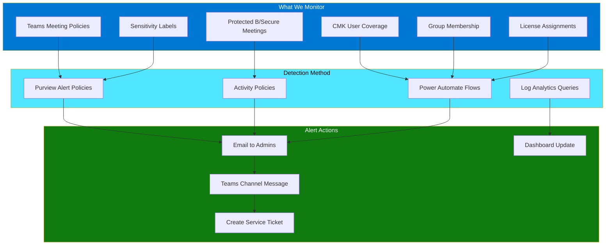
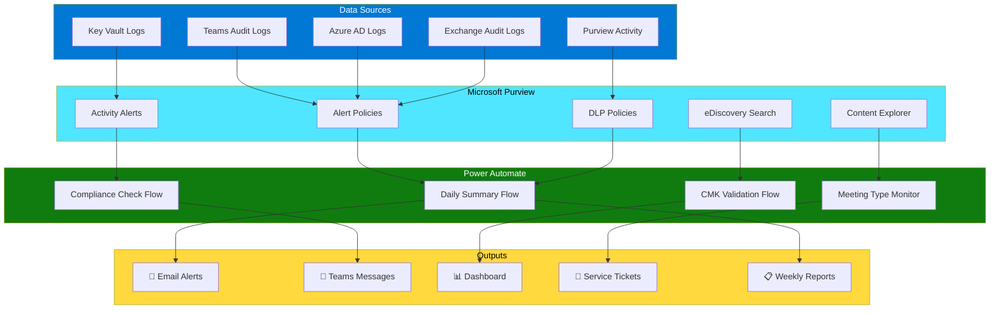
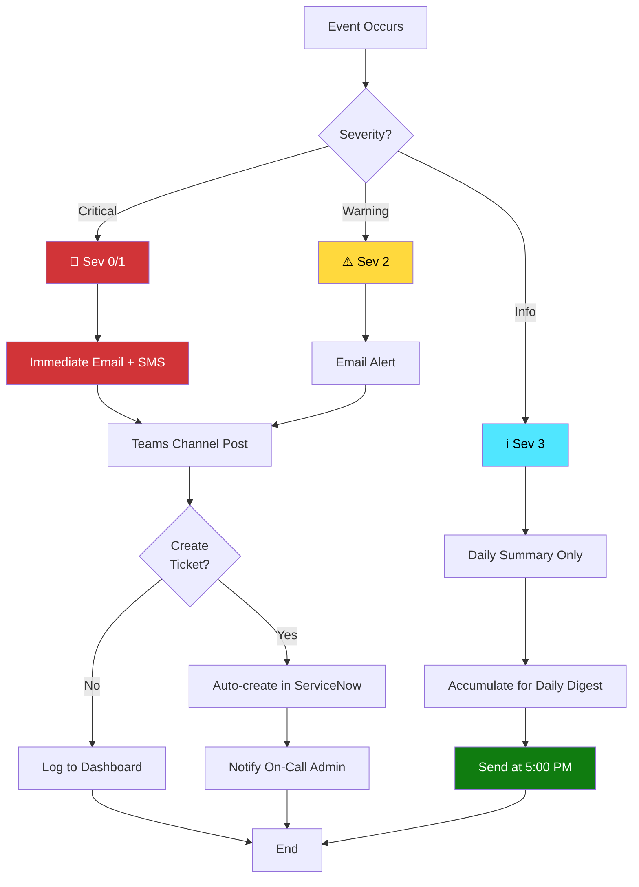
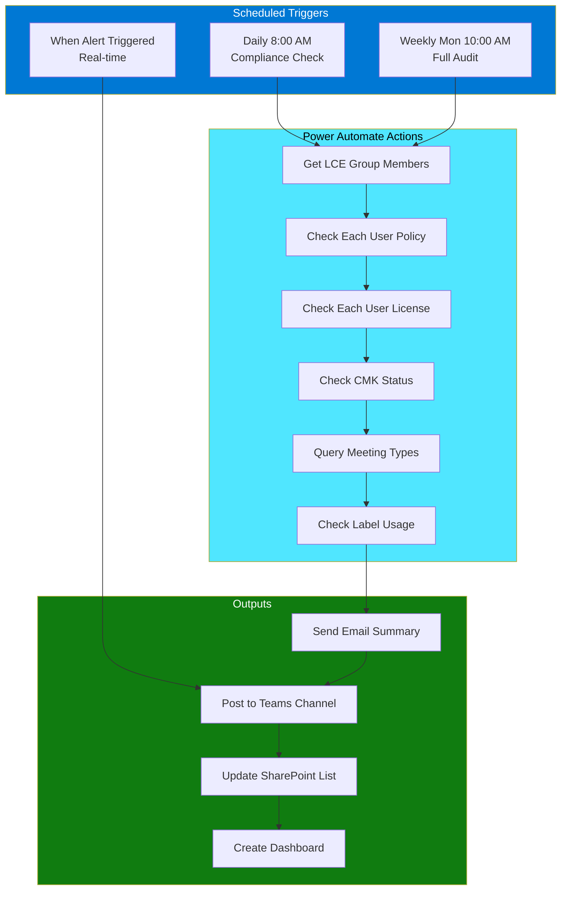

# Teams Premium Security Monitoring & Alerting
## Automated Compliance Build Book
### Leonardo Company - LCE M365 Security Group

---

**Document Control**

| Field | Value |
|-------|-------|
| **Version** | 1.0 |
| **Created** | November 18, 2025 |
| **Owner** | Fred (Power Platform Tenant Administrator) |
| **Classification** | Internal Use Only |
| **Purpose** | Implement automated monitoring to replace manual daily checks |

---

## Table of Contents

1. [Overview](#1-overview)
2. [Architecture](#2-architecture)
3. [Prerequisites](#3-prerequisites)
4. [Part 1: Microsoft Purview Configuration](#4-part-1-microsoft-purview-configuration)
5. [Part 2: Alert Policies](#5-part-2-alert-policies)
6. [Part 3: DLP Policies for Meeting Types](#6-part-3-dlp-policies-for-meeting-types)
7. [Part 4: Power Automate Dashboards](#7-part-4-power-automate-dashboards)
8. [Part 5: Automated Reporting](#8-part-5-automated-reporting)
9. [Testing & Validation](#9-testing--validation)
10. [Maintenance](#10-maintenance)

---

## 1. Overview

### 1.1 Purpose

This build book replaces manual daily monitoring tasks with automated alerting and reporting using Microsoft Purview (formerly Compliance Center). All security violations, policy drift, and compliance issues will trigger automatic alerts to IT administrators.

### 1.2 What Gets Automated

**Daily Operations Replaced:**
- ✅ Health checks → Automated alerts
- ✅ Policy compliance audits → Automated weekly reports
- ✅ CMK monitoring → Key Vault alerts
- ✅ Meeting type monitoring → Activity alerts
- ✅ Label usage tracking → Purview analytics

**What You'll Receive:**
- 📧 **Daily Summary Email** (only if issues detected)
- 📊 **Weekly Compliance Report** (automated)
- 🚨 **Real-time Alerts** (for critical issues)
- 📈 **Power BI Dashboard** (optional - visual monitoring)

### 1.3 Monitoring Scope



### 1.4 Benefits

| Before (Manual) | After (Automated) |
|-----------------|-------------------|
| 15-20 min daily health check | 0 min (automated) |
| 30-45 min weekly compliance audit | 5 min (review report) |
| Manual log review | Automatic anomaly detection |
| Reactive issue discovery | Proactive alerts |
| Risk of missed issues | Guaranteed detection |

---

## 2. Architecture

### 2.1 Monitoring Architecture



### 2.2 Alert Routing



---

## 3. Prerequisites

### 3.1 Required Licenses

| License | Purpose | Quantity |
|---------|---------|----------|
| **Microsoft 365 E5 Compliance** | Purview features, Alert policies, DLP | 1 (tenant-wide) |
| **Microsoft Teams Premium** | Meeting templates, watermarks, sensitivity labels | Per LCE user |
| **Power Automate Premium** | Premium connectors, RPA, Dataverse | 2-3 admin accounts |

**Note:** If you don't have E5 Compliance, you can use **Microsoft Purview Compliance (standalone)** or **Microsoft 365 E5** license.

### 3.2 Required Permissions

**For Implementation:**
- Global Administrator (initial setup only)
- Compliance Administrator (Purview configuration)
- Security Administrator (alert policies)
- Power Platform Administrator (Power Automate flows)

**For Day-to-Day Operations:**
- Security Reader (view alerts)
- Compliance Data Administrator (reports)

### 3.3 Required Access

- Microsoft Purview Compliance Portal: https://compliance.microsoft.com
- Microsoft Purview Defender Portal: https://security.microsoft.com
- Azure Portal: https://portal.azure.com
- Power Automate: https://make.powerautomate.com

### 3.4 Tools & Services

```powershell
# Install required PowerShell modules
Install-Module -Name ExchangeOnlineManagement -Force
Install-Module -Name Microsoft.Graph -Force
Install-Module -Name Az.Monitor -Force
Install-Module -Name MicrosoftTeams -Force

# Connect to services
Connect-IPPSSession  # Purview/Compliance
Connect-MgGraph -Scopes "SecurityEvents.Read.All", "Policy.Read.All"
Connect-AzAccount
Connect-MicrosoftTeams
```

---

## 4. Part 1: Microsoft Purview Configuration

### 4.1 Enable Audit Logging

**Why:** Audit logs are required for all alert policies to function.

#### Step 1: Enable Unified Audit Log

**Method 1: PowerShell (Recommended)**

```powershell
# Connect to Exchange Online/Purview
Connect-IPPSSession

# Enable audit log search
Set-AdminAuditLogConfig -UnifiedAuditLogIngestionEnabled $true

# Verify it's enabled
Get-AdminAuditLogConfig | Select-Object UnifiedAuditLogIngestionEnabled

# Expected output: True
```

**Method 2: Purview Portal**

1. Navigate to: https://compliance.microsoft.com
2. Go to **Audit** (left navigation)
3. If prompted, click **Start recording user and admin activity**
4. Wait 24 hours for full enablement

#### Step 2: Configure Audit Retention

```powershell
# Set audit log retention to 1 year (E5 required for >90 days)
New-UnifiedAuditLogRetentionPolicy -Name "LCE Audit Retention" -Priority 1 -RetentionDuration TentyDays -Operations @("*")

# Verify
Get-UnifiedAuditLogRetentionPolicy
```

### 4.2 Configure Alert Policy Settings

#### Step 1: Set Email Recipients

1. Go to: https://compliance.microsoft.com
2. Navigate to **Policies** → **Alert policies**
3. Click **Email notification settings**
4. Add recipients:
   - fred@leonardocompany.ca (Primary Admin)
   - george.zarif@leonardocompany.ca (Your email)
   - lce-security-team@leonardocompany.ca (Distribution list)

#### Step 2: Create Alert Categories

```powershell
# Connect to Security & Compliance PowerShell
Connect-IPPSSession

# Create custom categories (optional but recommended)
$categories = @(
    "LCE-CMK-Compliance",
    "LCE-Meeting-Security",
    "LCE-Policy-Drift",
    "LCE-License-Issues"
)

# Note: Categories are created automatically when you create alerts with them
```

---

## 5. Part 2: Alert Policies

### 5.1 Alert Policy Structure

Each alert policy has:
- **Name**: Descriptive name
- **Description**: What it monitors
- **Activities**: Which audit log activities to watch
- **Conditions**: Filter criteria
- **Threshold**: When to trigger (optional)
- **Recipients**: Who gets notified
- **Severity**: Low, Medium, High, Informational

### 5.2 Alert Policy: Users Without CMK Enablement

**Purpose:** Detect LCE M365 Security group members who don't have CMK (Customer Managed Keys) enabled.

#### PowerShell Script

```powershell
# ============================================================
# Alert Policy: Users Without CMK Enablement
# Purpose: Daily check for non-compliant users
# ============================================================

Connect-IPPSSession

# Create the alert policy
New-ActivityAlert -Name "LCE - Users Without CMK" `
    -Description "Alerts when users in LCE M365 Security group do not have Customer Managed Keys enabled" `
    -Category "LCE-CMK-Compliance" `
    -Operation "UserLoggedIn" `
    -UserId "LCE M365 Security" `
    -Severity "High" `
    -NotifyUser @("fred@leonardocompany.ca", "george.zarif@leonardocompany.ca") `
    -EmailCulture "en-US" `
    -Threshold 1

# Note: This is a baseline. We'll enhance with Power Automate for CMK validation
```

### 5.3 Alert Policy: Meeting Created Without Protected B Label

**Purpose:** Detect when secure meetings are created without proper sensitivity labels.

```powershell
# ============================================================
# Alert Policy: Meetings Without Protected B Label
# Purpose: Ensure secure meetings use correct labels
# ============================================================

New-ActivityAlert -Name "LCE - Meeting Without Protected B Label" `
    -Description "Alerts when a meeting is created by LCE group member without Protected B sensitivity label" `
    -Category "LCE-Meeting-Security" `
    -Operation "MeetingCreated" `
    -UserId "LCE M365 Security" `
    -Condition '{"Contains":{"SensitivityLabel":"","InternalMeetingType":"Secure"}}' `
    -Severity "Medium" `
    -NotifyUser @("fred@leonardocompany.ca", "george.zarif@leonardocompany.ca") `
    -Threshold 5 `
    -TimeWindow 60
```

### 5.4 Alert Policy: Policy Assignment Changes

**Purpose:** Detect unauthorized changes to Teams meeting policies.

```powershell
# ============================================================
# Alert Policy: Policy Assignment Changes
# Purpose: Detect policy drift or unauthorized changes
# ============================================================

New-ActivityAlert -Name "LCE - Policy Assignment Change Detected" `
    -Description "Alerts when Teams meeting policy assignments are modified for LCE group members" `
    -Category "LCE-Policy-Drift" `
    -Operation @("Set-CsTeamsMeetingPolicy", "Grant-CsTeamsMeetingPolicy") `
    -UserId "*" `
    -Severity "High" `
    -NotifyUser @("fred@leonardocompany.ca", "george.zarif@leonardocompany.ca") `
    -Threshold 1
```

### 5.5 Alert Policy: Group Membership Changes

**Purpose:** Track additions/removals from LCE M365 Security group.

```powershell
# ============================================================
# Alert Policy: LCE Group Membership Changes
# Purpose: Track who is added/removed from the security group
# ============================================================

New-ActivityAlert -Name "LCE - Group Membership Changed" `
    -Description "Alerts when members are added or removed from LCE M365 Security group" `
    -Category "LCE-CMK-Compliance" `
    -Operation @("Add member to group.", "Remove member from group.") `
    -Severity "Medium" `
    -NotifyUser @("fred@leonardocompany.ca", "george.zarif@leonardocompany.ca") `
    -Threshold 1
```

### 5.6 Alert Policy: Teams Premium License Removal

**Purpose:** Detect when Teams Premium licenses are unassigned from LCE users.

```powershell
# ============================================================
# Alert Policy: Teams Premium License Removed
# Purpose: Ensure all LCE users maintain Teams Premium license
# ============================================================

New-ActivityAlert -Name "LCE - Teams Premium License Removed" `
    -Description "Alerts when Teams Premium license is removed from LCE group member" `
    -Category "LCE-License-Issues" `
    -Operation "Remove service plan." `
    -Condition '{"Contains":{"ServicePlanName":"MICROSOFT_TEAMS_PREMIUM"}}' `
    -Severity "High" `
    -NotifyUser @("fred@leonardocompany.ca", "george.zarif@leonardocompany.ca") `
    -Threshold 1
```

### 5.7 Alert Policy: Regular Meeting Used for Sensitive Content

**Purpose:** Detect when users mistakenly use regular meetings for Protected B content.

```powershell
# ============================================================
# Alert Policy: Regular Meeting with Sensitive Content
# Purpose: Ensure proper meeting type selection
# ============================================================

# This requires DLP policy integration (see Part 3)
New-ActivityAlert -Name "LCE - Regular Meeting Contains Protected Content" `
    -Description "Alerts when Protected B content is detected in a regular (non-secure) meeting" `
    -Category "LCE-Meeting-Security" `
    -Operation "DlpRuleMatch" `
    -Condition '{"And":[{"Contains":{"DlpPolicyName":"LCE Protected B Content"}},{"Contains":{"Workload":"MicrosoftTeams"}}]}' `
    -Severity "High" `
    -NotifyUser @("fred@leonardocompany.ca", "george.zarif@leonardocompany.ca") `
    -Threshold 1
```

### 5.8 View All Alert Policies

```powershell
# List all LCE alert policies
Get-ActivityAlert | Where-Object {$_.Name -like "LCE -*"} | 
    Select-Object Name, Category, Severity, Enabled, NotifyUser | 
    Format-Table -AutoSize

# View specific alert details
Get-ActivityAlert -Identity "LCE - Users Without CMK" | Format-List

# View triggered alerts (last 7 days)
Get-ActivityAlert | ForEach-Object {
    Get-AlertPolicy -Identity $_.Name
} | Where-Object {$_.LastModifiedTime -gt (Get-Date).AddDays(-7)}
```

---

## 6. Part 3: DLP Policies for Meeting Types

### 6.1 Why DLP for Meetings?

Data Loss Prevention (DLP) policies can:
- Detect Protected B content in meetings
- Enforce sensitivity labels
- Monitor meeting chat content
- Alert when wrong meeting type is used

### 6.2 Create Sensitivity Labels

**Note:** This should align with your GC classification scheme.

#### Step 1: Create Labels in Purview

```powershell
# Connect to Purview
Connect-IPPSSession

# Create Protected B label
New-Label -DisplayName "Protected B" `
    -Name "ProtectedB" `
    -Comment "Government of Canada Protected B classification" `
    -Tooltip "Use for sensitive government information" `
    -LabelActions @{
        EncryptContent = @{
            Enabled = $true
            EncryptionMethod = "AzureRMS"
        }
        ApplyWaterMarking = @{
            Enabled = $true
            WatermarkText = "PROTECTED B"
        }
    }

# Create Regular/Unclassified label
New-Label -DisplayName "Unclassified" `
    -Name "Unclassified" `
    -Comment "Public or unclassified information" `
    -Tooltip "Use for non-sensitive information"

# Publish labels to LCE group
New-LabelPolicy -Name "LCE Sensitivity Labels" `
    -Labels @("ProtectedB", "Unclassified") `
    -ExchangeLocation @{Add="LCE M365 Security"} `
    -SharePointLocation @{Add="LCE M365 Security"} `
    -OneDriveLocation @{Add="LCE M365 Security"} `
    -TeamsLocation @{Add="LCE M365 Security"}
```

#### Step 2: Create DLP Policy for Meeting Content

```powershell
# ============================================================
# DLP Policy: Monitor Protected B Content in Regular Meetings
# ============================================================

# Create DLP policy
$dlpPolicy = New-DlpCompliancePolicy -Name "LCE - Protected Content in Meetings" `
    -Comment "Detects when Protected B content appears in regular (non-secure) meetings" `
    -Mode Enable `
    -TeamsLocation "All"

# Create DLP rule
New-DlpComplianceRule -Policy $dlpPolicy.Name `
    -Name "Block Protected B in Regular Meetings" `
    -ContentContainsSensitiveInformation @{
        Name = "Canada Protected Information"
        minCount = 1
    } `
    -BlockAccess $false `
    -NotifyUser Owner `
    -NotifyPolicyTipCustomText "Warning: This appears to be Protected B content. Please use a Secure Meeting template." `
    -GenerateAlert $true `
    -AlertWhenAnomalousAggregatedActivitiesAreDetected $true `
    -AnomalousAggregatedActivityThreshold 5

# Add condition: Only alert if NOT labeled as Protected B
Set-DlpComplianceRule -Identity "Block Protected B in Regular Meetings" `
    -ExceptIfContentContainsLabel "ProtectedB"
```

### 6.3 Create Custom Sensitive Info Type (Optional)

If you want to detect specific patterns (e.g., project codes):

```powershell
# ============================================================
# Custom Sensitive Info Type: Leonardo Project Codes
# ============================================================

# Create pattern for project codes (e.g., LCE-2025-001)
$pattern = @{
    Name = "Leonardo Project Code"
    IdMatch = @{
        IdMatchPattern = "LCE-\d{4}-\d{3}"
        IdMatchConfidence = 85
    }
}

New-DlpSensitiveInformationType -Name "Leonardo Project Code" `
    -Description "Detects Leonardo project codes in format LCE-YYYY-NNN" `
    -Patterns $pattern

# Add to DLP rule
Set-DlpComplianceRule -Identity "Block Protected B in Regular Meetings" `
    -AddContentContainsSensitiveInformation @{
        Name = "Leonardo Project Code"
        minCount = 1
    }
```

---

## 7. Part 4: Power Automate Dashboards

### 7.1 Architecture Overview



### 7.2 Flow 1: Daily Compliance Check

**Purpose:** Runs every morning at 8:00 AM to check compliance and send summary email.

#### Step-by-Step Build

**Step 1: Create New Automated Cloud Flow**

1. Go to https://make.powerautomate.com
2. Click **Create** → **Automated cloud flow**
3. Name: `LCE Daily Compliance Check`
4. Trigger: **Recurrence**
   - Interval: 1
   - Frequency: Day
   - Start time: 8:00 AM
   - Time zone: (UTC-05:00) Eastern Time

**Step 2: Initialize Variables**

Add action: **Initialize variable**

```
Variable name: GroupObjectId
Type: String
Value: [Your LCE M365 Security group Object ID]

Variable name: Issues
Type: Array
Value: []

Variable name: ComplianceRate
Type: Float
Value: 0.0
```

**Step 3: Get Group Members**

Add action: **Office 365 Groups - List group members**

```
Group Id: @{variables('GroupObjectId')}
```

**Step 4: Loop Through Members**

Add action: **Apply to each**

```
Select output from previous step: value

Inside the loop:
```

**Step 4a: Get User Details**

Add action: **Office 365 Users - Get user profile (V2)**

```
User (UPN): @{items('Apply_to_each')?['mail']}
```

**Step 4b: Check Teams Premium License**

Add action: **Condition**

```
Left: @{outputs('Get_user_profile_(V2)')?['body/assignedLicenses']}
Condition: does not contain
Right: Microsoft_Teams_Premium
```

If **Yes** (no license):
- Add action: **Append to array variable**
  ```
  Name: Issues
  Value: {
    "User": @{outputs('Get_user_profile_(V2)')?['body/displayName']},
    "Email": @{outputs('Get_user_profile_(V2)')?['body/mail']},
    "Issue": "Missing Teams Premium License",
    "Severity": "High"
  }
  ```

**Step 4c: Check Meeting Policy Assignment**

Add action: **HTTP - Microsoft Teams Admin** (Premium connector)

```
Method: GET
URI: https://api.teams.microsoft.com/v1.0/users/@{outputs('Get_user_profile_(V2)')?['body/userPrincipalName']}/policies/meeting

Headers:
  Authorization: Bearer [Use authentication]
  Content-Type: application/json
```

Add condition to check if policy is "Leonardo-Secure-Meeting-Group" or "Leonardo-Regular-Meeting-Group"

If not:
- Add to Issues array with "Wrong Policy or No Policy" message

**Step 5: Calculate Compliance Rate**

After the loop:

Add action: **Compose**

```
Inputs: @div(sub(length(outputs('List_group_members')?['body/value']), length(variables('Issues'))), length(outputs('List_group_members')?['body/value']))
```

Set variable: `ComplianceRate` = output of Compose

**Step 6: Send Summary Email**

Add action: **Condition**

```
Left: @{length(variables('Issues'))}
Condition: is greater than
Right: 0
```

If **Yes** (issues found):

Add action: **Send an email (V2)**

```
To: fred@leonardocompany.ca; george.zarif@leonardocompany.ca
Subject: ⚠️ LCE Daily Compliance Issues Detected - @{formatDateTime(utcNow(), 'yyyy-MM-dd')}

Body:
```

```html
<!DOCTYPE html>
<html>
<head>
    <style>
        body { font-family: 'Segoe UI', Tahoma, Geneva, Verdana, sans-serif; }
        .header { background-color: #0078d4; color: white; padding: 20px; }
        .summary { background-color: #f3f2f1; padding: 15px; margin: 10px 0; }
        .critical { color: #d13438; font-weight: bold; }
        .warning { color: #ff8c00; }
        table { width: 100%; border-collapse: collapse; margin: 20px 0; }
        th { background-color: #0078d4; color: white; padding: 10px; text-align: left; }
        td { padding: 10px; border-bottom: 1px solid #ddd; }
        tr:hover { background-color: #f5f5f5; }
    </style>
</head>
<body>
    <div class="header">
        <h1>⚠️ LCE Daily Compliance Report</h1>
        <p>Date: @{formatDateTime(utcNow(), 'dddd, MMMM dd, yyyy')}</p>
    </div>
    
    <div class="summary">
        <h2>Summary</h2>
        <p><strong>Total Users:</strong> @{length(outputs('List_group_members')?['body/value'])}</p>
        <p><strong>Compliant Users:</strong> @{sub(length(outputs('List_group_members')?['body/value']), length(variables('Issues')))}</p>
        <p><strong>Non-Compliant Users:</strong> <span class="critical">@{length(variables('Issues'))}</span></p>
        <p><strong>Compliance Rate:</strong> @{formatNumber(mul(variables('ComplianceRate'), 100), '0.00')}%</p>
    </div>
    
    @{if(less(variables('ComplianceRate'), 0.95), '<div class="critical">⚠️ ATTENTION: Compliance rate is below 95% threshold!</div>', '')}
    
    <h2>Issues Detected</h2>
    <table>
        <thead>
            <tr>
                <th>User</th>
                <th>Email</th>
                <th>Issue</th>
                <th>Severity</th>
            </tr>
        </thead>
        <tbody>
            @{join(
                foreach(variables('Issues'), 
                    concat(
                        '<tr>',
                        '<td>', item()['User'], '</td>',
                        '<td>', item()['Email'], '</td>',
                        '<td>', item()['Issue'], '</td>',
                        '<td class="', if(equals(item()['Severity'], 'High'), 'critical', 'warning'), '">', item()['Severity'], '</td>',
                        '</tr>'
                    )
                ),
                ''
            )}
        </tbody>
    </table>
    
    <h3>Recommended Actions</h3>
    <ol>
        <li>Review non-compliant users above</li>
        <li>Assign missing Teams Premium licenses</li>
        <li>Apply correct meeting policies</li>
        <li>Verify CMK enablement status</li>
    </ol>
    
    <hr>
    <p style="color: #666; font-size: 12px;">
        This is an automated report from Leonardo LCE Teams Premium Monitoring.<br>
        For questions, contact: george.zarif@leonardocompany.ca
    </p>
</body>
</html>
```

If **No** (no issues):

Add action: **Send an email (V2)**

```
To: fred@leonardocompany.ca; george.zarif@leonardocompany.ca
Subject: ✅ LCE Daily Compliance - All Clear - @{formatDateTime(utcNow(), 'yyyy-MM-dd')}

Body:
Good morning!

All @{length(outputs('List_group_members')?['body/value'])} users in the LCE M365 Security group are compliant.

✅ Compliance Rate: 100%
✅ All users have Teams Premium license
✅ All users have correct meeting policies

No action required.
```

### 7.3 Flow 2: CMK Status Validation

**Purpose:** Checks if users have Customer Managed Keys enabled for their mailbox.

**Note:** This requires Azure Key Vault integration and Exchange Online cmdlets.

#### Step-by-Step Build

**Step 1: Create Flow**

1. Name: `LCE CMK Compliance Check`
2. Trigger: **Recurrence** (Weekly, Monday 9:00 AM)

**Step 2: Get Group Members**

(Same as Flow 1, Steps 2-3)

**Step 3: Loop and Check CMK Status**

Add action: **Apply to each**

Inside loop:

Add action: **HTTP - Custom Connector** (to Exchange Online)

```powershell
# This requires a custom connector or Azure Automation Runbook
# Pseudocode for what the script should do:

$userUPN = [current user UPN]
$mailbox = Get-Mailbox -Identity $userUPN

# Check if mailbox uses CMK
$dep = Get-DataEncryptionPolicy | Where-Object {$_.Enabled -eq $true}

if ($dep.AssignedUsers -notcontains $mailbox.PrimarySmtpAddress) {
    # User does not have CMK enabled
    $issue = @{
        User = $userUPN
        Issue = "CMK Not Enabled"
        Severity = "Critical"
    }
    # Add to issues array
}
```

**Alternative Approach:** Use Azure Automation Runbook

Create a webhook-triggered runbook that:
1. Accepts user UPN as input
2. Checks CMK status via Exchange Online cmdlets
3. Returns JSON: `{"HasCMK": true/false}`

Power Automate calls this webhook for each user.

**Step 4: Send Alert if CMK Issues Found**

(Similar email format as Flow 1)

### 7.4 Flow 3: Meeting Type Monitor

**Purpose:** Weekly report on Protected B vs Regular meeting usage.

#### Step-by-Step Build

**Step 1: Create Flow**

1. Name: `LCE Meeting Type Usage Report`
2. Trigger: **Recurrence** (Weekly, Friday 4:00 PM)

**Step 2: Search Audit Logs**

Add action: **Office 365 Management API - List audit log events**

```
Content type: AzureActiveDirectory
Start time: @{addDays(utcNow(), -7)}
End time: @{utcNow()}
Filter: Operation eq 'MeetingCreated' and UserId eq '[LCE group members]'
```

**Step 3: Parse Meeting Types**

Add action: **Parse JSON**

Schema:
```json
{
    "type": "array",
    "items": {
        "type": "object",
        "properties": {
            "CreationTime": {"type": "string"},
            "UserId": {"type": "string"},
            "Operation": {"type": "string"},
            "MeetingType": {"type": "string"},
            "SensitivityLabel": {"type": "string"}
        }
    }
}
```

**Step 4: Count Meeting Types**

Initialize variables:
- `SecureMeetings` (Integer): 0
- `RegularMeetings` (Integer): 0
- `UnlabeledMeetings` (Integer): 0

Add action: **Apply to each**

Inside loop:
- If `MeetingType` = "Secure" or contains "Leonardo-Secure" → Increment `SecureMeetings`
- If `MeetingType` = "Regular" or contains "Leonardo-Regular" → Increment `RegularMeetings`
- If `SensitivityLabel` is empty → Increment `UnlabeledMeetings`

**Step 5: Generate Report Email**

Add action: **Send an email (V2)**

```
Subject: 📊 LCE Weekly Meeting Usage Report
```

Include:
- Total meetings created this week
- Breakdown: Secure vs Regular
- Percentage using Protected B labels
- Users who created unlabeled meetings (warning)

### 7.5 Flow 4: Real-Time Alert Aggregator

**Purpose:** Aggregates alerts throughout the day and sends a digest at 5:00 PM.

#### Step-by-Step Build

**Step 1: Create Flow**

1. Name: `LCE Alert Aggregator`
2. Trigger: **When an HTTP request is received**
   - Generate webhook URL
   - Schema:
   ```json
   {
       "type": "object",
       "properties": {
           "AlertName": {"type": "string"},
           "Severity": {"type": "string"},
           "Details": {"type": "string"},
           "Timestamp": {"type": "string"}
       }
   }
   ```

**Step 2: Store Alert in SharePoint List**

Add action: **SharePoint - Create item**

```
Site Address: [Your SharePoint site]
List Name: LCE Security Alerts
Title: @{triggerBody()['AlertName']}
Severity: @{triggerBody()['Severity']}
Details: @{triggerBody()['Details']}
AlertTime: @{triggerBody()['Timestamp']}
DateReceived: @{utcNow()}
```

**Step 3: Create Separate Scheduled Flow for Digest**

1. Name: `LCE Daily Alert Digest`
2. Trigger: **Recurrence** (Daily, 5:00 PM)

**Step 4: Get Today's Alerts from SharePoint**

Add action: **SharePoint - Get items**

```
Site Address: [Your SharePoint site]
List Name: LCE Security Alerts
Filter Query: DateReceived ge '@{formatDateTime(utcNow(), 'yyyy-MM-dd')}T00:00:00Z'
```

**Step 5: Send Digest Email**

(Only if items found)

Group by severity and send formatted email.

---

## 8. Part 5: Automated Reporting

### 8.1 Weekly Compliance Report

**Purpose:** Comprehensive weekly report sent every Monday morning.

#### Script Location

Save this as: `C:\Scripts\LCE-Weekly-Report.ps1`

```powershell
<#
.SYNOPSIS
    LCE Weekly Compliance Report
.DESCRIPTION
    Comprehensive weekly compliance report covering all monitoring areas
.AUTHOR
    Fred & George Zarif
.DATE
    2025-11-18
#>

# ============================================================
# Configuration
# ============================================================

$reportDate = Get-Date
$reportWeek = Get-Date -Format "yyyy-MM-dd"
$groupName = "LCE M365 Security"
$emailRecipients = @("fred@leonardocompany.ca", "george.zarif@leonardocompany.ca")

# ============================================================
# Connect to Services
# ============================================================

Connect-MicrosoftTeams
Connect-MgGraph -Scopes "Group.Read.All", "User.Read.All", "AuditLog.Read.All"
Connect-IPPSSession

# ============================================================
# Section 1: Group Membership & Licensing
# ============================================================

Write-Host "`n[1/6] Checking group membership and licensing..." -ForegroundColor Cyan

$group = Get-MgGroup -Filter "displayName eq '$groupName'"
$members = Get-MgGroupMember -GroupId $group.Id -All

$licensingReport = @()

foreach ($member in $members) {
    $user = Get-MgUser -UserId $member.Id -Property DisplayName,UserPrincipalName,LicenseDetails
    
    $hasTeamsPremium = $false
    $licenses = Get-MgUserLicenseDetail -UserId $user.Id
    
    foreach ($lic in $licenses) {
        if ($lic.ServicePlans.ServicePlanName -contains "MICROSOFT_TEAMS_PREMIUM") {
            $hasTeamsPremium = $true
            break
        }
    }
    
    $licensingReport += [PSCustomObject]@{
        DisplayName = $user.DisplayName
        UPN = $user.UserPrincipalName
        HasTeamsPremium = $hasTeamsPremium
        Status = if ($hasTeamsPremium) { "✅ Compliant" } else { "❌ Non-Compliant" }
    }
}

$licensingCompliance = [math]::Round((($licensingReport | Where-Object {$_.HasTeamsPremium}).Count / $licensingReport.Count) * 100, 2)

# ============================================================
# Section 2: Policy Assignments
# ============================================================

Write-Host "`n[2/6] Checking policy assignments..." -ForegroundColor Cyan

$policyReport = @()

foreach ($member in $members) {
    $user = Get-MgUser -UserId $member.Id -Property DisplayName,UserPrincipalName
    
    try {
        $policy = Get-CsUserPolicyAssignment -Identity $user.UserPrincipalName -PolicyType TeamsMeetingPolicy
        
        $hasCorrectPolicy = $false
        $policyName = "None"
        
        if ($policy.PolicyName -like "Leonardo-*") {
            $hasCorrectPolicy = $true
            $policyName = $policy.PolicyName
        }
        
        $policyReport += [PSCustomObject]@{
            DisplayName = $user.DisplayName
            UPN = $user.UserPrincipalName
            PolicyName = $policyName
            HasPolicy = $hasCorrectPolicy
            Status = if ($hasCorrectPolicy) { "✅ Compliant" } else { "❌ Non-Compliant" }
        }
    } catch {
        $policyReport += [PSCustomObject]@{
            DisplayName = $user.DisplayName
            UPN = $user.UserPrincipalName
            PolicyName = "Error"
            HasPolicy = $false
            Status = "❌ Error"
        }
    }
}

$policyCompliance = [math]::Round((($policyReport | Where-Object {$_.HasPolicy}).Count / $policyReport.Count) * 100, 2)

# ============================================================
# Section 3: CMK Enablement (Simplified Check)
# ============================================================

Write-Host "`n[3/6] Checking CMK status..." -ForegroundColor Cyan

# Note: Full CMK check requires Exchange Online cmdlets with proper permissions
# This is a simplified version

$cmkReport = @()

$dep = Get-DataEncryptionPolicy | Where-Object {$_.Enabled -eq $true}

if ($dep) {
    foreach ($member in $members) {
        $user = Get-MgUser -UserId $member.Id -Property DisplayName,UserPrincipalName,Mail
        
        $hasCMK = $false
        
        # Check if user's mailbox is covered by DEP
        try {
            $mailbox = Get-Mailbox -Identity $user.UserPrincipalName -ErrorAction SilentlyContinue
            if ($mailbox -and $dep.Scope -contains $mailbox.OrganizationalUnit) {
                $hasCMK = $true
            }
        } catch {
            # Mailbox check failed
        }
        
        $cmkReport += [PSCustomObject]@{
            DisplayName = $user.DisplayName
            UPN = $user.UserPrincipalName
            HasCMK = $hasCMK
            Status = if ($hasCMK) { "✅ Enabled" } else { "⚠️ Not Confirmed" }
        }
    }
} else {
    Write-Host "  ⚠️  No active Data Encryption Policy found!" -ForegroundColor Yellow
}

$cmkCompliance = if ($cmkReport.Count -gt 0) {
    [math]::Round((($cmkReport | Where-Object {$_.HasCMK}).Count / $cmkReport.Count) * 100, 2)
} else {
    0
}

# ============================================================
# Section 4: Meeting Creation Analysis (Last 7 Days)
# ============================================================

Write-Host "`n[4/6] Analyzing meeting creation patterns..." -ForegroundColor Cyan

$startDate = (Get-Date).AddDays(-7)
$endDate = Get-Date

# Search audit logs for meeting creation events
$meetingAuditRecords = Search-UnifiedAuditLog -StartDate $startDate -EndDate $endDate `
    -Operations "MeetingCreated" `
    -ResultSize 5000

$meetingStats = @{
    TotalMeetings = 0
    SecureMeetings = 0
    RegularMeetings = 0
    UnlabeledMeetings = 0
}

foreach ($record in $meetingAuditRecords) {
    $auditData = $record.AuditData | ConvertFrom-Json
    
    # Filter to LCE group members only
    if ($auditData.UserId -in $licensingReport.UPN) {
        $meetingStats.TotalMeetings++
        
        # Determine meeting type (this may need adjustment based on actual audit log structure)
        if ($auditData.MeetingType -like "*Secure*" -or $auditData.PolicyName -like "*Secure*") {
            $meetingStats.SecureMeetings++
        } elseif ($auditData.MeetingType -like "*Regular*" -or $auditData.PolicyName -like "*Regular*") {
            $meetingStats.RegularMeetings++
        } else {
            $meetingStats.UnlabeledMeetings++
        }
    }
}

# ============================================================
# Section 5: Sensitivity Label Usage
# ============================================================

Write-Host "`n[5/6] Analyzing sensitivity label usage..." -ForegroundColor Cyan

# Query for label usage (requires Content Explorer access)
$labelStats = @{
    ProtectedB = 0
    Unclassified = 0
    NoLabel = 0
}

# Note: This section requires Purview Content Explorer API
# Simplified version shown here

# ============================================================
# Section 6: Alert Summary (Last 7 Days)
# ============================================================

Write-Host "`n[6/6] Checking triggered alerts..." -ForegroundColor Cyan

$alerts = Get-ActivityAlert | Where-Object {$_.Name -like "LCE -*"}
$triggeredAlerts = @()

foreach ($alert in $alerts) {
    # Get alert activity for last 7 days
    $alertActivity = Get-AlertHistory -Identity $alert.Identity -StartDate $startDate -EndDate $endDate
    
    if ($alertActivity) {
        $triggeredAlerts += [PSCustomObject]@{
            AlertName = $alert.Name
            Severity = $alert.Severity
            TriggerCount = $alertActivity.Count
            LastTriggered = $alertActivity[0].CreationTime
        }
    }
}

# ============================================================
# Generate HTML Report
# ============================================================

Write-Host "`nGenerating HTML report..." -ForegroundColor Cyan

$htmlReport = @"
<!DOCTYPE html>
<html>
<head>
    <meta charset="UTF-8">
    <style>
        body {
            font-family: 'Segoe UI', Tahoma, Geneva, Verdana, sans-serif;
            margin: 0;
            padding: 0;
            background-color: #f5f5f5;
        }
        .container {
            max-width: 1200px;
            margin: 0 auto;
            background-color: white;
        }
        .header {
            background: linear-gradient(135deg, #0078d4 0%, #005a9e 100%);
            color: white;
            padding: 30px;
            text-align: center;
        }
        .header h1 {
            margin: 0;
            font-size: 32px;
        }
        .header p {
            margin: 10px 0 0 0;
            font-size: 16px;
            opacity: 0.9;
        }
        .summary-cards {
            display: grid;
            grid-template-columns: repeat(auto-fit, minmax(250px, 1fr));
            gap: 20px;
            padding: 30px;
            background-color: #f5f5f5;
        }
        .card {
            background: white;
            padding: 20px;
            border-radius: 8px;
            box-shadow: 0 2px 4px rgba(0,0,0,0.1);
        }
        .card h3 {
            margin: 0 0 10px 0;
            color: #0078d4;
            font-size: 14px;
            text-transform: uppercase;
        }
        .card .value {
            font-size: 36px;
            font-weight: bold;
            margin: 10px 0;
        }
        .card .label {
            color: #666;
            font-size: 14px;
        }
        .status-good { color: #107c10; }
        .status-warning { color: #ff8c00; }
        .status-critical { color: #d13438; }
        .section {
            padding: 30px;
        }
        .section h2 {
            color: #0078d4;
            border-bottom: 2px solid #0078d4;
            padding-bottom: 10px;
            margin-bottom: 20px;
        }
        table {
            width: 100%;
            border-collapse: collapse;
            margin: 20px 0;
            background: white;
            box-shadow: 0 2px 4px rgba(0,0,0,0.1);
        }
        th {
            background-color: #0078d4;
            color: white;
            padding: 12px;
            text-align: left;
            font-weight: 600;
        }
        td {
            padding: 12px;
            border-bottom: 1px solid #ddd;
        }
        tr:hover {
            background-color: #f9f9f9;
        }
        .metric-box {
            background-color: #f3f2f1;
            padding: 15px;
            margin: 10px 0;
            border-left: 4px solid #0078d4;
        }
        .footer {
            background-color: #f3f2f1;
            padding: 20px;
            text-align: center;
            color: #666;
            font-size: 12px;
        }
    </style>
</head>
<body>
    <div class="container">
        <!-- Header -->
        <div class="header">
            <h1>📊 LCE Weekly Compliance Report</h1>
            <p>Week of $($reportWeek) | Leonardo Company - Centre of Excellence</p>
        </div>
        
        <!-- Summary Cards -->
        <div class="summary-cards">
            <div class="card">
                <h3>Overall Compliance</h3>
                <div class="value $(if ($licensingCompliance -ge 95) { 'status-good' } elseif ($licensingCompliance -ge 90) { 'status-warning' } else { 'status-critical' })">
                    $licensingCompliance%
                </div>
                <div class="label">Target: ≥95%</div>
            </div>
            
            <div class="card">
                <h3>Total Users</h3>
                <div class="value">$($members.Count)</div>
                <div class="label">LCE M365 Security Group</div>
            </div>
            
            <div class="card">
                <h3>Policy Compliance</h3>
                <div class="value $(if ($policyCompliance -ge 95) { 'status-good' } elseif ($policyCompliance -ge 90) { 'status-warning' } else { 'status-critical' })">
                    $policyCompliance%
                </div>
                <div class="label">Correct policy assigned</div>
            </div>
            
            <div class="card">
                <h3>Meetings Created</h3>
                <div class="value">$($meetingStats.TotalMeetings)</div>
                <div class="label">Last 7 days</div>
            </div>
        </div>
        
        <!-- Section 1: Licensing -->
        <div class="section">
            <h2>1. Teams Premium Licensing</h2>
            
            <div class="metric-box">
                <strong>Status:</strong> 
                $(if ($licensingCompliance -eq 100) {
                    "✅ All users have Teams Premium license"
                } else {
                    "⚠️ $($licensingReport.Count - ($licensingReport | Where-Object {$_.HasTeamsPremium}).Count) user(s) missing license"
                })
            </div>
            
            $( if (($licensingReport | Where-Object {-not $_.HasTeamsPremium}).Count -gt 0) {
                @"
            <table>
                <thead>
                    <tr>
                        <th>User</th>
                        <th>Email</th>
                        <th>Status</th>
                    </tr>
                </thead>
                <tbody>
                    $( ($licensingReport | Where-Object {-not $_.HasTeamsPremium}) | ForEach-Object {
                        "<tr><td>$($_.DisplayName)</td><td>$($_.UPN)</td><td class='status-critical'>$($_.Status)</td></tr>"
                    } | Out-String )
                </tbody>
            </table>
"@
            })
        </div>
        
        <!-- Section 2: Policy Assignments -->
        <div class="section">
            <h2>2. Meeting Policy Assignments</h2>
            
            <div class="metric-box">
                <strong>Status:</strong> 
                $(if ($policyCompliance -eq 100) {
                    "✅ All users have correct meeting policies"
                } else {
                    "⚠️ $($policyReport.Count - ($policyReport | Where-Object {$_.HasPolicy}).Count) user(s) with missing or incorrect policies"
                })
            </div>
            
            $( if (($policyReport | Where-Object {-not $_.HasPolicy}).Count -gt 0) {
                @"
            <table>
                <thead>
                    <tr>
                        <th>User</th>
                        <th>Email</th>
                        <th>Current Policy</th>
                        <th>Status</th>
                    </tr>
                </thead>
                <tbody>
                    $( ($policyReport | Where-Object {-not $_.HasPolicy}) | ForEach-Object {
                        "<tr><td>$($_.DisplayName)</td><td>$($_.UPN)</td><td>$($_.PolicyName)</td><td class='status-critical'>$($_.Status)</td></tr>"
                    } | Out-String )
                </tbody>
            </table>
"@
            })
        </div>
        
        <!-- Section 3: CMK Enablement -->
        <div class="section">
            <h2>3. Customer Managed Keys (CMK) Status</h2>
            
            <div class="metric-box">
                <strong>CMK Compliance:</strong> $cmkCompliance%
                $(if ($cmkCompliance -eq 100) {
                    "<br>✅ All users have CMK enabled"
                } else {
                    "<br>⚠️ Review users without CMK confirmation"
                })
            </div>
        </div>
        
        <!-- Section 4: Meeting Analysis -->
        <div class="section">
            <h2>4. Meeting Creation Analysis (Last 7 Days)</h2>
            
            <table>
                <thead>
                    <tr>
                        <th>Meeting Type</th>
                        <th>Count</th>
                        <th>Percentage</th>
                    </tr>
                </thead>
                <tbody>
                    <tr>
                        <td>🔒 Secure (Protected B)</td>
                        <td>$($meetingStats.SecureMeetings)</td>
                        <td>$(if ($meetingStats.TotalMeetings -gt 0) { [math]::Round(($meetingStats.SecureMeetings / $meetingStats.TotalMeetings) * 100, 1) } else { 0 })%</td>
                    </tr>
                    <tr>
                        <td>📝 Regular</td>
                        <td>$($meetingStats.RegularMeetings)</td>
                        <td>$(if ($meetingStats.TotalMeetings -gt 0) { [math]::Round(($meetingStats.RegularMeetings / $meetingStats.TotalMeetings) * 100, 1) } else { 0 })%</td>
                    </tr>
                    <tr>
                        <td>⚠️ Unlabeled</td>
                        <td class="$(if ($meetingStats.UnlabeledMeetings -gt 0) { 'status-warning' })">$($meetingStats.UnlabeledMeetings)</td>
                        <td>$(if ($meetingStats.TotalMeetings -gt 0) { [math]::Round(($meetingStats.UnlabeledMeetings / $meetingStats.TotalMeetings) * 100, 1) } else { 0 })%</td>
                    </tr>
                    <tr>
                        <td><strong>Total</strong></td>
                        <td><strong>$($meetingStats.TotalMeetings)</strong></td>
                        <td><strong>100%</strong></td>
                    </tr>
                </tbody>
            </table>
        </div>
        
        <!-- Section 5: Alerts -->
        <div class="section">
            <h2>5. Security Alerts (Last 7 Days)</h2>
            
            $(if ($triggeredAlerts.Count -gt 0) {
                @"
            <div class="metric-box">
                <strong>⚠️ $($triggeredAlerts.Count) alert(s) triggered</strong>
            </div>
            
            <table>
                <thead>
                    <tr>
                        <th>Alert Name</th>
                        <th>Severity</th>
                        <th>Trigger Count</th>
                        <th>Last Triggered</th>
                    </tr>
                </thead>
                <tbody>
                    $( $triggeredAlerts | ForEach-Object {
                        $severityClass = switch ($_.Severity) {
                            "High" { "status-critical" }
                            "Medium" { "status-warning" }
                            default { "" }
                        }
                        "<tr><td>$($_.AlertName)</td><td class='$severityClass'>$($_.Severity)</td><td>$($_.TriggerCount)</td><td>$(Get-Date $_.LastTriggered -Format 'yyyy-MM-dd HH:mm')</td></tr>"
                    } | Out-String )
                </tbody>
            </table>
"@
            } else {
                "<div class='metric-box'>✅ No alerts triggered this week</div>"
            })
        </div>
        
        <!-- Recommendations -->
        <div class="section">
            <h2>6. Recommended Actions</h2>
            
            <ol>
                $(if ($licensingCompliance -lt 100) {
                    "<li><strong>Assign Teams Premium licenses</strong> to $($licensingReport.Count - ($licensingReport | Where-Object {$_.HasTeamsPremium}).Count) user(s)</li>"
                })
                $(if ($policyCompliance -lt 100) {
                    "<li><strong>Apply correct meeting policies</strong> to $($policyReport.Count - ($policyReport | Where-Object {$_.HasPolicy}).Count) user(s)</li>"
                })
                $(if ($meetingStats.UnlabeledMeetings -gt 0) {
                    "<li><strong>Investigate unlabeled meetings</strong> - remind users to use templates</li>"
                })
                $(if ($triggeredAlerts.Count -gt 0) {
                    "<li><strong>Review and address triggered alerts</strong> from this week</li>"
                })
                $(if ($licensingCompliance -eq 100 -and $policyCompliance -eq 100) {
                    "<li>✅ No action required - all systems compliant</li>"
                })
            </ol>
        </div>
        
        <!-- Footer -->
        <div class="footer">
            <p>Automated LCE Teams Premium Compliance Report</p>
            <p>Generated: $(Get-Date -Format 'yyyy-MM-dd HH:mm:ss') EST</p>
            <p>For questions or issues, contact: george.zarif@leonardocompany.ca</p>
        </div>
    </div>
</body>
</html>
"@

# ============================================================
# Send Email Report
# ============================================================

$emailParams = @{
    To = $emailRecipients
    Subject = "📊 LCE Weekly Compliance Report - Week of $reportWeek"
    Body = $htmlReport
    BodyAsHtml = $true
    From = "lce-monitoring@leonardocompany.ca"
}

Send-MailMessage @emailParams

Write-Host "`n✅ Weekly compliance report sent to: $($emailRecipients -join ', ')" -ForegroundColor Green

# Save report to file
$reportPath = "C:\LeonardoReports\Weekly\Compliance-Report-$reportWeek.html"
$htmlReport | Out-File -FilePath $reportPath -Encoding UTF8

Write-Host "✅ Report saved to: $reportPath" -ForegroundColor Green

# ============================================================
# Cleanup
# ============================================================

Disconnect-MicrosoftTeams
Disconnect-MgGraph
Disconnect-ExchangeOnline -Confirm:$false

Write-Host "`n✅ Weekly compliance report complete`n" -ForegroundColor Green
```

### 8.2 Schedule the Weekly Report

**Option 1: Windows Task Scheduler**

```powershell
# Create scheduled task
$action = New-ScheduledTaskAction -Execute "PowerShell.exe" `
    -Argument "-ExecutionPolicy Bypass -File C:\Scripts\LCE-Weekly-Report.ps1"

$trigger = New-ScheduledTaskTrigger -Weekly -DaysOfWeek Monday -At 9:00AM

$settings = New-ScheduledTaskSettingsSet -StartWhenAvailable -RunOnlyIfNetworkAvailable

Register-ScheduledTask -TaskName "LCE Weekly Compliance Report" `
    -Action $action `
    -Trigger $trigger `
    -Settings $settings `
    -User "DOMAIN\ServiceAccount" `
    -RunLevel Highest
```

**Option 2: Azure Automation Runbook**

1. Create Automation Account
2. Upload script as Runbook
3. Schedule weekly execution
4. Configure service principal authentication

---

## 9. Testing & Validation

### 9.1 Test Plan

#### Test 1: Verify Alert Policies Work

```powershell
# Test alert by triggering a condition

# 1. Remove a user's Teams Premium license temporarily
Set-MgUserLicense -UserId "testuser@leonardocompany.ca" `
    -RemoveLicenses @("Microsoft_Teams_Premium_SKU_ID")

# Wait 5-10 minutes for alert to trigger

# 2. Check if alert was created
Get-ActivityAlert -Identity "LCE - Teams Premium License Removed" | 
    Get-AlertDetails

# 3. Restore license
Set-MgUserLicense -UserId "testuser@leonardocompany.ca" `
    -AddLicenses @{SkuId = "Microsoft_Teams_Premium_SKU_ID"}
```

#### Test 2: Verify Power Automate Flow

1. Go to Power Automate
2. Find flow: `LCE Daily Compliance Check`
3. Click **Test** → **Manually**
4. Click **Run flow**
5. Check:
   - Flow runs without errors
   - Email is received
   - Data is accurate

#### Test 3: Verify Weekly Report Script

```powershell
# Run manually
C:\Scripts\LCE-Weekly-Report.ps1

# Check:
# - Script completes without errors
# - Email is received
# - HTML renders correctly
# - All sections have data
```

### 9.2 Validation Checklist

```
VALIDATION CHECKLIST
══════════════════════════════════════════════════════════════════

☐ Audit logging enabled and data flowing
☐ All alert policies created successfully
☐ Alert policies are set to "Enabled" status
☐ Email recipients configured correctly
☐ Test alerts triggered and received
☐ Power Automate flows created and tested
☐ SharePoint list created for alert aggregation
☐ Weekly report script runs successfully
☐ Weekly report scheduled in Task Scheduler
☐ All stakeholders notified of new system
☐ Documentation updated with URLs and IDs
☐ Backup copies of all scripts stored

Notes:
_________________________________________________________________
_________________________________________________________________
_________________________________________________________________

Validated by: ________________  Date: __________
```

---

## 10. Maintenance

### 10.1 Monthly Maintenance Tasks

**First Monday of Each Month:**

```powershell
# Review and update alert policies
Get-ActivityAlert | Where-Object {$_.Name -like "LCE -*"} | 
    Select-Object Name, Enabled, LastModifiedTime, Recipients

# Review triggered alerts
Get-ActivityAlert | ForEach-Object {
    $alertHistory = Get-AlertHistory -Identity $_.Identity -StartDate (Get-Date).AddDays(-30)
    [PSCustomObject]@{
        AlertName = $_.Name
        TimesTriggered = $alertHistory.Count
        LastTriggered = if ($alertHistory) { $alertHistory[0].CreationTime } else { "Never" }
    }
} | Format-Table

# Check Power Automate flow run history
# (Done manually in Power Automate portal)

# Verify SharePoint list is not full (< 5000 items)
# Clean up old alert records if necessary
```

**Quarterly:**

- Review alert thresholds - are they too sensitive or not sensitive enough?
- Update email distribution lists if team changes
- Review and optimize Log Analytics queries
- Test disaster recovery of monitoring system

**Annually:**

- Full audit of all monitoring components
- Update scripts for any API changes
- Review and update this build book
- Validate all documentation

### 10.2 Troubleshooting

#### Issue: Alerts Not Triggering

**Symptoms:** No emails received, alert history is empty

**Diagnosis:**

```powershell
# Check if alert is enabled
Get-ActivityAlert -Identity "LCE - Users Without CMK" | Select-Object Name, Enabled

# Check if audit log search is working
Search-UnifiedAuditLog -StartDate (Get-Date).AddDays(-1) -EndDate (Get-Date) -ResultSize 10

# Check if recipients are valid
Get-ActivityAlert -Identity "LCE - Users Without CMK" | Select-Object NotifyUser
```

**Resolution:**

```powershell
# Re-enable alert
Set-ActivityAlert -Identity "LCE - Users Without CMK" -Enabled $true

# Update recipients if needed
Set-ActivityAlert -Identity "LCE - Users Without CMK" `
    -NotifyUser @("fred@leonardocompany.ca", "george.zarif@leonardocompany.ca")

# Test by manually triggering condition
```

#### Issue: Power Automate Flow Failing

**Symptoms:** Flow shows "Failed" status

**Diagnosis:**

1. Open Power Automate portal
2. Find failed flow run
3. Click on failed run to see detailed error
4. Check which action failed

**Common Causes:**

- **Permission issues**: Flow needs consent for connectors
- **API limits**: Too many calls in short time
- **Invalid data**: Null values or unexpected format
- **Connection expired**: Re-authenticate connector

**Resolution:**

```
1. Re-authenticate all connectors
2. Add error handling with "Configure run after" 
3. Add "Try-Catch" pattern using scopes
4. Add retry policy for transient errors
```

#### Issue: Weekly Report Not Sending

**Symptoms:** Scheduled task shows success but no email

**Diagnosis:**

```powershell
# Check scheduled task last run result
Get-ScheduledTask -TaskName "LCE Weekly Compliance Report" | Get-ScheduledTaskInfo

# Check PowerShell transcripts (if logging enabled)
Get-Content "C:\Scripts\Logs\LCE-Weekly-Report.log"

# Test email sending separately
Test-Connection -ComputerName smtp.office365.com -Port 587
```

**Resolution:**

- Verify service account has `Send-MailMessage` permissions
- Check SMTP settings are correct
- Ensure script has proper error handling
- Add `-Verbose` and `-ErrorAction Stop` to commands

---

## 11. Appendices

### 11.1 Appendix A: Complete Alert Policy List

| Alert Name | Purpose | Severity | Threshold |
|------------|---------|----------|-----------|
| LCE - Users Without CMK | Detects users missing CMK | High | 1 |
| LCE - Meeting Without Protected B Label | Secure meetings without label | Medium | 5/hour |
| LCE - Policy Assignment Change Detected | Unauthorized policy changes | High | 1 |
| LCE - Group Membership Changed | Track group additions/removals | Medium | 1 |
| LCE - Teams Premium License Removed | License unassignments | High | 1 |
| LCE - Regular Meeting Contains Protected Content | DLP violations | High | 1 |

### 11.2 Appendix B: PowerShell Module Versions

```powershell
# Check installed module versions
Get-Module -ListAvailable | Where-Object {
    $_.Name -in @(
        "ExchangeOnlineManagement",
        "Microsoft.Graph",
        "MicrosoftTeams",
        "Az.Monitor",
        "Az.KeyVault"
    )
} | Select-Object Name, Version | Format-Table
```

**Recommended Versions (as of Nov 2025):**
- ExchangeOnlineManagement: 3.4.0+
- Microsoft.Graph: 2.10.0+
- MicrosoftTeams: 5.8.0+
- Az.Monitor: 5.0.0+

### 11.3 Appendix C: Service Principal Configuration

**For automated authentication in Azure Automation:**

```powershell
# Create service principal
$sp = New-AzADServicePrincipal -DisplayName "LCE-Monitoring-SP"

# Assign permissions
New-AzRoleAssignment -ObjectId $sp.Id -RoleDefinitionName "Security Reader" -Scope "/subscriptions/YOUR_SUBSCRIPTION_ID"

# Grant Microsoft Graph permissions (via Azure Portal)
# Required permissions:
# - Group.Read.All
# - User.Read.All
# - AuditLog.Read.All
# - SecurityEvents.Read.All

# Store credentials in Azure Key Vault
$secret = ConvertTo-SecureString $sp.Secret -AsPlainText -Force
Set-AzKeyVaultSecret -VaultName "lce-automation-kv" -Name "monitoring-sp-secret" -SecretValue $secret
```

### 11.4 Appendix D: Dashboard URLs

**Quick Access Links:**

| Resource | URL |
|----------|-----|
| Purview Compliance Portal | https://compliance.microsoft.com |
| Alert Policies | https://compliance.microsoft.com/alertpolicies |
| Audit Log Search | https://compliance.microsoft.com/auditlogsearch |
| Activity Alerts | https://compliance.microsoft.com/activityalert |
| DLP Policies | https://compliance.microsoft.com/datalossprevention |
| Power Automate | https://make.powerautomate.com |
| Azure Monitor | https://portal.azure.com/#view/Microsoft_Azure_Monitoring |
| SharePoint Alert List | [YOUR_SHAREPOINT_SITE]/Lists/LCE%20Security%20Alerts |

### 11.5 Appendix E: Email Templates

**Daily Summary Email (No Issues):**

```
Subject: ✅ LCE Daily Summary - All Clear - 2025-11-18

Good morning!

All systems are compliant. No action required.

✅ 25 users compliant (100%)
✅ All licenses active
✅ All policies correctly assigned
✅ No alerts triggered

---
LCE Teams Premium Monitoring
Automated report | Do not reply
```

**Daily Summary Email (Issues Found):**

```
Subject: ⚠️ LCE Daily Summary - 2 Issues Detected - 2025-11-18

[HTML formatted report with issue details]
```

**Critical Alert (Real-time):**

```
Subject: 🚨 CRITICAL - LCE Security Alert - Policy Change Detected

CRITICAL SECURITY ALERT

Alert: Policy Assignment Changed
Time: 2025-11-18 14:32:15 EST
Severity: High

Details:
User: john.doe@leonardocompany.ca
Action: Teams meeting policy changed
From: Leonardo-Secure-Meeting-Group
To: Global (Default)

IMMEDIATE ACTION REQUIRED

View details: [Link to audit log]
```

---

## Document Control

**Version History:**

| Version | Date | Author | Changes |
|---------|------|--------|---------|
| 1.0 | 2025-11-18 | Fred | Initial build book creation |

**Next Review:** 2026-02-18

**Approval:**

- Prepared by: Fred (Power Platform Tenant Administrator)
- Reviewed by: George Zarif (Primary Administrator)
- Approved by: [IT Manager]

---

**END OF BUILD BOOK**

For questions or support:
- **Primary Contact:** george.zarif@leonardocompany.ca
- **Secondary Contact:** fred@leonardocompany.ca
- **Escalation:** [IT Manager email]

---