# Standard Operating Procedure
## Teams Premium Security Operations
### Leonardo Company - LCE M365 Security Group

---

**Document Control**

| Field | Value |
|-------|-------|
| **Version** | 1.0 |
| **Last Updated** | November 2025 |
| **Next Review** | February 2026 |
| **Owner** | George Zarif |
| **Email** | george.zarif@leonardocompany.ca |
| **Classification** | Internal Use Only |

---

## Table of Contents

1. [Overview](#1-overview)
2. [Operational Schedule](#2-operational-schedule)
3. [Daily Operations](#3-daily-operations)
4. [Weekly Operations](#4-weekly-operations)
5. [Monthly Operations](#5-monthly-operations)
6. [Quarterly Operations](#6-quarterly-operations)
7. [Annual Operations](#7-annual-operations)
8. [Monitoring & Alerting](#8-monitoring--alerting)
9. [User Training](#9-user-training)
10. [Incident Response](#10-incident-response)
11. [Escalation Procedures](#11-escalation-procedures)
12. [Certificate Management](#12-certificate-management)
13. [Key Vault Operations](#13-key-vault-operations)
14. [Compliance Reporting](#14-compliance-reporting)
15. [Emergency Procedures](#15-emergency-procedures)
16. [Change Management](#16-change-management)
17. [Appendices](#17-appendices)

---

## 1. Overview

### 1.1 Purpose

This Standard Operating Procedure (SOP) defines the operational requirements for maintaining Microsoft Teams Premium with Customer Managed Keys (CMK) for the LCE M365 Security group at Leonardo Company.

### 1.2 Scope

**Target Group:** LCE M365 Security (Centre of Excellence team)

**Systems Covered:**
- Microsoft Teams Premium
- Customer Managed Keys (CMK)
- Azure Key Vault
- Meeting Templates (Secure and Regular)
- Intune Policies
- Compliance Monitoring

### 1.3 Compliance Requirements

- ITAR (International Traffic in Arms Regulations)
- Defense contractor security obligations
- Client confidentiality agreements
- Government contract requirements
- SOC 2 Type II compliance

### 1.4 Key Contacts

| Role | Name | Email | Phone |
|------|------|-------|-------|
| Primary Administrator | George Zarif | george.zarif@leonardocompany.ca | [PHONE] |
| Backup Administrator | [TBD] | [EMAIL] | [PHONE] |
| IT Support Lead | [TBD] | itsupport@leonardocompany.ca | [PHONE] |
| Security Officer | [TBD] | [EMAIL] | [PHONE] |
| Microsoft TAM | [TBD] | [EMAIL] | [PHONE] |

### 1.5 Responsibilities Matrix

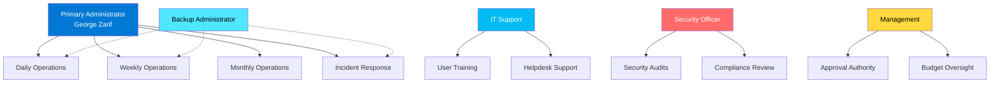

---

## 2. Operational Schedule

### 2.1 Master Schedule Overview

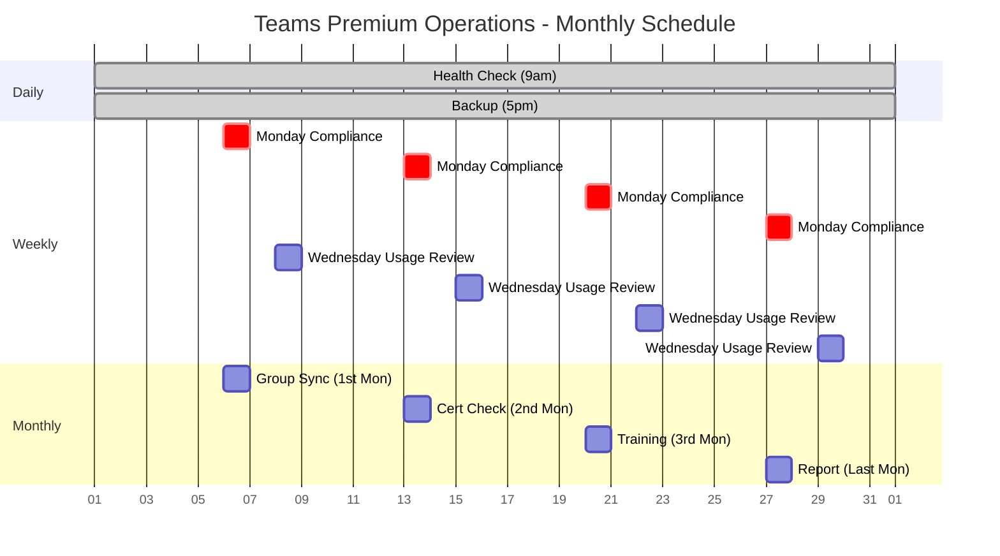

### 2.2 Annual Calendar

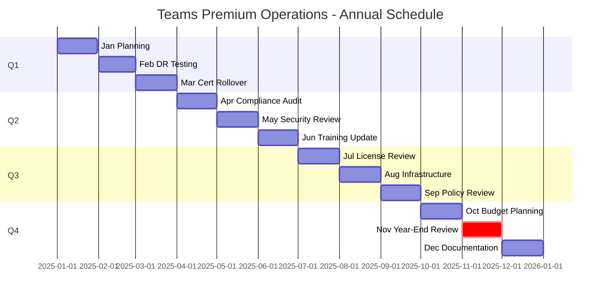

### 2.3 Who Does What When

```mermaid
flowchart LR
    subgraph Daily["Daily (Mon-Fri)"]
        D1["9:00 AM<br/>Health Check<br/>👤 George Zarif"]
        D2["5:00 PM<br/>Backup<br/>👤 George Zarif"]
    end
    
    subgraph Weekly["Weekly"]
        W1["Monday 10:00 AM<br/>Compliance Audit<br/>👤 George Zarif"]
        W2["Wednesday 2:00 PM<br/>Usage Review<br/>👤 George Zarif"]
        W3["Friday 4:00 PM<br/>Doc Updates<br/>👤 George Zarif"]
    end
    
    subgraph Monthly["Monthly"]
        M1["1st Monday<br/>Group Sync<br/>👤 George Zarif"]
        M2["2nd Monday<br/>Cert Check<br/>👤 George Zarif"]
        M3["3rd Monday<br/>User Training<br/>👤 IT Support"]
        M4["Last Monday<br/>Report<br/>👤 George Zarif"]
    end
    
    subgraph Quarterly["Quarterly"]
        Q1["Security Audit<br/>👤 Security Officer"]
        Q2["User Survey<br/>👤 IT Support"]
        Q3["Template Review<br/>👤 George Zarif"]
    end
    
    Daily --> Weekly
    Weekly --> Monthly
    Monthly --> Quarterly
    
    style D1 fill:#0078d4,color:#fff
    style D2 fill:#0078d4,color:#fff
    style W1 fill:#00bcf2,color:#fff
    style W2 fill:#00bcf2,color:#fff
    style W3 fill:#00bcf2,color:#fff
    style M1 fill:#50e6ff,color:#000
    style M2 fill:#50e6ff,color:#000
    style M3 fill:#50e6ff,color:#000
    style M4 fill:#50e6ff,color:#000
    style Q1 fill:#ffd93d,color:#000
    style Q2 fill:#ffd93d,color:#000
    style Q3 fill:#ffd93d,color:#000
```

---

## 3. Daily Operations

### 3.1 Morning Health Check (9:00 AM EST)

**Time Required:** 15-20 minutes  
**Responsible:** Primary Administrator (George Zarif)  
**Frequency:** Every business day

#### 3.1.1 Process Flow

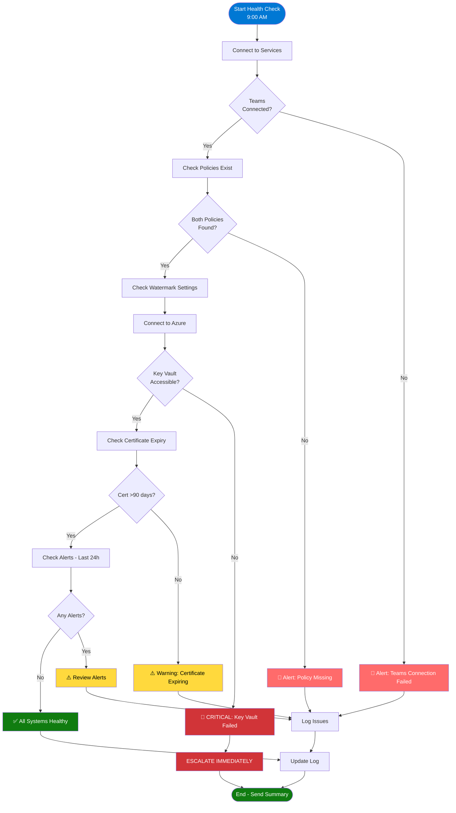

#### 3.1.2 Script

**Azure DevOps Repository:**  
`[AZURE_DEVOPS_REPO_LINK]/DailyHealthCheck.ps1`

```powershell
# ========================================
# Daily Health Check Script
# Owner: George Zarif
# Schedule: Every business day at 9:00 AM EST
# ========================================

Write-Host "`n╔══════════════════════════════════════════════════════════════════╗" -ForegroundColor Cyan
Write-Host "║  DAILY TEAMS PREMIUM HEALTH CHECK                               ║" -ForegroundColor Cyan
Write-Host "║  $(Get-Date -Format 'dddd, MMMM dd, yyyy - HH:mm')              ║" -ForegroundColor Cyan
Write-Host "╚══════════════════════════════════════════════════════════════════╝" -ForegroundColor Cyan

# Initialize report
$healthReport = @{
    Date = Get-Date
    TeamsService = "Unknown"
    KeyVaultAccess = "Unknown"
    PolicyStatus = "Unknown"
    Issues = @()
}

# Check 1: Teams Service Health
Write-Host "`n[1/4] Checking Teams service health..." -ForegroundColor Yellow
try {
    Connect-MicrosoftTeams -ErrorAction Stop
    $policies = Get-CsTeamsMeetingPolicy -ErrorAction Stop
    
    if ($policies.Count -gt 0) {
        $healthReport.TeamsService = "Healthy"
        Write-Host "  ✓ Teams service responding" -ForegroundColor Green
    }
} catch {
    $healthReport.TeamsService = "Error"
    $healthReport.Issues += "Teams service check failed: $($_.Exception.Message)"
    Write-Host "  ✗ Teams service error" -ForegroundColor Red
}

# Check 2: Key Vault Access
Write-Host "`n[2/4] Checking Key Vault access..." -ForegroundColor Yellow
try {
    Connect-AzAccount -ErrorAction Stop
    $keyVaults = @("lce-cmk-keyvault-1", "lce-cmk-keyvault-2")
    $kvHealthy = $true
    
    foreach ($kvName in $keyVaults) {
        $kv = Get-AzKeyVault -VaultName $kvName -ErrorAction Stop
        if ($kv) {
            Write-Host "  ✓ $kvName accessible" -ForegroundColor Green
        }
    }
    
    if ($kvHealthy) {
        $healthReport.KeyVaultAccess = "Healthy"
    }
} catch {
    $healthReport.KeyVaultAccess = "Error"
    $healthReport.Issues += "Key Vault access failed: $($_.Exception.Message)"
    Write-Host "  ✗ Key Vault error" -ForegroundColor Red
}

# Check 3: Policy Status
Write-Host "`n[3/4] Checking meeting policies..." -ForegroundColor Yellow
try {
    $securePolicy = Get-CsTeamsMeetingPolicy -Identity "Leonardo-Secure-Meeting-Group" -ErrorAction Stop
    $regularPolicy = Get-CsTeamsMeetingPolicy -Identity "Leonardo-Regular-Meeting-Group" -ErrorAction Stop
    
    if ($securePolicy -and $regularPolicy) {
        $healthReport.PolicyStatus = "Healthy"
        Write-Host "  ✓ Both policies exist" -ForegroundColor Green
        
        # Verify watermark settings
        if ($securePolicy.AllowWatermarkForCameraVideo -eq $true) {
            Write-Host "  ✓ Secure policy watermarks enabled" -ForegroundColor Green
        } else {
            $healthReport.Issues += "Secure policy watermarks not enabled"
            Write-Host "  ⚠️  Secure policy watermarks disabled" -ForegroundColor Yellow
        }
    }
} catch {
    $healthReport.PolicyStatus = "Error"
    $healthReport.Issues += "Policy check failed: $($_.Exception.Message)"
    Write-Host "  ✗ Policy error" -ForegroundColor Red
}

# Check 4: Recent Alerts
Write-Host "`n[4/4] Checking for recent alerts..." -ForegroundColor Yellow
$alerts = Get-AzAlert -TimeRange (New-TimeSpan -Hours 24) -ErrorAction SilentlyContinue

if ($alerts) {
    Write-Host "  ⚠️  $($alerts.Count) alert(s) in last 24 hours" -ForegroundColor Yellow
    $healthReport.Issues += "$($alerts.Count) Azure alerts in last 24 hours"
} else {
    Write-Host "  ✓ No alerts in last 24 hours" -ForegroundColor Green
}

# Summary
Write-Host "`n╔══════════════════════════════════════════════════════════════════╗" -ForegroundColor Cyan
Write-Host "║  SUMMARY                                                        ║" -ForegroundColor Cyan
Write-Host "╚══════════════════════════════════════════════════════════════════╝" -ForegroundColor Cyan

Write-Host "`nTeams Service: $($healthReport.TeamsService)" -ForegroundColor $(if($healthReport.TeamsService -eq "Healthy"){"Green"}else{"Red"})
Write-Host "Key Vault Access: $($healthReport.KeyVaultAccess)" -ForegroundColor $(if($healthReport.KeyVaultAccess -eq "Healthy"){"Green"}else{"Red"})
Write-Host "Policy Status: $($healthReport.PolicyStatus)" -ForegroundColor $(if($healthReport.PolicyStatus -eq "Healthy"){"Green"}else{"Red"})

if ($healthReport.Issues.Count -gt 0) {
    Write-Host "`n⚠️  Issues Found:" -ForegroundColor Yellow
    $healthReport.Issues | ForEach-Object { Write-Host "  • $_" -ForegroundColor Yellow }
    
    # Log issues
    $issueLog = "C:\LeonardoLogs\DailyHealthCheck-Issues-$(Get-Date -Format 'yyyy-MM-dd').log"
    $healthReport.Issues | Out-File -FilePath $issueLog -Append
    
    Write-Host "`n⚠️  ACTION REQUIRED: Review and resolve issues" -ForegroundColor Yellow
} else {
    Write-Host "`n✅ All systems healthy" -ForegroundColor Green
}

# Log results
$logPath = "C:\LeonardoLogs\DailyHealthCheck-$(Get-Date -Format 'yyyy-MM-dd').json"
$healthReport | ConvertTo-Json | Out-File -FilePath $logPath

Write-Host "`n✓ Health check logged: $logPath" -ForegroundColor Gray

Disconnect-MicrosoftTeams
Disconnect-AzAccount

Write-Host "`n✅ Daily health check complete`n" -ForegroundColor Green
```

#### 3.1.3 Actions Based on Results

| Status | Action | Priority |
|--------|--------|----------|
| All Healthy | Document and continue | None |
| 1 Warning | Investigate same day | Medium |
| 2+ Warnings | Investigate immediately | High |
| Any Error | Follow Incident Response | Critical |

### 3.2 Evening Backup (5:00 PM EST)

**Time Required:** 10 minutes  
**Responsible:** Primary Administrator (George Zarif)  
**Frequency:** Every business day

#### 3.2.1 Backup Process

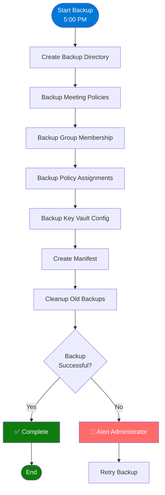

#### 3.2.2 Script

**Azure DevOps Repository:**  
`[AZURE_DEVOPS_REPO_LINK]/DailyBackup.ps1`

```powershell
# ========================================
# Daily Configuration Backup Script
# Owner: George Zarif
# Schedule: Every business day at 5:00 PM EST
# ========================================

Write-Host "`n╔══════════════════════════════════════════════════════════════════╗" -ForegroundColor Cyan
Write-Host "║  DAILY CONFIGURATION BACKUP                                     ║" -ForegroundColor Cyan
Write-Host "╚══════════════════════════════════════════════════════════════════╝" -ForegroundColor Cyan

Connect-MicrosoftTeams
Connect-MgGraph -Scopes "Group.Read.All", "User.Read.All"

$backupPath = "C:\LeonardoBackups\$(Get-Date -Format 'yyyy-MM-dd')"
New-Item -Path $backupPath -ItemType Directory -Force | Out-Null

# Backup 1: Meeting Policies
Write-Host "`n[1/4] Backing up meeting policies..." -ForegroundColor Yellow
$securePol = Get-CsTeamsMeetingPolicy -Identity "Leonardo-Secure-Meeting-Group"
$regularPol = Get-CsTeamsMeetingPolicy -Identity "Leonardo-Regular-Meeting-Group"

$securePol | ConvertTo-Json -Depth 10 | Out-File "$backupPath\SecurePolicy.json"
$regularPol | ConvertTo-Json -Depth 10 | Out-File "$backupPath\RegularPolicy.json"
Write-Host "  ✓ Policies backed up" -ForegroundColor Green

# Backup 2: Group Membership
Write-Host "`n[2/4] Backing up group membership..." -ForegroundColor Yellow
$group = Get-MgGroup -Filter "displayName eq 'LCE M365 Security'"
$members = Get-MgGroupMember -GroupId $group.Id -All

$memberList = @()
foreach ($member in $members) {
    $user = Get-MgUser -UserId $member.Id -Property DisplayName,UserPrincipalName,JobTitle
    $memberList += [PSCustomObject]@{
        DisplayName = $user.DisplayName
        Email = $user.UserPrincipalName
        JobTitle = $user.JobTitle
        MemberId = $member.Id
    }
}

$memberList | Export-Csv "$backupPath\GroupMembers.csv" -NoTypeInformation
Write-Host "  ✓ Group membership backed up ($($memberList.Count) members)" -ForegroundColor Green

# Backup 3: Policy Assignments
Write-Host "`n[3/4] Backing up policy assignments..." -ForegroundColor Yellow
$assignments = @()

foreach ($member in $memberList) {
    try {
        $userPolicy = Get-CsUserPolicyAssignment -Identity $member.Email -PolicyType TeamsMeetingPolicy
        $assignments += [PSCustomObject]@{
            User = $member.DisplayName
            Email = $member.Email
            PolicyName = $userPolicy.PolicyName
        }
    } catch {
        Write-Host "  ⚠️  Could not get policy for $($member.DisplayName)" -ForegroundColor Yellow
    }
}

$assignments | Export-Csv "$backupPath\PolicyAssignments.csv" -NoTypeInformation
Write-Host "  ✓ Policy assignments backed up" -ForegroundColor Green

# Backup 4: Key Vault Configuration
Write-Host "`n[4/4] Backing up Key Vault configuration..." -ForegroundColor Yellow
Connect-AzAccount

$kvConfig = @()
$keyVaults = @("lce-cmk-keyvault-1", "lce-cmk-keyvault-2")

foreach ($kvName in $keyVaults) {
    $kv = Get-AzKeyVault -VaultName $kvName
    $keys = Get-AzKeyVaultKey -VaultName $kvName
    
    $kvConfig += [PSCustomObject]@{
        VaultName = $kv.VaultName
        Location = $kv.Location
        ResourceGroup = $kv.ResourceGroupName
        Keys = ($keys | Select-Object Name, Enabled, Expires)
    }
}

$kvConfig | ConvertTo-Json -Depth 10 | Out-File "$backupPath\KeyVaultConfig.json"
Write-Host "  ✓ Key Vault configuration backed up" -ForegroundColor Green

# Create backup manifest
$manifest = @{
    BackupDate = Get-Date
    BackupPath = $backupPath
    GroupMemberCount = $memberList.Count
    PolicyCount = 2
    KeyVaultCount = $keyVaults.Count
    BackupFiles = Get-ChildItem $backupPath | Select-Object Name, Length
}

$manifest | ConvertTo-Json -Depth 10 | Out-File "$backupPath\Manifest.json"

# Cleanup old backups (keep 30 days)
Write-Host "`nCleaning up old backups..." -ForegroundColor Yellow
$oldBackups = Get-ChildItem "C:\LeonardoBackups" | 
    Where-Object {$_.CreationTime -lt (Get-Date).AddDays(-30)}

if ($oldBackups) {
    $oldBackups | Remove-Item -Recurse -Force
    Write-Host "  ✓ Removed $($oldBackups.Count) old backup(s)" -ForegroundColor Green
} else {
    Write-Host "  ✓ No old backups to remove" -ForegroundColor Green
}

Disconnect-MicrosoftTeams
Disconnect-MgGraph
Disconnect-AzAccount

Write-Host "`n✅ Daily backup complete: $backupPath`n" -ForegroundColor Green
```

#### 3.2.3 Backup Retention Policy

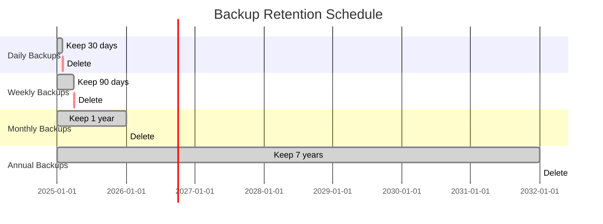

---

## 4. Weekly Operations

### 4.1 Monday: Policy Compliance Audit (10:00 AM EST)

**Time Required:** 30-45 minutes  
**Responsible:** Primary Administrator (George Zarif)  
**Frequency:** Every Monday

#### 4.1.1 Compliance Process

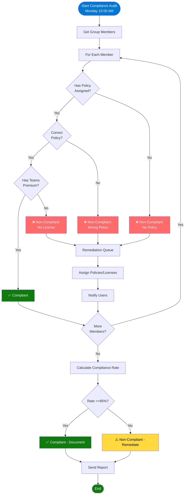

#### 4.1.2 Script

**Azure DevOps Repository:**  
`[AZURE_DEVOPS_REPO_LINK]/WeeklyComplianceAudit.ps1`

```powershell
# ========================================
# Weekly Compliance Audit Script
# Owner: George Zarif
# Schedule: Every Monday at 10:00 AM EST
# ========================================

Write-Host "`n╔══════════════════════════════════════════════════════════════════╗" -ForegroundColor Cyan
Write-Host "║  WEEKLY COMPLIANCE AUDIT                                        ║" -ForegroundColor Cyan
Write-Host "║  Week of $(Get-Date -Format 'MMMM dd, yyyy')                    ║" -ForegroundColor Cyan
Write-Host "╚══════════════════════════════════════════════════════════════════╝" -ForegroundColor Cyan

Connect-MicrosoftTeams
Connect-MgGraph -Scopes "Group.Read.All", "User.Read.All", "AuditLog.Read.All"

$reportPath = "C:\LeonardoReports\Weekly"
New-Item -Path $reportPath -ItemType Directory -Force | Out-Null

# Get group members
$group = Get-MgGroup -Filter "displayName eq 'LCE M365 Security'"
$members = Get-MgGroupMember -GroupId $group.Id -All

Write-Host "`nAuditing $($members.Count) group members..." -ForegroundColor Yellow

$complianceReport = @()

foreach ($member in $members) {
    $user = Get-MgUser -UserId $member.Id -Property DisplayName,UserPrincipalName
    
    Write-Host "  Checking: $($user.DisplayName)..." -ForegroundColor Gray
    
    # Check policy assignment
    $hasPolicy = $false
    $policyName = "None"
    
    try {
        $userPolicy = Get-CsUserPolicyAssignment -Identity $user.UserPrincipalName -PolicyType TeamsMeetingPolicy
        if ($userPolicy.PolicyName -like "Leonardo-*") {
            $hasPolicy = $true
            $policyName = $userPolicy.PolicyName
        }
    } catch {
        # No policy assigned
    }
    
    # Check Teams Premium license
    $hasLicense = $false
    $licenses = Get-MgUserLicenseDetail -UserId $user.Id
    if ($licenses.SkuPartNumber -contains "Microsoft_Teams_Premium") {
        $hasLicense = $true
    }
    
    # Determine compliance status
    $status = "Non-Compliant"
    $issues = @()
    
    if (!$hasPolicy) {
        $issues += "No policy assigned"
    }
    
    if (!$hasLicense) {
        $issues += "No Teams Premium license"
    }
    
    if ($hasPolicy -and $hasLicense) {
        $status = "Compliant"
    }
    
    $complianceReport += [PSCustomObject]@{
        User = $user.DisplayName
        Email = $user.UserPrincipalName
        HasPolicy = $hasPolicy
        PolicyName = $policyName
        HasLicense = $hasLicense
        Status = $status
        Issues = ($issues -join "; ")
        AuditDate = Get-Date -Format "yyyy-MM-dd HH:mm"
    }
}

# Generate summary
$compliant = ($complianceReport | Where-Object {$_.Status -eq "Compliant"}).Count
$nonCompliant = ($complianceReport | Where-Object {$_.Status -eq "Non-Compliant"}).Count
$complianceRate = [math]::Round(($compliant / $complianceReport.Count) * 100, 2)

Write-Host "`n╔══════════════════════════════════════════════════════════════════╗" -ForegroundColor Cyan
Write-Host "║  COMPLIANCE SUMMARY                                             ║" -ForegroundColor Cyan
Write-Host "╚══════════════════════════════════════════════════════════════════╝" -ForegroundColor Cyan

Write-Host "`nTotal Users: $($complianceReport.Count)" -ForegroundColor White
Write-Host "Compliant: $compliant ($complianceRate%)" -ForegroundColor Green
Write-Host "Non-Compliant: $nonCompliant" -ForegroundColor $(if($nonCompliant -gt 0){"Red"}else{"Green"})

# Export report
$reportFile = "$reportPath\Compliance-$(Get-Date -Format 'yyyy-MM-dd').csv"
$complianceReport | Export-Csv -Path $reportFile -NoTypeInformation
Write-Host "`n✓ Report saved: $reportFile" -ForegroundColor Green

# Show non-compliant users
if ($nonCompliant -gt 0) {
    Write-Host "`n⚠️  NON-COMPLIANT USERS:" -ForegroundColor Yellow
    $complianceReport | Where-Object {$_.Status -eq "Non-Compliant"} | 
        Select-Object User, Email, Issues | 
        Format-Table -AutoSize
    
    Write-Host "⚠️  ACTION REQUIRED: Remediate non-compliant users" -ForegroundColor Yellow
}

Disconnect-MicrosoftTeams
Disconnect-MgGraph

Write-Host "`n✅ Weekly compliance audit complete`n" -ForegroundColor Green
```

#### 4.1.3 Compliance Thresholds

| Compliance Rate | Status | Action Required |
|-----------------|--------|-----------------|
| 100% | ✅ Excellent | Document and continue |
| 95-99% | ⚠️ Good | Remediate within 48 hours |
| 90-94% | ⚠️ Warning | Immediate remediation |
| <90% | 🚨 Critical | Escalate to management |

### 4.2 Wednesday: Meeting Usage Review (2:00 PM EST)

**Time Required:** 20-30 minutes  
**Responsible:** Primary Administrator (George Zarif)  
**Frequency:** Every Wednesday

**Azure DevOps Repository:**  
`[AZURE_DEVOPS_REPO_LINK]/WeeklyUsageReview.ps1`

### 4.3 Friday: Documentation Updates (4:00 PM EST)

**Time Required:** 15-20 minutes  
**Responsible:** Primary Administrator (George Zarif)  
**Frequency:** Every Friday

**Tasks:**
- Update change log if changes were made
- Review and update runbooks for new issues
- Update known issues list
- Document workarounds discovered

---

## 5. Monthly Operations

### 5.1 Monthly Schedule Overview

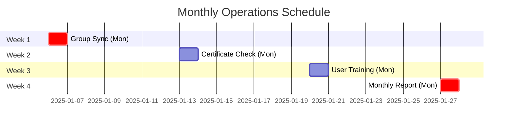

### 5.2 First Monday: Group Sync and Policy Refresh

**Time Required:** 45-60 minutes  
**Responsible:** Primary Administrator (George Zarif)

#### 5.2.1 Group Synchronization Flow

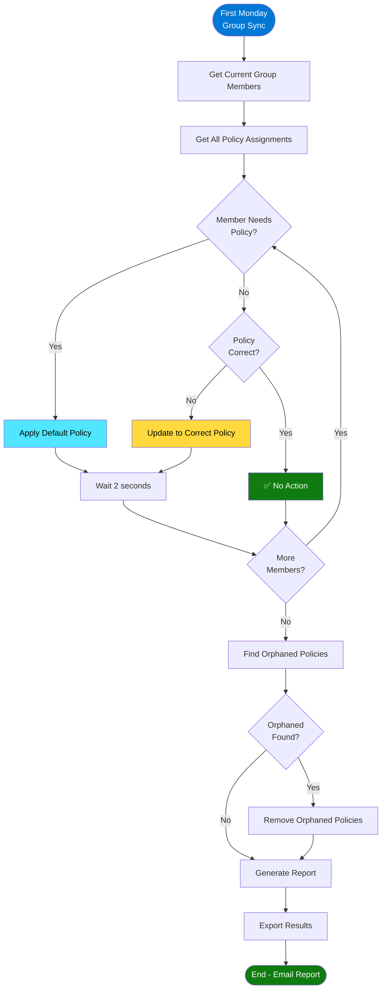

#### 5.2.2 Script

**Azure DevOps Repository:**  
`[AZURE_DEVOPS_REPO_LINK]/MonthlyGroupSync.ps1`

```powershell
# ========================================
# Monthly Group Synchronization Script
# Owner: George Zarif
# Schedule: First Monday of each month
# ========================================

Write-Host "`n╔══════════════════════════════════════════════════════════════════╗" -ForegroundColor Cyan
Write-Host "║  MONTHLY GROUP SYNCHRONIZATION                                  ║" -ForegroundColor Cyan
Write-Host "║  $(Get-Date -Format 'MMMM yyyy')                                ║" -ForegroundColor Cyan
Write-Host "╚══════════════════════════════════════════════════════════════════╝" -ForegroundColor Cyan

Connect-MicrosoftTeams
Connect-MgGraph -Scopes "Group.ReadWrite.All", "User.Read.All"

$groupName = "LCE M365 Security"
$group = Get-MgGroup -Filter "displayName eq '$groupName'"
$members = Get-MgGroupMember -GroupId $group.Id -All

Write-Host "`nGroup: $($group.DisplayName)" -ForegroundColor Yellow
Write-Host "Current Members: $($members.Count)" -ForegroundColor White

# Step 1: Verify all members have policies
Write-Host "`n[1/3] Verifying policy assignments..." -ForegroundColor Yellow

$needsPolicy = @()
$policyApplied = 0

foreach ($member in $members) {
    $user = Get-MgUser -UserId $member.Id -Property DisplayName,UserPrincipalName
    
    try {
        $policy = Get-CsUserPolicyAssignment -Identity $user.UserPrincipalName -PolicyType TeamsMeetingPolicy
        
        if ($policy.PolicyName -like "Leonardo-*") {
            $policyApplied++
        } else {
            $needsPolicy += $user
        }
    } catch {
        $needsPolicy += $user
    }
}

Write-Host "  Policies Applied: $policyApplied" -ForegroundColor Green
Write-Host "  Missing Policies: $($needsPolicy.Count)" -ForegroundColor $(if($needsPolicy.Count -gt 0){"Yellow"}else{"Green"})

# Step 2: Apply missing policies
if ($needsPolicy.Count -gt 0) {
    Write-Host "`n[2/3] Applying missing policies..." -ForegroundColor Yellow
    
    foreach ($user in $needsPolicy) {
        Write-Host "  Applying policy to: $($user.DisplayName)" -ForegroundColor Cyan
        Grant-CsTeamsMeetingPolicy -Identity $user.UserPrincipalName -PolicyName "Leonardo-Regular-Meeting-Group"
        Start-Sleep -Seconds 2
    }
    
    Write-Host "  ✓ Applied policies to $($needsPolicy.Count) user(s)" -ForegroundColor Green
} else {
    Write-Host "`n[2/3] All users have policies - no action needed" -ForegroundColor Green
}

# Step 3: Remove policies from non-members
Write-Host "`n[3/3] Checking for orphaned policy assignments..." -ForegroundColor Yellow

# Get all users with Leonardo policies
$allUsers = Get-CsOnlineUser | Where-Object {$_.TeamsMeetingPolicy -like "Leonardo-*"}
$memberEmails = $members | ForEach-Object {
    $u = Get-MgUser -UserId $_.Id -Property UserPrincipalName
    $u.UserPrincipalName
}

$orphanedPolicies = @()

foreach ($user in $allUsers) {
    if ($user.UserPrincipalName -notin $memberEmails) {
        $orphanedPolicies += $user
    }
}

if ($orphanedPolicies.Count -gt 0) {
    Write-Host "  ⚠️  Found $($orphanedPolicies.Count) orphaned policy assignment(s)" -ForegroundColor Yellow
    
    $orphanedPolicies | ForEach-Object {
        Write-Host "  Removing policy from: $($_.DisplayName)" -ForegroundColor Cyan
        Grant-CsTeamsMeetingPolicy -Identity $_.UserPrincipalName -PolicyName $null
    }
    
    Write-Host "  ✓ Removed orphaned policies" -ForegroundColor Green
} else {
    Write-Host "  ✓ No orphaned policies found" -ForegroundColor Green
}

# Generate summary report
$syncReport = [PSCustomObject]@{
    Date = Get-Date
    GroupMembers = $members.Count
    PoliciesApplied = $policyApplied
    PoliciesAdded = $needsPolicy.Count
    OrphanedRemoved = $orphanedPolicies.Count
}

$reportPath = "C:\LeonardoReports\Monthly\GroupSync-$(Get-Date -Format 'yyyy-MM').json"
$syncReport | ConvertTo-Json | Out-File $reportPath

Write-Host "`n✅ Monthly group synchronization complete" -ForegroundColor Green
Write-Host "   Report saved: $reportPath" -ForegroundColor Gray

Disconnect-MicrosoftTeams
Disconnect-MgGraph
```

### 5.3 Second Monday: Certificate Expiration Check

**Time Required:** 30 minutes  
**Responsible:** Primary Administrator (George Zarif)

**Azure DevOps Repository:**  
`[AZURE_DEVOPS_REPO_LINK]/MonthlyCertificateCheck.ps1`

### 5.4 Third Monday: User Training Refresher

**Time Required:** 60 minutes  
**Responsible:** IT Support Lead

See [Section 9: User Training](#9-user-training) for details.

### 5.5 Last Monday: Monthly Report Generation

**Time Required:** 45 minutes  
**Responsible:** Primary Administrator (George Zarif)

**Azure DevOps Repository:**  
`[AZURE_DEVOPS_REPO_LINK]/MonthlyReport.ps1`

---

## 6. Quarterly Operations

### 6.1 Quarterly Schedule

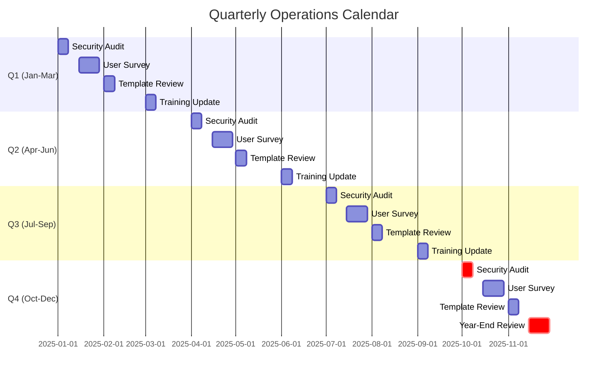

### 6.2 Comprehensive Security Audit

**Time Required:** 2-3 hours  
**Responsible:** Security Officer + George Zarif  
**Frequency:** First week of each quarter

**Scope:**
- Review all Key Vault access logs
- Audit all meeting policy assignments
- Review certificate rotation schedule
- Check for policy drift
- Verify backup integrity
- Test disaster recovery procedures
- Review user access patterns

### 6.3 User Satisfaction Survey

**Time Required:** 1 hour setup + 1 week collection  
**Responsible:** IT Support Lead  
**Frequency:** Second/third week of each quarter

**Survey Questions:**
1. How easy is it to create meetings with templates? (1-5)
2. Do you understand when to use Secure vs Regular? (Yes/No)
3. Have watermarks caused any issues? (Yes/No)
4. How satisfied are you with Teams Premium? (1-5)
5. What improvements would you suggest?

---

## 7. Annual Operations

### 7.1 Annual Calendar

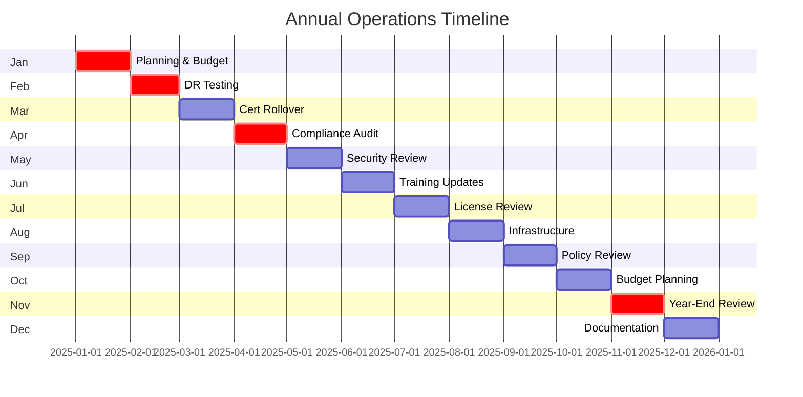

### 7.2 January: Annual Planning and Budget

**Time Required:** 1 week  
**Responsible:** George Zarif + Management

**Activities:**
1. License renewal planning
2. Infrastructure review
3. Training budget allocation

### 7.3 February: Disaster Recovery Testing

**Time Required:** 1 day (full DR test)  
**Responsible:** George Zarif + IT Team

See [Section 15: Emergency Procedures](#15-emergency-procedures) for test plan.

### 7.4 March: Certificate Rollover

**Time Required:** 2-3 hours per certificate  
**Responsible:** George Zarif

See [Section 12: Certificate Management](#12-certificate-management) for procedures.

### 7.5 November: Year-End Review

**Time Required:** 2-3 days  
**Responsible:** George Zarif + Management

**Deliverable:** Annual Operations Report

---

## 8. Monitoring & Alerting

### 8.1 Alert Architecture

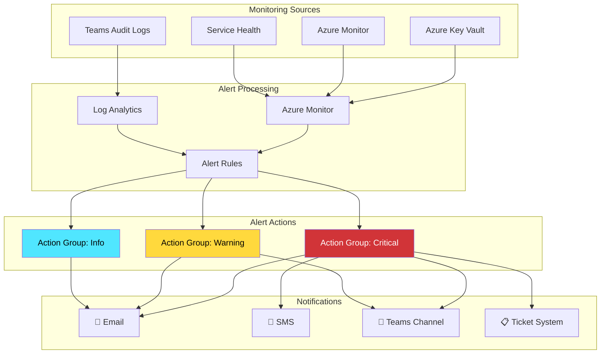

### 8.2 Critical Alert Rules

#### Alert 1: Key Vault Access Failure

```
Resource: Azure Key Vault
Signal: Key Vault Audit Event
Condition: Operation Name = "Key Access" AND Result = "Failed"
Threshold: > 3 failures in 5 minutes
Action Group: Critical (SMS + Email)
Severity: Critical (Sev 0)
```

#### Alert 2: Certificate Expiring Soon

```
Resource: Azure Key Vault
Signal: Days to Certificate Expiration
Condition: < 30 days
Action Group: Warning (Email)
Severity: Warning (Sev 2)
```

#### Alert 3: Policy Assignment Failure

```
Resource: Microsoft Teams (audit log)
Signal: Policy Assignment Event
Condition: Result = "Failed"
Threshold: > 5 failures in 1 hour
Action Group: Warning (Email)
Severity: High (Sev 1)
```

### 8.3 Log Analytics Queries

#### Query 1: Key Vault Access Audit

```kusto
AzureDiagnostics
| where ResourceProvider == "MICROSOFT.KEYVAULT"
| where TimeGenerated > ago(7d)
| where OperationName == "SecretGet" or OperationName == "KeyGet"
| summarize Count=count() by CallerIPAddress, identity_claim_appid_g, bin(TimeGenerated, 1h)
| order by Count desc
```

#### Query 2: Meeting Creation Patterns

```kusto
AuditLogs
| where TimeGenerated > ago(7d)
| where OperationName == "MeetingCreated"
| extend User = tostring(InitiatedBy.user.userPrincipalName)
| extend MeetingType = case(
    EventData contains "Watermark", "Secure",
    EventData contains "Leonardo-Secure", "Secure",
    EventData contains "Leonardo-Regular", "Regular",
    "Unknown"
)
| summarize Count=count() by User, MeetingType, bin(TimeGenerated, 1d)
| render timechart
```

---

## 9. User Training

### 9.1 Training Program Overview

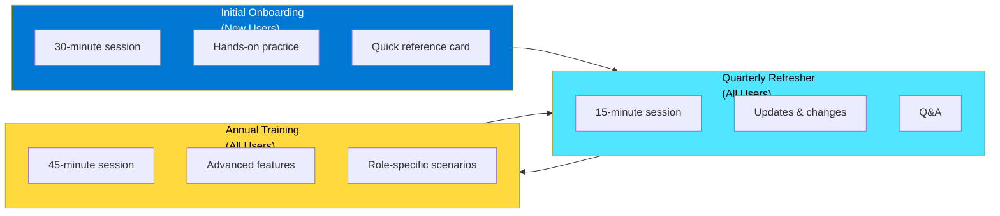

### 9.2 Initial Onboarding (New Group Members)

**Time Required:** 30 minutes per person  
**Delivery:** One-on-one or small group (max 5 people)  
**Responsible:** IT Support Lead

#### Training Agenda

| Time | Module | Content |
|------|--------|---------|
| 0-5 min | Overview | Why Teams Premium? Security obligations, Group purpose |
| 5-15 min | Templates | Secure vs Regular, When to use each, Decision tree |
| 15-25 min | Hands-On | Create Secure meeting, Create Regular meeting, View watermarks |
| 25-28 min | Troubleshooting | Common issues, Where to get help |
| 28-30 min | Q&A | Questions and answers |

#### Materials Provided

- Quick Reference Card (laminated)
- IT Support contact info
- Link to training materials
- Link to video tutorials

### 9.3 Training Effectiveness Measurement

**Metrics to Track:**
- % of new users completing training within 1 week
- Post-training quiz scores (aim for >90%)
- Compliance rate within 30 days of joining group
- Support ticket volume (should decrease with good training)

---

## 10. Incident Response

### 10.1 Incident Classification

| Severity | Description | Response Time | Escalation |
|----------|-------------|---------------|------------|
| **Sev 0** | Complete outage, security breach, Key Vault inaccessible | 15 minutes | Immediate to management + Microsoft |
| **Sev 1** | Major feature unavailable, policy not applying, cert <7 days | 1 hour | To management within 4 hours |
| **Sev 2** | Partial degradation, watermarks not working for some | 4 hours | To management within 24 hours if unresolved |
| **Sev 3** | Individual user issue, minor bug | 24 hours | None unless pattern emerges |

### 10.2 Incident Response Process

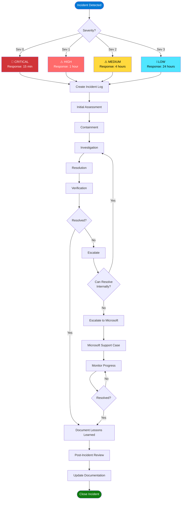

### 10.3 Common Incidents

#### Incident: Watermarks Not Appearing

**Symptoms:** User creates Secure meeting, watermarks don't appear

**Diagnosis Steps:**
1. Check policy assignment
2. Verify Teams Premium license
3. Confirm watermark settings in policy
4. Test with different user

**Resolution:**

**Azure DevOps Repository:**  
`[AZURE_DEVOPS_REPO_LINK]/IncidentResponse-WatermarksNotWorking.ps1`

```powershell
# Quick fix script for watermark issues
Connect-MicrosoftTeams

# Reapply policy
Grant-CsTeamsMeetingPolicy -Identity user@email.com -PolicyName $null
Start-Sleep -Seconds 30
Grant-CsTeamsMeetingPolicy -Identity user@email.com -PolicyName "Leonardo-Secure-Meeting-Group"

# Verify license
Connect-MgGraph -Scopes "User.Read.All"
$licenses = Get-MgUserLicenseDetail -UserId user@email.com
$licenses | Where-Object {$_.SkuPartNumber -eq "Microsoft_Teams_Premium"}

Disconnect-MicrosoftTeams
Disconnect-MgGraph

Write-Host "User should sign out/in to Teams and wait 24 hours" -ForegroundColor Yellow
```

---

## 11. Escalation Procedures

### 11.1 Escalation Decision Tree

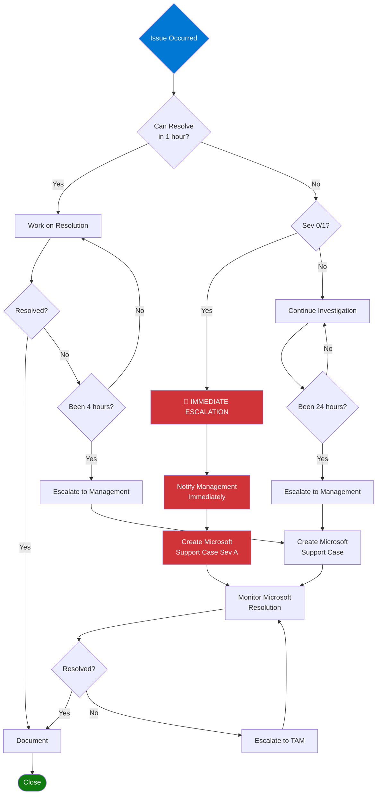

### 11.2 Escalation Contacts

| Issue Type | Primary Contact | Backup | Escalation Path |
|------------|----------------|--------|-----------------|
| Management | [Director Name] | [VP Name] | CTO |
| Microsoft Support | Support Portal | 1-800-936-3100 | TAM |
| Security Breach | Security Officer | CISO | Executive Team |
| Compliance | Compliance Officer | Legal | Audit Committee |

### 11.3 Microsoft Support Case Creation

**Prerequisites:**
- Tenant ID: ttiecm.onmicrosoft.com
- Affected user emails
- Timeline of issue
- Error messages and screenshots
- Diagnostics collected

**Method 1: Microsoft 365 Admin Center**

```
1. Navigate to: https://admin.microsoft.com
2. Support → New service request
3. Category: Teams & Skype for Business
4. Problem type: Policies
5. Attach diagnostics
6. Submit
```

**Method 2: Phone (Critical Only)**

```
Microsoft Premier Support: 1-800-936-3100
Say: "Critical Teams Premium issue - Sev A"
Have tenant ID ready
```

---

## 12. Certificate Management

### 12.1 Certificate Lifecycle

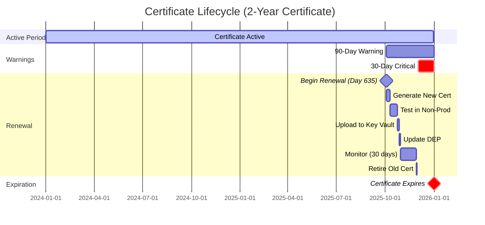

### 12.2 Certificate Renewal Process

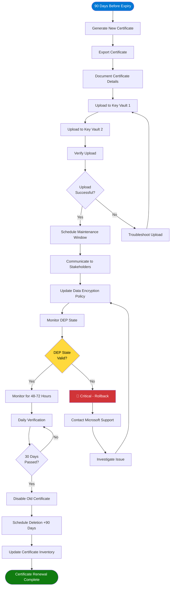

### 12.3 Scripts

**Generate Certificate:**  
**Azure DevOps Repository:** `[AZURE_DEVOPS_REPO_LINK]/Certificate-Generate.ps1`

**Upload to Key Vault:**  
**Azure DevOps Repository:** `[AZURE_DEVOPS_REPO_LINK]/Certificate-Upload.ps1`

**Update DEP:**  
**Azure DevOps Repository:** `[AZURE_DEVOPS_REPO_LINK]/Certificate-UpdateDEP.ps1`

**Verify Rollover:**  
**Azure DevOps Repository:** `[AZURE_DEVOPS_REPO_LINK]/Certificate-Verify.ps1`

**Retire Certificate:**  
**Azure DevOps Repository:** `[AZURE_DEVOPS_REPO_LINK]/Certificate-Retire.ps1`

---

## 13. Key Vault Operations

### 13.1 Key Vault Architecture

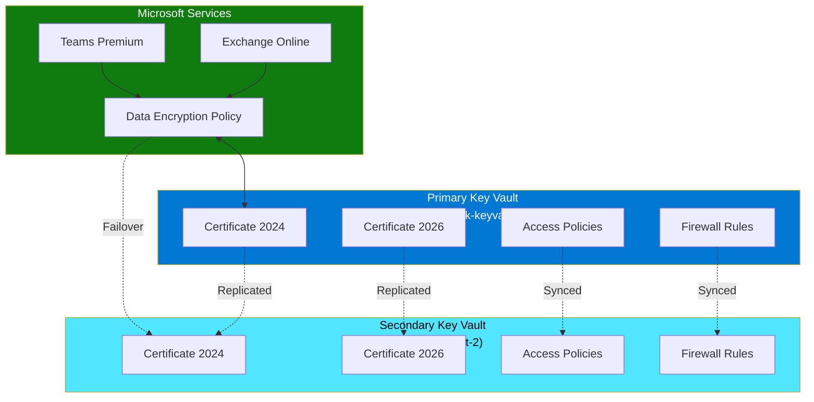

### 13.2 Daily Key Vault Health Check

Included in [Section 3.1: Daily Health Check](#31-morning-health-check-900-am-est)

### 13.3 Key Vault Access Management

**Add Service Principal:**

**Azure DevOps Repository:**  
`[AZURE_DEVOPS_REPO_LINK]/KeyVault-AddServicePrincipal.ps1`

**Remove Service Principal:**

**Azure DevOps Repository:**  
`[AZURE_DEVOPS_REPO_LINK]/KeyVault-RemoveServicePrincipal.ps1`

---

## 14. Compliance Reporting

### 14.1 Reporting Schedule

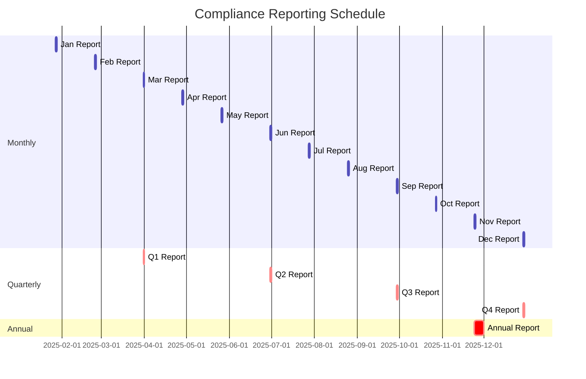

### 14.2 Monthly Compliance Report

**Generated:** Last Monday of each month  
**Responsible:** George Zarif

**Azure DevOps Repository:**  
`[AZURE_DEVOPS_REPO_LINK]/MonthlyComplianceReport.ps1`

**Report Includes:**
1. Group membership summary
2. Policy compliance rate
3. License assignment status
4. Certificate expiration status
5. Security incidents
6. User training completion
7. Meeting usage statistics
8. Secure vs Regular meeting ratio

**Distribution:**
- George Zarif (Primary Administrator)
- Backup Administrator
- Security Officer
- Management (Director level)

### 14.3 Quarterly Compliance Report

**More comprehensive than monthly**

**Additional Sections:**
- Trend analysis (3-month comparison)
- Risk assessment
- Audit log review
- Access control review
- Policy effectiveness analysis
- User feedback summary
- Improvement recommendations

### 14.4 Annual Compliance Report

**Comprehensive year-in-review**

**Sections:**
- Executive summary
- Annual metrics and KPIs
- Security posture assessment
- Incident summary and analysis
- Training effectiveness
- Budget vs actual
- Strategic recommendations
- Next year's roadmap

**Distribution:**
- Board of Directors
- All executives
- Compliance and legal teams
- External auditors
- Archived for 7 years

---

## 15. Emergency Procedures

### 15.1 Emergency Response Matrix

```mermaid
graph TD
    subgraph Emergencies["Emergency Scenarios"]
        E1[Complete Service Outage]
        E2[Key Vault Compromise]
        E3[DEP Failure]
        E4[Certificate Expired]
        E5[Administrator Unavailable]
    end
    
    subgraph Response["Immediate Response"]
        R1[Assess Impact]
        R2[Notify Stakeholders]
        R3[Activate DR Plan]
        R4[Contact Microsoft]
    end
    
    subgraph Recovery["Recovery Actions"]
        C1[Failover to Secondary]
        C2[Rotate All Keys]
        C3[Restore from Backup]
        C4[Emergency Cert Renewal]
        C5[Activate Backup Admin]
    end
    
    E1 --> R1
    E2 --> R1
    E3 --> R1
    E4 --> R1
    E5 --> R5[Access Break-Glass Account]
    
    R1 --> R2
    R2 --> R3
    R3 --> R4
    R5 --> R2
    
    R4 --> C1
    R4 --> C2
    R4 --> C3
    R4 --> C4
    R5 --> C5
    
    style E1 fill:#d13438,color:#fff
    style E2 fill:#d13438,color:#fff
    style E3 fill:#d13438,color:#fff
    style E4 fill:#d13438,color:#fff
    style E5 fill:#ff6b6b,color:#fff
```

### 15.2 Complete Service Outage

**If Teams Premium completely unavailable:**

#### Immediate Actions (0-15 minutes)

1. Verify outage scope (all users or LCE group only?)
2. Check Microsoft 365 Service Health Dashboard
3. Check Azure Status for Key Vault issues
4. Send notification to all affected users
5. Escalate to Microsoft (Sev A) if not a known outage

#### Communication Template

```
Subject: URGENT: Teams Premium Temporary Outage

Team,

We are currently experiencing an outage with Teams Premium features 
for the LCE M365 Security group.

IMPACT:
- Meeting templates may not be visible
- Watermarks may not function
- Use standard Teams meetings as temporary workaround

ACTION REQUIRED:
- For SECURE content: Postpone meeting or use alternative secure channel
- For REGULAR content: Proceed with standard Teams meeting

ESTIMATED RESOLUTION:
[Update as information becomes available]

We will provide updates every hour until resolved.

George Zarif
Primary Administrator
```

### 15.3 Key Vault Compromise

**If Key Vault potentially compromised:**

```mermaid
flowchart TD
    Start([🚨 Key Vault Compromise Detected]) --> A[DO NOT DISABLE KEY VAULT]
    A --> B[Contact Microsoft Azure Support<br/>Sev A - Immediately]
    B --> C[Notify Security Officer]
    C --> D[Notify Management]
    D --> E[Begin Incident Response]
    E --> F[Preserve All Logs]
    F --> G[Investigation]
    G --> H[Review Access Logs]
    H --> I[Identify Unauthorized Access]
    I --> J[Determine Scope]
    J --> K[Assess Data Exposure]
    K --> L[Remediation]
    L --> M[Rotate All Keys Immediately]
    M --> N[Update Access Policies]
    N --> O[Restrict Firewall Rules]
    O --> P[Implement Additional Monitoring]
    P --> Q[Document Incident]
    Q --> R[Post-Incident Review]
    R --> End([Close Incident])
    
    style Start fill:#d13438,color:#fff
    style A fill:#ff6b6b,color:#fff
    style B fill:#d13438,color:#fff
    style M fill:#ffd93d,color:#000
    style End fill:#107c10,color:#fff
```

### 15.4 Backup Administrator Unavailable

**If primary administrator unreachable:**

**Break-Glass Account:** emergency-admin@leonardocompany.ca

**Location of Credentials:** [Secure vault location - to be defined]

**Backup Administrator Actions:**
1. Access credentials from secure vault
2. Review last 24 hours of logs
3. Check for any open incidents
4. Run daily health check
5. Contact primary administrator
6. Notify management if primary unavailable >24 hours

---

## 16. Change Management

### 16.1 Change Process Flow

```mermaid
flowchart TD
    Start([Change Request]) --> A{Change<br/>Category?}
    
    A -->|Standard| B[Self-Approval]
    A -->|Significant| C[Manager Approval]
    A -->|Major| D[Director Approval]
    A -->|Emergency| E[Implement Immediately]
    
    B --> F{Testing<br/>Required?}
    C --> F
    D --> F
    
    F -->|Yes| G[Test in Dev]
    F -->|No| H[Skip Testing]
    
    G --> I{Test<br/>Passed?}
    I -->|Yes| J[Schedule Implementation]
    I -->|No| K[Fix Issues]
    K --> G
    H --> J
    
    J --> L[Communicate to Users]
    L --> M[Take Pre-Implementation Backup]
    M --> N[Implement Change]
    N --> O[Verify Success]
    O --> P{Change<br/>Successful?}
    P -->|Yes| Q[Monitor 24-48 Hours]
    P -->|No| R[Execute Rollback]
    
    R --> S[Investigate Failure]
    S --> T[Update Change Request]
    T --> F
    
    Q --> U[Update Documentation]
    U --> V[Post-Implementation Review]
    V --> W[Close Change Request]
    
    E --> X[Document Why Emergency]
    X --> N
    
    W --> End([Change Complete])
    
    style Start fill:#0078d4,color:#fff
    style End fill:#107c10,color:#fff
    style D fill:#ffd93d,color:#000
    style E fill:#d13438,color:#fff
    style R fill:#ff6b6b,color:#fff
```

### 16.2 Change Categories

| Category | Approval Required | Testing Required | Maintenance Window |
|----------|-------------------|------------------|-------------------|
| **Standard** | George Zarif (self-approval) | Dev environment | Business hours OK |
| **Significant** | Manager approval | Dev + UAT | Business hours OK |
| **Major** | Director approval | Dev + UAT + Pilot | Maintenance window required |
| **Emergency** | Post-implementation approval | None (document why) | As needed |

**Examples:**

**Standard Changes:**
- Add user to LCE M365 Security group
- Update documentation
- Apply policy to new user
- Generate routine reports

**Significant Changes:**
- Modify policy settings
- Update meeting templates
- Change group membership in bulk
- Update training materials

**Major Changes:**
- Certificate rollover
- Key Vault configuration changes
- Deploy new Intune policies
- Major version upgrades

**Emergency Changes:**
- Security breach response
- Critical bug fix
- Service restoration

---

## 17. Appendices

### 17.1 Appendix A: Acronyms and Definitions

| Term | Definition |
|------|------------|
| CMK | Customer Managed Keys |
| DEP | Data Encryption Policy |
| DR | Disaster Recovery |
| ITAR | International Traffic in Arms Regulations |
| KV | Key Vault |
| LCE | Leonardo Centre of Excellence |
| M365 | Microsoft 365 |
| Sev | Severity (incident classification) |
| SLA | Service Level Agreement |
| SOP | Standard Operating Procedure |
| TAM | Technical Account Manager |
| UAT | User Acceptance Testing |

### 17.2 Appendix B: Script Repository

All scripts are stored in Azure DevOps:

**Base Repository:** `[AZURE_DEVOPS_BASE_REPO_LINK]`

**Daily Scripts:**
- `DailyHealthCheck.ps1`
- `DailyBackup.ps1`
- `CertificateExpirationCheck.ps1`

**Weekly Scripts:**
- `WeeklyComplianceAudit.ps1`
- `WeeklyUsageReview.ps1`

**Monthly Scripts:**
- `MonthlyGroupSync.ps1`
- `MonthlyCertificateCheck.ps1`
- `MonthlyReport.ps1`

**Certificate Management:**
- `Certificate-Generate.ps1`
- `Certificate-Upload.ps1`
- `Certificate-UpdateDEP.ps1`
- `Certificate-Verify.ps1`
- `Certificate-Retire.ps1`

**Key Vault Management:**
- `KeyVault-AddServicePrincipal.ps1`
- `KeyVault-RemoveServicePrincipal.ps1`
- `KeyVault-UpdateFirewallRules.ps1`

**Incident Response:**
- `IncidentResponse-WatermarksNotWorking.ps1`
- `IncidentResponse-KeyVaultFailover.ps1`
- `IncidentResponse-EmergencyDiagnostics.ps1`

**Utilities:**
- `Sync-TeamsPremium-Group.ps1`
- `Export-Configuration.ps1`
- `Test-AllSystems.ps1`

### 17.3 Appendix C: Contact Information

**Internal Contacts:**

| Role | Name | Email | Phone | Hours |
|------|------|-------|-------|-------|
| Primary Administrator | George Zarif | george.zarif@leonardocompany.ca | [PHONE] | 8am-5pm EST |
| Backup Administrator | [TBD] | [EMAIL] | [PHONE] | 8am-5pm EST |
| IT Support Desk | Support Team | itsupport@leonardocompany.ca | [PHONE] | 24/7 |
| Security Officer | [TBD] | [EMAIL] | [PHONE] | 9am-5pm EST |
| Director, IT | [TBD] | [EMAIL] | [PHONE] | 9am-5pm EST |
| CISO | [TBD] | [EMAIL] | [PHONE] | 9am-5pm EST |
| Compliance Officer | [TBD] | [EMAIL] | [PHONE] | 9am-5pm EST |

**External Contacts:**

| Vendor | Service | Phone | Email |
|--------|---------|-------|-------|
| Microsoft | Premier Support | 1-800-936-3100 | [EMAIL] |
| Microsoft | Azure Support | 1-800-642-7676 | [EMAIL] |
| Microsoft TAM | [TAM Name] | [PHONE] | [EMAIL] |

### 17.4 Appendix D: Service Level Agreements

**Internal SLAs:**

| Metric | Target | Measurement |
|--------|--------|-------------|
| Policy Compliance Rate | ≥95% | Monthly audit |
| Certificate Renewal Lead Time | 90 days | Days before expiration |
| Daily Health Check Completion | 100% | Automated log |
| Backup Success Rate | ≥99% | Monthly review |
| Incident Response Time (Sev 0) | ≤15 minutes | Incident logs |
| Incident Response Time (Sev 1) | ≤1 hour | Incident logs |
| Incident Response Time (Sev 2) | ≤4 hours | Incident logs |
| New User Onboarding | ≤48 hours | HR system |
| User Training Completion | 100% within 1 week | Training database |
| Documentation Currency | Updated within 7 days | Document review |

**Microsoft SLAs:**

| Service | SLA | Details |
|---------|-----|---------|
| Microsoft 365 Uptime | 99.9% | Per service agreement |
| Azure Key Vault | 99.9% | Per Azure SLA |
| Azure Support Response (Sev A) | 1 hour | Premier Support Agreement |
| Azure Support Response (Sev B) | 4 hours | Premier Support Agreement |

### 17.5 Appendix E: Troubleshooting Decision Tree

```mermaid
flowchart TD
    Start{Problem<br/>Occurred?} --> A{What's the<br/>issue?}
    
    A -->|Templates not visible| B[Templates Issue]
    A -->|Watermarks not working| C[Watermarks Issue]
    A -->|Key Vault errors| D[Key Vault Issue]
    A -->|Policy not applying| E[Policy Issue]
    
    B --> B1{User in<br/>group?}
    B1 -->|No| B2[Add to group]
    B1 -->|Yes| B3{Has<br/>policy?}
    B3 -->|No| B4[Apply policy]
    B3 -->|Yes| B5{Signed<br/>out/in?}
    B5 -->|No| B6[Sign out/in]
    B5 -->|Yes| B7{>24 hours<br/>since policy?}
    B7 -->|No| B8[Wait]
    B7 -->|Yes| B9[Escalate to Microsoft]
    
    C --> C1{Using Secure<br/>template?}
    C1 -->|No| C2[Use Secure template]
    C1 -->|Yes| C3{Has Teams<br/>Premium?}
    C3 -->|No| C4[Assign license]
    C3 -->|Yes| C5{Policy settings<br/>correct?}
    C5 -->|No| C6[Fix policy]
    C5 -->|Yes| C7[Escalate to Microsoft]
    
    D --> D1{Azure<br/>healthy?}
    D1 -->|No| D2[Wait for Microsoft]
    D1 -->|Yes| D3{Service principal<br/>valid?}
    D3 -->|No| D4[Renew credentials]
    D3 -->|Yes| D5{Firewall<br/>blocking?}
    D5 -->|Yes| D6[Update firewall]
    D5 -->|No| D7[Fail over to secondary]
    
    E --> E1{Member of<br/>group?}
    E1 -->|No| E2[Add to group]
    E1 -->|Yes| E3{Reapply<br/>policy?}
    E3 -->|Yes| E4[Grant policy]
    E3 -->|No| E5[Escalate]
    
    B2 --> F[Run sync script]
    B4 --> F
    B6 --> F
    B8 --> F
    C4 --> F
    C6 --> F
    D4 --> F
    D6 --> F
    E2 --> F
    E4 --> F
    
    F --> G{Resolved?}
    G -->|Yes| H[Document solution]
    G -->|No| I[Create incident]
    
    B9 --> I
    C7 --> I
    D7 --> I
    E5 --> I
    D2 --> I
    
    H --> End([Complete])
    I --> End
    
    style Start fill:#0078d4,color:#fff
    style End fill:#107c10,color:#fff
    style H fill:#107c10,color:#fff
    style I fill:#ff6b6b,color:#fff
```

### 17.6 Appendix F: Monthly Compliance Checklist

```
MONTHLY COMPLIANCE CHECKLIST
═══════════════════════════════════════════════════════════════════
Month: ________________  Completed by: George Zarif  Date: ________

POLICY COMPLIANCE
───────────────────────────────────────────────────────────────────
☐ All group members have Teams Premium license
☐ All group members have meeting policy assigned
☐ No orphaned policy assignments
☐ Policy settings match approved configuration
☐ Compliance rate ≥95%

SECURITY COMPLIANCE
───────────────────────────────────────────────────────────────────
☐ Key Vault accessible and healthy
☐ Certificates valid for >90 days
☐ No unauthorized Key Vault access attempts
☐ Firewall rules reviewed and current
☐ Service principal permissions reviewed
☐ Data Encryption Policy in Valid state

OPERATIONAL COMPLIANCE
───────────────────────────────────────────────────────────────────
☐ Daily health checks completed (all days)
☐ Daily backups successful (all days)
☐ Weekly compliance audit completed
☐ All incidents documented and resolved
☐ No outstanding Sev 1 or Sev 2 incidents
☐ Change management process followed

DOCUMENTATION COMPLIANCE
───────────────────────────────────────────────────────────────────
☐ All changes documented in change log
☐ Incident logs complete
☐ Certificate inventory current
☐ Contact list current
☐ Runbooks updated for new issues

TRAINING COMPLIANCE
───────────────────────────────────────────────────────────────────
☐ All new users trained within 1 week
☐ Training materials current
☐ Training database updated
☐ User satisfaction survey sent (quarterly)

AUDIT COMPLIANCE
───────────────────────────────────────────────────────────────────
☐ Monthly report generated and distributed
☐ Audit logs reviewed for anomalies
☐ Access reviews completed
☐ Compliance metrics tracked

NOTES / EXCEPTIONS:
───────────────────────────────────────────────────────────────────


APPROVAL:
───────────────────────────────────────────────────────────────────
Primary Administrator: George Zarif       Date: __________
Security Officer: ________________        Date: __________
```

---

## Revision History

| Version | Date | Author | Changes |
|---------|------|--------|---------|
| 1.0 | 2025-11-17 | George Zarif | Initial release |
| | | | |
| | | | |

---

## Document Approval

**Prepared by:**  
George Zarif, Primary Administrator  
Date: November 17, 2025

**Reviewed by:**  
[IT Manager Name], IT Manager  
Date: _________________

**Approved by:**  
[Director Name], Director of IT  
Date: _________________

**Next Review Date:** February 17, 2026

---

**END OF DOCUMENT**

═══════════════════════════════════════════════════════════════════

For questions or suggestions regarding this SOP, please contact:

**George Zarif**  
Primary Administrator  
Leonardo Company - Centre of Excellence  
Email: george.zarif@leonardocompany.ca  
Phone: [PHONE]

**Document Storage:**  
Local: `C:\LeonardoDocs\SOP_Teams_Premium_Operations.md`  
Backup: Daily automated backup to secure storage

**Script Repository:**  
Azure DevOps: `[AZURE_DEVOPS_BASE_REPO_LINK]`

═══════════════════════════════════════════════════════════════════