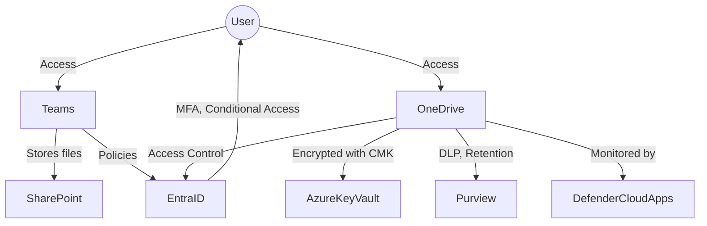

## 🌟 Objectives

Ensure that:

* ✅ Only **authenticated, invited users** (with MFA) can access meetings.
* ❌ Forwarded invites do not allow unintended access.
* 🔐 All content is **protected with strong encryption**, including optional **Customer-Managed Keys (CMK)**.
* 🌐 Teams and OneDrive traffic is controlled via **Private Endpoints**.
* 🛡️ All Microsoft 365 collaboration features are hardened using enterprise-grade security practices.

---

## 1. 🔑 Enforce MFA for Guests and External Users

### ✅ Setup with Conditional Access (Entra ID)

Enforce MFA for all guests and external users using Conditional Access:

1. Go to **Microsoft Entra admin center** → **Protection** → **Conditional Access** → `+ New policy`
2. **Assignments**:

   * **Users**: Select *All guest and external users*
   * **Cloud apps or actions**: Select *Microsoft Teams* and *Exchange Online*
3. **Access Controls**:

   * Grant access: ✅ *Require multi-factor authentication*
4. Enable policy: ✅ On

📘 [Docs](https://learn.microsoft.com/en-us/entra/identity/conditional-access/howto-conditional-access-policy-all-users-mfa)

---

## 2. 🚫 Block Forwarded Meeting Invites

### Option A: Per-Meeting Settings

1. In Teams or Outlook, open the **Meeting Options**.
2. Set:

   * `Who can bypass the lobby`: **Only people I invite**
   * `Always let callers bypass the lobby`: **No**

### Option B: Org-Wide PowerShell Settings

```powershell
Connect-MicrosoftTeams

Set-CsTeamsMeetingPolicy -Identity Global `
  -AllowAnonymousUsersToJoinMeeting $false `
  -AutoAdmittedUsers "EveryoneInCompany"
```

📘 [Meeting policies](https://learn.microsoft.com/en-us/microsoftteams/meeting-policies-in-teams)

---

## 3. 🧱 Restrict Join Access to Invited Emails

### ✅ Entra External Collaboration Settings

1. Go to **Microsoft Entra admin center** → **External Identities** → **External collaboration settings**
2. Set:

   * ✅ *Guest users must sign in with the same account they were invited with*
   * ✅ *Enforce MFA for guests*
   * ❌ *Guests can invite others*

📘 [External collaboration docs](https://learn.microsoft.com/en-us/entra/external-id/)

---

## 4. 🗝️ Microsoft Teams + Customer Key (CMK)

### 🔐 What is Customer Key?

Customer Key lets you use **your own encryption keys** (stored in Azure Key Vault) to protect Teams data-at-rest:

* Teams messages and call records
* Files in SharePoint and OneDrive (used by Teams)

### 🧩 Requirements

* Microsoft 365 E5 + Microsoft Purview Advanced Compliance add-on
* Azure Key Vault with:

  * Soft delete and purge protection
  * Your own RSA 2048+ keys

### 🛠️ Setup

1. Create a Key Vault and import or generate your key.
2. Assign Microsoft 365 access to your vault (via Azure roles).
3. Go to **Microsoft Purview** → **Customer Key**
4. Configure keys for:

   * Exchange Online
   * SharePoint Online (includes Teams file storage)
   * Teams chat encryption

📘 [Customer Key overview](https://learn.microsoft.com/en-us/microsoft-365/compliance/customer-key-overview)

---

## 5. 🌐 Microsoft Teams + Private Endpoints

### 🔒 What are Private Endpoints?

Private Endpoints allow Microsoft 365 traffic (e.g., Teams, SharePoint, Graph API) to stay **within your Azure VNet** — never over the public internet.

### 🛠️ Setup Overview

1. Create **Private DNS Zones** for:

   * `privatelink.sharepoint.com`
   * `privatelink.microsoft.com`
   * `privatelink.teams.microsoft.com` *(if required)*
2. Set up **Private Endpoints** in your Azure VNet for:

   * SharePoint (used by Teams)
   * Microsoft Graph APIs
   * Office 365 services
3. **Link** DNS zones to your VNet.
4. Enforce traffic routing via **Azure Firewall or Proxy**.

📘 [Office 365 Private Endpoint](https://learn.microsoft.com/en-us/microsoft-365/enterprise/microsoft-365-private-endpoints)

---

## 6. 🔐 Microsoft Teams Security Features: Setup Guide

Detailed configurations for Teams security features:

* Information Barriers
* DLP
* Sensitivity Labels
* Safe Attachments
* Safe Links
* Retention Policies
* Audit Logging
* eDiscovery
* Access Reviews
* Microsoft Defender XDR

*(This section would list individual step-by-step setups as described in prior detailed guidance.)*

---

## ☁️ OneDrive for Business: Security Best Practices

In organizations that rely heavily on Microsoft Teams, OneDrive is a critical file storage backend. Use the following best practices to secure OneDrive in a heightened security context:

### 1. 🔐 Enable Sensitivity Labels for Files

* Use Microsoft Purview to auto-label files stored in OneDrive.
* Apply encryption and access controls based on label sensitivity.

### 2. 📂 Block External Sharing by Default

* SharePoint Admin Center → Policies → Sharing
* Set OneDrive external sharing to **"Only people in your organization"** or **"Existing guests only"**.

### 3. 🧾 Enable Auditing and Alerts

* Enable auditing for file access and sharing via Microsoft Purview.
* Set alerts on abnormal access patterns (e.g., mass downloads).

### 4. 🧰 Apply Conditional Access to OneDrive

* Use policies that enforce MFA, restrict locations/devices, and block legacy authentication.
* Apply device compliance checks before granting access.

### 5. 🕵️‍♀️ Monitor with Defender for Cloud Apps

* Use Microsoft Defender for Cloud Apps (MCAS) to:

  * Detect risky sharing behavior
  * Block downloads on unmanaged devices
  * Investigate OneDrive file movement and link usage

### 6. 🧼 Retention + DLP

* Apply Microsoft Purview DLP to monitor and prevent sharing of sensitive data.
* Use retention policies to govern how long OneDrive files are kept.

### 7. 🛑 Disable Anonymous Links

* Prevent usage of Anyone-with-the-link sharing across the organization.
* Restrict to **people with existing access** or **specific people** only.

### 8. 🗝️ CMK for SharePoint/OneDrive

* Use Customer Key (CMK) to encrypt OneDrive data at rest.
* Configure via Microsoft Purview and Azure Key Vault.

---

## ✅ OneDrive Security Checklist

| Security Goal                       | Solution/Setting                                |
| ----------------------------------- | ----------------------------------------------- |
| Encrypt files with labels           | Sensitivity Labels via Microsoft Purview        |
| Block anonymous/external sharing    | SharePoint Admin > Sharing Policy               |
| Detect risky downloads or sharing   | Defender for Cloud Apps + Alerts                |
| Control access with MFA and devices | Conditional Access + Device Compliance          |
| Prevent sensitive data leakage      | DLP policies in Microsoft Purview               |
| Retain or delete old data           | Retention Policies (Microsoft Purview)          |
| Use customer-owned encryption keys  | CMK for SharePoint/OneDrive via Azure Key Vault |
| Monitor user activity               | Audit Logs + Defender for Cloud Apps            |

---

## 📊 Architecture Diagram

### Teams + OneDrive Integrated Security


---
