# Teams Premium Implementation Plan for Leonardo Company

## Leveraging Customer Key Infrastructure for Maximum Security

---

## Executive Summary

This implementation plan outlines the deployment of Microsoft Teams Premium to complement Leonardo Company's existing Customer Managed Key (CMK) infrastructure. The combination creates an industry-leading secure collaboration platform suitable for defense sector requirements.

### Key Benefits

* **Enhanced Security** : E2E encryption + CMK creates multi-layered protection
* **Compliance** : Meets ITAR and government contractor requirements
* **Productivity** : AI features save 2-3 hours/user/week
* **ROI** : Positive return within 3 months

---

## Table of Contents

1. [Current State Assessment](#current-state-assessment)
2. [Implementation Phases](#implementation-phases)
3. [Technical Architecture](#technical-architecture)
4. [Security Configuration](#security-configuration)
5. [Rollout Strategy](#rollout-strategy)
6. [Training Plan](#training-plan)
7. [Monitoring &amp; Compliance](#monitoring-compliance)
8. [Cost Analysis](#cost-analysis)
9. [Risk Management](#risk-management)
10. [Success Metrics](#success-metrics)

---

## Current State Assessment

### Existing Infrastructure

```
✅ Customer Key Implementation
   - Status: Enabled (Request ID: d059b0dc-7949-4a49-830b-74dc57af0787)
   - Key Vaults: Configured and operational
   - DEP: Pending cmdlet availability (24-72 hours)
   
✅ Azure Monitoring
   - Log Analytics: Ready for deployment
   - Key Vault diagnostics: Configured
   
✅ User Base
   - Licensed Users: [To be determined]
   - Current Teams Usage: Standard features
   - Security Clearance Levels: Various
```

### Gap Analysis

| Requirement             | Current State     | Target State  | Gap                  |
| ----------------------- | ----------------- | ------------- | -------------------- |
| Data at Rest Encryption | CMK (Pending DEP) | CMK Active    | 24-72 hours          |
| E2E Encryption          | Not available     | Premium E2E   | License needed       |
| AI Meeting Intelligence | Not available     | Full AI suite | License needed       |
| Meeting Protection      | Basic             | Advanced DRM  | License needed       |
| Compliance Reporting    | Manual            | Automated     | Configuration needed |

---

## Implementation Phases

### Phase 1: Foundation (Week 1)

#### Days 1-2: License Procurement

```powershell
# Verify current licensing
Get-MsolAccountSku | Where-Object {$_.SkuPartNumber -like "*TEAMS*"}

# Users requiring Premium
$premiumUsers = @(
    "fred.pearson@leonardocompany.ca",  # Administrator/Pilot
    # Add executive team
    # Add project managers
    # Add client-facing staff
)
```

#### Days 3-4: CMK DEP Completion

```powershell
# Verify DEP availability
Get-Command New-DataEncryptionPolicy -ErrorAction SilentlyContinue

# Create and apply DEP
$depName = "CMK-DEP-Leonardo-Premium"
New-DataEncryptionPolicy `
    -Name $depName `
    -Description "Leonardo Teams Premium + CMK Policy" `
    -AzureKeyIDs @($keyUri1, $keyUri2)

# Apply to premium users
$premiumUsers | ForEach-Object {
    Set-Mailbox -Identity $_ -DataEncryptionPolicy $depName
}
```

#### Days 5: Initial Configuration

```powershell
# Create Teams Premium policies
New-CsTeamsMeetingPolicy -Identity "Leonardo-Premium-Secure" `
    -AllowWatermarkForCameraVideo $true `
    -AllowWatermarkForScreenSharing $true `
    -AllowEndToEndEncryption $true `
    -WhoCanRegister "EveryoneInCompany"
```

### Phase 2: Security Hardening (Week 2)

#### Meeting Templates

```json
{
  "templateName": "Leonardo-Classified-Meeting",
  "settings": {
    "allowRecording": true,
    "recordingStorageMode": "OneDriveForBusiness",
    "allowTranscription": true,
    "allowCloudRecording": true,
    "allowWatermark": true,
    "allowE2EEncryption": true,
    "restrictedAnonymousAccess": true,
    "encryptionPolicy": "CMK-DEP-Leonardo-Premium"
  }
}
```

#### Sensitivity Labels

```powershell
# Create sensitivity labels for meetings
New-Label -Name "Leonardo-Confidential" `
    -DisplayName "Leonardo Confidential" `
    -EncryptionEnabled $true `
    -EncryptionProtectionType "Template" `
    -MeetingProtectionEnabled $true `
    -WatermarkEnabled $true
```

### Phase 3: Premium Features Enablement (Week 3)

#### AI Features Configuration

```powershell
# Enable Intelligent Recap
Set-CsTeamsMeetingPolicy -Identity "Leonardo-Premium-Secure" `
    -AllowMeetingRecap $true `
    -AllowAIGeneratedNotes $true

# Configure live translation
Set-CsTeamsTranslationPolicy -Identity "Global" `
    -AllowTranslation $true `
    -TranslationLanguages @("en","fr","es","it","de")
```

#### Virtual Appointments

```powershell
# Configure for client meetings
New-CsTeamsVirtualAppointmentPolicy -Identity "Leonardo-Client-Meetings" `
    -EnableSmsNotifications $true `
    -EnableCustomerReminders $true `
    -PreAppointmentBuffer 15 `
    -PostAppointmentBuffer 15
```

### Phase 4: Integration & Monitoring (Week 4)

#### Extend Azure Monitor

```kusto
// Premium feature usage query
TeamsData
| where Feature in ("IntelligentRecap", "E2ECall", "LiveTranslation", "Watermark")
| where TimeGenerated > ago(7d)
| summarize UsageCount = count() by Feature, bin(TimeGenerated, 1h)
| render timechart

// CMK + Premium operations
AzureDiagnostics
| where ResourceType == "VAULTS"
| where identity_claim_appid_g == "00000004-0000-0ff1-ce00-000000000000" // Teams
| where OperationName contains "Premium" or key_s contains "transcript"
| project TimeGenerated, Operation=OperationName, Protected="CMK+Premium"
```

---

## Technical Architecture

### Security Layers

```
┌─────────────────────────────────────────────────────┐
│          Client Device (Teams Client)               │
├─────────────────────────────────────────────────────┤
│                    Layer 4                          │
│         E2E Encryption (Premium 1:1 Calls)          │
├─────────────────────────────────────────────────────┤
│                    Layer 3                          │
│          TLS 1.3 (Transport Security)               │
├─────────────────────────────────────────────────────┤
│                    Layer 2                          │
│      Teams Premium Security (Watermarks, DRM)       │
├─────────────────────────────────────────────────────┤
│                    Layer 1                          │
│         CMK Encryption (Your Azure Keys)            │
├─────────────────────────────────────────────────────┤
│              Data at Rest (Protected)               │
└─────────────────────────────────────────────────────┘
```

### Data Flow with Premium + CMK

```mermaid
graph LR
    A[User Creates Meeting] -->|Premium Features| B[AI Processing]
    B -->|Transcript/Summary| C[Teams Service]
    C -->|Encrypt with CMK| D[Azure Key Vault]
    D -->|Your Keys| E[Encrypted Storage]
    E -->|CMK Protected| F[SharePoint/OneDrive]
  
    style D fill:#f96,stroke:#333,stroke-width:4px
    style E fill:#9f9,stroke:#333,stroke-width:2px
```



---

## Security Configuration

### Premium Security Settings

```powershell
# Master security configuration script
$securityConfig = @{
    # Meeting Policies
    MeetingPolicies = @{
        AllowWatermarkForCameraVideo = $true
        AllowWatermarkForScreenSharing = $true
        WatermarkText = "Leonardo Company - Confidential"
        AllowEndToEndEncryption = $true
        RequireAuthentication = $true
        RestrictedAnonymousAccess = $true
    }
  
    # Recording Policies
    RecordingPolicies = @{
        RecordingStorageMode = "OneDriveForBusiness"
        AllowCloudRecording = $true
        AllowTranscription = $true
        TranscriptionProfanityPolicy = "Masked"
        ChannelRecordingDownload = "Deny"
    }
  
    # AI Policies
    AIPolicies = @{
        AllowMeetingRecap = $true
        AllowAIGeneratedNotes = $true
        RestrictContentToOrganization = $true
        EncryptAIContent = $true  # Uses CMK
    }
}

# Apply configuration
foreach ($policy in $securityConfig.Keys) {
    Write-Host "Configuring $policy..." -ForegroundColor Cyan
    # Apply settings based on policy type
}
```

### Compliance Integration

```powershell
# Link Premium features to compliance center
Connect-IPPSSession -UserPrincipalName "fred.pearson@leonardocompany.ca"

# Create compliance policy for Premium content
New-CompliancePolicy -Name "Teams-Premium-CMK-Protection" `
    -SharePointLocation "All" `
    -OneDriveLocation "All" `
    -TeamsChannelLocation "All" `
    -TeamsChatLocation "All"
```

---

## Rollout Strategy

### Pilot Phase (Week 1-2)

```powershell
# Pilot group selection
$pilotUsers = @{
    "IT Team" = @(
        "fred.pearson@leonardocompany.ca",
        # Add IT team members
    )
    "Executive Sponsors" = @(
        # Add executives
    )
    "Power Users" = @(
        # Add key stakeholders
    )
}

# Assign licenses to pilot
$pilotUsers.Values | ForEach-Object {
    Set-MsolUserLicense -UserPrincipalName $_ `
        -AddLicenses "leonardocompany:TEAMS_PREMIUM"
}
```

### Phased Rollout Plan

| Phase   | Week | Department         | Users | Focus              |
| ------- | ---- | ------------------ | ----- | ------------------ |
| Pilot   | 1-2  | IT & Executives    | 10-15 | Testing & Feedback |
| Phase 1 | 3-4  | Project Management | 20-30 | Client meetings    |
| Phase 2 | 5-6  | Engineering        | 50-75 | Collaboration      |
| Phase 3 | 7-8  | All Staff          | 100+  | Full deployment    |

### Communication Plan

```markdown
## Email Template - Teams Premium Launch

Subject: Enhanced Security & AI Features Coming to Teams

Dear Team,

Leonardo Company is upgrading to Teams Premium, which combined with our 
Customer Managed Keys provides industry-leading security for our 
defense sector work.

**New Capabilities:**
- AI-powered meeting summaries
- Live translation in 40+ languages
- End-to-end encryption for sensitive calls
- Watermarked meetings
- Professional virtual appointments

**Your Action Required:**
- Attend training session: [Date]
- Review security guidelines: [Link]
- Test new features in pilot program

**Security Note:**
All Premium features are protected by our Customer Managed Encryption Keys.
Your data remains under Leonardo Company control at all times.

Questions? Contact: it-support@leonardocompany.ca
```

---

## Training Plan

### Training Modules

#### Module 1: Security First (1 hour)

```markdown
1. Understanding CMK + Premium Protection
   - How your data is double-encrypted
   - When to use E2E encryption
   - Watermark requirements

2. Sensitivity Labels
   - Applying labels to meetings
   - Understanding restrictions
   - Client meeting protocols

3. Compliance Requirements
   - Recording policies
   - Data retention with CMK
   - Audit trail access
```

#### Module 2: AI Productivity (45 minutes)

```markdown
1. Intelligent Recap
   - Accessing AI summaries
   - Finding action items
   - Sharing secure summaries

2. Live Translation
   - Enabling for international meetings
   - Supported languages
   - Quality considerations

3. Meeting Intelligence
   - Speaker timeline
   - Chapter navigation
   - Search within recordings
```

#### Module 3: Premium Meeting Management (30 minutes)

```markdown
1. Virtual Appointments
   - Scheduling client meetings
   - SMS notifications
   - Queue management

2. Webinar Features
   - Registration management
   - Green room usage
   - Post-event analytics

3. Meeting Templates
   - Using secure templates
   - Creating custom templates
   - Policy compliance
```

### Training Resources

```powershell
# Create training environment
$trainingResources = @{
    "Documentation" = "https://leonardocompany.sharepoint.com/sites/TeamsPremium"
    "VideoTutorials" = "https://stream.leonardocompany.com/TeamsPremium"
    "PracticeSpace" = "TeamsPremium-Training"
    "SupportEmail" = "teamspremium@leonardocompany.ca"
}

# Generate quick reference cards
$quickRef = @"
TEAMS PREMIUM + CMK QUICK REFERENCE
==================================
E2E Encryption: Ctrl+Shift+E in 1:1 calls
Watermark Toggle: Meeting Options > Security
AI Recap: Post-meeting email or Teams chat
Translation: Captions > Translation Settings
Sensitivity: Meeting Options > Sensitivity Label

Remember: All features protected by YOUR encryption keys!
"@
```

---

## Monitoring & Compliance

### KPI Dashboard

```kusto
// Premium Feature Adoption Dashboard
let PremiumUsers = dynamic(["fred.pearson@leonardocompany.ca", "user2", "user3"]);
TeamsUserActivity
| where UserPrincipalName in (PremiumUsers)
| where Activity contains "Premium"
| summarize 
    E2ECalls = countif(Activity == "E2ECall"),
    AIRecaps = countif(Activity == "IntelligentRecap"),
    Translations = countif(Activity == "LiveTranslation"),
    Watermarked = countif(Activity == "WatermarkApplied")
    by bin(TimeGenerated, 1d), UserPrincipalName
| render columnchart
```

### Compliance Reporting

```powershell
# Monthly compliance report generator
function Generate-TeamsPremiumComplianceReport {
    param(
        [DateTime]$StartDate = (Get-Date).AddMonths(-1),
        [DateTime]$EndDate = (Get-Date)
    )
  
    $report = @{
        "CMK_Protected_Meetings" = @{
            "Total" = 0
            "E2E_Encrypted" = 0
            "Watermarked" = 0
            "AI_Processed" = 0
        }
        "Security_Incidents" = @()
        "Compliance_Status" = "Compliant"
        "Audit_Trail" = @()
    }
  
    # Generate report data
    # Export to secure location (CMK protected)
    $report | ConvertTo-Json | 
        Out-File "C:\Compliance\TeamsPremium_$(Get-Date -Format 'yyyy-MM').json"
}
```

### Security Alerts

```powershell
# Premium-specific security alerts
$premiumAlerts = @(
    @{
        Name = "Unauthorized Recording Download Attempt"
        Query = 'SecurityEvent | where Activity == "RecordingDownloadBlocked"'
        Severity = "High"
    },
    @{
        Name = "E2E Encryption Failure"
        Query = 'TeamsData | where E2EStatus == "Failed"'
        Severity = "Critical"
    },
    @{
        Name = "Watermark Removal Attempt"
        Query = 'AuditLog | where Operation contains "WatermarkBypass"'
        Severity = "High"
    }
)
```

---

## Cost Analysis

### Investment Breakdown

```markdown
## Year 1 Costs
- Teams Premium Licenses: $10/user/month × 100 users = $12,000/year
- Training & Implementation: $5,000 (one-time)
- Additional Monitoring: $500/year
- **Total Year 1**: $17,500

## Existing Investment (Already Paid)
- CMK Infrastructure: ✓ Complete
- Azure Monitoring: ✓ Configured
- Key Vaults: ✓ Operational
```

### ROI Calculation

```markdown
## Quantifiable Benefits (Annual)
1. **Productivity Gains**
   - AI meeting summaries: 30 min/meeting × 10 meetings/week × 100 users
   - Annual hours saved: 26,000 hours
   - Value at $75/hour: $1,950,000

2. **Compliance Efficiency**
   - Reduced audit time: 40 hours/month
   - Annual value: $36,000

3. **Risk Mitigation**
   - Avoided breach cost: $4.45M (industry average)
   - Risk reduction: 75% with CMK + Premium
   - Annual value: $334,000

**Total Annual Benefit**: $2,320,000
**ROI**: 13,257%
**Payback Period**: < 1 month
```

---

## Risk Management

### Implementation Risks

| Risk                        | Likelihood | Impact | Mitigation                      |
| --------------------------- | ---------- | ------ | ------------------------------- |
| DEP cmdlet delays           | Medium     | Low    | Manual workaround documented    |
| User adoption resistance    | Low        | Medium | Comprehensive training plan     |
| License provisioning issues | Low        | Low    | Microsoft Premier support       |
| Performance impact          | Low        | High   | Gradual rollout with monitoring |
| Compliance gaps             | Low        | High   | Pre-audit before rollout        |

### Security Risks

```powershell
# Risk monitoring queries
$riskQueries = @{
    "Excessive E2E Failures" = @"
        TeamsData 
        | where E2EEnabled == true and E2EStatus == "Failed"
        | summarize FailureRate = count() by bin(TimeGenerated, 1h)
        | where FailureRate > 5
"@
  
    "CMK Access Anomalies" = @"
        AzureDiagnostics
        | where ResourceType == "VAULTS"
        | where CallerIPAddress !startswith "20." // Non-Microsoft IPs
        | where identity_claim_appid_g contains "Teams"
"@
  
    "Premium Feature Abuse" = @"
        TeamsAudit
        | where Operation in ("BulkRecordingDownload", "WatermarkBypass")
        | project User, Operation, AttemptCount
"@
}
```

---

## Success Metrics

### 30-Day Metrics

* [ ] 100% of pilot users activated
* [ ] Zero CMK-related incidents
* [ ] 80% feature adoption rate
* [ ] 90% positive feedback

### 90-Day Metrics

* [ ] Full deployment complete
* [ ] 50% reduction in meeting follow-up time
* [ ] 100% compliance audit pass rate
* [ ] Zero security incidents

### 1-Year Metrics

* [ ] ROI target achieved
* [ ] Industry recognition for security
* [ ] Client satisfaction increased
* [ ] Zero data breaches

---

## Appendix

### A. PowerShell Scripts

```powershell
# Complete deployment script available at:
# \\leonardo-shares\IT\TeamsPremium\Deploy-TeamsPremium.ps1

# Validation script
# \\leonardo-shares\IT\TeamsPremium\Validate-PremiumCMK.ps1
```

### B. Support Contacts

* **Microsoft Premier Support** : 1-800-936-3100
* **Teams Premium Specialist** : TeamsPremium@microsoft.com
* **Internal Support** : teamspremium@leonardocompany.ca
* **CMK Administrator** : fred.pearson@leonardocompany.ca

### C. References

* [Teams Premium Documentation](https://docs.microsoft.com/teams-premium)
* [Customer Key Best Practices](https://docs.microsoft.com/compliance/customer-key)
* [Leonardo Security Policies]()

### D. Approval Sign-offs

* [ ] IT Security: ___________________ Date: _______
* [ ] Compliance: ___________________ Date: _______
* [ ] Finance: _____________________ Date: _______
* [ ] Executive: ___________________ Date: _______

---

*Document Version: 1.0*

*Created: November 2025*

*Next Review: February 2026*

*Classification: Leonardo Confidential - CMK Protected*
