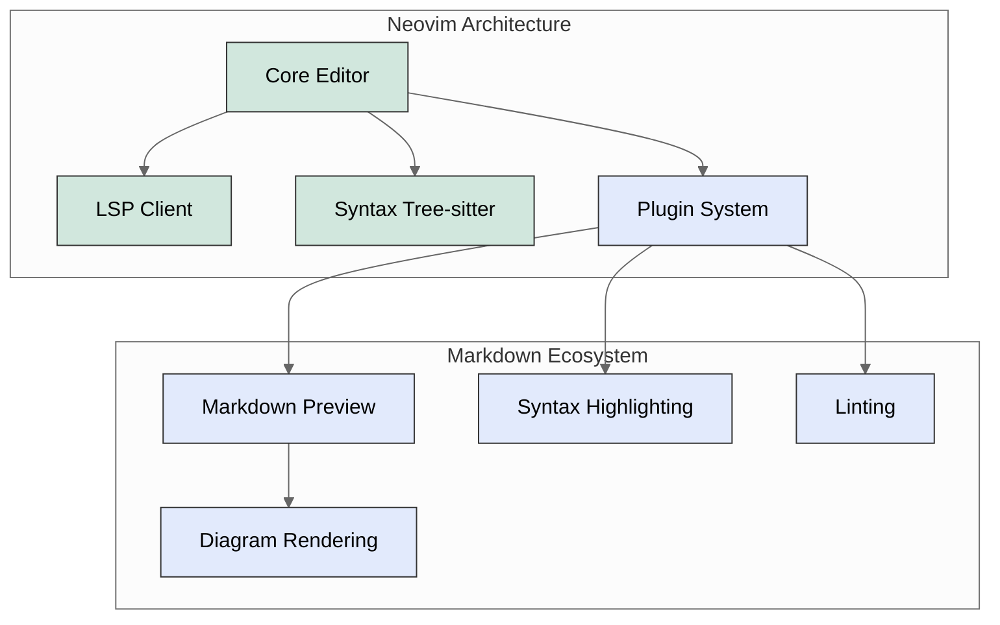
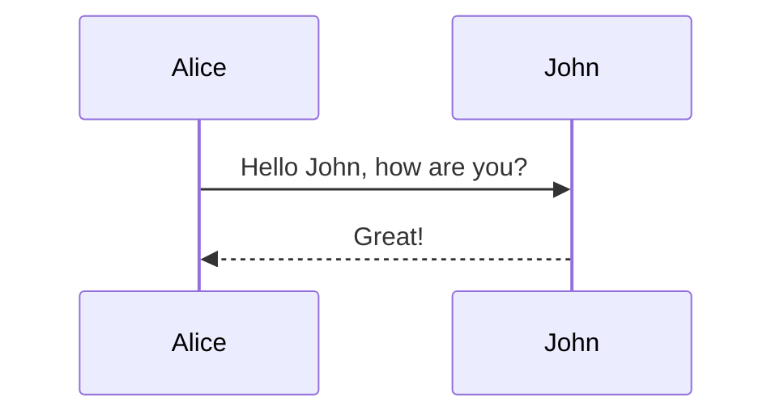

# 🚀 Advanced Neovim Setup Tutorial for Developers

## 📘 Introduction to Neovim

**Neovim** is a hyperextensible text editor built for efficiency and customization. It's a fork of Vim that offers:

- 🔌 Modern plugin architecture
- 📝 Built-in LSP (Language Server Protocol) support
- 🧠 Asynchronous execution
- 🎨 Better default configurations
- 🧩 Lua integration for configuration and plugins

This guide will walk you through setting up Neovim on macOS with advanced Markdown editing capabilities, including live preview with Mermaid diagram support.

## 🗺️ Neovim Conceptual Overview



## 📥 Installation on macOS

### Installing Neovim

```bash
# Using Homebrew
brew install neovim

# Verify installation
nvim --version
```

### Setting Up a Package Manager

We'll use [packer.nvim](https://github.com/wbthomason/packer.nvim) as our package manager:

```bash
# Create the plugin directory
mkdir -p ~/.local/share/nvim/site/pack/packer/start

# Clone packer.nvim
git clone --depth 1 https://github.com/wbthomason/packer.nvim \
  ~/.local/share/nvim/site/pack/packer/start/packer.nvim
```

## 🛠️ Basic Neovim Configuration

Neovim's configuration files live in the `~/.config/nvim/` directory. Let's set it up:

```bash
# Create config directory
mkdir -p ~/.config/nvim

# Create init.lua file for main configuration
touch ~/.config/nvim/init.lua
```

### Creating a Basic Configuration Structure

We'll organize our configuration with a modular structure:

```bash
# Create the directory structure
mkdir -p ~/.config/nvim/lua/plugins
mkdir -p ~/.config/nvim/lua/core
mkdir -p ~/.config/nvim/lua/lsp

# Create basic configuration files
touch ~/.config/nvim/lua/plugins/init.lua
touch ~/.config/nvim/lua/core/options.lua
touch ~/.config/nvim/lua/core/keymaps.lua
```

### Setting Up the Main Configuration File

Edit `~/.config/nvim/init.lua` with the following content:

```lua
-- Load core settings
require('core.options')
require('core.keymaps')

-- Load plugin configuration
require('plugins')
```

### Configuring Core Options

Edit `~/.config/nvim/lua/core/options.lua`:

```lua
local opt = vim.opt

-- Line numbers
opt.number = true
opt.relativenumber = true

-- Tabs & indentation
opt.tabstop = 2
opt.shiftwidth = 2
opt.expandtab = true
opt.autoindent = true
opt.smartindent = true

-- Line wrapping
opt.wrap = false

-- Search settings
opt.ignorecase = true
opt.smartcase = true
opt.hlsearch = false

-- Appearance
opt.termguicolors = true
opt.background = "dark"
opt.signcolumn = "yes"

-- Backspace
opt.backspace = "indent,eol,start"

-- Clipboard
opt.clipboard:append("unnamedplus")

-- Split windows
opt.splitright = true
opt.splitbelow = true

-- Consider words with dash as single word
opt.iskeyword:append("-")

-- Markdown specific settings
vim.g.markdown_fenced_languages = {
  'html',
  'python',
  'lua',
  'vim',
  'typescript',
  'javascript',
  'js=javascript',
  'ts=typescript',
  'bash',
  'css',
}
```

### Setting Up Key Mappings

Edit `~/.config/nvim/lua/core/keymaps.lua`:

```lua
-- Set leader key to space
vim.g.mapleader = " "

local keymap = vim.keymap

-- General keymaps
keymap.set("n", "<leader>e", ":Lexplore<CR>", { desc = "Open file explorer" })
keymap.set("n", "<leader>w", ":w<CR>", { desc = "Save file" })
keymap.set("n", "<leader>q", ":q<CR>", { desc = "Close window" })

-- Window navigation
keymap.set("n", "<C-h>", "<C-w>h")
keymap.set("n", "<C-j>", "<C-w>j")
keymap.set("n", "<C-k>", "<C-w>k")
keymap.set("n", "<C-l>", "<C-w>l")

-- Markdown specific keymaps
keymap.set("n", "<leader>mp", ":MarkdownPreview<CR>", { desc = "Start Markdown preview" })
keymap.set("n", "<leader>ms", ":MarkdownPreviewStop<CR>", { desc = "Stop Markdown preview" })
keymap.set("n", "<leader>mt", ":MarkdownPreviewToggle<CR>", { desc = "Toggle Markdown preview" })
```

## 📦 Plugin Setup

Now let's set up the plugin system. Edit `~/.config/nvim/lua/plugins/init.lua`:

```lua
local fn = vim.fn

-- Automatically install packer if not installed
local install_path = fn.stdpath("data") .. "/site/pack/packer/start/packer.nvim"
if fn.empty(fn.glob(install_path)) > 0 then
  PACKER_BOOTSTRAP = fn.system({
    "git",
    "clone",
    "--depth",
    "1",
    "https://github.com/wbthomason/packer.nvim",
    install_path,
  })
  print("Installing packer, close and reopen Neovim...")
  vim.cmd([[packadd packer.nvim]])
end

-- Autocommand that reloads Neovim when you save this file
vim.cmd([[
  augroup packer_user_config
    autocmd!
    autocmd BufWritePost init.lua source <afile> | PackerSync
  augroup end
]])

-- Use a protected call so we don't error out on first use
local status_ok, packer = pcall(require, "packer")
if not status_ok then
  return
end

-- Have packer use a popup window
packer.init({
  display = {
    open_fn = function()
      return require("packer.util").float({ border = "rounded" })
    end,
  },
})

-- Install plugins
return packer.startup(function(use)
  -- Plugin manager
  use("wbthomason/packer.nvim")
  
  -- Common utilities
  use("nvim-lua/plenary.nvim")
  
  -- Colorscheme
  use("folke/tokyonight.nvim")
  
  -- Treesitter for better syntax highlighting
  use({
    "nvim-treesitter/nvim-treesitter",
    run = ":TSUpdate",
  })
  
  -- Markdown plugins
  use({
    "iamcco/markdown-preview.nvim",
    run = function() vim.fn["mkdp#util#install"]() end,
    ft = { "markdown" },
  })
  
  use({
    "preservim/vim-markdown",
    ft = { "markdown" },
  })
  
  -- Automatically set up configuration after cloning packer.nvim
  if PACKER_BOOTSTRAP then
    packer.sync()
  end
end)
```

## 💎 Markdown Preview Configuration

Now, let's set up the Markdown preview plugin. Create a new file:

```bash
touch ~/.config/nvim/lua/plugins/markdown.lua
```

Edit the new file with this content:

```lua
-- Markdown configuration
local M = {}

function M.setup()
  -- markdown-preview.nvim options
  vim.g.mkdp_auto_start = 0  -- Set to 1 to auto-open preview when entering Markdown files
  vim.g.mkdp_auto_close = 0  -- Set to 1 to auto-close preview when leaving Markdown files
  vim.g.mkdp_refresh_slow = 0
  vim.g.mkdp_command_for_global = 0
  vim.g.mkdp_open_to_the_world = 0
  vim.g.mkdp_open_ip = ''
  vim.g.mkdp_browser = ''  -- Use default browser
  vim.g.mkdp_echo_preview_url = 0
  vim.g.mkdp_browserfunc = ''
  
  -- Enable Mermaid diagram rendering and other features
  vim.g.mkdp_preview_options = {
    ['mkit'] = {},
    ['katex'] = {},
    ['uml'] = {},
    ['maid'] = {},
    ['disable_sync_scroll'] = 0,
    ['sync_scroll_type'] = 'middle',
    ['hide_yaml_meta'] = 1,
    ['sequence_diagrams'] = {},
    ['flowchart_diagrams'] = {},
    ['content_editable'] = false,
    ['disable_filename'] = 0,
    ['toc'] = {}
  }
  
  -- Preview page title format
  vim.g.mkdp_page_title = '「${name}」'
  vim.g.mkdp_filetypes = { 'markdown' }
  vim.g.mkdp_theme = 'dark'
  
  -- vim-markdown options
  vim.g.vim_markdown_folding_disabled = 1
  vim.g.vim_markdown_conceal = 0
  vim.g.vim_markdown_conceal_code_blocks = 0
  vim.g.vim_markdown_math = 1
  vim.g.vim_markdown_toml_frontmatter = 1
  vim.g.vim_markdown_frontmatter = 1
  vim.g.vim_markdown_strikethrough = 1
  vim.g.vim_markdown_autowrite = 1
  vim.g.vim_markdown_follow_anchor = 1
  vim.g.vim_markdown_no_extensions_in_markdown = 1
  vim.g.vim_markdown_edit_url_in = 'tab'
end

return M
```

Now, modify the `~/.config/nvim/init.lua` file to include this configuration:

```lua
-- Load core settings
require('core.options')
require('core.keymaps')

-- Load plugin configuration
require('plugins')

-- Load Markdown configuration
local markdown_ok, markdown = pcall(require, "plugins.markdown")
if markdown_ok then
  markdown.setup()
end

-- Set colorscheme
vim.cmd("colorscheme tokyonight")
```

## 🚀 Installing Plugins and Finalizing Setup

1. **Launch Neovim**:
   ```bash
   nvim
   ```

2. **Install plugins**:
   Once in Neovim, run:
   ```
   :PackerSync
   ```
   
   This will install all the plugins defined in your configuration.

3. **Check Markdown Preview Installation**:
   Verify that the Markdown preview plugin is properly installed:
   ```
   :echo g:mkdp_app_path
   ```
   If it shows a path, the plugin is installed correctly.

## 🔧 Using Neovim for Markdown Editing

Now that you have Neovim set up with Markdown support, here's how to use it:

1. **Open a Markdown file**:
   ```bash
   nvim document.md
   ```

2. **Start the Markdown preview**:
   - Press `<Space>mp` (if you're using the keymaps we defined)
   - Or run `:MarkdownPreview`
   
   This will open a browser window with a live preview of your Markdown document.

3. **Mermaid diagram example**:
   ```markdown
   ```mermaid
   graph TD
       A[Start] --> B{Is it working?}
       B -->|Yes| C[Great!]
       B -->|No| D[Debug]
       D --> B
   ```
   ```
   
   The preview should render this as a diagram.

4. **Stop the preview**:
   - Press `<Space>ms`
   - Or run `:MarkdownPreviewStop`

## 🎨 Advanced Customization

### Adding Tree-sitter for Better Syntax Highlighting

Create a new file for Tree-sitter configuration:

```bash
touch ~/.config/nvim/lua/plugins/treesitter.lua
```

Edit it with:

```lua
local M = {}

function M.setup()
  local configs = require("nvim-treesitter.configs")
  
  configs.setup({
    ensure_installed = {
      "lua", 
      "vim", 
      "markdown", 
      "markdown_inline",
      "bash", 
      "python", 
      "javascript", 
      "typescript", 
      "html", 
      "css", 
      "json"
    },
    highlight = {
      enable = true,
      additional_vim_regex_highlighting = false,
    },
  })
end

return M
```

Update your `init.lua` file to include this configuration:

```lua
-- Add before the colorscheme line
local treesitter_ok, treesitter = pcall(require, "plugins.treesitter")
if treesitter_ok then
  treesitter.setup()
end
```

### Adding LSP Support for Markdown

If you want language server support for Markdown, add a new file:

```bash
touch ~/.config/nvim/lua/lsp/init.lua
```

Edit it with:

```lua
local M = {}

function M.setup()
  local lspconfig_ok, lspconfig = pcall(require, "lspconfig")
  if not lspconfig_ok then
    return
  end
  
  -- Markdown LSP setup (marksman)
  lspconfig.marksman.setup{}
end

return M
```

Add `lspconfig` to your plugins:

```lua
-- Add to the packer.startup function in plugins/init.lua
use("neovim/nvim-lspconfig")
```

Add a command to install the marksman language server:

```bash
# For macOS
brew install marksman
```

Update your `init.lua` to include the LSP configuration:

```lua
-- Add before the colorscheme line
local lsp_ok, lsp = pcall(require, "lsp")
if lsp_ok then
  lsp.setup()
end
```

## 📝 Neovim Markdown Cheat Sheet

| Command | Action |
|---------|--------|
| `<Space>mp` | Start Markdown preview |
| `<Space>ms` | Stop Markdown preview |
| `<Space>mt` | Toggle Markdown preview |
| `gx` | Open link under cursor |
| `]]` | Go to next heading |
| `[[` | Go to previous heading |
| `<Space>w` | Save file |
| `<Space>q` | Quit window |
| `:PackerSync` | Update plugins |
| `:checkhealth` | Check plugin health |

## 📋 Common Markdown Code Blocks

### Syntax-highlighted code blocks

```markdown
```python
def hello_world():
    print("Hello, world!")
```
```

### Mermaid diagrams

```markdown

```

### Math equations (with KaTeX)

```markdown
$$
f(x) = \int_{-\infty}^{\infty} \hat{f}(\xi) e^{2\pi i \xi x} d\xi
$$
```

## 🔗 Additional Resources

- [Neovim Documentation](https://neovim.io/doc/)
- [markdown-preview.nvim GitHub](https://github.com/iamcco/markdown-preview.nvim)
- [Treesitter Documentation](https://github.com/nvim-treesitter/nvim-treesitter)
- [Packer.nvim GitHub](https://github.com/wbthomason/packer.nvim)
- [Mermaid Diagram Syntax](https://mermaid-js.github.io/mermaid/)

---

Happy coding with Neovim! 🚀
