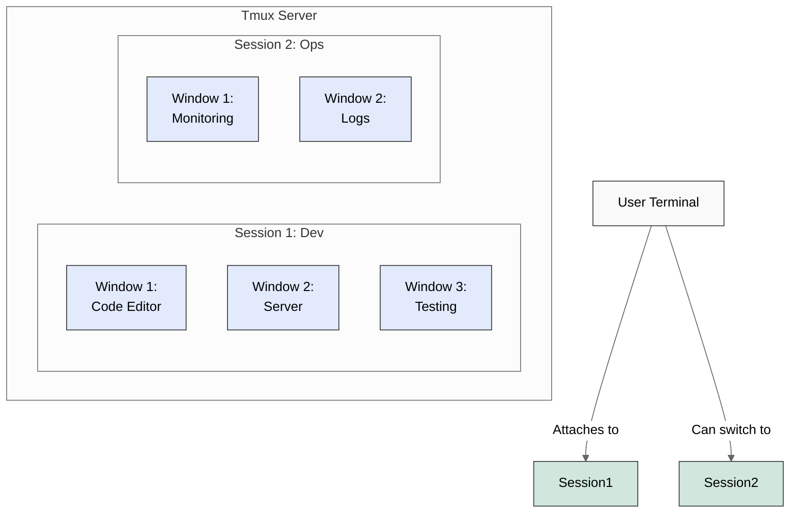
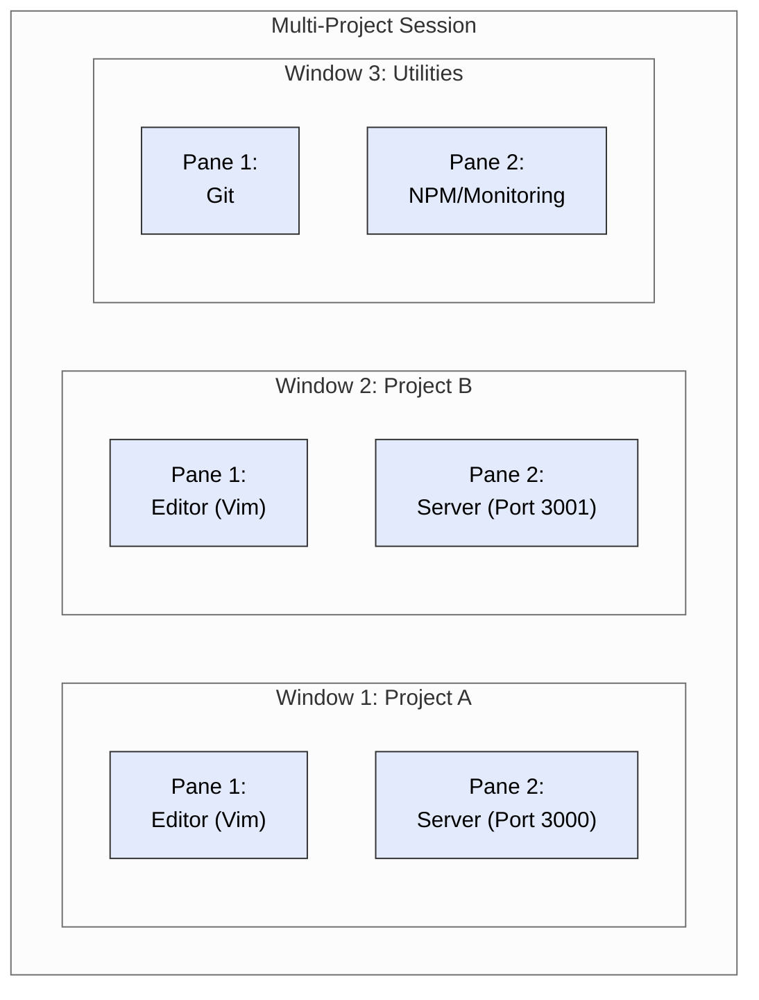

# 🚀 Advanced Tmux Tutorial for Developers

## 📘 Introduction

**Tmux** (Terminal Multiplexer) is a powerful tool that enhances terminal productivity by allowing you to:

- 📌 Create multiple terminal sessions within a single window
- 🔄 Detach from and reattach to sessions (preserving your work environment)
- 🧩 Split your terminal into multiple panes
- 📑 Organize work into windows and sessions
- 🔄 Share terminal sessions with other users

For developers, tmux is invaluable as it lets you manage multiple development servers, edit code, monitor logs, and run tests—all without cluttering your desktop with numerous terminal windows.

## 🗺️ Tmux Conceptual Overview



## 📥 Installation

### On macOS

```bash
# Using Homebrew
brew install tmux

# Verify installation
tmux -V
```

### On Ubuntu (22.04+)

```bash
# Install from repository
sudo apt update
sudo apt install tmux

# Verify installation
tmux -V
```

## 🛠️ Basic Configuration

Create a configuration file at `~/.tmux.conf`:

```bash
# Create and open the config file
vim ~/.tmux.conf
```

Add these starter configurations:

```bash
# Change the prefix key from Ctrl+b to Ctrl+a (more ergonomic)
unbind C-b
set -g prefix C-a
bind C-a send-prefix

# Improve colors and enable mouse support
set -g default-terminal "screen-256color"
set -g mouse on

# Start window numbering at 1 (easier to reach on keyboard)
set -g base-index 1
setw -g pane-base-index 1

# Increase history limit
set -g history-limit 50000

# Reload config file with prefix + r
bind r source-file ~/.tmux.conf \; display "Configuration reloaded!"

# Better split window commands
bind | split-window -h -c "#{pane_current_path}"
bind - split-window -v -c "#{pane_current_path}"

# Vim-like pane navigation
bind h select-pane -L
bind j select-pane -D
bind k select-pane -U
bind l select-pane -R

# Easy window navigation
bind -n M-Left previous-window
bind -n M-Right next-window
```

After saving, load the configuration:

```bash
tmux source-file ~/.tmux.conf
```

## 📋 Essential Tmux Commands

| Command | Description |
|---------|-------------|
| `tmux new-session -s dev` | Create a new session named "dev" |
| `tmux attach -t dev` | Attach to session named "dev" |
| `tmux ls` | List all sessions |
| `tmux kill-session -t dev` | Kill the "dev" session |
| `<prefix> d` | Detach from current session |
| `<prefix> c` | Create a new window |
| `<prefix> ,` | Rename current window |
| `<prefix> n` | Next window |
| `<prefix> p` | Previous window |
| `<prefix> <number>` | Go to window by number |
| `<prefix> %` | Split pane vertically |
| `<prefix> "` | Split pane horizontally |
| `<prefix> <arrow key>` | Navigate between panes |
| `<prefix> z` | Toggle pane zoom |
| `<prefix> {` | Move pane left |
| `<prefix> }` | Move pane right |
| `<prefix> x` | Kill current pane |
| `<prefix> &` | Kill current window |

**Note:** `<prefix>` refers to your prefix key, which is `Ctrl+b` by default (or `Ctrl+a` if you changed it in the config).

## 💻 Development Workflow Scenarios

### Scenario 1: Node.js Project Development

Let's create a complete development environment for a Node.js project:

1. **Start a new named session**:
   ```bash
   tmux new-session -s node-project
   ```

2. **Navigate to your project folder**:
   ```bash
   cd ~/projects/my-node-app
   ```

3. **Create and organize your workspace**:
   
   **Window 1: Code Editing**
   - Open main file in Vim:
     ```bash
     vim index.js
     ```
   - To create a new tab (window) in tmux: `Ctrl+a c`
   
   **Window 2: Server & Testing Environment**
   - Split the window vertically: `Ctrl+a |`
   - In the left pane, start the server:
     ```bash
     node index.js
     ```
   - Switch to right pane: `Ctrl+a right-arrow`
   - Run tests or monitoring:
     ```bash
     npm test
     ```

   **Window 3: Git and Project Management**
   - Create another window: `Ctrl+a c`
   - Use for git commands and project management:
     ```bash
     git status
     ```

4. **Navigate between windows**:
   - Next window: `Ctrl+a n`
   - Previous window: `Ctrl+a p`
   - Specific window by number: `Ctrl+a <number>`

5. **Detach from session** (keeps everything running in background):
   - `Ctrl+a d`

6. **Reattach later**:
   ```bash
   tmux attach -t node-project
   ```

### Scenario 2: Multi-Project Development

Let's set up a workspace for managing multiple projects simultaneously:



1. **Create a new session**:
   ```bash
   tmux new-session -s multi-project
   ```

2. **Set up Project A workspace (Window 1)**:
   - Navigate to Project A:
     ```bash
     cd ~/projects/project-a
     ```
   - Split window horizontally: `Ctrl+a -`
   - Top pane: Open project file in Vim
     ```bash
     vim src/app.js
     ```
   - Navigate to bottom pane: `Ctrl+a down-arrow`
   - Bottom pane: Start the server
     ```bash
     npm start  # Assuming this runs on port 3000
     ```

3. **Create Project B workspace (Window 2)**:
   - Create a new window: `Ctrl+a c`
   - Navigate to Project B:
     ```bash
     cd ~/projects/project-b
     ```
   - Split window horizontally: `Ctrl+a -`
   - Top pane: Open project file in Vim
     ```bash
     vim src/index.js
     ```
   - Navigate to bottom pane: `Ctrl+a down-arrow`
   - Bottom pane: Start the server
     ```bash
     npm start  # Assuming this runs on port 3001
     ```

4. **Create Utilities workspace (Window 3)**:
   - Create a new window: `Ctrl+a c`
   - Split window vertically: `Ctrl+a |`
   - Left pane: Git operations
   - Right pane: NPM operations or monitoring

5. **Navigate between projects**:
   - Switch to Project A: `Ctrl+a 1`
   - Switch to Project B: `Ctrl+a 2`
   - Switch to Utilities: `Ctrl+a 3`

## 🔄 Session Management

### Saving and Restoring Sessions

Tmux doesn't have built-in session saving, but you can use `tmux-resurrect` and `tmux-continuum` plugins:

1. **Install Tmux Plugin Manager (TPM)**:
   ```bash
   git clone https://github.com/tmux-plugins/tpm ~/.tmux/plugins/tpm
   ```

2. **Add to your `~/.tmux.conf`**:
   ```bash
   # List of plugins
   set -g @plugin 'tmux-plugins/tpm'
   set -g @plugin 'tmux-plugins/tmux-resurrect'
   set -g @plugin 'tmux-plugins/tmux-continuum'

   # Auto-save sessions every 15 minutes
   set -g @continuum-restore 'on'
   set -g @continuum-save-interval '15'

   # Initialize TMUX plugin manager (keep this line at the very bottom)
   run '~/.tmux/plugins/tpm/tpm'
   ```

3. **Reload your tmux configuration**:
   - Within tmux: `Ctrl+a r` (if you've set up the reload binding)
   - Or: `tmux source-file ~/.tmux.conf`

4. **Install plugins**:
   - Within tmux: `Ctrl+a I` (capital I)

5. **Save/restore commands**:
   - Save: `Ctrl+a Ctrl+s`
   - Restore: `Ctrl+a Ctrl+r`

### Managing Sessions

List all sessions:
```bash
tmux ls
```

Create a session without attaching to it:
```bash
tmux new-session -d -s background-session
```

Rename a session:
```bash
tmux rename-session -t old-name new-name
```

Switch between sessions from within tmux:
- `Ctrl+a s` - Shows a list of sessions to select
- `Ctrl+a )` - Next session
- `Ctrl+a (` - Previous session

## 🚫 Killing Sessions and Freeing Ports

To kill a specific session (and all processes within it):
```bash
tmux kill-session -t session-name
```

To kill all sessions except the current one:
```bash
tmux kill-session -a
```

To kill the tmux server and all sessions:
```bash
tmux kill-server
```

**Finding and killing processes on specific ports** (outside tmux):
```bash
# Find process using port 3000
lsof -i :3000

# Kill the process
kill -9 <PID>
```

## 🔝 Advanced Tmux Techniques

### Copy Mode and Scrolling

Enter copy mode:
- `Ctrl+a [` - Enter copy mode
- Navigate with arrow keys or vim-style keys (if configured)
- `q` - Exit copy mode

With vim keys:
- `Space` - Start selection
- `Enter` - Copy selection
- `Ctrl+a ]` - Paste

### Custom Layouts and Window Arrangements

Save the current window layout:
```bash
Ctrl+a :select-layout
```

Choose from preset layouts:
- `Ctrl+a :select-layout even-horizontal`
- `Ctrl+a :select-layout even-vertical`
- `Ctrl+a :select-layout main-horizontal`
- `Ctrl+a :select-layout main-vertical`
- `Ctrl+a :select-layout tiled`

### Session Management Scripts

Create a script to set up your development environment automatically:

```bash
#!/bin/bash
# Save as ~/bin/dev-setup.sh and make executable with chmod +x

# Start a new session
tmux new-session -d -s development

# Window 1: Editor
tmux rename-window -t development:1 'editor'
tmux send-keys -t development:1 'cd ~/projects/main-project' C-m
tmux send-keys -t development:1 'vim .' C-m

# Window 2: Server
tmux new-window -t development:2 -n 'server'
tmux send-keys -t development:2 'cd ~/projects/main-project' C-m
tmux split-window -h -t development:2
tmux send-keys -t development:2.1 'npm start' C-m
tmux send-keys -t development:2.2 'npm test' C-m

# Window 3: Additional project
tmux new-window -t development:3 -n 'project-b'
tmux send-keys -t development:3 'cd ~/projects/project-b' C-m
tmux split-window -h -t development:3
tmux send-keys -t development:3.1 'vim .' C-m
tmux send-keys -t development:3.2 'npm start' C-m

# Select window 1
tmux select-window -t development:1

# Attach to the session
tmux attach-session -t development
```

Run this script with:
```bash
~/bin/dev-setup.sh
```

## 📝 Cheat Sheet

### Session Management
| Command | Description |
|---------|-------------|
| `tmux new -s mysession` | Create new session named "mysession" |
| `tmux attach -t mysession` | Attach to session "mysession" |
| `tmux ls` | List all sessions |
| `tmux kill-session -t mysession` | Kill session "mysession" |
| `Ctrl+a d` | Detach from current session |
| `Ctrl+a s` | List and select session |
| `Ctrl+a $` | Rename current session |

### Window Management
| Command | Description |
|---------|-------------|
| `Ctrl+a c` | Create new window |
| `Ctrl+a ,` | Rename current window |
| `Ctrl+a n` | Move to next window |
| `Ctrl+a p` | Move to previous window |
| `Ctrl+a <number>` | Switch to window number |
| `Ctrl+a &` | Kill current window |
| `Ctrl+a w` | List all windows |

### Pane Management
| Command | Description |
|---------|-------------|
| `Ctrl+a %` | Split horizontally |
| `Ctrl+a "` | Split vertically |
| `Ctrl+a <arrow>` | Move to adjacent pane |
| `Ctrl+a z` | Toggle pane zoom |
| `Ctrl+a x` | Kill current pane |
| `Ctrl+a q` | Show pane numbers |
| `Ctrl+a {` | Move pane left |
| `Ctrl+a }` | Move pane right |
| `Ctrl+a Ctrl+<arrow>` | Resize pane |

### Copy Mode
| Command | Description |
|---------|-------------|
| `Ctrl+a [` | Enter copy mode |
| `q` | Exit copy mode |
| `<space>` | Start selection (in vi mode) |
| `<enter>` | Copy selection (in vi mode) |
| `Ctrl+a ]` | Paste copied content |

## 🔗 Additional Resources

- [Tmux GitHub Repository](https://github.com/tmux/tmux)
- [Tmux Cheat Sheet](https://tmuxcheatsheet.com/)
- [The Tao of Tmux](https://leanpub.com/the-tao-of-tmux/read)
- [Tmux Plugin Manager](https://github.com/tmux-plugins/tpm)
- [Awesome Tmux](https://github.com/rothgar/awesome-tmux)

---

Happy coding with tmux! 🚀
