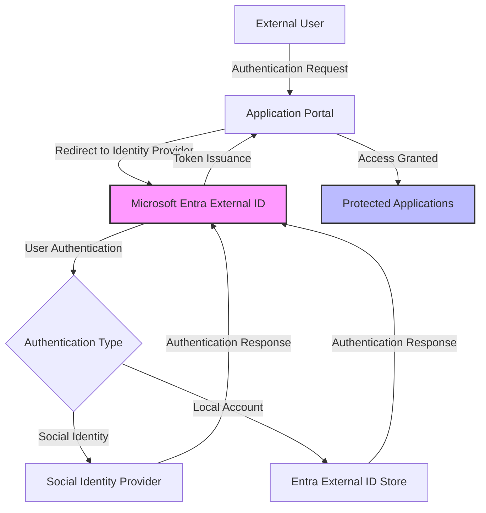
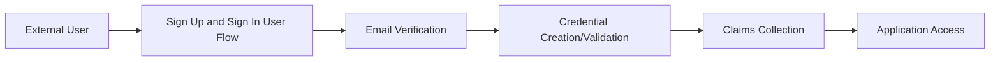
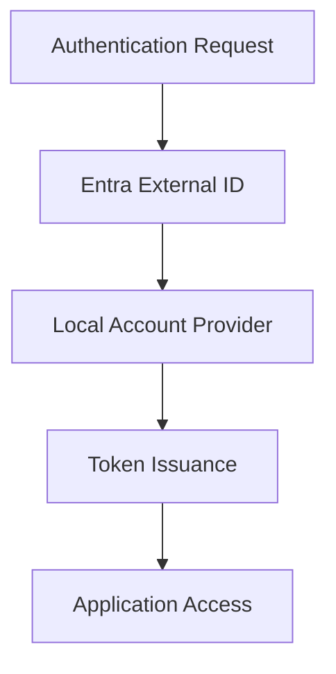
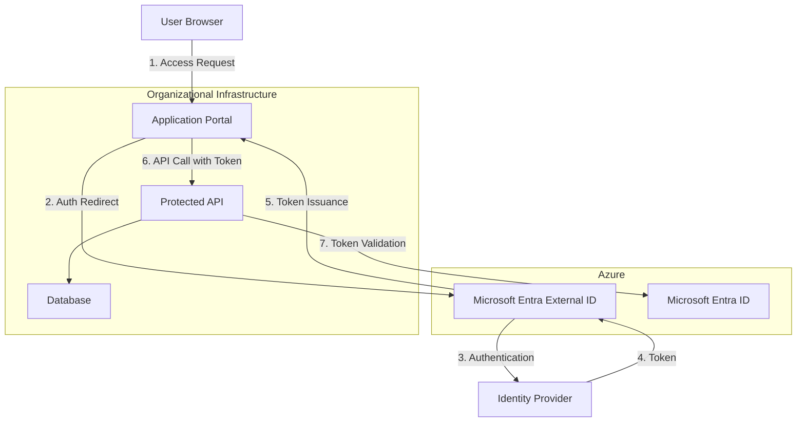
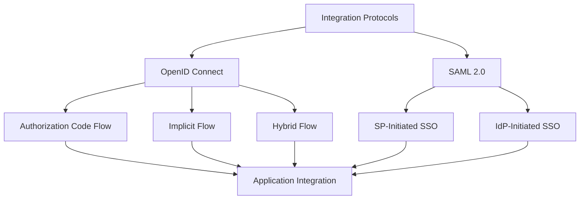
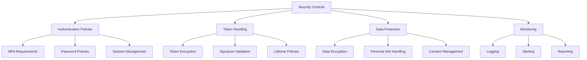
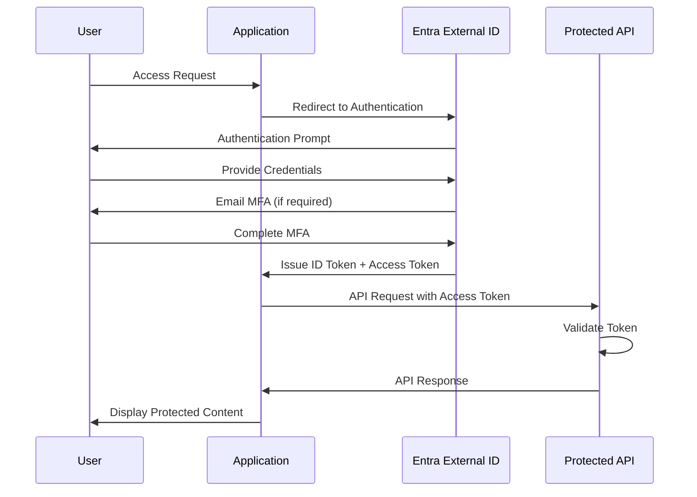
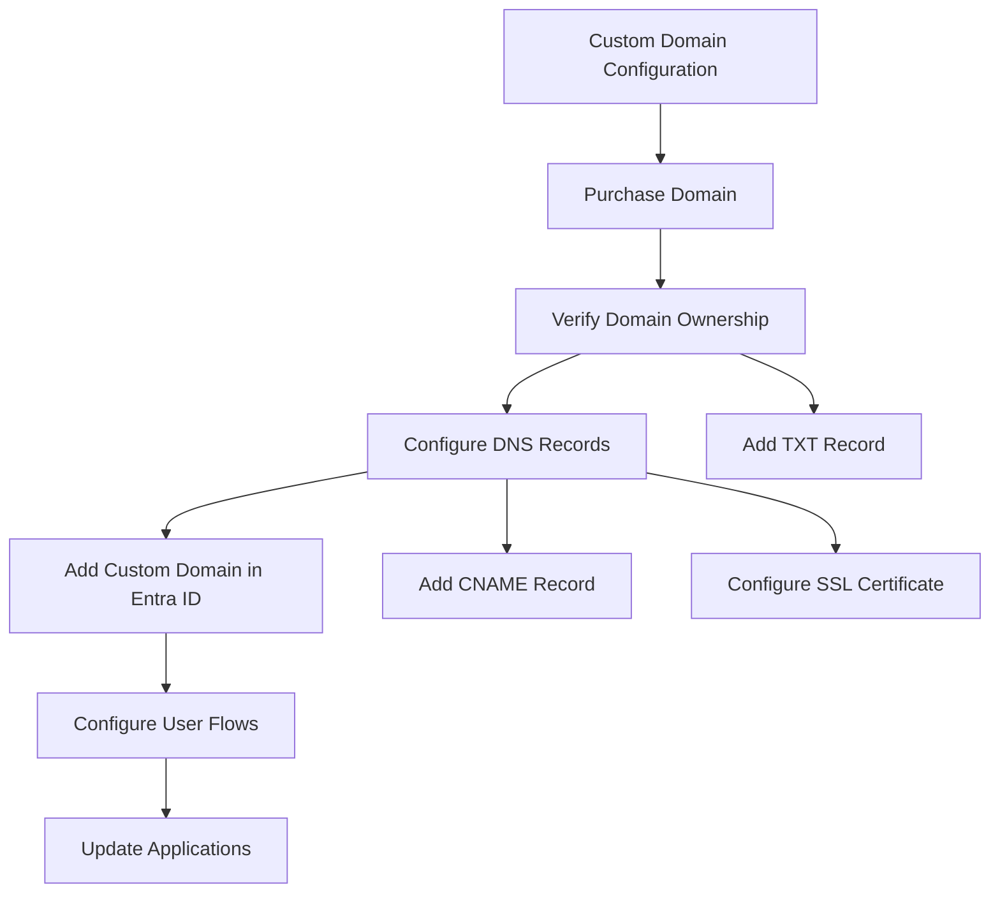
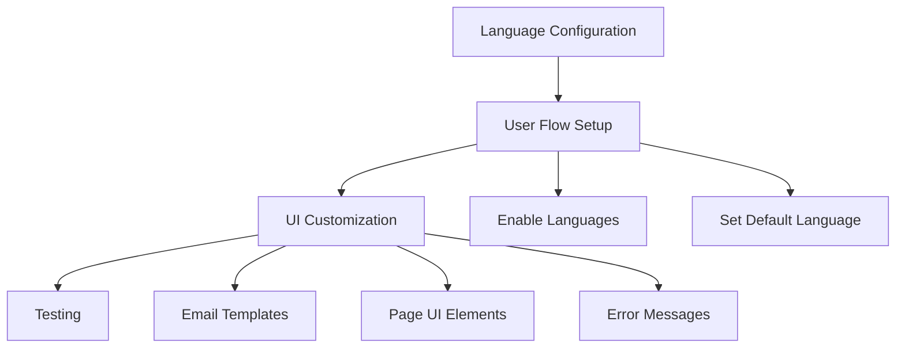
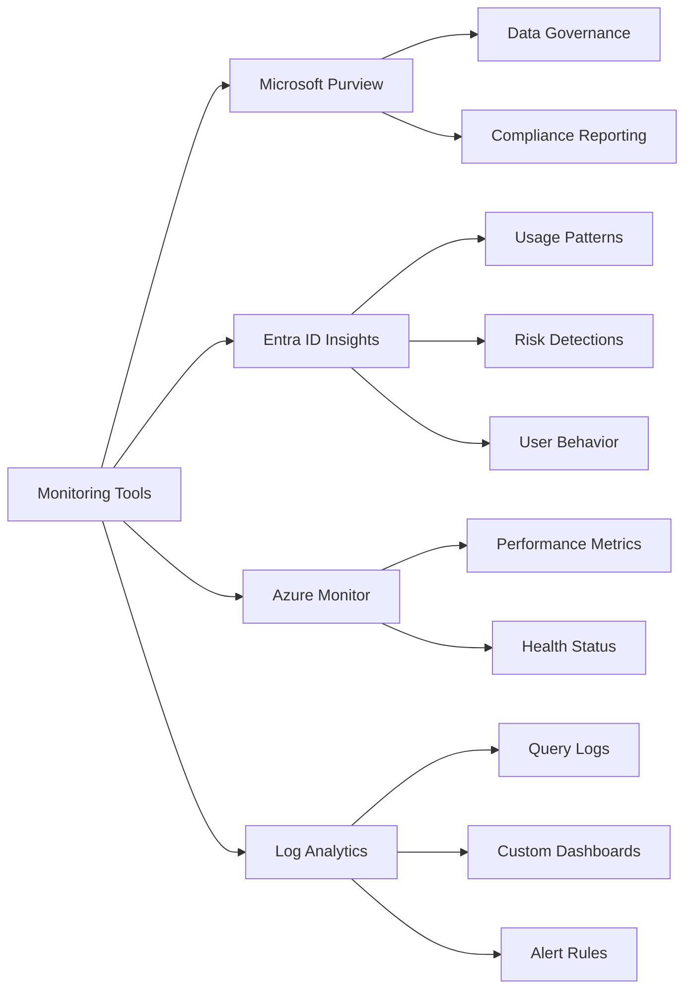

  
  
<i>Microsoft Entra External ID - Secure Identity Management for External Users</i>

# Elections Canada: External ID Integration with Microsoft Entra ID

This document outlines the integration between Elections Canada's Microsoft Entra External ID solution for managing external identities. The implementation provides secure access to applications for various external clients while maintaining strict security standards.

## Overview

Elections Canada requires a secure identity solution that allows external users to access specific applications while maintaining strict security standards mandated by federal regulations. This document describes the implementation of Microsoft Entra External ID (formerly Azure AD B2C) for managing external identities.

## Key Components

### 1. Microsoft Entra External ID Tenant

Elections Canada utilizes a dedicated Microsoft Entra External ID tenant (`electcan2.onmicrosoft.com`) for managing external identities. This tenant is separate from the organizational Entra ID used for internal staff.

### 2. User Flows

The implementation uses the standard "Sign up and sign in" user flow that facilitates the external client authentication process:

#### Sign Up and Sign In User Flow
- Email and password authentication
- Email-based verification during registration
- Collection of key user attributes:
  - Email address
  - First name
  - Last name
  - Phone number
- Multi-factor authentication via email for sensitive operations
- Bilingual support (English and French)

### 3. Identity Provider Configuration

Elections Canada's implementation uses the default local account identity provider to manage external client accounts:

The following identity provider configuration is used:

- **Local Accounts**: Email and password based accounts in the Entra External ID identity store
- Self-service password reset
- Email verification
- Progressive profiling capabilities

## Technical Implementation

### Architecture

### Protocol Support

The Entra External ID tenant supports industry-standard authentication protocols for application integration:

#### OpenID Connect (OIDC) Benefits
- Modern, REST-based protocol
- Simplified token handling
- Mobile application support
- User info endpoint for attribute retrieval
- Lightweight implementation

#### SAML Benefits
- Widespread enterprise application support
- Rich attribute statements
- Mature implementation patterns
- Legacy application compatibility

### Data Flow

The authentication process follows these steps:

1. User attempts to access application
2. User is redirected to Entra External ID for authentication
3. User authenticates via local account
4. Entra External ID issues a token containing claims about the user
5. The application validates the token and extracts user information
6. Access is granted based on user claims and application permissions

### Security Controls

The following security controls have been implemented:

#### Authentication Policies
- Strong password requirements (12+ characters, complexity)
- Multi-factor authentication via email for sensitive operations
- Session timeout after 30 minutes of inactivity

#### Token Security
- JWT tokens with industry-standard encryption
- Configurable token lifetimes
- Refresh token patterns
- Audience and issuer validation

#### Data Protection
- Encryption of all personal data at rest and in transit
- Minimal data collection in accordance with Privacy Act
- Automated data retention policies
- Strict data classification

## Application Integration

### Single Sign-On Benefits

The implementation of Entra External ID provides the following SSO benefits:

- **Improved User Experience**: Users sign in once and access multiple applications
- **Reduced Password Fatigue**: Eliminating multiple credentials for different applications
- **Centralized Access Control**: Manage permissions from a single location
- **Consistent Security Policies**: Apply uniform security controls across applications
- **Simplified Onboarding/Offboarding**: Streamlined user lifecycle management
- **Enhanced Security Monitoring**: Consolidated authentication logging

### Authentication Flow

The following diagram shows how applications integrate with Entra ID:

### Token Claims

The token issued to applications contains the following claims:

- Standard claims:
  - `sub`: Unique identifier for the user
  - `email`: User's email address
  - `given_name`: User's first name
  - `family_name`: User's last name
  - `phone_number`: User's phone number
  - `iat`: Time at which the token was issued
  - `exp`: Expiration time

## Operational Considerations

### Custom Domain Configuration

The current Entra External ID tenant uses the default domain `electcan2.onmicrosoft.com`. To configure a custom domain (e.g., `login.elections.ca`):

1. **Verify Domain Ownership**:
   - Add a TXT record to your DNS configuration
   - Microsoft will verify ownership through DNS lookup

2. **Configure DNS Records**:
   - Add a CNAME record pointing to `electcan2.b2clogin.com`
   - Configure SSL certificates if needed

3. **Add Custom Domain in Entra ID**:
   - Navigate to Entra External ID > Custom Domains
   - Add the verified domain
   - Set as primary domain if desired

4. **Update Applications**:
   - Update all application configurations to use the new domain
   - Test SSO flows with the custom domain

### Language Support

Entra External ID provides built-in support for both English and French:

1. **Enable Language Support**:
   - In the user flow properties, enable both English and French
   - Set the default fallback language (typically English)
   - Configure language detection mechanisms

2. **UI Customization**:
   - Create language-specific versions of all UI elements
   - Upload translated versions of:
     - Page content
     - Error messages
     - Email templates

3. **Language Selection**:
   - Add language selector in the user interface
   - Honor browser language preferences
   - Allow users to change language during the authentication process

4. **Testing**:
   - Test the complete user journey in both languages
   - Verify all email communications
   - Ensure accessibility standards are met in both languages

### Monitoring and Reporting

Comprehensive monitoring is implemented using Microsoft's built-in tools:

#### Microsoft Purview
- Data discovery and classification
- Sensitive information monitoring
- Compliance reporting
- Risk assessment

#### Entra ID Insights
- Sign-in activity monitoring
- User risk detection
- Authentication method usage
- Self-service adoption metrics
- Conditional access impact

#### Azure Monitor
- Performance metrics
- Service health
- Resource utilization
- Availability monitoring

#### Log Analytics
- Custom query capabilities
- Long-term log retention
- Cross-service correlation
- Custom alert rules
- Visualization dashboards

#### Key Metrics Monitored
- Authentication success/failure rates
- Account lockouts
- Password reset volumes
- MFA enrollments and usage
- Geographic access patterns
- Suspicious activities
- API access patterns
- User flow completion rates

### User Management

Administrators can manage external users through:

1. Microsoft Entra Admin Portal
2. Microsoft Graph API integration
3. Role-based access control

## Compliance

The implementation adheres to:

- Treasury Board of Canada Secretariat (TBS) security standards
- Privacy Act requirements
- Elections Canada Act provisions
- ITSG-33 security controls
- Government of Canada Cloud Security Profile

## Roadmap

The following future enhancements may be considered for the identity system:

**Disclaimer**: The items listed below are recommendations and may or may not be pursued depending on organizational willingness and budget considerations.

- Enhanced identity verification capabilities
- Expanded multi-factor authentication options
- Additional identity provider integrations
- Implementation of verifiable credentials
- Risk-based authentication policies

## References

- [Microsoft Entra External ID Documentation](https://learn.microsoft.com/en-us/entra/external-id/)
- [Microsoft Entra Monitoring and Reporting](https://learn.microsoft.com/en-us/entra/identity/monitoring-health/)
- [Microsoft Purview Documentation](https://learn.microsoft.com/en-us/purview/)
- [Government of Canada Identity and Access Management Guidelines](https://www.canada.ca/en/government/system/digital-government/online-security-privacy/identity-management.html)
- [Treasury Board Identity Management Policy](https://www.tbs-sct.canada.ca/pol/doc-eng.aspx?id=16577)
- [OIDC Protocol Documentation](https://openid.net/connect/)
- [SAML 2.0 Technical Overview](http://docs.oasis-open.org/security/saml/Post2.0/sstc-saml-tech-overview-2.0.html)