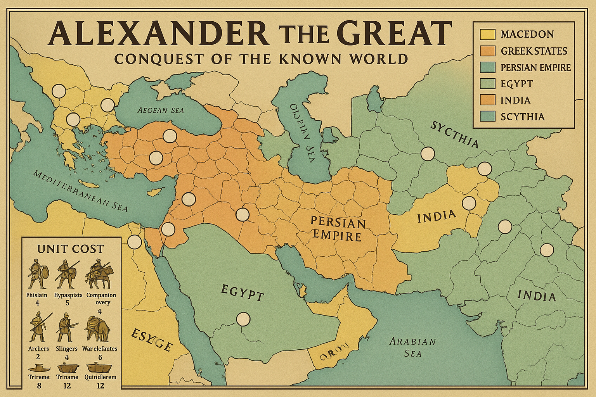
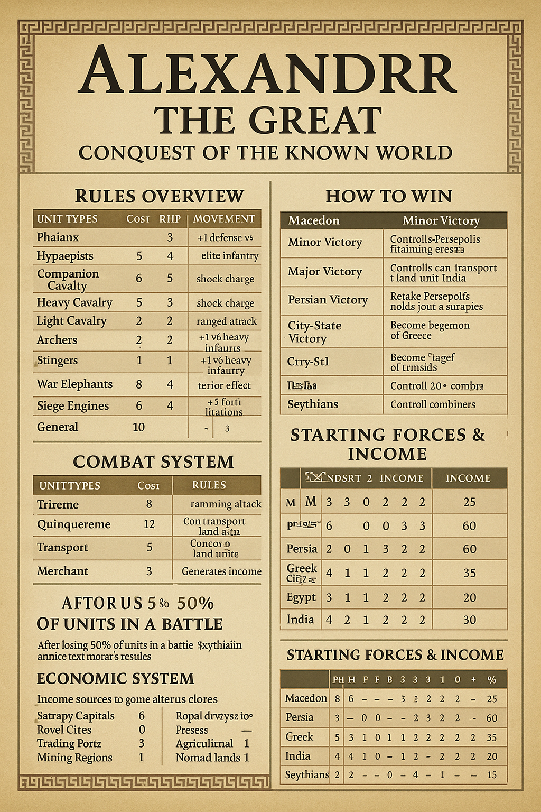

# Alexander the Great: Conquest of the Known World

## Complete Board Game Design

### Game Overview

A strategic board game for 2-6 players covering Alexander's conquests (336-323 BCE). One player controls Macedon under Alexander, while others control the Persian Empire, Greek city-states, Egyptian satraps, Indian kingdoms, and Scythian tribes. The game emphasizes rapid conquest, logistics challenges, and the political fragmentation that follows military success.

---

## Unit Types & Combat Values

### Land Units

| Unit Type                   | Cost (Talents) | Attack | Defense | Movement | Special Rules                                  |
| --------------------------- | -------------- | ------ | ------- | -------- | ---------------------------------------------- |
| **Phalanx**           | 4              | 3      | 4       | 1        | +1 defense vs cavalry, -1 vs skirmishers       |
| **Hypaspists**        | 5              | 4      | 3       | 2        | Elite infantry, can move after combat          |
| **Companion Cavalry** | 6              | 5      | 3       | 3        | Shock charge (+2 first round), Macedonian only |
| **Heavy Cavalry**     | 5              | 4      | 2       | 3        | Shock charge (+1 first round)                  |
| **Light Cavalry**     | 3              | 2      | 2       | 4        | Can retreat before combat, scouting            |
| **Archers**           | 2              | 2      | 1       | 2        | Ranged attack (no retaliation first round)     |
| **Slingers**          | 1              | 1      | 1       | 2        | Cheap skirmishers, +1 vs heavy infantry        |
| **War Elephants**     | 8              | 5      | 4       | 2        | Terror effect, Indian/Persian only             |
| **Siege Engines**     | 6              | 4      | 2       | 1        | +3 vs fortifications, must be built in cities  |
| **General**           | 10             | -      | -       | 3        | +1 to all units in territory, loyalty effects  |

### Naval Units

| Unit Type             | Cost (Talents) | Attack | Defense | Movement | Special Rules                               |
| --------------------- | -------------- | ------ | ------- | -------- | ------------------------------------------- |
| **Trireme**     | 8              | 3      | 3       | 3        | Standard warship, ramming attack            |
| **Quinquereme** | 12             | 4      | 4       | 2        | Heavy warship, can transport 1 land unit    |
| **Transport**   | 5              | 0      | 1       | 2        | Carries 2 land units, vulnerable            |
| **Merchant**    | 3              | 0      | 1       | 2        | Generates 1 Talent per turn on trade routes |

---

## Combat System

### Dice Mechanics

- Use standard 6-sided dice
- Units hit on their attack/defense value or lower
- Combat is simultaneous, but special rules apply for different unit types

### Historical Combat Interactions

**Phalanx vs Cavalry:**

- Phalanx gets +1 defense vs frontal cavalry charges
- Cavalry can attempt flanking (roll 1d6, 4+ = attack phalanx from side at -1 defense)

**Companion Cavalry Charge:**

- First round: Roll attack dice twice, take higher result
- If charge succeeds, enemy must test morale (roll 1d6, 1-2 = unit retreats)

**War Elephant Terror:**

- All enemy units within same territory roll 1d6 before combat
- 1-2 = unit panics, -1 to all combat rolls this battle
- Own cavalry also affected (historical stampedes)

**Siege Warfare:**

- Fortified cities defend at +2
- Siege engines negate fortification bonus
- Cities can be starved out (costs 2 turns, defenders lose 1 unit per turn)

### Morale System

After losing 50% of units in a battle:

- **Barbarian armies:** Roll 1d6, 1-3 = remaining units retreat
- **Persian armies:** Roll 1d6, 1-2 = remaining units retreat
- **Greek armies:** Roll 1d6, 1 = remaining units retreat
- **Macedonian armies:** Never retreat while Alexander is present

---

## Economic System (Talents - Ancient Currency)

### Income Sources by Nation

| Territory Type            | Base Income | Persian Bonus   | Macedonian Bonus  | Other Nations |
| ------------------------- | ----------- | --------------- | ----------------- | ------------- |
| **Satrapy Capital** | 6 Talents   | +2 (tribute)    | +1 (conquest)     | +0            |
| **Royal City**      | 8 Talents   | +3 (palace)     | +2 (plunder)      | +1            |
| **Trading Port**    | 4 Talents   | +1 (commerce)   | +1 (tribute)      | +2 (natural)  |
| **Mining Region**   | 5 Talents   | +2 (organized)  | +1 (forced labor) | +1            |
| **Agricultural**    | 2 Talents   | +1 (irrigation) | +0                | +1 (local)    |
| **Nomad Lands**     | 1 Talent    | +0              | -1 (raiding)      | +2 (tribal)   |

### Historical Wealth Distribution (Starting Resources)

| Nation                    | Starting Talents | Territories | Special Advantages              |
| ------------------------- | ---------------- | ----------- | ------------------------------- |
| **Persian Empire**  | 60               | 25          | Tribute system, Royal Road      |
| **Macedon**         | 25               | 8           | Superior military, Alexander    |
| **Egypt**           | 30               | 6           | Nile wealth, defensible borders |
| **Athens**          | 20               | 4           | Naval power, trade networks     |
| **Sparta**          | 15               | 3           | Military tradition, helot labor |
| **Indian Kingdoms** | 35               | 12          | Elephants, monsoon wealth       |
| **Scythians**       | 10               | 15          | Mobility, harsh terrain         |

### Trade & Tribute System

#### Royal Road Network (Persian Advantage)

- Persians start with established trade routes worth +1 Talent each
- 6 major routes: Sardis-Susa, Babylon-Persepolis, etc.
- Can be disrupted by enemy control of key territories

#### Plunder System (Macedonian Advantage)

- When Macedonians capture a city, roll 1d6+city value
- Gain that many Talents immediately (one-time bonus)
- **Historical examples:** Persepolis yielded 40 Talents, Babylon 25

#### Tribute Demands

- **Cost:** 2 Talents to make demand
- **Target:** Adjacent weaker nation
- **Success:** Roll 1d6 + your military strength - their strength
- **Results:**
  - 7+ = Gain 3 Talents per turn
  - 4-6 = Gain 1 Talent per turn
  - 1-3 = Demand rejected, relations worsen

---

## Loyalty & Succession System

### Alexander's Dilemma

Alexander faces unique challenges representing historical problems:

#### Distance from Macedon

- **Supply Range:** Units more than 8 territories from Macedon suffer -1 to combat
- **Communication Delay:** Orders take 1 extra turn to reach distant armies
- **Recruitment:** Can only recruit Macedonian units in Macedon or captured Greek cities

#### Cultural Integration

Alexander can choose integration policies:

1. **Hellenization** (3 Talents/turn): Convert Persian territories to Greek culture
2. **Adoption** (Free): Adopt Persian customs, +1 loyalty but -1 from Macedonian units
3. **Tolerance** (1 Talent/turn): Maintain local customs, prevent revolts

#### Succession Crisis

If Alexander dies or is defeated:

- **Diadochi War:** Macedonian empire splits into 4 factions
- Each controls different territories and generals
- New victory conditions activate for fragments

### Loyalty Mechanics

Each territory has a loyalty value (1-5):

- **5:** Fully loyal, provides full income
- **3-4:** Stable, provides normal income
- **2:** Unrest, -1 income, -1 to defending units
- **1:** Revolt, territory produces rebels

**Loyalty Changes:**

- **Conquered:** Start at loyalty 1
- **Same culture:** +1 loyalty per turn
- **Different culture:** No natural change
- **Garrison:** +1 loyalty if 2+ units present
- **Harsh rule:** -1 loyalty, +1 income
- **Just rule:** +1 loyalty, -1 income

---

## Movement & Geography

### Terrain Effects

| Terrain Type             | Movement Cost | Combat Modifier    | Special Rules                    |
| ------------------------ | ------------- | ------------------ | -------------------------------- |
| **Plains**         | 1             | Normal             | Ideal for cavalry                |
| **Hills**          | 2             | +1 defense         | Archer bonus (+1 attack)         |
| **Mountains**      | 3             | +2 defense         | Only light units can pass        |
| **Desert**         | 2             | -1 to all units    | Attrition: lose 1 unit per turn  |
| **Forest**         | 2             | +1 defense         | Cavalry -1 attack                |
| **Marsh**          | 3             | -1 to all units    | Disease: roll 1d6, 1 = lose unit |
| **River Crossing** | +1            | -1 attack crossing | Bridges negate penalty           |

### Historical Geography Features

#### The Hellespont

- **Crossing Point:** Only way between Europe and Asia
- **Control:** Whoever controls both sides can block passage
- **Naval Battle:** Required if enemy fleet present

#### Hindu Kush Mountains

- **Impassable:** Except through 3 specific passes
- **Seasonal:** Closed in winter (turns 16-20 of 40-turn game)
- **Attrition:** All units lose 1 strength crossing

#### The Indus River

- **Major Barrier:** Requires 2 movement points to cross
- **Monsoon Season:** Uncrossable during turns 25-30
- **Engineering:** Can build bridges (cost: 5 Talents, 2 turns)

#### Gedrosian Desert

- **Death March:** Any army crossing loses 50% of units
- **Alternative:** Sea route requires naval transport
- **Historical:** Alexander lost 75% of his army here

---

## Diplomatic System

### Alliance Types

1. **Military Alliance** (5 Talents): Share combat bonuses, coordinated attacks
2. **Trade Agreement** (3 Talents): +1 Talent per turn to both parties
3. **Non-Aggression Pact** (2 Talents): Cannot attack each other for 5 turns
4. **Tributary Status** (Variable): Weaker nation pays stronger nation

### Greek City-State Politics

Greek cities have special diplomacy rules:

#### League System

- **Corinthian League:** Macedon starts allied with most Greek cities
- **Athenian Influence:** Athens can spend Talents to flip cities
- **Spartan Resistance:** Sparta starts hostile to Macedon

#### Democratic vs Oligarchic

- **Democratic cities:** Prefer Athens, +1 cost for Macedon to influence
- **Oligarchic cities:** Prefer Macedon, +1 cost for Athens to influence
- **City revolts:** If loyalty drops to 1, city changes government type

### Persian Satrap System

Persian Empire has unique internal politics:

#### Satrap Loyalty

- Each satrapy has a loyalty value to the Persian King
- **High loyalty (4-5):** Provides full troops and income
- **Medium loyalty (2-3):** Provides half troops and income
- **Low loyalty (1):** May join Alexander if he approaches

#### Great King's Authority

- Persian player can spend 5 Talents to replace a disloyal satrap
- **Effect:** Return satrapy to loyalty 4, but lose 1 turn
- **Risk:** If failed (roll 1-2 on 1d6), satrapy revolts

---

## Turn Sequence & Victory

### Phase Order (Historical Chronology)

1. **Macedon** (Alexander's initiative)
2. **Persian Empire** (Imperial response)
3. **Athens** (Naval power)
4. **Sparta** (Greek resistance)
5. **Egypt** (Ptolemaic interests)
6. **Indian Kingdoms** (Eastern resistance)
7. **Scythians/Nomads** (Tribal movements)

### Individual Turn Structure

1. **Event Phase** - Draw and resolve event cards
2. **Diplomacy Phase** - Make treaties, demands, break alliances
3. **Income Phase** - Collect Talents, check loyalty
4. **Recruitment Phase** - Purchase units (placed at end)
5. **Movement Phase** - Move armies, conduct battles
6. **Siege Phase** - Resolve sieges and city attacks
7. **Placement Phase** - Place new units in home territories

---

## Special Rules & Historical Events

### Alexander's Abilities

**The Great Captain** (Once per game):

- All Macedonian units get +2 to combat for one battle
- Represents Alexander's personal leadership at Gaugamela, etc.

**Forced March** (Twice per game):

- One Macedonian army can move double distance
- Represents rapid movements that surprised enemies

**Divine Favor** (Random):

- Roll 1d6 each turn, on 6: Choose any one beneficial event
- Represents Alexander's legendary luck

### Event Card System (40 cards)

Sample events based on historical occurrences:

#### Positive Events (for various nations)

- **Olympic Games** (Greece): All Greek units gain +1 combat this turn
- **Nile Flood** (Egypt): Gain 5 extra Talents
- **Sogdian Rock Captured** (Macedon): Gain 3 Talents, enemy loses 1 unit
- **Monsoon Rains** (India): All units in India gain +1 defense

#### Negative Events

- **Mutiny at Hyphasis** (Macedon): Cannot advance further east for 2 turns
- **Revolt in Bactria** (Persians): Lose control of 1 Bactrian territory
- **Plague in Army** (Any): Lose 1 unit in largest army
- **Assassination Plot** (Any with General): Roll 1d6, 1 = General dies

#### Neutral Events

- **Embassy from Rome** (All): Romans offer trade deals
- **Scythian Raid** (Border territories): All border regions lose 1 income
- **Solar Eclipse** (All): All units -1 combat this turn (superstition)

---

## Victory Conditions

### Alexander's Victory (Macedon)

**Minor Victory (Historical):**

- Control Persepolis, Babylon, Memphis, and Alexandria
- Survive 30 turns while controlling these cities

**Major Victory (Beyond Historical):**

- Control all Persian satrapies plus 5 Indian territories
- Control the Indus River crossing for 3 consecutive turns

**Legendary Victory (World Conquest):**

- Control 40 territories total including all capitals
- Achieve this by turn 35 (representing peak of power)

### Persian Victory

**Survival Victory:**

- Retain control of Persepolis and 3 other satrapies until turn 40
- Successfully organize effective resistance

**Reconquest Victory:**

- Recapture all original Persian territories
- Destroy Alexander's army in battle

### Greek City-State Victory (Athens/Sparta)

**Hegemony Victory:**

- Control 8 Greek cities and maintain independence from Macedon
- Build 10 triremes (naval supremacy)

**Liberation Victory:**

- Free all Greek cities from Macedonian control
- Defeat Alexander in battle on Greek soil

### Coalition Victory

- Any 3 non-Macedonian players form lasting alliance
- Collectively control more territories than Macedon
- Maintain alliance for 5 consecutive turns

---

## Advanced Mechanics

### Siege Warfare

**Historical Siege Methods:**

- **Assault:** Direct attack, quick but costly
- **Circumvallation:** Surround city, takes 3 turns but guaranteed
- **Mining:** Engineer units can tunnel under walls (roll for success)
- **Treachery:** Spend 5 Talents, roll 1d6, 5+ = city surrenders

**Famous Sieges:**

- **Tyre:** Island city, requires naval dominance to besiege
- **Gaza:** Desert fortress, +2 to defense
- **Massaga:** Mountain stronghold, requires special siege equipment

### Supply Lines

**Logistics Challenge:**

- Armies need supply line to friendly territory within 6 spaces
- **Out of supply effects:**
  - Turn 1: -1 to all combat
  - Turn 2: Cannot attack, lose 1 unit
  - Turn 3: Army disbands

**Alexander's Innovation:**

- Can establish supply depots (cost: 3 Talents each)
- Depots extend supply range by 3 territories
- Vulnerable to enemy raids

### Weather & Seasons

**Annual Cycle** (Each game year = 8 turns):

- **Spring (Turns 1-2):** Normal movement, +1 income from agriculture
- **Summer (Turns 3-4):** Campaign season, +1 movement to all units
- **Autumn (Turns 5-6):** Harvest, +2 income from agriculture
- **Winter (Turns 7-8):** Reduced movement, no naval activity in northern seas

---

## Unit Balance & Combat Mathematics

### Combat Probability Analysis

**Phalanx vs Heavy Cavalry:**

- Phalanx: 50% hit rate + 67% defense vs cavalry = 83% effective defense
- Heavy Cavalry: 67% hit rate - phalanx bonus = 50% effective attack
- **Result:** Phalanx favored in frontal assault (historically accurate)

**Companion Cavalry Charge:**

- Normal: 83% hit rate
- With charge bonus: 97% hit rate first round
- **Historical justification:** Elite unit, decisive at Gaugamela and Granicus

**War Elephant Impact:**

- Terror effect: 33% chance to reduce enemy effectiveness by 17%
- High cost (8 Talents) balanced by powerful effect
- **Historical accuracy:** Elephants terrified horses and men unfamiliar with them

### Economic Balance

**Starting Resource Ratios:**

- Persian Empire: 2.4x Macedon's income (historically accurate wealth difference)
- Combined enemies: 4x Macedon's starting power
- **Balancing factors:** Macedon's military quality, Alexander's abilities, Persian internal problems

**Income Growth Rates:**

- Peaceful expansion: 10-15% per turn
- Military conquest: 20-30% per turn (unsustainable)
- **Historical parallel:** Alexander's rapid expansion created administrative challenges

---

## Campaign Scenarios

### The Granicus Campaign (Short Game - 15 turns)

**Setup:** Alexander has just crossed into Asia
**Objective:** Capture 5 Persian cities in Asia Minor
**Special Rules:** No Indian kingdoms, limited Persian resources

### The Great Conquest (Standard Game - 40 turns)

**Setup:** Full map, all players active
**Objective:** Multiple victory conditions active
**Historical Events:** Full event deck, seasonal effects

### What If Alexander Lived? (Extended Game - 60 turns)

**Setup:** Alexander survives to age 50
**New Challenges:** Roman expansion, Carthaginian navy, Celtic migrations
**Advanced Rules:** Technology development, successor kingdoms

### The Diadochi Wars (Sequel Campaign)

**Setup:** Alexander is dead, empire fragments
**Players:** Control successor kingdoms (Ptolemies, Seleucids, Antigonids, etc.)
**Objective:** Reunify the empire or establish lasting dynasty

---

## Historical Accuracy Notes

### Military Equipment Evolution

- **Early Game:** Bronze weapons, leather armor
- **Mid Game:** Iron weapons become standard
- **Late Game:** Macedonian innovations spread (longer sarissas, etc.)

### Cultural Integration

The game models Alexander's policy dilemmas:

- **Pure Macedonian:** Maintains unit quality but limits recruitment
- **Mixed Forces:** Allows local recruitment but may cause friction
- **Going Native:** Gains local support but alienates Macedonians

### Technological Advantages

**Macedonian Innovations:**

- **Sarissa Phalanx:** 18-foot spears vs 8-foot Greek spears
- **Combined Arms:** Infantry-cavalry coordination
- **Siege Craft:** Torsion artillery, advanced engineering

**Persian Advantages:**

- **Numbers:** Larger armies, more resources
- **Experience:** Professional military tradition
- **Intelligence:** Extensive spy networks

---

## Game Board & Reference Materials

### Game Map: The Ancient World (336-323 BCE)

*The game board shows the vast territories from Macedon to India, with color-coded regions representing different empires and kingdoms. White circles indicate major cities and capitals that serve as strategic objectives. The map includes important geographical features like the Aegean Sea, Mediterranean, Persian Gulf, and key rivers that affected historical military campaigns.*

**Key Map Features:**

- **Macedon (Yellow):** Starting position in northern Greece
- **Greek States (Orange):** Independent city-states including Athens and Sparta
- **Persian Empire (Teal):** Vast territories from Asia Minor to Central Asia
- **Egypt (Beige):** Wealthy Nile kingdom under Persian control initially
- **India (Orange/Eastern):** Independent kingdoms beyond the Indus River
- **Scythia (Green/Northern):** Nomadic territories north of the Black Sea

### Rules Reference Card

*This reference card provides essential game information including unit costs, combat rules, victory conditions, and starting forces for each faction. The Greek key pattern border reflects the classical ancient world aesthetic.*

**Reference Card Sections:**

- **Unit Types & Costs:** Complete roster from Phalanx (4 Talents) to War Elephants (8 Talents)
- **Combat System:** Rules for different unit interactions and special abilities
- **Victory Conditions:** Multiple paths to victory for different factions
- **Starting Forces:** Initial military units and income for each empire
- **Economic System:** Territory values and income sources

**Starting Force Distribution:**

- **Macedon:** 8 territories, 25 Talents income, elite but small army
- **Persian Empire:** 25 territories, 60 Talents income, vast but diverse forces
- **Greek City-States:** Combined 12 territories, 35 Talents, naval superiority
- **Egypt:** 6 territories, 20 Talents, defensive position with Nile protection
- **Indian Kingdoms:** 12 territories, 30 Talents, war elephants and monsoon advantages
- **Scythian Tribes:** 15 territories, 15 Talents, mobile cavalry and harsh terrain
