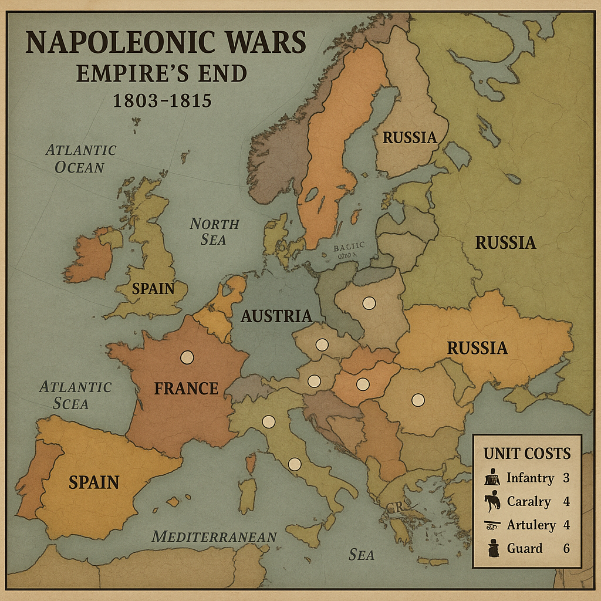

# Napoleonic Wars: Empire's End
## Complete Board Game Design

### Game Overview
A strategic board game for 2-6 players covering the Napoleonic Wars (1803-1815). France starts as the dominant power but faces increasingly difficult challenges as coalitions form against it.

---

## Unit Types & Combat Values

### Land Units
| Unit Type | Cost (IPCs) | Attack | Defense | Movement | Special Rules |
|-----------|-------------|--------|---------|----------|---------------|
| **Infantry** | 3 | 2 | 2 | 1 | Basic unit, garrison bonus |
| **Cavalry** | 4 | 3 | 2 | 2 | Pursuit bonus, can retreat before combat |
| **Artillery** | 4 | 3 | 3 | 1 | +1 attack when paired with infantry |
| **Guard Units** | 6 | 4 | 3 | 1 | Elite units, reroll failed attacks |
| **General** | 8 | - | - | 2 | +1 to all units in territory, can stack |

### Naval Units (Expanded)
| Unit Type | Cost (IPCs) | Attack | Defense | Movement | Special Rules |
|-----------|-------------|--------|---------|----------|---------------|
| **Frigate** | 8 | 2 | 2 | 3 | Anti-blockade, commerce raiding, scout |
| **Ship of the Line** | 12 | 4 | 4 | 2 | Can blockade, transport 2 land units |
| **Transport** | 7 | 0 | 1 | 2 | Carries 2 land units, vulnerable |
| **Corvette** | 6 | 1 | 2 | 4 | Fast messenger, +1 to blockade breaking |
| **Bomb Vessel** | 10 | 3 | 2 | 2 | Shore bombardment, +2 vs coastal forts |
| **Flagship** | 18 | 5 | 5 | 2 | Admiral vessel, +1 to fleet combat |

### Advanced Naval Combat System

#### Fleet Actions
**Line of Battle:** Ships of the Line can form battle lines
- 3+ Ships in line: +1 attack to all ships in formation
- 5+ Ships in line: +1 attack, +1 defense to all ships
- Flagship in line: Additional +1 to all combat rolls

**Breaking the Line:** 
- Costs 2 movement points
- Allows attack on enemy rear (defends at -1)
- Risk: If attack fails, your ships defend at -1 next round

#### Weather Gauge
At start of naval combat, both players roll 1d6:
- **Winner has "Weather Gauge"**
- **Advantage:** +1 to first round of combat
- **Choice:** Can choose to engage or withdraw before combat

#### Naval Special Actions

**Commerce Raiding** (Frigates/Corvettes only)
- **Target:** Enemy trade routes (marked sea zones)
- **Effect:** Roll 1d6 per frigate, 4+ = enemy loses 1 IPC
- **Risk:** Raiding ships can be hunted by enemy fleets

**Shore Bombardment** (Ships of the Line/Bomb Vessels)
- **Range:** Can attack coastal territories
- **Effect:** -1 to enemy coastal fort defense
- **Bomb Vessels:** +2 attack vs coastal installations

**Cutting Out Expeditions** (Frigates in enemy ports)
- **Cost:** 1 movement point
- **Roll:** 1d6, 5+ = capture 1 enemy transport/merchant
- **Risk:** 1-2 = frigate damaged (-1 to all rolls until repaired)

#### Blockade System (Enhanced)

**Levels of Blockade:**
1. **Loose Blockade** (1-2 ships): -1 IPC from port, can be broken by 1 frigate
2. **Close Blockade** (3-4 ships): -2 IPCs from port, requires 2 ships to break
3. **Total Blockade** (5+ ships): -3 IPCs from port, no trade possible

**Blockade Running:**
- **Attempt:** Costs 2 IPCs, roll 1d6
- **Success (4+):** Ignore blockade this turn, gain 1 IPC
- **Failure (1-3):** Lose 2 IPCs, blockade strengthens (+1 to blockade level)

**Economic Warfare:**
- **British Advantage:** Can place "Letters of Marque" tokens
- **Effect:** Neutral ships have 50% chance to avoid French ports
- **French Counter:** "Continental System" forces neutrals to choose sides

---

## Combat System

### Dice Mechanics
- Use standard 6-sided dice
- Units hit on their attack/defense value or lower
- Combat is simultaneous (all units fire before casualties removed)

### Combat Resolution Example
**Attacking Force:** 3 Infantry (2s), 2 Cavalry (3s), 1 Artillery (3s)
- Rolls: 1, 4, 2, 5, 3, 1
- Hits: 4 hits (dice showing 1, 2, 2, 3)

**Defending Force:** 4 Infantry (2s), 1 Artillery (3s)
- Rolls: 6, 1, 3, 2, 4
- Hits: 3 hits (dice showing 1, 2, 3)

### Special Combat Rules
- **Artillery Bonus:** +1 attack when paired with infantry (1:1 ratio)
- **Guard Reroll:** Failed attack dice can be rerolled once
- **Cavalry Pursuit:** If cavalry survives and enemy retreats, roll 1d6. On 4-6, destroy one retreating unit
- **General Bonus:** +1 to all combat dice in the territory

---

## Economic System (IPCs - Industrial Production Certificates)

### Income Sources
| Territory Type | Base Income | Modifiers |
|----------------|-------------|-----------|
| **Capital** | 8 IPCs | +2 if not blockaded |
| **Major City** | 4 IPCs | +1 if connected to capital |
| **Port City** | 3 IPCs | -2 if blockaded |
| **Rural** | 1 IPC | +1 if no enemy units |
| **Colony** | 2 IPCs | Must trace supply to home country |

### Trade & Blockade System

#### Blockade Rules
- **Naval Blockade:** 2+ Ships of the Line in adjacent sea zone
- **Effect:** -2 IPCs from blockaded territory, -1 from connected territories
- **Breaking Blockade:** Must defeat blocking fleet or move 3+ ships to sea zone

#### Continental System (France Special)
- France can declare Continental System (costs 5 IPCs/turn to maintain)
- All French-controlled territories cannot trade with Britain
- Britain loses 1 IPC per French-controlled port
- Neutral countries must choose: trade with France OR Britain

#### Smuggling
- **Cost:** 3 IPCs to attempt
- **Roll:** 1d6, success on 4+ (3+ if you control adjacent territory)
- **Effect:** Ignore blockade for 1 turn, gain 2 IPCs
- **Risk:** On 1, lose the 3 IPCs and gain no benefit

---

## Diplomacy System

### Diplomatic Actions (Choose 1 per turn)
1. **Declare War** (Free)
2. **Propose Ceasefire** (Cost: 2 IPCs)
3. **Form Alliance** (Cost: 3 IPCs, both players must agree)
4. **Diplomatic Mission** (Cost: 1 IPC, +1 to next diplomatic roll)

### Ceasefire Mechanics
- **Duration:** 1d6 turns (minimum 2)
- **Terms:** No attacking, must allow passage
- **Breaking:** Costs 3 IPCs, enemy gets 1 free round of combat
- **Renewal:** Both players roll 1d6, if sum ≥ 7, ceasefire continues

### Alliance Benefits
- **Trade:** Share IPCs at 1:1 ratio
- **Movement:** Units can move through allied territories
- **Defense:** Can defend together (combine combat rolls)

---

## Turn Sequence

### Phase Order
1. **France** (Always first)
2. **Austria**
3. **Prussia/Germany**
4. **Russia**
5. **Britain**
6. **Spain** (if active)
7. **Minor Powers** (Portugal, Netherlands, etc.)

### Individual Turn Structure
1. **Diplomacy Phase** - Declare wars, propose ceasefires
2. **Income Phase** - Collect IPCs, apply blockade effects
3. **Purchase Phase** - Buy units (placed at end of turn)
4. **Movement Phase** - Move units, conduct combats
5. **Combat Phase** - Resolve all combats simultaneously
6. **Placement Phase** - Place newly purchased units

---

## Movement Restrictions

### Movement Costs by Terrain
| Terrain Type | Infantry/Artillery | Cavalry | General |
|--------------|-------------------|---------|---------|
| **Clear** | 1 | 1 | 1 |
| **Forest** | 1 | 2 | 1 |
| **Mountain** | 2 | 3 | 2 |
| **Marsh** | 2 | 3 | 2 |
| **Desert** | 2 | 1 | 1 |

### Special Movement Rules
- **Rivers:** Cost +1 movement to cross (except at bridges)
- **Winter:** All movement costs +1 (October-March)
- **Supply Lines:** Units more than 4 territories from supply source move at half speed

### Country-Specific Restrictions
- **Russia:** +1 movement in winter on Russian territories
- **Britain:** Cannot move land units between non-adjacent territories without naval transport
- **Austria:** -1 movement cost in mountainous regions
- **France:** Fast march ability (once per turn, one army moves +1)

---

## Supply System

### Supply Sources
- **Primary:** Nation's capital
- **Secondary:** Major cities with 3+ IPCs
- **Depots:** Can be built for 2 IPCs, acts as supply source

### Supply Rules
- **Range:** 4 territories from supply source
- **Out of Supply Effects:**
  - Turn 1: -1 to all combat rolls
  - Turn 2: -2 to all combat rolls, cannot attack
  - Turn 3: Units disband
- **Supply Lines:** Must trace unbroken path through friendly/neutral territories
- **Cutting Supply:** Capturing key territories breaks enemy supply lines

### Winter Attrition (Russia Special)
- **October-March:** All non-Russian units in Russian territories roll 1d6
- **Results:** 1-2 = unit destroyed, 3-4 = no effect, 5-6 = unit gains winter experience

---

## Retreat System

### Retreat Rules
- **When:** Can retreat before or after 1 round of combat
- **Where:** Adjacent friendly territory or neutral territory
- **Restrictions:** Cannot retreat into enemy-occupied territory
- **Cavalry Advantage:** Cavalry can retreat before combat is declared

### Rout Mechanics
- **Trigger:** Lose 50% or more units in single combat
- **Effect:** Must retreat, enemy gets free pursuit attack
- **Rally:** Units can rally next turn in friendly territory (roll 4+ on 1d6)

---

## Coalition Formation & French Challenge

### Coalition Mechanics
**First Coalition** (Game Start)
- Britain vs France automatically
- Austria joins if France attacks Austrian territory
- Russia joins if France controls more than 15 territories

**Second Coalition** (Triggered Events)
- Forms when France controls 20+ territories
- All major powers except France become allied
- France gets +2 IPCs per turn (Napoleonic efficiency)

**Third Coalition** (Endgame)
- Triggered when Napoleon is defeated in battle or France loses capital
- France gets +1 to all dice rolls (desperation)
- Coalition gets -1 IPC income (war exhaustion)

### French Advantages (Balancing)
1. **Grande Armée:** Can combine multiple armies into one super-stack
2. **Napoleonic Tactics:** Once per turn, reroll all failed attack dice
3. **Levée en Masse:** Can build units at 75% cost when at war with 3+ nations
4. **Interior Lines:** French units can move 2 territories in France

### Coalition Advantages
1. **Combined Arms:** Allied units defending together get +1 defense
2. **Financial Support:** Britain can give 2 IPCs per turn to each ally
3. **Naval Supremacy:** British blockades are 50% more effective
4. **Intelligence Network:** See French purchases before placement

---

## Victory Conditions

### French Victory
- **Minor Victory:** Control 25 territories for 3 consecutive turns
- **Major Victory:** Control all enemy capitals simultaneously
- **Historical Victory:** Survive until turn 12 while controlling France + 15 territories

### Coalition Victory
- **Minor Victory:** Reduce France to 10 or fewer territories
- **Major Victory:** Capture Paris and hold for 2 turns
- **Complete Victory:** Eliminate all French units and control all French territories

---

## Economic Balance & Calculations

### Starting Resources
| Nation | Starting IPCs | Territories | Special |
|--------|---------------|-------------|---------|
| **France** | 35 | 18 | +5 from Continental System |
| **Britain** | 40 | 12 | +8 from naval trade |
| **Austria** | 25 | 14 | +3 from Germanic allies |
| **Russia** | 30 | 22 | +2 from vast territory |
| **Prussia** | 20 | 8 | +4 from military efficiency |

### Economic Growth Rates
- **Average per turn:** 2-4 IPCs from expansion
- **Blockade impact:** -15% to -25% of income
- **Trade bonus:** +10% to +20% when allied

### Combat Probability Tables
**Infantry vs Infantry (2 vs 2):**
- Attacker hits: 33% chance
- Defender hits: 33% chance
- Both hit: 11% chance
- Neither hits: 56% chance

**Artillery + Infantry vs Infantry (3+2 vs 2):**
- Attacker advantage: +40% hit probability
- Expected casualties: 1.5 defender, 0.7 attacker

---

## The Waterloo Campaign (Special Scenario)

### Trigger Conditions
The Waterloo scenario activates when:
- Napoleon returns from exile (special event card or after losing Paris)
- France has been reduced to 8 or fewer territories
- It's Turn 11 or later in the game

### Hundred Days Rules

#### Napoleon's Return
- **Special Unit:** Napoleon (12 IPCs) - Unique general with special abilities
- **Abilities:** 
  - +2 to all French units in his territory
  - Can rally dispersed French units (bring back 1 unit per territory)
  - "Old Guard" - can recruit Guard units at 4 IPCs instead of 6

#### The Waterloo Campaign Map
**Special Battle Board:** Separate 7-territory tactical map
1. **Quatre Bras** - Crossroads, controls 2 routes
2. **Ligny** - Village, defensive bonus
3. **Wavre** - River crossing, bridge control
4. **Mont-Saint-Jean** - The Waterloo position, ridge advantage
5. **Plancenoit** - Village, rear guard position
6. **Hougoumont** - Fortified farm, garrison bonus
7. **La Haye Sainte** - Strategic farmhouse, central position

#### Waterloo Specific Rules

**Timeline Pressure:**
- Campaign lasts maximum 6 turns
- If Napoleon doesn't defeat Coalition by Turn 6, automatic French defeat
- Each turn = 2 hours of battle time

**Terrain Effects:**
- **Ridge Lines:** Units on ridge get +1 defense vs units below
- **Farmhouses:** Provide +2 defense, can hold 2 units maximum
- **Muddy Ground:** (If raining) Cavalry move at 1/2 speed, artillery -1 attack

**Special Units for Waterloo:**
| Unit | Cost | Attack | Defense | Special |
|------|------|--------|---------|---------|
| **Old Guard** | 4 | 5 | 4 | Never retreat, +1 in final assault |
| **Heavy Cavalry** | 5 | 4 | 2 | Devastating charge (+2 first round) |
| **Horse Artillery** | 5 | 3 | 2 | Mobile, can move and fire |

**Coalition Advantages:**
- **Wellington's Tactics:** British infantry in square formation defend at +2 vs cavalry
- **Prussian Arrival:** On turn 4+, roll 1d6. On 3+, Blücher arrives with reinforcements
- **Coordinated Defense:** Allied units adjacent to each other get +1 defense

**Weather Table (Roll each turn):**
| Roll | Weather | Effect |
|------|---------|--------|
| 1-2 | **Heavy Rain** | Artillery -1 attack, cavalry movement halved |
| 3-4 | **Overcast** | No special effects |
| 5-6 | **Clear** | +1 to all ranged attacks |

#### Victory Conditions (Waterloo)
**Napoleon Victory:**
- Control 5 of 7 territories by end of Turn 6
- Eliminate both Wellington and Blücher

**Coalition Victory:**
- Survive 6 turns while controlling Mont-Saint-Jean
- Eliminate Napoleon
- Control 4+ territories at end of any turn

---

## Major Naval Battles & Scenarios

### Trafalgar Scenario (Optional Early Game)
**Trigger:** Turn 2-4, when France and Spain are allied vs Britain

**Special Setup:**
- Pre-positioned fleets: Franco-Spanish (Combined Fleet) vs British
- **Franco-Spanish:** 8 Ships of the Line, 4 Frigates
- **British:** 6 Ships of the Line, 6 Frigates
- **Special Rule:** Nelson's flagship gives +2 to all British ships

**Trafalgar Battle Rules:**
- **British Advantage:** "Crossing the T" - can attack enemy line from perpendicular angle
- **Franco-Spanish Disadvantage:** Mixed crews, -1 to combat first 2 rounds
- **Victory Stakes:** Winner controls Mediterranean for rest of game

### The Continental Blockade (Naval Campaign)

#### Trade War Mechanics
**British Trade Routes:** 8 sea zones marked as trade routes
- **Value:** Each route worth 2 IPCs per turn
- **Protection:** Requires 1 warship per route
- **Raiding:** French frigates can attack unprotected routes

**French Privateering:**
- **Letters of Marque:** Can recruit privateer tokens (2 IPCs each)
- **Effect:** Each privateer in British trade zone reduces British income by 1 IPC
- **Counter:** British can hunt privateers (roll 1d6 per warship, 4+ destroys 1 privateer)

#### Neutral Shipping
**Neutral Nations:** Denmark, Sweden, Portugal, Netherlands
- **Pressure:** Both Britain and France can pressure neutrals
- **Cost:** 3 IPCs to make diplomatic demand
- **Effect:** Neutral either joins your trade network (+1 IPC) or closes ports to enemy

**Armed Neutrality:**
- If both sides pressure same neutral, it declares Armed Neutrality
- **Effect:** Neutral ships attack any warship in their waters
- **Resolution:** Must be resolved by diplomacy or conquest

---

## Enhanced Naval Victory Conditions

### Rule Britannia Victory
**British Naval Supremacy:**
- Control 6 of 8 major sea zones simultaneously
- Maintain this for 3 consecutive turns
- **Reward:** +5 IPCs per turn, can transport armies anywhere instantly

### Master of the Mediterranean
**Requirements:**
- Control Gibraltar, Malta, and Alexandria
- Defeat enemy fleets in 3 Mediterranean battles
- **Benefits:** +3 IPCs per turn, free movement for armies between Europe and Africa

### The Great Fleet Actions
**Epic Battle Triggers:**
When fleets of 10+ ships meet, use special "Great Battle" rules:
- **Multiple Rounds:** Battle lasts 3 rounds minimum
- **Damage System:** Ships can be "damaged" (half combat value) before sinking
- **Admiral Abilities:** Flagships can use special tactics cards
- **Weather Changes:** Roll for weather each round

**Tactics Cards (Draw 1 per flagship):**
1. **Divide the Fleet** - Attack enemy from two directions
2. **Fire Ships** - Sacrifice 1 ship to deal 2 automatic hits
3. **Withdraw in Good Order** - Retreat with no pursuit damage
4. **Boarding Action** - Convert enemy ship instead of sinking
5. **Chain Shot** - Reduce enemy movement next turn
6. **Double Shot** - One ship attacks twice this round

## Seasonal System (Turn-Based)

### Season Calendar
Each game year = 4 turns. Track seasons on a separate calendar track.

| Turn # | Season | Month | Special Effects |
|--------|---------|--------|-----------------|
| 1, 5, 9, 13 | **Spring** | Mar-May | Normal rules, +1 IPC from agriculture |
| 2, 6, 10, 14 | **Summer** | Jun-Aug | Campaign season, +1 movement all units |
| 3, 7, 11, 15 | **Autumn** | Sep-Nov | Harvest bonus +2 IPCs, -1 naval movement |
| 4, 8, 12, 16 | **Winter** | Dec-Feb | Attrition phase, supply difficulties |

### Detailed Winter Rules
**Land Effects:**
- All land movement costs +1 (except Russian units in Russia)
- Units without winter supplies roll 1d6: 1-2 = destroyed, 3-4 = -1 combat next turn
- Cannot initiate amphibious assaults
- Mountain/marsh territories become impassable

**Naval Effects:**
- Baltic Sea becomes frozen (impassable) on turns 4, 8, 12, 16
- North Sea: -2 movement to all ships
- Mediterranean: -1 movement to all ships
- Blockades 50% less effective (storms scatter fleets)

### Campaign Season Bonuses (Summer)
- **France:** Can activate "Grande Armée March" - move one army 3 territories
- **Austria:** Mountain passes open, +1 movement in Alps
- **Russia:** Steppe advantage, cavalry gets +1 movement
- **Britain:** Perfect sailing weather, +1 to all naval combat

### Technology Development
Players can spend IPCs on technology improvements:
- **Military Engineering** (8 IPCs): +1 to artillery attack
- **Naval Innovation** (10 IPCs): +1 to all naval units
- **Logistics** (6 IPCs): +1 movement to all units
- **Diplomacy** (4 IPCs): -1 cost to all diplomatic actions

### Random Events
Each turn, roll 1d6 for random events:
1. **Harsh Winter:** Double winter effects
2. **Plague:** All armies lose 1 unit
3. **Good Harvest:** +2 IPCs to all players
4. **Diplomatic Crisis:** All ceasefires end
5. **Technological Breakthrough:** One player gets free tech
6. **Popular Uprising:** Revolution in weakest nation

This design creates asymmetric gameplay where France is powerful early but faces increasing challenges, while the Coalition must coordinate effectively to contain French expansion. The economic and diplomatic systems reward both military conquest and strategic thinking.

---

## Game Board & Reference Materials

### Turn Order & Season Tracking

*The game includes essential tracking boards for managing the complex turn sequence and seasonal effects. The turn order track shows the historical sequence starting with France's initiative, while the season track cycles through Spring, Summer, Autumn, and Winter with their respective bonuses and penalties. The year track covers the full Napoleonic period from 1803-1815.*

**Key Tracking Elements:**
- **Turn Order:** France (1st) → Austria (2nd) → Prussia/Germany (3rd) → Russia (4th) → Britain (5th) → Spain (6th) → Minor Powers (7th)
- **Seasonal Effects:** Each season provides different bonuses and challenges
  - **Spring:** +1 IPC from agriculture
  - **Summer:** +1 movement to all units (campaign season)
  - **Autumn:** +2 IPC harvest bonus, -1 naval movement
  - **Winter:** Attrition effects, supply difficulties, Baltic Sea freezes
- **Historical Timeline:** 13-year campaign covering the height of the Napoleonic Wars

### European Theater Map

*The main game board depicts Europe during the Napoleonic era, with major powers color-coded and strategic cities marked. The map shows crucial geographical features like the English Channel, Mediterranean Sea, and major rivers that affected military campaigns. White circles indicate capital cities and key strategic objectives.*

**Map Features:**
- **France (Brown):** Central European position with Paris as capital
- **Austria (Tan/Beige):** Eastern European power controlling much of Central Europe
- **Russia (Tan/Eastern):** Vast territories extending beyond the map edge
- **Spain (Brown/Western):** Iberian Peninsula with potential for Peninsula War
- **Britain:** Island nation with naval supremacy but limited land access
- **German States:** Fragmented territories ripe for French expansion or Austrian influence

### Unit Reference & Combat Icons

*Clean, iconic representations of all military unit types used in the game. The silhouettes clearly distinguish between different unit roles while maintaining the period aesthetic. Unit costs are shown in the map legend for quick reference during gameplay.*

**Unit Categories:**
- **Land Forces:** Infantry (3 IPCs), Cavalry (4 IPCs), Artillery (4 IPCs), Guard units (6 IPCs), Generals
- **Naval Forces:** Frigates, Ships of the Line, Transports, Corvettes, Bomb Vessels
- **Special Units:** Each nation has unique advantages and specialized forces
- **Historical Accuracy:** Unit costs and capabilities reflect actual military economics and effectiveness

**Strategic Implications:**
- **Combined Arms:** Artillery and infantry work together for maximum effectiveness
- **Naval Power:** Essential for blockades, trade protection, and amphibious operations  
- **Elite Units:** Guard formations and named generals provide crucial combat advantages
- **Economic Balance:** Unit costs create meaningful resource allocation decisions