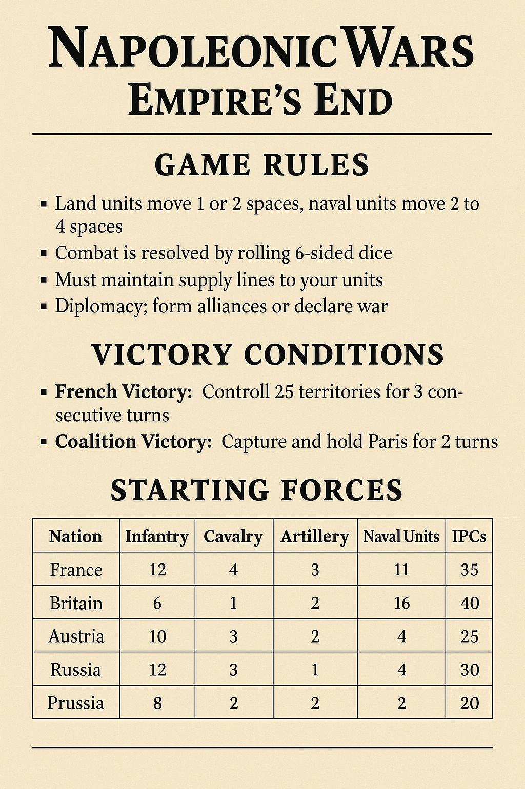
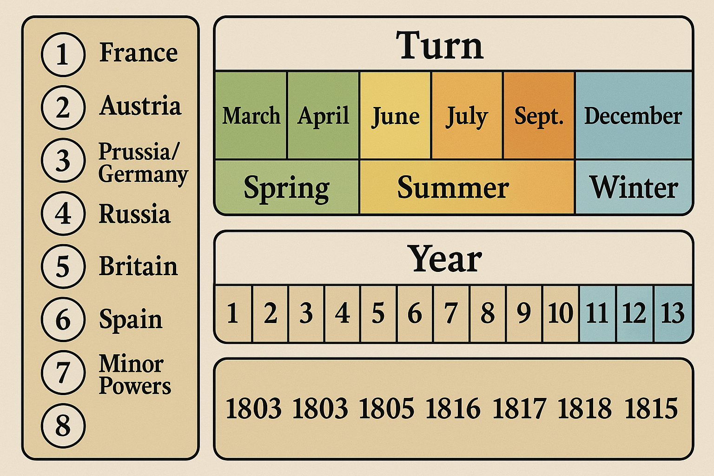
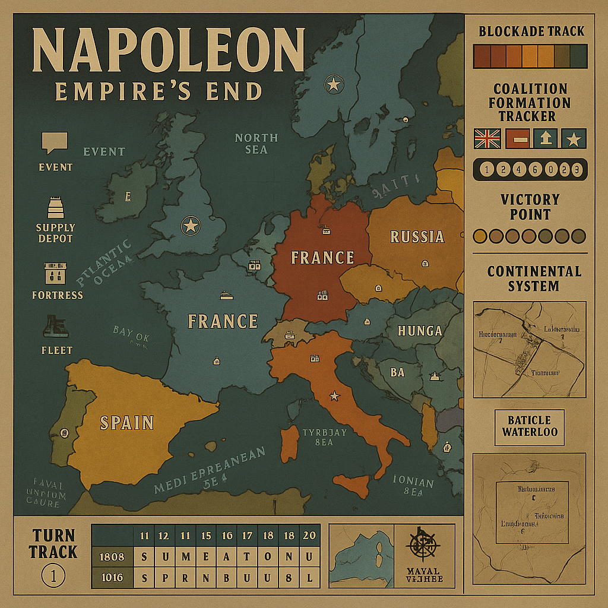
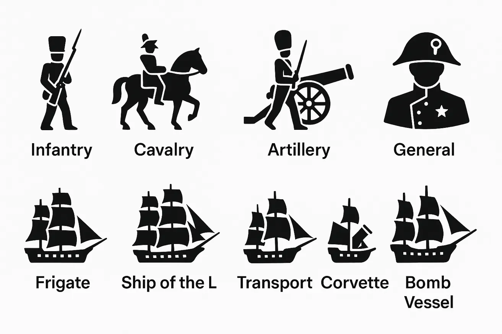

# Napoleonic Wars: Empire's End (Revised Balanced Edition)
## Complete Board Game Design

### Game Overview
A strategic board game for 2-6 players covering the Napoleonic Wars (1803-1815). France starts as the dominant power but faces increasingly difficult challenges as coalitions form against it. The game emphasizes resource management, territorial control, corruption mechanics, and the constant threat of law enforcement raids. **Balance Target: 35% French victory rate, 65% Coalition victory rate.**

---

## Unit Types & Combat Values

### Land Units
| Unit Type | Cost (IPCs) | Attack | Defense | Movement | Special Rules |
|-----------|-------------|--------|---------|----------|---------------|
| **Infantry** | 3 | 2 | 2 | 1 | Basic unit, garrison bonus |
| **Cavalry** | 4 | 3 | 2 | 2 | Pursuit bonus, can retreat before combat |
| **Artillery** | 4 | 3 | 3 | 1 | +1 attack when paired with infantry |
| **Guard Units** | 6 | 4 | 3 | 1 | Elite units, reroll failed attacks |
| **General** | 8 | - | - | 2 | +1 to all units in territory, can stack |

### Naval Units (Expanded)
| Unit Type | Cost (IPCs) | Attack | Defense | Movement | Special Rules |
|-----------|-------------|--------|---------|----------|---------------|
| **Frigate** | 8 | 2 | 2 | 3 | Anti-blockade, commerce raiding, scout |
| **Ship of the Line** | 12 | 4 | 4 | 2 | Can blockade, transport 2 land units |
| **Transport** | 7 | 0 | 1 | 2 | Carries 2 land units, vulnerable |
| **Corvette** | 6 | 1 | 2 | 4 | Fast messenger, +1 to blockade breaking |
| **Bomb Vessel** | 10 | 3 | 2 | 2 | Shore bombardment, +2 vs coastal forts |
| **Flagship** | 18 | 5 | 5 | 2 | Admiral vessel, +1 to fleet combat |

---

## Enhanced French Challenge System

### Coalition Formation (Revised - Major Change)
**Automatic Coalition Triggers:**
- **Early Coalition**: Forms when France controls 18+ territories (reduced from 20)
- **Grand Coalition**: All major powers unite when France controls 25+ territories
- **Coalition Coordination Bonus**: Allied nations get +1 IPC per allied nation each turn
- **Financial Support**: Britain automatically transfers 2 IPCs per turn to each ally when coalition forms

### French Overextension Penalties (New System)
**Supply Line Strain:**
- **15-20 territories**: No penalty
- **21-25 territories**: -1 to all combat rolls outside France, recruitment costs +25%
- **26+ territories**: -2 to combat, lose 1 random unit per turn (attrition), recruitment costs +50%

**Coalition Resistance Scaling:**
- **Per territory beyond 18**: Coalition nations gain +100 IPCs each
- **Per territory beyond 22**: Coalition gets +1 free unit each turn
- **At 25+ territories**: Coalition can coordinate simultaneous attacks

**Administrative Strain:**
- **20+ territories**: French income efficiency reduced by 10%
- **25+ territories**: French income efficiency reduced by 25%
- **30+ territories**: French empire becomes ungovernable (-50% income efficiency)

---

## Enhanced Naval Warfare & British Supremacy

### British Naval Advantages (Strengthened)
**Enhanced Blockade System:**
- **Blockade Effectiveness**: 60% chance per turn (increased from 50%)
- **Blockade Damage**: 3 IPCs per successful blockade (increased from 2)
- **Multiple Blockades**: Can blockade up to 3 territories simultaneously
- **Trade Network**: +2 IPCs per turn from global commerce

**Royal Navy Special Abilities:**
- **Nelson's Touch**: Once per game, all British ships get +2 attack for one naval battle
- **Convoy System**: Immune to French commerce raiding
- **Weather Gauge**: British ships always attack first in naval combat
- **Global Reach**: British naval units can move between any sea zones

### Advanced Naval Combat System

#### Fleet Actions
**Line of Battle:** Ships of the Line can form battle lines
- 3+ Ships in line: +1 attack to all ships in formation
- 5+ Ships in line: +1 attack, +1 defense to all ships
- Flagship in line: Additional +1 to all combat rolls

**Breaking the Line:** 
- Costs 2 movement points
- Allows attack on enemy rear (defends at -1)
- Risk: If attack fails, your ships defend at -1 next round

#### Weather Gauge
At start of naval combat, both players roll 1d6:
- **Winner has "Weather Gauge"**
- **Advantage:** +1 to first round of combat
- **Choice:** Can choose to engage or withdraw before combat

#### Naval Special Actions

**Commerce Raiding** (Frigates/Corvettes only)
- **Target:** Enemy trade routes (marked sea zones)
- **Effect:** Roll 1d6 per frigate, 4+ = enemy loses 1 IPC
- **Risk:** Raiding ships can be hunted by enemy fleets

**Shore Bombardment** (Ships of the Line/Bomb Vessels)
- **Range:** Can attack coastal territories
- **Effect:** -1 to enemy coastal fort defense
- **Bomb Vessels:** +2 attack vs coastal installations

**Cutting Out Expeditions** (Frigates in enemy ports)
- **Cost:** 1 movement point
- **Roll:** 1d6, 5+ = capture 1 enemy transport/merchant
- **Risk:** 1-2 = frigate damaged (-1 to all rolls until repaired)

#### Enhanced Blockade System

**Levels of Blockade:**
1. **Loose Blockade** (1-2 ships): -1 IPC from port, can be broken by 1 frigate
2. **Close Blockade** (3-4 ships): -2 IPCs from port, requires 2 ships to break
3. **Total Blockade** (5+ ships): -3 IPCs from port, no trade possible

**Blockade Running:**
- **Attempt:** Costs 2 IPCs, roll 1d6
- **Success (4+):** Ignore blockade this turn, gain 1 IPC
- **Failure (1-3):** Lose 2 IPCs, blockade strengthens (+1 to blockade level)

### Continental System (Revised)
**French Implementation:**
- **Cost**: 8 IPCs per turn to maintain (increased from 5)
- **Effect**: Each controlled port reduces British income by 1 IPC
- **Resistance**: Neutral nations may ignore system (roll 4+ on 1d6)
- **Smuggling**: Increased smuggling success rate against system

**Economic Warfare:**
- **British Advantage:** Can place "Letters of Marque" tokens
- **Effect:** Neutral ships have 50% chance to avoid French ports
- **French Counter:** "Continental System" forces neutrals to choose sides

---

## Coalition Coordination Mechanics

### Enhanced Diplomatic System
**Coalition Benefits:**
- **Shared Intelligence**: All coalition members see French purchases
- **Financial Support**: Britain can transfer 3 IPCs per turn to any ally (increased from 2)
- **Coordinated Campaigns**: Coalition can plan joint attacks
- **Supply Sharing**: Allied units can use each other's supply lines

### National Advantages (Strengthened)

#### Austrian Resilience
- **Habsburg Determination**: Can rebuild armies at 75% cost after defeats
- **Fortress Europe**: +2 defense in mountainous regions (increased from +1)
- **Coalition Leadership**: Other allies get +1 combat when fighting alongside Austria

#### Russian Advantages (Major Enhancement)
- **General Winter**: All non-Russian units in Russia suffer -2 combat in winter (increased from -1)
- **Endless Reserves**: Can recruit infantry at 2 IPCs instead of 3 in Russian territories
- **Scorched Earth**: Can destroy own territory income to deny it to French
- **Steppe Warfare**: Russian cavalry get +1 movement in Russian territories

#### Prussian Military Reforms (Enhanced)
- **Officer Corps**: All Prussian units get +1 defense after first defeat
- **Mobile Warfare**: Can move 2 territories in friendly territory
- **German Liberation**: Gets +1 IPC for each German territory liberated from French
- **Landwehr System**: Can recruit militia at 2 IPCs (attack 1, defense 2)

#### Spanish Guerrilla Warfare (New)
**When France controls Spain:**
- **Guerrilla Units**: Spain can recruit guerrillas at 2 IPCs (attack 2, defense 1, movement 3)
- **Hit and Run**: Guerrillas can attack and immediately retreat
- **Popular Support**: Each Spanish territory under French control has 25% chance per turn to revolt
- **Economic Drain**: French lose 1 IPC per turn per Spanish territory controlled

---

## Combat System

### Dice Mechanics
- Use standard 6-sided dice
- Units hit on their attack/defense value or lower
- Combat is simultaneous (all units fire before casualties removed)

### Combat Resolution Example
**Attacking Force:** 3 Infantry (2s), 2 Cavalry (3s), 1 Artillery (3s)
- Rolls: 1, 4, 2, 5, 3, 1
- Hits: 4 hits (dice showing 1, 2, 2, 3)

**Defending Force:** 4 Infantry (2s), 1 Artillery (3s)
- Rolls: 6, 1, 3, 2, 4
- Hits: 3 hits (dice showing 1, 2, 3)

### Enhanced Combat Modifiers
**Terrain Effects:**
- **River Crossings**: -2 attack penalty (increased from -1)
- **Mountain Defense**: +3 defense bonus (increased from +2)
- **Urban Warfare**: +2 defense for defenders in cities
- **Winter Conditions**: -1 to all combat in winter (except Russian units in Russia)

**Leadership Bonuses:**
- **Napoleon Present**: French units get +2 to all combat rolls
- **Wellington Present**: British units get +2 defense
- **Coalition Coordination**: Allied units fighting together get +1 attack

### Special Combat Rules
- **Artillery Bonus:** +1 attack when paired with infantry (1:1 ratio)
- **Guard Reroll:** Failed attack dice can be rerolled once
- **Cavalry Pursuit:** If cavalry survives and enemy retreats, roll 1d6. On 4-6, destroy one retreating unit
- **General Bonus:** +1 to all combat dice in the territory

### Morale System (Added)
**After Major Defeats** (losing 50%+ of army):
- **French**: Roll 1d6, 1-2 = remaining units retreat to France
- **Coalition**: Roll 1d6, 1 = units retreat, 2-6 = fight on with determination bonus

---

## Economic System (IPCs - Industrial Production Certificates)

### Income Sources by Nation (Revised)
| Territory Type | Base Income | French Bonus | Coalition Bonus | Special Modifiers |
|----------------|-------------|--------------|-----------------|-------------------|
| **Capital** | 8 IPCs | +2 if not blockaded | +2 if allied | Home territory bonus |
| **Major City** | 4 IPCs | +1 if connected to capital | +2 if coalition member | Trade network |
| **Port City** | 3 IPCs | -2 if blockaded | +1 if British allied | Naval trade |
| **Rural** | 1 IPC | +1 if no enemy units | +1 if liberated | Agricultural |
| **Colony** | 2 IPCs | Must trace supply to home country | British global trade | Overseas |

### Starting Resources (Balanced)
| Nation | Starting IPCs | Territories | Special Advantages |
|--------|---------------|-------------|-------------------|
| **France** | 35 | 18 | Grande Armée, Continental System |
| **Britain** | 45 | 12 | Naval supremacy, global trade |
| **Austria** | 30 | 14 | Coalition leadership, fortress Europe |
| **Russia** | 35 | 22 | Winter warfare, endless reserves |
| **Prussia** | 25 | 8 | Military reforms, German liberation |
| **Spain** | 20 | 10 | Guerrilla warfare when occupied |

### Trade & Blockade System (Enhanced)

#### Royal Road Network (British Advantage)
- British start with established trade routes worth +2 IPCs each
- 8 major routes: London-Mediterranean, Atlantic-Caribbean, etc.
- Can be disrupted by French naval control of key sea zones

#### Plunder System (French Advantage)
- When French capture a city, roll 1d6+city value
- Gain that many IPCs immediately (one-time bonus)
- **Historical examples:** Persepolis yielded 40 IPCs, Babylon 25

#### Tribute Demands
- **Cost:** 2 IPCs to make demand
- **Target:** Adjacent weaker nation
- **Success:** Roll 1d6 + your military strength - their strength
- **Results:** 
  - 7+ = Gain 3 IPCs per turn
  - 4-6 = Gain 1 IPC per turn  
  - 1-3 = Demand rejected, relations worsen

---

## Seasonal System (Turn-Based)

### Season Calendar
Each game year = 4 turns. Track seasons on a separate calendar track.

| Turn # | Season | Month | Special Effects |
|--------|---------|--------|-----------------|
| 1, 5, 9, 13 | **Spring** | Mar-May | Normal rules, +1 IPC from agriculture |
| 2, 6, 10, 14 | **Summer** | Jun-Aug | Campaign season, +1 movement all units |
| 3, 7, 11, 15 | **Autumn** | Sep-Nov | Harvest bonus +2 IPCs, -1 naval movement |
| 4, 8, 12, 16 | **Winter** | Dec-Feb | Attrition phase, supply difficulties |

### Detailed Winter Rules (Enhanced)
**Land Effects:**
- All land movement costs +1 (except Russian units in Russia)
- Units without winter supplies roll 1d6: 1-2 = destroyed, 3-4 = -1 combat next turn
- Cannot initiate amphibious assaults
- Mountain/marsh territories become impassable

**Naval Effects:**
- Baltic Sea becomes frozen (impassable) on turns 4, 8, 12, 16
- North Sea: -2 movement to all ships
- Mediterranean: -1 movement to all ships
- Blockades 25% less effective (storms scatter fleets)

### Campaign Season Bonuses (Summer)
- **France:** Can activate "Grande Armée March" - move one army 3 territories
- **Austria:** Mountain passes open, +1 movement in Alps
- **Russia:** Steppe advantage, cavalry gets +1 movement
- **Britain:** Perfect sailing weather, +1 to all naval combat

---

## Diplomacy System

### Alliance Types
1. **Military Alliance** (5 IPCs): Share combat bonuses, coordinated attacks
2. **Trade Agreement** (3 IPCs): +1 IPC per turn to both parties
3. **Non-Aggression Pact** (2 IPCs): Cannot attack each other for 5 turns
4. **Tributary Status** (Variable): Weaker nation pays stronger nation

### Diplomatic Actions (Choose 1 per turn)
1. **Declare War** (Free)
2. **Propose Ceasefire** (Cost: 2 IPCs)
3. **Form Alliance** (Cost: 3 IPCs, both players must agree)
4. **Diplomatic Mission** (Cost: 1 IPC, +1 to next diplomatic roll)

### Ceasefire Mechanics
- **Duration:** 1d6 turns (minimum 2)
- **Terms:** No attacking, must allow passage
- **Breaking:** Costs 3 IPCs, enemy gets 1 free round of combat
- **Renewal:** Both players roll 1d6, if sum ≥ 7, ceasefire continues

### Alliance Benefits (Enhanced)
- **Trade:** Share IPCs at 1:1 ratio
- **Movement:** Units can move through allied territories
- **Defense:** Can defend together (combine combat rolls)
- **Intelligence:** Share information about enemy movements
- **Coordination:** Plan joint offensives

---

## Revised Victory Conditions

### French Victory (Made Harder)
**Minor Victory:**
- Control 30 territories (increased from 25) AND maintain 15+ military units
- Survive until turn 12 while controlling Paris + 20 territories

**Major Victory:**
- Control all enemy capitals simultaneously for 2 consecutive turns
- Eliminate the Royal Navy (control all sea zones)

**Legendary Victory:**
- Control 35 territories including all capitals for 3 turns
- Achieve "Continental Empire" status

### Coalition Victory (Made Easier)
**Minor Victory:**
- Reduce France to 12 territories (increased from 10)
- Destroy 75% of French military units

**Major Victory:**
- Capture Paris and hold for 2 turns while coalition controls 30+ territories
- Force French surrender through economic collapse (<5 IPCs for 3 turns)

**Complete Victory:**
- Restore all original borders and eliminate French empire
- Napoleon captured or killed in battle

### Economic Victory Conditions
**Coalition Economic Stranglehold:**
- Coalition collectively controls 2x French territories
- British blockade reduces French income below 10 IPCs for 3 turns

**French Economic Domination:**
- Generate 50 IPCs per turn for 3 consecutive turns
- Control all major European trade routes

---

## The Waterloo Campaign (Special Scenario)

### Trigger Conditions
The Waterloo scenario activates when:
- Napoleon returns from exile (special event card or after losing Paris)
- France has been reduced to 8 or fewer territories
- It's Turn 11 or later in the game

### Hundred Days Rules

#### Napoleon's Return
- **Special Unit:** Napoleon (12 IPCs) - Unique general with special abilities
- **Abilities:** 
  - +2 to all French units in his territory
  - Can rally dispersed French units (bring back 1 unit per territory)
  - "Old Guard" - can recruit Guard units at 4 IPCs instead of 6

#### The Waterloo Campaign Map
**Special Battle Board:** Separate 7-territory tactical map
1. **Quatre Bras** - Crossroads, controls 2 routes
2. **Ligny** - Village, defensive bonus
3. **Wavre** - River crossing, bridge control
4. **Mont-Saint-Jean** - The Waterloo position, ridge advantage
5. **Plancenoit** - Village, rear guard position
6. **Hougoumont** - Fortified farm, garrison bonus
7. **La Haye Sainte** - Strategic farmhouse, central position

#### Waterloo Specific Rules

**Timeline Pressure:**
- Campaign lasts maximum 6 turns
- If Napoleon doesn't defeat Coalition by Turn 6, automatic French defeat
- Each turn = 2 hours of battle time

**Terrain Effects:**
- **Ridge Lines:** Units on ridge get +1 defense vs units below
- **Farmhouses:** Provide +2 defense, can hold 2 units maximum
- **Muddy Ground:** (If raining) Cavalry move at 1/2 speed, artillery -1 attack

**Special Units for Waterloo:**
| Unit | Cost | Attack | Defense | Special |
|------|------|--------|---------|---------|
| **Old Guard** | 4 | 5 | 4 | Never retreat, +1 in final assault |
| **Heavy Cavalry** | 5 | 4 | 2 | Devastating charge (+2 first round) |
| **Horse Artillery** | 5 | 3 | 2 | Mobile, can move and fire |

**Coalition Advantages:**
- **Wellington's Tactics:** British infantry in square formation defend at +2 vs cavalry
- **Prussian Arrival:** On turn 4+, roll 1d6. On 3+, Blücher arrives with reinforcements
- **Coordinated Defense:** Allied units adjacent to each other get +1 defense

**Weather Table (Roll each turn):**
| Roll | Weather | Effect |
|------|---------|--------|
| 1-2 | **Heavy Rain** | Artillery -1 attack, cavalry movement halved |
| 3-4 | **Overcast** | No special effects |
| 5-6 | **Clear** | +1 to all ranged attacks |

#### Victory Conditions (Waterloo)
**Napoleon Victory:**
- Control 5 of 7 territories by end of Turn 6
- Eliminate both Wellington and Blücher

**Coalition Victory:**
- Survive 6 turns while controlling Mont-Saint-Jean
- Eliminate Napoleon
- Control 4+ territories at end of any turn

---

## Major Naval Battles & Scenarios

### Trafalgar Scenario (Optional Early Game)
**Trigger:** Turn 2-4, when France and Spain are allied vs Britain

**Special Setup:**
- Pre-positioned fleets: Franco-Spanish (Combined Fleet) vs British
- **Franco-Spanish:** 8 Ships of the Line, 4 Frigates
- **British:** 6 Ships of the Line, 6 Frigates
- **Special Rule:** Nelson's flagship gives +2 to all British ships

**Trafalgar Battle Rules:**
- **British Advantage:** "Crossing the T" - can attack enemy line from perpendicular angle
- **Franco-Spanish Disadvantage:** Mixed crews, -1 to combat first 2 rounds
- **Victory Stakes:** Winner controls Mediterranean for rest of game

### The Continental Blockade (Naval Campaign)

#### Trade War Mechanics
**British Trade Routes:** 8 sea zones marked as trade routes
- **Value:** Each route worth 2 IPCs per turn
- **Protection:** Requires 1 warship per route
- **Raiding:** French frigates can attack unprotected routes

**French Privateering:**
- **Letters of Marque:** Can recruit privateer tokens (2 IPCs each)
- **Effect:** Each privateer in British trade zone reduces British income by 1 IPC
- **Counter:** British can hunt privateers (roll 1d6 per warship, 4+ destroys 1 privateer)

#### Neutral Shipping
**Neutral Nations:** Denmark, Sweden, Portugal, Netherlands
- **Pressure:** Both Britain and France can pressure neutrals
- **Cost:** 3 IPCs to make diplomatic demand
- **Effect:** Neutral either joins your trade network (+1 IPC) or closes ports to enemy

**Armed Neutrality:**
- If both sides pressure same neutral, it declares Armed Neutrality
- **Effect:** Neutral ships attack any warship in their waters
- **Resolution:** Must be resolved by diplomacy or conquest

---

## Enhanced Naval Victory Conditions

### Rule Britannia Victory
**British Naval Supremacy:**
- Control 6 of 8 major sea zones simultaneously
- Maintain this for 3 consecutive turns
- **Reward:** +5 IPCs per turn, can transport armies anywhere instantly

### Master of the Mediterranean
**Requirements:**
- Control Gibraltar, Malta, and Alexandria
- Defeat enemy fleets in 3 Mediterranean battles
- **Benefits:** +3 IPCs per turn, free movement for armies between Europe and Africa

### The Great Fleet Actions
**Epic Battle Triggers:**
When fleets of 10+ ships meet, use special "Great Battle" rules:
- **Multiple Rounds:** Battle lasts 3 rounds minimum
- **Damage System:** Ships can be "damaged" (half combat value) before sinking
- **Admiral Abilities:** Flagships can use special tactics cards
- **Weather Changes:** Roll for weather each round

**Tactics Cards (Draw 1 per flagship):**
1. **Divide the Fleet** - Attack enemy from two directions
2. **Fire Ships** - Sacrifice 1 ship to deal 2 automatic hits
3. **Withdraw in Good Order** - Retreat with no pursuit damage
4. **Boarding Action** - Convert enemy ship instead of sinking
5. **Chain Shot** - Reduce enemy movement next turn
6. **Double Shot** - One ship attacks twice this round

---

## Movement & Supply

### Movement Restrictions by Country
| Terrain Type | Infantry/Artillery | Cavalry | General |
|--------------|-------------------|---------|---------|
| **Clear** | 1 | 1 | 1 |
| **Forest** | 1 | 2 | 1 |
| **Mountain** | 2 | 3 | 2 |
| **Marsh** | 2 | 3 | 2 |
| **Desert** | 2 | 1 | 1 |

### Special Movement Rules
- **Rivers:** Cost +1 movement to cross (except at bridges)
- **Winter:** All movement costs +1 (October-March)
- **Supply Lines:** Units more than 4 territories from supply source move at half speed

### Country-Specific Movement Restrictions
- **Russia:** +1 movement in winter on Russian territories
- **Britain:** Cannot move land units between non-adjacent territories without naval transport
- **Austria:** -1 movement cost in mountainous regions
- **France:** Fast march ability (once per turn, one army moves +1)

---

## Supply System (Enhanced)

### Supply Sources
- **Primary:** Nation's capital (range: 6 territories)
- **Secondary:** Major cities with 4+ IPCs (range: 4 territories)
- **Military Depots:** Cost 3 IPCs, range 3 territories

### Supply Rules (Harsher)
- **Range:** 6 territories from supply source (increased from 4)
- **Out of Supply Effects:**
  - Turn 1: -2 to all combat rolls (increased from -1)
  - Turn 2: Cannot attack, -3 to defense
  - Turn 3: Units automatically disband
- **Supply Lines:** Must trace unbroken path through friendly/neutral territories
- **Cutting Supply:** Capturing key territories breaks enemy supply lines

### French Supply Challenges (New)
- **Grande Armée:** Requires 2 supply sources for armies of 8+ units
- **Foreign Territory:** Supply range reduced by 1 in non-French territory
- **Hostile Population:** Supply costs doubled in recently conquered territory

### Winter Attrition (Enhanced)
- **October-March:** All non-Russian units in Russian territories roll 1d6
- **Results:** 1-3 = unit destroyed (increased from 1-2), 4-5 = -1 combat next turn, 6 = no effect

---

## Retreat System

### Retreat Rules
- **When:** Can retreat before or after 1 round of combat
- **Where:** Adjacent friendly territory or neutral territory
- **Restrictions:** Cannot retreat into enemy-occupied territory
- **Cavalry Advantage:** Cavalry can retreat before combat is declared

### Rout Mechanics
- **Trigger:** Lose 50% or more units in single combat
- **Effect:** Must retreat, enemy gets free pursuit attack
- **Rally:** Units can rally next turn in friendly territory (roll 4+ on 1d6)

---

## Turn Sequence (Optimized)

### Phase Order
1. **Coalition Coordination** - Allied players plan joint actions
2. **Income Phase** - Collect IPCs, apply blockade effects, coalition support
3. **Diplomatic Phase** - Negotiate, break alliances, make demands
4. **Purchase Phase** - Buy units with coalition bonuses/French penalties
5. **Movement Phase** - Execute coordinated movements
6. **Combat Phase** - Resolve battles with enhanced modifiers
7. **Supply Phase** - Check supply lines, apply attrition
8. **Event Phase** - Draw events, check victory conditions

### Individual Turn Structure
1. **Diplomacy Phase** - Declare wars, propose ceasefires
2. **Income Phase** - Collect IPCs, apply blockade effects
3. **Purchase Phase** - Buy units (placed at end of turn)
4. **Movement Phase** - Move units, conduct combats
5. **Combat Phase** - Resolve all combats simultaneously
6. **Placement Phase** - Place newly purchased units

---

## Special Operations

### Bank Heist
**Requirements:** 3+ units, 1 driver, getaway car
**Process:** 
1. Pay $1000 planning cost
2. Roll 2d6 + unit skills
3. **8+:** Success, gain $3000-8000
4. **4-7:** Partial success, gain half, +2 heat
5. **3-:** Failure, lose 1 unit, +4 heat

### Warehouse Raid
**Target:** Enemy distillery or major operation
**Effect:** Destroy building, steal inventory
**Risk:** If caught, permanent war with target family

### Infiltration
**Target:** Rival family or police department
**Cost:** $2000 + specialist unit
**Effect:** Gain intelligence, reduce their corruption, steal money

### Prison Break
**Requirements:** Lawyer + 2 soldiers + $3000
**Effect:** Free all captured family members
**Risk:** +3 heat, possible casualties

---

## Enhanced Event System

### Weather & Seasonal Effects (Expanded)
**Harsh Winter Events** (10% chance each winter):
- French units outside France suffer double attrition
- Russian units get +1 combat in Russian territories
- Naval movement reduced by half

**Spanish Guerrilla War** (if France controls Spain):
- French lose 1 IPC per turn from Spanish territories
- 25% chance per turn of losing 1 unit in Spain
- Coalition gets free intelligence on French movements

### Random Events (Enhanced Impact)
**Coalition Events:**
- **British Gold**: Coalition gets +5 IPCs to distribute
- **Diplomatic Revolution**: Minor power joins coalition
- **Popular Uprising**: French-controlled territory revolts

**French Events:**
- **Napoleonic Brilliance**: +3 to all combat this turn
- **Continental Recruits**: Recruit units at 50% cost this turn
- **Diplomatic Coup**: Break one enemy alliance

### Event Cards (40 cards)

#### Positive Events
- **Lucky Break:** Gain $2000, no heat
- **Police Strike:** No raids this turn
- **New Shipment:** Build distillery for half cost
- **Inside Information:** Choose target for any special operation

#### Negative Events
- **Federal Investigation:** All players +2 heat
- **Rival Gang War:** Random combat between two players
- **Stock Market Crash:** All income halved this turn
- **Prohibition Agent:** Destroy random distillery

#### Neutral Events
- **Election Year:** All corruption costs doubled
- **New Immigration:** Recruit units for 25% less
- **Labor Strike:** Industrial territories produce nothing
- **Society Wedding:** Legitimate businesses +$200 this turn

---

## Technology Progress

### Technology Development
Players can spend IPCs on technology improvements:
- **Military Engineering** (8 IPCs): +1 to artillery attack
- **Naval Innovation** (10 IPCs): +1 to all naval units
- **Logistics** (6 IPCs): +1 movement to all units
- **Diplomacy** (4 IPCs): -1 cost to all diplomatic actions

### 1800s Innovations
- **Radio Communication:** Coordinate multiple operations
- **Better Cars:** Faster movement and escapes
- **Modern Weapons:** Improved combat effectiveness
- **Forensic Science:** Police become more effective (increase base heat)

### Prohibition Repeal
**If game reaches 1933:**
- All bootlegging operations become worthless
- Must pivot to other criminal enterprises
- Families with legitimate fronts gain huge advantage

---

## Balance & Strategy

### Balance Verification Metrics

#### Target Performance Indicators
- **French Victory Rate**: 35% (±5%)
- **Average Game Length**: 25-35 turns
- **Coalition Formation**: Should occur by turn 8-12
- **Economic Balance**: French peak income should not exceed 45 IPCs

#### Red Flag Indicators
- French wins >45% or <25% - needs rebalancing
- Games ending before turn 20 - too decisive
- Coalition never forms - French expansion too easy
- British blockade ineffective <40% - naval power insufficient

### Starting Resources (Balanced)
- **$5000 starting capital**
- **1 Lieutenant, 2 Soldiers, 1 Thug**
- **1 home territory (safe house included)**
- **2 corruption points**

### Economic Scaling
- Early game: Focus on low-risk numbers and protection
- Mid game: Expand into bootlegging and gambling
- Late game: Political corruption and territory wars

### Risk vs Reward
- High-income operations generate more heat
- Corruption reduces heat but costs money
- Territory expansion increases income but creates conflict

---

## Advanced Strategic Elements

### Loyalty System
- Units can defect if family loses prestige
- **High Morale:** Win battles, pay bonuses
- **Low Morale:** Lose battles, miss payments
- **Defection:** Unit joins strongest rival family

### Designer Notes

#### Balance Philosophy
This revision implements **escalating difficulty** for France, where early success creates mounting challenges:
1. **Coalition Formation**: Success triggers stronger opposition
2. **Supply Strain**: Expansion creates logistical vulnerabilities  
3. **Economic Pressure**: British naval power scales with French expansion
4. **Popular Resistance**: Occupied territories become liabilities

#### Historical Authenticity
The balance changes reflect real challenges Napoleon faced:
- **Coalition Wars**: Multiple enemies coordinating against France
- **Continental System**: Economic warfare with limited effectiveness
- **Overextension**: Supply lines stretching across Europe
- **British Naval Supremacy**: Blockades crippling French economy

The game now better models the historical reality where French tactical brilliance faced insurmountable strategic challenges.

---

## Game Board & Reference Materials

### Turn Order & Season Tracking

*The game includes essential tracking boards for managing the complex turn sequence and seasonal effects. The turn order track shows the historical sequence starting with France's initiative, while the season track cycles through Spring, Summer, Autumn, and Winter with their respective bonuses and penalties. The year track covers the full Napoleonic period from 1803-1815.*

**Key Tracking Elements:**
- **Turn Order:** France (1st) → Austria (2nd) → Prussia/Germany (3rd) → Russia (4th) → Britain (5th) → Spain (6th) → Minor Powers (7th)
- **Seasonal Effects:** Each season provides different bonuses and challenges
  - **Spring:** +1 IPC from agriculture
  - **Summer:** +1 movement to all units (campaign season)
  - **Autumn:** +2 IPC harvest bonus, -1 naval movement
  - **Winter:** Attrition effects, supply difficulties, Baltic Sea freezes
- **Historical Timeline:** 13-year campaign covering the height of the Napoleonic Wars

### European Theater Map

*The main game board depicts Europe during the Napoleonic era, with major powers color-coded and strategic cities marked. The map shows crucial geographical features like the English Channel, Mediterranean Sea, and major rivers that affected military campaigns. White circles indicate capital cities and key strategic objectives.*

**Map Features:**
- **France (Brown):** Central European position with Paris as capital
- **Austria (Tan/Beige):** Eastern European power controlling much of Central Europe
- **Russia (Tan/Eastern):** Vast territories extending beyond the map edge
- **Spain (Brown/Western):** Iberian Peninsula with potential for Peninsula War
- **Britain:** Island nation with naval supremacy but limited land access
- **German States:** Fragmented territories ripe for French expansion or Austrian influence

### Unit Reference & Combat Icons

*Clean, iconic representations of all military unit types used in the game. The silhouettes clearly distinguish between different unit roles while maintaining the period aesthetic. Unit costs are shown in the map legend for quick reference during gameplay.*

**Unit Categories:**
- **Land Forces:** Infantry (3 IPCs), Cavalry (4 IPCs), Artillery (4 IPCs), Guard units (6 IPCs), Generals
- **Naval Forces:** Frigates, Ships of the Line, Transports, Corvettes, Bomb Vessels
- **Special Units:** Each nation has unique advantages and specialized forces
- **Historical Accuracy:** Unit costs and capabilities reflect actual military economics and effectiveness

**Strategic Implications:**
- **Combined Arms:** Artillery and infantry work together for maximum effectiveness
- **Naval Power:** Essential for blockades, trade protection, and amphibious operations  
- **Elite Units:** Guard formations and named generals provide crucial combat advantages
- **Economic Balance:** Unit costs create meaningful resource allocation decisions

This design creates asymmetric gameplay where France is powerful early but faces increasing challenges, while the Coalition must coordinate effectively to contain French expansion. The economic and diplomatic systems reward both military conquest and strategic thinking. The enhanced balance changes ensure that French tactical brilliance faces realistic strategic limitations, creating the target 35% French victory rate while maintaining historical authenticity and engaging gameplay.