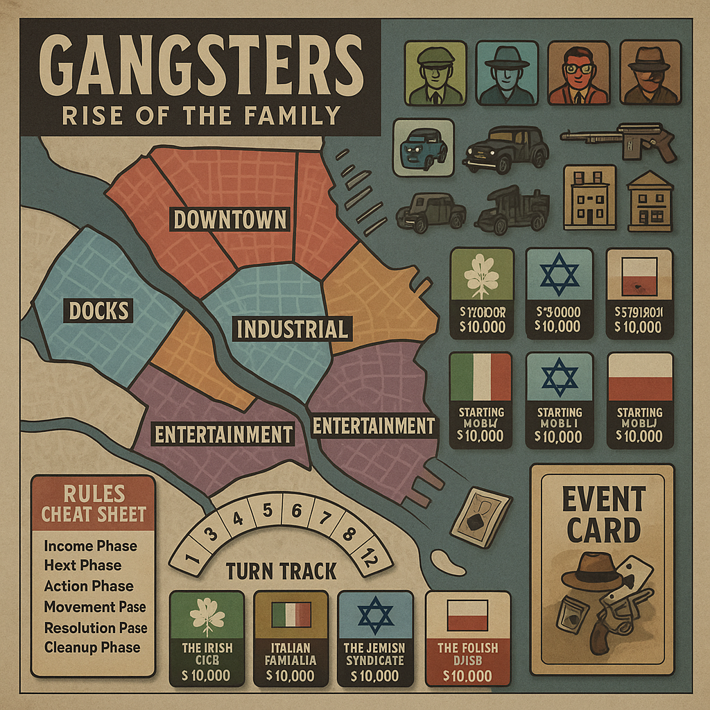

# Gangsters: Rise of the Family

## Complete Board Game Design

### Game Overview

A strategic board game for 2-6 players set during Prohibition-era America (1920-1933). Players control rival crime families competing for control of illegal operations, territory, and political influence. The game emphasizes resource management, territorial control, corruption mechanics, and the constant threat of law enforcement raids.

---

## Unit Types & Operations

### Criminal Personnel

| Unit Type            | Cost ($) | Attack | Defense | Movement | Special Abilities                       |
| -------------------- | -------- | ------ | ------- | -------- | --------------------------------------- |
| **Thug**       | 500      | 2      | 2       | 2        | Cheap muscle, intimidation              |
| **Soldier**    | 1000     | 3      | 3       | 2        | Professional enforcer                   |
| **Lieutenant** | 2000     | 4      | 3       | 3        | Commands territory, +1 to nearby units  |
| **Capo**       | 3500     | 4      | 4       | 3        | Regional commander, corruption bonus    |
| **Accountant** | 1500     | 1      | 2       | 2        | +$500 income per turn, money laundering |
| **Lawyer**     | 2500     | 1      | 1       | 3        | Reduces heat, gets units out of jail    |
| **Hitman**     | 3000     | 5      | 2       | 3        | Assassination specialist, stealth       |
| **Driver**     | 800      | 2      | 2       | 4        | Fast movement, getaway bonus            |

### Vehicles & Equipment

| Item Type             | Cost ($) | Effect          | Special Rules                       |
| --------------------- | -------- | --------------- | ----------------------------------- |
| **Car**         | 1200     | +1 movement     | Can transport 2 units               |
| **Armored Car** | 3000     | +1 defense      | Immune to first hit per combat      |
| **Tommy Gun**   | 800      | +1 attack       | Can be equipped by any unit         |
| **Safe House**  | 2000     | Territory bonus | Reduces heat by 1 per turn          |
| **Speakeasy**   | 3500     | Income building | Generates $800/turn                 |
| **Distillery**  | 5000     | Production      | Generates $1200/turn, attracts heat |

---

## Economic System

### Income Sources

| Business Type                 | Base Income | Heat Generated | Special Requirements           |
| ----------------------------- | ----------- | -------------- | ------------------------------ |
| **Numbers Racket**      | $400/turn   | +1 Heat/turn   | Need 1 Thug minimum            |
| **Protection Racket**   | $600/turn   | +1 Heat/turn   | Must control business district |
| **Bootlegging**         | $1000/turn  | +2 Heat/turn   | Requires distillery            |
| **Gambling Den**        | $800/turn   | +1 Heat/turn   | Need safe house                |
| **Loan Sharking**       | $500/turn   | +1 Heat/turn   | Requires accountant            |
| **Legitimate Business** | $300/turn   | No heat        | Front for other operations     |

### Heat & Law Enforcement

**Heat Level Effects:**

* **0-2 Heat:** Normal operations
* **3-4 Heat:** -10% income, police raids possible
* **5-6 Heat:** -25% income, frequent raids
* **7-8 Heat:** -50% income, federal investigation
* **9-10 Heat:** FBI crackdown, lose 2 random units

**Reducing Heat:**

* **Bribe Police:** $1000 reduces heat by 2
* **Lay Low:** Skip turn actions, reduce heat by 1
* **Lawyer:** Automatic -1 heat per turn per lawyer
* **Legitimate Fronts:** Each reduces heat by 1

---

## Territory Control System

### Neighborhood Types

| District Type           | Control Bonus                                | Special Rules            |
| ----------------------- | -------------------------------------------- | ------------------------ |
| **Downtown**      | +$800/turn    | Expensive ($5000 to control) |                          |
| **Docks**         | +$600/turn                                   | Required for smuggling   |
| **Industrial**    | +$400/turn                                   | Can build distilleries   |
| **Residential**   | +$300/turn                                   | Low heat operations      |
| **Entertainment** | +$700/turn                                   | Gambling and speakeasies |
| **Government**    | No income                                    | Corruption opportunities |

### Corruption Mechanics

**Political Influence:**

* **Beat Cop:** $500 - Ignore 1 raid per turn
* **Detective:** $1500 - Reduce heat by 1 automatically
* **Judge:** $3000 - Get arrested units released
* **Mayor:** $5000 - Control city regulations
* **Police Chief:** $8000 - Immunity to raids

**Corruption Points:**

* Earned by bribing officials
* Spent to influence law enforcement
* Can be stolen by rival families through infiltration

---

## Combat & Conflict Resolution

### Street Wars

**Combat Resolution:**

* Roll 1d6 per unit's attack value
* Hits on 4+ (modified by circumstances)
* Simultaneous combat, casualties removed after
* Winner takes territory if defender eliminated

**Combat Modifiers:**

* **Defending Territory:** +1 to defense rolls
* **Tommy Guns:** +1 to attack rolls
* **Armored Cars:** First hit ignored
* **Surprise Attack:** Attacker gets first round alone

### Assassination Attempts

**Targeting Rival Leaders:**

* **Cost:** $2000 + hitman unit
* **Success:** Roll 1d6 + hitman skill vs target's defense + bodyguards
* **Consequences:** Success eliminates target, failure generates +3 heat

### Police Raids

**Raid Resolution:**

* Triggered by high heat or event cards
* Target player rolls 1d6 per unit in raided territory
* 1-2: Unit captured, 3-4: Unit escapes, 5-6: Unit fights back
* Captured units go to jail (can be bailed out for $1000 each)

---

## Family Specializations

### The Irish Mob

**Advantages:**

* Thugs cost 25% less
* +1 to all combat in dock territories
* Bootlegging operations generate +$200 extra

**Disadvantages:**

* Politicians cost double to bribe
* Start with +1 heat due to reputation

### The Italian Famiglia

**Advantages:**

* Loyalty bonus: Units never defect
* Capos provide +2 corruption instead of +1
* Can build "Family Compound" (super safe house)

**Disadvantages:**

* All units cost 10% more (quality over quantity)
* Targeted by federal task force (+1 heat from investigations)

### The Jewish Syndicate

**Advantages:**

* Accountants generate +$300 per turn
* Lawyers cost half price
* Money laundering: Can hide 50% of income from raids

**Disadvantages:**

* Limited to 2 thugs per territory (rely on quality)
* Other families get +1 when attacking (outsider status)

### The Polish Gang

**Advantages:**

* Industrial territories generate +$200
* Distilleries cost 25% less to build
* Immune to first corruption attempt each turn

**Disadvantages:**

* Limited political connections (corruption costs +50%)
* Maximum 8 territories (smaller organization)

---

## Turn Sequence

### Phase Order

1. **Income Phase** - Collect money from operations
2. **Heat Phase** - Add heat from illegal activities
3. **Action Phase** - Purchase units, buildings, bribes
4. **Movement Phase** - Move units, initiate conflicts
5. **Resolution Phase** - Resolve combat, raids, events
6. **Cleanup Phase** - Remove heat, check victory conditions

### Action Points System

Each player gets 4 Action Points per turn:

* **Move Units:** 1 AP per group
* **Attack Territory:** 2 AP
* **Build Operation:** 1 AP
* **Bribe Official:** 1 AP
* **Recruit Units:** 1 AP per type
* **Special Operations:** 2 AP (assassination, heist, etc.)

---

## Special Operations

### Bank Heist

**Requirements:** 3+ units, 1 driver, getaway car
**Process:**

1. Pay $1000 planning cost
2. Roll 2d6 + unit skills
3. **8+:** Success, gain $3000-8000
4. **4-7:** Partial success, gain half, +2 heat
5. **3-:** Failure, lose 1 unit, +4 heat

### Warehouse Raid

**Target:** Enemy distillery or major operation
**Effect:** Destroy building, steal inventory
**Risk:** If caught, permanent war with target family

### Infiltration

**Target:** Rival family or police department
**Cost:** $2000 + specialist unit
**Effect:** Gain intelligence, reduce their corruption, steal money

### Prison Break

**Requirements:** Lawyer + 2 soldiers + $3000
**Effect:** Free all captured family members
**Risk:** +3 heat, possible casualties

---

## Victory Conditions

### Economic Victory

* Control $20,000 in weekly income for 3 consecutive turns
* Maintain this while keeping heat below 6

### Territorial Victory

* Control 12 territories simultaneously
* Must include at least 1 of each district type

### Political Victory

* Corrupt the Mayor, Police Chief, and 3 judges
* Maintain control for 2 full turns

### Elimination Victory

* Eliminate all rival family bosses
* Control at least 8 territories

### Survival Victory (if game reaches turn 20)

* Player with highest combined score:
  * (Territories × $500) + (Weekly Income × 2) + (Corruption Points × $100)

---

## Event Cards (40 cards)

### Positive Events

* **Lucky Break:** Gain $2000, no heat
* **Police Strike:** No raids this turn
* **New Shipment:** Build distillery for half cost
* **Inside Information:** Choose target for any special operation

### Negative Events

* **Federal Investigation:** All players +2 heat
* **Rival Gang War:** Random combat between two players
* **Stock Market Crash:** All income halved this turn
* **Prohibition Agent:** Destroy random distillery

### Neutral Events

* **Election Year:** All corruption costs doubled
* **New Immigration:** Recruit units for 25% less
* **Labor Strike:** Industrial territories produce nothing
* **Society Wedding:** Legitimate businesses +$200 this turn

---

## Advanced Rules

### Loyalty System

* Units can defect if family loses prestige
* **High Morale:** Win battles, pay bonuses
* **Low Morale:** Lose battles, miss payments
* **Defection:** Unit joins strongest rival family

### Technology Progress

**1920s Innovations:**

* **Radio Communication:** Coordinate multiple operations
* **Better Cars:** Faster movement and escapes
* **Modern Weapons:** Improved combat effectiveness
* **Forensic Science:** Police become more effective (increase base heat)

### Prohibition Repeal

**If game reaches 1933:**

* All bootlegging operations become worthless
* Must pivot to other criminal enterprises
* Families with legitimate fronts gain huge advantage

---

## Balance & Strategy

### Starting Resources

* **$5000 starting capital**
* **1 Lieutenant, 2 Soldiers, 1 Thug**
* **1 home territory (safe house included)**
* **2 corruption points**

### Economic Scaling

* Early game: Focus on low-risk numbers and protection
* Mid game: Expand into bootlegging and gambling
* Late game: Political corruption and territory wars

### Risk vs Reward

* High-income operations generate more heat
* Corruption reduces heat but costs money
* Territory expansion increases income but creates conflict

