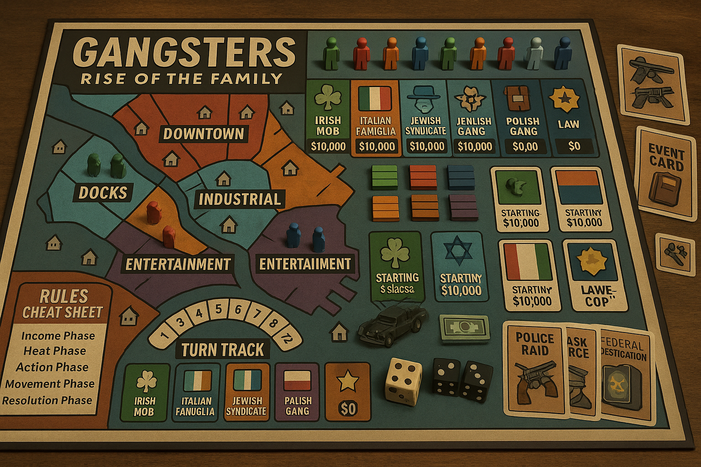

# Gangsters: Rise of the Family (With NYPD) - Complete Revised Edition

## Complete Board Game Design

### Game Overview
A strategic board game for 2-7 players set during Prohibition-era America (1920-1933). Players control rival crime families OR the NYPD competing for control of illegal operations, territory, and political influence. The law enforcement player can choose between honest policing or corrupt activities, creating dynamic alliances and conflicts with criminal factions. **Balance Target: NYPD as wild card faction that can dramatically affect other players' win chances.**

---

## Faction Overview

### Criminal Families
Each starts with Corruption Index: 10, Trust Index: 0

#### The Irish Mob
**Advantages:**
- Thugs cost 25% less
- +1 to all combat in dock territories
- Bootlegging operations generate +$200 extra

**Disadvantages:**
- Politicians cost double to bribe
- Start with +1 heat due to reputation

**Starting Resources:**
- $4000 cash
- 1 Lieutenant, 2 Soldiers, 2 Thugs
- Control: 2 dock territories

#### The Italian Famiglia
**Advantages:**
- Loyalty bonus: Units never defect
- Capos provide +2 corruption instead of +1
- Can build "Family Compound" (super safe house)

**Disadvantages:**
- All units cost 10% more (quality over quantity)
- Targeted by federal task force (+1 heat from investigations)

**Starting Resources:**
- $5000 cash
- 1 Capo, 2 Soldiers, 1 Thug
- Control: 2 downtown territories

#### The Jewish Syndicate
**Advantages:**
- Accountants generate +$300 per turn
- Lawyers cost half price
- Money laundering: Can hide 50% of income from raids

**Disadvantages:**
- Limited to 2 thugs per territory (rely on quality)
- Other families get +1 when attacking (outsider status)

**Starting Resources:**
- $4500 cash
- 1 Lieutenant, 1 Accountant, 2 Soldiers, 1 Thug
- Control: 2 financial district territories

#### The Polish Gang
**Advantages:**
- Industrial territories generate +$200
- Distilleries cost 25% less to build
- Immune to first corruption attempt each turn

**Disadvantages:**
- Limited political connections (corruption costs +50%)
- Maximum 8 territories (smaller organization)

**Starting Resources:**
- $3500 cash
- 1 Lieutenant, 3 Soldiers, 2 Thugs
- Control: 2 industrial territories

---

## NYPD (Wild Card Faction)

### Starting Resources
- **$4000 budget**
- 1 Police Chief, 2 Detectives, 4 Beat Cops, 1 Prosecutor
- Corruption Index: 0, Trust Index: 10
- Control: Police Precincts in each district

### Enhanced Faction Abilities
- **Legal Authority:** Can raid any territory without declaring war
- **Evidence Collection:** Successful raids generate evidence tokens
- **Court System:** Can prosecute criminals using evidence
- **Federal Support:** High trust unlocks FBI assistance
- **Political Influence:** Can affect city policies and elections

---

## Unit Types & Operations

### Criminal Personnel
| Unit Type | Cost ($) | Attack | Defense | Movement | Special Abilities |
|-----------|----------|--------|---------|----------|-------------------|
| **Thug** | 500 | 2 | 2 | 2 | Cheap muscle, intimidation |
| **Soldier** | 1000 | 3 | 3 | 2 | Professional enforcer |
| **Lieutenant** | 2000 | 4 | 3 | 3 | Commands territory, +1 to nearby units |
| **Capo** | 3500 | 4 | 4 | 3 | Regional commander, corruption bonus |
| **Accountant** | 1500 | 1 | 2 | 2 | +$500 income per turn, money laundering |
| **Lawyer** | 2500 | 1 | 1 | 3 | Reduces heat, gets units out of jail |
| **Hitman** | 3000 | 5 | 2 | 3 | Assassination specialist, stealth |
| **Driver** | 800 | 2 | 2 | 4 | Fast movement, getaway bonus |

### NYPD Unit Types & Equipment

#### Law Enforcement Personnel
| Unit Type | Cost ($) | Attack | Defense | Movement | Special Abilities |
|-----------|----------|--------|---------|----------|-------------------|
| **Beat Cop** | 600 | 2 | 3 | 2 | Patrol bonus, evidence collection |
| **Detective** | 1200 | 3 | 3 | 3 | Investigation, undercover work |
| **Sergeant** | 1800 | 3 | 4 | 2 | Command bonus, +1 to nearby cops |
| **Police Chief** | 4000 | 4 | 4 | 3 | Authority, corruption resistance |
| **Prosecutor** | 2000 | 1 | 2 | 2 | Court proceedings, conviction bonus |
| **Federal Agent** | 2500 | 4 | 3 | 3 | High trust only, immunity to bribes |

#### Police Equipment
| Item Type | Cost ($) | Effect | Special Rules |
|-----------|----------|--------|---------------|
| **Police Car** | 1000 | +1 movement | Transport 2 units, siren bonus |
| **Radio System** | 1500 | Coordination | +1 to all raids this turn |
| **Evidence Locker** | 2000 | Storage | Hold 10 evidence tokens |
| **Wiretap** | 800 | Intelligence | Learn enemy operations |

### Vehicles & Equipment
| Item Type | Cost ($) | Effect | Special Rules |
|-----------|----------|--------|---------------|
| **Car** | 1200 | +1 movement | Can transport 2 units |
| **Armored Car** | 3000 | +1 defense | Immune to first hit per combat |
| **Tommy Gun** | 800 | +1 attack | Can be equipped by any unit |
| **Safe House** | 2000 | Territory bonus | Reduces heat by 1 per turn |
| **Speakeasy** | 3500 | Income building | Generates $800/turn |
| **Distillery** | 5000 | Production | Generates $1200/turn, attracts heat |

---

## Enhanced Economic System

### Criminal Income Sources
| Business Type | Base Income | Heat Generated | Special Requirements |
|---------------|-------------|----------------|---------------------|
| **Numbers Racket** | $400/turn | +1 Heat/turn | Need 1 Thug minimum |
| **Protection Racket** | $600/turn | +1 Heat/turn | Must control business district |
| **Bootlegging** | $1000/turn | +2 Heat/turn | Requires distillery |
| **Gambling Den** | $800/turn | +1 Heat/turn | Need safe house |
| **Loan Sharking** | $500/turn | +1 Heat/turn | Requires accountant |
| **Legitimate Business** | $300/turn | No heat | Front for other operations |

### NYPD Budget & Income
**Base Budget:** $2000/turn + trust bonuses
**Additional Income Sources:**
- **High Trust (8-10):** +$1000/turn federal funding
- **Medium Trust (5-7):** +$500/turn state support
- **Asset Forfeiture:** 25% of seized criminal money
- **Fines & Penalties:** $200 per successful prosecution

**Corruption Income (if NYPD goes corrupt):**
- **Protection Payments:** $300/turn per bribed operation
- **Evidence Tampering:** $500 per destroyed case
- **Prisoner Releases:** $1000 per freed criminal

---

## Corruption vs Trust System (NYPD)

### Trust Actions (+Trust, -Corruption)
- **Successful honest raid:** +1 Trust
- **Convict gang leader:** +3 Trust
- **Refuse bribe:** +1 Trust
- **Destroy criminal operation:** +2 Trust
- **Community program:** +1 Trust (costs $1000)

### Corrupt Actions (+Corruption, -Trust)
- **Accept bribe:** +2 Corruption
- **Rob speakeasy/drug den:** +3 Corruption
- **Release prisoner for money:** +2 Corruption
- **Sell evidence:** +1 Corruption
- **Plant evidence:** +2 Corruption

### Effects of Trust/Corruption Levels

#### High Trust (8-10)
- **Federal Support:** Can recruit FBI agents
- **Raid Bonus:** +2 to all combat rolls
- **Community Support:** Free intelligence tips
- **Legal Immunity:** Gangs cannot target NYPD directly

#### Medium Trust/Corruption (4-7)
- **Normal Operations:** Standard abilities
- **Vulnerable:** Gangs can bribe or attack with penalties
- **Mixed Results:** Some federal support

#### High Corruption (8-10)
- **Gang Status:** Operates like criminal family
- **No Authority:** Cannot use legal powers
- **Target:** All gangs can attack without raising heat
- **Criminal Income:** Can run protection/robbery operations

---

## Legal System & Court Mechanics

### Evidence Collection
**Sources of Evidence:**
- **Successful Raids:** 1-3 evidence tokens depending on operation size
- **Undercover Operations:** Detective infiltration missions
- **Informants:** Pay $1000 for 1 evidence token
- **Surveillance:** Wiretaps generate 1 token per turn

### Court Proceedings
**Trial Requirements:**
- **Minimum Evidence:** 3 tokens to prosecute soldier, 5 for lieutenant, 8 for boss
- **Lawyer Battle:** Both sides purchase legal representation
- **Jury Decision:** Dice roll modified by lawyer quality

#### Lawyer Costs & Bonuses
| Lawyer Quality | Cost ($) | Dice Modifier | Special |
|----------------|----------|---------------|---------|
| **Public Defender** | Free | -1 | Criminal only |
| **Local Attorney** | 1000 | +0 | Standard |
| **Experienced Lawyer** | 2500 | +1 | Reroll one die |
| **Elite Counsel** | 5000 | +2 | Choose jury type |
| **Corrupt Judge** | 8000 | +3 | Fix trial (one use) |

#### Trial Resolution
**Prosecution Roll:** 1d6 + Prosecutor skill + Lawyer bonus + Evidence tokens
**Defense Roll:** 1d6 + Defendant's lawyer bonus + Family corruption influence

**Sentencing (if prosecution wins):**
- **Roll 4-6:** Guilty verdict
  - **4:** 1 turn jail + $1000 fine
  - **5:** 2 turns jail + $2000 fine  
  - **6:** 3 turns jail + $3000 fine
- **Roll 1-3:** Probation (1 turn, cannot take actions)

---

## Territory Control System

### Neighborhood Types (Enhanced)
| District Type | Control Bonus | Gang Special | NYPD Special | Corruption Opportunity |
|---------------|---------------|--------------|--------------|----------------------|
| **Downtown** | +$800/turn | Expensive ($5000) | Federal courthouse +$500 | Mayor's office |
| **Docks** | +$600/turn | Smuggling required | Customs cooperation | Harbor master |
| **Industrial** | +$400/turn | Build distilleries | Labor investigations | Union boss |
| **Residential** | +$300/turn | Low heat operations | Community trust +1 | Local alderman |
| **Entertainment** | +$700/turn | Gambling/speakeasies | Vice squad raids | Theater district boss |
| **Government** | No income | Corruption opportunities | Police headquarters | All officials |

### Enhanced Corruption Mechanics
**Political Influence (Available to all factions):**
- **Beat Cop:** $500 - Ignore 1 raid per turn
- **Detective:** $1500 - Reduce heat by 1 automatically
- **Judge:** $3000 - Get arrested units released
- **Mayor:** $5000 - Control city regulations
- **Police Chief:** $8000 - Immunity to raids (except NYPD player)

**NYPD Corruption Opportunities:**
- **Evidence Tampering:** $1000 to destroy case against specific family
- **Raid Warning:** $2000 to tip off family about upcoming raid
- **Prisoner Release:** $1500 to release arrested criminal
- **Protection Racket:** $500/turn to ignore specific operation

**Corruption Points:**
- Earned by bribing officials
- Spent to influence law enforcement
- Can be stolen by rival families through infiltration
- NYPD can "bust" corruption rings to gain evidence

---

## Jail System & Legal Process

### Incarceration Mechanics
**Jail Capacity:** County Jail holds 12 prisoners max
**Conditions:**
- Imprisoned units cannot act
- Can attempt escape: Roll 3+ on 1d6
- Bail system varies by sentence length

#### Bail Costs
| Sentence Length | Bail Cost | Escape Difficulty |
|----------------|-----------|------------------|
| **1 Turn** | $2000 | Roll 3+ |
| **2 Turns** | $3500 | Roll 4+ |
| **3 Turns** | $5000 | Roll 5+ |

**Escape Consequences:**
- **Success:** Unit returns to family
- **Failure:** +1 turn added to sentence
- **Corrupt Guards:** NYPD can accept $3000 to release prisoner

### Prison Operations
**Criminal Activities in Jail:**
- **Prison Gang:** Recruit inside allies ($500 each)
- **Contraband Trade:** Generate $200/turn per prisoner
- **Information Trading:** Sell intelligence to outside gangs

**NYPD Jail Management:**
- **Interrogation:** Spend $500 to gain 1 evidence token from prisoner
- **Protective Custody:** Prevent prison assassinations
- **Early Release:** Reduce sentences for cooperation

---

## Combat & Conflict Resolution

### Street Wars
**Combat Resolution:**
- Roll 1d6 per unit's attack value
- Hits on 4+ (modified by circumstances)
- Simultaneous combat, casualties removed after
- Winner takes territory if defender eliminated

**Combat Modifiers:**
- **Defending Territory:** +1 to defense rolls
- **Tommy Guns:** +1 to attack rolls
- **Armored Cars:** First hit ignored
- **Surprise Attack:** Attacker gets first round alone

### NYPD Raids
**Raid Mechanics:**
- **Cost:** $1000 + 2+ units
- **Target:** Any criminal operation
- **Honest Police:** +2 combat bonus, gain evidence on success
- **Corrupt Police:** Normal combat, can steal money instead of evidence

**Raid Results:**
- **Success:** Destroy operation, arrest units, gain evidence
- **Failure:** +1 heat to NYPD, criminals escape
- **Corrupt Success:** Steal money, tip off other families

### Gang vs NYPD Combat
**When Gangs Attack Police:**
- **Honest Police:** +4 heat to attacking gang, federal response likely
- **Corrupt Police:** Normal gang war rules apply
- **Killing Police:** +6 heat, automatic federal investigation

### Assassination Attempts
**Targeting Rival Leaders:**
- **Cost:** $2000 + hitman unit
- **Success:** Roll 1d6 + hitman skill vs target's defense + bodyguards
- **Consequences:** Success eliminates target, failure generates +3 heat

**Targeting NYPD (High Risk):**
- **Police Officers:** +5 heat if successful, +2 if failed
- **Police Chief:** +8 heat, federal takeover if successful
- **Corrupt Police:** No heat penalty

---

## NYPD Strategic Options

### Honest Policing Path
**Advantages:**
- **Raid Authority:** Attack any criminal operation at full strength
- **Federal Backup:** FBI assistance in major operations
- **Legal Immunity:** Criminals cannot attack police directly
- **Public Support:** Free intelligence and evidence tips

**Disadvantages:**
- **Limited Income:** Only government budget ($2000/turn)
- **Bureaucracy:** Some actions require evidence/warrants
- **Political Pressure:** Must show results or lose support

### Corrupt Policing Path
**Advantages:**
- **Criminal Income:** Can run protection rackets, rob operations
- **Flexible Alliances:** Work with preferred gangs
- **Evidence Manipulation:** Sell or destroy evidence
- **No Legal Restrictions:** Operate like gang

**Disadvantages:**
- **Loss of Authority:** Cannot use legal powers
- **Gang Target:** All criminals can attack without penalties
- **Federal Investigation:** High corruption triggers FBI crackdown
- **Unstable Alliances:** Gangs don't fully trust corrupt cops

---

## Enhanced Special Operations

### NYPD Special Operations
#### Federal Task Force
- **Requirements:** Trust 8+, $3000
- **Effect:** FBI agents assist in major raid
- **Power:** +3 combat bonus, immune to corruption
- **Limit:** Once per game

#### Undercover Investigation
- **Requirements:** Detective + $1500
- **Duration:** 2 turns
- **Success:** Gain 3 evidence tokens + intelligence on future operations
- **Risk:** If discovered, detective captured/killed

#### Evidence Raid
- **Target:** Criminal operation or safe house
- **Effect:** Gain evidence for prosecution, damage criminal income
- **Corrupt Option:** Steal money instead of collecting evidence

### Gang Anti-Police Operations
#### Police Assassination
- **Target:** Any NYPD unit
- **Cost:** $2000 + hitman
- **Consequences:** +5 heat if successful, +3 if failed
- **Corrupt Police:** No heat penalty

#### Evidence Destruction
- **Target:** Police evidence locker
- **Requirements:** 3+ units, $1000
- **Success:** Destroy all evidence tokens
- **Risk:** If failed, +4 heat and strengthen police case

#### Police Corruption
- **Target:** Beat cop or detective
- **Cost:** $2000-5000 depending on rank
- **Effect:** Unit provides intelligence, reduces raid effectiveness
- **Duration:** Until discovered or counter-bribed

### Criminal Family Operations
#### Bank Heist
**Requirements:** 3+ units, 1 driver, getaway car
**Process:** 
1. Pay $1000 planning cost
2. Roll 2d6 + unit skills
3. **8+:** Success, gain $3000-8000
4. **4-7:** Partial success, gain half, +2 heat
5. **3-:** Failure, lose 1 unit, +4 heat

#### Warehouse Raid
**Target:** Enemy distillery or major operation
**Effect:** Destroy building, steal inventory
**Risk:** If caught, permanent war with target family

#### Infiltration
**Target:** Rival family or police department
**Cost:** $2000 + specialist unit
**Effect:** Gain intelligence, reduce their corruption, steal money

#### Prison Break
**Requirements:** Lawyer + 2 soldiers + $3000
**Effect:** Free all captured family members
**Risk:** +3 heat, possible casualties

---

## Victory Conditions

### Criminal Family Victory
**Economic Victory:**
- Control $20,000 in weekly income for 3 consecutive turns
- Maintain this while keeping heat below 6

**Territorial Victory:**
- Control 12 territories simultaneously
- Must include at least 1 of each district type

**Political Victory:**
- Corrupt the Mayor, Police Chief, and 3 judges
- Maintain control for 2 full turns

**Elimination Victory:**
- Eliminate all rival family bosses (including corrupt NYPD chief if applicable)
- Control at least 8 territories

### NYPD Victory Conditions

#### Law and Order Victory (Honest Path)
- **Imprison All Gang Bosses:** Each boss in jail for 2+ turns
- **Eliminate Gang Leadership:** Kill or arrest all lieutenants and bosses
- **Clean Streets:** Destroy all illegal operations in 8+ territories

#### Federal Recognition Victory (Honest Path)
- **Trust Level 10:** Maintain maximum trust for 3 turns
- **Major Prosecutions:** Successfully convict 3+ gang leaders
- **Model Police Force:** Receive federal commendation

#### Corrupt Empire Victory (Corrupt Path)
- **Gang Domination:** Operate as strongest gang after eliminating rivals
- **Police State:** Control all government territories plus 8 others
- **Criminal Empire:** Generate $8000/turn through corrupt operations

### Coalition Victory
- **Anti-Police Alliance:** All gangs unite against honest NYPD for 5+ turns
- **Shared Territory:** Gangs collectively control 20+ territories
- **NYPD Elimination:** Corrupt or eliminate all NYPD leadership

### Survival Victory (if game reaches turn 20)
- Player with highest combined score:
  - (Territories × $500) + (Weekly Income × 2) + (Corruption Points × $100)
  - NYPD adds: (Trust Points × $200) + (Evidence Tokens × $50)

---

## Turn Sequence

### Phase Order
1. **Intelligence Phase** - Share information, plan collaborations
2. **Income Phase** - Collect money from operations and budget
3. **Legal Phase** - Conduct trials, process jail sentences
4. **Action Phase** - Purchase units, buildings, bribes, lawyers
5. **Movement Phase** - Move units, conduct combats
6. **Combat Phase** - Resolve all fights and raids
7. **Heat Phase** - Adjust heat levels, corruption/trust indices
8. **Cleanup Phase** - Process sentences, release prisoners, check victory

### Action Points System
Each player gets 4 Action Points per turn:
- **Move Units:** 1 AP per group
- **Attack Territory:** 2 AP
- **Build Operation:** 1 AP
- **Bribe Official:** 1 AP
- **Recruit Units:** 1 AP per type
- **Special Operations:** 2 AP (assassination, heist, raid, etc.)

---

## Gang-Police Interactions

### Collaboration Mechanics
**Police Informants:**
- **Cost to Gang:** Lose 1 corruption point, gain $1000/turn
- **Benefit to Police:** Intelligence on rival gangs, raid bonuses
- **Risk:** If discovered, automatic war with all other gangs

**Strategic Alliances:**
- **Police + Gang vs Others:** Shared intelligence, coordinated raids
- **Gang Benefits:** Reduced heat, tip-offs about raids
- **Police Benefits:** Evidence tokens, easier prosecutions

### Retaliation Rules
**When NYPD Raids Gang Operations:**
- **Honest Police:** Gang cannot retaliate directly
- **Corrupt Police:** Gang can attack police units normally
- **Collaborated Raids:** Victim gang gets 2 attacks in first round vs informant

**When Police Become Criminal:**
- **Robbing Operations:** Any gang can attack without raising heat
- **Protection Rackets:** Treated as gang territory for combat
- **Evidence Tampering:** Victims can target police with no penalties

---

## Event Cards (Enhanced - 50 cards)

### Law Enforcement Events
- **Federal Investigation:** All players +2 heat, NYPD gets federal oversight
- **Police Commissioner Change:** NYPD resets trust/corruption to 5
- **Witness Protection Program:** NYPD can protect informants from retaliation
- **Crime Commission Hearing:** All corruption costs doubled for 2 turns

### Gang Events
- **Gang War Erupts:** Two random families must fight
- **New Immigration Wave:** All families can recruit units 25% cheaper
- **Labor Strike:** Industrial operations shut down for 1 turn
- **Celebrity Scandal:** Entertainment district operations +$200 this turn

### Political Events
- **Election Year:** All corruption costs doubled, mayor position contested
- **Economic Boom:** All legitimate businesses +$100 this turn
- **Newspaper Exposé:** Random player loses 1 corruption point
- **Social Reform Movement:** All speakeasies -$200 income this turn

### Prohibition Events
- **Federal Raid:** Destroy random distillery
- **Smuggling Ship Arrives:** All families can build speakeasies half price
- **Temperance March:** All alcohol operations +1 heat this turn
- **Corrupt Judge Exposed:** All trials this turn favor prosecution

---

## Advanced Rules

### Loyalty System
- Units can defect if family loses prestige
- **High Morale:** Win battles, pay bonuses
- **Low Morale:** Lose battles, miss payments
- **Defection:** Unit joins strongest rival family

### Technology Progress
**1920s Innovations:**
- **Radio Communication:** Coordinate multiple operations
- **Better Cars:** Faster movement and escapes
- **Modern Weapons:** Improved combat effectiveness
- **Forensic Science:** Police become more effective (increase base heat)

### Media & Public Opinion
**Newspaper Influence:**
- **Positive Coverage:** Honest NYPD gets +1 trust
- **Negative Coverage:** Corrupt activities exposed, lose corruption points
- **Gang Publicity:** High-profile crimes increase heat
- **Public Sympathy:** Community support affects police effectiveness

### Federal Intervention
**Triggers:**
- NYPD corruption reaches 8+
- Gang violence exceeds 5 civilian casualties per turn
- Multiple police officers killed

**Effects:**
- FBI takes over investigation
- All factions face federal pressure
- NYPD may be disbanded and replaced

---

## Balance & Strategy

### Starting Resources (Balanced)
**Criminal Families:**
- **$3500-5000 starting capital** (varies by family)
- **1 Lieutenant, 2-3 Soldiers, 1-2 Thugs**
- **2 home territories**
- **2 corruption points**

**NYPD:**
- **$4000 starting budget**
- **1 Police Chief, 2 Detectives, 4 Beat Cops, 1 Prosecutor**
- **Trust: 10, Corruption: 0**
- **Police precincts in each district**

### Wild Card Mechanics
NYPD as a wild card affects other players' chances through:
- **Targeted Enforcement:** Can focus on specific families, reducing their win chances
- **Corruption Disruption:** Can break up family corruption networks
- **Evidence Building:** Can build cases that eliminate key family members
- **Alliance Shifting:** Can ally with some families against others

### Strategic Balance
- **Early Game:** NYPD establishment vs gang expansion
- **Mid Game:** Corruption vs law enforcement escalation
- **Late Game:** Final showdown between law and crime

---

## Game Board & Reference Materials

