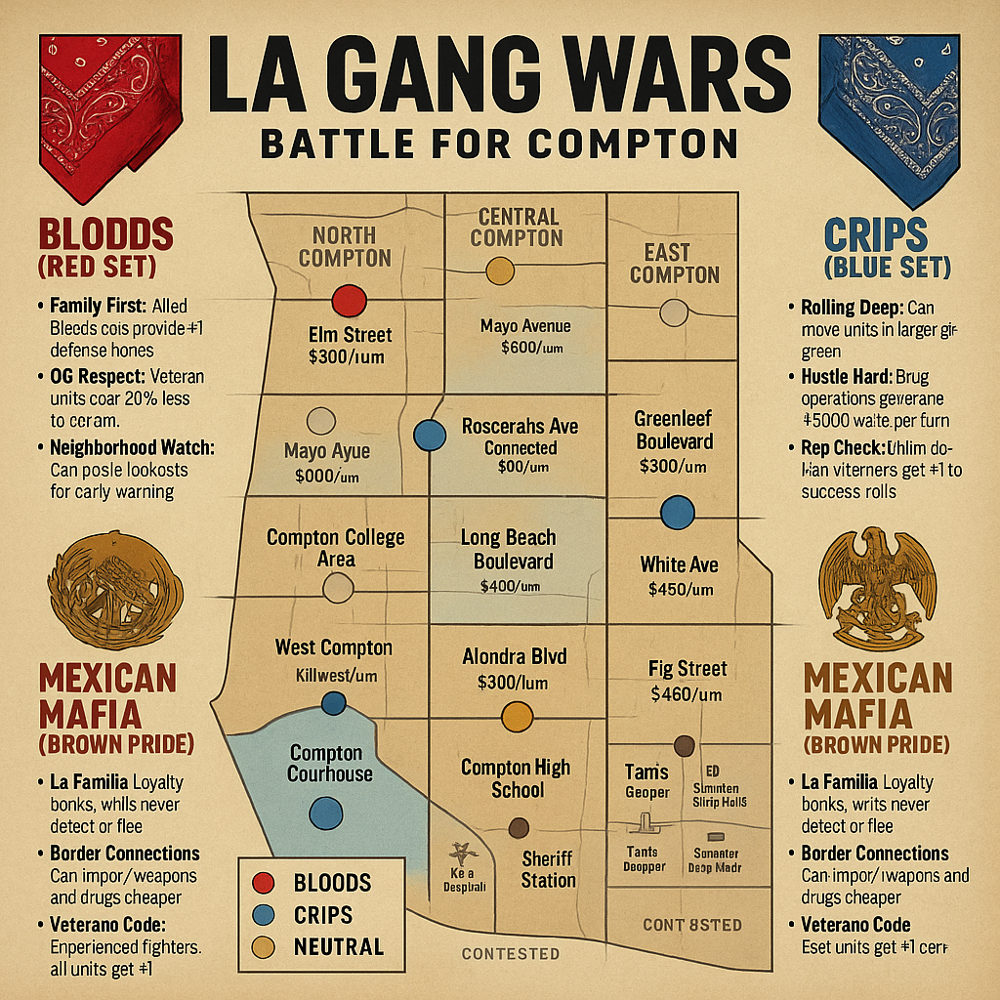

# LA Gang Wars: Battle for Compton

## Complete Board Game Design

### Game Overview

A strategic board game for 2-4 players set in 1990s Compton, California. Players control one of three major gang factions fighting for control of neighborhoods, drug trade, and street respect. The game emphasizes territorial warfare, resource management, and the constant threat of police intervention while navigating the complex social dynamics of street life.

---

## Faction Overview

### Bloods (Red Set)

**Faction Abilities:**

* **Family First:** Allied Bloods sets provide +1 defense bonus
* **OG Respect:** Veteran units cost 25% less to recruit
* **Neighborhood Watch:** Can place lookouts for early warning

**Starting Resources:**

* $3000 cash
* 1 OG, 2 Soldiers, 3 Young Bloods
* Control: Elm Street, parts of Long Beach Blvd

**Special Units:**

* **Piru Blood:** Elite fighter, +1 attack vs Crips
* **Tree Top Piru:** Veteran leadership, command bonus

### Crips (Blue Set)

**Faction Abilities:**

* **Rolling Deep:** Can move units in larger groups (+1 movement when 3+ units together)
* **Hustle Hard:** Drug operations generate +$200 extra per turn
* **Rep Check:** Intimidation attempts get +1 to success rolls

**Starting Resources:**

* $3500 cash
* 1 OG, 2 Soldiers, 3 Young Crips
* Control: Rosecrans Ave, parts of Compton Blvd

**Special Units:**

* **Eight Tray Gangster:** Expert marksman, ranged attack bonus
* **Grape Street Crip:** Territory specialist, defense bonus in home turf

### Mexican Mafia (Brown Pride)

**Faction Abilities:**

* **La Familia:** Loyalty bonus, units never defect or flee
* **Border Connections:** Can import weapons and drugs cheaper
* **Veterano Code:** Experienced fighters, all units get +1 defense

**Starting Resources:**

* $2500 cash
* 1 Veterano, 2 Soldados, 2 Cholos, 1 Lookout
* Control: Alondra Blvd, Atlantic Drive

**Special Units:**

* **Veterano:** Battle-hardened leader, combat and morale bonus
* **Sicario:** Professional enforcer, assassination specialist

---

## Unit Types & Combat

### Gang Members

| Unit Type                        | Cost ($) | Attack | Defense | Movement | Special Abilities                     |
| -------------------------------- | -------- | ------ | ------- | -------- | ------------------------------------- |
| **Young Blood/Crip/Cholo** | 300      | 2      | 1       | 3        | Fast, cheap recruitment               |
| **Soldier/Soldado**        | 600      | 3      | 2       | 2        | Standard gang member                  |
| **Veteran/OG**             | 1200     | 4      | 3       | 2        | Leadership, command bonus             |
| **Lieutenant**             | 2000     | 4      | 4       | 2        | Territory control, +1 to nearby units |
| **Lookout**                | 200      | 1      | 1       | 4        | Early warning, scouting               |
| **Driver**                 | 500      | 2      | 1       | 4        | Vehicle operations, fast movement     |
| **Dealer**                 | 800      | 2      | 2       | 2        | Generates $400/turn from drug sales   |

### Weapons & Equipment

| Item Type             | Cost ($) | Effect                | Special Rules            |
| --------------------- | -------- | --------------------- | ------------------------ |
| **Pistol**      | 400      | +1 attack             | Concealable              |
| **Mac-10**      | 800      | +2 attack             | High rate of fire        |
| **AK-47**       | 1200     | +2 attack, +1 range   | Intimidation bonus       |
| **Shotgun**     | 600      | +2 attack close range | -1 at long range         |
| **Lowrider**    | 2000     | Vehicle               | Transports 4, +1 respect |
| **Armored Car** | 4000     | Protected transport   | Immune to first hit      |

---

## Compton Neighborhood Map

### Territory Control - Major Neighborhoods

#### North Compton

* **Elm Street** (Bloods territory) - Residential, +$300/turn
* **Mayo Avenue** (Neutral) - Commercial strip, +$500/turn
* **Compton Boulevard North** (Contested) - Main thoroughfare, +$400/turn

#### Central Compton

* **Rosecrans Avenue** (Crips territory) - Business district, +$600/turn
* **Long Beach Boulevard** (Mixed control) - Major drug corridor, +$800/turn
* **Compton College Area** (Neutral) - Educational zone, recruitment bonus

#### South Compton

* **Alondra Boulevard** (Mexican Mafia) - Industrial, +$400/turn
* **Atlantic Drive** (Mexican Mafia) - Residential, +$300/turn
* **Greenleaf Boulevard** (Contested) - Shopping center, +$500/turn

#### East Compton

* **Central Avenue** (Contested) - Historic area, respect bonus
* **Stockwell Street** (Neutral) - Quiet residential, low heat
* **White Avenue** (Contested) - Mixed commercial, +$350/turn

#### West Compton

* **Willowbrook** (Neutral) - Hospital area, medical supplies
* **Grape Street** (Crips territory) - Residential stronghold, +$300/turn
* **Fig Street** (Contested) - Industrial corridor, +$450/turn

### Special Locations

* **Compton Courthouse** - Legal troubles, lawyer costs
* **MLK Hospital** - Medical treatment for wounded
* **Compton High School** - Recruitment center
* **Sheriff Station** - Police response center
* **Tam's Burgers** - Neutral meeting ground
* **Compton Swap Meet** - Weapons and goods trading

---

## Economic System

### Income Sources

| Operation Type                | Base Income | Heat Generated | Territory Requirement |
| ----------------------------- | ----------- | -------------- | --------------------- |
| **Corner Dealing**      | $400/turn   | +1 Heat/turn   | Any residential       |
| **Crack House**         | $800/turn   | +2 Heat/turn   | Controlled building   |
| **Auto Theft Ring**     | $600/turn   | +1 Heat/turn   | Industrial access     |
| **Protection Racket**   | $300/turn   | +1 Heat/turn   | Commercial district   |
| **Weapons Trading**     | $500/turn   | +2 Heat/turn   | Border connections    |
| **Legitimate Business** | $200/turn   | No heat        | Front operation       |

### Heat & Police Response

**Heat Level Effects:**

* **0-2 Heat:** Normal patrol activity
* **3-4 Heat:** Increased patrols, random searches
* **5-6 Heat:** Gang task force attention
* **7-8 Heat:** SWAT raids, federal involvement
* **9-10 Heat:** Major crackdown, lose territory

**Reducing Heat:**

* **Lay Low:** Skip operations, -1 heat per turn
* **Community Relations:** $1000 reduces heat by 1
* **Police Bribes:** $2000 reduces heat by 2 (risky)
* **Legitimate Fronts:** Each reduces heat generation by 1

---

## Combat System

### Street Combat

**Gang War Resolution:**

* Attacking gang initiates combat
* Both sides roll 1d6 per unit's attack value
* Hits on 4+ (modified by weapons and cover)
* Defender wins ties (home turf advantage)

**Combat Modifiers:**

* **Home Territory:** +1 defense for defenders
* **Weapons:** +1 or +2 attack based on weapon type
* **Leadership:** OGs and Veterans provide +1 to nearby units
* **Outnumbered:** -1 penalty if outnumbered 2:1 or more

### Drive-By Shootings

**Quick Strike Mechanics:**

* **Requirements:** Vehicle + armed units
* **Execution:** Move through enemy territory, roll attacks
* **Escape:** Automatic if not intercepted
* **Retaliation:** Target can attempt counter-attack next turn

### Territory Takeover

**Control Requirements:**

* Eliminate or drive out all enemy units
* Place at least 2 of your units in territory
* Hold for full turn to establish control
* Build operations to maintain presence

---

## Respect & Reputation System

### Earning Respect

**Respect Points gained from:**

* **Winning Fights:** +2 per enemy unit eliminated
* **Taking Territory:** +3 per new neighborhood controlled
* **Successful Operations:** +1 per $1000 earned illegally
* **Defending Territory:** +1 per successful defense

### Spending Respect

**Respect can be used for:**

* **Recruitment:** Spend 5 respect for 25% unit discount
* **Intimidation:** Spend 3 respect to force enemy retreat
* **Community Support:** Spend 10 respect to reduce heat by 2
* **Gang Alliance:** Spend 15 respect for temporary truce

### Losing Respect

**Respect lost from:**

* **Losing Fights:** -1 per unit lost
* **Losing Territory:** -2 per neighborhood lost
* **Police Raids:** -1 per successful raid
* **Failed Operations:** -1 per botched attempt

---

## Special Operations

### Drug Deal

**High-Risk, High-Reward:**

* **Cost:** $1000 investment + dealer unit
* **Process:** Roll 1d6 + dealer skill
* **Success (4+):** Gain $2000-4000
* **Failure (1-3):** Lose investment, +2 heat, possible unit arrest

### Weapons Smuggling

**Mexican Mafia Specialty:**

* **Requirements:** Border connections + $2000
* **Effect:** Gain random weapons at 50% cost
* **Risk:** 1-2 on d6 = intercepted by police, +3 heat

### Territory War

**Formal Gang Conflict:**

* **Declaration:** Pay $500, challenge rival for specific territory
* **Duration:** 3 turns of combat-only actions in that area
* **Winner:** Controls territory, gains +5 respect
* **Loser:** Loses 3 respect, cannot challenge again for 5 turns

### Police Informant

**Intelligence Gathering:**

* **Cost:** $1500 + risk of discovery
* **Effect:** Learn enemy plans, reduce their surprise attacks
* **Discovery:** If caught, become target for elimination

---

## Turn Sequence

### Phase Order

1. **Income Phase** - Collect money from operations
2. **Heat Phase** - Add heat, check for police activity
3. **Action Phase** - Recruit, move, attack, operate
4. **Combat Phase** - Resolve all fights simultaneously
5. **Respect Phase** - Gain/lose respect based on actions
6. **Event Phase** - Draw and resolve event cards

### Action Points

Each player gets 3 Action Points per turn:

* **Move Units:** 1 AP per group
* **Attack Territory:** 2 AP
* **Start Operation:** 1 AP
* **Recruit Units:** 1 AP
* **Special Action:** 1-2 AP depending on action

---

## Victory Conditions

### Territorial Victory

* Control 8 of 15 major neighborhoods
* Must include at least one from each district (North, Central, South)
* Maintain control for 2 consecutive turns

### Economic Victory

* Generate $5000 per turn in stable income
* Maintain this while keeping heat below 7
* Continue for 3 turns

### Respect Victory

* Accumulate 50 Respect points
* Have more respect than any rival gang
* Control at least 5 territories

### Elimination Victory

* Eliminate all rival gang leaders (OGs/Veterans)
* Control their former territories
* Force surrender of remaining gangs

---

## Event Cards (30 cards)

### Gang Life Events

* **Police Raid:** Target gang loses random units to arrest
* **Rival Alliance:** Two random gangs form temporary alliance
* **New Recruits:** Gain 2 young members for free
* **Weapons Shipment:** Purchase weapons at half price this turn

### Neighborhood Events

* **Community Meeting:** All gangs lose 1 heat this turn
* **School Shooting:** All factions gain heat, recruitment costs double
* **Economic Development:** One territory gets +$200 income bonus
* **Gang Truce:** No combat allowed this turn

### Law Enforcement Events

* **Task Force:** Specific gang targeted for major investigation
* **Corrupt Cop:** One gang can reduce heat by 3 this turn
* **Federal Investigation:** All gangs +2 heat, operations cost double
* **Community Policing:** Neighborhood watch reduces all gang activities

---

## Special Rules

### Police Response

**Automatic Triggers:**

* Heat level 8+: Automatic raid each turn
* Multiple casualties in one area: SWAT response
* Weapons trafficking discovered: Federal involvement

**SWAT Raid Resolution:**

* Target: Highest heat gang's most valuable territory
* Effect: Roll 1d6 per unit in territory, 1-3 = arrested
* Aftermath: Territory becomes neutral, all operations shut down

### Media Attention

**High-Profile Incidents:**

* Drive-by with civilian casualties: +3 heat to all gangs
* School zone violence: Double heat generation for 2 turns
* Celebrity involvement: Random positive or negative publicity

### Prison System

**Incarcerated Units:**

* Arrested units go to county jail
* Can be bailed out: $1000 per unit
* Units in jail for 3+ turns may return as veterans
* Prison connections: May recruit inside allies

---

## Balance & Strategy

### Starting Positions

**Territorial Balance:**

* Each gang starts with 2-3 neighborhoods
* 6-9 territories remain neutral at start
* Key territories (Long Beach Blvd, Rosecrans) are contested

**Resource Balance:**

* Crips start with most cash (drug trade advantage)
* Bloods have territorial advantage (more starting areas)
* Mexican Mafia has equipment advantage (weapon connections)

### Faction Strategies

**Bloods:** Focus on territorial expansion, build neighborhood loyalty
**Crips:** Maximize drug operations, use mobility for hit-and-run
**Mexican Mafia:** Control key corridors, leverage weapon superiority

