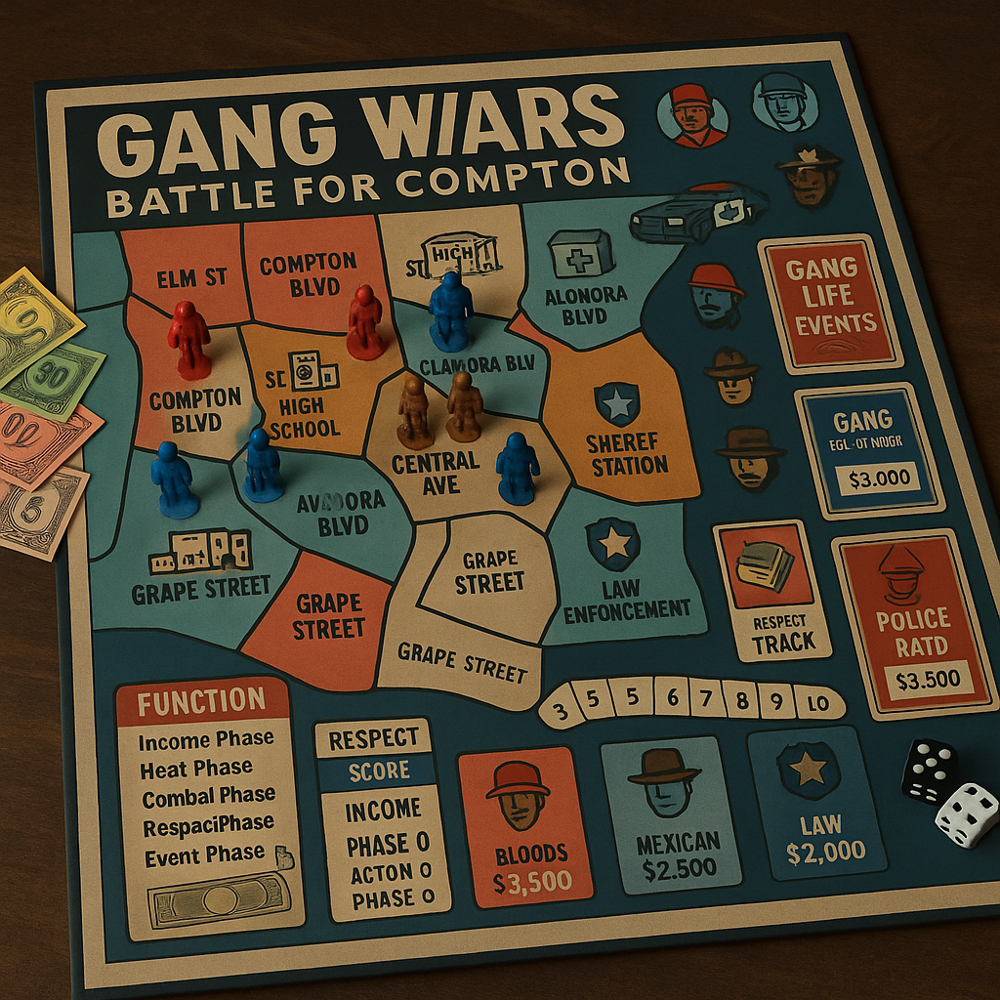

# LA Gang Wars: Battle for Compton (With Enhanced LAPD) - Complete Revised Edition

## Complete Board Game Design

### Game Overview
A strategic board game for 2-5 players set in 1990s Compton, California. Players control one of three major gang factions OR the enhanced LAPD fighting for control of neighborhoods, drug trade, and street respect. The LAPD player can choose between community policing or corrupt street tactics, creating shifting alliances and power dynamics. **Balance Target: LAPD as competitive as any gang faction with multiple victory paths.**

---

## Faction Overview

### Gang Factions
Each starts with Corruption Index: 8, Trust Index: 2

#### Bloods (Red Set)
**Faction Abilities:**
- **Family First:** Allied Bloods sets provide +1 defense bonus
- **OG Respect:** Veteran units cost 25% less to recruit
- **Neighborhood Watch:** Can place lookouts for early warning

**Starting Resources:**
- $3000 cash
- 1 OG, 2 Soldiers, 3 Young Bloods
- Control: Elm Street, parts of Long Beach Blvd

**Special Units:**
- **Piru Blood:** Elite fighter, +1 attack vs Crips
- **Tree Top Piru:** Veteran leadership, command bonus

#### Crips (Blue Set) 
**Faction Abilities:**
- **Rolling Deep:** Can move units in larger groups (+1 movement when 3+ units together)
- **Hustle Hard:** Drug operations generate +$200 extra per turn
- **Rep Check:** Intimidation attempts get +1 to success rolls

**Starting Resources:**
- $3500 cash
- 1 OG, 2 Soldiers, 3 Young Crips
- Control: Rosecrans Ave, parts of Compton Blvd

**Special Units:**
- **Eight Tray Gangster:** Expert marksman, ranged attack bonus
- **Grape Street Crip:** Territory specialist, defense bonus in home turf

#### Mexican Mafia (Brown Pride)
**Faction Abilities:**
- **La Familia:** Loyalty bonus, units never defect or flee
- **Border Connections:** Can import weapons and drugs cheaper
- **Veterano Code:** Experienced fighters, all units get +1 defense

**Starting Resources:**
- $2500 cash  
- 1 Veterano, 2 Soldados, 2 Cholos, 1 Lookout
- Control: Alondra Blvd, Atlantic Drive

**Special Units:**
- **Veterano:** Battle-hardened leader, combat and morale bonus
- **Sicario:** Professional enforcer, assassination specialist

---

## LAPD (Enhanced Competitive Faction)

### Starting Resources (Enhanced)
- **$6000 budget** (increased from $5000)
- 1 Captain, 2 Sergeants, 4 Officers, 1 Gang Task Force Unit, 1 Federal Liaison
- Corruption Index: 2, Trust Index: 8
- Control: Compton Sheriff Station, Courthouse, Community Center

### Enhanced Faction Abilities
- **Federal Partnerships:** Can call DEA/ATF/FBI support with high trust
- **Multi-Jurisdictional Authority:** Can operate in any territory
- **Asset Forfeiture Program:** Seize gang money and property
- **Intelligence Network:** See all gang operations before they execute
- **Community Policing:** Reduce gang recruitment and influence

---

## Unit Types & Combat

### Gang Members
| Unit Type | Cost ($) | Attack | Defense | Movement | Special Abilities |
|-----------|----------|--------|---------|----------|-------------------|
| **Young Blood/Crip/Cholo** | 300 | 2 | 1 | 3 | Fast, cheap recruitment |
| **Soldier/Soldado** | 600 | 3 | 2 | 2 | Standard gang member |
| **Veteran/OG** | 1200 | 4 | 3 | 2 | Leadership, command bonus |
| **Lieutenant** | 2000 | 4 | 4 | 2 | Territory control, +1 to nearby units |
| **Lookout** | 200 | 1 | 1 | 4 | Early warning, scouting |
| **Driver** | 500 | 2 | 1 | 4 | Vehicle operations, fast movement |
| **Dealer** | 800 | 2 | 2 | 2 | Generates $400/turn from drug sales |

### Enhanced LAPD Unit Types & Equipment

#### Law Enforcement Personnel (Expanded)
| Unit Type | Cost ($) | Attack | Defense | Movement | Special Abilities |
|-----------|----------|--------|---------|----------|-------------------|
| **Beat Officer** | 800 | 2 | 3 | 2 | Community relations, patrol |
| **Gang Detective** | 1500 | 3 | 3 | 3 | Undercover work, intelligence |
| **SWAT Officer** | 2200 | 4 | 4 | 2 | Heavy assault, armor piercing |
| **Sergeant** | 2000 | 3 | 4 | 2 | Command bonus, +1 to nearby units |
| **Captain** | 5000 | 4 | 4 | 3 | Authority, federal connections |
| **Gang Task Force** | 3000 | 4 | 3 | 3 | Anti-gang specialist, intel bonus |
| **Federal Agent** | 4000 | 5 | 4 | 3 | Trust 8+ only, immunity to corruption |
| **K9 Unit** | 1200 | 3 | 2 | 3 | Drug detection, tracking bonuses |

#### Enhanced Police Equipment & Vehicles
| Item Type | Cost ($) | Effect | Special Rules |
|-----------|----------|--------|---------------|
| **Patrol Car** | 1200 | +1 movement | Transport 2, quick response |
| **SWAT Van** | 4000 | Armor +2 defense | Transport 4, breach bonus |
| **Helicopter** | 8000 | Aerial support | +3 to all raids, surveillance |
| **Surveillance Equipment** | 2000 | Intelligence | Monitor gang activities |
| **Body Armor** | 600 | +1 defense | Personal protection |
| **Mobile Command** | 6000 | Coordination | +2 to all operations this turn |
| **Undercover Vehicle** | 2500 | Stealth operations | +2 to intelligence gathering |

### Weapons & Equipment
| Item Type | Cost ($) | Effect | Special Rules |
|-----------|----------|--------|---------------|
| **Pistol** | 400 | +1 attack | Concealable |
| **Mac-10** | 800 | +2 attack | High rate of fire |
| **AK-47** | 1200 | +2 attack, +1 range | Intimidation bonus |
| **Shotgun** | 600 | +2 attack close range | -1 at long range |
| **Lowrider** | 2000 | Vehicle | Transports 4, +1 respect |
| **Armored Car** | 4000 | Protected transport | Immune to first hit |

---

## Compton Neighborhood Map - Major Neighborhoods

### Territory Control System

#### North Compton
- **Elm Street** (Bloods territory) - Residential, +$300/turn
- **Mayo Avenue** (Neutral) - Commercial strip, +$500/turn
- **Compton Boulevard North** (Contested) - Main thoroughfare, +$400/turn

#### Central Compton  
- **Rosecrans Avenue** (Crips territory) - Business district, +$600/turn
- **Long Beach Boulevard** (Mixed control) - Major drug corridor, +$800/turn
- **Compton College Area** (Neutral) - Educational zone, recruitment bonus

#### South Compton
- **Alondra Boulevard** (Mexican Mafia) - Industrial, +$400/turn
- **Atlantic Drive** (Mexican Mafia) - Residential, +$300/turn
- **Greenleaf Boulevard** (Contested) - Shopping center, +$500/turn

#### East Compton
- **Central Avenue** (Contested) - Historic area, respect bonus
- **Stockwell Street** (Neutral) - Quiet residential, low heat
- **White Avenue** (Contested) - Mixed commercial, +$350/turn

#### West Compton
- **Willowbrook** (Neutral) - Hospital area, medical supplies
- **Grape Street** (Crips territory) - Residential stronghold, +$300/turn
- **Fig Street** (Contested) - Industrial corridor, +$450/turn

### Enhanced Territory Values (Revised for LAPD Competition)
| Territory | Base Income | Gang Bonus | LAPD Bonus | Special Features |
|-----------|-------------|------------|------------|------------------|
| **Rosecrans Ave** | $800 | Drug corridor | Federal grants +$500 | Major bust opportunity |
| **Long Beach Blvd** | $700 | High traffic | Asset forfeiture +$300 | Key strategic position |
| **Compton Blvd** | $600 | Territory wars | Community policing +$400 | School zone - trust bonus |
| **Atlantic Drive** | $500 | Family territory | Beat patrol +$200 | Residential safety priority |
| **Alondra Blvd** | $600 | Industrial base | Federal task force +$300 | Weapons trafficking hub |

### Special Locations
- **Compton Courthouse** - Legal troubles, lawyer costs
- **MLK Hospital** - Medical treatment for wounded
- **Compton High School** - Recruitment center
- **Sheriff Station** - Police response center
- **Tam's Burgers** - Neutral meeting ground
- **Compton Swap Meet** - Weapons and goods trading

---

## Economic System

### Income Sources
| Operation Type | Base Income | Heat Generated | Territory Requirement |
|----------------|-------------|----------------|---------------------|
| **Corner Dealing** | $400/turn | +1 Heat/turn | Any residential |
| **Crack House** | $800/turn | +2 Heat/turn | Controlled building |
| **Auto Theft Ring** | $600/turn | +1 Heat/turn | Industrial access |
| **Protection Racket** | $300/turn | +1 Heat/turn | Commercial district |
| **Weapons Trading** | $500/turn | +2 Heat/turn | Border connections |
| **Legitimate Business** | $200/turn | No heat | Front operation |

### Heat & Police Response
**Heat Level Effects:**
- **0-2 Heat:** Normal patrol activity
- **3-4 Heat:** Increased patrols, random searches
- **5-6 Heat:** Gang task force attention
- **7-8 Heat:** SWAT raids, federal involvement
- **9-10 Heat:** Major crackdown, lose territory

**Reducing Heat:**
- **Lay Low:** Skip operations, -1 heat per turn
- **Community Relations:** $1000 reduces heat by 1
- **Police Bribes:** $2000 reduces heat by 2 (risky)
- **Legitimate Fronts:** Each reduces heat generation by 1

---

## Enhanced LAPD Strategic Capabilities

### Federal Task Force System (Major Enhancement)
**Activation Requirements:**
- **Trust Level 7+**: Can request DEA support
- **Trust Level 8+**: Can request ATF weapons task force  
- **Trust Level 9+**: Can request FBI organized crime unit

**Federal Operation Types:**
1. **DEA Drug Sweep**: Target all drug operations simultaneously, +3 combat bonus
2. **ATF Weapons Raid**: Seize gang weapons, reduce their combat effectiveness
3. **FBI RICO Investigation**: Arrest multiple gang leaders, seize assets
4. **Joint Task Force**: Combine all federal resources for devastating assault

### Multi-Target Operations (LAPD Advantage)
**Coordinated Raids:**
- **Cost**: $3000 + units involved
- **Effect**: Can attack multiple gang territories simultaneously
- **Bonus**: +2 combat vs surprised gangs
- **Intel Requirement**: Must have surveillance on target territories

**Operation Types:**
1. **Sweep Operation**: Hit 2-3 territories, moderate effectiveness
2. **Major Offensive**: Hit 4-5 territories, high cost but devastating
3. **Precision Strike**: Single target, maximum effectiveness (+4 combat)

### Asset Forfeiture Program (New Revenue Stream)
**Revenue Generation:**
- **Successful Raids**: Seize 30% of gang money in territory
- **Drug Operations**: Seize $1000-3000 per destroyed operation
- **Vehicle Seizures**: Gain $500-2000 per gang vehicle captured
- **Property Forfeiture**: Take control of gang-owned buildings

**Asset Management:**
- **Sell Assets**: Convert to immediate cash
- **Repurpose Buildings**: Turn gang operations into police facilities
- **Community Programs**: Spend seized money on trust-building initiatives

### Intelligence Warfare (New System)
**LAPD Intelligence Advantages:**
- **Surveillance Network**: See gang purchases before placement
- **Informant System**: 25% chance to learn gang operations in advance
- **Wire Taps**: Can intercept gang communications and coordination
- **Predictive Policing**: +2 to all defensive actions when prepared

**Gang Counter-Intelligence:**
- **Security**: Pay $1000 to prevent LAPD intelligence gathering
- **False Information**: Feed wrong intel to LAPD, misdirect operations
- **Corruption**: Bribe officers to reveal LAPD plans
- **Violence**: Eliminate informants and witnesses

---

## Enhanced Corruption vs Trust System

### LAPD Trust Benefits (Expanded)
**Trust Level 6-7:**
- +$1000 budget per turn (state funding)
- Community tips reduce gang heat by 1 automatically
- +1 to all community policing actions

**Trust Level 8-9:**
- +$2000 budget per turn (federal grants)
- Can recruit Federal Agents
- Gang recruitment reduced by 50% in LAPD territories
- Immunity to gang direct attacks

**Trust Level 10:**
- +$3000 budget per turn (full support)
- Automatic federal task force availability
- Community uprising against gangs (+2 to all LAPD actions)
- Gang operations cost double in LAPD territories

### LAPD Corruption Consequences (Harsh)
**Corruption Level 3-5:**
- -$500 budget per turn (budget cuts)
- 25% chance gangs learn of operations in advance
- Community cooperation reduced

**Corruption Level 6-8:**
- -$1500 budget per turn (major cuts)
- Cannot use federal resources
- Gangs can attack LAPD units directly
- Media investigation (random negative events)

**Corruption Level 9-10:**
- Federal takeover imminent
- All gang factions unite against LAPD
- Operate as criminal organization (like gang rules)
- Automatic defeat if maintained for 3 turns

---

## Combat System

### Street Combat
**Gang War Resolution:**
- Attacking gang initiates combat
- Both sides roll 1d6 per unit's attack value
- Hits on 4+ (modified by weapons and cover)
- Defender wins ties (home turf advantage)

**Combat Modifiers:**
- **Home Territory:** +1 defense for defenders
- **Weapons:** +1 or +2 attack based on weapon type
- **Leadership:** OGs and Veterans provide +1 to nearby units
- **Outnumbered:** -1 penalty if outnumbered 2:1 or more

### Drive-By Shootings
**Quick Strike Mechanics:**
- **Requirements:** Vehicle + armed units
- **Execution:** Move through enemy territory, roll attacks
- **Escape:** Automatic if not intercepted
- **Retaliation:** Target can attempt counter-attack next turn

### Territory Takeover
**Control Requirements:**
- Eliminate or drive out all enemy units
- Place at least 2 of your units in territory
- Hold for full turn to establish control
- Build operations to maintain presence

---

## Respect & Reputation System

### Earning Respect
**Respect Points gained from:**
- **Winning Fights:** +2 per enemy unit eliminated
- **Taking Territory:** +3 per new neighborhood controlled
- **Successful Operations:** +1 per $1000 earned illegally
- **Defending Territory:** +1 per successful defense

### Spending Respect
**Respect can be used for:**
- **Recruitment:** Spend 5 respect for 25% unit discount
- **Intimidation:** Spend 3 respect to force enemy retreat
- **Community Support:** Spend 10 respect to reduce heat by 2
- **Gang Alliance:** Spend 15 respect for temporary truce

### Losing Respect
**Respect lost from:**
- **Losing Fights:** -1 per unit lost
- **Losing Territory:** -2 per neighborhood lost
- **Police Raids:** -1 per successful raid
- **Failed Operations:** -1 per botched attempt

---

## Legal System & Arrest Mechanics

### Evidence & Arrests
**Evidence Collection:**
- **Drug Bust:** 2-4 evidence tokens
- **Weapons Seizure:** 1-3 evidence tokens  
- **Witness Testimony:** 1 token (can be intimidated away)
- **Surveillance:** 1 token per turn of watching

**Arrest Procedures:**
- **Beat Arrest:** Roll 1d6, 4+ success for minor crimes
- **SWAT Raid:** +2 bonus, can arrest multiple targets
- **Undercover Sting:** Automatic success if setup properly

### Court System & Sentencing

#### Legal Representation
| Lawyer Type | Cost ($) | Dice Modifier | Gang/LAPD |
|-------------|----------|---------------|-----------|
| **Public Defender** | Free | -1 | Gang only |
| **Street Lawyer** | 1200 | +0 | Gang preferred |
| **Criminal Attorney** | 3000 | +1 | Gang specialist |
| **Elite Defense** | 6000 | +2 | High-profile cases |
| **District Attorney** | 2000 | +1 | LAPD prosecutor |
| **Federal Prosecutor** | 4000 | +2 | LAPD federal cases |

#### Trial Resolution & Sentencing
**Prosecution:** 1d6 + Evidence + Lawyer + Community Trust
**Defense:** 1d6 + Lawyer + Gang Intimidation + Corruption

**Conviction Results:**
- **Beat Prosecution by 3+:** Acquittal, gain respect
- **Beat Prosecution by 1-2:** Plea deal, reduced sentence
- **Lose by 1-2:** Minimum sentence
- **Lose by 3+:** Maximum sentence + fines

### Crime Categories & Jail Time
| Crime Type | Evidence Needed | Sentence | Bail Cost |
|------------|----------------|----------|-----------|
| **Drug Possession** | 2 tokens | 1 turn | $1500 |
| **Weapons Charge** | 2 tokens | 1-2 turns | $2500 |
| **Drug Dealing** | 3 tokens | 2 turns | $4000 |
| **Gang Violence** | 3 tokens | 2-3 turns | $5000 |
| **Drive-by Shooting** | 4 tokens | 3 turns | $8000 |
| **Murder** | 5 tokens | 3+ turns | $15000 |

### Federal Court System (LAPD Advantage)
**Federal Prosecution Powers:**
- **RICO Cases**: Can prosecute entire gang organizations
- **Drug Trafficking**: Federal sentences 2-4 turns instead of 1-2
- **Weapons Charges**: Federal charges bypass local corruption
- **Witness Protection**: Prevent gang retaliation against informants

---

## Jail & Prison System

### County Jail Operations
**Capacity:** 15 inmates maximum
**Conditions:**
- Inmates cannot participate in street activities
- Can run prison operations for reduced income
- Attempt escape: Roll 3+ on 1d6 (penalties apply)

#### Bail & Release System
**Bail Costs by Sentence:**
- **1 Turn:** $2000 (Roll 3+ to make bail)
- **2 Turns:** $4000 (Roll 4+ to make bail)  
- **3+ Turns:** $7500 (Roll 5+ to make bail)

**Gang Decisions:**
- **Pay Bail:** Immediate release, maintain gang strength
- **Leave in Jail:** Save money, risk losing influence
- **Prison Break:** Costs $5000, high risk/reward

### Prison Activities
**Inmate Operations:**
- **Prison Gang Control:** $300/turn per inmate
- **Contraband Smuggling:** $200/turn, +1 corruption to guards
- **Information Trading:** Sell intelligence to outside gangs
- **Recruitment:** Convert inmates to gang members ($400 each)

**LAPD Prison Management:**
- **Interrogation:** $300 per session, gain intelligence
- **Protective Custody:** Prevent gang retaliation
- **Work Programs:** Reduce sentences, increase trust
- **Solitary Confinement:** Prevent prison operations

---

## Special Operations

### Enhanced LAPD Operations

#### Operation Hammer (Gang Suppression)
- **Cost**: $5000 + SWAT units
- **Duration**: 3 turns
- **Effect**: All gangs in target area lose 2 units, cannot recruit
- **Community Impact**: +1 Trust if successful, -1 if excessive force used

#### Operation Safe Streets (Community Policing)
- **Cost**: $3000 + Beat Officers
- **Duration**: Permanent until gang retakes area
- **Effect**: Territory generates +$500/turn, gang recruitment impossible
- **Requirements**: Must maintain 2+ officers in territory

#### Operation Clean Sweep (Drug Elimination)
- **Cost**: $4000 + Gang Task Force
- **Target**: All drug operations in selected territories
- **Effect**: Destroy operations, seize assets, arrest dealers
- **Federal Support**: DEA provides +3 combat bonus

#### Operation Ceasefire (Gang Mediation)
- **Cost**: $2000 + Captain present
- **Effect**: Force temporary truce between warring gangs
- **Duration**: 2 turns, all gangs must agree or face LAPD crackdown
- **Community Benefit**: +2 Trust if successful

### Gang Anti-Police Operations

#### Police Assassination (High Risk)
- **Target**: Any LAPD unit except Captain (federal protection)
- **Consequences**: +5 heat if honest police, +2 if corrupt
- **Escalation**: Triggers federal investigation if Captain killed
- **Gang War**: Other gangs may join LAPD side against assassins

#### Corruption Campaign
- **Cost**: $3000-8000 depending on target rank
- **Success Rate**: Roll vs (Target's rank + LAPD Trust)
- **Effect**: Target provides intelligence, reduces raid effectiveness
- **Discovery Risk**: Federal investigation if caught

#### Media Manipulation
- **Cost**: $2000 + evidence of police misconduct
- **Effect**: Reduce LAPD Trust by 2, increase community sympathy
- **Requirements**: Must have proof of corruption or excessive force

#### Prison Break (Enhanced)
- **Cost**: $6000 + 4 gang units
- **Target**: Free all gang members from county jail
- **Federal Response**: If successful, triggers major crackdown
- **Failure**: Additional federal charges, longer sentences

### Gang Special Operations

#### Drug Deal
**High-Risk, High-Reward:**
- **Cost:** $1000 investment + dealer unit
- **Process:** Roll 1d6 + dealer skill
- **Success (4+):** Gain $2000-4000
- **Failure (1-3):** Lose investment, +2 heat, possible unit arrest

#### Weapons Smuggling
**Mexican Mafia Specialty:**
- **Requirements:** Border connections + $2000
- **Effect:** Gain random weapons at 50% cost
- **Risk:** 1-2 on d6 = intercepted by police, +3 heat

#### Territory War
**Formal Gang Conflict:**
- **Declaration:** Pay $500, challenge rival for specific territory
- **Duration:** 3 turns of combat-only actions in that area
- **Winner:** Controls territory, gains +5 respect
- **Loser:** Loses 3 respect, cannot challenge again for 5 turns

#### Police Informant
**Intelligence Gathering:**
- **Cost:** $1500 + risk of discovery
- **Effect:** Learn enemy plans, reduce their surprise attacks
- **Discovery:** If caught, become target for elimination

---

## Gang-Police Dynamics

### Collaboration Opportunities
**Police Informants:**
- **Gang Cost:** Lose 2 respect, gain police protection
- **LAPD Benefit:** Intelligence on rival gangs, +2 raid bonus
- **Discovery Risk:** If caught, automatic war with all gangs

**Temporary Truces:**
- **Gang Initiative:** Pay $3000 for 2-turn non-aggression
- **Police Initiative:** Ignore gang activities for information
- **Community Events:** All factions cooperate for neighborhood improvement

### Retaliation Mechanics
**LAPD Raids on Gangs:**
- **High Trust LAPD:** Gangs cannot retaliate directly
- **Corrupt LAPD:** Gangs can attack police units normally
- **Informant-Based Raids:** Target gang gets 2 first-round attacks vs informant

**Gang Attacks on Police:**
- **Honest Police:** +3 heat to attacking gang, federal response
- **Corrupt Police:** Normal gang war rules apply
- **Killing Police:** +5 heat, SWAT crackdown guaranteed

### Corruption Interactions
**Police Accepting Bribes:**
- **$2000:** Ignore one operation this turn
- **$5000:** Tip off about upcoming raids
- **$8000:** Release arrested gang member

**Gang Attempts to Corrupt:**
- **Beat Officer:** $1500, 4+ success
- **Detective:** $3000, 5+ success  
- **Sergeant:** $5000, 6+ success
- **Captain:** $10000, 6+ success (only once per game)

---

## Enhanced Victory Conditions

### LAPD Victory Paths (Competitive Balance)
1. **Territorial Control**: 8 territories with Trust ≥7
2. **Economic Dominance**: $20,000 through asset forfeiture
3. **Community Pacification**: Average gang heat ≤2, Trust 10
4. **Federal Model**: Successful federal partnership program

### Gang Victory Paths (Slightly Harder vs LAPD)
1. **Territorial**: 10 territories (increased from 8-9)
2. **Respect**: 70 respect points (increased from 60)
3. **Economic**: $15,000 while maintaining 6+ territories
4. **LAPD Elimination**: Corrupt or eliminate LAPD completely

### Coalition Victory
- **Anti-LAPD Alliance**: All 3 gangs unite against LAPD for 3+ turns
- **Community Takeover**: Gangs collectively control 12+ territories
- **Federal Withdrawal**: Force federal agencies to abandon Compton

### LAPD Defeat Conditions
- **Corruption reaches 8+**: Federal investigation, LAPD disbanded
- **Lose Captain**: Leadership decapitated, operate at half effectiveness
- **Community uprising**: Trust drops to 0, all territories revolt

---

## Turn Sequence

### Phase Order
1. **Intelligence Phase** - Informants report, share information
2. **Community Phase** - Assess neighborhood conditions, media coverage
3. **Income Phase** - Collect money from operations and budgets
4. **Legal Phase** - Conduct trials, process jail time, releases
5. **Action Phase** - Recruit, purchase equipment, pay bribes
6. **Movement Phase** - Deploy units, initiate operations
7. **Combat Phase** - Resolve raids, gang wars, arrests
8. **Consequence Phase** - Apply heat, adjust trust/corruption, check victory

### Action Points System
Each player gets 3 Action Points per turn:
- **Move Units:** 1 AP per group
- **Attack Territory:** 2 AP
- **Start Operation:** 1 AP
- **Recruit Units:** 1 AP
- **Special Action:** 1-2 AP depending on action

---

## Community Response System

### Neighborhood Reactions (Enhanced)
**Community Reactions to LAPD:**
- **High Trust Areas**: +1 income, gang recruitment -50%, free intelligence
- **Neutral Areas**: Standard income and recruitment
- **Anti-Police Areas**: -1 income, gang recruitment +25%, no cooperation

**Community Reactions to Gangs:**
- **Gang-Controlled**: Intimidation bonus, but federal attention
- **Contested**: Random violence, community calls for help
- **LAPD-Protected**: Safe zones, legitimate business growth

### Media & Public Pressure
**Positive Coverage (High Trust LAPD):**
- Increased budget (+$1000 per turn)
- Community cooperation bonus
- Political support for tough measures

**Negative Coverage (High Corruption/Violence):**
- Budget cuts (-$500 per turn)
- Federal oversight
- Community protests reduce all faction effectiveness

### Federal Intervention
**Triggers:**
- LAPD corruption reaches 8+
- Gang violence exceeds 3 civilian casualties per turn
- Multiple police officers killed

**Effects:**
- FBI takes over investigation
- All factions face federal pressure
- New victory conditions may activate

---

## Event Cards (30 cards)

### Gang Life Events
- **Police Raid:** Target gang loses random units to arrest
- **Rival Alliance:** Two random gangs form temporary alliance
- **New Recruits:** Gain 2 young members for free
- **Weapons Shipment:** Purchase weapons at half price this turn

### Neighborhood Events
- **Community Meeting:** All gangs lose 1 heat this turn
- **School Shooting:** All factions gain heat, recruitment costs double
- **Economic Development:** One territory gets +$200 income bonus
- **Gang Truce:** No combat allowed this turn

### Law Enforcement Events
- **Task Force:** Specific gang targeted for major investigation
- **Corrupt Cop:** One gang can reduce heat by 3 this turn
- **Federal Investigation:** All gangs +2 heat, operations cost double
- **Community Policing:** Neighborhood watch reduces all gang activities

### LAPD-Specific Events
**Positive Events:**
- **Federal Grant Award**: +$3000, +1 Trust
- **Community Hero**: Officer saves civilian, +2 Trust
- **Gang Intelligence Breakthrough**: Learn all gang operations this turn
- **Media Coverage**: Positive story, +1 Trust, gang recruitment -25%

**Negative Events:**
- **Police Brutality Incident**: -2 Trust, gang recruitment +25%
- **Corruption Scandal**: -1 Trust, +1 Corruption
- **Officer Down**: Lose 1 unit, all LAPD get +1 combat next turn
- **Federal Investigation**: Cannot use federal resources for 2 turns

### Gang-LAPD Interaction Events
**Gang Events:**
- **Police Informant Discovered**: Execute informant, +2 Respect
- **Cop Killing**: +5 Heat to responsible gang, federal response
- **Prison Riot**: All jailed gang members attempt escape
- **Community Protection**: Gangs provide security, gain legitimacy

**Community Events:**
- **Neighborhood Watch**: LAPD gets +1 to all operations in area
- **Anti-Violence March**: All factions -1 Heat, +community pressure
- **School Shooting**: All factions gain Heat, community demands action
- **Economic Development**: Territory values increase +$200

---

## Special Rules

### Police Response
**Automatic Triggers:**
- Heat level 8+: Automatic raid each turn
- Multiple casualties in one area: SWAT response
- Weapons trafficking discovered: Federal involvement

**SWAT Raid Resolution:**
- Target: Highest heat gang's most valuable territory
- Effect: Roll 1d6 per unit in territory, 1-3 = arrested
- Aftermath: Territory becomes neutral, all operations shut down

### Media Attention
**High-Profile Incidents:**
- Drive-by with civilian casualties: +3 heat to all gangs
- School zone violence: Double heat generation for 2 turns
- Celebrity involvement: Random positive or negative publicity

### Prison System
**Incarcerated Units:**
- Arrested units go to county jail
- Can be bailed out: $1000 per unit
- Units in jail for 3+ turns may return as veterans
- Prison connections: May recruit inside allies

---

## Balance Verification Metrics

### Target Performance (Revised)
- **LAPD Win Rate**: 25-30% (competitive with each gang)
- **Individual Gang Win Rates**: 20-25% each
- **Coalition Wins**: 10-15%
- **Average Game Length**: 20-30 turns
- **LAPD Survival Rate**: 80%+ (shouldn't be eliminated easily)

### LAPD Competitive Indicators
- **Can compete for territories**: Should control 3-5 territories mid-game
- **Economic viability**: Should maintain $8000+ average money
- **Multiple victory paths**: Should win via different strategies
- **Escalation capability**: Federal resources provide meaningful power

---

## Advanced LAPD Tactics

### Intelligence-Based Policing
**Predictive Analytics:**
- **Gang Pattern Analysis**: Predict gang movements, get first strike
- **Drug Trade Mapping**: Identify supply chains, hit multiple levels
- **Violence Forecasting**: Prevent gang wars through intervention

**Surveillance Network:**
- **Camera Systems**: Monitor all territories simultaneously
- **Informant Network**: 25% of gang members potentially compromised
- **Wire Taps**: Intercept gang communications and planning

### Community Partnerships
**Civilian Cooperation Programs:**
- **Neighborhood Watch**: Citizens provide free intelligence
- **Youth Programs**: Prevent gang recruitment in LAPD territories
- **Business Alliance**: Legitimate businesses fund police operations
- **Church Coalition**: Religious leaders support anti-gang efforts

### Federal Integration
**Multi-Agency Coordination:**
- **DEA Partnership**: Enhanced drug enforcement capabilities
- **ATF Cooperation**: Superior weapons detection and seizure
- **FBI Resources**: Major case investigation and prosecution
- **ICE Collaboration**: Immigration-based gang pressure

---

## Balance & Strategy

### Starting Positions
**Territorial Balance:**
- Each gang starts with 2-3 neighborhoods
- 6-9 territories remain neutral at start
- Key territories (Long Beach Blvd, Rosecrans) are contested

**Resource Balance:**
- Crips start with most cash (drug trade advantage)
- Bloods have territorial advantage (more starting areas)
- Mexican Mafia has equipment advantage (weapon connections)
- LAPD has federal support and legal authority

### Faction Strategies
**Bloods:** Focus on territorial expansion, build neighborhood loyalty
**Crips:** Maximize drug operations, use mobility for hit-and-run
**Mexican Mafia:** Control key corridors, leverage weapon superiority
**LAPD:** Balance community trust with effective enforcement

---

## Designer Notes - LAPD Enhancement Rationale

### Competitive Balance Philosophy
The enhanced LAPD represents a fully competitive faction through:

1. **Multiple Victory Paths**: Can win through law enforcement, economics, or community building
2. **Escalation Capability**: Federal resources provide power scaling
3. **Unique Mechanics**: Asset forfeiture and intelligence gathering create distinct gameplay
4. **Balanced Vulnerabilities**: Corruption and community trust create meaningful choices

### Historical Authenticity
Enhanced LAPD capabilities reflect real 1990s law enforcement:
- **Federal Task Forces**: Actual multi-agency cooperation against gangs
- **Asset Forfeiture**: Major revenue source for police departments
- **Community Policing**: Emerging strategy for gang suppression
- **Intelligence Operations**: Surveillance technology and informant networks

### Strategic Depth
LAPD players must balance:
- **Trust vs Effectiveness**: Community relations vs aggressive policing
- **Federal vs Local**: Outside resources vs community control
- **Reactive vs Proactive**: Responding to crime vs preventing it
- **Legal vs Extra-Legal**: Proper procedures vs expedient solutions

This creates a competitive, authentic, and strategically rich law enforcement faction that can hold its own against the three gang factions while maintaining the serious themes and realistic consequences of urban conflict.

---

## Game Board & Reference Materials

### Turn Order & Season Tracking

*The game includes essential tracking boards for managing the complex turn sequence and seasonal effects. The turn order track shows the historical sequence starting with France's initiative, while the season track cycles through Spring, Summer, Autumn, and Winter with their respective bonuses and penalties. The year track covers the full Napoleonic period from 1803-1815.*

**Key Tracking Elements:**
- **Turn Order:** France (1st) → Austria (2nd) → Prussia/Germany (3rd) → Russia (4th) → Britain (5th) → Spain (6th) → Minor Powers (7th)
- **Seasonal Effects:** Each season provides different bonuses and challenges
  - **Spring:** +1 IPC from agriculture
  - **Summer:** +1 movement to all units (campaign season)
  - **Autumn:** +2 IPC harvest bonus, -1 naval movement
  - **Winter:** Attrition effects, supply difficulties, Baltic Sea freezes
- **Historical Timeline:** 13-year campaign covering the height of the Napoleonic Wars

### European Theater Map

*The main game board depicts Europe during the Napoleonic era, with major powers color-coded and strategic cities marked. The map shows crucial geographical features like the English Channel, Mediterranean Sea, and major rivers that affected military campaigns. White circles indicate capital cities and key strategic objectives.*

**Map Features:**
- **France (Brown):** Central European position with Paris as capital
- **Austria (Tan/Beige):** Eastern European power controlling much of Central Europe
- **Russia (Tan/Eastern):** Vast territories extending beyond the map edge
- **Spain (Brown/Western):** Iberian Peninsula with potential for Peninsula War
- **Britain:** Island nation with naval supremacy but limited land access
- **German States:** Fragmented territories ripe for French expansion or Austrian influence

### Unit Reference & Combat Icons

*Clean, iconic representations of all military unit types used in the game. The silhouettes clearly distinguish between different unit roles while maintaining the period aesthetic. Unit costs are shown in the map legend for quick reference during gameplay.*

**Unit Categories:**
- **Land Forces:** Infantry (3 IPCs), Cavalry (4 IPCs), Artillery (4 IPCs), Guard units (6 IPCs), Generals
- **Naval Forces:** Frigates, Ships of the Line, Transports, Corvettes, Bomb Vessels
- **Special Units:** Each nation has unique advantages and specialized forces
- **Historical Accuracy:** Unit costs and capabilities reflect actual military economics and effectiveness

**Strategic Implications:**
- **Combined Arms:** Artillery and infantry work together for maximum effectiveness
- **Naval Power:** Essential for blockades, trade protection, and amphibious operations  
- **Elite Units:** Guard formations and named generals provide crucial combat advantages
- **Economic Balance:** Unit costs create meaningful resource allocation decisions