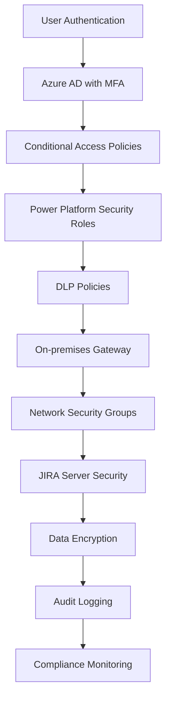

# Power Platform JIRA Budget Module Integration: Technical Implementation Guide

## Table of Contents

1. [Architecture Overview](#1-architecture-overview)
2. [Prerequisites and Requirements](#2-prerequisites-and-requirements)
3. [JIRA Configuration](#3-jira-configuration)
4. [Power Platform Setup](#4-power-platform-setup)
5. [Dynamics 365 Configuration](#5-dynamics-365-configuration)
6. [Integration Implementation](#6-integration-implementation)
7. [Data Flow Examples](#7-data-flow-examples)
8. [Security Configuration](#8-security-configuration)
9. [Testing and Validation](#9-testing-and-validation)
10. [Monitoring and Maintenance](#10-monitoring-and-maintenance)

---

## 1. Architecture Overview

### 1.1 Integration Architecture Diagram

```
┌─────────────────┐    ┌──────────────────┐    ┌─────────────────┐
│   Dynamics 365  │    │  Power Platform  │    │   JIRA Server   │
│   Sales/Service  │    │                  │    │  (On-Premise)   │
├─────────────────┤    ├──────────────────┤    ├─────────────────┤
│ • Opportunities  │◄──►│  • Power Automate│◄──►│ • Issues        │
│ • Accounts       │    │  • Custom Connectors│   │ • Budget Module │
│ • Contacts       │    │  • Data Gateway  │    │ • Projects      │
│ • Cases          │    │  • Power Apps    │    │ • Workflows     │
└─────────────────┘    └──────────────────┘    └─────────────────┘
        │                        │                        │
        │                        │                        │
        ▼                        ▼                        ▼
┌─────────────────┐    ┌──────────────────┐    ┌─────────────────┐
│ Customer Data    │    │ Integration Logs │    │ Budget Data     │
│ Sales Pipeline   │    │ Error Handling   │    │ Cost Tracking   │
│ Service Tickets  │    │ Audit Trail      │    │ Resource Alloc. │
└─────────────────┘    └──────────────────┘    └─────────────────┘
```

### 1.2 Data Flow Architecture

```
CRM Opportunity → Power Automate → JIRA Project → Budget Module → Cost Tracking
     ↓                ↓               ↓              ↓              ↓
[Sales Data]    [Transformation]  [Work Items]   [Budget Items]  [Financial Data]
     ↑                ↑               ↑              ↑              ↑
Service Case ← Power Platform ← JIRA Updates ← Budget Changes ← Cost Updates
```

### 1.3 Integration Components

| Component | Purpose | Technology |
|-----------|---------|------------|
| **On-premises Data Gateway** | Secure connection to JIRA Server | Power Platform Gateway |
| **Custom Connector** | JIRA REST API integration | Power Platform Connector |
| **Power Automate Flows** | Business process automation | Cloud Flows |
| **Power Apps** | User interface for integration management | Model-driven App |
| **Dataverse** | Integration data storage | Microsoft Dataverse |
| **Azure Key Vault** | Secure credential storage | Azure Security |

---

## 2. Prerequisites and Requirements

### 2.1 JIRA Server Requirements

#### **JIRA Version and Licensing**

- JIRA Server 8.0+ or JIRA Data Center 8.0+
- JIRA Software license with API access
- Budget module plugin (e.g., Tempo Budgets, Portfolio for JIRA)
- SSL certificate for HTTPS communication

#### **JIRA User Permissions**

```json
{
  "required_permissions": [
    "BROWSE_PROJECTS",
    "CREATE_ISSUES",
    "EDIT_ISSUES",
    "VIEW_VERSION_CONTROL",
    "MANAGE_WATCHERS",
    "BUDGET_VIEW",
    "BUDGET_EDIT",
    "TIMESHEET_VIEW"
  ],
  "user_account": {
    "username": "powerplatform-integration",
    "type": "Service Account",
    "groups": ["jira-administrators", "budget-managers"]
  }
}
```

#### **JIRA REST API Configuration**

```bash
# Enable REST API in JIRA Administration
# Navigate to: Administration → System → REST API → Enable
# Base URL: https://your-jira-server.company.com/rest/api/2/
# Budget API: https://your-jira-server.company.com/rest/tempo-budgets/1/
```

### 2.2 Power Platform Requirements

#### **Licensing Requirements**

- Power Automate Premium (included in E5)
- Power Apps Premium (included in E5)
- On-premises Data Gateway license
- Dynamics 365 Customer Service/Sales license

#### **Security Requirements**

```yaml
Network_Configuration:
  - Firewall_Rules:
      - Source: "On-premises Gateway"
      - Destination: "JIRA Server"
      - Ports: [443, 8080, 8443]
      - Protocol: "HTTPS"
  
  - VPN_Configuration:
      - Type: "Site-to-Site IPsec"
      - Encryption: "AES-256"
      - Authentication: "Certificate-based"

Data_Encryption:
  - In_Transit: "TLS 1.3"
  - At_Rest: "AES-256"
  - Key_Management: "Azure Key Vault"
```

### 2.3 Network and Security Configuration

#### **Firewall Rules**

```bash
# Outbound rules for Power Platform
Allow HTTPS 443 to *.powerapps.com
Allow HTTPS 443 to *.powerautomate.com
Allow HTTPS 443 to *.powerplatform.microsoft.com
Allow HTTPS 443 to your-jira-server.company.com

# Inbound rules for JIRA Server
Allow HTTPS 443 from Power Platform IP ranges
Allow webhook calls from specified Power Platform endpoints
```

---

## 3. JIRA Configuration

### 3.1 Budget Module Setup

#### **Tempo Budgets Configuration Example**

```json
{
  "budget_configuration": {
    "project_key": "PROJ",
    "budget_categories": [
      {
        "id": "DEVELOPMENT",
        "name": "Development Resources",
        "type": "HOURLY_RATE",
        "default_rate": 150.00,
        "currency": "CAD"
      },
      {
        "id": "INFRASTRUCTURE",
        "name": "Infrastructure Costs",
        "type": "FIXED_COST",
        "budget_amount": 25000.00,
        "currency": "CAD"
      },
      {
        "id": "CONSULTING",
        "name": "External Consulting",
        "type": "VARIABLE_COST",
        "budget_amount": 50000.00,
        "currency": "CAD"
      }
    ]
  }
}
```

#### **Custom Fields for Integration**

```json
{
  "custom_fields": [
    {
      "field_name": "CRM Opportunity ID",
      "field_type": "Text Field (single line)",
      "field_id": "customfield_10100",
      "description": "Links JIRA project to Dynamics 365 Opportunity",
      "required": true
    },
    {
      "field_name": "Customer Account ID",
      "field_type": "Text Field (single line)", 
      "field_id": "customfield_10101",
      "description": "Dynamics 365 Account GUID",
      "required": false
    },
    {
      "field_name": "Budget Status",
      "field_type": "Select List (single choice)",
      "field_id": "customfield_10102",
      "options": ["Draft", "Approved", "Active", "Overbudget", "Completed"],
      "required": true
    },
    {
      "field_name": "Approved Budget Amount",
      "field_type": "Number Field",
      "field_id": "customfield_10103",
      "description": "Total approved budget from CRM",
      "required": false
    }
  ]
}
```

### 3.2 JIRA Webhook Configuration

#### **Webhook Setup for Real-time Integration**

```json
{
  "webhook_name": "PowerPlatform_Integration",
  "url": "https://prod-xx.canadacentral.logic.azure.com:443/workflows/xxxxx/triggers/manual/paths/invoke",
  "events": [
    "jira:issue_created",
    "jira:issue_updated", 
    "jira:issue_deleted",
    "budget:budget_updated",
    "budget:budget_approved"
  ],
  "filters": {
    "project": "PROJ",
    "issue_type": ["Epic", "Story", "Task"],
    "custom_field_updated": ["customfield_10100", "customfield_10103"]
  },
  "authentication": {
    "type": "Bearer Token",
    "token": "${WEBHOOK_SECRET_TOKEN}"
  }
}
```

### 3.3 JIRA API Endpoints Configuration

#### **Budget Module API Endpoints**

```yaml
Base_URL: "https://your-jira-server.company.com"

Core_Endpoints:
  - GET /rest/api/2/project/{projectKey}
  - GET /rest/api/2/issue/{issueKey}
  - POST /rest/api/2/issue
  - PUT /rest/api/2/issue/{issueKey}

Budget_Endpoints:
  - GET /rest/tempo-budgets/1/budget/{budgetId}
  - POST /rest/tempo-budgets/1/budget
  - PUT /rest/tempo-budgets/1/budget/{budgetId}
  - GET /rest/tempo-budgets/1/budget/{budgetId}/spending

Time_Tracking_Endpoints:
  - GET /rest/tempo-timesheets/4/worklogs/project/{projectKey}
  - GET /rest/api/2/worklog/{worklogId}
  - POST /rest/api/2/issue/{issueKey}/worklog
```

---

## 4. Power Platform Setup

### 4.1 On-premises Data Gateway Installation

#### **Gateway Installation Steps**

```powershell
# Download and install the gateway
# Run as Administrator
.\GatewayInstall.exe

# Configuration parameters
$GatewayConfig = @{
    GatewayName = "JIRA-Integration-Gateway"
    Region = "Canada Central"
    EnvironmentId = "your-environment-id"
    TenantId = "your-tenant-id"
    RecoveryKey = "your-32-character-recovery-key"
    ServiceAccount = "domain\svc-powerplatform"
}

# Register gateway with Power Platform
Register-OnPremisesDataGateway @GatewayConfig
```

#### **Gateway Security Configuration**

```json
{
  "security_settings": {
    "encryption": {
      "algorithm": "AES-256",
      "key_rotation": "30_days"
    },
    "authentication": {
      "method": "Azure_AD_Authentication",
      "mfa_required": true,
      "certificate_pinning": true
    },
    "network": {
      "outbound_only": true,
      "proxy_support": true,
      "whitelist_domains": [
        "*.powerplatform.microsoft.com",
        "*.powerapps.com",
        "*.powerautomate.com"
      ]
    }
  }
}
```

### 4.2 Custom Connector Development

#### **JIRA Custom Connector Definition**

```json
{
  "swagger": "2.0",
  "info": {
    "title": "JIRA Budget Module Connector",
    "description": "Custom connector for JIRA Server budget module integration",
    "version": "1.0"
  },
  "host": "your-jira-server.company.com",
  "basePath": "/rest",
  "schemes": ["https"],
  "securityDefinitions": {
    "basic_auth": {
      "type": "basic"
    },
    "bearer_token": {
      "type": "apiKey",
      "name": "Authorization",
      "in": "header"
    }
  },
  "paths": {
    "/api/2/issue": {
      "post": {
        "operationId": "CreateIssue",
        "summary": "Create JIRA Issue",
        "parameters": [
          {
            "name": "issue",
            "in": "body",
            "required": true,
            "schema": {
              "$ref": "#/definitions/IssueCreate"
            }
          }
        ],
        "responses": {
          "201": {
            "description": "Issue created successfully",
            "schema": {
              "$ref": "#/definitions/IssueResponse"
            }
          }
        }
      }
    },
    "/tempo-budgets/1/budget": {
      "get": {
        "operationId": "GetBudgets",
        "summary": "Get Project Budgets",
        "parameters": [
          {
            "name": "projectKey",
            "in": "query",
            "type": "string",
            "required": true
          }
        ],
        "responses": {
          "200": {
            "description": "Budget data retrieved",
            "schema": {
              "$ref": "#/definitions/BudgetResponse"
            }
          }
        }
      },
      "post": {
        "operationId": "CreateBudget",
        "summary": "Create Project Budget",
        "parameters": [
          {
            "name": "budget",
            "in": "body",
            "required": true,
            "schema": {
              "$ref": "#/definitions/BudgetCreate"
            }
          }
        ],
        "responses": {
          "201": {
            "description": "Budget created successfully"
          }
        }
      }
    }
  },
  "definitions": {
    "IssueCreate": {
      "type": "object",
      "properties": {
        "fields": {
          "type": "object",
          "properties": {
            "project": {
              "type": "object",
              "properties": {
                "key": {"type": "string"}
              }
            },
            "summary": {"type": "string"},
            "description": {"type": "string"},
            "issuetype": {
              "type": "object",
              "properties": {
                "name": {"type": "string"}
              }
            },
            "customfield_10100": {"type": "string"},
            "customfield_10103": {"type": "number"}
          }
        }
      }
    },
    "BudgetCreate": {
      "type": "object",
      "properties": {
        "name": {"type": "string"},
        "projectKey": {"type": "string"},
        "amount": {"type": "number"},
        "currency": {"type": "string"},
        "period": {
          "type": "object",
          "properties": {
            "from": {"type": "string", "format": "date"},
            "to": {"type": "string", "format": "date"}
          }
        }
      }
    }
  }
}
```

### 4.3 Dataverse Table Configuration

#### **Integration Tables Schema**

```json
{
  "tables": [
    {
      "logical_name": "crmjira_integration_log",
      "display_name": "CRM-JIRA Integration Log",
      "description": "Tracks integration activities between CRM and JIRA",
      "columns": [
        {
          "logical_name": "crmjira_operation_type",
          "display_name": "Operation Type",
          "data_type": "Choice",
          "choices": ["Create", "Update", "Delete", "Sync"]
        },
        {
          "logical_name": "crmjira_source_system",
          "display_name": "Source System", 
          "data_type": "Choice",
          "choices": ["Dynamics 365", "JIRA"]
        },
        {
          "logical_name": "crmjira_source_record_id",
          "display_name": "Source Record ID",
          "data_type": "Text",
          "max_length": 100
        },
        {
          "logical_name": "crmjira_target_record_id",
          "display_name": "Target Record ID",
          "data_type": "Text", 
          "max_length": 100
        },
        {
          "logical_name": "crmjira_integration_status",
          "display_name": "Integration Status",
          "data_type": "Choice",
          "choices": ["Pending", "Success", "Failed", "Retry"]
        },
        {
          "logical_name": "crmjira_error_message",
          "display_name": "Error Message",
          "data_type": "Text",
          "max_length": 2000
        }
      ]
    },
    {
      "logical_name": "crmjira_budget_mapping",
      "display_name": "CRM-JIRA Budget Mapping",
      "description": "Maps CRM opportunities to JIRA project budgets",
      "columns": [
        {
          "logical_name": "crmjira_opportunity_id",
          "display_name": "Opportunity ID",
          "data_type": "Lookup",
          "target_table": "opportunity"
        },
        {
          "logical_name": "crmjira_jira_project_key",
          "display_name": "JIRA Project Key",
          "data_type": "Text",
          "max_length": 50
        },
        {
          "logical_name": "crmjira_jira_budget_id",
          "display_name": "JIRA Budget ID",
          "data_type": "Text",
          "max_length": 100
        },
        {
          "logical_name": "crmjira_approved_budget",
          "display_name": "Approved Budget",
          "data_type": "Currency"
        },
        {
          "logical_name": "crmjira_spent_amount",
          "display_name": "Spent Amount",
          "data_type": "Currency"
        },
        {
          "logical_name": "crmjira_remaining_budget",
          "display_name": "Remaining Budget",
          "data_type": "Currency"
        },
        {
          "logical_name": "crmjira_last_sync_date",
          "display_name": "Last Sync Date",
          "data_type": "DateTime"
        }
      ]
    }
  ]
}
```

---

## 5. Dynamics 365 Configuration

### 5.1 Opportunity Form Customization

#### **Custom Fields for JIRA Integration**

```xml
<!-- Add to Opportunity Main Form -->
<control id="crmjira_jira_project_key" classid="{4273EDBD-AC1D-40d3-9FB2-095C621B552D}">
  <parameters>
    <DisplayName>JIRA Project Key</DisplayName>
    <Description>Associated JIRA project for this opportunity</Description>
    <RequiredLevel>Recommended</RequiredLevel>
    <MaxLength>50</MaxLength>
  </parameters>
</control>

<control id="crmjira_project_budget" classid="{C3EFE0C3-7748-4dcc-A5B6-41AAC2C66F30}">
  <parameters>
    <DisplayName>Project Budget</DisplayName>
    <Description>Total approved budget for JIRA project</Description>
    <RequiredLevel>None</RequiredLevel>
    <Precision>2</Precision>
  </parameters>
</control>

<control id="crmjira_budget_status" classid="{3EF39988-22BB-4f0b-BBBE-64B5A3748AEE}">
  <parameters>
    <DisplayName>Budget Status</DisplayName>
    <Description>Current status of project budget in JIRA</Description>
    <RequiredLevel>None</RequiredLevel>
    <Options>
      <Option value="1">Draft</Option>
      <Option value="2">Approved</Option>
      <Option value="3">Active</Option>
      <Option value="4">Over Budget</Option>
      <Option value="5">Completed</Option>
    </Options>
  </parameters>
</control>
```

### 5.2 Business Process Flow Configuration

#### **Opportunity to JIRA Project Process**

```json
{
  "process_name": "Opportunity to JIRA Project",
  "stages": [
    {
      "stage_name": "Opportunity Qualification",
      "steps": [
        "Qualify opportunity",
        "Estimate project scope", 
        "Define budget requirements",
        "Create initial budget estimate"
      ],
      "data_steps": [
        {
          "field": "budgetamount",
          "required": true,
          "validation": "Must be greater than $10,000"
        }
      ]
    },
    {
      "stage_name": "JIRA Project Creation",
      "steps": [
        "Create JIRA project",
        "Set up budget module",
        "Configure team permissions",
        "Link to CRM opportunity"
      ],
      "automation_trigger": "Power Automate Flow",
      "data_steps": [
        {
          "field": "crmjira_jira_project_key",
          "required": true,
          "auto_populate": true
        }
      ]
    },
    {
      "stage_name": "Budget Approval",
      "steps": [
        "Review budget estimates",
        "Approve budget allocation",
        "Activate JIRA budget",
        "Notify project team"
      ],
      "approval_workflow": true,
      "data_steps": [
        {
          "field": "crmjira_project_budget",
          "required": true,
          "source": "budgetamount"
        }
      ]
    },
    {
      "stage_name": "Project Execution",
      "steps": [
        "Monitor budget utilization",
        "Track project progress",
        "Manage scope changes",
        "Update budget forecasts"
      ],
      "automation_trigger": "Scheduled Sync",
      "data_steps": [
        {
          "field": "crmjira_budget_status",
          "auto_update": true,
          "sync_frequency": "Daily"
        }
      ]
    }
  ]
}
```

---

## 6. Integration Implementation

### 6.1 Power Automate Flow: Opportunity to JIRA Project

#### **Main Integration Flow**

```json
{
  "flow_name": "CRM Opportunity to JIRA Project",
  "trigger": {
    "type": "Dataverse",
    "operation": "When a row is added, modified or deleted",
    "table": "Opportunities",
    "conditions": [
      {
        "field": "statecode",
        "operator": "equals",
        "value": 0
      },
      {
        "field": "budgetamount",
        "operator": "greater than",
        "value": 10000
      }
    ]
  },
  "actions": [
    {
      "action_name": "Initialize Variables",
      "type": "Initialize variable",
      "variables": [
        {
          "name": "ProjectKey",
          "type": "String",
          "value": ""
        },
        {
          "name": "BudgetAmount",
          "type": "Float",
          "value": 0
        },
        {
          "name": "ErrorMessage",
          "type": "String", 
          "value": ""
        }
      ]
    },
    {
      "action_name": "Generate Project Key",
      "type": "Compose",
      "inputs": "@concat('CRM-', formatDateTime(utcNow(), 'yyyyMM'), '-', substring(triggerOutputs()?['body/opportunityid'], 0, 8))"
    },
    {
      "action_name": "Create JIRA Project",
      "type": "HTTP",
      "method": "POST",
      "uri": "https://your-jira-server.company.com/rest/api/2/project",
      "headers": {
        "Content-Type": "application/json",
        "Authorization": "Basic @{base64(concat(parameters('JIRA_Username'), ':', parameters('JIRA_Password')))}"
      },
      "body": {
        "key": "@{outputs('Generate_Project_Key')}",
        "name": "@{triggerOutputs()?['body/name']}",
        "projectTypeKey": "software",
        "projectTemplateKey": "com.pyxis.greenhopper.jira:gh-simplified-agility-scrum",
        "description": "@{triggerOutputs()?['body/description']}",
        "lead": "powerplatform-integration",
        "categoryId": 10000
      }
    },
    {
      "action_name": "Update Opportunity with Project Key",
      "type": "Dataverse",
      "operation": "Update a row",
      "table": "Opportunities",
      "row_id": "@triggerOutputs()?['body/opportunityid']",
      "body": {
        "crmjira_jira_project_key": "@{outputs('Generate_Project_Key')}",
        "crmjira_budget_status": 1
      }
    },
    {
      "action_name": "Create Budget in JIRA",
      "type": "HTTP",
      "method": "POST", 
      "uri": "https://your-jira-server.company.com/rest/tempo-budgets/1/budget",
      "headers": {
        "Content-Type": "application/json",
        "Authorization": "Basic @{base64(concat(parameters('JIRA_Username'), ':', parameters('JIRA_Password')))}"
      },
      "body": {
        "name": "@{concat('Budget for ', triggerOutputs()?['body/name'])}",
        "projectKey": "@{outputs('Generate_Project_Key')}",
        "amount": "@triggerOutputs()?['body/budgetamount']",
        "currency": "CAD",
        "period": {
          "from": "@{formatDateTime(utcNow(), 'yyyy-MM-dd')}",
          "to": "@{formatDateTime(addMonths(utcNow(), 12), 'yyyy-MM-dd')}"
        },
        "budgetType": "TOTAL_BUDGET"
      }
    },
    {
      "action_name": "Create Budget Mapping Record",
      "type": "Dataverse",
      "operation": "Add a new row",
      "table": "crmjira_budget_mappings",
      "body": {
        "crmjira_opportunity_id": "@triggerOutputs()?['body/opportunityid']",
        "crmjira_jira_project_key": "@{outputs('Generate_Project_Key')}",
        "crmjira_jira_budget_id": "@{body('Create_Budget_in_JIRA')?['id']}",
        "crmjira_approved_budget": "@triggerOutputs()?['body/budgetamount']",
        "crmjira_spent_amount": 0,
        "crmjira_remaining_budget": "@triggerOutputs()?['body/budgetamount']",
        "crmjira_last_sync_date": "@utcNow()"
      }
    },
    {
      "action_name": "Log Integration Success",
      "type": "Dataverse",
      "operation": "Add a new row", 
      "table": "crmjira_integration_logs",
      "body": {
        "crmjira_operation_type": 1,
        "crmjira_source_system": 1,
        "crmjira_source_record_id": "@triggerOutputs()?['body/opportunityid']",
        "crmjira_target_record_id": "@{outputs('Generate_Project_Key')}",
        "crmjira_integration_status": 2
      }
    }
  ],
  "error_handling": {
    "action_name": "Handle Integration Error",
    "type": "Dataverse",
    "operation": "Add a new row",
    "table": "crmjira_integration_logs",
    "body": {
      "crmjira_operation_type": 1,
      "crmjira_source_system": 1, 
      "crmjira_source_record_id": "@triggerOutputs()?['body/opportunityid']",
      "crmjira_target_record_id": "",
      "crmjira_integration_status": 3,
      "crmjira_error_message": "@{body('Create_JIRA_Project')?['errorMessages']}"
    }
  }
}
```

### 6.2 Power Automate Flow: JIRA Budget Updates to CRM

#### **Webhook Receiver Flow**

```json
{
  "flow_name": "JIRA Budget Updates to CRM",
  "trigger": {
    "type": "When a HTTP request is received",
    "method": "POST",
    "schema": {
      "type": "object",
      "properties": {
        "timestamp": {"type": "string"},
        "webhookEvent": {"type": "string"},
        "budget": {
          "type": "object",
          "properties": {
            "id": {"type": "string"},
            "projectKey": {"type": "string"},
            "amount": {"type": "number"},
            "spentAmount": {"type": "number"},
            "remainingAmount": {"type": "number"},
            "status": {"type": "string"}
          }
        }
      }
    }
  },
  "actions": [
    {
      "action_name": "Parse JIRA Webhook Data",
      "type": "Parse JSON",
      "content": "@triggerBody()",
      "schema": "@triggerOutputs()['relativePathParameters']['schema']"
    },
    {
      "action_name": "Find Budget Mapping",
      "type": "Dataverse",
      "operation": "List rows",
      "table": "crmjira_budget_mappings",
      "filter": "crmjira_jira_project_key eq '@{body('Parse_JIRA_Webhook_Data')?['budget']?['projectKey']}'"
    },
    {
      "action_name": "Check if Mapping Exists",
      "type": "Condition",
      "condition": "@greater(length(body('Find_Budget_Mapping')?['value']), 0)"
    },
    {
      "action_name": "Update Budget Mapping - True Branch",
      "type": "Dataverse",
      "operation": "Update a row",
      "table": "crmjira_budget_mappings",
      "row_id": "@first(body('Find_Budget_Mapping')?['value'])?['crmjira_budget_mappingid']",
      "body": {
        "crmjira_spent_amount": "@body('Parse_JIRA_Webhook_Data')?['budget']?['spentAmount']",
        "crmjira_remaining_budget": "@body('Parse_JIRA_Webhook_Data')?['budget']?['remainingAmount']",
        "crmjira_last_sync_date": "@utcNow()"
      }
    },
    {
      "action_name": "Get Related Opportunity",
      "type": "Dataverse",
      "operation": "Get a row by ID",
      "table": "Opportunities",
      "row_id": "@first(body('Find_Budget_Mapping')?['value'])?['_crmjira_opportunity_id_value']"
    },
    {
      "action_name": "Update Opportunity Budget Status",
      "type": "Dataverse", 
      "operation": "Update a row",
      "table": "Opportunities",
      "row_id": "@body('Get_Related_Opportunity')?['opportunityid']",
      "body": {
        "crmjira_budget_status": "@if(greater(body('Parse_JIRA_Webhook_Data')?['budget']?['spentAmount'], body('Parse_JIRA_Webhook_Data')?['budget']?['amount']), 4, 3)",
        "actualvalue": "@body('Parse_JIRA_Webhook_Data')?['budget']?['spentAmount']"
      }
    },
    {
      "action_name": "Create Budget Alert - Over Budget",
      "type": "Condition",
      "condition": "@greater(body('Parse_JIRA_Webhook_Data')?['budget']?['spentAmount'], body('Parse_JIRA_Webhook_Data')?['budget']?['amount'])",
      "true_actions": [
        {
          "action_name": "Send Email Alert",
          "type": "Send an email (V2)",
          "to": "@body('Get_Related_Opportunity')?['_ownerid_value@OData.Community.Display.V1.FormattedValue']",
          "subject": "Budget Alert: Project Over Budget",
          "body": "<h3>Budget Alert</h3><p>Project @{body('Parse_JIRA_Webhook_Data')?['budget']?['projectKey']} has exceeded its approved budget.</p><ul><li>Approved Budget: $@{body('Parse_JIRA_Webhook_Data')?['budget']?['amount']}</li><li>Spent Amount: $@{body('Parse_JIRA_Webhook_Data')?['budget']?['spentAmount']}</li><li>Over Budget By: $@{sub(body('Parse_JIRA_Webhook_Data')?['budget']?['spentAmount'], body('Parse_JIRA_Webhook_Data')?['budget']?['amount'])}</li></ul>",
          "importance": "High"
        },
        {
          "action_name": "Create Follow-up Task",
          "type": "Dataverse",
          "operation": "Add a new row",
          "table": "Tasks",
          "body": {
            "subject": "Review Over Budget Project: @{body('Parse_JIRA_Webhook_Data')?['budget']?['projectKey']}",
            "description": "Project has exceeded approved budget. Review and take corrective action.",
            "scheduledstart": "@utcNow()",
            "scheduledend": "@addDays(utcNow(), 1)",
            "prioritycode": 2,
            "regardingobjectid_opportunity@odata.bind": "/opportunities(@{body('Get_Related_Opportunity')?['opportunityid']})"
          }
        }
      ]
    },
    {
      "action_name": "Log Integration Success",
      "type": "Dataverse",
      "operation": "Add a new row",
      "table": "crmjira_integration_logs", 
      "body": {
        "crmjira_operation_type": 2,
        "crmjira_source_system": 2,
        "crmjira_source_record_id": "@body('Parse_JIRA_Webhook_Data')?['budget']?['projectKey']",
        "crmjira_target_record_id": "@body('Get_Related_Opportunity')?['opportunityid']",
        "crmjira_integration_status": 2
      }
    }
  ]
}
```

### 6.3 Scheduled Sync Flow: Daily Budget Reconciliation

#### **Daily Budget Sync Flow**

```json
{
  "flow_name": "Daily JIRA Budget Sync",
  "trigger": {
    "type": "Recurrence",
    "frequency": "Day",
    "interval": 1,
    "startTime": "2025-01-01T06:00:00Z",
    "timeZone": "Eastern Standard Time"
  },
  "actions": [
    {
      "action_name": "Get Active Budget Mappings",
      "type": "Dataverse",
      "operation": "List rows",
      "table": "crmjira_budget_mappings",
      "filter": "crmjira_budget_status eq 3",
      "select": ["crmjira_budget_mappingid", "crmjira_jira_project_key", "crmjira_jira_budget_id"]
    },
    {
      "action_name": "Process Each Budget Mapping",
      "type": "Apply to each",
      "foreach": "@body('Get_Active_Budget_Mappings')?['value']",
      "actions": [
        {
          "action_name": "Get JIRA Budget Details",
          "type": "HTTP",
          "method": "GET",
          "uri": "https://your-jira-server.company.com/rest/tempo-budgets/1/budget/@{items('Process_Each_Budget_Mapping')?['crmjira_jira_budget_id']}",
          "headers": {
            "Authorization": "Basic @{base64(concat(parameters('JIRA_Username'), ':', parameters('JIRA_Password')))}"
          }
        },
        {
          "action_name": "Get Budget Spending",
          "type": "HTTP", 
          "method": "GET",
          "uri": "https://your-jira-server.company.com/rest/tempo-budgets/1/budget/@{items('Process_Each_Budget_Mapping')?['crmjira_jira_budget_id']}/spending",
          "headers": {
            "Authorization": "Basic @{base64(concat(parameters('JIRA_Username'), ':', parameters('JIRA_Password')))}"
          }
        },
        {
          "action_name": "Calculate Spent Amount",
          "type": "Compose",
          "inputs": "@body('Get_Budget_Spending')?['totalSpent']"
        },
        {
          "action_name": "Update Budget Mapping Record",
          "type": "Dataverse",
          "operation": "Update a row",
          "table": "crmjira_budget_mappings",
          "row_id": "@items('Process_Each_Budget_Mapping')?['crmjira_budget_mappingid']",
          "body": {
            "crmjira_spent_amount": "@outputs('Calculate_Spent_Amount')",
            "crmjira_remaining_budget": "@sub(body('Get_JIRA_Budget_Details')?['amount'], outputs('Calculate_Spent_Amount'))",
            "crmjira_last_sync_date": "@utcNow()"
          }
        }
      ]
    }
  ]
}
```

---

## 7. Data Flow Examples

### 7.1 Opportunity Creation Flow

#### **Example 1: New Sales Opportunity**

```json
{
  "scenario": "New opportunity created in Dynamics 365",
  "crm_data": {
    "opportunity": {
      "opportunityid": "a1b2c3d4-e5f6-7890-abcd-ef1234567890",
      "name": "Digital Transformation Project - Acme Corp",
      "description": "Complete digital transformation including cloud migration and process automation",
      "budgetamount": 250000.00,
      "estimatedvalue": 275000.00,
      "customerid": "12345678-90ab-cdef-1234-567890abcdef",
      "ownerid": "87654321-abcd-ef12-3456-7890abcdef12",
      "statecode": 0,
      "statuscode": 1
    }
  },
  "integration_process": [
    {
      "step": 1,
      "action": "Power Automate triggers on opportunity creation",
      "trigger_condition": "budgetamount >= 10000 AND statecode = 0"
    },
    {
      "step": 2,
      "action": "Generate JIRA project key",
      "result": "CRM-202501-A1B2C3D4"
    },
    {
      "step": 3,
      "action": "Create JIRA project",
      "jira_request": {
        "method": "POST",
        "url": "/rest/api/2/project",
        "body": {
          "key": "CRM-202501-A1B2C3D4",
          "name": "Digital Transformation Project - Acme Corp",
          "projectTypeKey": "software",
          "description": "Complete digital transformation including cloud migration and process automation",
          "lead": "powerplatform-integration"
        }
      },
      "jira_response": {
        "id": "10150",
        "key": "CRM-202501-A1B2C3D4", 
        "self": "https://your-jira-server.company.com/rest/api/2/project/10150"
      }
    },
    {
      "step": 4,
      "action": "Create budget in JIRA",
      "jira_request": {
        "method": "POST",
        "url": "/rest/tempo-budgets/1/budget",
        "body": {
          "name": "Budget for Digital Transformation Project - Acme Corp",
          "projectKey": "CRM-202501-A1B2C3D4",
          "amount": 250000.00,
          "currency": "CAD",
          "period": {
            "from": "2025-01-15",
            "to": "2026-01-15"
          },
          "budgetType": "TOTAL_BUDGET"
        }
      },
      "jira_response": {
        "id": "BUD-12345",
        "projectKey": "CRM-202501-A1B2C3D4",
        "amount": 250000.00,
        "spentAmount": 0.00,
        "remainingAmount": 250000.00
      }
    },
    {
      "step": 5,
      "action": "Update CRM opportunity",
      "crm_update": {
        "crmjira_jira_project_key": "CRM-202501-A1B2C3D4",
        "crmjira_budget_status": 2
      }
    },
    {
      "step": 6,
      "action": "Create budget mapping record",
      "dataverse_record": {
        "crmjira_opportunity_id": "a1b2c3d4-e5f6-7890-abcd-ef1234567890",
        "crmjira_jira_project_key": "CRM-202501-A1B2C3D4",
        "crmjira_jira_budget_id": "BUD-12345",
        "crmjira_approved_budget": 250000.00,
        "crmjira_spent_amount": 0.00,
        "crmjira_remaining_budget": 250000.00
      }
    }
  ]
}
```

### 7.2 Time Tracking and Budget Updates

#### **Example 2: Developer Time Logging**

```json
{
  "scenario": "Developer logs time in JIRA, triggering budget updates",
  "jira_worklog": {
    "id": "12345",
    "issueKey": "CRM-202501-A1B2C3D4-123",
    "author": {
      "name": "john.developer",
      "displayName": "John Developer"
    },
    "timeSpent": "8h",
    "timeSpentSeconds": 28800,
    "started": "2025-01-20T09:00:00.000+0000",
    "comment": "Implemented user authentication module",
    "billing": {
      "rate": 125.00,
      "currency": "CAD",
      "billableAmount": 1000.00
    }
  },
  "budget_calculation": {
    "previous_spent": 45000.00,
    "new_worklog_cost": 1000.00,
    "total_spent": 46000.00,
    "budget_amount": 250000.00,
    "remaining_budget": 204000.00,
    "budget_utilization": "18.4%"
  },
  "webhook_payload": {
    "timestamp": "2025-01-20T17:30:00.000Z",
    "webhookEvent": "worklog_created",
    "worklog": {
      "id": "12345",
      "issueKey": "CRM-202501-A1B2C3D4-123",
      "timeSpentSeconds": 28800,
      "billableAmount": 1000.00
    },
    "budget": {
      "id": "BUD-12345",
      "projectKey": "CRM-202501-A1B2C3D4",
      "amount": 250000.00,
      "spentAmount": 46000.00,
      "remainingAmount": 204000.00
    }
  },
  "power_automate_response": [
    {
      "action": "Update budget mapping in Dataverse",
      "data": {
        "crmjira_spent_amount": 46000.00,
        "crmjira_remaining_budget": 204000.00,
        "crmjira_last_sync_date": "2025-01-20T17:30:15Z"
      }
    },
    {
      "action": "Update opportunity actual value",
      "data": {
        "actualvalue": 46000.00,
        "crmjira_budget_status": 3
      }
    }
  ]
}
```

### 7.3 Budget Alert Scenario

#### **Example 3: Budget Threshold Alert**

```json
{
  "scenario": "Project approaching budget limit triggers alert",
  "budget_status": {
    "project_key": "CRM-202501-A1B2C3D4",
    "approved_budget": 250000.00,
    "spent_amount": 212500.00,
    "remaining_amount": 37500.00,
    "utilization_percentage": 85.0,
    "threshold_warning": 80.0
  },
  "alert_trigger": {
    "condition": "utilization_percentage >= threshold_warning",
    "alert_type": "Budget Warning",
    "severity": "Medium"
  },
  "automated_actions": [
    {
      "action": "Send email notification",
      "recipients": [
        "opportunity.owner@company.com",
        "project.manager@company.com",
        "finance.controller@company.com"
      ],
      "email_template": {
        "subject": "Budget Warning: Digital Transformation Project - Acme Corp",
        "body": "The project CRM-202501-A1B2C3D4 has reached 85% of its approved budget. Please review and take appropriate action.",
        "details": {
          "approved_budget": "$250,000.00 CAD",
          "spent_amount": "$212,500.00 CAD", 
          "remaining_budget": "$37,500.00 CAD",
          "utilization": "85.0%"
        }
      }
    },
    {
      "action": "Create follow-up task",
      "task_details": {
        "subject": "Review Budget Status - Digital Transformation Project",
        "priority": "High",
        "due_date": "2025-01-25T17:00:00Z",
        "assigned_to": "opportunity.owner@company.com"
      }
    },
    {
      "action": "Update opportunity stage",
      "stage_change": {
        "from": "Project Execution",
        "to": "Budget Review Required"
      }
    }
  ]
}
```

### 7.4 Project Completion and Final Reconciliation

#### **Example 4: Project Completion Flow**

```json
{
  "scenario": "JIRA project marked as complete, final reconciliation",
  "jira_project_completion": {
    "project_key": "CRM-202501-A1B2C3D4",
    "status": "Closed",
    "completion_date": "2025-06-15T16:00:00Z",
    "final_budget_summary": {
      "approved_budget": 250000.00,
      "total_spent": 238750.00,
      "budget_variance": -11250.00,
      "variance_percentage": -4.5,
      "total_hours": 1910,
      "average_hourly_rate": 125.00
    }
  },
  "reconciliation_process": [
    {
      "step": 1,
      "action": "Receive project completion webhook",
      "webhook_data": {
        "event": "project_closed",
        "project_key": "CRM-202501-A1B2C3D4",
        "final_budget": {
          "spent": 238750.00,
          "remaining": 11250.00
        }
      }
    },
    {
      "step": 2,
      "action": "Update opportunity to closed-won",
      "crm_updates": {
        "statecode": 1,
        "statuscode": 3,
        "actualvalue": 238750.00,
        "closeprobability": 100,
        "actualclosedate": "2025-06-15T16:00:00Z",
        "crmjira_budget_status": 5
      }
    },
    {
      "step": 3,
      "action": "Generate final project report",
      "report_data": {
        "project_name": "Digital Transformation Project - Acme Corp",
        "project_key": "CRM-202501-A1B2C3D4",
        "duration_days": 151,
        "budget_performance": {
          "approved": 250000.00,
          "actual": 238750.00,
          "variance": -11250.00,
          "performance": "Under Budget"
        },
        "resource_utilization": {
          "total_hours": 1910,
          "avg_daily_hours": 12.6,
          "peak_month": "March 2025",
          "efficiency_rating": "Excellent"
        }
      }
    },
    {
      "step": 4,
      "action": "Archive integration data",
      "archive_process": {
        "budget_mapping_status": "Archived",
        "integration_logs_retained": true,
        "jira_project_archived": true,
        "crm_opportunity_completed": true
      }
    }
  ]
}
```

---

## 8. Security Configuration

### 8.1 Authentication and Authorization

#### **Azure Key Vault Integration**

```json
{
  "key_vault_configuration": {
    "vault_name": "crm-jira-integration-kv",
    "location": "Canada Central",
    "secrets": [
      {
        "name": "JIRA-ServiceAccount-Username",
        "value": "powerplatform-integration",
        "content_type": "text/plain"
      },
      {
        "name": "JIRA-ServiceAccount-Password",
        "value": "${SECURE_PASSWORD}",
        "content_type": "text/plain"
      },
      {
        "name": "JIRA-Webhook-Secret",
        "value": "${WEBHOOK_SECRET_TOKEN}",
        "content_type": "text/plain"
      },
      {
        "name": "JIRA-API-Token",
        "value": "${API_TOKEN}",
        "content_type": "text/plain"
      }
    ],
    "access_policies": [
      {
        "tenant_id": "your-tenant-id",
        "object_id": "power-platform-service-principal-id",
        "permissions": {
          "secrets": ["get", "list"]
        }
      }
    ]
  }
}
```

#### **Power Platform Security Roles**

```json
{
  "security_roles": [
    {
      "role_name": "CRM-JIRA Integration Administrator",
      "privileges": [
        {
          "entity": "crmjira_budget_mapping",
          "create": true,
          "read": true,
          "write": true,
          "delete": true,
          "append": true,
          "append_to": true
        },
        {
          "entity": "crmjira_integration_log",
          "create": true,
          "read": true,
          "write": true,
          "delete": false,
          "append": true,
          "append_to": true
        },
        {
          "entity": "opportunity",
          "create": false,
          "read": true,
          "write": true,
          "delete": false,
          "append": true,
          "append_to": true
        }
      ]
    },
    {
      "role_name": "CRM-JIRA Integration User",
      "privileges": [
        {
          "entity": "crmjira_budget_mapping",
          "create": false,
          "read": true,
          "write": false,
          "delete": false,
          "append": false,
          "append_to": false
        },
        {
          "entity": "opportunity",
          "create": false,
          "read": true,
          "write": false,
          "delete": false,
          "append": false,
          "append_to": false
        }
      ]
    }
  ]
}
```

### 8.2 Data Encryption and Protection

#### **Power Platform DLP Policies**

```json
{
  "dlp_policy": {
    "policy_name": "CRM-JIRA Integration Data Protection",
    "environment_type": "Production",
    "connector_classifications": [
      {
        "connector": "shared_commondataserviceforapps",
        "classification": "Business",
        "data_groups": ["Business Data"]
      },
      {
        "connector": "custom_jira_connector",
        "classification": "Business",
        "data_groups": ["Business Data"]
      },
      {
        "connector": "shared_office365outlook",
        "classification": "Business", 
        "data_groups": ["Business Data"]
      }
    ],
    "data_loss_prevention_rules": [
      {
        "rule_name": "Protect Customer Financial Data",
        "condition": "Contains sensitive financial information",
        "action": "Block",
        "scope": ["budgetamount", "actualvalue", "estimatedvalue"]
      },
      {
        "rule_name": "Audit Integration Activities",
        "condition": "Data transfer between CRM and JIRA",
        "action": "Audit",
        "retention": "7 years"
      }
    ]
  }
}
```

### 8.3 Network Security Configuration

#### **On-premises Gateway Security**

```yaml
Gateway_Security:
  Network_Configuration:
    - Firewall_Rules:
        Inbound:
          - Port: 443
            Protocol: HTTPS
            Source: "Power Platform Service Tags"
            Action: Allow
        Outbound:
          - Port: 443
            Protocol: HTTPS
            Destination: "*.powerplatform.microsoft.com"
            Action: Allow
          - Port: 8443
            Protocol: HTTPS
            Destination: "your-jira-server.company.com"
            Action: Allow
    
  Certificate_Configuration:
    - SSL_Certificate:
        Type: "Domain Validated"
        Authority: "Let's Encrypt"
        Renewal: "Automatic"
    - Client_Certificate:
        Type: "Mutual TLS"
        Authority: "Internal CA"
        Validation: "Required"

  Monitoring_Configuration:
    - Log_Level: "Information"
    - Audit_Events: ["Connection", "Authentication", "Data_Transfer"]
    - Retention_Period: "90 days"
    - SIEM_Integration: "Azure Sentinel"
```

---

## 9. Testing and Validation

### 9.1 Unit Testing Scenarios

#### **Test Case 1: Opportunity Creation Integration**

```json
{
  "test_name": "Create JIRA Project from CRM Opportunity",
  "test_type": "Integration Test",
  "prerequisites": [
    "JIRA server accessible",
    "Power Platform environment configured",
    "Test opportunity data prepared"
  ],
  "test_data": {
    "opportunity": {
      "name": "Test Project Integration",
      "budgetamount": 50000.00,
      "description": "Test opportunity for integration validation"
    }
  },
  "test_steps": [
    {
      "step": 1,
      "action": "Create opportunity in Dynamics 365",
      "expected_result": "Opportunity created successfully"
    },
    {
      "step": 2,
      "action": "Verify Power Automate flow triggers",
      "expected_result": "Flow executes within 30 seconds"
    },
    {
      "step": 3,
      "action": "Check JIRA project creation",
      "expected_result": "Project created with correct key format"
    },
    {
      "step": 4,
      "action": "Validate budget creation in JIRA",
      "expected_result": "Budget matches opportunity amount"
    },
    {
      "step": 5,
      "action": "Confirm CRM opportunity update",
      "expected_result": "Project key populated in opportunity"
    }
  ],
  "success_criteria": [
    "All integration steps complete successfully",
    "Data consistency between systems",
    "No error messages in logs",
    "Integration completes within 2 minutes"
  ]
}
```

#### **Test Case 2: Budget Update Synchronization**

```json
{
  "test_name": "JIRA Budget Updates Sync to CRM",
  "test_type": "End-to-End Test",
  "test_scenario": {
    "description": "Log work time in JIRA and verify CRM budget updates",
    "setup": {
      "existing_project": "TEST-2025-001",
      "initial_budget": 10000.00,
      "initial_spent": 2000.00
    }
  },
  "test_steps": [
    {
      "step": 1,
      "action": "Log 8 hours work in JIRA issue",
      "data": {
        "hours": 8,
        "rate": 100.00,
        "cost": 800.00
      }
    },
    {
      "step": 2,
      "action": "Verify webhook triggers",
      "validation": "Webhook payload received by Power Automate"
    },
    {
      "step": 3,
      "action": "Check budget mapping update",
      "expected": {
        "spent_amount": 2800.00,
        "remaining_budget": 7200.00
      }
    },
    {
      "step": 4,
      "action": "Validate opportunity actual value",
      "expected": "Opportunity.actualvalue = 2800.00"
    }
  ],
  "performance_criteria": {
    "webhook_response_time": "< 5 seconds",
    "sync_completion_time": "< 30 seconds",
    "data_accuracy": "100%"
  }
}
```

### 9.2 Load Testing Configuration

#### **Performance Testing Scenarios**

```yaml
Load_Testing:
  Scenarios:
    - Name: "High Volume Opportunity Creation"
      Description: "Test system performance with multiple opportunities"
      Parameters:
        Concurrent_Users: 10
        Opportunities_Per_Minute: 20
        Test_Duration: "30 minutes"
        Ramp_Up_Time: "5 minutes"
      
    - Name: "Batch Budget Updates" 
      Description: "Test webhook processing under load"
      Parameters:
        Webhook_Events_Per_Second: 50
        Concurrent_Projects: 100
        Test_Duration: "15 minutes"
        
  Performance_Thresholds:
    Response_Time:
      P50: "< 2 seconds"
      P95: "< 5 seconds"
      P99: "< 10 seconds"
    Throughput:
      Opportunities_Per_Hour: "> 500"
      Budget_Updates_Per_Hour: "> 1000"
    Error_Rate: "< 1%"
    
  Monitoring:
    - Power Platform Flow Runs
    - JIRA API Response Times
    - Database Connection Pool Usage
    - Network Latency Metrics
```

---

## 10. Monitoring and Maintenance

### 10.1 Operational Monitoring

#### **Azure Monitor Configuration**

```json
{
  "monitoring_configuration": {
    "log_analytics_workspace": "crm-jira-integration-logs",
    "retention_days": 90,
    "data_sources": [
      {
        "source": "Power Automate Flow Runs",
        "metrics": ["execution_time", "success_rate", "error_count"],
        "alerts": [
          {
            "name": "Integration Flow Failures",
            "condition": "error_count > 5 in 15 minutes",
            "severity": "Critical",
            "action_group": "integration-team"
          }
        ]
      },
      {
        "source": "JIRA API Performance", 
        "metrics": ["response_time", "availability", "error_rate"],
        "alerts": [
          {
            "name": "JIRA API Slow Response",
            "condition": "avg_response_time > 5 seconds",
            "severity": "Warning",
            "action_group": "infrastructure-team"
          }
        ]
      },
      {
        "source": "On-premises Gateway",
        "metrics": ["connection_status", "throughput", "cpu_usage"],
        "alerts": [
          {
            "name": "Gateway Connection Lost",
            "condition": "connection_status = false",
            "severity": "Critical",
            "action_group": "integration-team"
          }
        ]
      }
    ]
  }
}
```

#### **Integration Health Dashboard**

```json
{
  "dashboard_name": "CRM-JIRA Integration Health",
  "widgets": [
    {
      "type": "KPI",
      "title": "Integration Success Rate",
      "query": "crmjira_integration_logs | where TimeGenerated > ago(24h) | summarize SuccessRate = round(100.0 * countif(crmjira_integration_status == 2) / count(), 2)",
      "target": "> 99%"
    },
    {
      "type": "Line Chart",
      "title": "Daily Integration Volume",
      "query": "crmjira_integration_logs | where TimeGenerated > ago(30d) | summarize count() by bin(TimeGenerated, 1d), crmjira_operation_type"
    },
    {
      "type": "Pie Chart",
      "title": "Integration Operations Distribution",
      "query": "crmjira_integration_logs | where TimeGenerated > ago(7d) | summarize count() by crmjira_operation_type"
    },
    {
      "type": "Table",
      "title": "Recent Integration Errors",
      "query": "crmjira_integration_logs | where TimeGenerated > ago(24h) and crmjira_integration_status == 3 | project TimeGenerated, crmjira_source_system, crmjira_error_message | order by TimeGenerated desc | take 10"
    }
  ]
}
```

### 10.2 Maintenance Procedures

#### **Daily Maintenance Checklist**

```yaml
Daily_Maintenance:
  Automated_Checks:
    - Integration_Flow_Health:
        Check: "Power Automate flows running successfully"
        Action: "Review failed runs and retry if necessary"
        
    - Gateway_Status:
        Check: "On-premises gateway connectivity"
        Action: "Restart gateway service if connection issues detected"
        
    - Budget_Sync_Accuracy:
        Check: "Budget data consistency between systems"
        Action: "Run reconciliation report and flag discrepancies"
        
  Manual_Reviews:
    - Error_Log_Analysis:
        Frequency: "Daily"
        Scope: "Review integration errors from past 24 hours"
        Escalation: "Contact development team for recurring issues"
        
    - Performance_Metrics:
        Frequency: "Daily"
        Scope: "Review response times and throughput"
        Threshold: "Alert if performance degrades by > 20%"

Weekly_Maintenance:
  Security_Reviews:
    - Certificate_Expiry:
        Check: "SSL certificates expire in next 30 days"
        Action: "Renew certificates before expiration"
        
    - Access_Token_Rotation:
        Check: "API tokens and service account passwords"
        Action: "Rotate tokens every 90 days"
        
  Data_Cleanup:
    - Log_Archival:
        Action: "Archive integration logs older than 90 days"
        Storage: "Long-term retention storage"
        
    - Test_Data_Cleanup:
        Action: "Remove test integration records"
        Scope: "Non-production environments only"

Monthly_Maintenance:
  Capacity_Planning:
    - Usage_Analysis:
        Review: "Integration volume trends and growth patterns"
        Planning: "Scale resources based on projected usage"
        
    - Performance_Tuning:
        Review: "Identify bottlenecks and optimization opportunities"
        Implementation: "Apply performance improvements"
        
  Disaster_Recovery_Testing:
    - Backup_Validation:
        Test: "Restore integration configuration from backup"
        Frequency: "Monthly"
        
    - Failover_Testing:
        Test: "Gateway failover and recovery procedures"
        Documentation: "Update disaster recovery procedures"
```

### 10.3 Troubleshooting Guide

#### **Common Issues and Solutions**

##### **Issue 1: JIRA Project Creation Failures**

```yaml
Problem: "Power Automate flow fails when creating JIRA project"

Symptoms:
  - Flow shows "BadRequest" error
  - JIRA project key conflicts
  - Authentication failures

Troubleshooting_Steps:
  1. Check_JIRA_Connectivity:
      - Verify on-premises gateway status
      - Test JIRA API endpoint accessibility
      - Confirm network firewall rules
      
  2. Validate_Authentication:
      - Verify service account credentials in Key Vault
      - Check JIRA user permissions
      - Test API token validity
      
  3. Project_Key_Conflicts:
      - Query: "SELECT key FROM project WHERE key LIKE 'CRM-%'"
      - Resolution: "Implement unique key generation logic"
      - Prevention: "Add key conflict detection"

Solutions:
  - Authentication_Fix:
      Action: "Rotate API credentials in Azure Key Vault"
      Verification: "Test API call manually"
      
  - Key_Conflict_Resolution:
      Action: "Append timestamp to project key generation"
      Format: "CRM-YYYYMM-XXXXXXXX-HHMM"
      
  - Connectivity_Issues:
      Action: "Restart on-premises gateway"
      Escalation: "Contact network team for firewall rules"
```

##### **Issue 2: Budget Sync Delays**

```yaml
Problem: "Budget updates from JIRA not reflecting in CRM timely"

Symptoms:
  - Webhook delays > 5 minutes
  - Inconsistent budget data between systems
  - Missing integration log entries

Root_Cause_Analysis:
  1. Webhook_Performance:
      - Check JIRA webhook configuration
      - Monitor Power Automate trigger performance
      - Verify network latency
      
  2. Processing_Bottlenecks:
      - Review flow execution history
      - Identify slow-performing actions
      - Check Dataverse performance
      
  3. Data_Validation_Issues:
      - Verify budget calculation logic
      - Check data type conversions
      - Validate currency formatting

Resolution_Steps:
  - Immediate_Fix:
      Action: "Manually trigger budget sync flow"
      Verification: "Compare budget data between systems"
      
  - Performance_Optimization:
      Action: "Implement parallel processing for multiple projects"
      Testing: "Load test with 100 concurrent updates"
      
  - Monitoring_Enhancement:
      Action: "Add detailed logging to webhook processing"
      Metrics: "Track processing time per webhook event"
```

##### **Issue 3: Authentication Token Expiration**

```yaml
Problem: "Integration fails due to expired authentication tokens"

Symptoms:
  - HTTP 401 Unauthorized errors
  - "Token expired" messages in logs
  - Sudden integration failures

Prevention_Strategy:
  1. Automated_Token_Rotation:
      - Schedule: "Every 60 days"
      - Process: "Update Key Vault secrets automatically"
      - Validation: "Test integration after rotation"
      
  2. Monitoring_Setup:
      - Alert: "Token expires in 7 days"
      - Escalation: "Automatic rotation if possible"
      - Fallback: "Manual intervention required"

Emergency_Response:
  1. Immediate_Resolution:
      - Generate new API token in JIRA
      - Update Azure Key Vault secret
      - Test integration functionality
      
  2. Root_Cause_Analysis:
      - Review token rotation schedule
      - Check automated rotation failure reasons
      - Update monitoring thresholds
      
  3. Prevention_Measures:
      - Implement redundant authentication methods
      - Set up proactive alerting
      - Document emergency procedures
```

### 10.4 Performance Optimization

#### **Optimization Strategies**

```json
{
  "performance_optimization": {
    "database_optimization": [
      {
        "strategy": "Index Optimization",
        "tables": ["crmjira_budget_mapping", "crmjira_integration_log"],
        "indexes": [
          {
            "table": "crmjira_budget_mapping",
            "columns": ["crmjira_jira_project_key", "crmjira_last_sync_date"],
            "type": "Composite"
          },
          {
            "table": "crmjira_integration_log", 
            "columns": ["createdon", "crmjira_integration_status"],
            "type": "Composite"
          }
        ]
      },
      {
        "strategy": "Data Archival",
        "retention_policy": {
          "active_records": "12 months",
          "archived_records": "7 years", 
          "purge_policy": "After 7 years"
        }
      }
    ],
    "flow_optimization": [
      {
        "strategy": "Parallel Processing",
        "implementation": "Use 'Apply to each' with concurrency control",
        "settings": {
          "degree_of_parallelism": 20,
          "timeout": "PT10M"
        }
      },
      {
        "strategy": "Caching",
        "implementation": "Cache JIRA project metadata",
        "cache_duration": "4 hours",
        "invalidation": "On project updates"
      },
      {
        "strategy": "Batch Operations",
        "implementation": "Group multiple budget updates",
        "batch_size": 50,
        "processing_interval": "Every 5 minutes"
      }
    ],
    "network_optimization": [
      {
        "strategy": "Connection Pooling",
        "gateway_settings": {
          "max_connections": 100,
          "connection_timeout": "30 seconds",
          "keepalive": true
        }
      },
      {
        "strategy": "Data Compression",
        "enable_compression": true,
        "compression_algorithm": "gzip"
      }
    ]
  }
}
```

---

## 11. Security and Compliance Considerations

### 11.1 Canadian Defence Contractor Compliance

#### **Protected B Data Handling**

```yaml
Protected_B_Compliance:
  Data_Classification:
    - Budget_Information: "Protected B"
    - Customer_Data: "Protected B" 
    - Project_Details: "Protected A"
    - Integration_Logs: "Protected A"
    
  Security_Controls:
    - Encryption_At_Rest: "AES-256"
    - Encryption_In_Transit: "TLS 1.3"
    - Key_Management: "Azure Key Vault with HSM"
    - Access_Control: "Role-based with MFA"
    
  Audit_Requirements:
    - Log_Retention: "7 years minimum"
    - Access_Logging: "All data access events"
    - Integration_Audit: "Complete transaction trail"
    - Compliance_Reporting: "Monthly compliance reports"
    
  Data_Residency:
    - Primary_Location: "Canada Central Azure Region"
    - Backup_Location: "Canada East Azure Region"
    - Restriction: "No data outside Canadian borders"
```

#### **ITSP.10.171 (NIST 800-171) Compliance Mapping**

```json
{
  "nist_800_171_compliance": {
    "access_control": {
      "3.1.1": {
        "requirement": "Limit system access to authorized users",
        "implementation": "Azure AD with conditional access policies",
        "evidence": "User access reports and audit logs"
      },
      "3.1.2": {
        "requirement": "Limit system access to authorized functions",
        "implementation": "Power Platform security roles and DLP policies",
        "evidence": "Role assignments and permission matrices"
      }
    },
    "audit_and_accountability": {
      "3.3.1": {
        "requirement": "Create audit records for security-relevant events",
        "implementation": "Comprehensive logging in Azure Monitor",
        "evidence": "Integration audit logs and SIEM integration"
      },
      "3.3.2": {
        "requirement": "Correlate audit review with security incidents",
        "implementation": "Azure Sentinel with custom detection rules",
        "evidence": "Incident correlation reports"
      }
    },
    "configuration_management": {
      "3.4.1": {
        "requirement": "Establish configuration baselines",
        "implementation": "Infrastructure as Code with ARM templates",
        "evidence": "Configuration management documentation"
      }
    },
    "system_and_communications_protection": {
      "3.13.1": {
        "requirement": "Monitor communications at system boundaries",
        "implementation": "Network monitoring and DLP policies",
        "evidence": "Network traffic analysis and data flow documentation"
      },
      "3.13.2": {
        "requirement": "Employ architectural designs and implementation guides",
        "implementation": "Zero Trust architecture with network segmentation",
        "evidence": "Architecture documentation and security assessments"
      }
    }
  }
}
```

### 11.2 Integration Security Architecture

#### **Security Layers Implementation**



## 12. Conclusion and Best Practices

### 12.1 Implementation Success Factors

#### **Critical Success Factors**

1. **Thorough Planning**: Complete requirements gathering and architecture design
2. **Security First**: Implement all security controls before go-live
3. **Comprehensive Testing**: Test all integration scenarios and error conditions
4. **Monitoring Setup**: Establish monitoring and alerting before production
5. **Documentation**: Maintain detailed documentation for operations and compliance
6. **Change Management**: Provide adequate training and support for users

#### **Best Practices Summary**

```yaml
Best_Practices:
  Development:
    - Use_Infrastructure_as_Code: "ARM templates for consistent deployments"
    - Version_Control: "Store all configurations in source control"
    - Environment_Strategy: "Separate dev, test, and production environments"
    - Code_Reviews: "Peer review all Power Automate flows and configurations"
    
  Security:
    - Principle_of_Least_Privilege: "Grant minimum required permissions"
    - Defense_in_Depth: "Multiple security layers and controls"
    - Regular_Security_Reviews: "Monthly security assessments"
    - Incident_Response_Plan: "Documented procedures for security incidents"
    
  Operations:
    - Proactive_Monitoring: "Monitor performance and security metrics"
    - Regular_Backups: "Automated backup and disaster recovery testing"
    - Change_Management: "Controlled deployment processes"
    - Documentation_Maintenance: "Keep all documentation current"
    
  Compliance:
    - Continuous_Compliance: "Automated compliance monitoring"
    - Regular_Audits: "Internal and external security audits"
    - Documentation_Trail: "Complete audit trail for all activities"
    - Compliance_Training: "Regular training for all team members"
```

### 12.2 Future Enhancements

#### **Roadmap for Advanced Features**

```json
{
  "future_enhancements": {
    "phase_2": {
      "timeline": "6-12 months",
      "features": [
        "Advanced analytics and reporting dashboard",
        "Machine learning for budget forecasting",
        "Mobile application for project managers",
        "Integration with additional JIRA plugins"
      ]
    },
    "phase_3": {
      "timeline": "12-18 months", 
      "features": [
        "Real-time collaboration features",
        "Advanced workflow automation",
        "Integration with Microsoft Project",
        "Enhanced reporting and analytics"
      ]
    },
    "continuous_improvements": [
      "Performance optimization based on usage patterns",
      "Enhanced security features and compliance",
      "User experience improvements",
      "Integration with emerging technologies"
    ]
  }
}
```