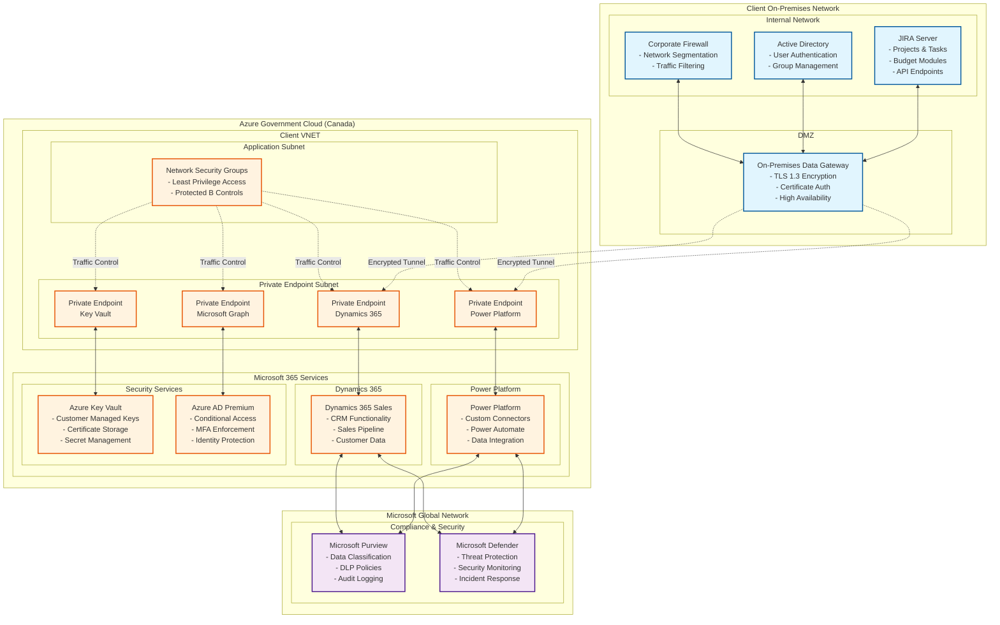
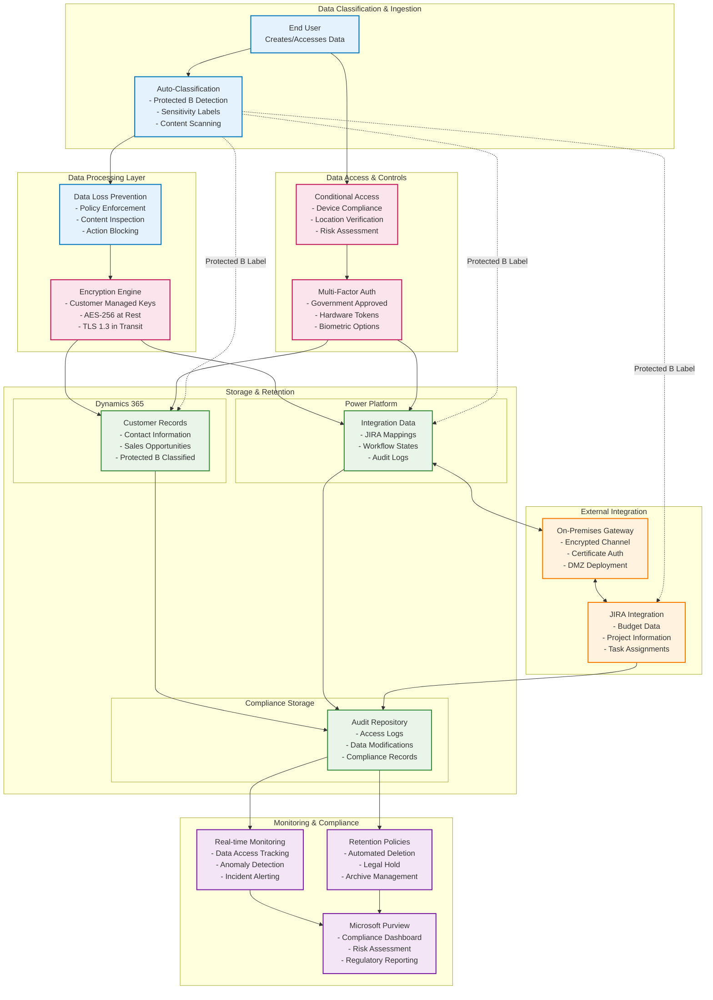
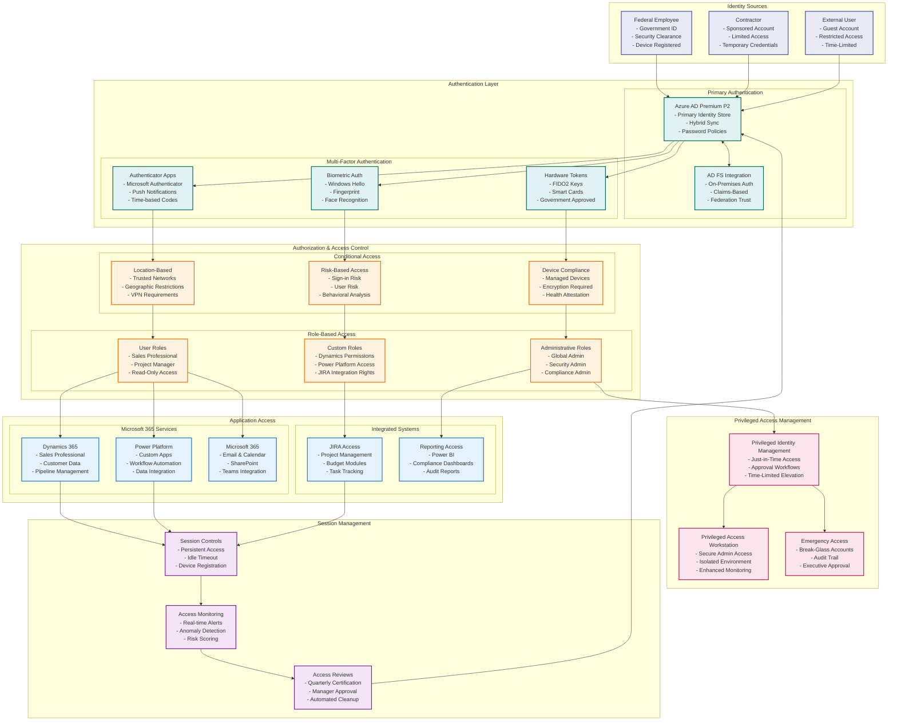
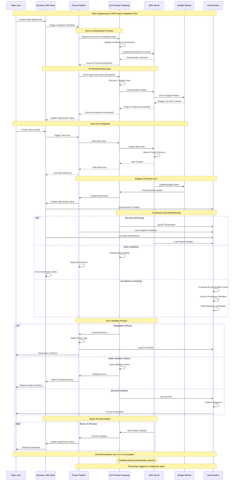

## 🔐 Scope of Work

### Core Dynamics 365 Sales Professional Implementation

* ✅ Deploy and configure Dynamics 365 Sales Professional with Protected B compliance
* ✅ Implement comprehensive contact management and opportunity tracking
* ✅ Configure sales pipeline automation and opportunity management
* ✅ Setup advanced analytics and reporting with Power BI integration
* ✅ Enable custom entity creation and workflow automation

### Power Platform Security Hardening

* ✅ Configure Power Platform environments with Protected B security controls
* ✅ Implement Azure Private Endpoints for Power Platform services
* ✅ Enable VNET integration for secure network isolation
* ✅ Apply Microsoft Purview policies (DLP, auto-labeling, encryption)
* ✅ Configure Customer Managed Keys (CMK) for data encryption
* ✅ Setup Conditional Access and session controls
* ✅ Enforce managed device compliance for platform access

### JIRA Integration & Workflow Automation

* ✅ Design and implement bi-directional JIRA on-premise integration via On-Premises Data Gateway
* ✅ Configure Power Automate flows for real-time data synchronization
* ✅ Setup budget module connectivity and financial workflow automation
* ✅ Implement project and task mapping between JIRA and Dynamics Sales pipeline
* ✅ Enable automated case escalation and status updates
* ✅ Implement custom field mapping and data transformation

### Advanced Security & Compliance

* ✅ Configure Sensitivity Labels (client-provided or default Protected B classifications)
* ✅ Implement Data Loss Prevention (DLP) policies
* ✅ Enable Microsoft Defender for Office 365 and Power Platform
* ✅ Configure comprehensive audit logging and retention policies
* ✅ Implement Protected B data classification and handling
* ✅ Setup security monitoring with recommendations for SIEM integration (client responsibility)

### Training & Documentation

* ✅ Deliver comprehensive user training and administrator guides
* ✅ Provide security best practices documentation
* ✅ Conduct knowledge transfer sessions
* ✅ 90-day support period with optional extension

---

## 🧰 Pre-Requisites and Deployment Approach

To perform the activities outlined in this proposal, the following pre-requisites and operating model must be established:

### 🔑 Access and Privileged Roles

Cloudstrucc will require:

* A dedicated **privileged administrative account** or membership in a **privileged role group** within Microsoft Entra ID.
* The following roles or equivalent custom RBAC assignments:

  * **Global Reader** (for assessments and baselining)
  * **Security Administrator** (for configuring Defender, alerts, Purview)
  * **Compliance Administrator** (for DLP, Sensitivity Labels, eDiscovery)
  * **Dynamics 365 Administrator**
  * **Power Platform Administrator**
  * **SharePoint Administrator** (for integrated document management)
  * **Privileged Role Administrator** (for conditional access configuration)
  * **Azure Network Contributor** (for private endpoint and VNET provisioning)
  * **Application Administrator** (for JIRA integration setup)

Access must be granted by the [Client Name] Entra administrator prior to production deployment.

### 🏗️ Cloudstrucc Build & Staging Environment Model

To support structured, low-risk implementation aligned with federal change management requirements:

* Cloudstrucc will use its **own Azure subscription and Microsoft 365 tenant** for initial **build, configuration, and templating**.
* This isolated tenant will mirror [Client Name]'s Protected B compliance requirements and baseline.
* Implementation phases:

  * **Development Environment**: Initial configuration and testing in Cloudstrucc tenant
  * **Client Staging Environment**: Validation in client test tenant or sandbox
  * **Production Deployment**: Controlled rollout using Infrastructure as Code (IaC) templates

**Configuration artifacts will include:**

* **ARM/Bicep templates** for Azure resource provisioning
* **PowerShell scripts** for Power Platform configuration
* **Power Automate solutions** for JIRA integration
* **Compliance policy templates** for Protected B requirements

**This model ensures:**

* Minimal disruption to existing [Client Name] services
* Compliance with federal change management protocols
* Reproducible security posture across environments
* Audit trail for all configuration changes

### 🔐 Protected B Security Requirements

The implementation will address specific Protected B requirements:

* **Data Sovereignty**: All data remains within Canadian geographic boundaries
* **Encryption Standards**: AES-256 encryption at rest and TLS 1.3 in transit
* **Access Controls**: Multi-factor authentication and conditional access policies
* **Network Isolation**: Private endpoints and VNET integration
* **Audit Compliance**: Comprehensive logging and retention policies
* **Incident Response**: Integration with government security operations centers

---

## ⏳ Duration and Phasing

### Project Duration: **45 to 90 Calendar Days**

| Phase   | Duration   | Milestone                                    | Outcome                                       |
| ------- | ---------- | -------------------------------------------- | --------------------------------------------- |
| Phase 1 | Week 1-2   | Discovery & Protected B Assessment           | Gap analysis and compliance baseline         |
| Phase 2 | Week 3-4   | Core D365 Sales Professional Deployment     | CRM foundation with basic security controls   |
| Phase 3 | Week 5-7   | Power Platform Security Hardening           | Protected B compliance and network isolation  |
| Phase 4 | Week 8-10  | JIRA Integration & Workflow Automation      | Bi-directional sync and automated workflows  |
| Phase 5 | Week 11-12 | Advanced Security & Compliance              | Full DLP, labeling, and monitoring active    |
| Phase 6 | Week 13    | Testing, Training & Documentation           | User training, documentation, handover       |
| Final   | Day 90     | Go-Live & Support Transition                | Production ready, support period begins      |

---

## 💸 Implementation Cost Estimate (CAD)

*Implementation timeline and costs to be finalized based on detailed requirements gathering.*

| Item                                          | Description                                           | Estimated Cost (CAD) | Estimated Due Date |
| --------------------------------------------- | ----------------------------------------------------- | -------------------- | ------------------ |
| Discovery & Protected B Compliance Assessment | Security audit, gap analysis, compliance mapping     | $[TBD]               | [TBD]              |
| Dynamics 365 Sales Professional Setup        | Core CRM deployment, configuration, customization    | $[TBD]               | [TBD]              |
| Power Platform Security Hardening            | Private endpoints, VNET integration, CMK setup       | $[TBD]               | [TBD]              |
| JIRA Integration Development                  | Bi-directional sync, budget module connectivity      | $[TBD]               | [TBD]              |
| Advanced Security Configuration              | DLP, labels, monitoring, incident response setup     | $[TBD]               | [TBD]              |
| Data Migration & Legacy System Integration   | Data import, cleansing, legacy system connectivity   | $[TBD]               | [TBD]              |
| User Training & Change Management            | End-user training, admin training, adoption support  | $[TBD]               | [TBD]              |
| Documentation & Knowledge Transfer           | Admin guides, user manuals, security procedures      | $[TBD]               | [TBD]              |
| Support (90 days)                            | Post-implementation support, tuning, optimization    | $[TBD]               | [TBD]              |
| **Subtotal**                                  |                                                       | **$[TBD] CAD**       |                    |
| HST (13%)                                     |                                                       | **$[TBD] CAD**       |                    |
| **Total with HST**                           |                                                       | **$[TBD] CAD**       |                    |

**Payment Terms**
The total amount indicated in this proposal, including applicable taxes, shall become payable upon completion of the scope of work as outlined herein. Payment schedule will align with federal government procurement policies and milestone-based deliverables. Final payment shall be due within thirty (30) days of the client's written confirmation of acceptance and sign-off of the completed deliverables. This agreement shall be governed by the laws of the Province of Ontario and the federal laws of Canada applicable therein.

> *Optional extended support available at negotiated hourly rates*

---

## 📦 Licensing Requirements (CAD Pricing)

### Microsoft 365 & Dynamics 365 Licensing (CAD)

**Pre-requisite**: All users must have Microsoft 365 E5 licensing as the foundation for this implementation.

| License Component                    | Features Required                                          | Estimated Monthly Cost (CAD/user) |
| ------------------------------------ | ---------------------------------------------------------- | ---------------------------------- |
| Microsoft 365 E5 (Required)         | Base platform, advanced security, Power Platform included | ~$57                               |
| Dynamics 365 Sales Professional     | Core CRM functionality, sales automation                  | ~$25 (additional to E5)            |
| Power Platform Premium               | Advanced connectors, extended compute                      | ~$30                               |
| Microsoft Defender for Business Apps | Advanced threat protection for Dynamics 365               | ~$4                                |

### Power Platform Security Add-ons

| Security Component                   | Purpose                                         | Estimated Monthly Cost |
| ------------------------------------ | ----------------------------------------------- | ---------------------- |
| Customer Managed Keys (CMK)         | Enhanced encryption control for Protected B    | ~$500/month            |
| Private Endpoint Connectivity       | Network isolation and VNET integration         | ~$200/month            |
| Power Platform DLP Premium          | Advanced data loss prevention policies         | Included in E5         |
| Microsoft Purview Information Protection | Sensitivity labeling and classification    | Included in E5         |

### Notes on Federal Government Pricing

* Government pricing may be available through **Microsoft Enterprise Agreement** or **MPSA programs**
* **Volume licensing discounts** may apply based on organization size
* **GCdocs integration** may require additional licensing considerations
* All costs subject to federal procurement policies and approval processes

---

## 🔄 JIRA Integration Architecture

### Integration Overview

The JIRA on-premise integration will leverage Power Platform's enterprise-grade connectivity to establish secure, bi-directional data synchronization between Dynamics 365 and your existing JIRA infrastructure. This integration will provide complete visibility from lead generation through project completion by mapping sales opportunities to JIRA projects, tasks, and budget modules.

**Key Integration Capabilities:**

* **Sales Pipeline to JIRA Project Mapping**: Automatic creation of JIRA projects when sales opportunities reach specific stages
* **Task-Level Integration**: Detailed task mapping between Dynamics sales activities and JIRA work items
* **Budget Module Connectivity**: Real-time synchronization of financial data and budget tracking
* **Project Financial Visibility**: Management dashboards showing complete financial journey from lead to project delivery

### Technical Implementation

#### **On-Premises Data Gateway Architecture**

* **Secure DMZ Deployment**: On-Premises Data Gateway installed in your DMZ network for secure connectivity
* **Encrypted Communication**: All data transfer encrypted using TLS 1.3 between gateway and Microsoft cloud services
* **Network Isolation**: No direct internet connectivity to JIRA systems, all communication through gateway
* **High Availability**: Clustered gateway configuration for redundancy and load balancing

#### **Project and Task Mapping Framework**

* **Opportunity-to-Project Lifecycle**: Automated project creation in JIRA when opportunities advance to specific sales stages
* **Task Synchronization**: Bi-directional sync of sales activities (calls, meetings, proposals) with JIRA tasks
* **Work Item Tracking**: Real-time status updates between Dynamics sales activities and JIRA work items
* **Resource Allocation**: Integration of team assignments and time tracking across both platforms

#### **Budget Module Connectivity**

* **Financial Workflow Integration**: Link CRM opportunities to JIRA budget line items with real-time updates
* **Automated Budget Creation**: Generate budget entries in JIRA when opportunities reach qualified stages
* **Cost Center Mapping**: Automatic assignment of opportunities to appropriate budget categories and cost centers
* **Approval Process Integration**: Streamlined budget approval workflows triggered from sales pipeline events

#### **Data Mapping & Transformation**

* **Custom Field Mapping**: Flexible configuration mapping D365 opportunity fields to JIRA project/task fields
* **Business Rule Engine**: Configurable rules for data transformation and validation
* **Master Data Synchronization**: Consistent customer, product, and project data across both systems
* **Audit Trail Maintenance**: Complete tracking of all data synchronization activities with tamper-evident logging

### Sales-to-Project Management Benefits

#### **Enhanced Financial Visibility**

* **End-to-End Tracking**: Complete visibility from initial lead through project completion and billing
* **Budget vs. Actual Reporting**: Real-time comparison of sales projections with actual project costs
* **Resource Planning**: Improved capacity planning based on sales pipeline and project commitments
* **Revenue Recognition**: Automated revenue tracking aligned with project milestones and deliverables

#### **Operational Efficiency**

* **Reduced Manual Data Entry**: Automated synchronization eliminates duplicate data entry across systems
* **Consistent Project Naming**: Standardized project creation based on sales opportunity templates
* **Streamlined Handoffs**: Seamless transition from sales team to project delivery teams
* **Unified Reporting**: Consolidated dashboards showing sales and project metrics in single view

### Security Considerations

#### **Network Security**

* **DMZ Gateway Deployment**: Secure placement of data gateway in network demilitarized zone
* **Certificate-Based Authentication**: X.509 certificates for gateway authentication and API security
* **Data Encryption**: End-to-end encryption for all data transfers between systems
* **Network Segmentation**: Isolated network paths for integration traffic with firewall controls

#### **Compliance Alignment**

* **Protected B Data Handling**: Appropriate classification and handling of sensitive financial and project data
* **Comprehensive Audit Logging**: Full audit trail of all integration activities and data modifications
* **Role-Based Access Controls**: Granular permissions for integration management and data access
* **Data Residency**: Ensuring Canadian data sovereignty requirements for all synchronized data

---

## 🔒 Power Platform Security Best Practices

### Protected B Compliance Framework

#### **Data Classification & Handling**

* **Automatic Data Classification**: Automated identification of Protected B content
* **Sensitivity Labels**: Client-provided sensitivity label taxonomy or default Protected B classifications will be implemented
* **Retention Policies**: Automated data lifecycle management
* **Legal Hold Capabilities**: eDiscovery and litigation support

#### **Network Security Architecture**

* **Azure Private Endpoints**: Elimination of public internet data traversal
* **VNET Integration**: Secure virtual network connectivity
* **Network Security Groups**: Granular traffic control and filtering
* **On-Premises Data Gateway**: Secure connectivity for JIRA integration through DMZ deployment

#### **Identity & Access Management**

* **Conditional Access Policies**: Risk-based access controls
* **Privileged Identity Management**: Just-in-time administrative access
* **Multi-Factor Authentication**: Government-approved authentication methods
* **Zero Trust Architecture**: Verify every access request

#### **Threat Protection & Monitoring**

* **Microsoft Defender Integration**: Advanced threat detection and response
* **Behavioral Analytics**: Automated anomaly detection
* **Incident Response Automation**: Automated threat response workflows
* **SIEM Integration Readiness**: Platform configured to support client's existing SIEM solutions (client responsibility)

### Federal Government Security Standards

#### **Treasury Board Directive Compliance**

* **Directive on Security Management**: Comprehensive security management framework
* **Privacy Impact Assessment**: PIPEDA compliance and privacy protection
* **Security Control Assessment**: ITSG-33 security control implementation
* **Continuous Monitoring**: Ongoing security posture assessment

#### **Canadian Government Cloud Framework**

* **Cloud Security Assessment**: Formal security assessment and authorization
* **Data Sovereignty**: Canadian data residency requirements
* **Supplier Security Requirements**: Vendor security compliance verification
* **Security Incident Reporting**: Government security incident procedures

---

## 📋 Detailed Security Checklist

### Infrastructure Security

* [ ] Azure Private Endpoints configured for all Power Platform services
* [ ] VNET integration enabled with government-approved network architecture
* [ ] Customer Managed Keys (CMK) implemented for data encryption
* [ ] Network Security Groups configured with least-privilege access
* [ ] On-Premises Data Gateway deployed in DMZ for secure JIRA connectivity

### Identity & Access Security

* [ ] Conditional Access policies aligned with Protected B requirements
* [ ] Multi-Factor Authentication enforced for all users
* [ ] Privileged Identity Management implemented for administrative access
* [ ] Guest access controls configured per government standards
* [ ] Regular access reviews and certification processes established

### Data Protection & Classification

* [ ] Microsoft Purview Information Protection deployed
* [ ] Sensitivity labels configured (client-provided taxonomy or default Protected B classifications)
* [ ] Data Loss Prevention (DLP) policies implemented
* [ ] Automatic data classification enabled
* [ ] Data retention and deletion policies configured

### Monitoring & Compliance

* [ ] Microsoft Defender for Office 365 and Power Platform enabled
* [ ] Platform configured for SIEM integration (recommended - client responsibility)
* [ ] Comprehensive audit logging implemented
* [ ] Compliance dashboard and reporting established
* [ ] Incident response procedures documented and tested

---

## 📄 Appendices

### Appendix A: Power Platform Security Architecture Diagram

* Detailed network architecture showing private endpoints and VNET integration

* Data flow diagrams for Protected B information handling

* Identity and access management architecture

* Integration security model with JIRA on-premise (EXAMPLE)

### Appendix B: JIRA Integration Technical Specifications

* On-Premises Data Gateway configuration and DMZ deployment guidelines
* Project and task mapping specifications between Dynamics Sales and JIRA
* Budget module integration technical architecture and data flows
* API endpoint configurations and authentication methods
* Workflow automation sequences and business logic
* Error handling and recovery procedures

### Appendix C: Compliance Mapping Matrix

* Protected B requirements mapped to Power Platform security controls
* ITSG-33 security control implementation details
* Privacy protection measures and PIPEDA compliance
* Sensitivity label requirements (client-provided or default classifications)
* Audit and reporting capabilities for government oversight

### Appendix D: Assumptions and Caveats

* **High-Level Requirements**: This proposal is based on preliminary requirements gathering; detailed specifications will be refined during discovery phase
* **JIRA Integration Scope**: Integration assumes standard JIRA project/task structure and budget module configuration
* **Network Infrastructure**: Assumes client has appropriate DMZ network infrastructure for On-Premises Data Gateway deployment
* **Sensitivity Labels**: Implementation will use client-provided sensitivity label taxonomy or implement default Protected B classifications
* **SIEM Integration**: Platform will be configured to support SIEM integration as a recommended best practice (client responsibility)
* **Change Management**: Assumes standard federal government change management and approval processes will be followed

### Appendix D: Federal Government Compliance References

* [Treasury Board Directive on Security Management](https://www.tbs-sct.gc.ca/pol/doc-eng.aspx?id=16578)
* [Government of Canada ITSG-33](https://www.cse-cst.gc.ca/en/itsg-33)
* [Protected B Information Handling Guidelines](https://www.tpsgc-pwgsc.gc.ca/esc-src/protection-protection/niveaux-levels-eng.html)
* [Cloud Security Assessment Framework](https://www.canada.ca/en/government/system/digital-government/digital-government-innovations/cloud-services/cloud-security.html)
* [Microsoft Power Platform Security Documentation](https://docs.microsoft.com/en-us/power-platform/admin/security)

---

