# Elections Canada: Power Platform Enterprise Operations Guide

## Table of Contents

1. [Introduction](#introduction)
2. [Power Platform CoE Toolkit Overview](#power-platform-coe-toolkit-overview)
3. [Prerequisites and Installation](#prerequisites-and-installation)
4. [Governance Framework](#governance-framework)
5. [Tenant Hygiene](#tenant-hygiene)
6. [Environment Strategy](#environment-strategy)
7. [Team Structure and Roles](#team-structure-and-roles)
8. [Implementation Process](#implementation-process)
9. [Upgrade and Maintenance Strategy](#upgrade-and-maintenance-strategy)
10. [Monitoring and Analytics](#monitoring-and-analytics)
11. [Training and Enablement](#training-and-enablement)
12. [Security and Compliance](#security-and-compliance)
13. [References](#references)

## Introduction

This document provides a comprehensive guide for implementing and operating Microsoft Power Platform at an enterprise scale within Elections Canada. It leverages the Power Platform Center of Excellence (CoE) Toolkit and established best practices for governance, tenant hygiene, and operational processes.

The Power Platform provides a suite of tools including Power Apps, Power Automate, Power BI, and Power Pages that enable digital transformation through low-code/no-code solutions. This guide aims to ensure that Elections Canada can effectively manage, govern, and scale the use of these tools while maintaining security, compliance, and operational efficiency.

## Power Platform CoE Toolkit Overview

The Power Platform CoE Toolkit is a set of components and tools designed to help organizations implement governance and management capabilities for Power Platform. It consists of several core modules that work together to provide a comprehensive management solution.

```mermaid
graph TD
    A[Power Platform CoE Toolkit] --> B[Core Components]
    A --> C[Governance Components]
    A --> D[Nurture Components]
    A --> E[Audit Components]
    A --> F[Admin Components]
  
    B --> B1[Sync Template]
    B --> B2[Core Components Solution]
    B --> B3[Power BI Dashboard]
  
    C --> C1[Admin Audit Environment]
    C --> C2[Set Admin Environment]
    C --> C3[Environment Request]
    C --> C4[DLP Editor]
  
    D --> D1[Maker Assessment]
    D --> D2[Training in a Day]
    D --> D3[Innovation Backlog]
    D --> D4[Asset Library]
  
    E --> E1[App Audit]
    E --> E2[Flow Audit]
    E --> E3[Power BI Audit]
  
    F --> F1[Admin View]
    F --> F2[Bulk Delete]
    F --> F3[Environment Variables]
    F --> F4[BPA Reports]
```

### Key Modules

1. **Core Components**

   - Inventory and telemetry tracking
   - Environment management
   - Resource cataloging
2. **Governance Components**

   - Data Loss Prevention (DLP) policies
   - Environment provisioning
   - Admin management
3. **Nurture Components**

   - Maker enablement
   - Training resources
   - Innovation management
4. **Audit Components**

   - Application and flow review
   - Security and compliance checks
   - Usage analytics
5. **Admin Components**

   - Bulk operations
   - Environment cleanup
   - Configuration management

## Prerequisites and Installation

### Prerequisites

Before installing the CoE Toolkit, ensure the following prerequisites are met:

1. **Administrative Access**:

   - Global Administrator or Power Platform Administrator role
   - Power Apps Per User Plan or Power Apps Per App Plan
2. **Environments**:

   - Dedicated Production environment for CoE
   - Dedicated Development environment for testing
   - Base Dataverse capacity (1GB minimum)
3. **Power Platform Licenses**:

   - Power Apps Premium licenses for administrators
   - Power Automate Premium licenses for automated flows
4. **Additional Requirements**:

   - Office 365 account with Exchange Online
   - SharePoint Online site for document storage
   - Microsoft Teams for collaboration

### Installation Process

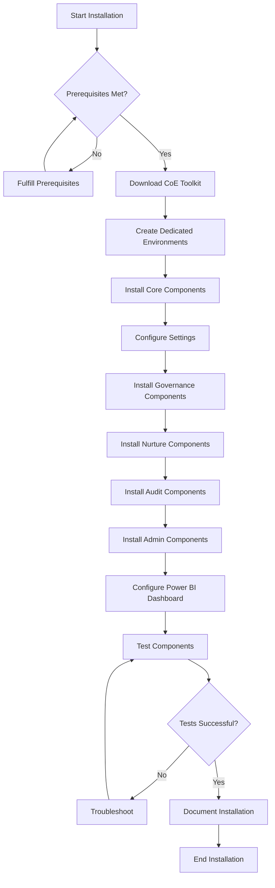

#### Step-by-Step Installation

1. **Set up dedicated environments**:

   ```
   Production: CoE-Production
   Development: CoE-Development
   ```
2. **Install Core Components**:

   - Go to [aka.ms/CoEStarterKit](https://aka.ms/CoEStarterKit)
   - Download the latest solution
   - Import into the production environment
   - Configure connection references
3. **Set up Power BI Dashboard**:

   - Download template from CoE Toolkit
   - Connect to Dataverse environment
   - Publish to Power BI workspace
4. **Install and configure additional components**:

   - Governance Components
   - Nurture Components
   - Audit Components
   - Admin Components
5. **Validate installation**:

   - Verify all flows are running
   - Check data collection
   - Test admin operations

## Governance Framework

A robust governance framework is essential for successful Power Platform implementation. Elections Canada should establish the following governance structure:

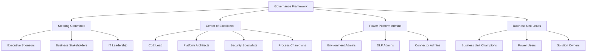

### Governance Policies

1. **Data Loss Prevention (DLP)**:

   - Business critical connectors vs. non-business connectors
   - Environment-specific DLP policies
   - Regular DLP review process
2. **Environment Creation**:

   - Request and approval workflow
   - Purpose classification
   - Lifecycle management
3. **Application Lifecycle Management (ALM)**:

   - Development standards
   - Testing requirements
   - Deployment processes
4. **Risk Management**:

   - Risk assessment framework
   - Mitigation strategies
   - Regular audits

## Tenant Hygiene

Maintaining tenant hygiene is critical for a secure and efficient Power Platform implementation. The following practices should be adopted:

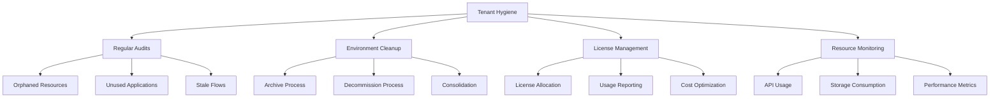

### Key Hygiene Practices

1. **Resource Inventory Management**:

   - Weekly automated inventory collection
   - Monthly orphaned resource identification
   - Quarterly clean-up operations
2. **Environment Lifecycle Management**:

   - 90-day review of inactive environments
   - Automated notifications for inactivity
   - Archival and decommissioning process
3. **License Optimization**:

   - Monthly license usage review
   - Reassignment of unused licenses
   - License forecasting for budget planning
4. **Performance Monitoring**:

   - API call monitoring
   - Storage usage tracking
   - Flow execution metrics

## Environment Strategy

Elections Canada should adopt a structured environment strategy for effective segregation and management of Power Platform resources:

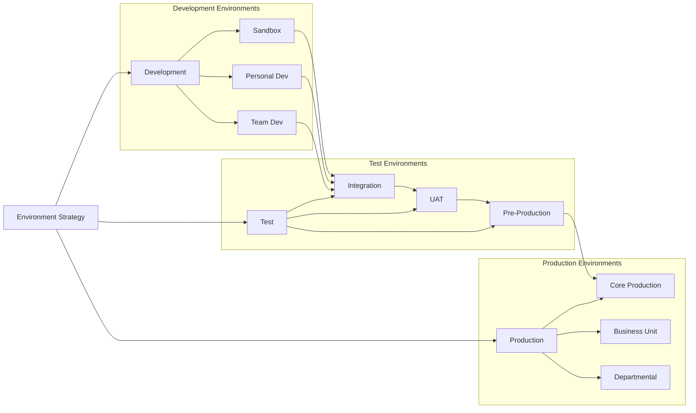

### Environment Types

1. **Development Environments**:

   - **Personal Development**: For individual makers (default)
   - **Team Development**: For collaborative development
   - **Sandbox**: For experimental solutions
2. **Test Environments**:

   - **Integration Testing**: For system integration
   - **User Acceptance Testing**: For business validation
   - **Pre-Production**: Final verification before deployment
3. **Production Environments**:

   - **Core Production**: Enterprise-wide solutions
   - **Departmental**: Department-specific solutions
   - **Business Unit**: Team-specific solutions

### Environment Provisioning Process

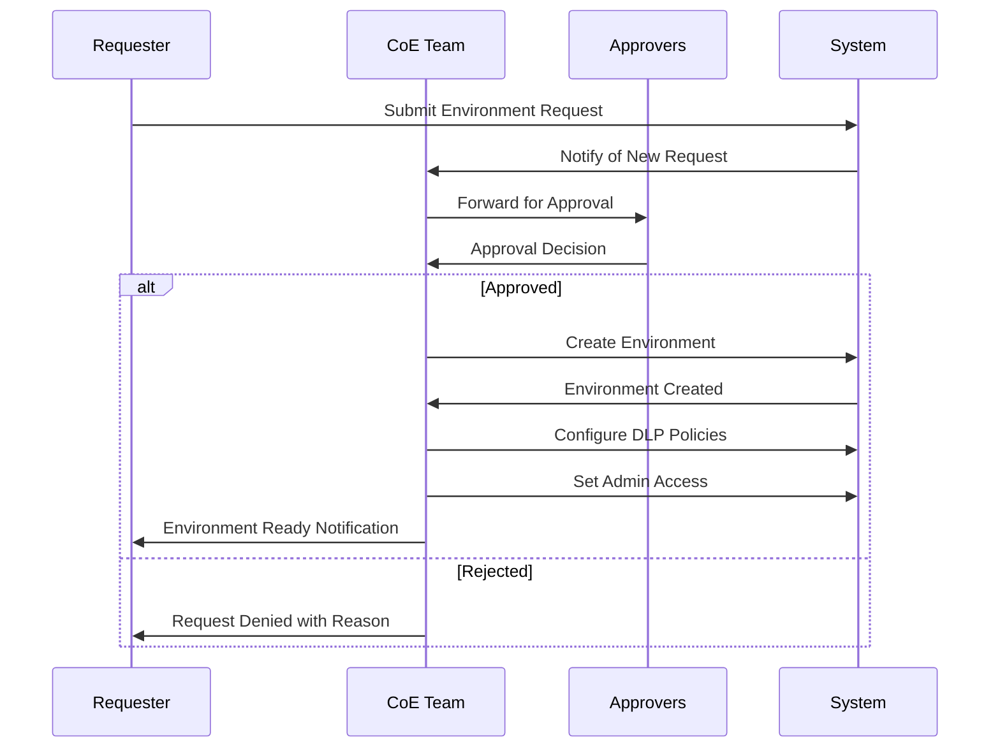

## Team Structure and Roles

A successful Power Platform implementation requires a well-defined team structure with clear roles and responsibilities:

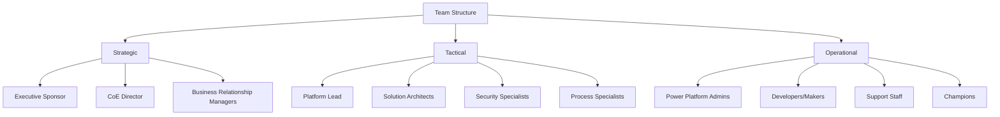

### Core Roles and Responsibilities

1. **Strategic Roles**:

   - **Executive Sponsor**: Overall accountability and funding
   - **CoE Director**: Strategy and governance oversight
   - **Business Relationship Managers**: Stakeholder engagement
2. **Tactical Roles**:

   - **Platform Lead**: Technical direction and standards
   - **Solution Architects**: Solution design and patterns
   - **Security Specialists**: Security and compliance
   - **Process Specialists**: Process optimization
3. **Operational Roles**:

   - **Power Platform Admins**: Day-to-day administration
   - **Developers/Makers**: Solution creation
   - **Support Staff**: User assistance and troubleshooting
   - **Champions**: User enablement and best practices

## Implementation Process

The implementation of Power Platform at Elections Canada should follow a structured process:

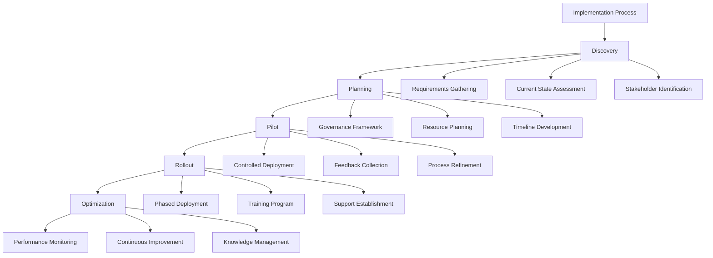

### Implementation Phases

1. **Discovery Phase** (4-6 weeks):

   - Requirements gathering
   - Current state assessment
   - Stakeholder identification
   - Success metrics definition
2. **Planning Phase** (6-8 weeks):

   - Governance framework development
   - Resource allocation
   - Timeline and roadmap creation
   - Risk assessment
3. **Pilot Phase** (8-12 weeks):

   - Controlled deployment to selected groups
   - Feedback collection and analysis
   - Process and governance refinement
   - Success criteria validation
4. **Rollout Phase** (3-6 months):

   - Phased deployment across organization
   - Training program execution
   - Support structure establishment
   - Change management activities
5. **Optimization Phase** (Ongoing):

   - Performance monitoring and tuning
   - Continuous improvement initiatives
   - Knowledge management
   - Regular governance reviews

## Upgrade and Maintenance Strategy

Based on the information from the provided document, here is the upgrade and maintenance strategy that Elections Canada should implement:

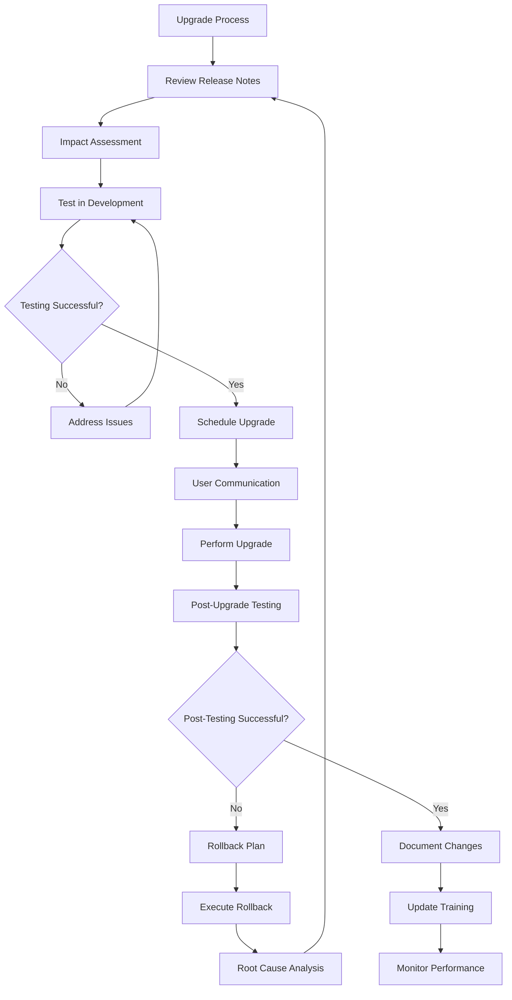

### Vendor Product Upgrade Implementation Strategy & Process

#### Pre-Upgrade Phase

1. **Upgrade Readiness Assessment**:

   - Review release notes for upcoming Power Platform updates
   - Identify potential impacts to existing solutions
   - Assess compatibility with current implementations
2. **Impact Analysis**:

   - Document systems and processes affected by the upgrade
   - Identify critical dependencies
   - Evaluate business impact of changes
3. **Testing Environment Preparation**:

   - Configure sandbox environments to mirror production
   - Establish testing criteria and scripts
   - Prepare test data and scenarios

#### Testing Phase

1. **Comprehensive Testing**:

   - Functional testing of core capabilities
   - Integration testing with connected systems
   - Performance testing under various loads
   - Security testing of new features
2. **User Acceptance Testing**:

   - Engage business users in testing
   - Validate business processes remain functional
   - Document any issues or concerns
3. **Issue Resolution**:

   - Track and categorize identified issues
   - Prioritize critical issues for resolution
   - Develop workarounds for unresolved issues

#### Implementation Phase

1. **Implementation Planning**:

   - Schedule upgrade during minimal impact periods
   - Prepare detailed implementation plan
   - Establish communication channels for updates
2. **User Communication**:

   - Notify users of upcoming changes
   - Provide documentation on new features
   - Offer training opportunities
3. **Upgrade Execution**:

   - Follow Microsoft-recommended upgrade procedures
   - Monitor system during upgrade process
   - Document any unexpected issues

#### Post-Implementation Phase

1. **Post-Implementation Verification**:

   - Verify all systems are functioning correctly
   - Conduct quick-check user acceptance testing
   - Monitor system performance
2. **Issue Management**:

   - Address any post-implementation issues
   - Implement workarounds as needed
   - Track resolution of outstanding issues
3. **Documentation and Training Updates**:

   - Update system documentation
   - Revise training materials
   - Provide additional training as needed

### Maintenance Schedule

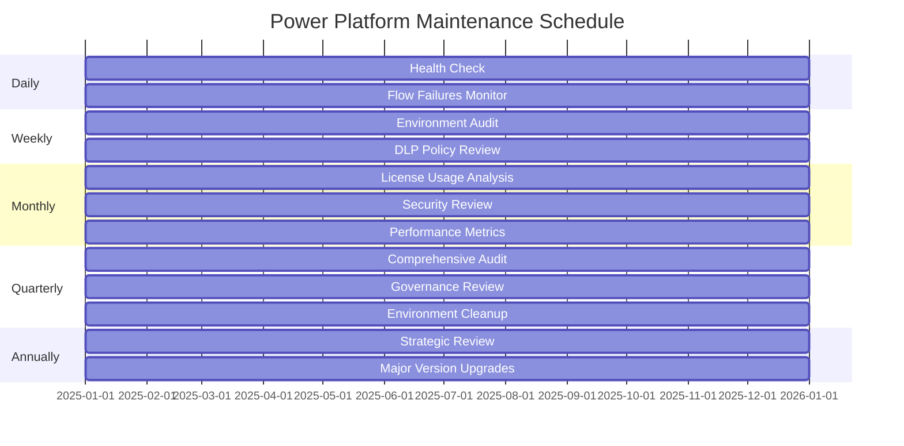

### Change Management Process

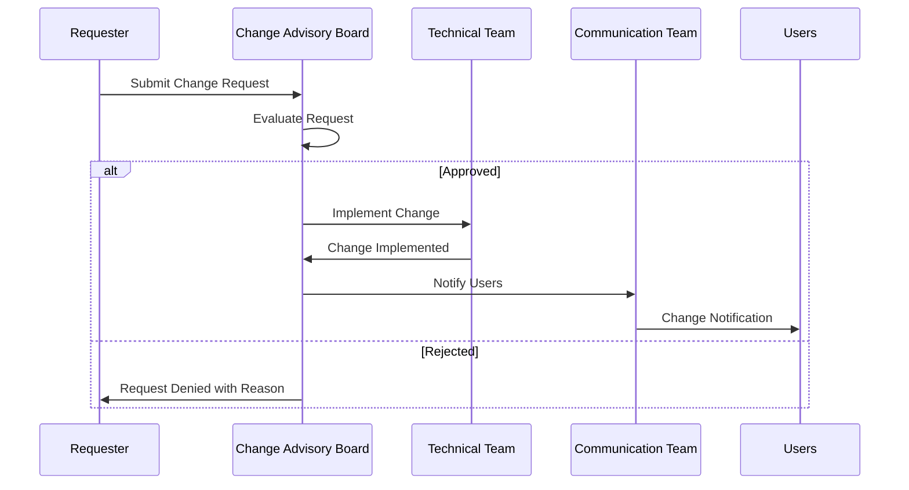

## Monitoring and Analytics

The CoE Toolkit provides robust monitoring and analytics capabilities that Elections Canada should leverage:

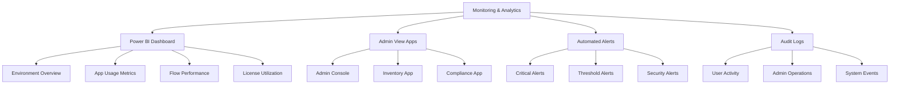

### Key Monitoring Areas

1. **Environment Health**:

   - Resource consumption
   - API usage
   - Storage utilization
   - Performance metrics
2. **Application Usage**:

   - User adoption rates
   - Session statistics
   - Feature utilization
   - Error rates
3. **Flow Performance**:

   - Success/failure rates
   - Execution time
   - Trigger statistics
   - Error patterns
4. **License Utilization**:

   - Active vs. assigned licenses
   - User activity patterns
   - License optimization opportunities
   - Cost allocation

### Analytics Reporting Schedule

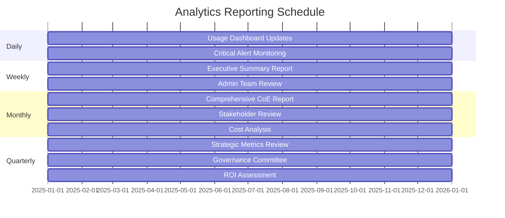

## Training and Enablement

A robust training and enablement program is essential for successful Power Platform adoption:

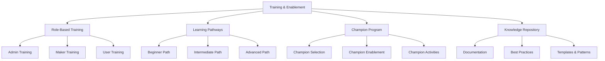

### Training Program Components

1. **Role-Based Training**:

   - **Admin Track**: Governance, security, and management
   - **Maker Track**: App development and flow creation
   - **User Track**: Application usage and best practices
2. **Learning Pathways**:

   - **Beginner**: Fundamentals and basic concepts
   - **Intermediate**: Advanced features and integration
   - **Advanced**: Advanced development and architecture
3. **Champion Program**:

   - Selection criteria and process
   - Specialized training and certification
   - Community engagement and support
   - Recognition and incentives
4. **Knowledge Repository**:

   - Centralized documentation
   - Best practices and guidelines
   - Solution templates and patterns
   - Troubleshooting guides

### Training Delivery Methods

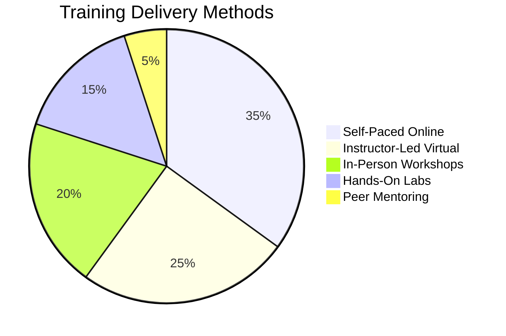

## Security and Compliance

Security and compliance are paramount for Elections Canada's Power Platform implementation:

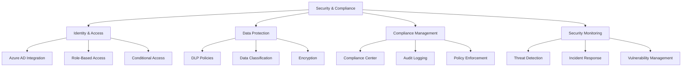

### Security Framework

1. **Identity and Access Management**:

   - Microsoft Entra ID integration
   - Multi-factor authentication enforcement
   - Role-based access control
   - Conditional access policies
2. **Data Protection**:

   - Data Loss Prevention (DLP) policies
   - Data classification and labeling
   - Encryption at rest and in transit
   - Secure connector management
3. **Compliance Management**:

   - Microsoft Purview integration
   - Regular compliance assessments
   - Policy enforcement automation
   - Audit and reporting capabilities
4. **Security Monitoring**:

   - Real-time threat detection
   - Incident response procedures
   - Vulnerability management process
   - Security dashboard and alerting

### Security Review Process

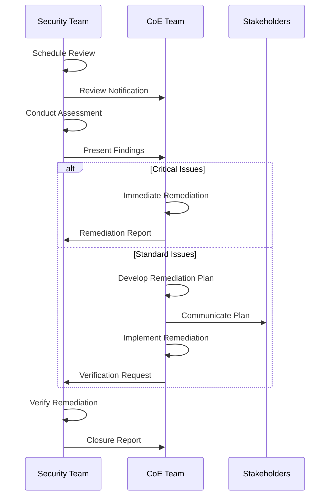

## References

- [Microsoft Power Platform CoE Toolkit Documentation](https://learn.microsoft.com/en-us/power-platform/guidance/coe/overview)
- [Power Platform Administration and Governance](https://learn.microsoft.com/en-us/power-platform/admin/governance-considerations)
- [Power Platform ALM Documentation](https://learn.microsoft.com/en-us/power-platform/alm/overview-alm)
- [Microsoft Power Platform Security and Compliance](https://learn.microsoft.com/en-us/power-platform/admin/wp-security)
- [Power Platform DLP Documentation](https://learn.microsoft.com/en-us/power-platform/admin/wp-data-loss-prevention)
- [Microsoft Power Platform Adoption Framework](https://learn.microsoft.com/en-us/power-platform/guidance/adoption/methodology)
