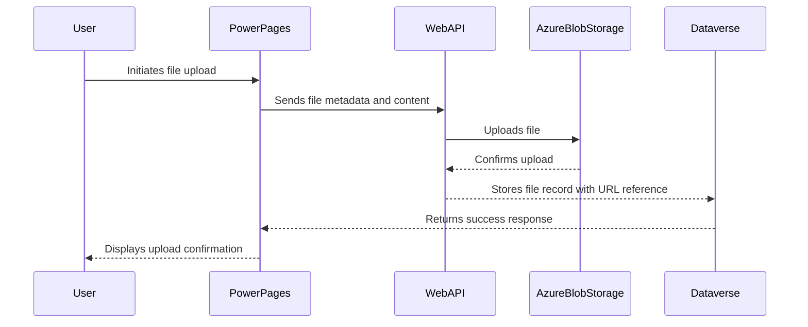
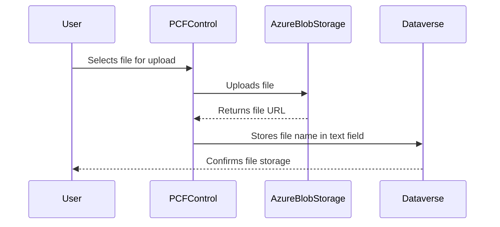

### 4.4 Azure Blob Storage Integration

Azure Blob Storage integration enables Power Platform to handle large files and media efficiently. Data stored in Blob Storage is accessible through Power Apps, Power Automate, and Power Pages, ensuring seamless data handling and retrieval.

Azure Blob Storage is used for web files (optional) if a project decides not to leverage the OOB file attachment feature that ships with Power Pages web files. By leveraging Blob storage for web files (e.g., CSS/JS/images, etc.) for a Power Pages site, the agency benefits from reusable/centralized assets for theming, therefore streamlining enterprise theme upgrades across multiple sites by virtue of updating the integrated storage account.

Projects that require storage integration for a Power Pages site must send a request to the service to receive a connection string (encrypted) and read-only access to the storage account to obtain the web file asset URLs to configure within the web file record blob record URL field.

#### 4.4.1 File Upload via Power Pages Native Feature

* Power Pages Web API is used to interact with Azure Blob Storage.
* Files are stored as `annotation` (note) records in Dataverse with a reference URL to the blob storage location.
* Security is enforced using a service account and appropriate access controls in Azure.
* Authentication is handled using managed identity or SAS tokens.
* Site settings define storage configuration, allowed file types, and maximum file sizes.
* Table permissions are required for web roles to access the file management Web API.
* Users interact with an embedded file upload component in Power Pages forms.

#### 4.4.2 Security Considerations

* **Blob Storage Security:**
  * Use private containers to restrict public access.
  * Enforce access via Azure Active Directory (AAD) authentication.
  * Apply role-based access control (RBAC) to grant least-privilege access.
  * Configure storage lifecycle policies for retention and automatic deletion.
* **Service Account Best Practices:**
  * Use managed identities to avoid storing credentials.
  * Restrict the service account’s permissions to necessary operations only (upload, delete, list).
  * Monitor activity using Azure Storage logs.
* **Data Integrity & Compliance:**
  * Ensure files are scanned for viruses before allowing upload.
  * Log all upload and access attempts.
  * Encrypt data in transit (HTTPS) and at rest (Azure Blob Storage encryption).

#### 4.4.3 Alternative Approach: PCF Control Using `@azure/storage-blob`

* The PCF control provides an alternative method for uploading files to Azure Blob Storage.
* Users select a file, which is directly uploaded to the blob container.
* Instead of using `annotation` (note) records, the file name or URL is stored in a single-line text field in Dataverse.
* The PCF control integrates with Azure Storage SDK for secure uploads.
* Authentication uses Azure AD or SAS tokens for controlled access.

#### 4.4.4 Security Considerations for PCF Control Approach

* **Blob Access:**
  * Use temporary SAS tokens for file uploads to limit exposure.
  * Configure CORS settings to allow only Power Pages domains.
  * Store only metadata (e.g., file name) in Dataverse, reducing database load.
* **Authentication:**
  * Authenticate users via Power Pages authentication providers.
  * Securely retrieve SAS tokens using server-side API calls.
* **Compliance & Monitoring:**
  * Enable logging and monitoring for storage account access.
  * Enforce file type and size restrictions in the PCF control logic.
  * Use Azure Policy to enforce encryption and storage security policies.

#### 4.4.5 Conclusion

Both the native Power Pages file upload and the PCF control method provide scalable ways to integrate Azure Blob Storage with Power Pages. The best choice depends on security, flexibility, and storage requirements. The Power Pages native feature simplifies management by leveraging `annotation` records, while the PCF control approach offers more customization by storing metadata in a single-line text field.
