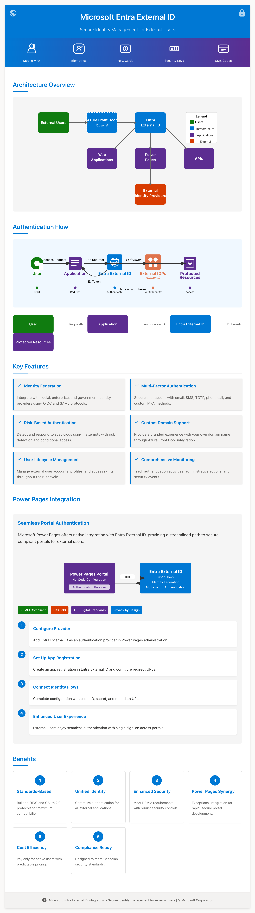
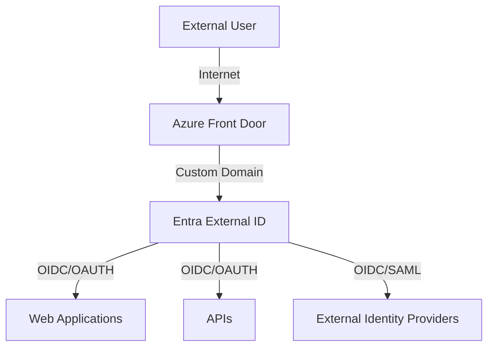
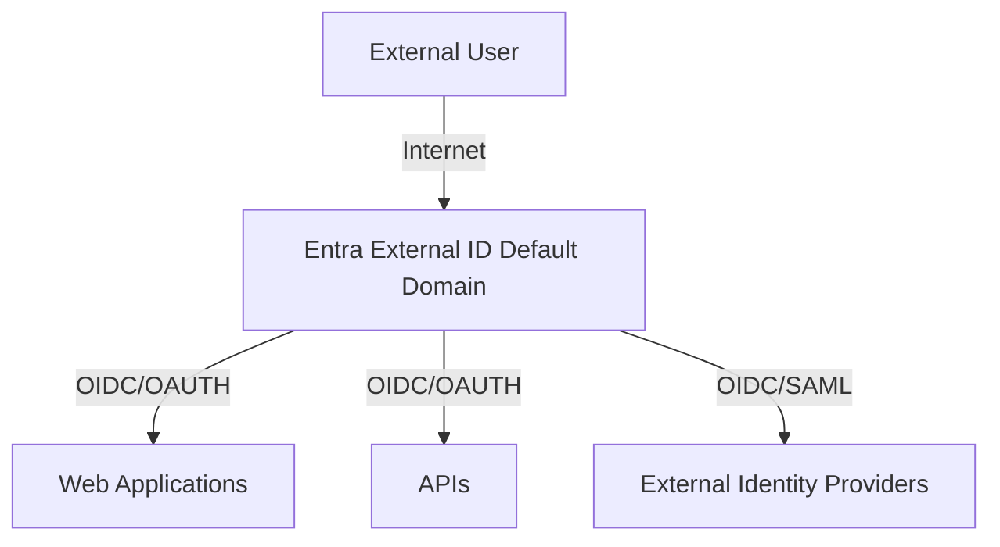

<!-- Include Font Awesome (if using HTML rendering) -->
<link rel="stylesheet" href="https://cdnjs.cloudflare.com/ajax/libs/font-awesome/6.0.0-beta3/css/all.min.css">

<!-- Document Header with Infographic and Canadian Flag -->
<div align="center">
  
  <p>
    <i class="fa fa-id-badge" aria-hidden="true"></i>
    <strong>MICROSOFT ENTRA EXTERNAL ID</strong>
    
  </p>
  <p><i>Secure Identity Management for External Users</i></p>
</div>

## PREFACE <i class="fa fa-info-circle" aria-hidden="true"></i>

This document describes the implementation and operationalization of Microsoft Entra External ID for secure single sign-on (SSO) for portals and API authorization. Microsoft Entra External ID is Microsoft's dedicated identity service for external users, providing business-to-customer identity as a service and offering a streamlined way to secure external-facing web applications and APIs. 

It should be noted that Azure B2C was Microsoft's official external-facing SSO service offering until Entra External ID was introduced as part of Microsoft's rebranding and enhancement of their identity services. Entra External ID exists as its own dedicated Microsoft Entra tenant, separate from an organization's internal Entra ID (formerly Azure AD) tenant, providing a clear separation between employee and external user identities.

Entra External ID has been chosen as the right tool as it provides secure identity management to enable single sign-on access to web applications and APIs while supporting integration with external identity providers through industry-standard protocols like OpenID Connect (OIDC) and SAML 2.0. This is particularly beneficial for organizations leveraging Microsoft Power Pages for external portals, as the integration between Power Pages and Entra External ID is seamless and built-in, requiring minimal configuration while providing enterprise-grade security. 

By using this technology, the organization benefits by centralizing its authentication services into a platform that specializes in this domain while leveraging Microsoft's robust identity toolset including conditional access policies, MFA, groups, monitoring, and automated release pipeline integration. This approach helps the organization meet Canadian digital security requirements such as Protected B, Medium Integrity, Medium Availability (PBMM) compliance and supports the implementation of security controls required by ITSG-33 standards from the Communications Security Establishment (CSE).

## IMPLEMENTATION OPTIONS <i class="fa fa-cogs" aria-hidden="true"></i>

### OPTION 1: ENTRA EXTERNAL ID WITH CUSTOM DOMAIN USING FRONT DOOR <i class="fa fa-globe" aria-hidden="true"></i>



### OPTION 2: ENTRA EXTERNAL ID WITHOUT CUSTOM DOMAIN <i class="fa fa-cloud" aria-hidden="true"></i>



## ALIGNMENT TO CLOUD CONNECTION PATTERNS <i class="fa fa-cloud-upload" aria-hidden="true"></i>

Entra External ID is considered a SAAS-based technology and therefore, only a subset of the standard cloud usage profiles and connection patterns apply:

1. **External user access to cloud-based service**: Non-organizational users accessing cloud-based services  
2. **Service/Application Interoperability**: Service and application communications with cloud-based services  
3. **Cloud Administration and Management**: Management of cloud-based components and support for operations activities

## ENTRA EXTERNAL ID CONNECTION PATTERNS <i class="fa fa-network-wired" aria-hidden="true"></i>

### Web Applications & APIs <i class="fa fa-desktop" aria-hidden="true"></i>

For web applications (any platform that supports OIDC), the application initiates authentication by redirecting users to Entra External ID. The result is an id_token containing identity claims. This applies to all modern application platforms including:

- ASP.NET Core, Java, Ruby, Python, PHP  
- Node.js and Express  
- Single Page Applications (React, Angular, Vue)  
- Mobile applications (iOS, Android)  
- Power Pages and other Microsoft platforms

For APIs, OAuth 2.0 is leveraged to secure endpoints with access tokens, enabling secure machine-to-machine and delegated access scenarios.

### Identity Federation Options <i class="fa fa-share-alt" aria-hidden="true"></i>

Entra External ID provides extensive identity federation options:

1. **Social Identity Providers**: Microsoft, Google, Facebook, etc.  
2. **Enterprise Identity Providers**: Any OIDC or SAML 2.0 compatible IdP  
3. **Government Services**: GCKey, Sign In Canada, etc. via OIDC federation  
4. **Other Entra ID/Azure AD tenants**: Enable seamless SSO with partner organizations  
5. **Local accounts**: Email/password for users without external identities

Federation with other organizational tenants enables true cross-organization collaboration where users can leverage their existing organizational credentials to access your applications, enhancing the user experience while maintaining security boundaries.

## IMPLEMENTATION ARCHITECTURE COMPONENTS <i class="fa fa-sitemap" aria-hidden="true"></i>

### DOMAIN CONFIGURATION <i class="fa fa-globe" aria-hidden="true"></i>

When provisioning Entra External ID, a new dedicated directory tenant is created with a default domain (tenantname.onmicrosoft.com), which is used for authentication endpoints (tenantname.b2clogin.com). 

There are two primary options for custom domain configuration:

1. **Azure Front Door (Recommended for GC)**: Provides CDN capabilities, TLS enforcement, and custom domain support (e.g., signin.agency.canada.ca)  
2. **Native Custom Domain**: Entra External ID supports direct custom domain configuration without Front Door

The custom domain feature enables a branded, consistent user experience that aligns with your organization's web presence.

### KEY VAULT & CERTIFICATES <i class="fa fa-lock" aria-hidden="true"></i>

For secure certificate and secret management, Azure Key Vault integration is recommended. Entra External ID supports certificates for:

- Token signing and encryption  
- App authentication (instead of secrets)  
- TLS for custom domains

### APP REGISTRATIONS <i class="fa fa-user-plus" aria-hidden="true"></i>

Each application integrating with Entra External ID requires an App Registration which provides:
- A Client ID (unique identifier)  
- Authentication credentials (secret or certificate)  
- Reply URLs (authorized redirect endpoints)  
- Logout URLs for single sign-out

## STANDARDIZED AUTHENTICATION WITH OPENID CONNECT <i class="fa fa-key" aria-hidden="true"></i>

Entra External ID fully implements the OpenID Connect (OIDC) protocol, which is built on OAuth 2.0 and provides a standardized way to authenticate users and obtain basic profile information. 

The key benefits of OIDC include:
- Industry-standard protocol supported by most modern platforms  
- Simple REST/JSON based implementation  
- Designed for modern web and mobile applications  
- Well-defined security practices and validation mechanisms

For applications that must integrate with legacy SAML 2.0 identity providers, Entra External ID provides federation capabilities to bridge these technologies while still presenting a modern OIDC interface to applications.

### Integration with External OIDC Providers <i class="fa fa-external-link-alt" aria-hidden="true"></i>

Entra External ID can integrate with any OIDC-compliant provider, including:

1. **Government Identity Services**: GCKey, Sign In Canada  
2. **Other Microsoft Entra Tenants**: Partner organization directories  
3. **Third-party Identity Providers**: Any provider supporting OIDC

This enables a true federation hub architecture where Entra External ID serves as the central authentication service while delegating actual identity verification to trusted external providers.

## MONITORING AND SECURITY <i class="fa fa-shield-alt" aria-hidden="true"></i>

Entra External ID includes comprehensive monitoring and security features:

- **Sign-in Logs**: Track all authentication activities  
- **Audit Logs**: Record administrative actions  
- **Risk Detection**: Identify suspicious authentication patterns (P2)  
- **Azure Monitor Integration**: Extended log retention and analytics  
- **Microsoft Sentinel Integration**: Advanced security analysis

## MULTI-FACTOR AUTHENTICATION SUPPORT <i class="fa fa-mobile-alt" aria-hidden="true"></i>

Entra External ID supports multiple MFA methods to secure user authentication:

1. **Email One-Time Passcode**: Verification codes sent via email  
2. **SMS One-Time Passcode**: Codes sent to mobile devices  
3. **Time-based One-Time Password (TOTP)**: Authenticator apps like Microsoft Authenticator  
4. **Phone Call Verification**: Voice calls for authentication  
5. **Custom Factors**: Integration with third-party MFA providers via OIDC claims

MFA can be enforced conditionally based on risk level, application sensitivity, or global policies.

## COST EFFICIENCY <i class="fa fa-dollar-sign" aria-hidden="true"></i>

Entra External ID offers a cost-effective identity solution with transparent, predictable pricing:

- **Per MAU (Monthly Active User) Pricing**: Only pay for actual usage  
- **Tiered Pricing**: Volume discounts for larger deployments  
- **P1 vs P2**: Choose features based on your security requirements  
- **No Hidden Costs**: Included authentications, no per-transaction fees

The P1 tier includes core identity management, MFA, branding, and federation capabilities, while P2 adds advanced security features like Identity Protection, risk-based authentication, and Conditional Access.

## GUARDRAILS AND SECURITY BEST PRACTICES <i class="fa fa-check-circle" aria-hidden="true"></i>

| Guardrail               | Description                                                    | Required     |
|-------------------------|----------------------------------------------------------------|--------------|
| Global Admins           | Have a minimum of 2 Global Admins with MFA enabled             | Yes          |
| Administrator Roles     | Assign least-privilege roles to administrators                 | Yes          |
| Security Groups         | Create Security Group for each application                     | Yes          |
| TLS Version             | Enforce TLS 1.2+ by deploying AFD                                | Yes          |
| Custom Domain           | Use a branded domain (block the Microsoft domain)              | Recommended  |
| Certificates            | Use trusted certificates for domains and token signing         | Yes          |
| Encryption Keys         | Use RSA 2056 or higher for encryption                          | Yes          |
| Authentication Flows    | Avoid implicit flows except where necessary                    | Yes          |
| Logout Implementation   | Enforce Front Channel Logout                                   | Yes          |
| Risk Detection          | Use Identity Protection monitoring services                    | Yes (P2)     |
| Multiple Environments   | Create dev/test and production environments                    | Yes          |
| Log Retention           | Extend audit log retention with Azure Monitor                    | Recommended  |

## CONFIGURING MICROSOFT ENTRA EXTERNAL ID <i class="fa fa-cog" aria-hidden="true"></i>

### BASIC SETUP STEPS

1. Provision the Entra External ID tenant in Azure Portal  
2. Configure administrator access and role assignments  
3. Set up branding and company information  
4. Configure user flows for authentication patterns  
5. Integrate identity providers (social, enterprise, government)  
6. Set up custom domains if required  
7. Configure Azure Front Door for advanced networking (optional)  
8. Create app registrations for applications

### INTEGRATION WITH IDENTITY PROVIDERS <i class="fa fa-user-friends" aria-hidden="true"></i>

For government identity providers like GCKey, the process typically involves:

1. Creating a new OIDC identity provider in Entra External ID  
2. Configuring metadata, client ID and secret  
3. Creating a user flow that uses this identity provider  
4. Providing your metadata endpoint to the identity provider service  
5. Testing and validating the integration

For integration with other organizational Entra ID/Azure AD tenants:

1. Register an application in the external tenant  
2. Configure OIDC provider settings in Entra External ID  
3. Set up user attributes mapping  
4. Create user flows leveraging the external tenant

## ROLES AND RESPONSIBILITIES <i class="fa fa-users" aria-hidden="true"></i>

| Role                                   | Description                                       | Responsibility   |
|----------------------------------------|---------------------------------------------------|------------------|
| Application Administrator              | Register applications and app registrations       | Integration team |
| External Identity Provider Administrator| Configure identity providers                     | Integration team |
| External ID User Flow Administrator    | Manage user flows and attributes                 | Integration team |
| User Administrator                     | Manage user accounts                              | Admin team       |
| Global Administrator                   | Manage tenant-wide settings and roles             | Cloud Ops        |
| TENANT IEF Policy Administrator        | Manage identity experience framework              | Integration team |
| TENANT IEF Keyset Administrator        | Manage encryption keys and certificates           | Security team    |
| Global Reader                          | Read-only access to tenant settings               | Monitoring team  |
| Domain Administrator                   | Manage custom domains                             | Cloud Ops        |

## INTEGRATION WITH WEB APPLICATIONS <i class="fa fa-laptop" aria-hidden="true"></i>

### Power Pages Integration <i class="fa fa-puzzle-piece" aria-hidden="true"></i>

Microsoft Power Pages (formerly Power Apps Portals) offers exceptional integration with Entra External ID, making it the premier choice for Canadian government agencies looking to rapidly deploy secure external portals:

- **Native Integration**: Power Pages includes built-in providers specifically for Entra External ID  
- **No-Code Configuration**: Authentication setup is managed through a simple admin interface  
- **Security Compliance**: The combined solution supports PBMM (Protected B, Medium Integrity, Medium Availability) requirements  
- **Claims Mapping**: Automatically maps identity claims to portal user profiles  
- **Session Management**: Integrated session handling with secure token storage  
- **Multi-Step Registration**: Support for progressive profiling and structured registration

The integration helps satisfy key security controls defined in ITSG-33, including:

- AC-2: Account Management  
- AC-3: Access Enforcement  
- IA-2: Identification and Authentication  
- IA-5: Authenticator Management  
- AU-2: Audit Events

### Other Application Platforms <i class="fa fa-th" aria-hidden="true"></i>

Beyond Power Pages, Entra External ID can integrate with any application platform that supports OIDC or SAML protocols, including:

- **ASP.NET Core**: Microsoft Identity Web library  
- **Node.js**: Passport.js with OIDC  
- **Java**: Spring Security or other OIDC libraries  
- **Python**: Flask-OIDC, Django OIDC, etc.  
- **SPA Frameworks**: MSAL.js, Auth0.js, etc.  
- **Mobile**: MSAL for iOS/Android, AppAuth  
- **APIs**: OAuth 2.0 bearer tokens

For each integration, the basic pattern involves:
1. Creating an app registration in Entra External ID  
2. Configuring the application with client ID, tenant, and endpoints  
3. Implementing the authorization code flow for web apps  
4. Setting up token validation and claims processing

## BENEFITS OF ENTRA EXTERNAL ID <i class="fa fa-star" aria-hidden="true"></i>

1. **Standards-Based**: Built on OIDC and OAuth 2.0 protocols for maximum compatibility with modern security standards  
2. **Unified Identity**: One centralized identity service for all external applications  
3. **Enhanced Security**: MFA, Conditional Access, and risk-based policies to meet PBMM requirements  
4. **Seamless Federation**: Integrate with any identity provider (including GCKey and other government services)  
5. **Cross-Organization SSO**: Enable users from partner organizations to access your applications  
6. **Cost Efficiency**: Pay only for active users with predictable monthly pricing  
7. **Power Pages Synergy**: Exceptional integration with Power Pages for rapid, secure portal development  
8. **Canadian Security Compliance**: Designed to help meet ITSG-33, PBMM, and other Canadian security frameworks  
9. **Comprehensive Monitoring**: Built-in auditing and reporting for security oversight  
10. **Reduced Development Time**: Focus on applications rather than identity infrastructure, accelerating time-to-market  
11. **Customizable Experience**: Brandable login experiences that maintain organizational identity  
12. **Continuous Improvement**: Regular updates and new features from Microsoft

### CANADIAN DIGITAL SECURITY ALIGNMENT <i class="fa fa-flag" aria-hidden="true"></i>

Entra External ID supports key Canadian security requirements:

- **PBMM Compliance**: Supports Protected B data classification with Medium integrity and availability requirements  
- **ITSG-33 Controls**: Maps to security controls for identification, authentication, and access management  
- **TBS Digital Standards**: Aligns with Government of Canada digital standards for secure service delivery  
- **CSE Security Guidelines**: Compatible with Canadian Centre for Cyber Security guidance for cloud services  
- **Privacy by Design**: Supports privacy principles required by Canadian privacy regulations

By implementing Entra External ID following the approach outlined in this document, organizations can create a secure, scalable, and user-friendly authentication system for external users while meeting security requirements and leveraging industry standards.

---

### Notes

- **Icons:**  
  The `<i class="fa fa-..." aria-hidden="true"></i>` tags add embedded icons from Font Awesome. Ensure that Font Awesome is loaded in your environment.

- **Mermaid Diagrams:**  
  The code blocks with ```mermaid contain the architecture diagrams.

- **Styling:**  
  The header includes the Canadian flag image inline with the title.